# Tool Integration and Execution

<details>
<summary>Relevant source files</summary>

The following files were used as context for generating this wiki page:

- [examples/bird-checker-with-express/src/index.ts](examples/bird-checker-with-express/src/index.ts)
- [examples/bird-checker-with-nextjs-and-eval/src/lib/mastra/actions.ts](examples/bird-checker-with-nextjs-and-eval/src/lib/mastra/actions.ts)
- [packages/core/src/action/index.ts](packages/core/src/action/index.ts)
- [packages/core/src/agent/**tests**/utils.test.ts](packages/core/src/agent/__tests__/utils.test.ts)
- [packages/core/src/agent/agent-legacy.ts](packages/core/src/agent/agent-legacy.ts)
- [packages/core/src/agent/agent.test.ts](packages/core/src/agent/agent.test.ts)
- [packages/core/src/agent/agent.ts](packages/core/src/agent/agent.ts)
- [packages/core/src/agent/agent.types.ts](packages/core/src/agent/agent.types.ts)
- [packages/core/src/agent/index.ts](packages/core/src/agent/index.ts)
- [packages/core/src/agent/trip-wire.ts](packages/core/src/agent/trip-wire.ts)
- [packages/core/src/agent/types.ts](packages/core/src/agent/types.ts)
- [packages/core/src/agent/utils.ts](packages/core/src/agent/utils.ts)
- [packages/core/src/agent/workflows/prepare-stream/index.ts](packages/core/src/agent/workflows/prepare-stream/index.ts)
- [packages/core/src/agent/workflows/prepare-stream/map-results-step.ts](packages/core/src/agent/workflows/prepare-stream/map-results-step.ts)
- [packages/core/src/agent/workflows/prepare-stream/prepare-memory-step.ts](packages/core/src/agent/workflows/prepare-stream/prepare-memory-step.ts)
- [packages/core/src/agent/workflows/prepare-stream/prepare-tools-step.ts](packages/core/src/agent/workflows/prepare-stream/prepare-tools-step.ts)
- [packages/core/src/agent/workflows/prepare-stream/stream-step.ts](packages/core/src/agent/workflows/prepare-stream/stream-step.ts)
- [packages/core/src/llm/index.ts](packages/core/src/llm/index.ts)
- [packages/core/src/llm/model/model.loop.ts](packages/core/src/llm/model/model.loop.ts)
- [packages/core/src/llm/model/model.loop.types.ts](packages/core/src/llm/model/model.loop.types.ts)
- [packages/core/src/llm/model/model.test.ts](packages/core/src/llm/model/model.test.ts)
- [packages/core/src/llm/model/model.ts](packages/core/src/llm/model/model.ts)
- [packages/core/src/loop/**snapshots**/loop.test.ts.snap](packages/core/src/loop/__snapshots__/loop.test.ts.snap)
- [packages/core/src/loop/index.ts](packages/core/src/loop/index.ts)
- [packages/core/src/loop/loop.test.ts](packages/core/src/loop/loop.test.ts)
- [packages/core/src/loop/loop.ts](packages/core/src/loop/loop.ts)
- [packages/core/src/loop/test-utils/fullStream.ts](packages/core/src/loop/test-utils/fullStream.ts)
- [packages/core/src/loop/test-utils/generateText.ts](packages/core/src/loop/test-utils/generateText.ts)
- [packages/core/src/loop/test-utils/options.ts](packages/core/src/loop/test-utils/options.ts)
- [packages/core/src/loop/test-utils/resultObject.ts](packages/core/src/loop/test-utils/resultObject.ts)
- [packages/core/src/loop/test-utils/streamObject.ts](packages/core/src/loop/test-utils/streamObject.ts)
- [packages/core/src/loop/test-utils/textStream.ts](packages/core/src/loop/test-utils/textStream.ts)
- [packages/core/src/loop/test-utils/tools.ts](packages/core/src/loop/test-utils/tools.ts)
- [packages/core/src/loop/test-utils/utils.ts](packages/core/src/loop/test-utils/utils.ts)
- [packages/core/src/loop/types.ts](packages/core/src/loop/types.ts)
- [packages/core/src/loop/workflows/agentic-execution/llm-execution-step.test.ts](packages/core/src/loop/workflows/agentic-execution/llm-execution-step.test.ts)
- [packages/core/src/loop/workflows/agentic-execution/llm-execution-step.ts](packages/core/src/loop/workflows/agentic-execution/llm-execution-step.ts)
- [packages/core/src/loop/workflows/agentic-execution/tool-call-step.test.ts](packages/core/src/loop/workflows/agentic-execution/tool-call-step.test.ts)
- [packages/core/src/loop/workflows/agentic-execution/tool-call-step.ts](packages/core/src/loop/workflows/agentic-execution/tool-call-step.ts)
- [packages/core/src/mastra/index.ts](packages/core/src/mastra/index.ts)
- [packages/core/src/observability/types/tracing.ts](packages/core/src/observability/types/tracing.ts)
- [packages/core/src/stream/aisdk/v5/compat/prepare-tools.test.ts](packages/core/src/stream/aisdk/v5/compat/prepare-tools.test.ts)
- [packages/core/src/stream/aisdk/v5/compat/prepare-tools.ts](packages/core/src/stream/aisdk/v5/compat/prepare-tools.ts)
- [packages/core/src/stream/aisdk/v5/execute.ts](packages/core/src/stream/aisdk/v5/execute.ts)
- [packages/core/src/stream/aisdk/v5/output-helpers.ts](packages/core/src/stream/aisdk/v5/output-helpers.ts)
- [packages/core/src/stream/base/output.ts](packages/core/src/stream/base/output.ts)
- [packages/core/src/stream/types.ts](packages/core/src/stream/types.ts)
- [packages/core/src/tools/index.ts](packages/core/src/tools/index.ts)
- [packages/core/src/tools/provider-tool-utils.test.ts](packages/core/src/tools/provider-tool-utils.test.ts)
- [packages/core/src/tools/provider-tool-utils.ts](packages/core/src/tools/provider-tool-utils.ts)
- [packages/core/src/tools/tool-builder/builder.test.ts](packages/core/src/tools/tool-builder/builder.test.ts)
- [packages/core/src/tools/tool-builder/builder.ts](packages/core/src/tools/tool-builder/builder.ts)
- [packages/core/src/tools/tool.ts](packages/core/src/tools/tool.ts)
- [packages/core/src/tools/toolchecks.test.ts](packages/core/src/tools/toolchecks.test.ts)
- [packages/core/src/tools/toolchecks.ts](packages/core/src/tools/toolchecks.ts)
- [packages/core/src/tools/types.ts](packages/core/src/tools/types.ts)

</details>

This document describes how tools are integrated into agents and executed within the Mastra framework. It covers tool type conversion, schema compatibility, execution contexts, client-side vs server-side execution patterns, approval mechanisms, and validation workflows.

For information about defining tools using `createTool`, see [6.1](#6.1). For tool builder architecture and schema conversion internals, see [6.2](#6.2). For agent configuration and general execution, see [3.1](#3.1).

## Tool Types and Formats

The Mastra framework supports multiple tool formats to ensure compatibility across different AI SDK versions and external tool providers.

### Supported Tool Types

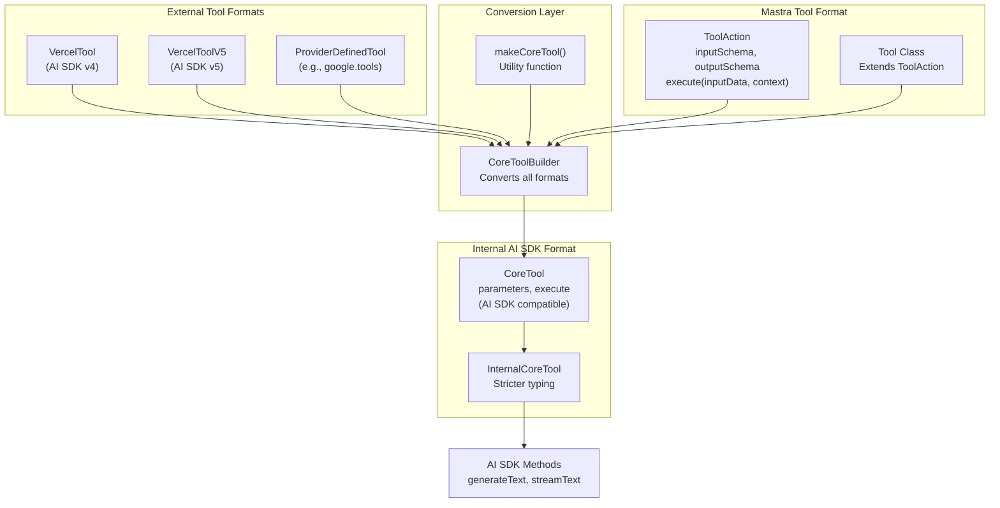

**Sources**: [packages/core/src/tools/types.ts:28-54](), [packages/core/src/tools/tool-builder/builder.ts:26-31](), [packages/core/src/utils.ts:378-475]()

The framework distinguishes between:

| Tool Type             | Source             | Execute Signature      | Schema Property               |
| --------------------- | ------------------ | ---------------------- | ----------------------------- |
| `ToolAction`          | Mastra v1.0        | `(inputData, context)` | `inputSchema`                 |
| `VercelTool`          | AI SDK v4          | `(params, options)`    | `parameters`                  |
| `VercelToolV5`        | AI SDK v5          | `(params, options)`    | `inputSchema`                 |
| `ProviderDefinedTool` | External providers | `(params, options)`    | `parameters` or `inputSchema` |

All formats are converted to `CoreTool` format for execution via the `CoreToolBuilder` class.

**Sources**: [packages/core/src/tools/types.ts:184-208](), [packages/core/src/agent/types.ts:48-54]()

## CoreToolBuilder: Schema Conversion and Compatibility

The `CoreToolBuilder` class is responsible for converting tools from various formats into the AI SDK-compatible `CoreTool` format, applying schema compatibility transformations, and wrapping execute functions with validation logic.

### Tool Conversion Architecture

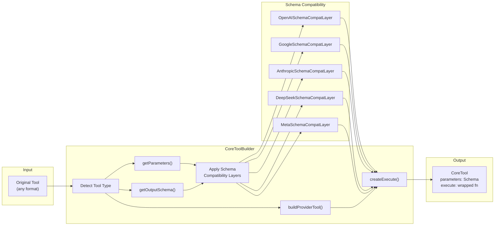

**Sources**: [packages/core/src/tools/tool-builder/builder.ts:44-80](), [packages/core/src/tools/tool-builder/builder.ts:82-149]()

### Schema Extraction and Compatibility

The `CoreToolBuilder` handles schema extraction for different tool formats:

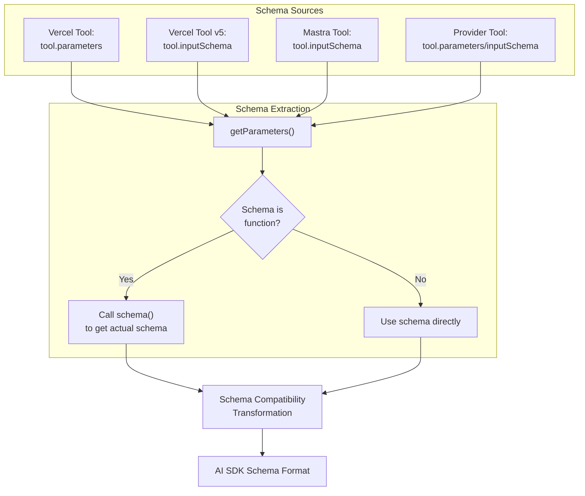

**Sources**: [packages/core/src/tools/tool-builder/builder.ts:82-109](), [packages/core/src/tools/tool-builder/builder.ts:111-137]()

Provider-specific schema compatibility is applied based on model information. For example, OpenAI reasoning models don't support regex patterns, so `OpenAIReasoningSchemaCompatLayer` removes them. Similarly, `AnthropicSchemaCompatLayer` enforces length limits.

**Sources**: [packages/core/src/llm/model/model.ts:91-117]()

### Provider-Defined Tools

Provider-defined tools (like `google.tools.googleSearch()`) have a special handling path:

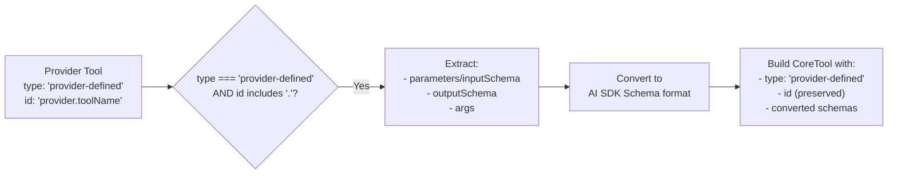

**Sources**: [packages/core/src/tools/tool-builder/builder.ts:155-219]()

## Tool Execution Context

Tools execute with different context properties depending on whether they're called from an agent, workflow, or MCP server.

### Unified Execution Context Structure

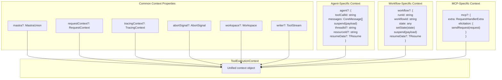

**Sources**: [packages/core/src/tools/types.ts:242-280]()

### Context Population Based on Execution Source

The context is populated differently based on where the tool is executed:

| Property           | Agent Execution       | Workflow Execution    | MCP Execution          |
| ------------------ | --------------------- | --------------------- | ---------------------- |
| `agent.toolCallId` | ✓ Always present      | ✗                     | ✗                      |
| `agent.suspend`    | ✓ Suspends agent      | ✗                     | ✗                      |
| `workflow.runId`   | ✗                     | ✓ Always present      | ✗                      |
| `workflow.state`   | ✗                     | ✓ Workflow state      | ✗                      |
| `mcp.extra`        | ✗                     | ✗                     | ✓ MCP protocol context |
| `writer`           | ✓ Wraps with metadata | ✓ Wraps with metadata | ✓ Wraps with metadata  |
| `workspace`        | ✓ If configured       | ✓ If configured       | ✗                      |

**Sources**: [packages/core/src/tools/types.ts:32-98]()

## Tool Execution Flow in Agents

When an agent executes, tools go through several transformation and validation stages before and after execution.

### Agent Tool Preparation Pipeline

```mermaid
graph TB
    AgentExecute["Agent.generate() or<br/>Agent.stream() called"]

    PrepareStream["prepare-stream Workflow"]

    PrepareToolsStep["prepare-tools-step<br/>(parallel with prepare-memory-step)"]

    ListTools["agent.listTools()<br/>Resolve dynamic tools"]

    ConvertTools["Convert each tool:<br/>CoreToolBuilder.toCoreTools()"]

    BuildExecute["Wrap execute with:<br/>- Input validation<br/>- Output validation<br/>- Suspend/resume support<br/>- Workspace injection<br/>- Tracing"]

    InjectWorkspace["Inject workspace tools<br/>if workspace configured"]

    MapResultsStep["map-results-step<br/>Prepare args for LLM"]

    StreamStep["stream-step<br/>Call LLM with tools"]

    LLMToolCall["LLM requests tool call"]

    ExecuteWrapper["CoreToolBuilder.createExecute()<br/>wrapped function"]

    ValidateInput["Validate input against<br/>inputSchema (if present)"]

    ToolExecute["Original tool.execute()<br/>with ToolExecutionContext"]

    ValidateOutput["Validate output against<br/>outputSchema (if present)"]

    ReturnResult["Return result to LLM"]

    AgentExecute --> PrepareStream
    PrepareStream --> PrepareToolsStep
    PrepareToolsStep --> ListTools
    ListTools --> InjectWorkspace
    InjectWorkspace --> ConvertTools
    ConvertTools --> BuildExecute
    BuildExecute --> MapResultsStep
    MapResultsStep --> StreamStep
    StreamStep --> LLMToolCall
    LLMToolCall --> ExecuteWrapper
    ExecuteWrapper --> ValidateInput
    ValidateInput --> ToolExecute
    ToolExecute --> ValidateOutput
    ValidateOutput --> ReturnResult
```

**Sources**: [packages/core/src/agent/workflows/prepare-stream/prepare-tools-step.ts:1-100](), [packages/core/src/tools/tool-builder/builder.ts:241-328]()

### Tool List Resolution

Tools can be configured statically or dynamically:

```typescript
// Static tools
const agent = new Agent({
  tools: { weatherTool, calculatorTool },
})

// Dynamic tools based on request context
const agent = new Agent({
  tools: ({ requestContext }) => {
    const userId = requestContext.get('userId')
    return getUserSpecificTools(userId)
  },
})
```

The `listTools()` method resolves dynamic tool functions and merges them with:

1. Workspace tools (if workspace configured)
2. Memory tools (if memory configured)
3. MCP server tools (if MCP servers configured)
4. Configured agent tools
5. Sub-agent tools (if agents configured)

**Sources**: [packages/core/src/agent/agent.ts:1346-1505]()

### Tool Conversion via CoreToolBuilder

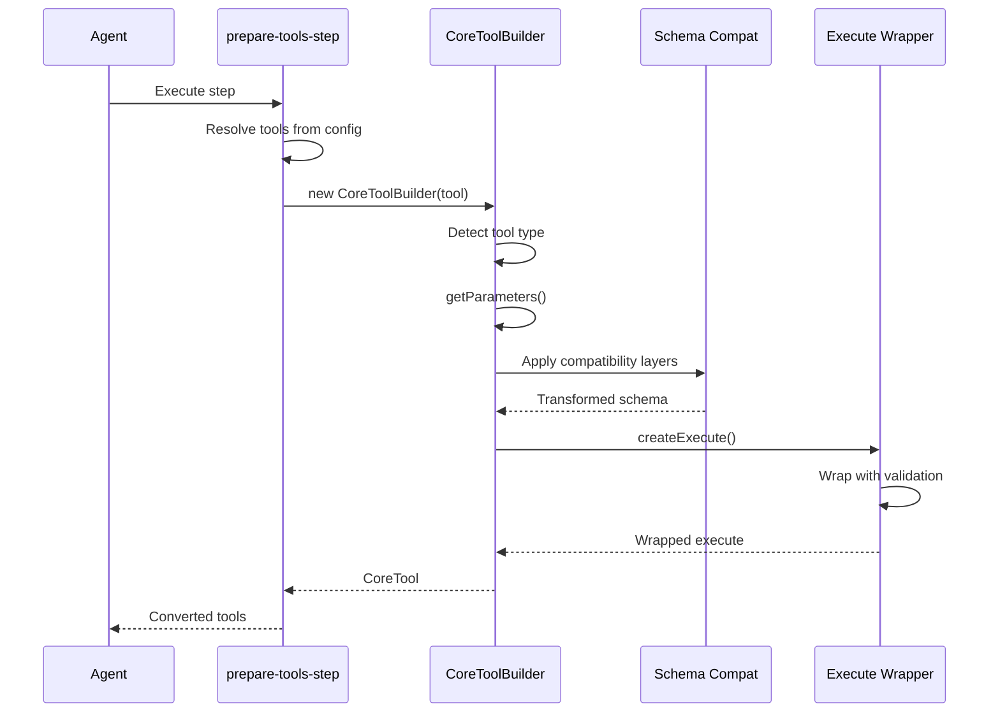

**Sources**: [packages/core/src/agent/workflows/prepare-stream/prepare-tools-step.ts:40-82](), [packages/core/src/tools/tool-builder/builder.ts:241-328]()

## Client-Side vs Server-Side Tool Execution

Mastra supports two tool execution patterns: server-side (tools execute on the server during agent execution) and client-side (tools execute on the client after receiving a tool call from the server).

### Execution Pattern Comparison

```mermaid
graph TB
    subgraph "Server-Side Tools"
        AgentGenerate["Agent.generate()<br/>with tools config"]
        LLMCall["LLM API Call"]
        ToolCallServer["LLM returns tool call"]
        ExecuteServer["Tool.execute() on server"]
        ContinueServer["Continue with result"]
        ReturnServer["Return final response"]

        AgentGenerate --> LLMCall
        LLMCall --> ToolCallServer
        ToolCallServer --> ExecuteServer
        ExecuteServer --> ContinueServer
        ContinueServer --> ReturnServer
    end

    subgraph "Client-Side Tools"
        AgentGenClient["Agent.generate()<br/>with clientTools config"]
        LLMCallClient["LLM API Call"]
        ToolCallClient["LLM returns tool call"]
        ReturnToClient["Return tool call to client<br/>finishReason: 'tool-calls'"]
        ClientExecute["Client executes tool"]
        ClientContinue["Client calls agent.generate()<br/>with tool result"]
        FinalResponse["Return final response"]

        AgentGenClient --> LLMCallClient
        LLMCallClient --> ToolCallClient
        ToolCallClient --> ReturnToClient
        ReturnToClient --> ClientExecute
        ClientExecute --> ClientContinue
        ClientContinue --> FinalResponse
    end
```

**Sources**: [packages/core/src/agent/agent.ts:2106-2143](), [client-sdks/client-js/src/resources/agent.ts:43-110]()

### Client-Side Tool Execution Flow

Client-side tools are specified via the `clientTools` parameter:

```typescript
// Server receives clientTools but doesn't execute them
const response = await agent.generate('Turn the light green', {
  clientTools: {
    changeColor: {
      id: 'changeColor',
      description: 'Changes the color of the light',
      inputSchema: z.object({ color: z.string() }),
      execute: async ({ color }) => {
        // This executes on the client
        await setLightColor(color)
        return { success: true }
      },
    },
  },
})

// Check if tool execution is needed
if (response.finishReason === 'tool-calls') {
  // Client SDK handles recursive execution
  for (const toolCall of response.toolCalls) {
    const tool = clientTools[toolCall.payload.toolName]
    const result = await tool.execute(toolCall.payload.args, context)

    // Continue conversation with tool result
    const finalResponse = await agent.generate([
      ...response.messages,
      {
        role: 'tool',
        content: [
          {
            type: 'tool-result',
            toolCallId: toolCall.payload.toolCallId,
            toolName: toolCall.payload.toolName,
            result,
          },
        ],
      },
    ])
  }
}
```

**Sources**: [client-sdks/client-js/src/resources/agent.ts:43-110](), [client-sdks/client-js/src/resources/agent.ts:316-369]()

### Server Processing of Client Tools

The server processes client tools by:

1. Converting them to `CoreTool` format (without execute function)
2. Passing tool schemas to the LLM
3. Returning tool calls without execution when LLM requests them
4. Setting `finishReason: 'tool-calls'`

**Sources**: [packages/core/src/agent/workflows/prepare-stream/prepare-tools-step.ts:54-60](), [packages/core/src/utils.ts:378-475]()

## Tool Approval Mechanism

Tools can require explicit approval before execution via the `requireApproval` property.

### Approval Workflow

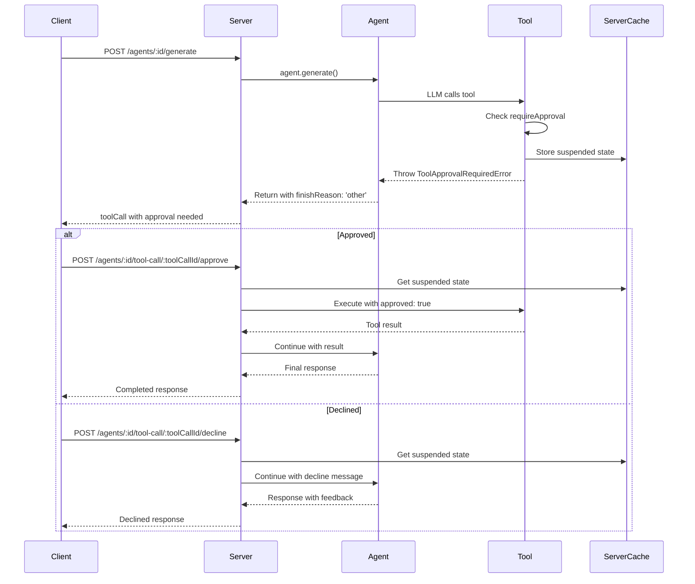

**Sources**: [packages/core/src/tools/tool.ts:217-257](), [packages/server/src/server/handlers/agents.ts:1170-1279]()

### Approval in Tool Execution

The approval check happens in the wrapped execute function:

```typescript
// In CoreToolBuilder.createExecute()
if (tool.requireApproval) {
  // Check if approval has been granted via context
  if (!execOptions.approved) {
    // Store suspended state in server cache
    const suspendId = await storeSuspendedToolCall({
      toolCallId,
      args,
      context: execOptions,
    })

    // Throw error to halt execution
    throw new ToolApprovalRequiredError({
      toolName: tool.id,
      suspendId,
      args,
    })
  }
}

// Execute if approved
const result = await tool.execute(args, context)
```

**Sources**: [packages/core/src/tools/tool.ts:217-257](), [packages/core/src/tools/tool-builder/builder.ts:329-425]()

### Server-Side Approval Endpoints

The server provides endpoints for approving or declining tool calls:

| Endpoint                                    | Method | Purpose                  |
| ------------------------------------------- | ------ | ------------------------ |
| `/agents/:id/tool-call/:toolCallId/approve` | POST   | Approve and execute tool |
| `/agents/:id/tool-call/:toolCallId/decline` | POST   | Decline tool execution   |

Both endpoints:

1. Retrieve suspended state from `ServerCache`
2. Reconstruct the execution context
3. Either execute the tool (approve) or continue with decline message (decline)
4. Clean up the suspended state from cache

**Sources**: [packages/server/src/server/handlers/agents.ts:1170-1279]()

## Schema Validation and Compatibility

Tool input and output validation uses Zod schemas with provider-specific compatibility transformations.

### Validation Pipeline

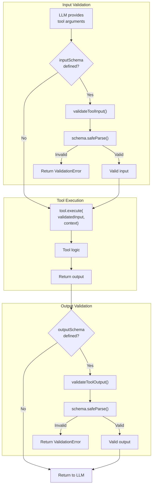

**Sources**: [packages/core/src/tools/tool-builder/builder.ts:329-399](), [packages/core/src/tools/validation.ts:1-150]()

### Provider-Specific Schema Transformations

Different LLM providers have different schema requirements. Mastra applies compatibility layers to ensure schemas work across providers:

| Provider           | Schema Limitation                     | Compatibility Layer                                     |
| ------------------ | ------------------------------------- | ------------------------------------------------------- |
| OpenAI (reasoning) | No regex patterns                     | `OpenAIReasoningSchemaCompatLayer` removes regex        |
| OpenAI (general)   | Optional fields need special handling | `OpenAISchemaCompatLayer` converts optional to nullable |
| Google             | Specific format requirements          | `GoogleSchemaCompatLayer` transforms structure          |
| Anthropic          | String/array length limits            | `AnthropicSchemaCompatLayer` enforces limits            |
| DeepSeek           | Custom requirements                   | `DeepSeekSchemaCompatLayer`                             |
| Meta               | Custom requirements                   | `MetaSchemaCompatLayer`                                 |

**Sources**: [packages/core/src/tools/tool-builder/builder.ts:8-11](), [packages/core/src/llm/model/model.ts:92-116]()

### Validation Error Handling

Validation errors return structured error information rather than throwing:

```typescript
// Input validation failure
{
  error: {
    type: 'validation',
    message: 'Input validation failed',
    issues: [
      { path: ['location'], message: 'Required' }
    ]
  }
}

// Output validation failure
{
  error: {
    type: 'validation',
    message: 'Output validation failed',
    issues: [
      { path: ['temperature'], message: 'Expected number, received string' }
    ]
  }
}
```

**Sources**: [packages/core/src/tools/validation.ts:1-150](), [packages/core/src/tools/types.ts:282-292]()

## Advanced Tool Features

### Suspend and Resume

Tools can suspend execution to wait for external input (e.g., human approval, async processes):

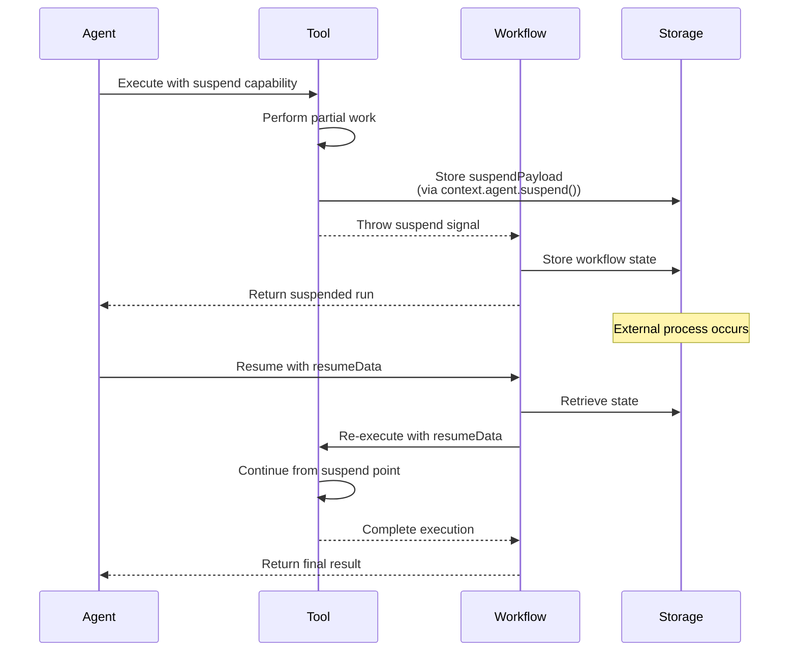

**Sources**: [packages/core/src/tools/types.ts:32-98](), [packages/core/src/tools/tool-builder/builder.ts:329-399]()

Tools define suspend/resume schemas:

```typescript
const asyncProcessTool = createTool({
  id: 'async-process',
  inputSchema: z.object({ taskId: z.string() }),
  suspendSchema: z.object({ processId: z.string() }),
  resumeSchema: z.object({ result: z.any() }),
  execute: async (input, context) => {
    // Check if resuming
    if (context.agent?.resumeData) {
      return context.agent.resumeData.result
    }

    // Start process and suspend
    const processId = await startAsyncProcess(input.taskId)
    await context.agent?.suspend({ processId })

    // This line never reached on first execution
    // Only reached after resume
  },
})
```

**Sources**: [packages/core/src/tools/tool.ts:84-89](), [packages/core/src/tools/validation.ts:52-86]()

### Tool Streaming

Tools can stream output chunks using the `writer` property:

```typescript
const streamingTool = createTool({
  id: 'stream-data',
  execute: async (input, context) => {
    for (let i = 0; i < 10; i++) {
      // Write chunk to stream
      await context.writer?.write({
        type: 'text-delta',
        delta: `Processing step ${i}...\
`,
      })
      await delay(100)
    }

    return { completed: true }
  },
})
```

The `writer` is a `ToolStream` instance that wraps chunks with metadata (toolCallId, toolName, runId) before passing to the underlying stream.

**Sources**: [packages/core/src/tools/stream.ts:1-100](), [packages/core/src/tools/types.ts:261-265]()

### Workspace Integration

Tools can access the agent's workspace for file operations and code execution:

```typescript
const fileProcessorTool = createTool({
  id: 'process-file',
  inputSchema: z.object({
    filepath: z.string(),
    operation: z.enum(['read', 'write', 'delete']),
  }),
  execute: async (input, context) => {
    const workspace = context.workspace

    if (!workspace?.filesystem) {
      throw new Error('Workspace not configured')
    }

    switch (input.operation) {
      case 'read':
        return await workspace.filesystem.read(input.filepath)
      case 'write':
        return await workspace.filesystem.write(input.filepath, 'content')
      case 'delete':
        return await workspace.filesystem.delete(input.filepath)
    }
  },
})
```

Workspace is available via `context.workspace` and can be:

- Configured at agent level (inherited by tools)
- Overridden at tool execution time
- Used for filesystem, sandbox, and search operations

**Sources**: [packages/core/src/tools/types.ts:252-261](), [packages/core/src/tools/tool-builder/builder.ts:317-328]()
