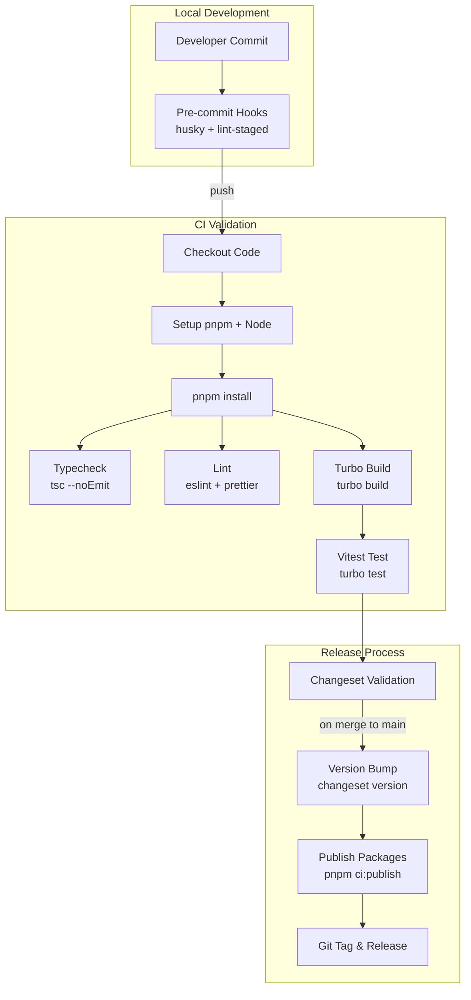
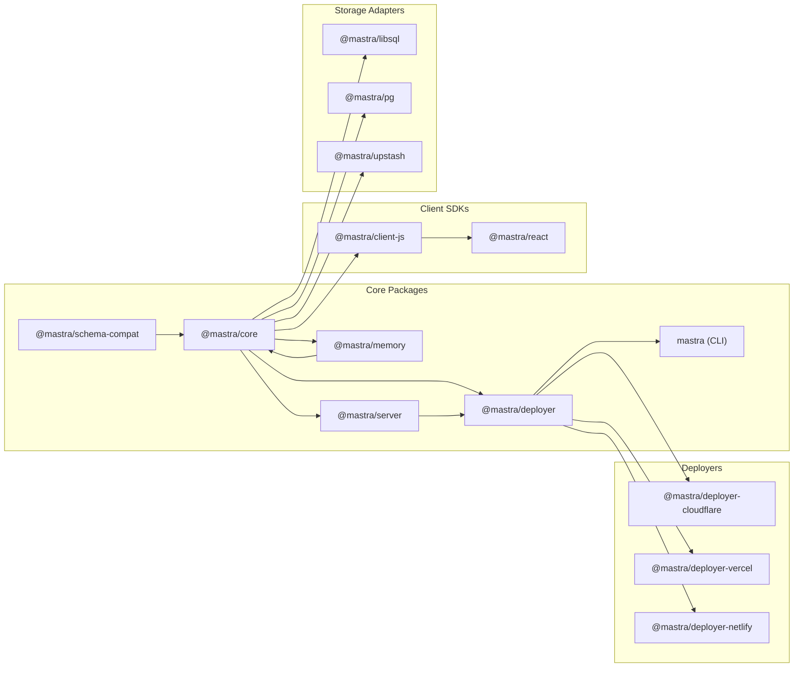
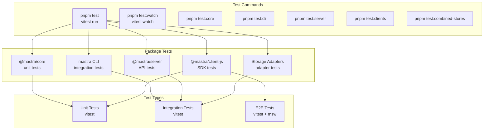
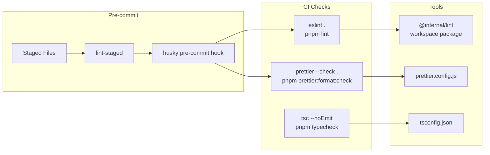
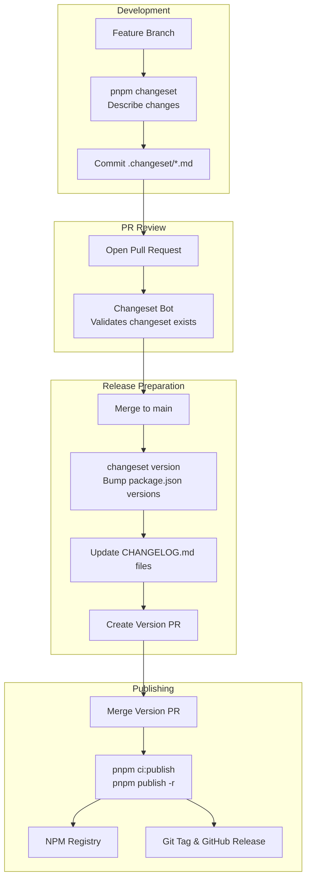
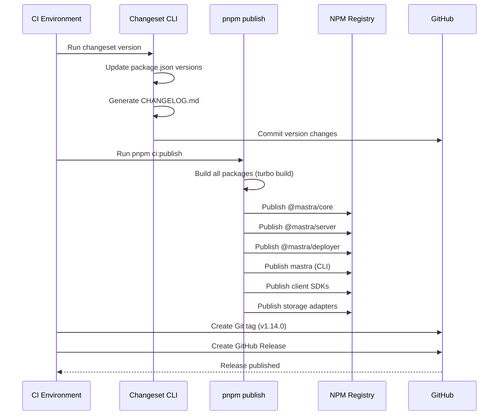
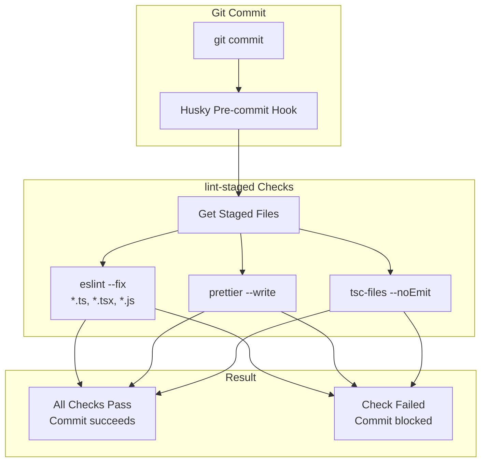
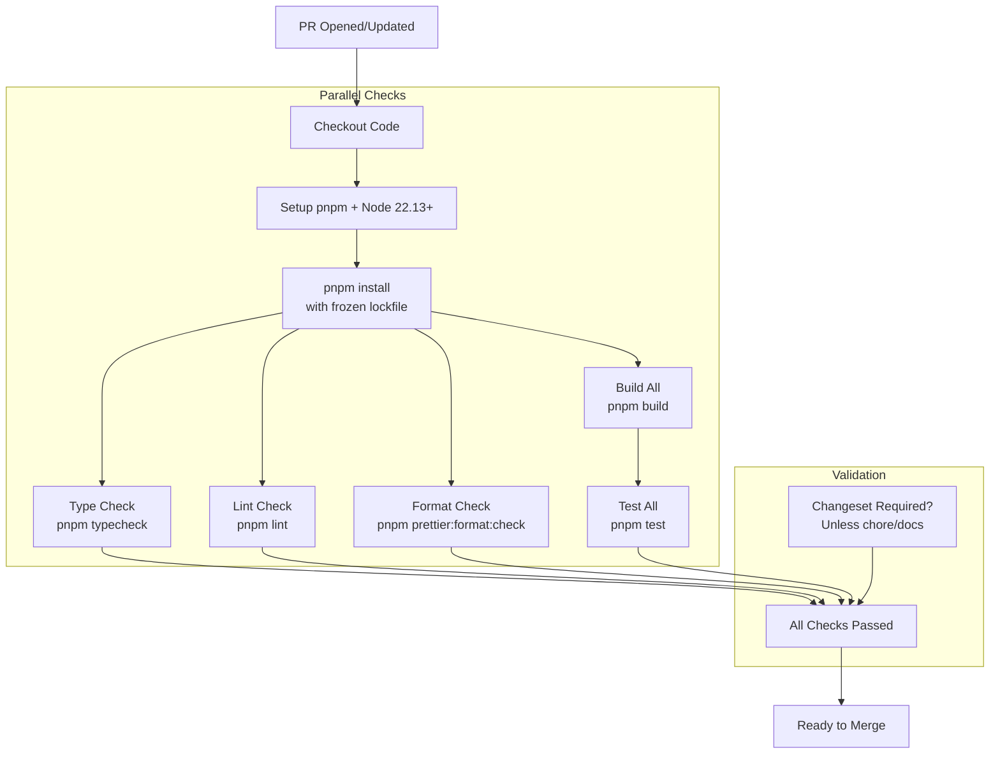
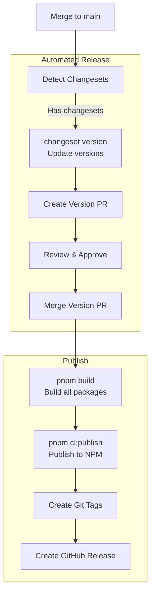

# GitHub Actions and CI Workflows

<details>
<summary>Relevant source files</summary>

The following files were used as context for generating this wiki page:

- [.changeset/pre.json](.changeset/pre.json)
- [client-sdks/client-js/CHANGELOG.md](client-sdks/client-js/CHANGELOG.md)
- [client-sdks/client-js/package.json](client-sdks/client-js/package.json)
- [client-sdks/react/package.json](client-sdks/react/package.json)
- [deployers/cloudflare/CHANGELOG.md](deployers/cloudflare/CHANGELOG.md)
- [deployers/cloudflare/package.json](deployers/cloudflare/package.json)
- [deployers/netlify/CHANGELOG.md](deployers/netlify/CHANGELOG.md)
- [deployers/netlify/package.json](deployers/netlify/package.json)
- [deployers/vercel/CHANGELOG.md](deployers/vercel/CHANGELOG.md)
- [deployers/vercel/package.json](deployers/vercel/package.json)
- [examples/dane/CHANGELOG.md](examples/dane/CHANGELOG.md)
- [examples/dane/package.json](examples/dane/package.json)
- [package.json](package.json)
- [packages/cli/CHANGELOG.md](packages/cli/CHANGELOG.md)
- [packages/cli/package.json](packages/cli/package.json)
- [packages/core/CHANGELOG.md](packages/core/CHANGELOG.md)
- [packages/core/package.json](packages/core/package.json)
- [packages/create-mastra/CHANGELOG.md](packages/create-mastra/CHANGELOG.md)
- [packages/create-mastra/package.json](packages/create-mastra/package.json)
- [packages/deployer/CHANGELOG.md](packages/deployer/CHANGELOG.md)
- [packages/deployer/package.json](packages/deployer/package.json)
- [packages/mcp-docs-server/CHANGELOG.md](packages/mcp-docs-server/CHANGELOG.md)
- [packages/mcp-docs-server/package.json](packages/mcp-docs-server/package.json)
- [packages/mcp/CHANGELOG.md](packages/mcp/CHANGELOG.md)
- [packages/mcp/package.json](packages/mcp/package.json)
- [packages/playground-ui/CHANGELOG.md](packages/playground-ui/CHANGELOG.md)
- [packages/playground-ui/package.json](packages/playground-ui/package.json)
- [packages/playground/CHANGELOG.md](packages/playground/CHANGELOG.md)
- [packages/playground/package.json](packages/playground/package.json)
- [packages/server/CHANGELOG.md](packages/server/CHANGELOG.md)
- [packages/server/package.json](packages/server/package.json)
- [pnpm-lock.yaml](pnpm-lock.yaml)

</details>

This document describes the continuous integration and deployment infrastructure for the Mastra monorepo, including the build system, testing strategy, code quality checks, version management, and release automation. The CI pipeline leverages pnpm workspaces, Turbo for parallelized builds, Vitest for testing, and Changesets for versioning and publishing.

For information about the monorepo structure itself, see [Monorepo Configuration and Tooling](#12.1). For testing practices and patterns, see [Testing Infrastructure](#12.2). For release management details, see [Release Management with Changesets](#12.4).

---

## CI/CD Pipeline Architecture

The Mastra monorepo uses a layered CI/CD approach that separates build validation, testing, code quality, and publishing into distinct but coordinated stages.

### Overall Pipeline Flow



**Sources:** [package.json:28-96](), [pnpm-lock.yaml:1-23]()

---

## Monorepo Build System

The build system uses **Turbo** to orchestrate parallel builds across the workspace with intelligent caching and dependency-aware ordering.

### Turbo Build Configuration

The monorepo defines build targets that Turbo coordinates based on package dependencies:



**Build Scripts by Category:**

| Script                  | Purpose                            | Filter Pattern                 |
| ----------------------- | ---------------------------------- | ------------------------------ |
| `build`                 | Build all packages except examples | `--filter "!./examples/*"`     |
| `build:core`            | Build core package only            | `--filter ./packages/core`     |
| `build:cli`             | Build CLI package                  | `--filter ./packages/cli`      |
| `build:deployer`        | Build deployer base                | `--filter ./packages/deployer` |
| `build:server`          | Build server package               | `--filter ./packages/server`   |
| `build:deployers`       | Build all deployer implementations | `--filter "./deployers/*"`     |
| `build:clients`         | Build all client SDKs              | `--filter "./client-sdks/*"`   |
| `build:combined-stores` | Build all storage adapters         | `--filter "./stores/*"`        |

**Sources:** [package.json:32-54]()

### Build Execution Order

Turbo automatically determines the optimal build order based on workspace dependencies. For example:

1. `@mastra/schema-compat` builds first (no dependencies)
2. `@mastra/core` builds next (depends on schema-compat)
3. `@mastra/memory`, `@mastra/server` build in parallel (both depend only on core)
4. `@mastra/deployer` builds after server
5. Platform-specific deployers build after base deployer
6. CLI builds last (depends on deployer)

**Sources:** [packages/core/package.json:1-333](), [packages/deployer/package.json:1-165](), [packages/cli/package.json:1-110]()

---

## Testing Infrastructure

The monorepo uses **Vitest** as the primary testing framework with workspace-aware test organization.

### Test Execution Architecture



**Test Script Patterns:**

| Package             | Test Command     | Test Type                            |
| ------------------- | ---------------- | ------------------------------------ |
| `@mastra/core`      | `pnpm test:unit` | Unit tests excluding tool-builder    |
| `mastra` (CLI)      | `pnpm test`      | Integration tests with memfs mocking |
| `@mastra/server`    | `pnpm test`      | API handler tests                    |
| `@mastra/client-js` | `pnpm test:unit` | SDK unit tests with MSW              |
| `@mastra/deployer`  | `pnpm test`      | Bundler validation tests             |

**Sources:** [package.json:57-82](), [packages/core/package.json:218-220](), [packages/cli/package.json:28](), [packages/server/package.json:94]()

### Coverage Configuration

Vitest coverage is configured via the `@vitest/coverage-v8` catalog reference across all packages:

```typescript
// vitest.config.ts pattern (not shown in files but referenced)
coverage: {
  provider: 'v8',
  reporter: ['text', 'json', 'html']
}
```

**Sources:** [pnpm-lock.yaml:12-17](), [packages/core/package.json:291]()

---

## Code Quality Checks

The CI pipeline enforces code quality through linting, formatting, and type checking before allowing builds to proceed.

### Linting and Formatting



**CI Script Mapping:**

| Script                  | Purpose                    | Scope                                               |
| ----------------------- | -------------------------- | --------------------------------------------------- |
| `lint`                  | Run ESLint across monorepo | `turbo --filter "!./examples/**/*" lint`            |
| `format`                | Auto-fix lint issues       | `turbo lint -- --fix`                               |
| `prettier:format`       | Format all files           | `prettier --write . --log-level warn`               |
| `prettier:format:check` | Check formatting           | `prettier --check .`                                |
| `prettier:changed`      | Format only changed files  | Uses git diff to determine files                    |
| `typecheck`             | Type check all packages    | `pnpm --filter "!./explorations/**/*" -r typecheck` |

**Sources:** [package.json:83-92](), [pnpm-lock.yaml:78-86](), [pnpm-lock.yaml:82-84]()

### Pre-commit Hook Flow

The repository uses **husky** and **lint-staged** to enforce quality checks before commits reach the remote:

1. Developer runs `git commit`
2. Husky triggers `.husky/pre-commit` hook
3. `lint-staged` runs configured checks on staged files:
   - ESLint with auto-fix
   - Prettier formatting
   - TypeScript type checking (via `tsc-files`)

**Sources:** [pnpm-lock.yaml:81-86](), [package.json:82](), [package.json:85]()

---

## Version Management with Changesets

The monorepo uses **Changesets** for coordinated versioning and CHANGELOG generation across packages.

### Changeset Workflow



**Sources:** [pnpm-lock.yaml:60-74](), [package.json:29-31]()

### Changeset Configuration

The monorepo uses a **pre-release mode** for alpha releases:

**Pre-release State:**

```json
{
  "mode": "pre",
  "tag": "alpha",
  "initialVersions": {
    "@mastra/core": "1.14.0",
    "mastra": "1.3.13",
    "@mastra/client-js": "1.9.0"
    // ... other packages
  },
  "changesets": ["green-birds-knock"]
}
```

**Sources:** [.changeset/pre.json:1-127]()

### Changelog Generation

Changesets automatically generate changelogs using the `changesets-changelog-github-local` formatter, which:

1. Groups changes by type (Major, Minor, Patch)
2. Links to GitHub PRs and commits
3. Includes author attribution
4. Tracks dependency updates

Example changelog structure from the codebase:

```markdown
# @mastra/core

## 1.14.0

### Patch Changes

- Update provider registry... ([#14367])
- Fixed provider-executed tool calls... ([#13860])
- Fixed `replaceString` utility... ([#14434])
- Updated dependencies [[`51970b3`], [`4444280`]]
```

**Sources:** [packages/core/CHANGELOG.md:1-100](), [packages/cli/CHANGELOG.md:1-100](), [pnpm-lock.yaml:72-74]()

---

## Publishing Pipeline

The publishing process is coordinated through the `ci:publish` script and Changesets automation.

### Publish Execution Flow



**Publish Scripts:**

| Script          | Command                                       | Purpose                             |
| --------------- | --------------------------------------------- | ----------------------------------- |
| `ci:publish`    | `pnpm publish -r`                             | Publish all changed packages to NPM |
| `changeset-cli` | `changeset`                                   | Trigger changeset CLI directly      |
| `changeset`     | `pnpm --filter @internal/changeset-cli start` | Run changeset via internal wrapper  |

**Sources:** [package.json:29-31]()

### Package Publishing Order

pnpm's `publish -r` (recursive) command respects workspace dependencies and publishes in topological order:

1. **Base packages first**: `@mastra/schema-compat`
2. **Core infrastructure**: `@mastra/core`, `@mastra/memory`
3. **Server and deployment**: `@mastra/server`, `@mastra/deployer`
4. **Platform deployers**: `@mastra/deployer-cloudflare`, `@mastra/deployer-vercel`, `@mastra/deployer-netlify`
5. **CLI last**: `mastra` (depends on all deployment packages)

**Sources:** [package.json:31](), [packages/cli/package.json:94-96](), [packages/deployer/package.json:149-152]()

---

## Pre-commit Hooks and Local Validation

The monorepo enforces code quality locally before code reaches CI, reducing CI failures and feedback cycles.

### Husky and lint-staged Configuration



**Configuration Pattern:**

The repository uses these dev dependencies for pre-commit validation:

| Tool          | Version   | Purpose                      |
| ------------- | --------- | ---------------------------- |
| `husky`       | `^9.1.7`  | Git hook manager             |
| `lint-staged` | `^16.4.0` | Run commands on staged files |
| `tsc-files`   | `^1.1.4`  | Type check only staged files |
| `eslint`      | `^9.39.4` | Linting with auto-fix        |
| `prettier`    | `^3.8.1`  | Code formatting              |

**Sources:** [pnpm-lock.yaml:81-104](), [package.json:82-85]()

### Optimized File Filtering

The monorepo includes optimized scripts to check only changed files, reducing CI time:

```bash
# List changed files against main branch
pnpm list-changed-files

# Filter for files that need prettier
pnpm list-prettier-files

# Format only changed files
pnpm prettier:changed
```

**Sources:** [package.json:88-90]()

---

## CI Workflow Patterns

Based on the tooling configuration, the typical CI workflow follows these patterns:

### Pull Request Validation



### Release Workflow



**Sources:** [package.json:28-96](), [.changeset/pre.json:1-127]()

---

## Build and Test Optimization

The monorepo uses several strategies to optimize CI performance:

### Turbo Caching

Turbo caches build outputs and test results based on input hashes. In CI:

1. **Remote caching** can be configured via `TURBO_TOKEN` and `TURBO_TEAM`
2. **Local caching** speeds up rebuilds when dependencies haven't changed
3. **Task hashing** includes dependencies' output in the cache key

**Sources:** [pnpm-lock.yaml:105-107](), [package.json:32]()

### Workspace Filtering

Scripts use Turbo's `--filter` flag to target specific subsets:

```bash
# Build only packages (skip examples)
turbo build --filter "!./examples/*"

# Test only storage adapters
pnpm --filter "./stores/*" test

# Build only deployers
turbo build --filter "./deployers/*"
```

**Sources:** [package.json:32-54]()

### Parallel Execution

Turbo automatically parallelizes independent tasks:

- All storage adapters can build in parallel
- All deployer packages can build in parallel (after base deployer)
- Tests run in parallel across packages

**Sources:** [package.json:32]()

---

## Environment Requirements

### Node.js and Package Manager

All packages specify strict engine requirements:

```json
{
  "engines": {
    "node": ">=22.13.0"
  },
  "packageManager": "pnpm@10.29.3+sha512..."
}
```

The monorepo enforces pnpm usage via the `preinstall` script:

```bash
npx only-allow pnpm
```

**Sources:** [package.json:98-99](), [package.json:122](), [package.json:84](), [packages/core/package.json:305-307]()

### Catalog Dependencies

The monorepo uses pnpm's catalog feature for consistent versions:

```yaml
catalogs:
  default:
    '@vitest/coverage-v8':
      specifier: 4.0.18
    '@vitest/ui':
      specifier: 4.0.18
    vitest:
      specifier: 4.0.18
    zod:
      specifier: ^4.3.6
    typescript:
      specifier: ^5.9.3
```

Packages reference catalog entries with `catalog:` specifier:

```json
{
  "devDependencies": {
    "vitest": "catalog:",
    "typescript": "catalog:"
  }
}
```

**Sources:** [pnpm-lock.yaml:7-23](), [packages/core/package.json:299]()

---

## Summary

The Mastra CI/CD pipeline is built on modern monorepo tooling:

1. **Build System**: Turbo orchestrates parallel builds with dependency-aware caching
2. **Testing**: Vitest provides fast unit and integration tests across packages
3. **Quality**: ESLint, Prettier, and TypeScript enforce code standards
4. **Versioning**: Changesets automate semantic versioning and changelog generation
5. **Publishing**: Coordinated NPM publishing with topological ordering
6. **Pre-commit**: Husky and lint-staged catch issues before CI runs

The system prioritizes fast feedback, developer experience, and reliable releases across 50+ packages in the monorepo.

**Sources:** [package.json:1-128](), [pnpm-lock.yaml:1-100](), [.changeset/pre.json:1-127]()
