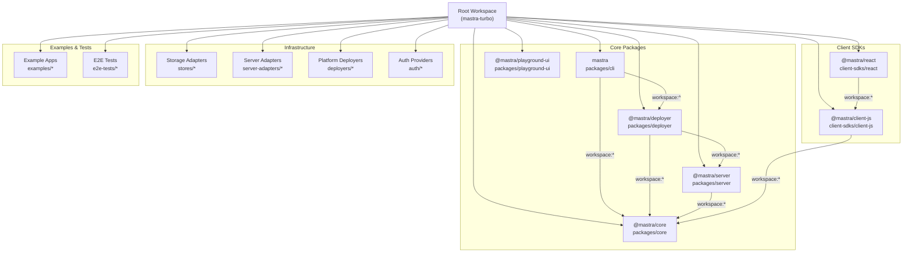
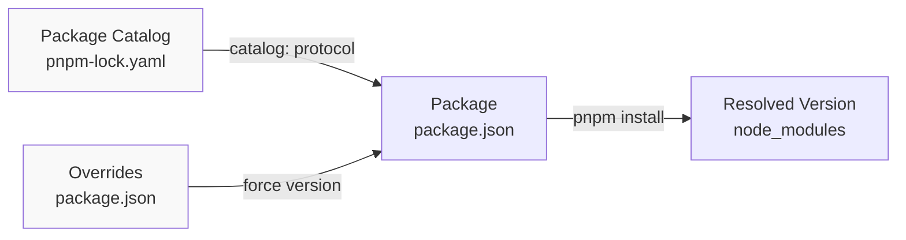
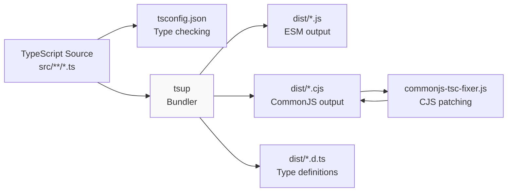
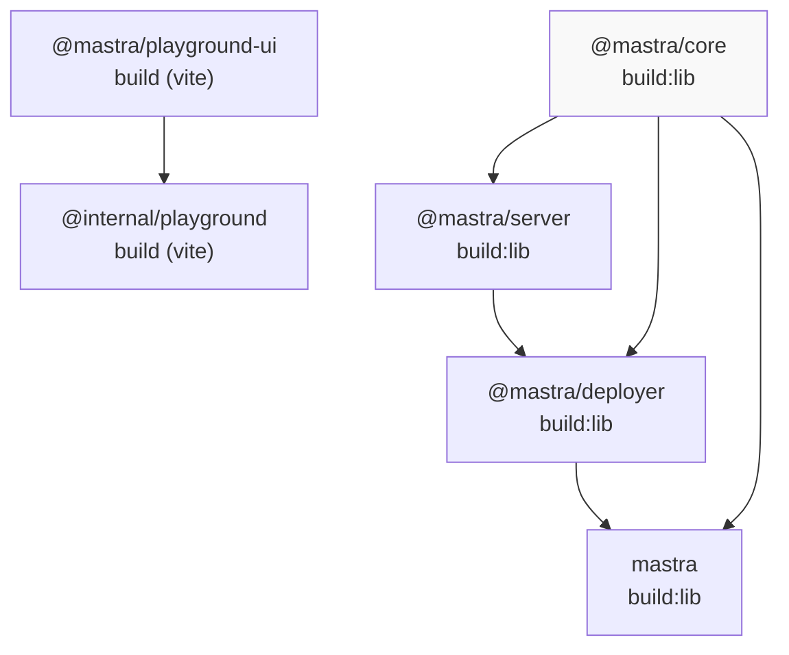
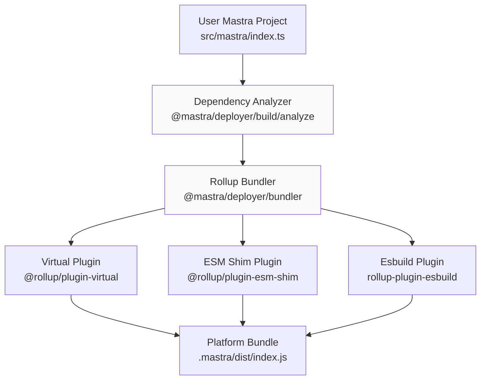
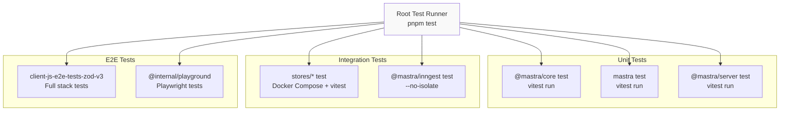
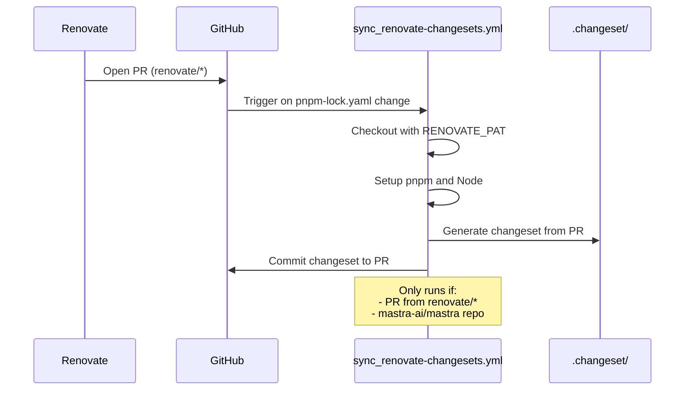
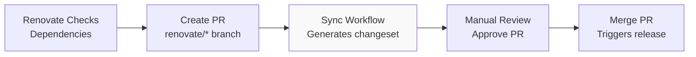
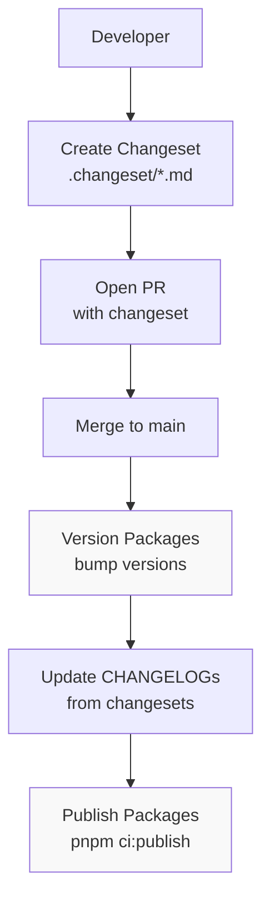
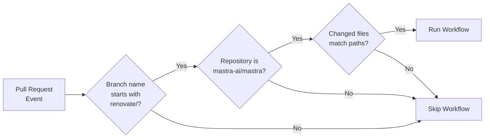

# Build, Test, and CI/CD

<details>
<summary>Relevant source files</summary>

The following files were used as context for generating this wiki page:

- [.changeset/pre.json](.changeset/pre.json)
- [client-sdks/client-js/CHANGELOG.md](client-sdks/client-js/CHANGELOG.md)
- [client-sdks/client-js/package.json](client-sdks/client-js/package.json)
- [client-sdks/react/package.json](client-sdks/react/package.json)
- [deployers/cloudflare/CHANGELOG.md](deployers/cloudflare/CHANGELOG.md)
- [deployers/cloudflare/package.json](deployers/cloudflare/package.json)
- [deployers/netlify/CHANGELOG.md](deployers/netlify/CHANGELOG.md)
- [deployers/netlify/package.json](deployers/netlify/package.json)
- [deployers/vercel/CHANGELOG.md](deployers/vercel/CHANGELOG.md)
- [deployers/vercel/package.json](deployers/vercel/package.json)
- [examples/dane/CHANGELOG.md](examples/dane/CHANGELOG.md)
- [examples/dane/package.json](examples/dane/package.json)
- [package.json](package.json)
- [packages/cli/CHANGELOG.md](packages/cli/CHANGELOG.md)
- [packages/cli/package.json](packages/cli/package.json)
- [packages/core/CHANGELOG.md](packages/core/CHANGELOG.md)
- [packages/core/package.json](packages/core/package.json)
- [packages/create-mastra/CHANGELOG.md](packages/create-mastra/CHANGELOG.md)
- [packages/create-mastra/package.json](packages/create-mastra/package.json)
- [packages/deployer/CHANGELOG.md](packages/deployer/CHANGELOG.md)
- [packages/deployer/package.json](packages/deployer/package.json)
- [packages/mcp-docs-server/CHANGELOG.md](packages/mcp-docs-server/CHANGELOG.md)
- [packages/mcp-docs-server/package.json](packages/mcp-docs-server/package.json)
- [packages/mcp/CHANGELOG.md](packages/mcp/CHANGELOG.md)
- [packages/mcp/package.json](packages/mcp/package.json)
- [packages/playground-ui/CHANGELOG.md](packages/playground-ui/CHANGELOG.md)
- [packages/playground-ui/package.json](packages/playground-ui/package.json)
- [packages/playground/CHANGELOG.md](packages/playground/CHANGELOG.md)
- [packages/playground/package.json](packages/playground/package.json)
- [packages/server/CHANGELOG.md](packages/server/CHANGELOG.md)
- [packages/server/package.json](packages/server/package.json)
- [pnpm-lock.yaml](pnpm-lock.yaml)

</details>

This document describes the monorepo tooling, build system, testing infrastructure, and continuous integration/deployment processes for the Mastra framework. It covers the configuration of pnpm workspaces, Turbo build orchestration, package compilation with tsup/rollup, Vitest testing setup, GitHub Actions workflows, and release management with Changesets.

For information about the CLI's build commands (`mastra build`, `mastra dev`), see [CLI and Development Tools](#8). For deployment-specific build processes, see [Platform Deployers](#8.5).

---

## Monorepo Configuration and Package Management

Mastra uses a pnpm-based monorepo with Turbo for build orchestration and a package catalog for dependency version management.

### Workspace Structure

The monorepo is organized into multiple workspace directories defined in [pnpm-workspace.yaml:1-13]():

```yaml
packages:
  - packages/*
  - client-sdks/*
  - server-adapters/*
  - stores/*
  - deployers/*
  - auth/*
  - observability/*
  - integrations/*
  - speech/*
  - workflows/*
  - workspaces/*
  - examples/*
  - e2e-tests/*
```

Each workspace contains independently versioned packages that can depend on each other using `workspace:*` protocol references. For example, `@mastra/cli` depends on `@mastra/deployer` via [packages/cli/package.json:55]() specifying `"@mastra/deployer": "workspace:^"`.

**Workspace Structure Diagram**



Sources: [pnpm-workspace.yaml:1-13](), [package.json:1-126](), [packages/cli/package.json:52-72]()

### Package Catalog System

Mastra uses pnpm's catalog feature to centralize version management for common dependencies. The catalog is defined in [pnpm-lock.yaml:7-23]():

```yaml
catalogs:
  default:
    '@microsoft/api-extractor':
      specifier: ^7.56.3
      version: 7.56.3
    '@vitest/coverage-v8':
      specifier: 4.0.18
      version: 4.0.18
    '@vitest/ui':
      specifier: 4.0.18
      version: 4.0.18
    vitest:
      specifier: 4.0.18
      version: 4.0.18
    zod:
      specifier: ^4.3.6
      version: 4.3.6
```

Packages reference catalog versions using `catalog:` protocol: [packages/core/package.json:280]() shows `"typescript": "catalog:"` which resolves to the catalog-defined version.

**Dependency Version Resolution**



Sources: [pnpm-lock.yaml:7-23](), [package.json:100-117](), [packages/core/package.json:280]()

### Version Overrides and Patches

The root [package.json:100-117]() defines dependency overrides for security and compatibility:

| Override Type        | Example                                   | Purpose                                        |
| -------------------- | ----------------------------------------- | ---------------------------------------------- |
| Security patches     | `cookie: '>=1.1.1'`                       | Enforce minimum secure versions                |
| Compatibility fixes  | `typescript: '^5.9.3'`                    | Ensure consistent TypeScript version           |
| Package-specific     | `client-js-e2e-tests-zod-v3>zod: ^3.24.0` | Test different Zod versions in isolation       |
| Patched dependencies | `@changesets/get-dependents-graph`        | Apply custom patches from `patches/` directory |

The [pnpm-lock.yaml:40-43]() section references patched dependencies:

```yaml
patchedDependencies:
  '@changesets/get-dependents-graph':
    hash: 1cae443604ba49c27339705c703329dfcd79f6acd7fc822b1257a7d7c9da9535
    path: patches/@changesets__get-dependents-graph.patch
```

Sources: [package.json:100-117](), [pnpm-lock.yaml:40-43]()

---

## Build System Architecture

The build system operates at three levels: package-level compilation (tsup/rollup), Turbo orchestration for parallel builds, and CLI-driven bundling for deployment.

### Package-Level Build Configuration

Most packages use `tsup` for TypeScript compilation with dual ESM/CJS output. The [packages/core/package.json:202]() defines:

```json
{
  "scripts": {
    "build:lib": "tsup --silent --config tsup.config.ts --no-dts",
    "build:patch-commonjs": "node ../../scripts/commonjs-tsc-fixer.js"
  }
}
```

Key build patterns:

| Package Type     | Build Tool     | Output Formats            | Example                          |
| ---------------- | -------------- | ------------------------- | -------------------------------- |
| Core libraries   | tsup           | ESM + CJS                 | `@mastra/core`, `@mastra/server` |
| CLI tools        | tsup + shebang | ESM executable            | `mastra`, `create-mastra`        |
| Deployers        | tsup + rollup  | Platform-specific bundles | `@mastra/deployer-cloudflare`    |
| React components | vite + dts     | ESM + types               | `@mastra/playground-ui`          |

**Package Build Pipeline**



Sources: [packages/core/package.json:202-203](), [packages/cli/package.json:26](), [packages/deployer/package.json:86]()

### Turbo Build Orchestration

The root [package.json:31-53]() defines Turbo tasks for parallel builds:

```json
{
  "scripts": {
    "build": "pnpm turbo build --filter \"!./examples/*\" --filter \"!./examples/**/*\"",
    "build:core": "pnpm turbo build --filter ./packages/core",
    "build:cli": "pnpm turbo build --filter ./packages/cli",
    "build:packages": "pnpm turbo build --filter \"./packages/*\"",
    "build:combined-stores": "pnpm turbo build --filter \"./stores/*\""
  }
}
```

Turbo automatically detects dependencies and builds packages in topological order. For example, building `@mastra/cli` first builds `@mastra/deployer` and `@mastra/core` because they are workspace dependencies.

**Turbo Dependency Graph Execution**



Sources: [package.json:31-53](), [packages/cli/package.json:26]()

### Specialized Build Systems

#### CLI Bundler Architecture

The CLI contains a sophisticated bundler at [packages/deployer/]() used by `mastra build`. It performs:

1. **Dependency Analysis**: Traces imports to determine bundle boundaries ([packages/deployer/package.json:63-71]())
2. **Rollup Bundling**: Creates platform-specific entry points with esbuild plugin ([deployers/cloudflare/package.json:44-51]())
3. **Virtual Dependencies**: Injects platform adapters via `@rollup/plugin-virtual` ([deployers/cloudflare/package.json:47]())
4. **ESM Shimming**: Patches CommonJS interop with `@rollup/plugin-esm-shim` ([packages/deployer/package.json:103]())

**CLI Build Pipeline Architecture**



Sources: [packages/deployer/package.json:63-121](), [deployers/cloudflare/package.json:44-51]()

#### Cloudflare Worker Bundling

The Cloudflare deployer ([deployers/cloudflare/]()) uses Babel transformations to inject bindings:

```typescript
// Conceptual representation from deployers/cloudflare/package.json:44-48
{
  "@babel/core": "^7.29.0",
  "@rollup/plugin-virtual": "3.0.2",
  "rollup-plugin-esbuild": "^6.2.1"
}
```

It generates a virtual entry point that exports a Hono app bound to Cloudflare's execution context. The bundler excludes Cloudflare-provided globals like `cloudflare:workers` runtime APIs.

Sources: [deployers/cloudflare/package.json:44-51](), [packages/deployer/package.json:96-108]()

---

## Testing Infrastructure

Mastra uses Vitest as the primary test runner with Jest compatibility mode for integration tests. The monorepo defines a centralized Vitest configuration with package-specific overrides.

### Vitest Configuration

The catalog defines Vitest 4.0.18 as the standard version ([pnpm-lock.yaml:18-20]()):

```yaml
vitest:
  specifier: 4.0.18
  version: 4.0.18
```

Common test scripts pattern from [packages/core/package.json:208-210]():

```json
{
  "scripts": {
    "test:unit": "vitest run --exclude '**/tool-builder/**'",
    "test:types:zod": "node test-zod-compat.mjs",
    "test": "npm run test:unit"
  }
}
```

**Test Execution Matrix**

| Test Type         | Command Pattern               | Example Package              | Purpose                      |
| ----------------- | ----------------------------- | ---------------------------- | ---------------------------- |
| Unit tests        | `vitest run`                  | `@mastra/core`               | Fast, isolated tests         |
| Integration tests | `vitest run --no-isolate`     | `@mastra/inngest`            | Tests with external services |
| E2E tests         | `vitest run` in e2e workspace | `client-js-e2e-tests-zod-v3` | Cross-package validation     |
| Type tests        | `tsc --noEmit`                | `@mastra/core`               | TypeScript type checking     |

Sources: [pnpm-lock.yaml:18-20](), [packages/core/package.json:208-210](), [workflows/inngest/package.json:28-31]()

### Test Organization

The [package.json:56-80]() defines granular test commands:

```json
{
  "test": "vitest run",
  "test:core": "pnpm --filter ./packages/core test",
  "test:cli": "pnpm --filter ./packages/cli test",
  "test:combined-stores": "pnpm --filter \"./stores/*\" test",
  "test:e2e:client-js": "pnpm --filter \"client-js-e2e-tests-*\" test"
}
```

**Test Suite Architecture**



Sources: [package.json:56-80](), [packages/core/package.json:208-210](), [workflows/inngest/package.json:28-31]()

### Docker Compose Test Environments

Storage adapter tests use Docker Compose for database provisioning. The root defines:

[package.json:92-93]():

```json
{
  "dev:services:up": "docker compose -f .dev/docker-compose.yaml up -d",
  "dev:services:down": "docker compose -f .dev/docker-compose.yaml down"
}
```

Test packages reference this via workspace scripts. For example, PostgreSQL adapter tests start a containerized Postgres instance before running Vitest.

Sources: [package.json:92-93]()

---

## Continuous Integration and Automation

Mastra uses GitHub Actions for CI with Renovate for dependency automation. Changesets manage releases and changelogs.

### GitHub Actions Workflow: Renovate Changeset Sync

The [.github/workflows/sync_renovate-changesets.yml:1-28]() workflow automatically creates changesets for Renovate PRs:

**Renovate Changeset Workflow**



The workflow triggers on [.github/workflows/sync_renovate-changesets.yml:3-8]():

```yaml
on:
  pull_request:
    paths:
      - '.github/workflows/sync_renovate-changesets.yml'
      - '**/pnpm-lock.yaml'
      - 'examples/**/package.json'
      - 'e2e-tests/**/package.json'
```

It uses a PAT token ([.github/workflows/sync_renovate-changesets.yml:21]()) to commit changes:

```yaml
token: ${{ secrets.RENOVATE_PAT  }}
```

Sources: [.github/workflows/sync_renovate-changesets.yml:1-28]()

### Renovate Configuration

The [renovate.json:1-85]() defines dependency update strategies:

**Key Renovate Settings**

| Configuration   | Value                        | Purpose                                              |
| --------------- | ---------------------------- | ---------------------------------------------------- |
| `rangeStrategy` | `"bump"`                     | Update range constraints, not just resolved versions |
| `extends`       | `":dependencyDashboard"`     | Enable centralized dashboard issue                   |
| `extends`       | `":maintainLockFilesWeekly"` | Automatic lockfile maintenance                       |
| `packageRules`  | `automerge` groups           | Auto-merge non-breaking updates                      |
| `ignoreDeps`    | AI SDK packages              | Prevent breaking version updates                     |

[renovate.json:4-15]() shows baseline configuration:

```json
{
  "extends": [
    ":dependencyDashboard",
    ":maintainLockFilesWeekly",
    ":semanticCommits",
    ":automergeDisabled",
    ":disablePeerDependencies",
    ":ignoreModulesAndTests",
    "replacements:all",
    "workarounds:typesNodeVersioning",
    "group:monorepos",
    "group:recommended"
  ]
}
```

**Renovate Update Flow**



Sources: [renovate.json:1-85](), [.github/workflows/sync_renovate-changesets.yml:1-28]()

---

## Release Management with Changesets

Mastra uses Changesets for version management, changelog generation, and coordinated releases across the monorepo.

### Changeset Workflow

Developers create changesets manually or via automation ([.changeset/pre.json:1-117]() shows pre-release configuration):

```json
{
  "mode": "pre",
  "tag": "alpha",
  "initialVersions": {
    "@mastra/core": "1.6.0",
    "mastra": "1.3.3",
    "@mastra/client-js": "1.6.0"
  }
}
```

Root commands from [package.json:28-30]():

```json
{
  "changeset": "pnpm --filter @internal/changeset-cli start",
  "changeset-cli": "changeset",
  "ci:publish": "pnpm publish -r"
}
```

**Changeset Release Pipeline**



Sources: [.changeset/pre.json:1-117](), [package.json:28-30]()

### Pre-release Mode

When in pre-release mode ([.changeset/pre.json:2-3]()), all version bumps add an alpha tag:

```json
{
  "mode": "pre",
  "tag": "alpha"
}
```

This allows testing breaking changes before stable releases. The [.changeset/pre.json:4-115]() lists initial versions for all packages, ensuring coordinated bumps.

**Version Bump Strategy**

| Change Type      | Version Bump          | Example               |
| ---------------- | --------------------- | --------------------- |
| Major (breaking) | x.0.0 → (x+1).0.0     | 1.6.0 → 2.0.0         |
| Minor (feature)  | x.y.0 → x.(y+1).0     | 1.6.0 → 1.7.0         |
| Patch (fix)      | x.y.z → x.y.(z+1)     | 1.6.0 → 1.6.1         |
| Pre-release      | x.y.z → x.y.z-alpha.n | 1.6.0 → 1.6.0-alpha.0 |

Sources: [.changeset/pre.json:1-117]()

### Changelog Generation

Changesets automatically generate changelogs from changeset files. The [packages/cli/CHANGELOG.md:1-117]() shows the generated format:

```markdown
# mastra

## 1.3.3

### Patch Changes

- Added a side-by-side diff view to the Dataset comparison pages
  ([#13267](https://github.com/mastra-ai/mastra/pull/13267))

- Updated dependencies [[`0d9efb4`](https://github.com/mastra-ai/mastra/commit/0d9efb4)]
  - @mastra/core@1.6.0
  - @mastra/deployer@1.6.0
```

Each entry includes:

- Human-readable description from changeset file
- PR/commit references with GitHub links
- Dependency version updates for workspace packages

Sources: [packages/cli/CHANGELOG.md:1-117](), [packages/core/CHANGELOG.md:1-100]()

---

## Build Script Reference

The root [package.json]() provides convenience scripts for common development tasks:

### Build Commands

| Command                      | Filter                       | Purpose                   |
| ---------------------------- | ---------------------------- | ------------------------- |
| `pnpm build`                 | All packages except examples | Full monorepo build       |
| `pnpm build:core`            | `./packages/core`            | Build core framework only |
| `pnpm build:cli`             | `./packages/cli`             | Build CLI package         |
| `pnpm build:packages`        | `./packages/*`               | All packages directory    |
| `pnpm build:combined-stores` | `./stores/*`                 | All storage adapters      |
| `pnpm build:deployers`       | `./deployers/*`              | All platform deployers    |
| `pnpm build:clients`         | `./client-sdks/*`            | Client SDK packages       |

### Test Commands

| Command                     | Scope                   | Purpose             |
| --------------------------- | ----------------------- | ------------------- |
| `pnpm test`                 | Root workspace          | Run Vitest in root  |
| `pnpm test:core`            | `@mastra/core`          | Core package tests  |
| `pnpm test:cli`             | `mastra`                | CLI tests           |
| `pnpm test:combined-stores` | `./stores/*`            | All storage tests   |
| `pnpm test:e2e:client-js`   | `client-js-e2e-tests-*` | E2E client tests    |
| `pnpm test:observability`   | Custom script           | Observability tests |

### Utility Commands

| Command                 | Purpose                                                            |
| ----------------------- | ------------------------------------------------------------------ |
| `pnpm typecheck`        | TypeScript type checking across all packages                       |
| `pnpm lint`             | ESLint all packages                                                |
| `pnpm format`           | Prettier format with auto-fix                                      |
| `pnpm prettier:changed` | Format only changed files                                          |
| `pnpm dev:services:up`  | Start Docker Compose services                                      |
| `pnpm cleanup`          | Remove all `node_modules`, `dist`, `.turbo`, `.mastra` directories |

Sources: [package.json:26-96]()

---

## Package Build Patterns

Different package types use specialized build configurations tailored to their output requirements.

### TypeScript Library Pattern

Most packages follow this pattern ([packages/core/package.json:197-210]()):

```json
{
  "scripts": {
    "typecheck": "tsc --noEmit -p tsconfig.build.json",
    "build:lib": "tsup --silent --config tsup.config.ts --no-dts",
    "build:patch-commonjs": "node ../../scripts/commonjs-tsc-fixer.js",
    "build:watch": "pnpm build:lib --watch",
    "test:unit": "vitest run",
    "test": "npm run test:unit"
  }
}
```

The `tsup.config.ts` typically specifies:

- Entry points (usually `src/index.ts`)
- Output formats: ESM (`.js`) and CommonJS (`.cjs`)
- DTS generation with `tsup --dts`
- External dependencies (peer deps not bundled)

### CLI Executable Pattern

CLI packages add shebang support ([packages/cli/package.json:10-11]()):

```json
{
  "bin": {
    "mastra": "./dist/index.js"
  }
}
```

The built `dist/index.js` starts with `#!/usr/bin/env node` to enable direct execution.

### React Component Library Pattern

UI packages use Vite with custom configuration ([packages/playground-ui/package.json:54-60]()):

```json
{
  "scripts": {
    "build": "tsc && vite build",
    "dev": "vite build --watch",
    "storybook": "storybook dev -p 6006 --no-open",
    "build-storybook": "storybook build"
  }
}
```

This pattern:

1. Runs TypeScript compiler for type checking
2. Uses Vite to bundle React components
3. Includes Storybook for component development
4. Generates separate CSS bundles (`style.css`)

Sources: [packages/core/package.json:197-210](), [packages/cli/package.json:10-11](), [packages/playground-ui/package.json:54-60]()

---

## Testing Patterns and Conventions

### Test File Organization

Tests follow these naming conventions:

| Pattern                 | Location                  | Purpose                   |
| ----------------------- | ------------------------- | ------------------------- |
| `*.test.ts`             | Alongside source          | Unit tests                |
| `*.integration.test.ts` | `__tests__/` subdirectory | Integration tests         |
| `__tests__/`            | Package root              | Test fixtures and helpers |
| `e2e/`                  | Package root              | End-to-end tests          |

### Vitest Configuration Patterns

Packages override Vitest defaults via inline config or `vitest.config.ts`:

From [workflows/inngest/package.json:28-31]():

```json
{
  "test": "vitest run --no-isolate --retry=1 --exclude='src/__tests__/adapters/**'",
  "test:unit": "vitest run --no-isolate --retry=1 --exclude='src/__tests__/adapters/**' --exclude='src/index.test.ts'",
  "test:workflow": "vitest run --no-isolate --retry=1 src/index.test.ts",
  "test:integration": "vitest run --no-isolate --retry=1 src/__tests__/adapters/"
}
```

Common flags:

- `--no-isolate`: Run tests in same process (needed for integration tests)
- `--retry=1`: Retry flaky tests once
- `--exclude`: Skip specific test paths

### Test Utilities and Mocks

Packages provide internal test utilities:

| Package                               | Utilities        | Purpose                                   |
| ------------------------------------- | ---------------- | ----------------------------------------- |
| `@internal/storage-test-utils`        | Storage mocks    | Test storage adapters                     |
| `@internal/workflow-test-utils`       | Workflow helpers | Test workflow execution                   |
| `@internal/server-adapter-test-utils` | HTTP mocks       | Test server adapters                      |
| `@mastra/core/test-utils/llm-mock`    | LLM mocks        | Test agent interactions without API calls |

These are defined as private `@internal/*` packages to avoid publishing test code.

Sources: [workflows/inngest/package.json:28-31](), [packages/core/package.json:114-123]()

---

## CI/CD Workflow Triggers

The [.github/workflows/sync_renovate-changesets.yml:2-9]() defines precise trigger conditions:

```yaml
on:
  pull_request:
    paths:
      - '.github/workflows/sync_renovate-changesets.yml'
      - '**/pnpm-lock.yaml'
      - 'examples/**/package.json'
      - 'e2e-tests/**/package.json'
```

**Workflow Trigger Logic**



The workflow only runs when:

1. Branch name matches `renovate/*` ([.github/workflows/sync_renovate-changesets.yml:13]())
2. Repository is `mastra-ai/mastra` ([.github/workflows/sync_renovate-changesets.yml:13]())
3. Changed files match path filters ([.github/workflows/sync_renovate-changesets.yml:4-8]())

This prevents unnecessary workflow runs on forks or unrelated changes.

Sources: [.github/workflows/sync_renovate-changesets.yml:2-13]()

---

## Summary

The Mastra monorepo build and test infrastructure provides:

1. **Centralized Dependency Management**: pnpm workspaces with catalog-based version control and selective overrides for security/compatibility
2. **Parallel Build Orchestration**: Turbo respects workspace dependencies and enables incremental builds
3. **Flexible Package Compilation**: tsup for libraries, rollup for platform bundles, vite for React components
4. **Comprehensive Testing**: Vitest with Docker Compose integration for database tests, E2E tests for client SDKs
5. **Automated Dependency Updates**: Renovate creates PRs with auto-generated changesets
6. **Coordinated Releases**: Changesets manage versions, changelogs, and pre-release modes across 100+ packages

Key files for reference:

- Build configuration: [package.json:26-96](), [pnpm-workspace.yaml:1-13]()
- Test scripts: [package.json:56-80]()
- CI workflow: [.github/workflows/sync_renovate-changesets.yml:1-28]()
- Dependency automation: [renovate.json:1-85]()
- Release management: [.changeset/pre.json:1-117]()

Sources: [package.json:1-126](), [pnpm-workspace.yaml:1-13](), [.github/workflows/sync_renovate-changesets.yml:1-28](), [renovate.json:1-85](), [.changeset/pre.json:1-117]()
