# Monorepo Configuration and Tooling

<details>
<summary>Relevant source files</summary>

The following files were used as context for generating this wiki page:

- [.changeset/pre.json](.changeset/pre.json)
- [client-sdks/client-js/CHANGELOG.md](client-sdks/client-js/CHANGELOG.md)
- [client-sdks/client-js/package.json](client-sdks/client-js/package.json)
- [client-sdks/react/package.json](client-sdks/react/package.json)
- [deployers/cloudflare/CHANGELOG.md](deployers/cloudflare/CHANGELOG.md)
- [deployers/cloudflare/package.json](deployers/cloudflare/package.json)
- [deployers/netlify/CHANGELOG.md](deployers/netlify/CHANGELOG.md)
- [deployers/netlify/package.json](deployers/netlify/package.json)
- [deployers/vercel/CHANGELOG.md](deployers/vercel/CHANGELOG.md)
- [deployers/vercel/package.json](deployers/vercel/package.json)
- [examples/dane/CHANGELOG.md](examples/dane/CHANGELOG.md)
- [examples/dane/package.json](examples/dane/package.json)
- [package.json](package.json)
- [packages/cli/CHANGELOG.md](packages/cli/CHANGELOG.md)
- [packages/cli/package.json](packages/cli/package.json)
- [packages/core/CHANGELOG.md](packages/core/CHANGELOG.md)
- [packages/core/package.json](packages/core/package.json)
- [packages/create-mastra/CHANGELOG.md](packages/create-mastra/CHANGELOG.md)
- [packages/create-mastra/package.json](packages/create-mastra/package.json)
- [packages/deployer/CHANGELOG.md](packages/deployer/CHANGELOG.md)
- [packages/deployer/package.json](packages/deployer/package.json)
- [packages/mcp-docs-server/CHANGELOG.md](packages/mcp-docs-server/CHANGELOG.md)
- [packages/mcp-docs-server/package.json](packages/mcp-docs-server/package.json)
- [packages/mcp/CHANGELOG.md](packages/mcp/CHANGELOG.md)
- [packages/mcp/package.json](packages/mcp/package.json)
- [packages/playground-ui/CHANGELOG.md](packages/playground-ui/CHANGELOG.md)
- [packages/playground-ui/package.json](packages/playground-ui/package.json)
- [packages/playground/CHANGELOG.md](packages/playground/CHANGELOG.md)
- [packages/playground/package.json](packages/playground/package.json)
- [packages/server/CHANGELOG.md](packages/server/CHANGELOG.md)
- [packages/server/package.json](packages/server/package.json)
- [pnpm-lock.yaml](pnpm-lock.yaml)

</details>

## Purpose and Scope

This document covers the monorepo configuration, package organization, dependency management strategies, and build tooling for the Mastra framework. It details how pnpm workspaces, Turbo, changesets, and other tools coordinate to manage a complex multi-package repository.

For information about individual package build configurations, see their respective sections. For CI/CD workflows and release processes, see [12.3](#12.3) and [12.4](#12.4).

## Workspace Structure

The Mastra monorepo uses pnpm workspaces defined in `pnpm-workspace.yaml` with packages organized into functional directories. The root `package.json` has name `mastra-turbo` and declares `"private": true`.

**Workspace Directory Mapping to Package Names**

```mermaid
graph TB
    pnpmWorkspace["pnpm-workspace.yaml<br/>packages array"]

    subgraph "packages/*"
        pkgCore["packages/core<br/>→ @mastra/core"]
        pkgCLI["packages/cli<br/>→ mastra"]
        pkgServer["packages/server<br/>→ @mastra/server"]
        pkgDeployer["packages/deployer<br/>→ @mastra/deployer"]
        pkgMemory["packages/memory<br/>→ @mastra/memory"]
        pkgRAG["packages/rag<br/>→ @mastra/rag"]
        pkgMCP["packages/mcp<br/>→ @mastra/mcp"]
        pkgPlaygroundUI["packages/playground-ui<br/>→ @mastra/playground-ui"]
        pkgPlayground["packages/playground<br/>→ @internal/playground"]
        pkgCreateMastra["packages/create-mastra<br/>→ create-mastra"]
    end

    subgraph "client-sdks/*"
        clientJS["client-sdks/client-js<br/>→ @mastra/client-js"]
        clientReact["client-sdks/react<br/>→ @mastra/react"]
        clientAISDK["client-sdks/ai-sdk<br/>→ @mastra/ai-sdk"]
    end

    subgraph "stores/*"
        storePG["stores/pg<br/>→ @mastra/pg"]
        storeLibSQL["stores/libsql<br/>→ @mastra/libsql"]
        storeUpstash["stores/upstash<br/>→ @mastra/upstash"]
    end

    subgraph "deployers/*"
        deployCloudflare["deployers/cloudflare<br/>→ @mastra/deployer-cloudflare"]
        deployVercel["deployers/vercel<br/>→ @mastra/deployer-vercel"]
        deployNetlify["deployers/netlify<br/>→ @mastra/deployer-netlify"]
    end

    subgraph "Internal Packages"
        internalLint["packages/_config<br/>→ @internal/lint"]
        internalTypesBuilder["packages/_types-builder<br/>→ @internal/types-builder"]
    end

    pnpmWorkspace --> pkgCore
    pnpmWorkspace --> clientJS
    pnpmWorkspace --> storePG
    pnpmWorkspace --> deployCloudflare
    pnpmWorkspace --> internalLint

    pkgCLI -.->|"workspace:^"| pkgDeployer
    pkgCLI -.->|"peerDeps"| pkgCore
    clientJS -.->|"workspace:*"| pkgCore
    pkgServer -.->|"workspace:*"| pkgCore
```

**Sources:** [pnpm-workspace.yaml:1-24](), [package.json:1-127](), [packages/cli/package.json:1-110](), [packages/core/package.json:1-328]()

## Package Categories and Naming

The monorepo organizes packages into distinct categories with consistent naming conventions. Each directory pattern maps to specific package scopes in `pnpm-lock.yaml`:

| Category          | Directory Pattern        | Package Name Pattern                                                                 | Example Paths                                                                      | Private? |
| ----------------- | ------------------------ | ------------------------------------------------------------------------------------ | ---------------------------------------------------------------------------------- | -------- |
| Core Framework    | `packages/core`          | `@mastra/core`                                                                       | [packages/core/package.json:1-328]()                                               | No       |
| CLI Tools         | `packages/cli`           | `mastra`                                                                             | [packages/cli/package.json:1-110]()                                                | No       |
| Project Generator | `packages/create-mastra` | `create-mastra`                                                                      | [packages/create-mastra/package.json:1-73]()                                       | No       |
| Client SDKs       | `client-sdks/*`          | `@mastra/client-js`, `@mastra/react`                                                 | [client-sdks/client-js/package.json:1-72]()                                        | No       |
| Storage Adapters  | `stores/*`               | `@mastra/libsql`, `@mastra/pg`, `@mastra/upstash`                                    | [stores/libsql](), [stores/pg](), [stores/upstash]()                               | No       |
| Auth Providers    | `auth/*`                 | `@mastra/auth-clerk`, `@mastra/auth-workos`, `@mastra/auth-firebase`                 | [auth/clerk](), [auth/workos](), [auth/firebase]()                                 | No       |
| Deployers         | `deployers/*`            | `@mastra/deployer-cloudflare`, `@mastra/deployer-vercel`, `@mastra/deployer-netlify` | [deployers/cloudflare/package.json:1-90](), [deployers/vercel/package.json:1-67]() | No       |
| Server Adapters   | `server-adapters/*`      | `@mastra/hono`, `@mastra/express`, `@mastra/fastify`                                 | [server-adapters/hono](), [server-adapters/express]()                              | No       |
| Workflows         | `workflows/*`            | `@mastra/inngest`                                                                    | [workflows/inngest/package.json:1-86]()                                            | No       |
| Observability     | `observability/*`        | `@mastra/langfuse`, `@mastra/posthog`, `@mastra/arize`                               | [observability/\*]()                                                               | No       |
| Internal Tools    | `packages/_*`            | `@internal/lint`, `@internal/types-builder`, `@internal/playground`                  | [packages/\_config](), [packages/\_types-builder]()                                | Yes      |
| Examples          | `examples/*`             | Various (e.g., `@mastra/dane`)                                                       | [examples/dane/package.json:1-69]()                                                | Yes      |
| E2E Tests         | `e2e-tests/*`            | `client-js-e2e-tests-zod-v3`, `client-js-e2e-tests-zod-v4`                           | [e2e-tests/\*]()                                                                   | Yes      |
| Documentation     | `docs`                   | `mastra-docs`                                                                        | [docs]()                                                                           | Yes      |

**Key Naming Patterns:**

- **Public packages**: Use `@mastra/` scope (e.g., `@mastra/core`, `@mastra/pg`)
- **Internal packages**: Use `@internal/` scope and are marked `"private": true`
- **CLI binaries**: Use bare names (`mastra`, `create-mastra`) for global installation
- **Specialized adapters**: Follow pattern `@mastra/{technology}` or `@mastra/{purpose}-{technology}`

**Sources:** [pnpm-workspace.yaml:1-24](), [packages/cli/package.json:1-110](), [packages/core/package.json:1-328](), [deployers/cloudflare/package.json:1-90](), [examples/dane/package.json:1-69]()

## Dependency Management

### Package Catalog System

The monorepo uses pnpm's catalog feature to centralize version management. Packages declare dependencies with `catalog:` protocol, which pnpm resolves to the versions defined in `pnpm-lock.yaml`.

**Catalog Definition to Package Usage Flow**

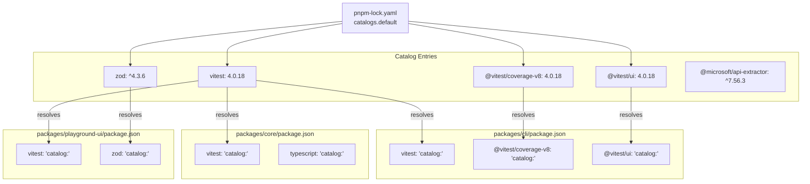

**Current Catalog Entries** [pnpm-lock.yaml:7-23]():

```yaml
catalogs:
  default:
    '@microsoft/api-extractor': ^7.56.3
    '@vitest/coverage-v8': 4.0.18
    '@vitest/ui': 4.0.18
    vitest: 4.0.18
    zod: ^4.3.6
```

**Package Examples Using Catalog:**

- [packages/cli/package.json:84-92]() - `vitest`, `@vitest/coverage-v8`, `@vitest/ui` all use `catalog:`
- [packages/core/package.json:286-295]() - References `vitest: catalog:` and `typescript: catalog:`
- [packages/playground-ui/package.json:163-177]() - Uses `vitest: catalog:` and `zod: catalog:`

**Sources:** [pnpm-lock.yaml:7-23](), [packages/cli/package.json:84-92](), [packages/core/package.json:286-295](), [packages/playground-ui/package.json:163-177]()

### Dependency Overrides and Resolutions

The monorepo enforces specific dependency versions across all packages using pnpm overrides. These are defined in both `package.json` (for compatibility) and applied in `pnpm-lock.yaml`.

**Override Hierarchy and Application**

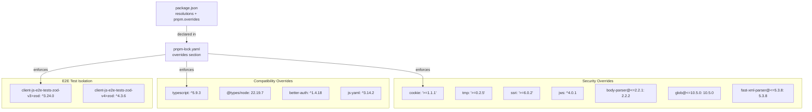

**Override Definitions** [package.json:100-117]():

```json
"resolutions": {
  "typescript": "^5.9.3",
  "@types/node": "22.19.7",
  "cookie": ">=1.1.1",
  "tmp": ">=0.2.5",
  "ssri": ">=6.0.2",
  "jws": "^4.0.1"
},
"pnpm": {
  "overrides": {
    "client-js-e2e-tests-zod-v3>zod": "^3.24.0",
    "client-js-e2e-tests-zod-v4>zod": "^4.3.6",
    "better-auth": "^1.4.18",
    "js-yaml": "^3.14.2",
    "glob@<=10.5.0": "10.5.0",
    "body-parser@<=2.2.1": "2.2.2",
    "fast-xml-parser@<=5.3.8": "5.3.8"
  }
}
```

**Applied Overrides in Lock File** [pnpm-lock.yaml:25-39]():

- Security patches for vulnerable ranges
- TypeScript `^5.9.3` consistency across all packages
- `@types/node` pinned to `22.19.7`
- Scoped overrides for E2E test packages to test Zod v3/v4 compatibility

**Sources:** [package.json:100-117](), [pnpm-lock.yaml:25-39]()

### Patched Dependencies

The monorepo maintains patches for specific dependencies that require custom modifications. These patches are managed using pnpm's patch protocol.

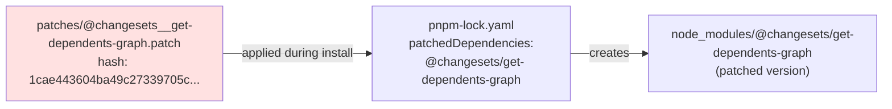

Current patched dependencies as defined in [pnpm-lock.yaml:40-43]():

- `@changesets/get-dependents-graph`: Custom patch for dependency graph calculation
  - Hash: `1cae443604ba49c27339705c703329dfcd79f6acd7fc822b1257a7d7c9da9535`
  - Patch file: `patches/@changesets__get-dependents-graph.patch`

**Sources:** [pnpm-lock.yaml:40-43]()

### Workspace Protocol

Internal packages reference each other using pnpm's workspace protocol, ensuring they always use the local workspace version rather than published versions.

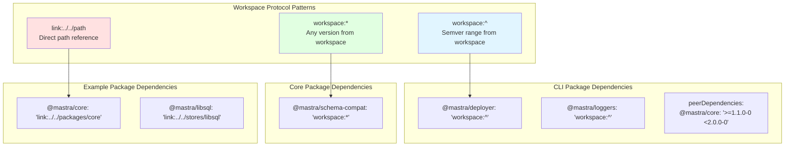

Protocol patterns observed:

1. **`workspace:*`** - Used for flexible workspace dependencies, always resolves to local version
   - Example: [packages/core/package.json:221]() references `@mastra/schema-compat`

2. **`workspace:^`** - Workspace dependency with caret range, validated against semver
   - Example: [packages/cli/package.json:55-56]() references deployers

3. **`link:../../path`** - Direct symlink to workspace package (used in examples)
   - Example: [examples/dane/package.json:34-39]() references core packages

**Peer Dependencies**: Core packages like `@mastra/core` are typically declared as peer dependencies with version ranges to ensure compatibility:

- [packages/cli/package.json:94-97]()
- [packages/deployer/package.json:146-149]()
- [client-sdks/client-js/package.json:50-52]()

**Sources:** [packages/cli/package.json:55-56](), [packages/core/package.json:221](), [examples/dane/package.json:34-39](), [packages/cli/package.json:94-97]()

## Build System Architecture

### Turbo Orchestration

The monorepo uses Turbo to orchestrate builds across packages with dependency-aware caching and parallelization. Build tasks are coordinated through scripts in [package.json:31-53]().

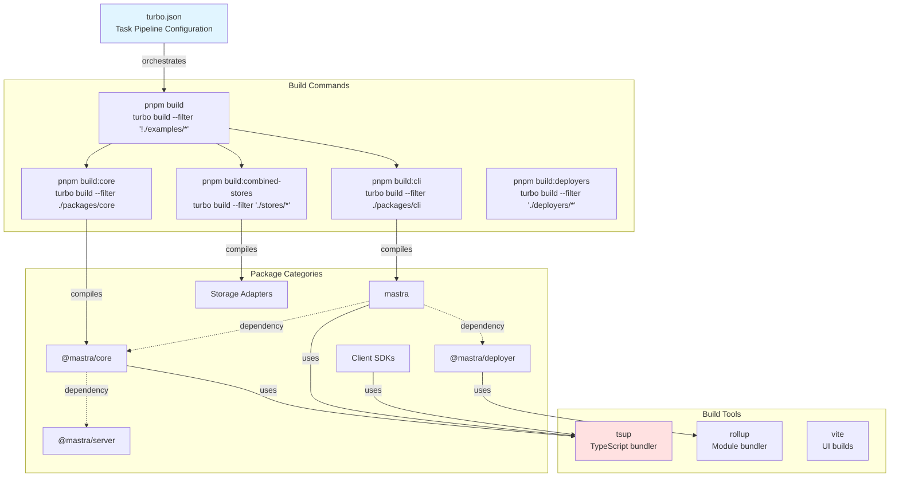

**Build Filter Patterns** [package.json:31-53]():

- `--filter "!./examples/*"` - Excludes example projects from build
- `--filter "./packages/*"` - Targets all packages in packages directory
- `--filter ./packages/core` - Targets single package
- `--filter "!@internal/playground"` - Excludes internal playground

**Sources:** [package.json:31-53]()

### Build Tools and Configuration

Each package category uses specific build tools optimized for its output requirements. Build scripts follow consistent naming: `build:lib` for compilation, `build:watch` for development.

| Tool       | Used By                              | Script Name | Configuration File                     | Output Format      |
| ---------- | ------------------------------------ | ----------- | -------------------------------------- | ------------------ |
| **tsup**   | @mastra/core, mastra, @mastra/server | `build:lib` | `tsup.config.ts`                       | Dual ESM + CJS     |
| **rollup** | @mastra/deployer, create-mastra      | `build`     | `rollup.config.js`                     | Bundled ESM + CJS  |
| **vite**   | @mastra/playground-ui                | `build`     | `vite.config.ts`                       | Browser bundles    |
| **tsc**    | All packages                         | `typecheck` | `tsconfig.json`, `tsconfig.build.json` | Type checking only |

**Build Script Patterns:**

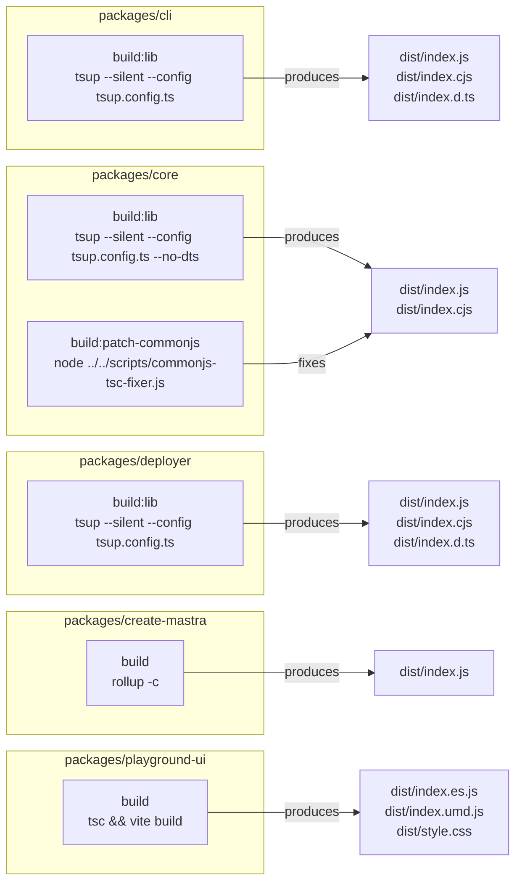

**Example Build Scripts:**

- [packages/cli/package.json:26]() - `"build:lib": "tsup --silent --config tsup.config.ts"`
- [packages/core/package.json:212-213]() - `"build:lib"` followed by `"build:patch-commonjs"`
- [packages/deployer/package.json:86]() - `"build:lib": "tsup --silent --config tsup.config.ts"`
- [packages/create-mastra/package.json:16]() - `"build": "rollup -c"`
- [packages/playground-ui/package.json:54]() - `"build": "tsc && vite build"`

**Dual Export Format** - Packages use `exports` field with conditional imports:

- [packages/core/package.json:14-32]() - Maps `.` to `dist/index.js` (import) and `dist/index.cjs` (require)
- [packages/deployer/package.json:13-32]() - Similar dual export pattern
- [client-sdks/client-js/package.json:13-24]() - Client SDK dual format

**Sources:** [packages/cli/package.json:26](), [packages/core/package.json:212-213](), [packages/deployer/package.json:86](), [packages/create-mastra/package.json:16](), [packages/playground-ui/package.json:54](), [packages/core/package.json:14-32]()

### Pre-pack Documentation Generation

Many packages run a pre-pack script to generate package-level documentation before publishing:

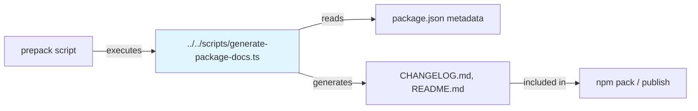

Examples:

- [packages/cli/package.json:27]() - `"prepack": "pnpx tsx ../../scripts/generate-package-docs.ts"`
- [packages/core/package.json:204]() - Same pattern
- [packages/deployer/package.json:87]() - Same pattern

**Sources:** [packages/cli/package.json:27](), [packages/core/package.json:204](), [packages/deployer/package.json:87]()

## Version Management with Changesets

The monorepo uses Changesets for coordinated version bumping and changelog generation across packages.

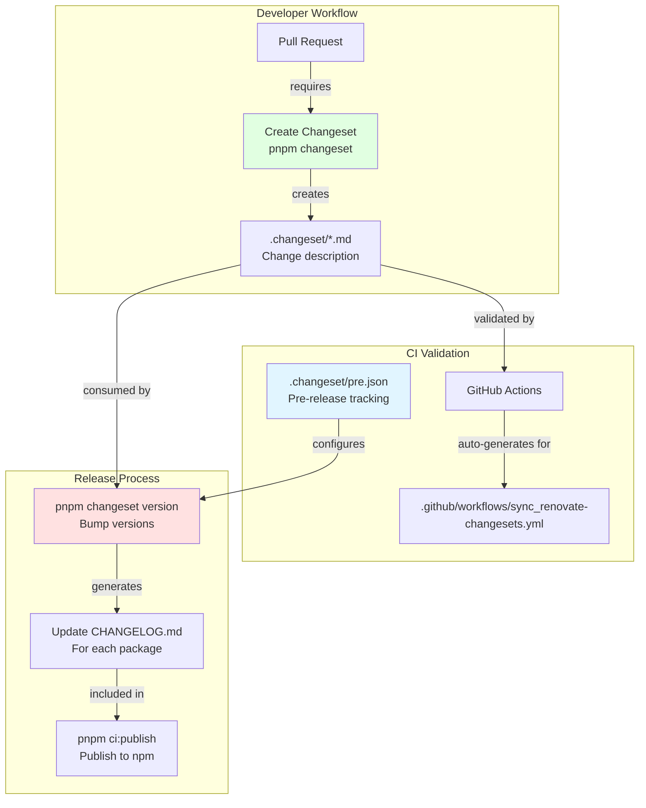

**Changeset Configuration**:

- Pre-release mode: [.changeset/pre.json:1-117]() defines alpha pre-release state
- Initial versions tracked for all packages
- Tag: `alpha` [.changeset/pre.json:3]()

**Automated Changeset Generation**: Renovate PRs automatically get changesets via [.github/workflows/sync_renovate-changesets.yml:1-35]():

- Triggers on `pnpm-lock.yaml` changes in Renovate branches
- Auto-generates appropriate changesets for dependency updates
- Ensures all PRs have proper version tracking

**Package Changelog Examples**:

- [packages/cli/CHANGELOG.md:1-2089]() - CLI package changelog with version history
- [packages/core/CHANGELOG.md:1-4750]() - Core package changelog
- [packages/deployer/CHANGELOG.md:1-2009]() - Deployer package changelog

**Sources:** [.changeset/pre.json:1-117](), [.github/workflows/sync_renovate-changesets.yml:1-35](), [packages/cli/CHANGELOG.md:1-112](), [package.json:28-29]()

## Testing Infrastructure

The monorepo provides centralized test commands at the root level that delegate to individual packages. Each package defines its own test scripts using Vitest.

**Test Command Hierarchy and Execution Flow**

```mermaid
graph TB
    subgraph "Root package.json scripts"
        rootTest["test<br/>vitest run"]
        rootTestCore["test:core<br/>pnpm --filter ./packages/core test"]
        rootTestCLI["test:cli<br/>pnpm --filter ./packages/cli test"]
        rootTestStores["test:combined-stores<br/>pnpm --filter './stores/*' test"]
        rootTestClients["test:clients<br/>pnpm --filter './client-sdks/*' test"]
        rootTestMCP["test:mcp<br/>pnpm --filter ./packages/mcp test"]
        rootTestE2E["test:e2e:client-js<br/>pnpm --filter 'client-js-e2e-tests-*' test"]
    end

    subgraph "packages/cli/package.json"
        cliTest["test: vitest run"]
    end

    subgraph "packages/core/package.json"
        coreTestUnit["test:unit: vitest run --exclude '**/tool-builder/**'"]
        coreTest["test: npm run test:unit"]
        coreTestZod["test:types:zod: node test-zod-compat.mjs"]
    end

    subgraph "packages/mcp/package.json"
        mcpTestClient["test:client: vitest run ./src/client/client.test.ts"]
        mcpTestServer["test:server: vitest run ./src/server/server.test.ts"]
        mcpTestIntegration["test:integration: cd integration-tests && pnpm test:mcp"]
        mcpTest["test: pnpm test:server && pnpm test:client && pnpm test:integration"]
    end

    subgraph "Vitest Catalog"
        catalog["pnpm-lock.yaml catalogs:<br/>vitest: 4.0.18<br/>@vitest/ui: 4.0.18<br/>@vitest/coverage-v8: 4.0.18"]
    end

    rootTestCore -->|"delegates to"| cliTest
    rootTestCLI -->|"delegates to"| coreTest
    rootTestMCP -->|"delegates to"| mcpTest

    catalog -->|"provides version"| cliTest
    catalog -->|"provides version"| coreTestUnit
    catalog -->|"provides version"| mcpTestClient
```

**Root-Level Test Commands** [package.json:56-80]():

| Command                     | Filter Pattern            | Description               |
| --------------------------- | ------------------------- | ------------------------- |
| `pnpm test`                 | None                      | Run all tests with Vitest |
| `pnpm test:core`            | `./packages/core`         | Core framework tests      |
| `pnpm test:cli`             | `./packages/cli`          | CLI tool tests            |
| `pnpm test:deployer`        | `./packages/deployer`     | Deployer tests            |
| `pnpm test:server`          | `./packages/server`       | Server tests              |
| `pnpm test:mcp`             | `./packages/mcp`          | MCP client/server tests   |
| `pnpm test:rag`             | `./packages/rag`          | RAG system tests          |
| `pnpm test:clients`         | `'./client-sdks/*'`       | All client SDK tests      |
| `pnpm test:combined-stores` | `'./stores/*'`            | All storage adapter tests |
| `pnpm test:memory`          | `./packages/memory`       | Memory system tests       |
| `pnpm test:tool-builder`    | Specific path             | Tool builder tests only   |
| `pnpm test:e2e:client-js`   | `'client-js-e2e-tests-*'` | Client SDK E2E tests      |

**Package-Level Test Scripts:**

- [packages/cli/package.json:28]() - `"test": "vitest run"`
- [packages/core/package.json:218-220]() - `"test:unit"` excludes tool-builder, `"test"` runs unit tests
- [packages/mcp/package.json:29-32]() - Separate scripts for client, server, and integration tests
- [workflows/inngest/package.json:28-31]() - Unit, workflow, and integration test separation

**Vitest Version Consistency** [pnpm-lock.yaml:12-20]():

- All packages reference `vitest: catalog:` which resolves to `4.0.18`
- Coverage and UI tools also use catalog: `@vitest/coverage-v8`, `@vitest/ui`

**Sources:** [package.json:56-80](), [packages/cli/package.json:28](), [packages/core/package.json:218-220](), [packages/mcp/package.json:29-32](), [pnpm-lock.yaml:12-20]()

## Code Quality and Linting

The monorepo enforces code quality through shared ESLint and Prettier configurations, with Git hooks ensuring compliance before commits.

**Linting and Formatting Pipeline**

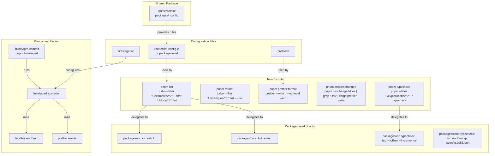

**Root-Level Quality Scripts** [package.json:81-91]():

| Script                  | Command                                                                                           | Description                                       |
| ----------------------- | ------------------------------------------------------------------------------------------------- | ------------------------------------------------- |
| `lint`                  | `turbo --filter "!./examples/**/*" --filter "!./docs/**/*" --filter "!@internal/playground" lint` | Run ESLint via Turbo, excluding examples and docs |
| `format`                | `turbo --filter "!./examples/**/*" --filter "!./docs/**/*" lint -- --fix`                         | Auto-fix ESLint issues                            |
| `prettier:format`       | `prettier --write . --log-level warn`                                                             | Format all files                                  |
| `prettier:format:check` | `prettier --check .`                                                                              | Check formatting without changes                  |
| `prettier:changed`      | `pnpm list-changed-files \| grep '\.ts$' \| xargs prettier --write`                               | Format only changed files                         |
| `typecheck`             | `pnpm --filter "!./explorations/**/*" -r typecheck`                                               | Run TypeScript checks in all packages             |

**Package-Level Lint Scripts:**

- [packages/cli/package.json:32]() - `"lint": "eslint ."`
- [packages/core/package.json:211]() - `"lint": "eslint ."`
- [packages/deployer/package.json:91]() - `"lint": "eslint ."`

**Shared ESLint Configuration**:

- `@internal/lint` package: [packages/\_config]()
- Referenced in devDependencies: [packages/cli/package.json:75](), [packages/core/package.json:277]()

**Pre-commit Hook Flow** [package.json:83-84]():

1. Developer runs `git commit`
2. Husky triggers `.husky/pre-commit`
3. Runs `pnpm lint-staged`
4. `lint-staged` executes:
   - `tsc-files --noEmit` on `*.ts` files
   - `prettier --write` on matched files

**TypeScript Type Checking:**

- Root: [package.json:90]() - `"typecheck": "pnpm --filter \"!./explorations/**/*\" -r typecheck"`
- CLI: [packages/cli/package.json:31]() - `"typecheck": "tsc --noEmit --incremental"`
- Core: [packages/core/package.json:209]() - `"typecheck": "tsc --noEmit -p tsconfig.build.json"`

**Sources:** [package.json:81-91](), [packages/cli/package.json:31-32](), [packages/core/package.json:209-211](), [packages/cli/package.json:75](), [package.json:83-84]()

## Engine Requirements

The monorepo enforces specific runtime requirements to ensure compatibility and modern JavaScript features.

| Requirement | Version     | Enforced In               | Purpose                                 |
| ----------- | ----------- | ------------------------- | --------------------------------------- |
| **Node.js** | `>=22.13.0` | All package.json engines  | Modern JavaScript features, performance |
| **pnpm**    | `>=10.18.0` | Root package.json engines | Workspace protocol support, catalogs    |

**Node.js Version**: All published packages declare the minimum Node.js version [packages/cli/package.json:107-109]():

```json
"engines": {
  "node": ">=22.13.0"
}
```

This appears consistently across:

- [packages/core/package.json:284-286]()
- [packages/deployer/package.json:159-161]()
- [client-sdks/client-js/package.json:69-71]()
- [examples/dane/package.json:66-68]()

**pnpm Version**: Root workspace requires pnpm 10.18.0+ [package.json:97-99]():

```json
"engines": {
  "pnpm": ">=10.18.0"
}
```

**Package Manager Enforcement**: A preinstall script ensures only pnpm is used [package.json:83]():

```json
"preinstall": "npx only-allow pnpm"
```

**Sources:** [package.json:97-99](), [package.json:83](), [packages/cli/package.json:107-109](), [packages/core/package.json:284-286]()

## Development Workflow Scripts

The monorepo provides convenience scripts for common development tasks:

| Script               | Command                                             | Purpose                          |
| -------------------- | --------------------------------------------------- | -------------------------------- |
| `dev:services:up`    | `docker compose -f .dev/docker-compose.yaml up -d`  | Start local development services |
| `dev:services:down`  | `docker compose -f .dev/docker-compose.yaml down`   | Stop local development services  |
| `setup`              | `pnpm install && pnpm run build`                    | Initial project setup            |
| `cleanup`            | Find and remove build artifacts                     | Clean workspace                  |
| `typecheck`          | `pnpm --filter "!./explorations/**/*" -r typecheck` | Type check all packages          |
| `list-changed-files` | Git diff command                                    | List changed files for tooling   |

**Service Management** [package.json:92-93]():

- Docker Compose configuration in `.dev/docker-compose.yaml` for local dependencies
- Services likely include databases, vector stores, etc. for integration testing

**Initial Setup** [package.json:94]():

- Installs all dependencies
- Builds entire monorepo
- Prepares workspace for development

**Cleanup** [package.json:95]():

- Removes `node_modules`, `dist`, `.turbo`, `.mastra` directories
- Useful for resolving dependency issues or preparing for fresh install

**Sources:** [package.json:92-95]()
