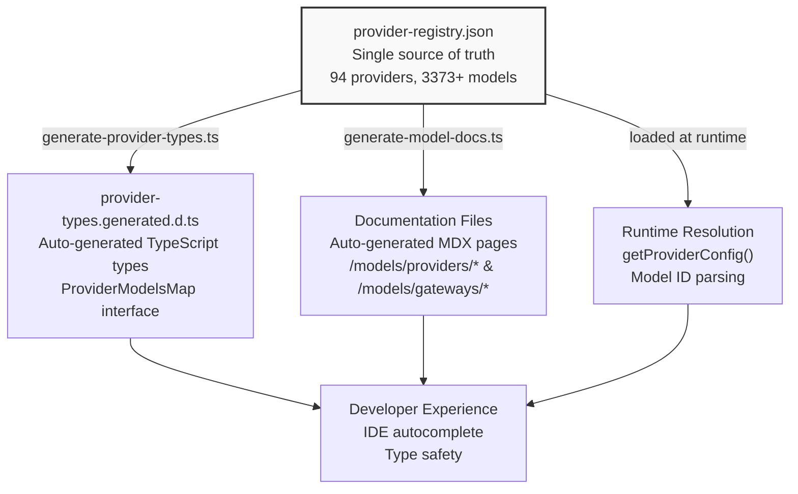
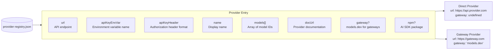
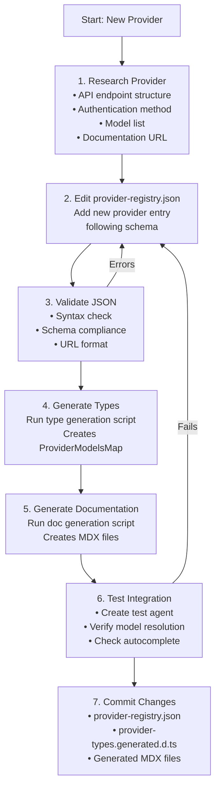
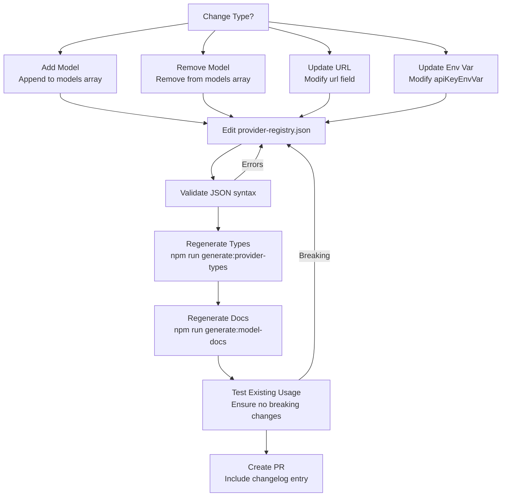
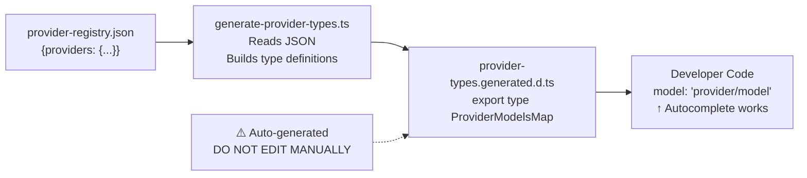
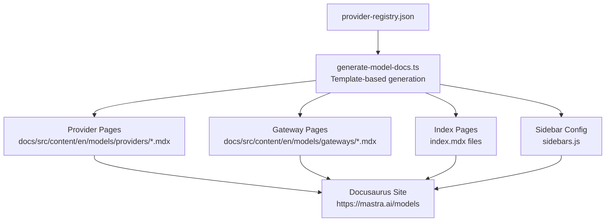
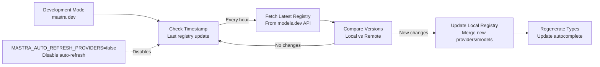

# Provider Registry Maintenance

<details>
<summary>Relevant source files</summary>

The following files were used as context for generating this wiki page:

- [docs/src/content/en/models/gateways/index.mdx](docs/src/content/en/models/gateways/index.mdx)
- [docs/src/content/en/models/gateways/netlify.mdx](docs/src/content/en/models/gateways/netlify.mdx)
- [docs/src/content/en/models/gateways/openrouter.mdx](docs/src/content/en/models/gateways/openrouter.mdx)
- [docs/src/content/en/models/gateways/vercel.mdx](docs/src/content/en/models/gateways/vercel.mdx)
- [docs/src/content/en/models/index.mdx](docs/src/content/en/models/index.mdx)
- [docs/src/content/en/models/providers/\_meta.ts](docs/src/content/en/models/providers/_meta.ts)
- [docs/src/content/en/models/providers/alibaba-cn.mdx](docs/src/content/en/models/providers/alibaba-cn.mdx)
- [docs/src/content/en/models/providers/alibaba.mdx](docs/src/content/en/models/providers/alibaba.mdx)
- [docs/src/content/en/models/providers/anthropic.mdx](docs/src/content/en/models/providers/anthropic.mdx)
- [docs/src/content/en/models/providers/baseten.mdx](docs/src/content/en/models/providers/baseten.mdx)
- [docs/src/content/en/models/providers/cerebras.mdx](docs/src/content/en/models/providers/cerebras.mdx)
- [docs/src/content/en/models/providers/chutes.mdx](docs/src/content/en/models/providers/chutes.mdx)
- [docs/src/content/en/models/providers/cortecs.mdx](docs/src/content/en/models/providers/cortecs.mdx)
- [docs/src/content/en/models/providers/deepinfra.mdx](docs/src/content/en/models/providers/deepinfra.mdx)
- [docs/src/content/en/models/providers/github-models.mdx](docs/src/content/en/models/providers/github-models.mdx)
- [docs/src/content/en/models/providers/google.mdx](docs/src/content/en/models/providers/google.mdx)
- [docs/src/content/en/models/providers/groq.mdx](docs/src/content/en/models/providers/groq.mdx)
- [docs/src/content/en/models/providers/index.mdx](docs/src/content/en/models/providers/index.mdx)
- [docs/src/content/en/models/providers/modelscope.mdx](docs/src/content/en/models/providers/modelscope.mdx)
- [docs/src/content/en/models/providers/nano-gpt.mdx](docs/src/content/en/models/providers/nano-gpt.mdx)
- [docs/src/content/en/models/providers/nebius.mdx](docs/src/content/en/models/providers/nebius.mdx)
- [docs/src/content/en/models/providers/nvidia.mdx](docs/src/content/en/models/providers/nvidia.mdx)
- [docs/src/content/en/models/providers/openai.mdx](docs/src/content/en/models/providers/openai.mdx)
- [docs/src/content/en/models/providers/opencode.mdx](docs/src/content/en/models/providers/opencode.mdx)
- [docs/src/content/en/models/providers/perplexity.mdx](docs/src/content/en/models/providers/perplexity.mdx)
- [docs/src/content/en/models/providers/requesty.mdx](docs/src/content/en/models/providers/requesty.mdx)
- [docs/src/content/en/models/providers/scaleway.mdx](docs/src/content/en/models/providers/scaleway.mdx)
- [docs/src/content/en/models/providers/synthetic.mdx](docs/src/content/en/models/providers/synthetic.mdx)
- [docs/src/content/en/models/providers/togetherai.mdx](docs/src/content/en/models/providers/togetherai.mdx)
- [docs/src/content/en/models/providers/upstage.mdx](docs/src/content/en/models/providers/upstage.mdx)
- [docs/src/content/en/models/providers/venice.mdx](docs/src/content/en/models/providers/venice.mdx)
- [docs/src/content/en/models/providers/vultr.mdx](docs/src/content/en/models/providers/vultr.mdx)
- [docs/src/content/en/models/providers/wandb.mdx](docs/src/content/en/models/providers/wandb.mdx)
- [docs/src/content/en/models/providers/xai.mdx](docs/src/content/en/models/providers/xai.mdx)
- [docs/src/content/en/models/providers/zai-coding-plan.mdx](docs/src/content/en/models/providers/zai-coding-plan.mdx)
- [docs/src/content/en/models/providers/zai.mdx](docs/src/content/en/models/providers/zai.mdx)
- [docs/src/content/en/models/providers/zhipuai-coding-plan.mdx](docs/src/content/en/models/providers/zhipuai-coding-plan.mdx)
- [docs/src/content/en/models/providers/zhipuai.mdx](docs/src/content/en/models/providers/zhipuai.mdx)
- [docs/src/content/en/models/sidebars.js](docs/src/content/en/models/sidebars.js)
- [packages/core/src/llm/model/provider-registry.json](packages/core/src/llm/model/provider-registry.json)
- [packages/core/src/llm/model/provider-types.generated.d.ts](packages/core/src/llm/model/provider-types.generated.d.ts)

</details>

This document describes how to maintain the provider registry in Mastra's model system. The provider registry is the central source of truth for all AI model providers, their configurations, and available models. It drives TypeScript autocomplete, documentation generation, and runtime model resolution.

For information about using models in your application, see [5.1 Provider Registry and Model Catalog](#5.1). For information about configuring specific providers, see [5.2 Model Configuration Patterns](#5.2).

## Provider Registry Architecture

The provider registry system consists of three interconnected components that work together to provide type-safe access to 94 providers and 3373+ models.

### System Overview



**Sources:** [packages/core/src/llm/model/provider-registry.json:1-1500]()

### Provider Registry Structure

The registry is a JSON file where each provider entry contains connection details, authentication requirements, and model listings.



**Sources:** [packages/core/src/llm/model/provider-registry.json:3-25](), [packages/core/src/llm/model/provider-registry.json:625-667]()

## Provider Configuration Schema

Each provider in the registry follows a standardized schema. Understanding this schema is essential for adding or modifying provider entries.

### Required Fields

| Field          | Type     | Description                                     | Example                                     |
| -------------- | -------- | ----------------------------------------------- | ------------------------------------------- |
| `url`          | string   | Base API endpoint (without `/chat/completions`) | `"https://api.openai.com/v1"`               |
| `apiKeyEnvVar` | string   | Environment variable name for API key           | `"OPENAI_API_KEY"`                          |
| `apiKeyHeader` | string   | HTTP header for authentication                  | `"Authorization"`                           |
| `name`         | string   | Human-readable provider name                    | `"OpenAI"`                                  |
| `models`       | string[] | Array of model identifiers                      | `["gpt-5", "gpt-5-mini"]`                   |
| `docUrl`       | string   | URL to provider's documentation                 | `"https://platform.openai.com/docs/models"` |

### Optional Fields

| Field     | Type   | Description                                       | Example               |
| --------- | ------ | ------------------------------------------------- | --------------------- |
| `gateway` | string | Set to `"models.dev"` for gateway providers       | `"models.dev"`        |
| `npm`     | string | AI SDK package name if provider uses specific SDK | `"@ai-sdk/anthropic"` |

**Sources:** [packages/core/src/llm/model/provider-registry.json:3-45](), [packages/core/src/llm/model/provider-registry.json:625-667]()

### Example Provider Entries

**Direct Provider:**

```json
{
  "openai": {
    "url": "https://api.openai.com/v1",
    "apiKeyEnvVar": "OPENAI_API_KEY",
    "apiKeyHeader": "Authorization",
    "name": "OpenAI",
    "models": ["codex-mini-latest", "gpt-3.5-turbo", "gpt-4", "gpt-5"],
    "docUrl": "https://platform.openai.com/docs/models"
  }
}
```

**Gateway Provider:**

```json
{
  "openrouter": {
    "url": "https://openrouter.ai/api/v1",
    "apiKeyEnvVar": "OPENROUTER_API_KEY",
    "apiKeyHeader": "Authorization",
    "name": "OpenRouter",
    "models": ["allenai/molmo-2-8b:free", "anthropic/claude-3.5-haiku"],
    "docUrl": "https://openrouter.ai/models",
    "gateway": "models.dev"
  }
}
```

**Provider with AI SDK Package:**

```json
{
  "zenmux": {
    "url": "https://zenmux.ai/api/anthropic/v1",
    "apiKeyEnvVar": "ZENMUX_API_KEY",
    "apiKeyHeader": "Authorization",
    "name": "ZenMux",
    "models": ["anthropic/claude-3.5-haiku", "google/gemini-2.5-flash"],
    "docUrl": "https://docs.zenmux.ai",
    "gateway": "models.dev",
    "npm": "@ai-sdk/anthropic"
  }
}
```

**Sources:** [packages/core/src/llm/model/provider-registry.json:46-143](), [docs/src/content/en/models/gateways/openrouter.mdx:1-250]()

## Adding a New Provider

Follow this workflow to add a new provider to the registry.



**Sources:** [packages/core/src/llm/model/provider-registry.json:1-100]()

### Step-by-Step Instructions

#### 1. Research the Provider

Before adding a provider, collect the following information:

- **Base URL**: The OpenAI-compatible API endpoint (usually ends in `/v1`)
- **Authentication**: Environment variable name and header format
- **Models**: Complete list of available model identifiers
- **Documentation**: Official provider documentation URL

#### 2. Add Provider Entry

Open `packages/core/src/llm/model/provider-registry.json` and add a new provider object under the `providers` key. Follow alphabetical ordering by provider ID.

**Provider ID Naming Convention:**

- Use lowercase with hyphens: `my-provider-name`
- For regional variants: `provider-name-cn` (China), `provider-name-eu` (Europe)
- For specialized endpoints: `provider-name-coding-plan`, `provider-name-agent`

**Example:**

```json
{
  "providers": {
    "my-new-provider": {
      "url": "https://api.newprovider.com/v1",
      "apiKeyEnvVar": "NEW_PROVIDER_API_KEY",
      "apiKeyHeader": "Authorization",
      "name": "My New Provider",
      "models": ["model-1", "model-2-vision", "model-3-large"],
      "docUrl": "https://docs.newprovider.com/models"
    }
  }
}
```

**Gateway Provider:**
If the provider is a gateway aggregating multiple other providers, add `"gateway": "models.dev"`:

```json
{
  "my-gateway": {
    "url": "https://gateway.example.com/v1",
    "apiKeyEnvVar": "GATEWAY_API_KEY",
    "apiKeyHeader": "Authorization",
    "name": "My Gateway",
    "models": ["openai/gpt-4", "anthropic/claude-3"],
    "docUrl": "https://gateway.example.com/docs",
    "gateway": "models.dev"
  }
}
```

**Provider with Specific AI SDK:**
If the provider requires a specific AI SDK package, add the `npm` field:

```json
{
  "my-provider": {
    "url": "https://api.provider.com/v1",
    "apiKeyEnvVar": "PROVIDER_API_KEY",
    "apiKeyHeader": "Authorization",
    "name": "My Provider",
    "models": ["model-1"],
    "docUrl": "https://docs.provider.com",
    "npm": "@ai-sdk/my-provider"
  }
}
```

**Sources:** [packages/core/src/llm/model/provider-registry.json:3-100](), [packages/core/src/llm/model/provider-registry.json:625-667]()

#### 3. Validate the JSON

Ensure the JSON is valid and follows the schema:

**Validation Checklist:**

- [ ] Valid JSON syntax (no trailing commas, proper quotes)
- [ ] `url` ends with `/v1` and does not include `/chat/completions`
- [ ] `apiKeyEnvVar` uses SCREAMING_SNAKE_CASE
- [ ] `apiKeyHeader` is typically `"Authorization"`
- [ ] `models` is an array of strings
- [ ] `docUrl` is a valid HTTPS URL
- [ ] `gateway` is only set to `"models.dev"` for gateway providers
- [ ] Provider ID uses lowercase with hyphens

#### 4. Generate TypeScript Types

The TypeScript types must be regenerated whenever the registry changes. This creates the `ProviderModelsMap` type that powers autocomplete.

**Command:** (The exact command should be in a script in package.json)

```bash
# Example - actual command may vary
npm run generate:provider-types
```

This creates/updates `packages/core/src/llm/model/provider-types.generated.d.ts` with a type-safe mapping:

```typescript
export type ProviderModelsMap = {
  readonly 'my-new-provider': readonly [
    'model-1',
    'model-2-vision',
    'model-3-large',
  ]
  // ... other providers
}
```

**Sources:** [packages/core/src/llm/model/provider-types.generated.d.ts:1-10]()

#### 5. Generate Documentation

Documentation files must also be regenerated to create MDX pages for the new provider.

**Command:** (The exact command should be in a script in package.json)

```bash
# Example - actual command may vary
npm run generate:model-docs
```

This creates documentation files:

- For direct providers: `docs/src/content/en/models/providers/my-new-provider.mdx`
- For gateways: `docs/src/content/en/models/gateways/my-gateway.mdx`
- Updates index pages with the new provider

**Generated Documentation Includes:**

- Provider logo and name
- Environment variable setup
- Usage example
- Model table (if model metadata available)
- Advanced configuration examples

**Sources:** [docs/src/content/en/models/providers/opencode.mdx:1-470](), [docs/src/content/en/models/gateways/openrouter.mdx:1-250]()

#### 6. Test the Integration

Create a test agent to verify the provider works correctly:

```typescript
// test-new-provider.ts
import { Agent } from '@mastra/core/agent'

// Set the environment variable
process.env.NEW_PROVIDER_API_KEY = 'your-test-key'

const agent = new Agent({
  id: 'test-agent',
  name: 'Test Agent',
  instructions: 'You are a helpful assistant',
  model: 'my-new-provider/model-1', // Should autocomplete
})

// Test generation
const response = await agent.generate('Hello!')
console.log(response.text)
```

**Verification Checklist:**

- [ ] IDE autocomplete shows the new provider in model strings
- [ ] Environment variable is correctly read
- [ ] Model resolution works (no runtime errors about missing provider)
- [ ] API calls succeed with the provider's endpoint
- [ ] Documentation page renders correctly

**Sources:** [docs/src/content/en/models/index.mdx:34-104]()

#### 7. Commit Changes

Include all generated files in your commit:

```bash
git add packages/core/src/llm/model/provider-registry.json
git add packages/core/src/llm/model/provider-types.generated.d.ts
git add docs/src/content/en/models/providers/my-new-provider.mdx
git add docs/src/content/en/models/providers/index.mdx
git add docs/src/content/en/models/sidebars.js
git commit -m "feat: add my-new-provider with 3 models"
```

**Sources:** [docs/src/content/en/models/providers/index.mdx:1-466](), [docs/src/content/en/models/sidebars.js:1-544]()

## Updating Existing Providers

Existing providers may need updates when models are added, deprecated, or when provider configurations change.

### Update Workflow



**Sources:** [packages/core/src/llm/model/provider-registry.json:1-100]()

### Common Update Scenarios

#### Adding Models

When a provider releases new models, add them to the `models` array:

```json
{
  "openai": {
    "models": [
      "existing-model-1",
      "existing-model-2",
      "new-model-3", // New model
      "new-model-4-vision" // New model with vision
    ]
  }
}
```

**Considerations:**

- Maintain alphabetical or versioning order
- Include model variant suffixes (`-vision`, `-turbo`, `-mini`)
- Verify model IDs match provider's official identifiers

#### Removing Deprecated Models

When models are deprecated, remove them from the array:

```json
{
  "openai": {
    "models": [
      // "deprecated-model",  // Removed
      "current-model-1",
      "current-model-2"
    ]
  }
}
```

**Breaking Change Warning:** Removing models is a breaking change for users who reference them. Consider:

- Adding a note in CHANGELOG
- Providing migration guidance
- Checking if the model is used in examples or tests

#### Updating API Endpoints

If a provider changes their API endpoint:

```json
{
  "provider": {
    "url": "https://new-api.provider.com/v2", // Updated from v1 to v2
    "apiKeyEnvVar": "PROVIDER_API_KEY",
    "apiKeyHeader": "Authorization",
    "name": "Provider",
    "models": ["model-1"],
    "docUrl": "https://docs.provider.com"
  }
}
```

**Breaking Change Warning:** URL changes may break existing deployments. Document the change clearly.

#### Updating Environment Variables

If a provider changes their authentication:

```json
{
  "provider": {
    "url": "https://api.provider.com/v1",
    "apiKeyEnvVar": "NEW_PROVIDER_API_KEY", // Changed from OLD_PROVIDER_API_KEY
    "apiKeyHeader": "X-API-Key", // Changed from Authorization
    "name": "Provider",
    "models": ["model-1"],
    "docUrl": "https://docs.provider.com"
  }
}
```

**Breaking Change Warning:** Environment variable changes require users to update their `.env` files.

**Sources:** [packages/core/src/llm/model/provider-registry.json:3-100]()

## Type Generation System

The type generation system creates TypeScript types from the provider registry, enabling IDE autocomplete and type safety.

### Type Generation Flow



**Sources:** [packages/core/src/llm/model/provider-types.generated.d.ts:1-10]()

### Generated Type Structure

The generated file creates a `ProviderModelsMap` type with readonly arrays for each provider:

```typescript
/**
 * THIS FILE IS AUTO-GENERATED - DO NOT EDIT
 * Generated from model gateway providers
 */

export type ProviderModelsMap = {
  readonly evroc: readonly [
    'KBLab/kb-whisper-large',
    'Qwen/Qwen3-30B-A3B-Instruct-2507-FP8',
    // ... more models
  ]
  readonly openai: readonly [
    'codex-mini-latest',
    'gpt-3.5-turbo',
    'gpt-4',
    'gpt-5',
    // ... more models
  ]
  // ... 92 more providers
}
```

This type is used throughout the codebase to provide autocomplete for model IDs in the format `"provider/model"`.

**Sources:** [packages/core/src/llm/model/provider-types.generated.d.ts:1-100]()

### Manual Type Generation

If the automatic generation script is not available or you need to regenerate types manually:

1. Locate the type generation script (likely in `scripts/` or `packages/core/scripts/`)
2. Run it directly: `node path/to/generate-provider-types.ts`
3. Verify the output in `packages/core/src/llm/model/provider-types.generated.d.ts`
4. Commit the updated file

**Warning:** Never manually edit `provider-types.generated.d.ts`. Changes will be overwritten on the next generation.

**Sources:** [packages/core/src/llm/model/provider-types.generated.d.ts:1-5]()

## Documentation Generation System

The documentation generation system creates MDX pages for each provider and gateway, along with index pages and sidebar navigation.

### Documentation Generation Flow



**Sources:** [docs/src/content/en/models/index.mdx:1-10](), [docs/src/content/en/models/providers/index.mdx:1-20](), [docs/src/content/en/models/sidebars.js:1-50]()

### Generated Documentation Files

Each provider gets a dedicated MDX file with:

1. **Frontmatter** - Title and description for SEO
2. **Header** - Provider logo and name
3. **Introduction** - Model count and authentication info
4. **Environment Variable Setup** - Required `.env` configuration
5. **Usage Example** - Sample agent creation code
6. **Model Table** - List of available models (if metadata available)
7. **Advanced Configuration** - Custom headers and dynamic selection

**Example Generated File:**

````mdx
---
title: 'OpenAI | Models'
description: 'Use OpenAI models with Mastra. 46 models available.'
---

#  OpenAI

Access 46 OpenAI models through Mastra's model router.
Authentication is handled automatically using the `OPENAI_API_KEY`
environment variable.

Learn more in the [OpenAI documentation](https://platform.openai.com/docs/models).

```bash title=".env"
OPENAI_API_KEY=your-api-key
```
````

```typescript title="src/mastra/agents/my-agent.ts"
import { Agent } from '@mastra/core/agent'

const agent = new Agent({
  id: 'my-agent',
  name: 'My Agent',
  instructions: 'You are a helpful assistant',
  model: 'openai/gpt-5',
})
```

## Models

<!-- Model table would be here -->

````

**Sources:** [docs/src/content/en/models/providers/openai.mdx:1-100](), [docs/src/content/en/models/providers/opencode.mdx:1-50]()

### Documentation Categories

Documentation is organized into two categories based on the `gateway` field:

| Category | Condition | Location | Example |
|----------|-----------|----------|---------|
| **Providers** | `gateway` is undefined | `/models/providers/` | OpenAI, Anthropic, Google |
| **Gateways** | `gateway === "models.dev"` | `/models/gateways/` | OpenRouter, Vercel, Netlify |

**Gateway Documentation Differences:**
- Emphasizes aggregation of multiple providers
- Shows alternative authentication methods (gateway key vs provider keys)
- Lists models with provider prefixes (e.g., `openrouter/anthropic/claude-3`)

**Sources:** [docs/src/content/en/models/gateways/index.mdx:1-44](), [docs/src/content/en/models/providers/index.mdx:1-20]()

### Sidebar Configuration

The sidebar is automatically updated to include all providers and gateways in alphabetical order:

```javascript
// docs/src/content/en/models/sidebars.js
const sidebars = {
  modelsSidebar: [
    'index',
    'embeddings',
    {
      type: 'category',
      label: 'Gateways',
      collapsed: false,
      items: [
        { type: 'doc', id: 'gateways/index', label: 'Gateways' },
        { type: 'doc', id: 'gateways/openrouter', label: 'OpenRouter' },
        // ... more gateways
      ],
    },
    {
      type: 'category',
      label: 'Providers',
      collapsed: false,
      items: [
        { type: 'doc', id: 'providers/index', label: 'Providers' },
        { type: 'doc', id: 'providers/openai', label: 'OpenAI' },
        // ... more providers
      ],
    },
  ],
}
````

**Sources:** [docs/src/content/en/models/sidebars.js:1-100]()

## Best Practices

### Naming Conventions

**Provider IDs:**

- Use lowercase with hyphens: `my-provider`
- Regional variants: `provider-cn`, `provider-eu`
- Specialized endpoints: `provider-coding-plan`, `provider-agent`

**Model IDs:**

- Use provider's official model identifiers exactly
- Include variant suffixes: `-vision`, `-turbo`, `-mini`, `-instruct`
- For gateway models, include the original provider: `provider/model-name`

**Environment Variables:**

- Use SCREAMING_SNAKE_CASE: `MY_PROVIDER_API_KEY`
- End with `_API_KEY` for consistency
- For specialized endpoints: `PROVIDER_CODING_PLAN_API_KEY`

### Alphabetical Ordering

Maintain alphabetical order in:

- Provider keys in `provider-registry.json`
- Model arrays within each provider (when not versioned)
- Sidebar items in `sidebars.js`
- Provider cards in index pages

### Breaking Changes

Document breaking changes in CHANGELOG when:

- Removing models
- Changing `url` endpoints
- Changing `apiKeyEnvVar` names
- Changing `apiKeyHeader` format

**Migration Guide Template:**

````markdown
## Breaking Changes

### Provider X: Updated API Endpoint

**Before:**

```typescript
model: 'provider/old-model'
```
````

**After:**

```typescript
model: 'provider/new-model'
```

**Action Required:**
Update your `.env` file:

```bash
# Old
OLD_PROVIDER_API_KEY=xxx

# New
NEW_PROVIDER_API_KEY=xxx
```

````

### Testing Checklist

Before committing provider changes:

- [ ] JSON syntax is valid
- [ ] TypeScript types regenerated successfully
- [ ] Documentation generated without errors
- [ ] Test agent with the provider works
- [ ] IDE autocomplete shows new models
- [ ] Documentation page renders correctly
- [ ] Existing integrations still work (for updates)
- [ ] Breaking changes documented in CHANGELOG

**Sources:** [packages/core/src/llm/model/provider-registry.json:1-100]()

## Common Issues and Solutions

### Issue: JSON Syntax Errors

**Symptom:** Type or documentation generation fails with parse errors

**Solutions:**
- Remove trailing commas in arrays and objects
- Ensure all strings use double quotes
- Validate JSON with a linter: `npx jsonlint provider-registry.json`

### Issue: Provider Not Appearing in Autocomplete

**Symptom:** New provider doesn't show in IDE autocomplete

**Solutions:**
1. Verify `provider-types.generated.d.ts` was regenerated
2. Restart TypeScript server in IDE (VS Code: Cmd/Ctrl + Shift + P → "TypeScript: Restart TS Server")
3. Check that provider ID doesn't contain typos
4. Ensure the generated type file is committed

### Issue: Model Resolution Fails at Runtime

**Symptom:** Error: "Provider 'xyz' not found in registry"

**Solutions:**
1. Verify the provider ID matches exactly (case-sensitive)
2. Check that `provider-registry.json` is included in the build
3. Ensure the model ID format is correct: `"provider/model"`
4. Verify the provider's `url` and `apiKeyEnvVar` are correct

### Issue: Documentation Not Generating

**Symptom:** MDX files not created or outdated

**Solutions:**
1. Run the documentation generation script explicitly
2. Check for template errors in the generation script
3. Verify write permissions in `docs/src/content/en/models/`
4. Clear any cached build artifacts and regenerate

### Issue: Environment Variable Not Found

**Symptom:** Runtime error about missing API key

**Solutions:**
1. Verify the environment variable name matches `apiKeyEnvVar` exactly
2. Check `.env` file is loaded in the application
3. Ensure the variable is set in the deployment environment
4. Verify no typos in variable name (case-sensitive)

**Sources:** [packages/core/src/llm/model/provider-registry.json:1-100]()

## Registry Maintenance Tasks

### Regular Maintenance

**Monthly:**
- Review provider models for new additions
- Check provider documentation for API changes
- Test a sample of providers to ensure endpoints still work
- Update deprecated models with migration notes

**Quarterly:**
- Audit all providers for endpoint availability
- Review and update documentation links
- Check for unused or obsolete providers
- Update model counts in index pages

**As Needed:**
- Add new providers when requested
- Remove providers that are discontinued
- Update API endpoints when providers migrate
- Add new models as they're released

### Model Count Verification

To verify model counts match documentation:

1. Count models in registry: `jq '.providers.openai.models | length' provider-registry.json`
2. Compare with documentation claim
3. Update documentation if counts are incorrect
4. Regenerate docs to reflect accurate counts

### Provider Health Check

Create a health check script to verify provider endpoints:

```typescript
// Example health check (not in codebase, for reference)
import { providerRegistry } from './provider-registry.json';

for (const [id, config] of Object.entries(providerRegistry.providers)) {
  try {
    const response = await fetch(`${config.url}/models`, {
      headers: {
        [config.apiKeyHeader]: `Bearer ${process.env[config.apiKeyEnvVar]}`
      }
    });

    console.log(`✓ ${id}: ${response.status}`);
  } catch (error) {
    console.error(`✗ ${id}: ${error.message}`);
  }
}
````

**Sources:** [packages/core/src/llm/model/provider-registry.json:1-100]()

## Auto-Refresh System

Mastra includes an auto-refresh system that keeps the local provider registry up-to-date during development.

### How Auto-Refresh Works



**Configuration:**

- **Enabled by default** in development mode
- **Disabled by default** in production
- **Refresh interval**: 1 hour
- **Disable**: Set `MASTRA_AUTO_REFRESH_PROVIDERS=false`

**Why Auto-Refresh:**

- Ensures developers have access to newest models
- Reduces manual registry maintenance
- Keeps TypeScript autocomplete current
- Automatically includes new providers

**When to Disable:**

- Production deployments (stability)
- Air-gapped environments (no internet)
- Custom provider registries (local modifications)
- CI/CD pipelines (reproducible builds)

**Sources:** [docs/src/content/en/models/index.mdx:161-165]()

---

**Sources:** [packages/core/src/llm/model/provider-registry.json:1-1500](), [packages/core/src/llm/model/provider-types.generated.d.ts:1-900](), [docs/src/content/en/models/index.mdx:1-360](), [docs/src/content/en/models/providers/index.mdx:1-466](), [docs/src/content/en/models/gateways/index.mdx:1-44](), [docs/src/content/en/models/sidebars.js:1-544]()
