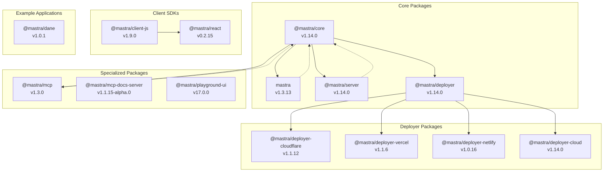
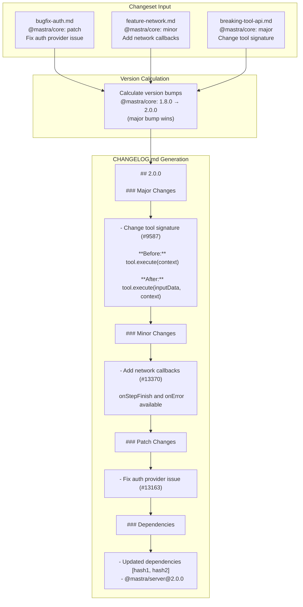
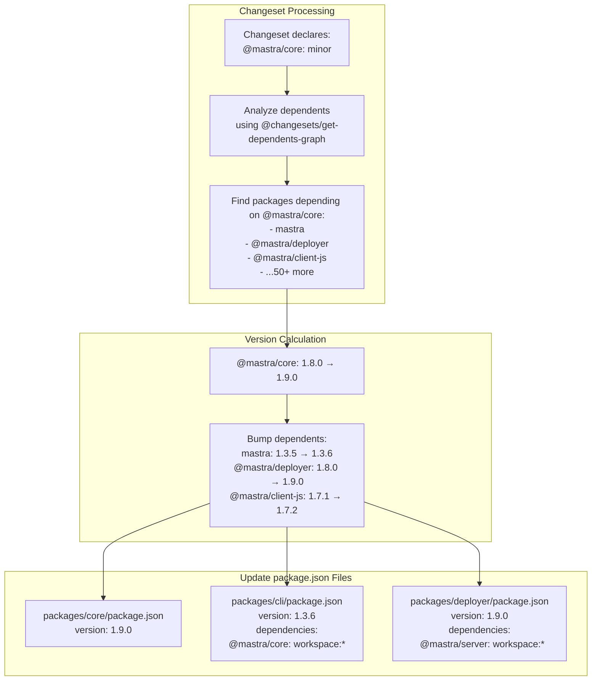
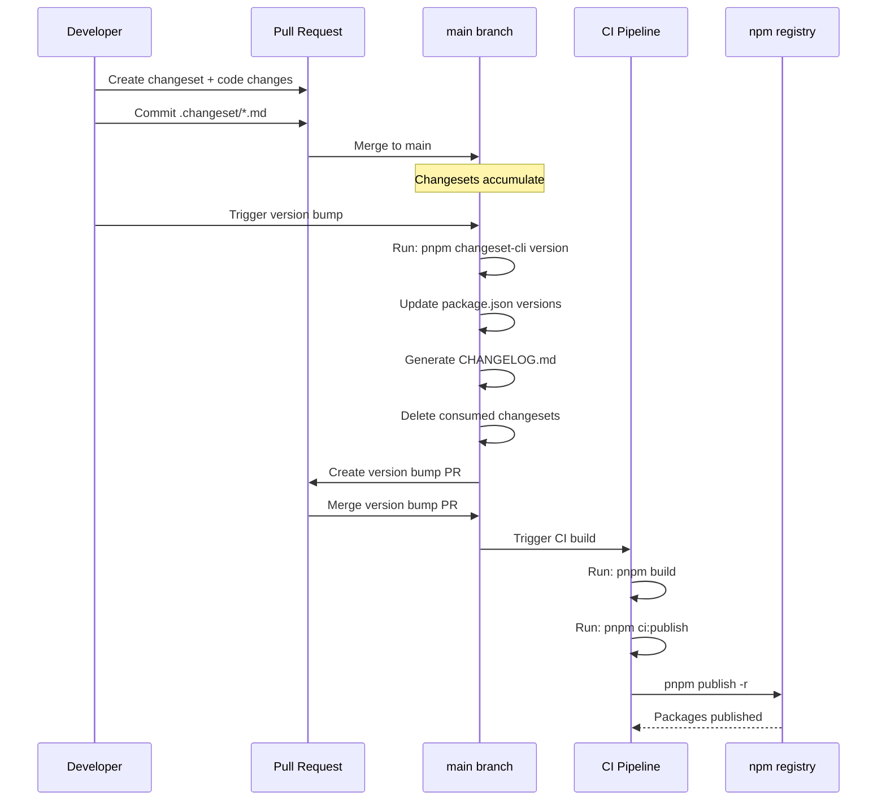

# Release Management with Changesets

<details>
<summary>Relevant source files</summary>

The following files were used as context for generating this wiki page:

- [.changeset/pre.json](.changeset/pre.json)
- [client-sdks/client-js/CHANGELOG.md](client-sdks/client-js/CHANGELOG.md)
- [client-sdks/client-js/package.json](client-sdks/client-js/package.json)
- [client-sdks/react/package.json](client-sdks/react/package.json)
- [deployers/cloudflare/CHANGELOG.md](deployers/cloudflare/CHANGELOG.md)
- [deployers/cloudflare/package.json](deployers/cloudflare/package.json)
- [deployers/netlify/CHANGELOG.md](deployers/netlify/CHANGELOG.md)
- [deployers/netlify/package.json](deployers/netlify/package.json)
- [deployers/vercel/CHANGELOG.md](deployers/vercel/CHANGELOG.md)
- [deployers/vercel/package.json](deployers/vercel/package.json)
- [examples/dane/CHANGELOG.md](examples/dane/CHANGELOG.md)
- [examples/dane/package.json](examples/dane/package.json)
- [package.json](package.json)
- [packages/cli/CHANGELOG.md](packages/cli/CHANGELOG.md)
- [packages/cli/package.json](packages/cli/package.json)
- [packages/core/CHANGELOG.md](packages/core/CHANGELOG.md)
- [packages/core/package.json](packages/core/package.json)
- [packages/create-mastra/CHANGELOG.md](packages/create-mastra/CHANGELOG.md)
- [packages/create-mastra/package.json](packages/create-mastra/package.json)
- [packages/deployer/CHANGELOG.md](packages/deployer/CHANGELOG.md)
- [packages/deployer/package.json](packages/deployer/package.json)
- [packages/mcp-docs-server/CHANGELOG.md](packages/mcp-docs-server/CHANGELOG.md)
- [packages/mcp-docs-server/package.json](packages/mcp-docs-server/package.json)
- [packages/mcp/CHANGELOG.md](packages/mcp/CHANGELOG.md)
- [packages/mcp/package.json](packages/mcp/package.json)
- [packages/playground-ui/CHANGELOG.md](packages/playground-ui/CHANGELOG.md)
- [packages/playground-ui/package.json](packages/playground-ui/package.json)
- [packages/playground/CHANGELOG.md](packages/playground/CHANGELOG.md)
- [packages/playground/package.json](packages/playground/package.json)
- [packages/server/CHANGELOG.md](packages/server/CHANGELOG.md)
- [packages/server/package.json](packages/server/package.json)
- [pnpm-lock.yaml](pnpm-lock.yaml)

</details>

## Purpose and Scope

This document describes the release management system for the Mastra monorepo using [Changesets](https://github.com/changesets/changesets). It covers the workflow for versioning packages, generating changelogs, managing pre-releases, and publishing to npm. For information about the monorepo structure and package organization, see [1.1](#1.1). For build and CI/CD workflows, see [12.3](#12.3).

## Changesets System Overview

Mastra uses Changesets to manage versioning and releases across 100+ packages in the monorepo. Changesets provides a workflow where developers declare intended version bumps alongside their changes, which are then aggregated during release time to update package versions, generate changelogs, and publish to npm.

**Key Features:**

- **Atomic change declarations**: Each PR includes a changeset file declaring version bump intent
- **Cross-package dependency tracking**: Automatically bumps dependent packages when dependencies change
- **Pre-release support**: Manages alpha/beta releases with separate version streams
- **Automated changelog generation**: Creates CHANGELOG.md entries from changeset descriptions
- **Monorepo-aware**: Handles interdependencies between workspace packages

Sources: [package.json:60-62](), [pnpm-lock.yaml:42-44]()

## Changeset Workflow

```mermaid
graph TB
    subgraph "1. Change Declaration"
        PR["Developer creates PR<br/>with code changes"]
        CMD_ADD["Run: pnpm changeset"]
        SELECT["Select affected packages<br/>Select bump type<br/>(major/minor/patch)"]
        WRITE_DESC["Write change description"]
        CS_FILE[".changeset/*.md<br/>Created changeset file"]
    end

    subgraph "2. Review & Merge"
        REVIEW["Code review"]
        MERGE["Merge to main"]
        CS_COLLECT["Changesets accumulate<br/>in .changeset/"]
    end

    subgraph "3. Version Bump"
        CMD_VERSION["Run: pnpm changeset-cli version"]
        READ_CS["Read all .changeset/*.md"]
        CALC_BUMP["Calculate version bumps<br/>Update package.json versions"]
        GEN_CL["Generate CHANGELOG.md entries"]
        DEL_CS["Delete consumed changesets"]
        VERSION_PR["Create version bump PR"]
    end

    subgraph "4. Publish"
        MERGE_VERSION["Merge version PR"]
        CMD_PUBLISH["Run: pnpm ci:publish"]
        BUILD["pnpm build"]
        NPM_PUBLISH["pnpm publish -r<br/>Publish to npm registry"]
    end

    PR --> CMD_ADD
    CMD_ADD --> SELECT
    SELECT --> WRITE_DESC
    WRITE_DESC --> CS_FILE
    CS_FILE --> REVIEW
    REVIEW --> MERGE
    MERGE --> CS_COLLECT

    CS_COLLECT --> CMD_VERSION
    CMD_VERSION --> READ_CS
    READ_CS --> CALC_BUMP
    CALC_BUMP --> GEN_CL
    GEN_CL --> DEL_CS
    DEL_CS --> VERSION_PR

    VERSION_PR --> MERGE_VERSION
    MERGE_VERSION --> CMD_PUBLISH
    CMD_PUBLISH --> BUILD
    BUILD --> NPM_PUBLISH
```



**Diagram: Changeset Release Workflow**

Sources: [package.json:28-30]()

### Creating a Changeset

When making changes to packages, developers create changesets to declare version bump intentions:

```bash
# Interactive CLI to create changeset
pnpm changeset
```

This command runs through the `@internal/changeset-cli` package wrapper (defined at [packages/\_config/changeset-cli]()). The CLI prompts for:

1. **Package selection**: Which packages are affected by the change
2. **Bump type**: `major`, `minor`, or `patch` for each package
3. **Description**: Human-readable summary of the change

The result is a markdown file in `.changeset/` directory with format:

```markdown
---
'@mastra/core': minor
'mastra': patch
---

Add authentication interfaces and Enterprise Edition RBAC support.
```

Sources: [package.json:28]()

### Version Bumping

The `changeset version` command consumes all pending changesets and updates package versions:

```bash
# Version packages based on changesets
pnpm changeset-cli version
```

This command:

1. Reads all `.changeset/*.md` files
2. Calculates new versions for each package following semver
3. Updates `version` field in `package.json` for affected packages
4. Updates dependencies across the monorepo (if package A depends on package B and B is bumped, A gets bumped too)
5. Generates `CHANGELOG.md` entries for each package
6. Deletes consumed changeset files

Sources: [package.json:29]()

### Publishing

After version bumps are merged, packages are published to npm:

```bash
# Publish all changed packages
pnpm ci:publish
```

This runs `pnpm publish -r` (recursive publish) which:

1. Builds all packages
2. Publishes packages with version increments to npm
3. Respects `private: true` packages (skips them)

Sources: [package.json:30]()

## Pre-release Management

```mermaid
graph LR
    subgraph "Normal Release Mode"
        NORMAL_CS["Create changeset<br/>@mastra/core: 1.8.0"]
        NORMAL_VERSION["Run version<br/>→ 1.9.0"]
        NORMAL_PUBLISH["Publish<br/>npm install @mastra/core<br/>→ gets 1.9.0"]
    end

    subgraph "Enter Pre-release"
        CMD_PRE_ENTER["pnpm changeset pre enter alpha"]
        PRE_JSON["Creates .changeset/pre.json<br/>mode: pre<br/>tag: alpha"]
    end

    subgraph "Pre-release Mode"
        PRE_CS["Create changeset<br/>@mastra/core: minor"]
        PRE_VERSION["Run version<br/>→ 1.9.0-alpha.0"]
        PRE_PUBLISH["Publish with --tag alpha<br/>npm install @mastra/core@alpha<br/>→ gets 1.9.0-alpha.0"]
        MORE_PRE["More changesets<br/>→ 1.9.0-alpha.1<br/>→ 1.9.0-alpha.2"]
    end

    subgraph "Exit Pre-release"
        CMD_PRE_EXIT["pnpm changeset pre exit"]
        REMOVE_PRE["Removes alpha tag<br/>Deletes pre.json"]
        FINAL_VERSION["Run version<br/>→ 1.9.0 (stable)"]
        FINAL_PUBLISH["Publish to latest<br/>npm install @mastra/core<br/>→ gets 1.9.0"]
    end

    NORMAL_CS --> NORMAL_VERSION
    NORMAL_VERSION --> NORMAL_PUBLISH
    NORMAL_PUBLISH --> CMD_PRE_ENTER

    CMD_PRE_ENTER --> PRE_JSON
    PRE_JSON --> PRE_CS
    PRE_CS --> PRE_VERSION
    PRE_VERSION --> PRE_PUBLISH
    PRE_PUBLISH --> MORE_PRE
    MORE_PRE --> CMD_PRE_EXIT

    CMD_PRE_EXIT --> REMOVE_PRE
    REMOVE_PRE --> FINAL_VERSION
    FINAL_VERSION --> FINAL_PUBLISH
```



**Diagram: Pre-release Lifecycle**

Mastra uses pre-release mode to test changes before stable releases. The `.changeset/pre.json` file controls pre-release state.

### Pre-release State File

The current pre-release configuration in [.changeset/pre.json]():

| Field             | Value                    | Purpose                                     |
| ----------------- | ------------------------ | ------------------------------------------- |
| `mode`            | `"pre"`                  | Indicates pre-release mode is active        |
| `tag`             | `"alpha"`                | Pre-release tag appended to versions        |
| `initialVersions` | Object with 121 packages | Baseline versions when entering pre-release |
| `changesets`      | `["green-birds-knock"]`  | Pending changesets awaiting version bump    |

Sources: [.changeset/pre.json:1-126]()

### Pre-release Version Format

When in pre-release mode, versions follow the pattern: `{major}.{minor}.{patch}-{tag}.{number}`

Example progression:

- `1.8.0` (stable) → enter pre-release
- `1.9.0-alpha.0` (first pre-release)
- `1.9.0-alpha.1` (subsequent pre-release)
- `1.9.0-alpha.2` (subsequent pre-release)
- `1.9.0` (exit pre-release, becomes stable)

**Current State:** Mastra is in pre-release mode with tag `alpha`, as evidenced by version strings like `1.3.6-alpha.0` in the changelog files.

Sources: [packages/cli/CHANGELOG.md:43](), [.changeset/pre.json:2-3]()

### Entering Pre-release Mode

```bash
# Enter alpha pre-release mode
pnpm changeset pre enter alpha
```

This creates `.changeset/pre.json` and sets:

- `mode: "pre"`
- `tag: "alpha"`
- `initialVersions`: Snapshot of all current package versions

All subsequent `changeset version` commands will append `-alpha.X` to version bumps.

### Exiting Pre-release Mode

```bash
# Exit pre-release mode
pnpm changeset pre exit
```

This removes the pre-release tag and deletes `.changeset/pre.json`. The next `changeset version` will produce stable version numbers (e.g., `1.9.0` instead of `1.9.0-alpha.3`).

Sources: [.changeset/pre.json:1-4]()

## Monorepo Package Organization



**Diagram: Package Dependency Graph (Selected Packages)**

The monorepo contains 121 packages tracked in [.changeset/pre.json](). Major package groups include:

| Group          | Location       | Example Packages                                               |
| -------------- | -------------- | -------------------------------------------------------------- |
| Core Framework | `packages/`    | `@mastra/core`, `mastra`, `@mastra/server`, `@mastra/deployer` |
| Deployers      | `deployers/`   | `@mastra/deployer-cloudflare`, `@mastra/deployer-vercel`       |
| Client SDKs    | `client-sdks/` | `@mastra/client-js`, `@mastra/react`                           |
| Authentication | `auth/`        | `@mastra/auth-clerk`, `@mastra/auth-firebase`                  |
| Storage        | `stores/`      | `@mastra/pg`, `@mastra/libsql`, `@mastra/upstash`              |
| Workflows      | `workflows/`   | `@mastra/inngest`                                              |
| MCP Servers    | `packages/`    | `@mastra/mcp`, `@mastra/mcp-docs-server`                       |
| Examples       | `examples/`    | `@mastra/dane`                                                 |

Sources: [.changeset/pre.json:4-122]()

### Versioning Strategy

Packages follow independent versioning:

- **Core packages** (`@mastra/core`, `mastra`, `@mastra/server`): Major versions align (currently `1.x.x`)
- **Deployers**: Independent versions based on feature additions
- **UI packages** (`@mastra/playground-ui`): Separate versioning scheme (currently `15.x.x`)
- **Example apps**: Independent versioning starting at `1.0.x`

Sources: [packages/core/package.json:2-4](), [packages/cli/package.json:2-4](), [packages/playground-ui/package.json:2-4](), [deployers/cloudflare/package.json:2-4](), [client-sdks/client-js/package.json:2-4]()

## CHANGELOG Generation



**Diagram: CHANGELOG Generation Process**

Changesets automatically generates `CHANGELOG.md` files for each package during `changeset version`.

### CHANGELOG Format

The generated changelogs follow this structure:

```markdown
# package-name

## {version}

### Major Changes

- description with PR link (#1234)

  Additional context or migration guide

### Minor Changes

- description with PR link (#1234)

### Patch Changes

- description with PR link (#1234)
- Updated dependencies [[`hash`](...)]
  - @mastra/dependency@version
```

**Example from `@mastra/core`:**

Sources: [packages/core/CHANGELOG.md:1-100]()

### PR and Commit Linking

The changelog generator (`changesets-changelog-github-local`) automatically:

1. Converts PR references like `(#13163)` to GitHub PR links
2. Includes commit hashes in dependency update lists
3. Links to commit hashes like `[hash](url)`

Sources: [package.json:73](), [packages/core/CHANGELOG.md:7-8]()

### Change Categorization

Changes are grouped by semantic versioning category:

| Category           | Section Header         | Trigger                               |
| ------------------ | ---------------------- | ------------------------------------- |
| Breaking changes   | `Major Changes`        | Changeset specifies `major` bump      |
| New features       | `Minor Changes`        | Changeset specifies `minor` bump      |
| Bug fixes          | `Patch Changes`        | Changeset specifies `patch` bump      |
| Dependency updates | `Updated dependencies` | Auto-generated when dependencies bump |

Sources: [packages/cli/CHANGELOG.md:5-40]()

## Dependency Graph Management



**Diagram: Dependency-Based Version Propagation**

Changesets uses `@changesets/get-dependents-graph` to track cross-package dependencies and automatically bump dependent packages when their dependencies change.

### Patched Dependency Graph

Mastra applies a patch to `@changesets/get-dependents-graph`:

```yaml
patchedDependencies:
  '@changesets/get-dependents-graph':
    hash: 1cae443604ba49c27339705c703329dfcd79f6acd7fc822b1257a7d7c9da9535
    path: patches/@changesets__get-dependents-graph.patch
```

The patch file is located at `patches/@changesets__get-dependents-graph.patch` and customizes dependency resolution behavior for the monorepo's workspace protocol handling.

Sources: [pnpm-lock.yaml:41-44]()

### Workspace Protocol

Packages use `workspace:*` or `workspace:^` protocol for internal dependencies:

```json
{
  "dependencies": {
    "@mastra/core": "workspace:*",
    "@mastra/deployer": "workspace:^"
  }
}
```

- `workspace:*` - Resolves to any version in the workspace
- `workspace:^` - Resolves to compatible versions

During publishing, these are replaced with actual version numbers.

Sources: [packages/cli/package.json:55](), [packages/deployer/package.json:99]()

### Transitive Bump Example

If `@mastra/core` (v1.8.0) receives a minor bump to v1.9.0:

1. **Direct dependents** get patch bump:
   - `mastra`: `1.3.5` → `1.3.6` (depends on `@mastra/core`)
   - `@mastra/server`: `1.8.0` → `1.9.0` (depends on `@mastra/core`)

2. **Transitive dependents** get patch bump:
   - `@mastra/deployer`: `1.8.0` → `1.9.0` (depends on `@mastra/server`)

3. **CHANGELOG entries** automatically generated:
   ```markdown
   ### Patch Changes

   - Updated dependencies [[`hash`](...)]
     - @mastra/core@1.9.0
   ```

Sources: [packages/cli/CHANGELOG.md:40-42]()

## Scripts and Tooling

### Package Scripts

The root `package.json` provides these changeset commands:

| Script          | Command                                       | Purpose                             |
| --------------- | --------------------------------------------- | ----------------------------------- |
| `changeset`     | `pnpm --filter @internal/changeset-cli start` | Create new changeset (interactive)  |
| `changeset-cli` | `changeset`                                   | Direct access to changeset CLI      |
| `ci:publish`    | `pnpm publish -r`                             | Publish all updated packages to npm |

Sources: [package.json:28-30]()

### Custom Changeset CLI Wrapper

Mastra uses a custom wrapper package `@internal/changeset-cli` to run changeset commands:

```bash
pnpm changeset
# Runs: pnpm --filter @internal/changeset-cli start
```

This wrapper likely provides:

- Custom prompts or validation
- Integration with project-specific tooling
- Telemetry or logging

Sources: [package.json:28]()

### Dependencies

The monorepo includes these changeset-related dependencies:

| Package                             | Version   | Purpose                                            |
| ----------------------------------- | --------- | -------------------------------------------------- |
| `@changesets/cli`                   | `^2.30.0` | Core changesets CLI                                |
| `changesets-changelog-github-local` | `^1.0.1`  | Custom changelog generator with GitHub integration |
| `@changesets/get-dependents-graph`  | (patched) | Dependency graph analysis                          |

Sources: [pnpm-lock.yaml:60-62](), [pnpm-lock.yaml:72-74](), [pnpm-lock.yaml:42-44]()

## CI/CD Integration

### Automated Publishing Workflow



**Diagram: CI/CD Release Pipeline**

### Pre-publish Validation

Before publishing, packages are built and validated:

```bash
# Build all packages (excluding examples)
pnpm build --filter "!./examples/*" --filter "!./examples/**/*"

# Publish all packages recursively
pnpm ci:publish
```

The `pnpm publish -r` command:

1. Reads `package.json` files for version numbers
2. Runs `prepack` scripts (if defined) to generate documentation
3. Publishes only packages with version changes
4. Skips packages marked `private: true`

Sources: [package.json:30-31](), [packages/cli/package.json:27]()

## Version History Examples

### CLI Package Versions

Recent version progression for `mastra` CLI package ([packages/cli/package.json:3]()):

| Version          | Type        | Key Changes                               |
| ---------------- | ----------- | ----------------------------------------- |
| `1.3.13`         | Patch       | MASTRA_TEMPLATES flag, dev server log fix |
| `1.3.13-alpha.3` | Pre-release | Testing above changes                     |
| `1.3.12`         | Patch       | Dependency updates from core              |
| `1.3.11`         | Patch       | More dependency updates                   |
| `1.3.10`         | Patch       | Analytics tracking improvements           |

Sources: [packages/cli/CHANGELOG.md:1-110](), [packages/cli/package.json:2-4]()

### Core Package Versions

Recent version progression for `@mastra/core` ([packages/core/package.json:3]()):

| Version          | Type        | Key Changes                                                             |
| ---------------- | ----------- | ----------------------------------------------------------------------- |
| `1.14.0`         | Minor       | Provider registry updates, observational memory fixes, AI Gateway tools |
| `1.14.0-alpha.3` | Pre-release | Testing above changes                                                   |
| `1.13.2`         | Patch       | Bug fixes and dependency updates                                        |
| `1.13.0`         | Minor       | Observability API endpoints, workflow improvements                      |

Sources: [packages/core/CHANGELOG.md:1-100](), [packages/core/package.json:2-4]()

### Pre-release Patterns

Typical pre-release sequence observed in the changelogs:

1. Stable release: `1.13.0`
2. Enter pre-release mode (creates [.changeset/pre.json]())
3. Alpha releases: `1.14.0-alpha.0`, `1.14.0-alpha.1`, `1.14.0-alpha.2`, `1.14.0-alpha.3`
4. Exit pre-release mode (removes `pre.json`)
5. Stable release: `1.14.0`

Each alpha increment represents a batch of changes tested before final release. The current state shows the repository in pre-release mode with tag `alpha` and one pending changeset `green-birds-knock`.

Sources: [packages/cli/CHANGELOG.md:20-59](), [packages/core/CHANGELOG.md:20-40](), [.changeset/pre.json:1-126]()

---

**Summary**: Mastra's release management leverages Changesets for coordinated versioning across 118+ packages, with support for pre-releases, automated changelog generation, and dependency-aware version bumps. The system is currently in alpha pre-release mode, with custom tooling for GitHub integration and monorepo-specific workflows.
