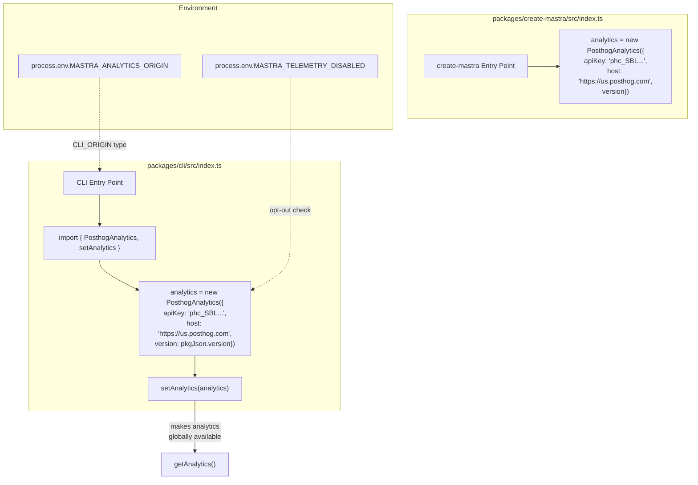
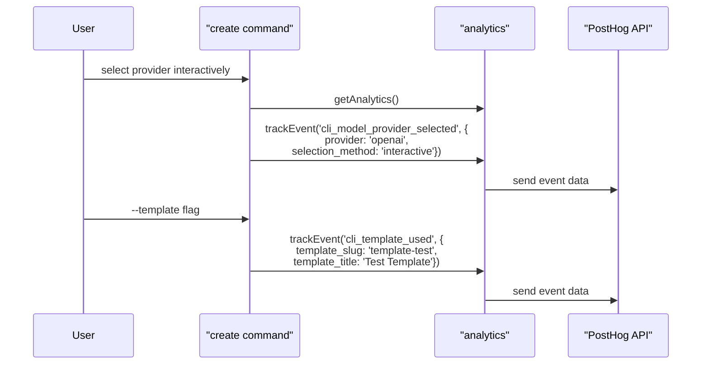
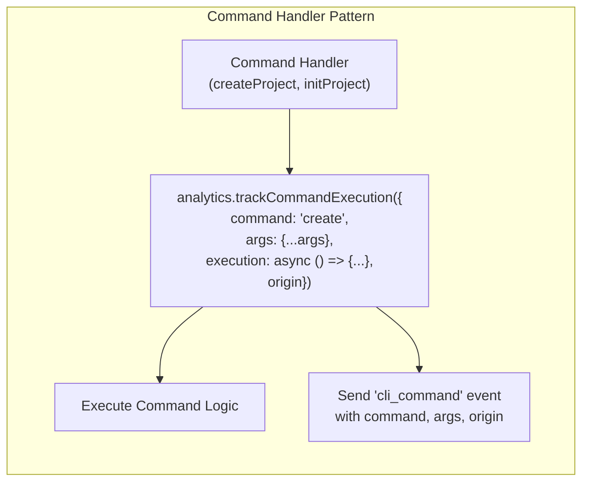
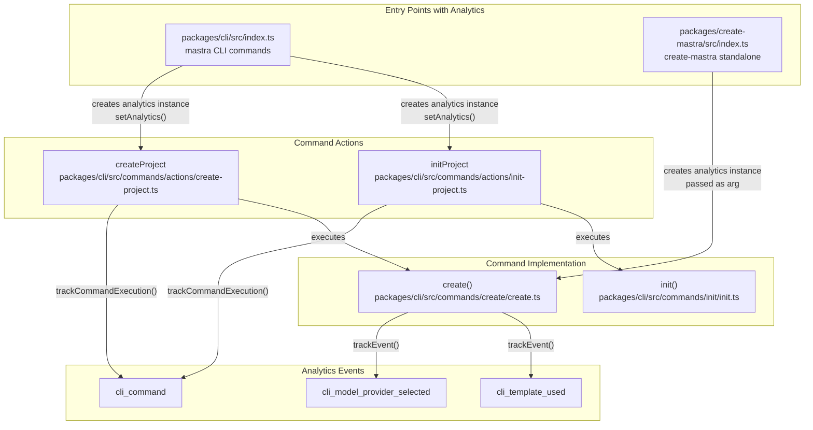
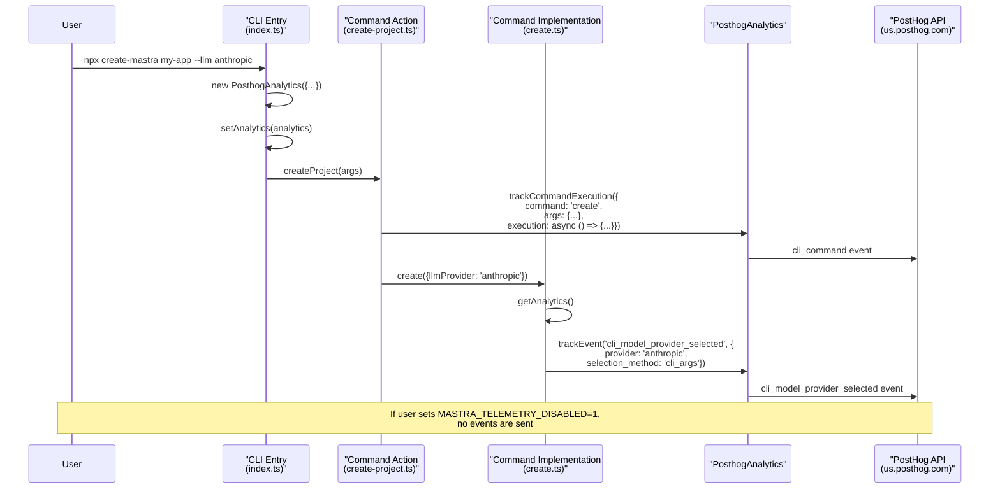

# Analytics and Telemetry

<details>
<summary>Relevant source files</summary>

The following files were used as context for generating this wiki page:

- [docs/src/content/en/reference/cli/create-mastra.mdx](docs/src/content/en/reference/cli/create-mastra.mdx)
- [packages/cli/src/commands/actions/create-project.ts](packages/cli/src/commands/actions/create-project.ts)
- [packages/cli/src/commands/actions/init-project.ts](packages/cli/src/commands/actions/init-project.ts)
- [packages/cli/src/commands/create/bun-detection.test.ts](packages/cli/src/commands/create/bun-detection.test.ts)
- [packages/cli/src/commands/create/create.test.ts](packages/cli/src/commands/create/create.test.ts)
- [packages/cli/src/commands/create/create.ts](packages/cli/src/commands/create/create.ts)
- [packages/cli/src/commands/create/utils.ts](packages/cli/src/commands/create/utils.ts)
- [packages/cli/src/commands/dev/DevBundler.test.ts](packages/cli/src/commands/dev/DevBundler.test.ts)
- [packages/cli/src/commands/init/init.test.ts](packages/cli/src/commands/init/init.test.ts)
- [packages/cli/src/commands/init/init.ts](packages/cli/src/commands/init/init.ts)
- [packages/cli/src/commands/init/utils.ts](packages/cli/src/commands/init/utils.ts)
- [packages/cli/src/commands/utils.test.ts](packages/cli/src/commands/utils.test.ts)
- [packages/cli/src/commands/utils.ts](packages/cli/src/commands/utils.ts)
- [packages/cli/src/index.ts](packages/cli/src/index.ts)
- [packages/cli/src/services/service.deps.ts](packages/cli/src/services/service.deps.ts)
- [packages/cli/src/utils/clone-template.test.ts](packages/cli/src/utils/clone-template.test.ts)
- [packages/cli/src/utils/clone-template.ts](packages/cli/src/utils/clone-template.ts)
- [packages/cli/src/utils/template-utils.test.ts](packages/cli/src/utils/template-utils.test.ts)
- [packages/cli/src/utils/template-utils.ts](packages/cli/src/utils/template-utils.ts)
- [packages/cli/tsconfig.json](packages/cli/tsconfig.json)
- [packages/create-mastra/src/index.ts](packages/create-mastra/src/index.ts)
- [packages/create-mastra/src/utils.ts](packages/create-mastra/src/utils.ts)
- [packages/create-mastra/tsconfig.json](packages/create-mastra/tsconfig.json)

</details>

This document describes the analytics and telemetry system used by the Mastra CLI to collect anonymous usage data. The system tracks CLI command usage, model provider selections, and template usage to help improve the developer experience. For information about observability within Mastra applications themselves, see the observability system documentation.

## Overview

The Mastra CLI includes an opt-in telemetry system built on PostHog that collects anonymous usage metrics. The system tracks:

- CLI command executions (create, init, dev, build, etc.)
- Model provider selections (OpenAI, Anthropic, etc.)
- Template usage patterns
- Command arguments and options (excluding sensitive data like API keys)

All telemetry data is anonymous and does not include personally identifiable information. Users can opt out by setting the `MASTRA_TELEMETRY_DISABLED` environment variable.

**Sources:** [packages/cli/src/index.ts:7-31](), [docs/src/content/en/reference/cli/create-mastra.mdx:138-152]()

## PosthogAnalytics Configuration

The analytics system initializes a `PosthogAnalytics` instance at CLI startup with a hardcoded PostHog API key and host configuration.

### CLI Analytics Setup



**PosthogAnalytics Configuration**

Both the `mastra` CLI and `create-mastra` package create their own instances of `PosthogAnalytics`:

- **API Key**: `phc_SBLpZVAB6jmHOct9CABq3PF0Yn5FU3G2FgT4xUr2XrT`
- **Host**: `https://us.posthog.com`
- **Version**: Extracted from `package.json` version field

The CLI uses `setAnalytics()` to store the instance globally, making it available to all command handlers via `getAnalytics()`.

**Sources:** [packages/cli/src/index.ts:25-31](), [packages/create-mastra/src/index.ts:12-16]()

## Analytics Origin Tracking

The `MASTRA_ANALYTICS_ORIGIN` environment variable tracks where CLI commands originate from. This is typed as `CLI_ORIGIN` and passed to tracking methods.

```typescript
// Example origin detection
const origin = process.env.MASTRA_ANALYTICS_ORIGIN as CLI_ORIGIN
```

This allows distinguishing between different invocation contexts (e.g., direct CLI usage vs. programmatic usage vs. IDE integrations).

**Sources:** [packages/cli/src/index.ts:35](), [packages/cli/src/commands/actions/init-project.ts:9](), [packages/cli/src/commands/actions/create-project.ts:7]()

## Event Tracking System

### Tracked Event Types

The telemetry system tracks three primary event types:

| Event Type                    | Description                | Data Captured                   | Trigger Points                                 |
| ----------------------------- | -------------------------- | ------------------------------- | ---------------------------------------------- |
| `cli_command`                 | Command execution tracking | Command name, args, origin      | All CLI commands via `trackCommandExecution()` |
| `cli_model_provider_selected` | Model provider selection   | Provider name, selection method | Interactive prompt or CLI args in create/init  |
| `cli_template_used`           | Template usage             | Template slug, template title   | Template creation in create command            |

### Event Tracking Methods

The `PosthogAnalytics` class provides two primary methods for event tracking:

1. **`trackEvent(eventName, properties)`** - Direct event tracking
2. **`trackCommandExecution(options)`** - Wrapper for command execution with automatic command tracking

**Direct Event Tracking Example**



**Sources:** [packages/cli/src/commands/create/create.ts:66-72](), [packages/cli/src/commands/create/create.ts:89-96](), [packages/cli/src/commands/create/create.ts:334-348]()

### Model Provider Selection Tracking

Model provider selection is tracked in both interactive and CLI argument flows:

**Interactive Selection**

```typescript
// After interactive prompt
const analytics = getAnalytics()
if (analytics && result?.llmProvider) {
  analytics.trackEvent('cli_model_provider_selected', {
    provider: result.llmProvider,
    selection_method: 'interactive',
  })
}
```

**CLI Argument Selection**

```typescript
// When provider passed as CLI arg
const analytics = getAnalytics()
if (analytics) {
  analytics.trackEvent('cli_model_provider_selected', {
    provider: llmProvider,
    selection_method: 'cli_args',
  })
}
```

The `selection_method` field distinguishes between interactive prompts and command-line arguments, enabling analysis of user interaction patterns.

**Sources:** [packages/cli/src/commands/create/create.ts:64-96](), [packages/cli/src/commands/create/create.ts:342-347]()

## Command Execution Tracking

### trackCommandExecution Wrapper

Command action files use `trackCommandExecution()` to wrap command execution with automatic analytics:



**Example: Create Command**

```typescript
export const createProject = async (projectNameArg: string | undefined, args: CreateProjectArgs) => {
  await analytics.trackCommandExecution({
    command: 'create',
    args: { ...args, projectName },
    execution: async () => {
      // Command implementation
      await create({...});
    },
    origin,
  });
};
```

This pattern ensures:

- Consistent command tracking across all CLI commands
- Command arguments are captured (excluding sensitive data)
- Execution context (origin) is recorded
- Tracking happens even if command fails

**Sources:** [packages/cli/src/commands/actions/create-project.ts:23-57](), [packages/cli/src/commands/actions/init-project.ts:22-73]()

### Command Arguments Captured

The following table shows what arguments are captured for each command:

| Command  | Captured Arguments                                                                  | Excluded  |
| -------- | ----------------------------------------------------------------------------------- | --------- |
| `create` | default, components, llm, example, timeout, dir, projectName, mcp, skills, template | llmApiKey |
| `init`   | default, dir, components, llm, example, mcp                                         | llmApiKey |

API keys and other sensitive data are explicitly excluded from telemetry.

**Sources:** [packages/cli/src/commands/actions/create-project.ts:9-21](), [packages/cli/src/commands/actions/init-project.ts:11-19]()

## Template Usage Tracking

When users create projects from templates, the system tracks which templates are being used:

```typescript
// Track template usage
const analytics = args.injectedAnalytics || getAnalytics()
if (analytics) {
  analytics.trackEvent('cli_template_used', {
    template_slug: selectedTemplate.slug,
    template_title: selectedTemplate.title,
  })

  // Track model provider selection
  if (llmProvider) {
    analytics.trackEvent('cli_model_provider_selected', {
      provider: llmProvider,
      selection_method: args.llmProvider ? 'cli_args' : 'interactive',
    })
  }
}
```

This tracking occurs for:

- Named templates (e.g., `--template browsing-agent`)
- GitHub URL templates (e.g., `--template https://github.com/user/repo`)
- Interactive template selection

**Sources:** [packages/cli/src/commands/create/create.ts:334-348]()

## Privacy and Opt-Out Mechanism

### Opting Out of Telemetry

Users can disable telemetry by setting the `MASTRA_TELEMETRY_DISABLED` environment variable:

```bash
# Permanently disable
export MASTRA_TELEMETRY_DISABLED=1

# One-time disable
MASTRA_TELEMETRY_DISABLED=1 npx create-mastra@latest
```

The environment variable accepts two values:

- `"true"`
- `"1"`

When set, the analytics system should skip all event tracking (implementation handled by `PosthogAnalytics` class).

**Sources:** [docs/src/content/en/reference/cli/create-mastra.mdx:142-152]()

### What Data is Collected

According to the documentation, the system collects:

- Operating system information
- Mastra version
- Node.js version
- Command names and non-sensitive arguments
- Template usage patterns
- Model provider selections

**Not collected:**

- API keys or credentials
- Project code or file contents
- Personally identifiable information
- User names or email addresses

The source code for analytics can be reviewed at `packages/cli/src/analytics/index.ts` (reference in documentation).

**Sources:** [docs/src/content/en/reference/cli/create-mastra.mdx:140-141]()

## Analytics Integration Points

### CLI Entry Points



### Analytics Data Flow



**Sources:** [packages/cli/src/index.ts:1-49](), [packages/cli/src/commands/actions/create-project.ts:23-57](), [packages/cli/src/commands/create/create.ts:34-110]()

## Key Files and Components

| Component               | File Path                                             | Purpose                                 |
| ----------------------- | ----------------------------------------------------- | --------------------------------------- |
| CLI Analytics Setup     | `packages/cli/src/index.ts`                           | Creates global analytics instance       |
| create-mastra Analytics | `packages/create-mastra/src/index.ts`                 | Standalone analytics instance           |
| Create Command Action   | `packages/cli/src/commands/actions/create-project.ts` | Wraps create with trackCommandExecution |
| Init Command Action     | `packages/cli/src/commands/actions/init-project.ts`   | Wraps init with trackCommandExecution   |
| Create Implementation   | `packages/cli/src/commands/create/create.ts`          | Tracks provider and template selection  |
| Analytics Documentation | `docs/src/content/en/reference/cli/create-mastra.mdx` | Public telemetry documentation          |

**Sources:** All files listed in table above
