# Build System and Dependency Analysis

<details>
<summary>Relevant source files</summary>

The following files were used as context for generating this wiki page:

- [deployers/cloudflare/src/index.ts](deployers/cloudflare/src/index.ts)
- [deployers/netlify/src/index.ts](deployers/netlify/src/index.ts)
- [deployers/vercel/src/index.ts](deployers/vercel/src/index.ts)
- [docs/src/content/en/docs/deployment/studio.mdx](docs/src/content/en/docs/deployment/studio.mdx)
- [e2e-tests/monorepo/monorepo.test.ts](e2e-tests/monorepo/monorepo.test.ts)
- [e2e-tests/monorepo/template/apps/custom/src/mastra/index.ts](e2e-tests/monorepo/template/apps/custom/src/mastra/index.ts)
- [packages/cli/src/commands/build/BuildBundler.ts](packages/cli/src/commands/build/BuildBundler.ts)
- [packages/cli/src/commands/build/build.ts](packages/cli/src/commands/build/build.ts)
- [packages/cli/src/commands/dev/DevBundler.ts](packages/cli/src/commands/dev/DevBundler.ts)
- [packages/cli/src/commands/dev/dev.ts](packages/cli/src/commands/dev/dev.ts)
- [packages/cli/src/commands/studio/studio.test.ts](packages/cli/src/commands/studio/studio.test.ts)
- [packages/cli/src/commands/studio/studio.ts](packages/cli/src/commands/studio/studio.ts)
- [packages/core/src/bundler/index.ts](packages/core/src/bundler/index.ts)
- [packages/deployer/src/build/analyze.ts](packages/deployer/src/build/analyze.ts)
- [packages/deployer/src/build/analyze/**snapshots**/analyzeEntry.test.ts.snap](packages/deployer/src/build/analyze/__snapshots__/analyzeEntry.test.ts.snap)
- [packages/deployer/src/build/analyze/analyzeEntry.test.ts](packages/deployer/src/build/analyze/analyzeEntry.test.ts)
- [packages/deployer/src/build/analyze/analyzeEntry.ts](packages/deployer/src/build/analyze/analyzeEntry.ts)
- [packages/deployer/src/build/analyze/bundleExternals.test.ts](packages/deployer/src/build/analyze/bundleExternals.test.ts)
- [packages/deployer/src/build/analyze/bundleExternals.ts](packages/deployer/src/build/analyze/bundleExternals.ts)
- [packages/deployer/src/build/bundler.ts](packages/deployer/src/build/bundler.ts)
- [packages/deployer/src/build/utils.test.ts](packages/deployer/src/build/utils.test.ts)
- [packages/deployer/src/build/utils.ts](packages/deployer/src/build/utils.ts)
- [packages/deployer/src/build/watcher.test.ts](packages/deployer/src/build/watcher.test.ts)
- [packages/deployer/src/build/watcher.ts](packages/deployer/src/build/watcher.ts)
- [packages/deployer/src/bundler/index.ts](packages/deployer/src/bundler/index.ts)
- [packages/deployer/src/server/**tests**/option-studio-base.test.ts](packages/deployer/src/server/__tests__/option-studio-base.test.ts)
- [packages/deployer/src/server/index.ts](packages/deployer/src/server/index.ts)
- [packages/playground/e2e/tests/auth/infrastructure.spec.ts](packages/playground/e2e/tests/auth/infrastructure.spec.ts)
- [packages/playground/e2e/tests/auth/viewer-role.spec.ts](packages/playground/e2e/tests/auth/viewer-role.spec.ts)
- [packages/playground/index.html](packages/playground/index.html)
- [packages/playground/src/App.tsx](packages/playground/src/App.tsx)
- [packages/playground/src/components/ui/app-sidebar.tsx](packages/playground/src/components/ui/app-sidebar.tsx)

</details>

The build system and dependency analysis subsystem provides the core bundling infrastructure for Mastra applications. It orchestrates a three-phase pipeline that analyzes entry files, optimizes dependencies, and validates the generated bundles. This system enables Mastra to deploy to multiple platforms (Node.js, Cloudflare Workers, Vercel, Netlify) by performing sophisticated dependency tree-shaking, workspace package compilation, and external dependency tracking.

For information about the CLI commands that invoke this system, see [CLI Command Reference](#8.6). For information about specific platform deployers that use this system, see [Platform Deployers](#8.5).

## Three-Phase Analysis Pipeline

The build system follows a three-phase pipeline orchestrated by the `analyzeBundle` function. Each phase has distinct responsibilities and outputs that feed into the next phase.

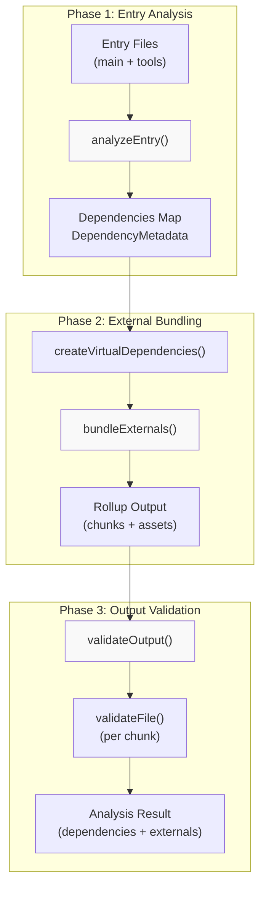

**Diagram 1: Three-Phase Pipeline Architecture**

The pipeline begins when `analyzeBundle` is called with an array of entry points (typically the main Mastra file plus tool files), processes them through three distinct phases, and returns a comprehensive analysis result containing dependency mappings and external dependency version information.

Sources: [packages/deployer/src/build/analyze.ts:296-499]()

### Pipeline Orchestration

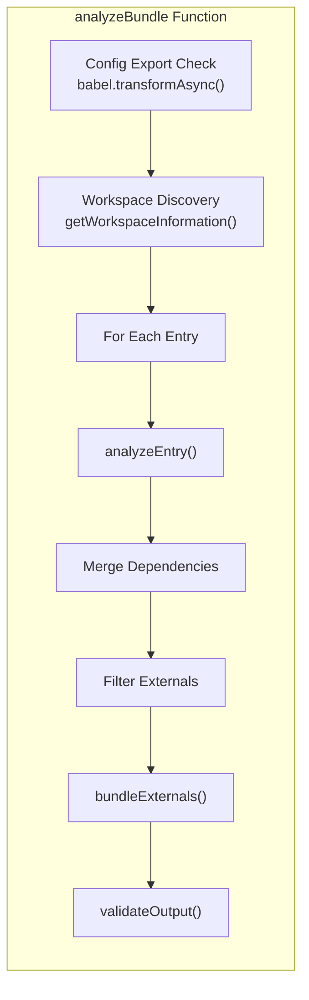

**Diagram 2: analyzeBundle Orchestration Flow**

The `analyzeBundle` function [packages/deployer/src/build/analyze.ts:296-499]() coordinates the entire process. It first validates the Mastra configuration using Babel to check for a proper `export const mastra = new Mastra({})` statement [packages/deployer/src/build/analyze.ts:314-332](). It then discovers workspace packages using `getWorkspaceInformation` [packages/deployer/src/build/analyze.ts:334]() before iterating through all entry files.

For each entry, it calls `analyzeEntry` [packages/deployer/src/build/analyze.ts:353-363]() to discover dependencies. Dependencies are accumulated in a `Map<string, DependencyMetadata>` where the key is the dependency specifier (e.g., `"lodash"` or `"@mastra/core/logger"`) and the value contains exports, rootPath, workspace status, and version information [packages/deployer/src/build/analyze.ts:344-388]().

The function filters dependencies based on the `externals` configuration: if a dependency matches an external pattern or if `externals: true` is set, it's added to `allUsedExternals` instead of `depsToOptimize` [packages/deployer/src/build/analyze.ts:366-376](). During development (`isDev: true`) or with `externals: true`, only workspace packages are kept in `depsToOptimize` [packages/deployer/src/build/analyze.ts:394-400]().

Sources: [packages/deployer/src/build/analyze.ts:296-499](), [packages/deployer/src/build/analyze/analyzeEntry.ts:272-337]()

## Phase 1: Entry Analysis

Phase 1 analyzes individual entry files to discover their dependency graphs. The `analyzeEntry` function uses Rollup to parse and bundle each entry in isolation, capturing all imports (both static and dynamic) without performing full bundling.

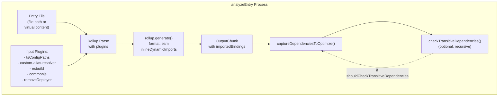

**Diagram 3: analyzeEntry Function Flow**

The `analyzeEntry` function [packages/deployer/src/build/analyze/analyzeEntry.ts:272-337]() accepts either a file path or virtual content string. For virtual files, it uses the `@rollup/plugin-virtual` plugin to create an in-memory module [packages/deployer/src/build/analyze/analyzeEntry.ts:31-37]().

The plugin chain includes:

- **tsConfigPaths**: Resolves TypeScript path mappings from tsconfig.json [packages/deployer/src/build/analyze/analyzeEntry.ts:46]()
- **custom-alias-resolver**: Maps `#server` to `@mastra/deployer/server` and `#mastra` to the actual Mastra entry file [packages/deployer/src/build/analyze/analyzeEntry.ts:48-60]()
- **esbuild**: Transpiles TypeScript and modern JavaScript [packages/deployer/src/build/analyze/analyzeEntry.ts:62]()
- **commonjs**: Converts CommonJS modules to ESM [packages/deployer/src/build/analyze/analyzeEntry.ts:63-68]()
- **removeDeployer**: Strips deployer-related code from the Mastra entry [packages/deployer/src/build/analyze/analyzeEntry.ts:69-71]()

After generation, the function calls `captureDependenciesToOptimize` [packages/deployer/src/build/analyze/analyzeEntry.ts:319-328]() which extracts dependency information from the `OutputChunk.importedBindings` object [packages/deployer/src/build/analyze/analyzeEntry.ts:110-144]().

Sources: [packages/deployer/src/build/analyze/analyzeEntry.ts:272-337](), [packages/deployer/src/build/analyze/analyzeEntry.ts:21-77](), [packages/deployer/src/build/analyze/analyzeEntry.ts:84-256]()

### Dependency Metadata Extraction

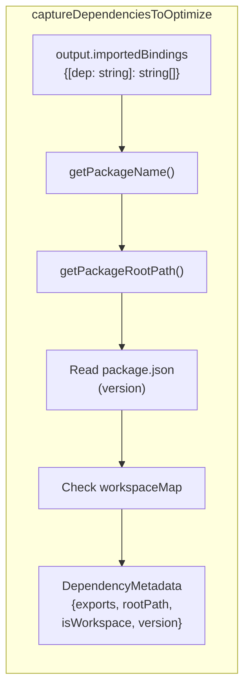

**Diagram 4: Dependency Metadata Extraction Flow**

For each dependency in `importedBindings`, the function:

1. **Extracts package name** using `getPackageName` which handles both scoped (`@scope/package`) and unscoped packages [packages/deployer/src/build/utils.ts:75-83]()
2. **Resolves root path** using `getPackageRootPath` to find the package's root directory [packages/deployer/src/build/analyze/analyzeEntry.ts:122]()
3. **Reads version** from the package's package.json [packages/deployer/src/build/analyze/analyzeEntry.ts:126-133]()
4. **Checks workspace status** by looking up the package name in the workspace map [packages/deployer/src/build/analyze/analyzeEntry.ts:123]()
5. **Creates DependencyMetadata** with exports (the imported bindings), rootPath (normalized with forward slashes), isWorkspace flag, and version [packages/deployer/src/build/analyze/analyzeEntry.ts:138-143]()

Dynamic imports are captured from `output.dynamicImports` and added with `exports: ['*']` since the specific bindings aren't statically analyzable [packages/deployer/src/build/analyze/analyzeEntry.ts:224-252]().

Sources: [packages/deployer/src/build/analyze/analyzeEntry.ts:84-256](), [packages/deployer/src/build/utils.ts:75-83]()

### Transitive Dependency Discovery

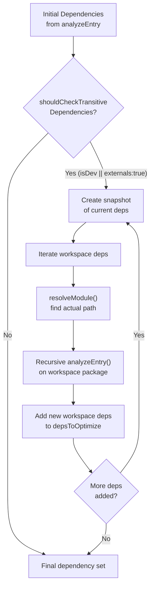

**Diagram 5: Transitive Dependency Discovery Algorithm**

When `shouldCheckTransitiveDependencies` is enabled (during `mastra dev` or with `externals: true`), the system recursively discovers workspace dependencies that are imported by other workspace dependencies [packages/deployer/src/build/analyze/analyzeEntry.ts:149-217]().

The algorithm:

1. **Creates a snapshot** of current dependencies to safely iterate [packages/deployer/src/build/analyze/analyzeEntry.ts:161]()
2. **Filters for workspace packages** that haven't been processed yet [packages/deployer/src/build/analyze/analyzeEntry.ts:165-168]()
3. **Resolves the workspace package** using `resolveModule` with ESM-compatible URL resolution [packages/deployer/src/build/analyze/analyzeEntry.ts:175-177]()
4. **Recursively analyzes** the workspace package by calling `analyzeEntry` again [packages/deployer/src/build/analyze/analyzeEntry.ts:183-189]()
5. **Merges discovered dependencies** that are workspace packages into the main map [packages/deployer/src/build/analyze/analyzeEntry.ts:196-206]()
6. **Repeats** until no new workspace dependencies are found [packages/deployer/src/build/analyze/analyzeEntry.ts:214-216]()

This ensures that if your main entry imports `@workspace/utils`, and `@workspace/utils` imports `@workspace/shared`, both packages are compiled and available during development.

Sources: [packages/deployer/src/build/analyze/analyzeEntry.ts:149-217]()

## Phase 2: External Bundling

Phase 2 takes the dependencies discovered in Phase 1 and bundles them into optimized ESM modules. This phase involves creating virtual entry points for each dependency with tree-shaken exports, then using Rollup to bundle them.

```mermaid
graph TB
    subgraph "bundleExternals Process"
        DEPS_TO_OPT["depsToOptimize Map<br/>from Phase 1"]
        CREATE_VIRTUAL["createVirtualDependencies()"]
        VIRTUAL_MAP["Virtual Dependencies Map<br/>{name, virtual}"]
        GET_PLUGINS["getInputPlugins()"]
        ROLLUP_BUNDLE["Rollup Bundle<br/>with virtual modules"]
        WRITE_OUTPUT["rollup.write()<br/>ESM chunks"]
        BUILD_RESOLVE_MAP["Build module<br/>resolve map"]
        USED_EXTERNALS["usedExternals<br/>Record<filepath, deps>"]
    end

    DEPS_TO_OPT --> CREATE_VIRTUAL
    CREATE_VIRTUAL --> VIRTUAL_MAP
    VIRTUAL_MAP --> GET_PLUGINS
    GET_PLUGINS --> ROLLUP_BUNDLE
    ROLLUP_BUNDLE --> WRITE_OUTPUT
    WRITE_OUTPUT --> BUILD_RESOLVE_MAP
    BUILD_RESOLVE_MAP --> USED_EXTERNALS
```

**Diagram 6: bundleExternals Process Flow**

The `bundleExternals` function [packages/deployer/src/build/analyze/bundleExternals.ts:451-587]() orchestrates Phase 2. It handles the special case where `externals: true` is set: non-workspace dependencies are extracted from `depsToOptimize` and added directly to `extractedExternals` [packages/deployer/src/build/analyze/bundleExternals.ts:494-504](), skipping bundling for them.

Sources: [packages/deployer/src/build/analyze/bundleExternals.ts:451-587]()

### Virtual Module Generation

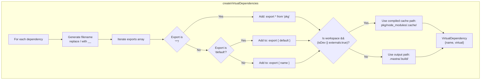

**Diagram 7: Virtual Dependency Creation Algorithm**

The `createVirtualDependencies` function [packages/deployer/src/build/analyze/bundleExternals.ts:47-130]() transforms the `DependencyMetadata` map into virtual module definitions. For each dependency:

1. **Generates a safe filename** by replacing `/` with `__` to avoid path conflicts (e.g., `@scope/package` becomes `@scope__package`) [packages/deployer/src/build/analyze/bundleExternals.ts:72]()

2. **Builds the virtual file content** by iterating through the exports array [packages/deployer/src/build/analyze/bundleExternals.ts:76-93]():
   - `'*'` exports generate `export * from 'pkg';`
   - `'default'` exports are added to the named exports list
   - Other strings are treated as named exports
   - The final output is `export { default, named1, named2 } from 'pkg';`

3. **Determines the entry name** based on workspace status [packages/deployer/src/build/analyze/bundleExternals.ts:107-126]():
   - For workspace packages during dev: `getCompiledDepCachePath(rootPath, fileName)` which resolves to `{rootPath}/node_modules/.cache/{fileName}` [packages/deployer/src/build/utils.ts:89-91]()
   - For other dependencies: `{outputDir}/{fileName}`

This virtual module approach enables tree-shaking by creating entry points that only import and re-export the specific bindings used by the application.

Sources: [packages/deployer/src/build/analyze/bundleExternals.ts:47-130](), [packages/deployer/src/build/utils.ts:89-91]()

### Plugin Configuration

The `getInputPlugins` function [packages/deployer/src/build/analyze/bundleExternals.ts:136-284]() configures the Rollup plugin chain for bundling external dependencies:

| Plugin                     | Purpose                                                | Configuration                                      |
| -------------------------- | ------------------------------------------------------ | -------------------------------------------------- |
| `virtual`                  | Provides virtual module definitions                    | Maps `#virtual-{dep}` to virtual file content      |
| `tsConfigPaths`            | Resolves TypeScript path aliases                       | Uses project's tsconfig.json                       |
| `subpathExternalsResolver` | Handles subpath imports (e.g., `lodash/fp`)            | Marks matching externals                           |
| `esbuild`                  | Transpiles workspace packages                          | Only processes packages in `transpilePackages` set |
| `alias-optimized-deps`     | Resolves workspace packages for `externals: true` mode | Reads package.json to find actual entry point      |
| `optimizeLodashImports`    | Optimizes lodash imports                               | Converts to per-method imports                     |
| `commonjs`                 | Converts CommonJS to ESM                               | With strict requires and mixed module support      |
| `nodeResolve`              | Resolves Node.js modules                               | Platform-aware (node/browser/neutral)              |
| `esmShim`                  | Adds ESM compatibility shims                           | Only for `noBundling` mode                         |
| `aliasHono`                | Resolves hono from deployer                            | Uses deployer's hono installation                  |
| `json`                     | Handles JSON imports                                   | Standard JSON plugin                               |
| `nodeGypDetector`          | Detects native bindings                                | Throws error for `.node` files                     |
| `moduleResolveMap`         | Builds resolution map for validation                   | Tracks where externals are resolved                |

The `transpilePackages` set automatically includes all workspace packages [packages/deployer/src/build/analyze/bundleExternals.ts:488](). The esbuild plugin is configured with precise include patterns that match workspace package directories while excluding nested node_modules [packages/deployer/src/build/analyze/bundleExternals.ts:177-196]().

Sources: [packages/deployer/src/build/analyze/bundleExternals.ts:136-284]()

### Rollup Bundle Execution

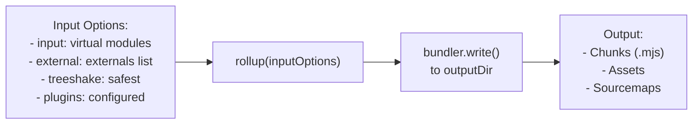

**Diagram 8: Rollup Bundle Execution**

The bundling phase [packages/deployer/src/build/analyze/bundleExternals.ts:333-408]() calls Rollup with:

- **Input**: All virtual modules mapped as entries [packages/deployer/src/build/analyze/bundleExternals.ts:335-340]()
- **External**: The combined list of global externals (pino, pg, etc.) and user-specified externals [packages/deployer/src/build/analyze/bundleExternals.ts:342]()
- **Treeshake**: Set to `false` for `noBundling` mode (dev or externals preset), otherwise `'safest'` [packages/deployer/src/build/analyze/bundleExternals.ts:343]()
- **Output configuration**:
  - Format: ESM [packages/deployer/src/build/analyze/bundleExternals.ts:350]()
  - Entry file names: `[name].mjs` [packages/deployer/src/build/analyze/bundleExternals.ts:352]()
  - Chunk file names: Dynamically determined based on workspace package location [packages/deployer/src/build/analyze/bundleExternals.ts:359-401]()
  - Sourcemaps: Always enabled for error tracking [packages/deployer/src/build/analyze/bundleExternals.ts:354]()

The chunk file naming logic handles shared chunks during `noBundling` mode by placing them in the appropriate workspace package's cache directory [packages/deployer/src/build/analyze/bundleExternals.ts:364-398]().

Sources: [packages/deployer/src/build/analyze/bundleExternals.ts:290-409]()

### Module Resolution Map

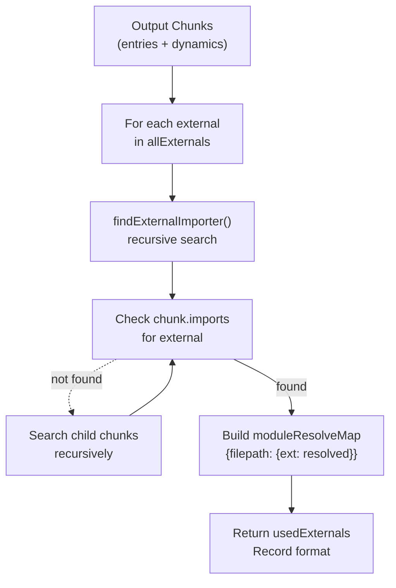

**Diagram 9: Module Resolution Map Building**

After bundling, the system builds a `moduleResolveMap` that tracks which file imports which external dependency [packages/deployer/src/build/analyze/bundleExternals.ts:529-559](). This map is used during validation to set up the proper resolution context.

The `findExternalImporter` function [packages/deployer/src/build/analyze/bundleExternals.ts:415-440]() recursively searches through the chunk graph:

1. **Checks direct imports** of the current chunk [packages/deployer/src/build/analyze/bundleExternals.ts:418-423]()
2. **Captures referenced chunks** (other `.mjs` files) [packages/deployer/src/build/analyze/bundleExternals.ts:424-426]()
3. **Recursively searches child chunks** until it finds the chunk that imports the external [packages/deployer/src/build/analyze/bundleExternals.ts:428-437]()

The final `usedExternals` is a prototype-less object (created with `Object.create(null)`) where keys are full file paths and values are objects mapping external names to their resolved module IDs [packages/deployer/src/build/analyze/bundleExternals.ts:564-571]().

For `externals: true` mode, extracted non-workspace dependencies are added with a synthetic `__externals__` path [packages/deployer/src/build/analyze/bundleExternals.ts:577-584]().

Sources: [packages/deployer/src/build/analyze/bundleExternals.ts:415-440](), [packages/deployer/src/build/analyze/bundleExternals.ts:529-587]()

## Phase 3: Output Validation

Phase 3 validates that the bundled output is executable by attempting to import and run each generated module. This catches bundling errors early and provides actionable error messages.

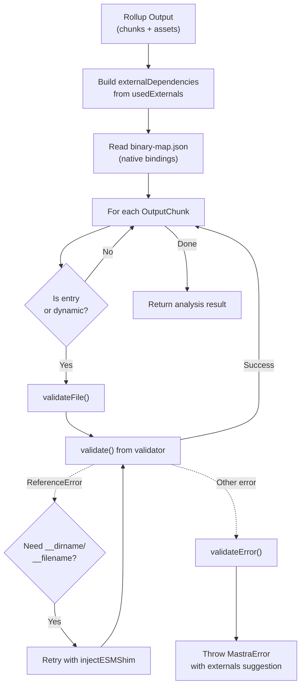

**Diagram 10: Output Validation Flow**

The `validateOutput` function [packages/deployer/src/build/analyze.ts:220-286]() coordinates validation. It first builds the `externalDependencies` map from the `usedExternals` record, preferring version info from the dependency analysis [packages/deployer/src/build/analyze.ts:248-257]().

If a `binary-map.json` file exists (created by the `nodeGypDetector` plugin), it's read to track packages with native bindings [packages/deployer/src/build/analyze.ts:260-263]().

For each output chunk that is an entry or dynamic entry, `validateFile` is called [packages/deployer/src/build/analyze.ts:265-283]().

Sources: [packages/deployer/src/build/analyze.ts:220-286]()

### File Validation

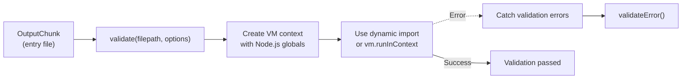

**Diagram 11: Individual File Validation**

The `validateFile` function [packages/deployer/src/build/analyze.ts:158-207]() attempts to validate a bundled chunk by importing it. The actual validation is performed by the `validate` function from `packages/deployer/src/validator/validate` [packages/deployer/src/build/analyze.ts:178-182]().

If validation fails with a `ReferenceError` for `__dirname` or `__filename`, the system retries with `injectESMShim: true` which adds CommonJS compatibility shims [packages/deployer/src/build/analyze.ts:187-200]().

If validation still fails, `validateError` [packages/deployer/src/build/analyze.ts:74-156]() analyzes the error to provide helpful feedback.

Sources: [packages/deployer/src/build/analyze.ts:158-207](), [packages/deployer/src/build/analyze.ts:74-156]()

### Error Classification and Reporting

The `validateError` function uses stack trace analysis to identify the problematic package:

| Error Type       | Detection                         | Package Extraction                      | Error ID                                | Message Template                                                    |
| ---------------- | --------------------------------- | --------------------------------------- | --------------------------------------- | ------------------------------------------------------------------- |
| TypeError        | `err.type === 'TypeError'`        | Parse stack trace or use chunk filename | `DEPLOYER_ANALYZE_TYPE_ERROR`           | "Mastra wasn't able to bundle X, might be an older commonJS module" |
| MODULE_NOT_FOUND | `[ERR_MODULE_NOT_FOUND]` in stack | Extract from error message              | `DEPLOYER_ANALYZE_MODULE_NOT_FOUND`     | "We couldn't load X from Y. Make sure X is installed"               |
| Native binding   | "No native build was found"       | Use binary-map.json data                | `DEPLOYER_ANALYZE_MISSING_NATIVE_BUILD` | "We found a binary dependency but cannot bundle it yet"             |
| Workspace error  | Package in workspaceMap           | Direct from error                       | `DEPLOYER_ANALYZE_ERROR_IN_WORKSPACE`   | "We found an error in the X workspace package"                      |

For TypeErrors, the system parses the stack trace using `stacktrace-parser` to find the first frame from `node_modules` [packages/deployer/src/build/analyze.ts:93-102]().

For MODULE_NOT_FOUND errors, it extracts the missing package name using regex: `/Cannot find package '([^']+)'/` [packages/deployer/src/build/analyze.ts:109]().

For native binding errors, it consults the `binaryMapData` loaded from `binary-map.json` [packages/deployer/src/build/analyze.ts:125-132]().

If the problematic package is a workspace package, it throws a special error advising the developer to fix the workspace package directly [packages/deployer/src/build/analyze.ts:134-146](). Otherwise, it suggests adding the package to externals [packages/deployer/src/build/analyze.ts:148-155]().

Sources: [packages/deployer/src/build/analyze.ts:74-156]()

## Dependency Metadata Structure

The build system tracks comprehensive metadata about each dependency to enable intelligent bundling decisions.

### DependencyMetadata Type

```typescript
interface DependencyMetadata {
  exports: string[]
  rootPath: string | null
  isWorkspace: boolean
  version?: string
}
```

**Type Definition: DependencyMetadata**

The `DependencyMetadata` interface [packages/deployer/src/build/types.ts:4-21]() contains:

| Field         | Type             | Purpose                                                                       | Example                                                            |
| ------------- | ---------------- | ----------------------------------------------------------------------------- | ------------------------------------------------------------------ |
| `exports`     | `string[]`       | List of imported bindings from the dependency                                 | `['map', 'filter', 'default']` or `['*']`                          |
| `rootPath`    | `string \| null` | Absolute path to the package root directory (normalized with forward slashes) | `'/project/node_modules/lodash'` or `'/workspace/packages/shared'` |
| `isWorkspace` | `boolean`        | Whether the dependency is a workspace package                                 | `true` for `@workspace/utils`, `false` for `lodash`                |
| `version`     | `string?`        | Exact version from package.json                                               | `'4.17.21'`                                                        |

The `exports` array uses special values:

- `'*'` indicates a namespace import (`import * as foo from 'foo'`) or dynamic import
- `'default'` indicates a default import (`import foo from 'foo'`)
- Other strings are named imports (`import { map } from 'lodash'`)

Sources: [packages/deployer/src/build/types.ts:1-21]()

### External Dependency Tracking

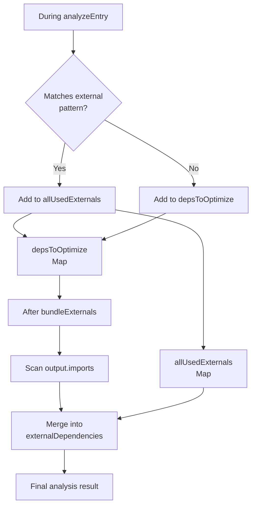

**Diagram 12: External Dependency Tracking Flow**

The system maintains two separate maps during analysis:

1. **depsToOptimize**: Dependencies that will be bundled in Phase 2 [packages/deployer/src/build/analyze.ts:344]()
2. **allUsedExternals**: Dependencies that are marked external and won't be bundled [packages/deployer/src/build/analyze.ts:350]()

During Phase 1, as each entry is analyzed, dependencies are categorized [packages/deployer/src/build/analyze.ts:365-388]():

- If the dependency matches an external pattern or `externals: true` is set, and it's not a workspace package, it goes to `allUsedExternals`
- Otherwise, it goes to `depsToOptimize` (or gets merged if already present)

After Phase 2, the system scans all output chunks' `imports` arrays [packages/deployer/src/build/analyze.ts:442-470]() to catch any dependencies that weren't in the analysis (e.g., dependencies of dependencies). It filters out:

- Built-in Node.js modules [packages/deployer/src/build/analyze.ts:448-450]()
- Relative imports (local chunks) [packages/deployer/src/build/analyze.ts:452-455]()
- Workspace packages [packages/deployer/src/build/analyze.ts:457-460]()

The final result merges `allUsedExternals` with `result.externalDependencies` from validation, preferring entries with version info [packages/deployer/src/build/analyze.ts:486-493]().

Sources: [packages/deployer/src/build/analyze.ts:344-470](), [packages/deployer/src/build/analyze.ts:485-498]()

## Workspace Package Handling

Workspace packages (monorepo packages) receive special treatment to enable hot reloading during development and proper compilation.

### Workspace Discovery

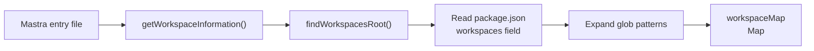

**Diagram 13: Workspace Discovery Process**

The `getWorkspaceInformation` function [packages/deployer/src/bundler/workspaceDependencies.ts]() discovers workspace packages:

1. **Finds workspace root** using `findWorkspacesRoot` from the `find-workspaces` package
2. **Reads workspaces field** from root package.json (supports both `workspaces` array and `workspaces.packages` array)
3. **Expands glob patterns** (e.g., `packages/*`) to find all workspace directories
4. **Builds workspace map** with entries like:
   ```typescript
   Map<string, WorkspacePackageInfo> {
     '@workspace/utils' => {
       location: '/project/packages/utils',
       dependencies: { lodash: '^4.17.21' },
       version: '1.0.0'
     }
   }
   ```

This map is used throughout the build system to identify workspace packages and handle them differently from external npm packages.

Sources: [packages/deployer/src/bundler/workspaceDependencies.ts]()

### Compilation Cache for Development

During `mastra dev`, workspace packages are compiled to JavaScript and cached in a special location to enable hot reloading.

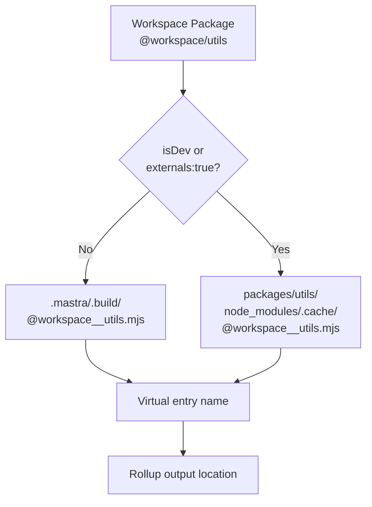

**Diagram 14: Workspace Package Output Location Selection**

The `createVirtualDependencies` function adjusts the output path for workspace packages during development [packages/deployer/src/build/analyze/bundleExternals.ts:107-126]():

- **Production path**: `{outputDir}/{package-name}` (e.g., `.mastra/.build/@workspace__utils`)
- **Development cache path**: `{workspace-location}/node_modules/.cache/{filename}` via `getCompiledDepCachePath` [packages/deployer/src/build/utils.ts:89-91]()

This cache path enables the development server to reference the compiled workspace packages directly from their source locations, making hot reloading work seamlessly. When a workspace package changes, only that package's cache needs to be recompiled.

The `alias-optimized-deps` plugin in the main bundler [packages/deployer/src/build/bundler.ts:55-78]() resolves imports to workspace packages using these cache paths during development:

```typescript
resolveId(id: string) {
  if (!analyzedBundleInfo.dependencies.has(id)) {
    return null;
  }

  const filename = analyzedBundleInfo.dependencies.get(id)!;
  const absolutePath = join(workspaceRoot || projectRoot, filename);

  if (isDev) {
    return {
      id: process.platform === 'win32' ? pathToFileURL(absolutePath).href : absolutePath,
      external: true,
    };
  }

  return { id: absolutePath, external: false };
}
```

During development, workspace dependencies are marked as external and resolved to their cache paths [packages/deployer/src/build/bundler.ts:65-70](). For production builds, they're bundled directly [packages/deployer/src/build/bundler.ts:73-77]().

Sources: [packages/deployer/src/build/analyze/bundleExternals.ts:107-126](), [packages/deployer/src/build/utils.ts:87-91](), [packages/deployer/src/build/bundler.ts:54-78]()

### Workspace Package Filtering

When determining which dependencies to bundle, the system applies special logic for workspace packages:

```typescript
// After analyzing all entries
if (isDev || externalsPreset) {
  for (const [dep, metadata] of depsToOptimize.entries()) {
    if (!metadata.isWorkspace) {
      depsToOptimize.delete(dep)
    }
  }
}
```

In development mode or with `externals: true`, only workspace packages remain in `depsToOptimize` [packages/deployer/src/build/analyze.ts:394-400](). All other dependencies are treated as external. This ensures that workspace packages are compiled (for hot reload) while external npm packages are left as-is (for faster rebuilds).

The `bundleExternals` function also handles this case by extracting non-workspace packages when `externals: true` [packages/deployer/src/build/analyze/bundleExternals.ts:495-504]():

```typescript
if (externalsPreset) {
  for (const [dep, metadata] of depsToOptimize.entries()) {
    if (!metadata.isWorkspace) {
      extractedExternals.set(dep, metadata.rootPath ?? dep)
      depsToOptimize.delete(dep)
    }
  }
}
```

Sources: [packages/deployer/src/build/analyze.ts:393-400](), [packages/deployer/src/build/analyze/bundleExternals.ts:494-504]()

## Platform-Aware Bundling

The build system supports three bundler platforms that affect module resolution and code generation: `'node'`, `'browser'`, and `'neutral'`.

### Platform Configuration

| Platform    | Use Case                                        | Module Resolution                        | Built-ins                                | Example Deployer                              |
| ----------- | ----------------------------------------------- | ---------------------------------------- | ---------------------------------------- | --------------------------------------------- |
| `'node'`    | Node.js servers, serverless functions           | Prefers Node.js export conditions        | Externalizes Node.js built-in modules    | BuildBundler, VercelDeployer, NetlifyDeployer |
| `'browser'` | Browser-like runtimes with no Node.js built-ins | Prefers browser/worker export conditions | Polyfills or errors on Node.js built-ins | CloudflareDeployer                            |
| `'neutral'` | Runtime-agnostic code, preserves all globals    | No special export conditions             | Preserves all globals as-is              | DevBundler (when using Bun)                   |

Each `Bundler` subclass sets its platform in the constructor:

**BuildBundler and DevBundler** [packages/cli/src/commands/build/BuildBundler.ts:15-16]():

```typescript
this.platform = process.versions?.bun ? 'neutral' : 'node'
```

**CloudflareDeployer** [deployers/cloudflare/src/index.ts:48]():

```typescript
this.platform = 'browser'
```

**VercelDeployer and NetlifyDeployer**: Inherit `'node'` from `Deployer` base class (default) [packages/deployer/src/bundler/index.ts:31]()

Sources: [packages/deployer/src/bundler/index.ts:28-31](), [deployers/cloudflare/src/index.ts:44-48](), [packages/cli/src/commands/build/BuildBundler.ts:12-17](), [packages/cli/src/commands/dev/DevBundler.ts:16-21]()

### Node.js Platform Resolution

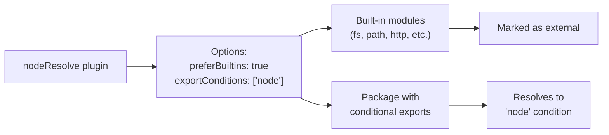

**Diagram 15: Node.js Platform Resolution Strategy**

For Node.js platform, `getNodeResolveOptions` returns [packages/deployer/src/build/utils.ts:27-39]():

```typescript
{
  preferBuiltins: true,
  exportConditions: ['node']
}
```

This configuration:

- **Externalizes built-in modules** like `fs`, `path`, `http`, etc., since they're available in the Node.js runtime
- **Prefers the 'node' export condition** in package.json, so packages with conditional exports use their Node.js-specific implementations

For example, a package with:

```json
{
  "exports": {
    ".": {
      "node": "./dist/node.js",
      "default": "./dist/browser.js"
    }
  }
}
```

Will resolve to `./dist/node.js` on Node.js platform.

Sources: [packages/deployer/src/build/utils.ts:19-39]()

### Browser Platform Resolution

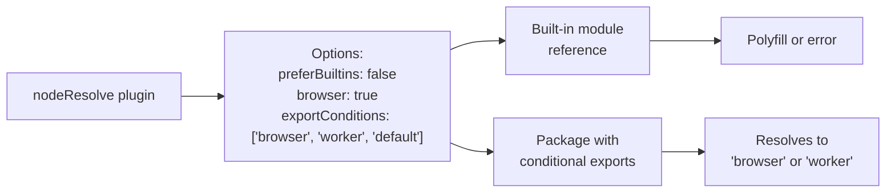

**Diagram 16: Browser Platform Resolution Strategy**

For browser platform (Cloudflare Workers), `getNodeResolveOptions` returns [packages/deployer/src/build/utils.ts:28-33]():

```typescript
{
  preferBuiltins: false,
  browser: true,
  exportConditions: ['browser', 'worker', 'default']
}
```

This configuration is critical for Cloudflare Workers because:

1. **Workers don't have Node.js built-in modules** - References to `https`, `fs`, etc. would fail at runtime
2. **Packages provide Workers-compatible implementations** - The official Cloudflare SDK and other packages export different code for browsers/workers
3. **Export condition order matters** - Tries `'browser'` first, then `'worker'`, then `'default'`

For the Cloudflare SDK example mentioned in tests [deployers/cloudflare/src/index.test.ts:23-39](), with browser platform:

- D1 REST API mode resolves to web runtime using global `fetch` (browser export condition)
- Without browser platform, it would try to use Node.js HTTP modules and fail

Sources: [packages/deployer/src/build/utils.ts:27-39](), [deployers/cloudflare/src/index.test.ts:23-43]()

### Neutral Platform for Bun

The `'neutral'` platform is used when running under Bun to preserve Bun-specific globals like `Bun.s3`.

```typescript
export function detectRuntime(): RuntimePlatform {
  if (process.versions?.bun) {
    return 'bun'
  }
  return 'node'
}
```

The DevBundler and BuildBundler check the runtime and set platform accordingly [packages/cli/src/commands/dev/DevBundler.ts:19-20]():

```typescript
this.platform = process.versions?.bun ? 'neutral' : 'node'
```

With `'neutral'` platform, esbuild doesn't perform any platform-specific transformations, preserving all runtime-specific features. This is necessary because Bun provides its own set of globals that differ from both Node.js and browsers.

Sources: [packages/deployer/src/build/utils.ts:42-53](), [packages/cli/src/commands/dev/DevBundler.ts:16-21](), [packages/cli/src/commands/build/BuildBundler.ts:12-17]()

## Integration with Bundlers

The `analyzeBundle` function integrates with the `Bundler` class hierarchy to provide a unified bundling interface across different deployment targets.

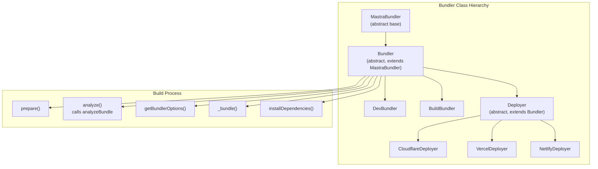

**Diagram 17: Bundler Class Hierarchy and Build Process Integration**

The `Bundler` class [packages/deployer/src/bundler/index.ts:28-463]() provides:

1. **analyze()** - Wrapper that calls `analyzeBundle` with appropriate parameters [packages/deployer/src/bundler/index.ts:120-131]()
2. **\_bundle()** - Main bundling method that orchestrates the full process [packages/deployer/src/bundler/index.ts:269-454]()
3. **getUserBundlerOptions()** - Reads bundler configuration from Mastra config [packages/deployer/src/bundler/index.ts:98-118]()
4. **getBundlerOptions()** - Constructs Rollup input options using analysis results [packages/deployer/src/bundler/index.ts:170-207]()
5. **getAllToolPaths()** - Discovers tool files using glob patterns [packages/deployer/src/bundler/index.ts:209-230]()

Sources: [packages/deployer/src/bundler/index.ts:28-463](), [packages/core/src/bundler/index.ts:1-51]()

### Bundle Workflow

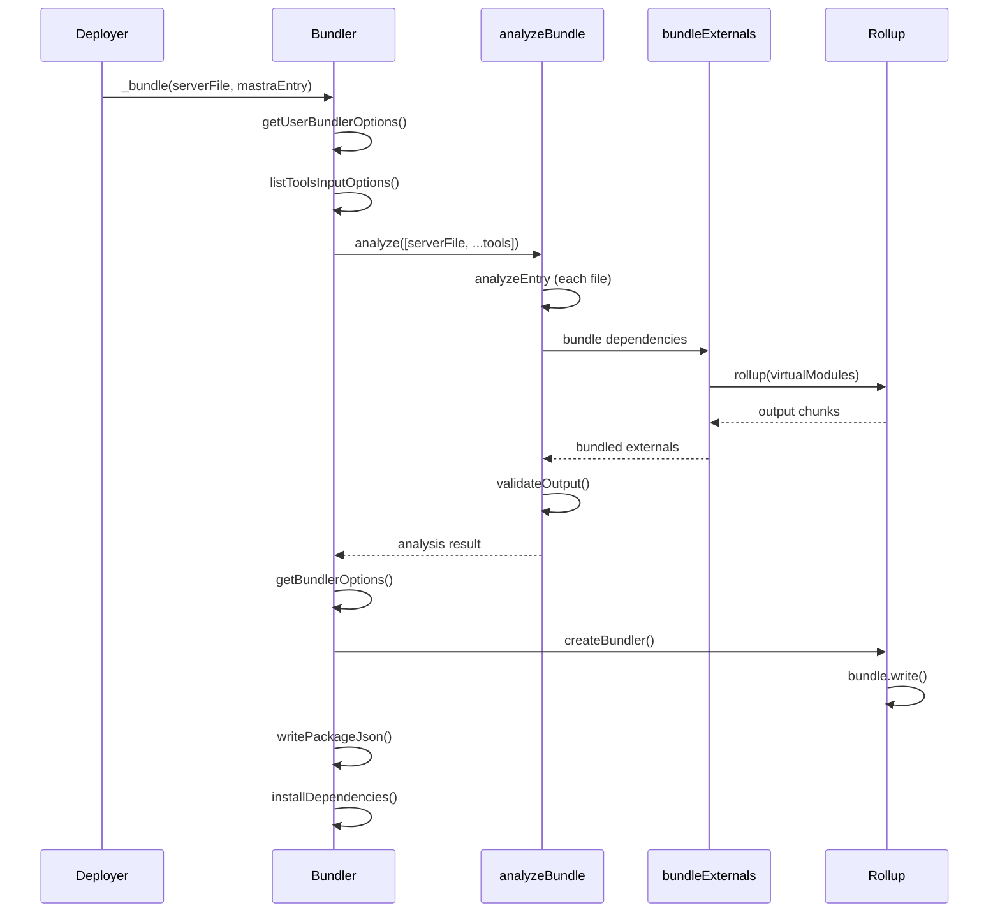

**Diagram 18: Bundle Workflow Sequence**

The `_bundle` method [packages/deployer/src/bundler/index.ts:269-454]() executes the full bundling workflow:

1. **Get bundler options** - Reads configuration with defaults [packages/deployer/src/bundler/index.ts:286]()
2. **List tools** - Discovers all tool files [packages/deployer/src/bundler/index.ts:295]()
3. **Analyze bundle** - Runs the three-phase pipeline [packages/deployer/src/bundler/index.ts:296-306]()
4. **Build dependencies map** - Processes external dependencies from analysis, handling version resolution and npm aliases [packages/deployer/src/bundler/index.ts:325-371]()
5. **Write package.json** - Creates package.json with resolved dependencies [packages/deployer/src/bundler/index.ts:374]()
6. **Get bundler options** - Constructs Rollup configuration from analysis [packages/deployer/src/bundler/index.ts:378-384]()
7. **Create and run bundler** - Bundles the server entry and tools [packages/deployer/src/bundler/index.ts:386-410]()
8. **Generate tools.mjs** - Creates aggregated tools export file [packages/deployer/src/bundler/index.ts:411-426]()
9. **Copy public files** - Copies static assets [packages/deployer/src/bundler/index.ts:429-431]()
10. **Copy .npmrc** - Copies npm configuration [packages/deployer/src/bundler/index.ts:433-436]()
11. **Install dependencies** - Runs npm/pnpm/yarn install [packages/deployer/src/bundler/index.ts:438-441]()

The npm alias handling [packages/deployer/src/bundler/index.ts:360-370]() detects when the import name differs from the actual package name (e.g., importing `"ai-v5"` which resolves to package `"ai"`), and writes the package.json dependency as `"ai-v5": "npm:ai@5.0.93"`.

Sources: [packages/deployer/src/bundler/index.ts:269-454]()

### DevBundler Watch Mode

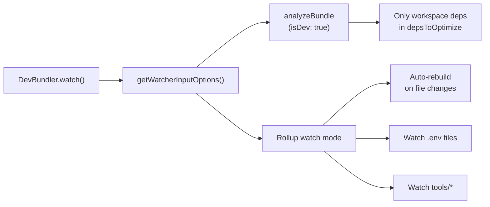

**Diagram 19: DevBundler Watch Mode Architecture**

The `DevBundler.watch()` method [packages/cli/src/commands/dev/DevBundler.ts:58-160]() uses a simplified build process optimized for development:

1. **Uses watcher-specific input options** - Calls `getWatcherInputOptions` which performs lightweight analysis [packages/deployer/src/build/watcher.ts:16-94]()
2. **Analyzes with isDev: true** - Only bundles workspace packages [packages/deployer/src/build/watcher.ts:33-44]()
3. **Filters for workspace deps** - Keeps only workspace packages in the dependency map [packages/deployer/src/build/watcher.ts:47-52]()
4. **Removes node-resolve plugin** - All node_modules are treated as external [packages/deployer/src/build/watcher.ts:71-73]()
5. **Configures watch plugins** - Adds env-watcher and tools-watcher plugins [packages/cli/src/commands/dev/DevBundler.ts:98-129]()
6. **Returns watcher** - Rollup watch instance that auto-rebuilds [packages/cli/src/commands/dev/DevBundler.ts:141-159]()

The watcher plugins monitor:

- **env-watcher**: All .env files discovered by `getEnvFiles()` [packages/cli/src/commands/dev/DevBundler.ts:101-107]()
- **tools-watcher**: Tool directories, regenerating tools.mjs on changes [packages/cli/src/commands/dev/DevBundler.ts:108-128]()

This approach enables fast rebuilds because:

- Only workspace packages are compiled (external npm packages are used directly)
- No dependency installation or validation occurs on each rebuild
- Rollup's watch mode incrementally processes only changed files

Sources: [packages/cli/src/commands/dev/DevBundler.ts:58-160](), [packages/deployer/src/build/watcher.ts:16-108]()
