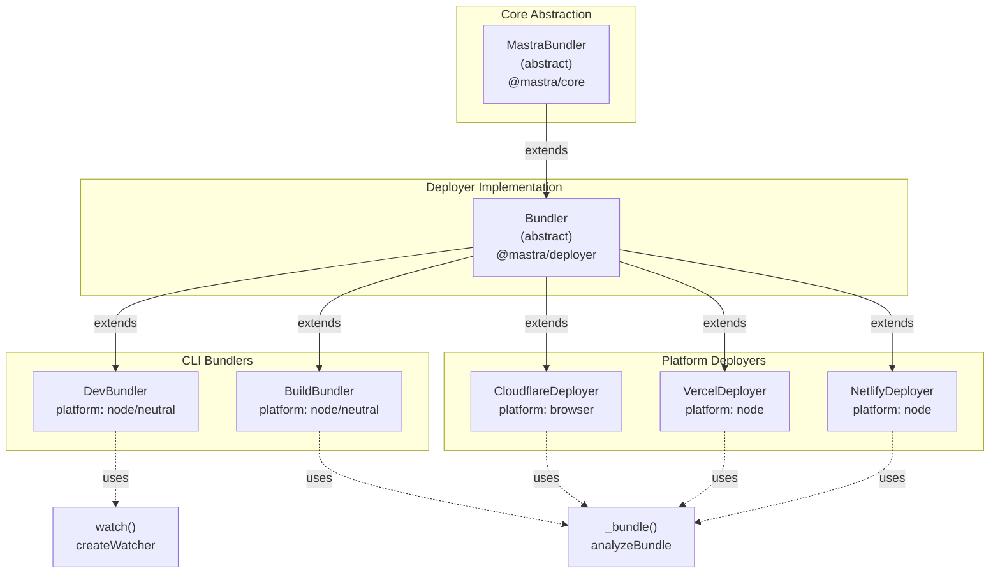
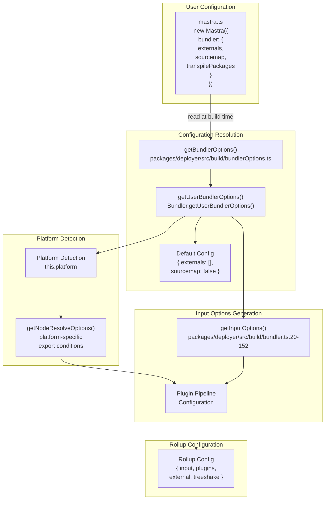
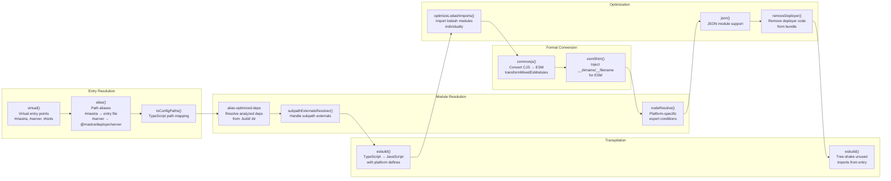

# Bundler Architecture and Plugin System

<details>
<summary>Relevant source files</summary>

The following files were used as context for generating this wiki page:

- [deployers/cloudflare/src/index.ts](deployers/cloudflare/src/index.ts)
- [deployers/netlify/src/index.ts](deployers/netlify/src/index.ts)
- [deployers/vercel/src/index.ts](deployers/vercel/src/index.ts)
- [docs/src/content/en/docs/deployment/studio.mdx](docs/src/content/en/docs/deployment/studio.mdx)
- [e2e-tests/monorepo/monorepo.test.ts](e2e-tests/monorepo/monorepo.test.ts)
- [e2e-tests/monorepo/template/apps/custom/src/mastra/index.ts](e2e-tests/monorepo/template/apps/custom/src/mastra/index.ts)
- [packages/cli/src/commands/build/BuildBundler.ts](packages/cli/src/commands/build/BuildBundler.ts)
- [packages/cli/src/commands/build/build.ts](packages/cli/src/commands/build/build.ts)
- [packages/cli/src/commands/dev/DevBundler.ts](packages/cli/src/commands/dev/DevBundler.ts)
- [packages/cli/src/commands/dev/dev.ts](packages/cli/src/commands/dev/dev.ts)
- [packages/cli/src/commands/studio/studio.test.ts](packages/cli/src/commands/studio/studio.test.ts)
- [packages/cli/src/commands/studio/studio.ts](packages/cli/src/commands/studio/studio.ts)
- [packages/core/src/bundler/index.ts](packages/core/src/bundler/index.ts)
- [packages/deployer/src/build/analyze.ts](packages/deployer/src/build/analyze.ts)
- [packages/deployer/src/build/analyze/**snapshots**/analyzeEntry.test.ts.snap](packages/deployer/src/build/analyze/__snapshots__/analyzeEntry.test.ts.snap)
- [packages/deployer/src/build/analyze/analyzeEntry.test.ts](packages/deployer/src/build/analyze/analyzeEntry.test.ts)
- [packages/deployer/src/build/analyze/analyzeEntry.ts](packages/deployer/src/build/analyze/analyzeEntry.ts)
- [packages/deployer/src/build/analyze/bundleExternals.test.ts](packages/deployer/src/build/analyze/bundleExternals.test.ts)
- [packages/deployer/src/build/analyze/bundleExternals.ts](packages/deployer/src/build/analyze/bundleExternals.ts)
- [packages/deployer/src/build/bundler.ts](packages/deployer/src/build/bundler.ts)
- [packages/deployer/src/build/utils.test.ts](packages/deployer/src/build/utils.test.ts)
- [packages/deployer/src/build/utils.ts](packages/deployer/src/build/utils.ts)
- [packages/deployer/src/build/watcher.test.ts](packages/deployer/src/build/watcher.test.ts)
- [packages/deployer/src/build/watcher.ts](packages/deployer/src/build/watcher.ts)
- [packages/deployer/src/bundler/index.ts](packages/deployer/src/bundler/index.ts)
- [packages/deployer/src/server/**tests**/option-studio-base.test.ts](packages/deployer/src/server/__tests__/option-studio-base.test.ts)
- [packages/deployer/src/server/index.ts](packages/deployer/src/server/index.ts)
- [packages/playground/e2e/tests/auth/infrastructure.spec.ts](packages/playground/e2e/tests/auth/infrastructure.spec.ts)
- [packages/playground/e2e/tests/auth/viewer-role.spec.ts](packages/playground/e2e/tests/auth/viewer-role.spec.ts)
- [packages/playground/index.html](packages/playground/index.html)
- [packages/playground/src/App.tsx](packages/playground/src/App.tsx)
- [packages/playground/src/components/ui/app-sidebar.tsx](packages/playground/src/components/ui/app-sidebar.tsx)

</details>

This document describes the bundler abstraction hierarchy, platform detection mechanisms, and the Rollup/ESBuild plugin configuration system used to bundle Mastra applications for different deployment targets. For information about the dependency analysis process that determines what gets bundled, see [Build System and Dependency Analysis](#8.3). For information about platform-specific deployers, see [Platform Deployers](#8.5).

## Class Hierarchy and Abstractions

The bundler system uses a three-tier abstraction hierarchy that separates the bundler interface definition from implementation details and deployment-specific customization.

### MastraBundler Abstract Base Class

The `MastraBundler` class in `@mastra/core` defines the interface that all bundlers must implement:

```typescript
// From packages/core/src/bundler/index.ts:20-50
export abstract class MastraBundler extends MastraBase implements IBundler {
  async loadEnvVars(): Promise<Map<string, string>>
  abstract getAllToolPaths(
    mastraDir: string,
    toolsPaths: (string | string[])[]
  ): (string | string[])[]
  abstract prepare(outputDirectory: string): Promise<void>
  abstract writePackageJson(
    outputDirectory: string,
    dependencies: Map<string, string>
  ): Promise<void>
  abstract getEnvFiles(): Promise<string[]>
  abstract bundle(
    entryFile: string,
    outputDirectory: string,
    options
  ): Promise<void>
  abstract lint(
    entryFile: string,
    outputDirectory: string,
    toolsPaths: (string | string[])[]
  ): Promise<void>
}
```

This interface provides extension points for environment variable loading, tool discovery, dependency resolution, and bundling operations.

Sources: [packages/core/src/bundler/index.ts:1-51]()

### Bundler Implementation

The `Bundler` class in `@mastra/deployer` extends `MastraBundler` with concrete implementations for the three-phase build process (analyze, bundle externals, validate). It introduces platform-specific configuration through the protected `platform` property:

```typescript
// From packages/deployer/src/bundler/index.ts:28-43
export abstract class Bundler extends MastraBundler {
  protected analyzeOutputDir = '.build'
  protected outputDir = 'output'
  protected platform: BundlerPlatform = 'node'

  async prepare(outputDirectory: string): Promise<void>
  async writePackageJson(
    outputDirectory: string,
    dependencies: Map<string, string>
  ): Promise<void>
  protected async getUserBundlerOptions(
    mastraEntryFile: string,
    outputDirectory: string
  ): Promise<Config['bundler']>
  protected async analyze(
    entry: string | string[],
    mastraFile: string,
    outputDirectory: string
  )
  protected async _bundle(
    serverFile: string,
    mastraEntryFile: string,
    options,
    toolsPaths,
    bundleLocation
  )
}
```

The `_bundle` method orchestrates the complete bundling process including dependency analysis, external bundling, package.json generation, dependency installation, and public file copying.

Sources: [packages/deployer/src/bundler/index.ts:28-464]()

### Specialized Bundler Implementations



**DevBundler** configures watch mode with Rollup's file watcher for hot reload during development. It detects the runtime (Node.js vs Bun) and sets `platform: 'neutral'` for Bun to preserve Bun-specific globals like `Bun.s3`:

```typescript
// From packages/cli/src/commands/dev/DevBundler.ts:13-21
export class DevBundler extends Bundler {
  constructor(customEnvFile?: string) {
    super('Dev')
    this.customEnvFile = customEnvFile
    // Use 'neutral' platform for Bun to preserve Bun-specific globals, 'node' otherwise
    this.platform = process.versions?.bun ? 'neutral' : 'node'
  }
}
```

**BuildBundler** configures production builds with `externals: true` by default (externalizing all non-workspace packages) and optionally includes Studio assets:

```typescript
// From packages/cli/src/commands/build/BuildBundler.ts:9-33
export class BuildBundler extends Bundler {
  private studio: boolean

  constructor({ studio }: { studio?: boolean } = {}) {
    super('Build')
    this.studio = studio ?? false
    this.platform = process.versions?.bun ? 'neutral' : 'node'
  }

  protected async getUserBundlerOptions(
    mastraEntryFile: string,
    outputDirectory: string
  ): Promise<Config['bundler']> {
    const bundlerOptions = await super.getUserBundlerOptions(
      mastraEntryFile,
      outputDirectory
    )
    if (!bundlerOptions?.[IS_DEFAULT]) {
      return bundlerOptions
    }
    return { ...bundlerOptions, externals: true }
  }
}
```

**CloudflareDeployer** uses `platform: 'browser'` for Workers-compatible module resolution, ensuring packages with conditional exports resolve to browser/worker implementations instead of Node.js-specific code:

```typescript
// From deployers/cloudflare/src/index.ts:25-48
export class CloudflareDeployer extends Deployer {
  constructor(userConfig: Omit<Unstable_RawConfig, 'main' | '$schema'>) {
    super({ name: 'CLOUDFLARE' })
    // Use 'browser' platform for Workers-compatible module resolution
    this.platform = 'browser'
    this.userConfig = { ...userConfig }
  }
}
```

Sources: [packages/cli/src/commands/dev/DevBundler.ts:1-166](), [packages/cli/src/commands/build/BuildBundler.ts:1-102](), [deployers/cloudflare/src/index.ts:25-67](), [deployers/vercel/src/index.ts:10-21](), [deployers/netlify/src/index.ts:7-11]()

## Platform Configuration System

The bundler supports three platform modes that control module resolution behavior and external handling.

### BundlerPlatform Types

```typescript
// From packages/deployer/src/build/utils.ts:6-16
/**
 * The esbuild/bundler platform setting.
 * - 'node': Assumes Node.js environment, externalizes built-in modules
 * - 'browser': Assumes browser environment, polyfills Node APIs
 * - 'neutral': Runtime-agnostic, preserves all globals as-is (used for Bun)
 */
export type BundlerPlatform = 'node' | 'browser' | 'neutral'
```

| Platform  | Use Case                              | Module Resolution                                    | Built-in Handling      |
| --------- | ------------------------------------- | ---------------------------------------------------- | ---------------------- |
| `node`    | Node.js servers, standard deployments | `exportConditions: ['node']`                         | Externalized           |
| `browser` | Cloudflare Workers, edge environments | `exportConditions: ['browser', 'worker', 'default']` | Polyfilled/unavailable |
| `neutral` | Bun runtime                           | Standard resolution                                  | Preserved as-is        |

The platform determines the configuration passed to Rollup's `nodeResolve` plugin:

```typescript
// From packages/deployer/src/build/utils.ts:27-39
export function getNodeResolveOptions(
  platform: BundlerPlatform
): RollupNodeResolveOptions {
  if (platform === 'browser') {
    return {
      preferBuiltins: false,
      browser: true,
      exportConditions: ['browser', 'worker', 'default'],
    }
  }
  return {
    preferBuiltins: true,
    exportConditions: ['node'],
  }
}
```

**Browser platform example**: Cloudflare Workers don't have Node.js built-in modules like `https`. When platform is `'browser'`, packages like the Cloudflare SDK resolve to web runtime implementations using global `fetch` instead of Node.js-specific code that depends on unavailable modules.

Sources: [packages/deployer/src/build/utils.ts:6-39]()

### Runtime Detection

The runtime detection function identifies whether code is executing under Bun or Node.js:

```typescript
// From packages/deployer/src/build/utils.ts:48-53
export function detectRuntime(): RuntimePlatform {
  if (process.versions?.bun) {
    return 'bun'
  }
  return 'node'
}
```

DevBundler and BuildBundler check `process.versions?.bun` in their constructors to set `platform: 'neutral'` for Bun, preserving Bun-specific globals that would otherwise be transformed or removed.

Sources: [packages/deployer/src/build/utils.ts:48-53](), [packages/cli/src/commands/dev/DevBundler.ts:13-21](), [packages/cli/src/commands/build/BuildBundler.ts:9-17]()

## Bundler Configuration Flow



The configuration flow starts with user-provided bundler options in the Mastra config, which are read at build time by `getBundlerOptions()`. The `Bundler` class provides a default configuration with `externals: []` and `sourcemap: false` if no user config is found. Platform detection influences the nodeResolve plugin configuration, and all settings are combined in `getInputOptions()` to generate the final Rollup configuration.

Sources: [packages/deployer/src/bundler/index.ts:98-118](), [packages/deployer/src/build/bundlerOptions.ts](), [packages/deployer/src/build/bundler.ts:20-152]()

## Tool Path Discovery and Bundling

The bundler discovers tools from multiple sources and bundles them as separate entry points.

### Tool Path Resolution

The `getAllToolPaths()` method normalizes paths and applies glob patterns to discover tool files:

```typescript
// From packages/deployer/src/bundler/index.ts:209-230
getAllToolPaths(mastraDir: string, toolsPaths: (string | string[])[] = []): (string | string[])[] {
  const normalizedMastraDir = slash(mastraDir)

  // Prepare default tools paths with glob patterns
  const defaultToolsPath = posix.join(normalizedMastraDir, 'tools/**/*.{js,ts}')
  const defaultToolsIgnorePaths = [
    `!${posix.join(normalizedMastraDir, 'tools/**/*.{test,spec}.{js,ts}')}`,
    `!${posix.join(normalizedMastraDir, 'tools/**/__tests__/**')}`,
  ]

  const defaultPaths = [defaultToolsPath, ...defaultToolsIgnorePaths]

  if (toolsPaths.length === 0) {
    return [defaultPaths]
  }

  return [...toolsPaths, defaultPaths]
}
```

The method:

1. Normalizes Windows paths to forward slashes using `slash()`
2. Creates default glob patterns for `tools/**/*.{js,ts}`
3. Excludes test files and `__tests__` directories
4. Merges user-provided tool paths with defaults

Sources: [packages/deployer/src/bundler/index.ts:209-230]()

### Tool Input Options Generation

The `listToolsInputOptions()` method expands glob patterns and creates Rollup input entries:

```typescript
// From packages/deployer/src/bundler/index.ts:232-267
async listToolsInputOptions(toolsPaths: (string | string[])[]) {
  const inputs: Record<string, string> = {}

  for (const toolPath of toolsPaths) {
    const expandedPaths = await glob(toolPath, {
      absolute: true,
      expandDirectories: false,
    })

    for (const path of expandedPaths) {
      if (await fsExtra.pathExists(path)) {
        const fileService = new FileService()
        const entryFile = fileService.getFirstExistingFile([
          join(path, 'index.ts'),
          join(path, 'index.js'),
          path,
        ])

        if (!entryFile || (await stat(entryFile)).isDirectory()) {
          this.logger.warn(`No entry file found in ${path}, skipping...`)
          continue
        }

        const uniqueToolID = crypto.randomUUID()
        const normalizedEntryFile = entryFile.replaceAll('\\', '/')
        inputs[`tools/${uniqueToolID}`] = normalizedEntryFile
      }
    }
  }

  return inputs
}
```

Each tool is bundled as a separate chunk with a unique ID prefix (`tools/${uuid}`), allowing client-side dynamic imports and preventing name collisions.

Sources: [packages/deployer/src/bundler/index.ts:232-267]()

### Tool Bundle Generation

After bundling, a `tools.mjs` file is generated that exports all tool chunks:

```typescript
// From packages/deployer/src/bundler/index.ts:411-426
const toolImports: string[] = []
const toolsExports: string[] = []
Array.from(Object.keys(inputOptions.input || {}))
  .filter((key) => key.startsWith('tools/'))
  .forEach((key, index) => {
    const toolExport = `tool${index}`
    toolImports.push(`import * as ${toolExport} from './${key}.mjs';`)
    toolsExports.push(toolExport)
  })

await writeFile(
  join(bundleLocation, 'tools.mjs'),
  `${toolImports.join(
    '\
'
  )}

export const tools = [${toolsExports.join(', ')}]`
)
```

This generates a module that aggregates all tools into a single export for consumption by the server entry point.

Sources: [packages/deployer/src/bundler/index.ts:411-426]()

## Rollup and ESBuild Plugin Pipeline

The bundler configures a sophisticated plugin pipeline that handles TypeScript transpilation, module resolution, CommonJS transformation, and tree-shaking.

### Core Plugin Configuration



The plugin pipeline executes in a carefully ordered sequence to handle different module formats and resolution strategies.

Sources: [packages/deployer/src/build/bundler.ts:20-152]()

### Platform-Specific Plugin Configuration

The `getInputOptions()` function generates the complete plugin configuration:

```typescript
// From packages/deployer/src/build/bundler.ts:20-52
export async function getInputOptions(
  entryFile: string,
  analyzedBundleInfo: Awaited<ReturnType<typeof analyzeBundle>>,
  platform: BundlerPlatform,
  env: Record<string, string> = {
    'process.env.NODE_ENV': JSON.stringify('production'),
  },
  {
    sourcemap = false,
    isDev = false,
    projectRoot,
    workspaceRoot,
    enableEsmShim = true,
    externalsPreset = false,
  }
): Promise<InputOptions> {
  const nodeResolvePlugin = nodeResolve(getNodeResolveOptions(platform))
  const externalsCopy = new Set<string>(
    analyzedBundleInfo.externalDependencies.keys()
  )
  const externals = externalsPreset ? [] : Array.from(externalsCopy)

  return {
    logLevel: process.env.MASTRA_BUNDLER_DEBUG === 'true' ? 'debug' : 'silent',
    treeshake: 'smallest',
    preserveSymlinks: true,
    external: externals,
    plugins: [
      subpathExternalsResolver(externals),
      // ... alias-optimized-deps plugin for dependency resolution
      alias({
        entries: [
          /* #server, #mastra aliases */
        ],
      }),
      tsConfigPaths(),
      // ... tools-rewriter plugin
      esbuild({ platform, define: env }),
      optimizeLodashImports({ include: '**/*.{js,ts,mjs,cjs}' }),
      externalsPreset
        ? null
        : commonjs({
            extensions: ['.js', '.ts'],
            transformMixedEsModules: true,
            esmExternals(id) {
              return externals.includes(id)
            },
          }),
      enableEsmShim ? esmShim() : undefined,
      externalsPreset ? nodeModulesExtensionResolver() : nodeResolvePlugin,
      json(),
      removeDeployer(entryFile, { sourcemap }),
      esbuild({ include: entryFile, platform }),
    ].filter(Boolean),
  }
}
```

Key configuration decisions:

- **externalsPreset mode**: When `externals: true`, CommonJS transformation and nodeResolve are skipped, using `nodeModulesExtensionResolver` instead for faster workspace package handling
- **Platform-specific esbuild**: The `platform` parameter controls how built-ins and globals are handled
- **ESM shim**: Injected conditionally to provide `__dirname` and `__filename` in ESM contexts
- **Tree-shaking**: Uses Rollup's `'smallest'` preset for aggressive dead code elimination

Sources: [packages/deployer/src/build/bundler.ts:20-152]()

### Development vs Production Plugin Configuration

Development bundling (via DevBundler) uses a different plugin configuration through `getWatcherInputOptions()`:

```typescript
// From packages/deployer/src/build/watcher.ts:16-94
export async function getInputOptions(
  entryFile: string,
  platform: BundlerPlatform,
  env?: Record<string, string>,
  { sourcemap = false, bundlerOptions = { enableSourcemap: false, enableEsmShim: true, externals: true } }
) {
  // Analyze with isDev: true
  const analyzeEntryResult = await analyzeBundle([entryFile], entryFile, {
    outputDir: posix.join(process.cwd(), '.mastra', '.build'),
    projectRoot: workspaceRoot || process.cwd(),
    platform,
    isDev: true,
    bundlerOptions
  }, noopLogger)

  // Extract only workspace dependencies
  const deps = new Map()
  for (const [dep, metadata] of analyzeEntryResult.dependencies.entries()) {
    const pkgName = getPackageName(dep)
    if (pkgName && workspaceMap.has(pkgName)) {
      deps.set(dep, metadata)
    }
  }

  const inputOptions = await getBundlerInputOptions(entryFile, { dependencies: deps, ... }, platform, env, {
    sourcemap, isDev: true, workspaceRoot, projectRoot, externalsPreset: bundlerOptions?.externals === true
  })

  // Filter out node-resolve plugin, replace with custom tsconfig-paths
  const plugins = []
  inputOptions.plugins.forEach(plugin => {
    if (plugin.name === 'node-resolve') return
    if (plugin.name === 'tsconfig-paths') {
      plugins.push(tsConfigPaths({ localResolve: true }))
      return
    }
    plugins.push(plugin)
  })

  inputOptions.plugins = plugins
  inputOptions.plugins.push(aliasHono())
  inputOptions.plugins.push(nodeModulesExtensionResolver())

  return inputOptions
}
```

Development mode differences:

- **isDev: true**: Keeps workspace packages external instead of bundling them
- **No node-resolve**: Replaced with `nodeModulesExtensionResolver` for direct external references
- **Local TypeScript resolution**: `tsConfigPaths({ localResolve: true })` resolves paths locally without compilation
- **All node_modules external**: Development bundles only workspace code for faster rebuilds

Sources: [packages/deployer/src/build/watcher.ts:16-94]()

## Custom Plugin Implementations

Mastra includes several custom Rollup plugins for specialized bundling requirements.

### Virtual Module Plugins

**virtual plugin** (from `@rollup/plugin-virtual`): Creates virtual entry points that don't exist on disk:

```typescript
// From packages/deployer/src/bundler/index.ts:194-201
if (isVirtual) {
  inputOptions.input = { index: '#entry', ...toolsInputOptions }
  if (Array.isArray(inputOptions.plugins)) {
    inputOptions.plugins.unshift(virtual({ '#entry': serverFile }))
  } else {
    inputOptions.plugins = [virtual({ '#entry': serverFile })]
  }
}
```

This allows deployers to generate platform-specific entry points as strings without writing temporary files.

**alias-optimized-deps plugin**: Resolves analyzed dependencies from the `.build/` directory:

```typescript
// From packages/deployer/src/build/bundler.ts:54-78
{
  name: 'alias-optimized-deps',
  resolveId(id: string) {
    if (!analyzedBundleInfo.dependencies.has(id)) {
      return null
    }

    const filename = analyzedBundleInfo.dependencies.get(id)!
    const absolutePath = join(workspaceRoot || projectRoot, filename)

    if (isDev) {
      return {
        id: process.platform === 'win32' ? pathToFileURL(absolutePath).href : absolutePath,
        external: true
      }
    }

    return { id: absolutePath, external: false }
  }
}
```

In development mode, it externalizes workspace dependencies. In production, it resolves to the bundled artifacts in `.mastra/.build/`.

Sources: [packages/deployer/src/bundler/index.ts:194-201](), [packages/deployer/src/build/bundler.ts:54-78]()

### Platform-Specific Plugins

**CloudflareDeployer plugins**: Wraps the Mastra instance and checks for incompatible storage:

```typescript
// From deployers/cloudflare/src/index.ts:216-231
const hasPostgresStore =
  (await this.deps.checkDependencies(['@mastra/pg'])) === `ok`

if (Array.isArray(inputOptions.plugins)) {
  inputOptions.plugins = [
    virtual({
      '#polyfills': `
process.versions = process.versions || {};
process.versions.node = '${process.versions.node}';
      `,
    }),
    ...inputOptions.plugins,
    mastraInstanceWrapper(mastraEntryFile),
  ]

  if (hasPostgresStore) {
    inputOptions.plugins.push(postgresStoreInstanceChecker())
  }
}
```

The `mastraInstanceWrapper` plugin transforms the Mastra instance export into a function export for lazy initialization in Workers. The `postgresStoreInstanceChecker` plugin warns if PostgreSQL is used (incompatible with Workers).

**Studio configuration plugins**: DevBundler and BuildBundler copy Studio assets and inject configuration:

```typescript
// From packages/cli/src/commands/dev/DevBundler.ts:46-56
async prepare(outputDirectory: string): Promise<void> {
  await super.prepare(outputDirectory)

  const studioServePath = join(outputDirectory, this.outputDir, 'studio')
  await fsExtra.copy(join(dirname(__dirname), join('dist', 'studio')), studioServePath, {
    overwrite: true
  })
}
```

Sources: [deployers/cloudflare/src/index.ts:216-231](), [packages/cli/src/commands/dev/DevBundler.ts:46-56]()

### TypeScript and Path Resolution Plugins

**esbuild plugin**: Handles TypeScript transpilation with platform-specific settings:

```typescript
// From packages/deployer/src/build/bundler.ts:111-114
esbuild({
  platform,
  define: env,
})
```

The plugin configuration passes the `platform` parameter directly to esbuild, controlling how Node.js built-ins and globals are handled.

**tsConfigPaths plugin**: Resolves TypeScript path mappings from `tsconfig.json`:

```typescript
// From packages/deployer/src/build/bundler.ts:99
tsConfigPaths()
```

This plugin reads `compilerOptions.paths` from the project's TypeScript configuration and resolves import paths accordingly. In development mode, it uses `localResolve: true` to resolve paths without compilation.

**removeDeployer plugin**: Strips deployer code from the final bundle:

```typescript
// From packages/deployer/src/build/bundler.ts:144
removeDeployer(entryFile, { sourcemap })
```

This plugin analyzes the AST of the entry file and removes any code related to deployer configuration, since it's only needed at build time.

Sources: [packages/deployer/src/build/bundler.ts:99-150]()

## Output Configuration and Chunking

Rollup output configuration controls how bundles are written to disk.

### Output Options Structure

The `createBundler()` function configures output options:

```typescript
// From packages/deployer/src/build/bundler.ts:154-173
export async function createBundler(
  inputOptions: InputOptions,
  outputOptions: Partial<OutputOptions> & { dir: string }
) {
  const bundler = await rollup(inputOptions)

  return {
    write: () => {
      return bundler.write({
        ...outputOptions,
        format: 'esm',
        entryFileNames: '[name].mjs',
        chunkFileNames: '[name].mjs',
      })
    },
    close: () => bundler.close(),
  }
}
```

Output configuration enforces:

- **ESM format**: All output uses ES modules
- **`.mjs` extension**: Explicit ESM file extension
- **Manual chunks**: Mastra entry is isolated in its own chunk via `manualChunks: { mastra: ['#mastra'] }`

Sources: [packages/deployer/src/build/bundler.ts:154-173]()

### Manual Chunking Strategy

The bundler uses manual chunking to separate the Mastra configuration from application code:

```typescript
// From packages/deployer/src/bundler/index.ts:402-407
{
  dir: bundleLocation,
  manualChunks: {
    mastra: ['#mastra']
  },
  sourcemap: internalBundlerOptions.enableSourcemap
}
```

This creates a `mastra.mjs` chunk containing only the Mastra instance, allowing it to be dynamically imported separately from the server runtime.

Tools are chunked automatically by Rollup based on the `tools/${uuid}` entry point naming pattern.

Sources: [packages/deployer/src/bundler/index.ts:402-407]()

## Watcher Configuration for Development

The DevBundler uses Rollup's watch mode for hot reload during development.

### Watch Mode Setup

```typescript
// From packages/cli/src/commands/dev/DevBundler.ts:58-139
async watch(entryFile: string, outputDirectory: string, toolsPaths: (string | string[])[]) {
  const envFiles = await this.getEnvFiles()
  const bundlerOptions = await this.getUserBundlerOptions(entryFile, outputDirectory)
  const sourcemapEnabled = !!bundlerOptions?.sourcemap

  const inputOptions = await getWatcherInputOptions(entryFile, this.platform, {
    'process.env.NODE_ENV': JSON.stringify(process.env.NODE_ENV || 'development')
  }, { sourcemap: sourcemapEnabled })

  const toolsInputOptions = await this.listToolsInputOptions(toolsPaths)
  const outputDir = join(outputDirectory, this.outputDir)

  const watcher = await createWatcher({
    ...inputOptions,
    plugins: [
      ...(inputOptions.plugins as InputPluginOption[]),
      {
        name: 'env-watcher',
        buildStart() {
          for (const envFile of envFiles) {
            this.addWatchFile(envFile)
          }
        }
      },
      {
        name: 'tools-watcher',
        async buildEnd() {
          // Generate tools.mjs export file
        }
      }
    ],
    input: {
      index: join(__dirname, 'templates', 'dev.entry.js'),
      ...toolsInputOptions
    }
  }, {
    dir: outputDir,
    sourcemap: sourcemapEnabled
  })

  return new Promise((resolve, reject) => {
    const cb = (event: RollupWatcherEvent) => {
      if (event.code === 'BUNDLE_END') {
        devLogger.success('Initial bundle complete')
        watcher.off('event', cb)
        resolve(watcher)
      }
      if (event.code === 'ERROR') {
        devLogger.error('Bundling failed - check console for details')
        watcher.off('event', cb)
        reject(event)
      }
    }
    watcher.on('event', cb)
  })
}
```

The watcher configuration:

- **env-watcher plugin**: Adds `.env` files to the watch list for automatic reload on environment changes
- **tools-watcher plugin**: Regenerates `tools.mjs` on every build to reflect tool changes
- **Promise wrapper**: Waits for initial bundle completion before returning the watcher
- **Event handling**: Listens for `BUNDLE_END` and `ERROR` events to track build status

Sources: [packages/cli/src/commands/dev/DevBundler.ts:58-160]()

### Hot Reload Integration

The dev server integrates with the watcher through event listeners:

```typescript
// From packages/cli/src/commands/dev/dev.ts:465-485
watcher.on('event', (event: { code: string }) => {
  if (event.code === 'BUNDLE_START') {
    devLogger.bundling()
  }
  if (event.code === 'BUNDLE_END') {
    devLogger.bundleComplete()
    devLogger.info(
      '[Mastra Dev] - Bundling finished, checking if restart is allowed...'
    )
    checkAndRestart(
      dotMastraPath,
      {
        port: Number(portToUse),
        host: hostToUse,
        studioBasePath: studioBasePathToUse,
        publicDir: join(mastraDir, 'public'),
      },
      bundler,
      startOptions
    )
  }
})
```

On `BUNDLE_END`, the dev server checks if a restart is allowed (not blocked by agent builder actions) and restarts the server process with the new bundle.

Sources: [packages/cli/src/commands/dev/dev.ts:465-485](), [packages/cli/src/commands/dev/dev.ts:263-291]()
