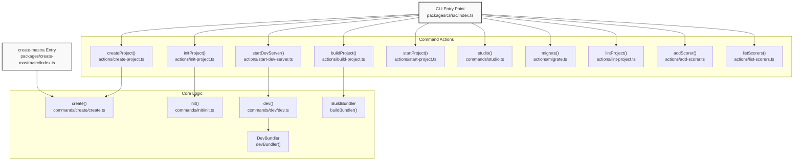
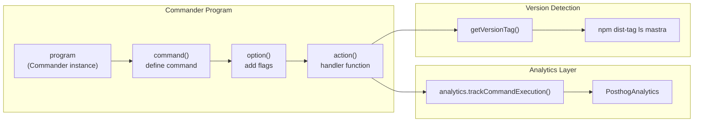
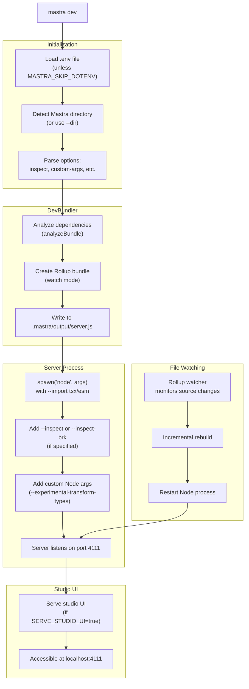

# CLI Command Reference

<details>
<summary>Relevant source files</summary>

The following files were used as context for generating this wiki page:

- [deployers/cloudflare/src/index.ts](deployers/cloudflare/src/index.ts)
- [deployers/netlify/src/index.ts](deployers/netlify/src/index.ts)
- [deployers/vercel/src/index.ts](deployers/vercel/src/index.ts)
- [docs/src/content/en/docs/deployment/studio.mdx](docs/src/content/en/docs/deployment/studio.mdx)
- [docs/src/content/en/reference/cli/create-mastra.mdx](docs/src/content/en/reference/cli/create-mastra.mdx)
- [e2e-tests/monorepo/monorepo.test.ts](e2e-tests/monorepo/monorepo.test.ts)
- [e2e-tests/monorepo/template/apps/custom/src/mastra/index.ts](e2e-tests/monorepo/template/apps/custom/src/mastra/index.ts)
- [packages/cli/src/commands/actions/create-project.ts](packages/cli/src/commands/actions/create-project.ts)
- [packages/cli/src/commands/actions/init-project.ts](packages/cli/src/commands/actions/init-project.ts)
- [packages/cli/src/commands/build/BuildBundler.ts](packages/cli/src/commands/build/BuildBundler.ts)
- [packages/cli/src/commands/build/build.ts](packages/cli/src/commands/build/build.ts)
- [packages/cli/src/commands/create/bun-detection.test.ts](packages/cli/src/commands/create/bun-detection.test.ts)
- [packages/cli/src/commands/create/create.test.ts](packages/cli/src/commands/create/create.test.ts)
- [packages/cli/src/commands/create/create.ts](packages/cli/src/commands/create/create.ts)
- [packages/cli/src/commands/create/utils.ts](packages/cli/src/commands/create/utils.ts)
- [packages/cli/src/commands/dev/DevBundler.test.ts](packages/cli/src/commands/dev/DevBundler.test.ts)
- [packages/cli/src/commands/dev/DevBundler.ts](packages/cli/src/commands/dev/DevBundler.ts)
- [packages/cli/src/commands/dev/dev.ts](packages/cli/src/commands/dev/dev.ts)
- [packages/cli/src/commands/init/init.test.ts](packages/cli/src/commands/init/init.test.ts)
- [packages/cli/src/commands/init/init.ts](packages/cli/src/commands/init/init.ts)
- [packages/cli/src/commands/init/utils.ts](packages/cli/src/commands/init/utils.ts)
- [packages/cli/src/commands/studio/studio.test.ts](packages/cli/src/commands/studio/studio.test.ts)
- [packages/cli/src/commands/studio/studio.ts](packages/cli/src/commands/studio/studio.ts)
- [packages/cli/src/commands/utils.test.ts](packages/cli/src/commands/utils.test.ts)
- [packages/cli/src/commands/utils.ts](packages/cli/src/commands/utils.ts)
- [packages/cli/src/index.ts](packages/cli/src/index.ts)
- [packages/cli/src/services/service.deps.ts](packages/cli/src/services/service.deps.ts)
- [packages/cli/src/utils/clone-template.test.ts](packages/cli/src/utils/clone-template.test.ts)
- [packages/cli/src/utils/clone-template.ts](packages/cli/src/utils/clone-template.ts)
- [packages/cli/src/utils/template-utils.test.ts](packages/cli/src/utils/template-utils.test.ts)
- [packages/cli/src/utils/template-utils.ts](packages/cli/src/utils/template-utils.ts)
- [packages/cli/tsconfig.json](packages/cli/tsconfig.json)
- [packages/core/src/bundler/index.ts](packages/core/src/bundler/index.ts)
- [packages/create-mastra/src/index.ts](packages/create-mastra/src/index.ts)
- [packages/create-mastra/src/utils.ts](packages/create-mastra/src/utils.ts)
- [packages/create-mastra/tsconfig.json](packages/create-mastra/tsconfig.json)
- [packages/deployer/src/build/analyze.ts](packages/deployer/src/build/analyze.ts)
- [packages/deployer/src/build/analyze/**snapshots**/analyzeEntry.test.ts.snap](packages/deployer/src/build/analyze/__snapshots__/analyzeEntry.test.ts.snap)
- [packages/deployer/src/build/analyze/analyzeEntry.test.ts](packages/deployer/src/build/analyze/analyzeEntry.test.ts)
- [packages/deployer/src/build/analyze/analyzeEntry.ts](packages/deployer/src/build/analyze/analyzeEntry.ts)
- [packages/deployer/src/build/analyze/bundleExternals.test.ts](packages/deployer/src/build/analyze/bundleExternals.test.ts)
- [packages/deployer/src/build/analyze/bundleExternals.ts](packages/deployer/src/build/analyze/bundleExternals.ts)
- [packages/deployer/src/build/bundler.ts](packages/deployer/src/build/bundler.ts)
- [packages/deployer/src/build/utils.test.ts](packages/deployer/src/build/utils.test.ts)
- [packages/deployer/src/build/utils.ts](packages/deployer/src/build/utils.ts)
- [packages/deployer/src/build/watcher.test.ts](packages/deployer/src/build/watcher.test.ts)
- [packages/deployer/src/build/watcher.ts](packages/deployer/src/build/watcher.ts)
- [packages/deployer/src/bundler/index.ts](packages/deployer/src/bundler/index.ts)
- [packages/deployer/src/server/**tests**/option-studio-base.test.ts](packages/deployer/src/server/__tests__/option-studio-base.test.ts)
- [packages/deployer/src/server/index.ts](packages/deployer/src/server/index.ts)
- [packages/playground/e2e/tests/auth/infrastructure.spec.ts](packages/playground/e2e/tests/auth/infrastructure.spec.ts)
- [packages/playground/e2e/tests/auth/viewer-role.spec.ts](packages/playground/e2e/tests/auth/viewer-role.spec.ts)
- [packages/playground/index.html](packages/playground/index.html)
- [packages/playground/src/App.tsx](packages/playground/src/App.tsx)
- [packages/playground/src/components/ui/app-sidebar.tsx](packages/playground/src/components/ui/app-sidebar.tsx)

</details>

This document provides a comprehensive reference for all Mastra CLI commands, their options, arguments, and implementation details. It covers the command-line interface for project creation, initialization, development, building, deployment, and maintenance.

For information about the build and deployment system architecture, see [8.3](#8.3), [8.4](#8.4), and [8.5](#8.5). For development server internals, see [8.2](#8.2). For project scaffolding and initialization flows, see [8.1](#8.1).

---

## CLI Architecture Overview

The Mastra CLI is built using the Commander.js library and provides a unified interface for all project lifecycle operations. The CLI is distributed as two packages: `mastra` (main CLI) and `create-mastra` (standalone project creator).

### Command to Implementation Mapping



**Sources:** [packages/cli/src/index.ts:1-191](), [packages/create-mastra/src/index.ts:1-91](), [packages/cli/src/commands/actions/create-project.ts:1-58]()

### Command Parser Structure

The CLI uses Commander's `.command()` method to define commands with `.option()` for flags and `.action()` for handlers. Each command is wrapped with analytics tracking via `analytics.trackCommandExecution()`.



**Sources:** [packages/cli/src/index.ts:33-187](), [packages/cli/src/analytics/index.ts](), [packages/cli/src/commands/utils.ts:84-101]()

---

## Global Options and Behavior

### Version Detection

The CLI automatically detects its version tag (`beta`, `latest`, or custom tags) to ensure dependency installation uses matching versions. This is implemented via `getVersionTag()`.

**Implementation:** [packages/cli/src/commands/utils.ts:84-101]()

The function queries `npm dist-tag ls mastra` and matches the current CLI version against published dist-tags.

### Analytics

All commands send telemetry via PosthogAnalytics with:

- Command name and arguments
- Execution time and success/failure status
- Origin tracking (`MASTRA_ANALYTICS_ORIGIN` environment variable)

**Configuration:** [packages/cli/src/index.ts:25-31]()

### Package Manager Detection

The CLI detects the active package manager from:

1. `npm_config_user_agent` environment variable
2. `npm_execpath` environment variable
3. Lock file presence (`.pnpm-lock.yaml`, `package-lock.json`, etc.)
4. Falls back to `npm`

**Implementation:** [packages/cli/src/commands/utils.ts:9-42]()

---

## Command Reference

### `mastra create`

Creates a new Mastra project with optional scaffolding, template cloning, and dependency installation.

#### Syntax

```bash
mastra create [project-name] [options]
```

#### Options

| Option                          | Type           | Description                                                                                | Default |
| ------------------------------- | -------------- | ------------------------------------------------------------------------------------------ | ------- |
| `-p, --project-name <string>`   | string         | Project directory name                                                                     | -       |
| `--default`                     | boolean        | Quick start with defaults (src, OpenAI, examples)                                          | `false` |
| `-c, --components <components>` | string         | Comma-separated components: `agents`, `workflows`, `tools`, `scorers`                      | -       |
| `-l, --llm <model-provider>`    | string         | Default model provider: `openai`, `anthropic`, `groq`, `google`, `cerebras`, `mistral`     | -       |
| `-k, --llm-api-key <api-key>`   | string         | API key for the model provider                                                             | -       |
| `-e, --example`                 | boolean        | Include example code                                                                       | -       |
| `-n, --no-example`              | boolean        | Do not include example code                                                                | -       |
| `-t, --timeout [timeout]`       | number         | Package installation timeout (ms)                                                          | `60000` |
| `-d, --dir <directory>`         | string         | Target directory for Mastra source code                                                    | `src/`  |
| `-m, --mcp <editor>`            | string         | MCP Server for code editor: `cursor`, `cursor-global`, `windsurf`, `vscode`, `antigravity` | -       |
| `--skills <agents>`             | string         | Comma-separated agent names for skill installation                                         | -       |
| `--template [template-name]`    | string/boolean | Create from template (name, GitHub URL, or interactive)                                    | -       |

#### Behavior

The `create` command performs the following operations:

1. **Template Mode** (if `--template` specified):
   - Loads templates from `https://mastra.ai/api/templates.json`
   - Validates GitHub repositories for Mastra structure
   - Clones using `degit` (fallback to `git clone`)
   - Removes `.git` directory
   - Updates `package.json` name
   - Copies `.env.example` to `.env` and updates `MODEL` field

2. **Scaffold Mode** (default):
   - Creates project directory
   - Initializes `package.json` with `type: "module"` and `engines.node: ">=22.13.0"`
   - Installs core dependencies: `@mastra/core`, `@mastra/libsql`, `@mastra/memory`, `zod`, `typescript`
   - Creates `.gitignore` with standard entries
   - Runs `mastra init` internally

#### Examples

```bash
# Interactive mode
mastra create

# Quick start with defaults
mastra create my-app --default

# Custom configuration
mastra create my-app -c agents,tools -l anthropic -k sk-ant-xxx -e

# From template (interactive selection)
mastra create --template

# From template by name
mastra create my-app --template browsing-agent

# From GitHub URL
mastra create my-app --template https://github.com/mastra-ai/template-deep-research

# With skills installation
mastra create my-app --skills cursor,claude-code
```

**Sources:** [packages/cli/src/index.ts:50-79](), [packages/cli/src/commands/create/create.ts:21-404](), [packages/cli/src/commands/create/utils.ts:156-343]()

---

### `npx create-mastra`

Standalone package for project creation, equivalent to `mastra create` but doesn't require pre-installing the CLI.

#### Syntax

```bash
npx create-mastra [project-name] [options]
```

#### Options

Identical to `mastra create` options (see above).

#### Implementation Details

The `create-mastra` package:

- Wraps the `create()` function from `mastra` CLI
- Detects its own version tag via `getCreateVersionTag()`
- Passes `createVersionTag` to ensure matching Mastra versions

**Sources:** [packages/create-mastra/src/index.ts:1-91](), [packages/create-mastra/src/utils.ts:15-30]()

---

### `mastra init`

Initializes Mastra in an existing project by creating the Mastra directory structure and configuration files.

#### Syntax

```bash
mastra init [options]
```

#### Options

| Option                          | Type    | Description                                                           | Default |
| ------------------------------- | ------- | --------------------------------------------------------------------- | ------- |
| `--default`                     | boolean | Quick start with defaults (src, OpenAI, examples)                     | `false` |
| `-d, --dir <directory>`         | string  | Directory for Mastra files                                            | `src/`  |
| `-c, --components <components>` | string  | Comma-separated components: `agents`, `workflows`, `tools`, `scorers` | -       |
| `-l, --llm <model-provider>`    | string  | Default model provider                                                | -       |
| `-k, --llm-api-key <api-key>`   | string  | API key for the model provider                                        | -       |
| `-e, --example`                 | boolean | Include example code                                                  | -       |
| `-n, --no-example`              | boolean | Do not include example code                                           | -       |
| `-m, --mcp <editor>`            | string  | MCP Server for code editor                                            | -       |

#### Behavior

The initialization process:

1. **Prerequisites Check**:
   - Verifies `package.json` exists via `checkForPkgJson()`
   - Detects version tag for matching dependencies
   - Checks if git is already initialized

2. **Core Dependencies**:
   - Installs `@mastra/core`, `mastra`, `zod` (if missing)
   - Conditionally installs: `@mastra/libsql`, `@mastra/memory`, `@mastra/loggers`, `@mastra/observability`, `@mastra/evals`

3. **Directory Structure**:
   - Creates `<dir>/mastra/` directory
   - Creates component subdirectories: `agents/`, `workflows/`, `tools/`, `scorers/`
   - Writes `index.ts` with Mastra configuration

4. **Sample Code** (if `-e` or `--example`):
   - **Agents**: Weather agent with instructions, model configuration, and tools
   - **Tools**: Weather API tool (`weatherTool`)
   - **Workflows**: Weather forecast + activity planning workflow
   - **Scorers**: Tool call appropriateness, completeness, and translation scorers

5. **Environment Configuration**:
   - Writes API key to `.env` or `.env.example` (if skipped)
   - Uses `shellQuote.quote()` for safe shell interpolation

6. **Skills Installation** (if `--skills`):
   - Runs `npx skills add mastra-ai/skills --agent <agent-names> -y`
   - Writes `AGENTS.md` and optionally `CLAUDE.md` (if `claude-code` in skills)

7. **MCP Installation** (if `--mcp`):
   - Installs Mastra docs MCP server
   - Updates editor-specific config files (cursor, windsurf, vscode, antigravity)

8. **Git Initialization** (if selected interactively and not already initialized):
   - Runs `git init`, `git add -A`, and creates initial commit

**Sources:** [packages/cli/src/index.ts:81-100](), [packages/cli/src/commands/init/init.ts:24-198](), [packages/cli/src/commands/init/utils.ts:62-533]()

---

### `mastra dev`

Starts the development server with hot reloading, Mastra Studio UI, and optional Node.js debugging.

#### Syntax

```bash
mastra dev [options]
```

#### Options

| Option                             | Type           | Description                          | Default           |
| ---------------------------------- | -------------- | ------------------------------------ | ----------------- |
| `-d, --dir <dir>`                  | string         | Path to your Mastra folder           | Auto-detected     |
| `-r, --root <root>`                | string         | Path to your root folder             | Current directory |
| `-t, --tools <toolsDirs>`          | string         | Comma-separated tool file paths      | -                 |
| `-e, --env <env>`                  | string         | Custom env file path                 | `.env`            |
| `-i, --inspect [host:port]`        | string/boolean | Enable Node.js inspector             | -                 |
| `-b, --inspect-brk [host:port]`    | string/boolean | Enable inspector and break at start  | -                 |
| `-c, --custom-args <args>`         | string         | Comma-separated Node.js arguments    | -                 |
| `-s, --https`                      | boolean        | Enable local HTTPS                   | `false`           |
| `--request-context-presets <file>` | string         | Path to request context presets JSON | -                 |
| `--debug`                          | boolean        | Enable debug logs                    | `false`           |

#### Behavior

The development server workflow:



#### Inspector Mode

When using `--inspect` or `--inspect-brk`, the CLI parses the argument:

- Format: `[host:]port` (e.g., `0.0.0.0:9229`, `9229`)
- Default host: `127.0.0.1`
- Passes to Node.js as `--inspect=host:port`

**Sources:** [packages/cli/src/index.ts:110-132](), [packages/cli/src/commands/dev/dev.ts:1-200]() (referenced but not shown in full)

---

### `mastra build`

Builds the Mastra project for production deployment with optimized bundling and optional Studio UI inclusion.

#### Syntax

```bash
mastra build [options]
```

#### Options

| Option                    | Type    | Description                     | Default           |
| ------------------------- | ------- | ------------------------------- | ----------------- |
| `-d, --dir <path>`        | string  | Path to your Mastra folder      | Auto-detected     |
| `-r, --root <path>`       | string  | Path to your root folder        | Current directory |
| `-t, --tools <toolsDirs>` | string  | Comma-separated tool file paths | -                 |
| `-s, --studio`            | boolean | Bundle Studio UI with the build | `false`           |
| `--debug`                 | boolean | Enable debug logs               | `false`           |

#### Behavior

The build process:

1. **Platform Detection**:
   - Checks for `wrangler.json`/`wrangler.jsonc` → CloudflareDeployer
   - Checks for `vercel.json`/`.vc-config.json` → VercelDeployer
   - Checks for `netlify.toml`/`config.json` → NetlifyDeployer
   - Fallback to BuildBundler (generic Node.js build)

2. **Dependency Analysis**:
   - Recursively scans imports starting from Mastra entry point
   - Identifies workspace packages (monorepo support)
   - Determines which dependencies to bundle vs. externalize
   - Creates virtual dependency modules

3. **Rollup Bundling**:
   - Tree-shaking and dead code elimination
   - Platform-specific polyfills and optimizations
   - Output validation (attempts to import bundled code)

4. **Output Artifacts**:
   - Bundled code: `.mastra/output/server.js` or `index.mjs`
   - `package.json` with external dependencies
   - Platform config: `wrangler.json`, `vercel.json`, or `netlify.toml`
   - Static assets (if `--studio` or platform requires)

**Platform-Specific Outputs:**

| Platform           | Entry Point | Output Location                 | Config File       |
| ------------------ | ----------- | ------------------------------- | ----------------- |
| Cloudflare Workers | `index.mjs` | `.mastra/output/`               | `wrangler.jsonc`  |
| Vercel Edge        | `index.mjs` | `.vercel/output/functions/api/` | `.vc-config.json` |
| Netlify Functions  | `index.mjs` | `.netlify/functions/api/`       | `config.json`     |
| Generic Node.js    | `server.js` | `.mastra/output/`               | -                 |

**Sources:** [packages/cli/src/index.ts:134-142](), [packages/cli/src/commands/actions/build-project.ts]() (referenced)

---

### `mastra start`

Starts the production-built Mastra application.

#### Syntax

```bash
mastra start [options]
```

#### Options

| Option                     | Type   | Description                       | Default          |
| -------------------------- | ------ | --------------------------------- | ---------------- |
| `-d, --dir <path>`         | string | Path to built output directory    | `.mastra/output` |
| `-e, --env <env>`          | string | Custom env file path              | `.env`           |
| `-c, --custom-args <args>` | string | Comma-separated Node.js arguments | -                |

#### Behavior

- Loads environment variables from specified env file
- Spawns Node.js process: `node <custom-args> <dir>/server.js`
- No hot reloading or rebuilding (production mode)

**Sources:** [packages/cli/src/index.ts:144-153](), [packages/cli/src/commands/actions/start-project.ts]()

---

### `mastra studio`

Starts the Mastra Studio UI independently (separate from development server).

#### Syntax

```bash
mastra studio [options]
```

#### Options

| Option                                   | Type   | Description                          | Default     |
| ---------------------------------------- | ------ | ------------------------------------ | ----------- |
| `-p, --port <port>`                      | number | Studio UI port                       | `3000`      |
| `-e, --env <env>`                        | string | Custom env file path                 | `.env`      |
| `-h, --server-host <serverHost>`         | string | Mastra API server host               | `localhost` |
| `-s, --server-port <serverPort>`         | number | Mastra API server port               | `4111`      |
| `-x, --server-protocol <serverProtocol>` | string | Mastra API protocol                  | `http`      |
| `--server-api-prefix <serverApiPrefix>`  | string | API route prefix                     | `/api`      |
| `--request-context-presets <file>`       | string | Path to request context presets JSON | -           |

#### Behavior

- Starts a standalone Studio UI server (typically for production environments)
- Connects to running Mastra API server via `<protocol>://<host>:<port><prefix>`
- Loads request context presets for multi-tenant testing

**Use Case:** Running Studio UI separate from the API server, useful for:

- Production monitoring
- Remote debugging
- Multi-environment testing

**Sources:** [packages/cli/src/index.ts:155-165](), [packages/cli/src/commands/studio.ts]() (referenced)

---

### `mastra migrate`

Runs database migrations to update storage schema for agents, workflows, memory, and other stored entities.

#### Syntax

```bash
mastra migrate [options]
```

#### Options

| Option              | Type    | Description                                  | Default           |
| ------------------- | ------- | -------------------------------------------- | ----------------- |
| `-d, --dir <path>`  | string  | Path to your Mastra folder                   | Auto-detected     |
| `-r, --root <path>` | string  | Path to your root folder                     | Current directory |
| `-e, --env <env>`   | string  | Custom env file path                         | `.env`            |
| `--debug`           | boolean | Enable debug logs                            | `false`           |
| `-y, --yes`         | boolean | Skip confirmation prompt (for CI/automation) | `false`           |

#### Behavior

1. Loads Mastra configuration from entry point
2. Retrieves storage instance (PostgreSQL, LibSQL, MongoDB, Upstash)
3. Calls storage provider's migration methods:
   - Creates tables if not exist
   - Adds columns for new fields
   - Creates indexes for performance
4. Prompts for confirmation (unless `-y` specified)

**Migration Scope:**

- Agent storage tables: `agents`, `agent_versions`
- Memory tables: `threads`, `messages`, `resources`, `observational_memory`
- Workflow tables: `workflow_runs`, `workflow_state`
- Dataset tables: `dataset_items` (with SCD Type 2 versioning)
- MCP tables: `mcp_clients`, `mcp_servers`, `mcp_tools`

**Sources:** [packages/cli/src/index.ts:167-175](), [packages/cli/src/commands/actions/migrate.ts]() (referenced)

---

### `mastra lint`

Lints your Mastra project for configuration errors, missing dependencies, and schema validation issues.

#### Syntax

```bash
mastra lint [options]
```

#### Options

| Option                    | Type   | Description                     | Default           |
| ------------------------- | ------ | ------------------------------- | ----------------- |
| `-d, --dir <path>`        | string | Path to your Mastra folder      | Auto-detected     |
| `-r, --root <path>`       | string | Path to your root folder        | Current directory |
| `-t, --tools <toolsDirs>` | string | Comma-separated tool file paths | -                 |

#### Behavior

Performs validation checks:

- Agent configuration (instructions, model, tools)
- Workflow step definitions and graph consistency
- Tool schemas (Zod validation)
- Memory configuration
- Storage provider configuration

**Sources:** [packages/cli/src/index.ts:102-108](), [packages/cli/src/commands/actions/lint-project.ts]() (referenced)

---

### `mastra scorers add`

Adds a new scorer template to your project for evaluating agent outputs.

#### Syntax

```bash
mastra scorers add [scorer-name] [options]
```

#### Options

| Option             | Type   | Description                   | Default       |
| ------------------ | ------ | ----------------------------- | ------------- |
| `-d, --dir <path>` | string | Path to your Mastra directory | Auto-detected |

#### Behavior

- Interactive selection of scorer template (if name not provided)
- Creates scorer file in `<mastra-dir>/scorers/`
- Supports prebuilt scorers: completeness, tool call accuracy, translation quality, etc.

**Sources:** [packages/cli/src/index.ts:179-183](), [packages/cli/src/commands/actions/add-scorer.ts]() (referenced)

---

### `mastra scorers list`

Lists available scorer templates that can be added to your project.

#### Syntax

```bash
mastra scorers list
```

#### Behavior

Displays available scorer templates with descriptions:

- Prebuilt scorers from `@mastra/evals`
- Custom scorer patterns
- LLM-judged scorer examples

**Sources:** [packages/cli/src/index.ts:185](), [packages/cli/src/commands/actions/list-scorers.ts]() (referenced)

---

## Validation and Parsing Utilities

### Component Validation

Components must be one of: `agents`, `workflows`, `tools`, `scorers`.

**Implementation:** [packages/cli/src/commands/init/utils.ts:40-42]()

```typescript
export function areValidComponents(values: string[]): values is Component[] {
  return values.every((value) => COMPONENTS.includes(value as Component))
}
```

**Usage:** [packages/cli/src/commands/utils.ts:59-67]()

### LLM Provider Validation

Supported providers: `openai`, `anthropic`, `groq`, `google`, `cerebras`, `mistral`.

**Implementation:** [packages/cli/src/commands/init/utils.ts:33-35]()

**Model Mapping:** [packages/cli/src/commands/init/utils.ts:44-60]()

| Provider    | Default Model                  |
| ----------- | ------------------------------ |
| `openai`    | `openai/gpt-4o`                |
| `anthropic` | `anthropic/claude-sonnet-4-5`  |
| `groq`      | `groq/llama-3.3-70b-versatile` |
| `google`    | `google/gemini-2.5-pro`        |
| `cerebras`  | `cerebras/llama-3.3-70b`       |
| `mistral`   | `mistral/mistral-medium-2508`  |

### MCP Editor Validation

Supported editors: `cursor`, `cursor-global`, `windsurf`, `vscode`, `antigravity`.

**Implementation:** [packages/cli/src/commands/utils.ts:44-49]()

**Config Paths:**

- `cursor-global`: `~/.cursor/mcp.json`
- `windsurf`: `~/.windsurf/mcp_settings.json`
- `antigravity`: `~/.antigravity/mcp.json`

**Sources:** [packages/cli/src/commands/init/mcp-docs-server-install.ts:15-19]() (referenced)

---

## Template System

### Template Structure

Templates are defined in `https://mastra.ai/api/templates.json` with the following schema:

```typescript
interface Template {
  githubUrl: string // "https://github.com/mastra-ai/template-browsing-agent"
  title: string // "Browsing Agent"
  slug: string // "template-browsing-agent"
  agents: string[] // ["web-agent"]
  mcp: string[] // []
  tools: string[] // ["search-tool", "scraper-tool"]
  networks: string[] // []
  workflows: string[] // ["research-workflow"]
}
```

**Sources:** [packages/cli/src/utils/template-utils.ts:3-12]()

### Template Loading and Selection

The CLI loads templates from the API and presents an interactive selection with component counts:

```
Select a template:
  Browsing Agent (1 agent, 2 tools, 1 workflow)
  Data Analyst Agent (1 agent, 1 tool, 1 workflow, 1 MCP server)
  Deep Research (2 agents, 3 tools, 2 workflows)
```

**Implementation:** [packages/cli/src/utils/template-utils.ts:34-70]()

### GitHub URL Validation

When using a GitHub URL as a template, the CLI validates:

1. `package.json` exists and contains `@mastra/core` dependency
2. `src/mastra/index.ts` exists and exports a Mastra instance

**Validation Logic:** [packages/cli/src/commands/create/create.ts:131-211]()

### Template Cloning

Cloning uses two strategies:

1. **Primary**: `npx degit` (fast, no git history)
2. **Fallback**: `git clone` + remove `.git` directory

**Branch Support:**

- Degit: `npx degit owner/repo#branch`
- Git: `git clone --branch <branch> <url>`

**Post-Clone Steps:**

1. Update `package.json` name field
2. Copy `.env.example` to `.env`
3. Update `MODEL` in `.env` based on selected LLM provider

**Sources:** [packages/cli/src/utils/clone-template.ts:25-162]()

---

## Skills Installation

Skills are pre-built agent capabilities installed via the `skills` CLI tool.

### Installation Command

```bash
npx skills add mastra-ai/skills --agent cursor claude-code -y
```

**Integration:** [packages/cli/src/commands/init/skills-install.ts:3-27]()

### Supported Agents

The CLI supports skills installation for 40+ coding agents including:

- Popular: `claude-code`, `cursor`, `windsurf`, `github-copilot`, `cline`, `continue`
- Full list includes: `codex`, `opencode`, `gemini-cli`, `replit`, `roo`, `adal`, `amp`, `antigravity`, and more

**Agent List:** [packages/cli/src/commands/init/utils.ts:740-786]()

### Generated Documentation

After skills installation, the CLI generates:

- `AGENTS.md`: General guidance for AI coding agents
- `CLAUDE.md`: Specific instructions for Claude Code (if selected)

**Content Generation:** [packages/cli/src/commands/init/utils.ts:956-1037]() (referenced)

---

## Environment and Configuration Management

### Environment Variable Writing

API keys are written to `.env` or `.env.example` using safe shell quoting:

```typescript
const escapedKey = shellQuote.quote([key])
const escapedApiKey = shellQuote.quote([apiKey ? apiKey : 'your-api-key'])
await exec(`echo ${escapedKey}=${escapedApiKey} >> ${envFileName}`)
```

**Implementation:** [packages/cli/src/commands/init/utils.ts:612-622]()

### Environment Variable Mapping

| Provider  | Environment Variable           |
| --------- | ------------------------------ |
| OpenAI    | `OPENAI_API_KEY`               |
| Anthropic | `ANTHROPIC_API_KEY`            |
| Groq      | `GROQ_API_KEY`                 |
| Google    | `GOOGLE_GENERATIVE_AI_API_KEY` |
| Cerebras  | `CEREBRAS_API_KEY`             |
| Mistral   | `MISTRAL_API_KEY`              |

**Sources:** [packages/cli/src/commands/init/utils.ts:589-610]()

### Dotenv Loading

By default, the CLI loads `.env` files using `dotenv`. This can be skipped by setting:

```bash
export MASTRA_SKIP_DOTENV=true
# or
export MASTRA_SKIP_DOTENV=1
```

**Implementation:** [packages/cli/src/commands/utils.ts:76-78]()

---

## Error Handling and Cleanup

### Project Creation Cleanup

If project creation fails, the CLI automatically removes the partially created directory:

```typescript
if (projectPath && fsSync.existsSync(projectPath)) {
  try {
    process.chdir(originalCwd)
    await fs.rm(projectPath, { recursive: true, force: true })
  } catch (cleanupError) {
    console.error(`Warning: Failed to clean up project directory`)
  }
}
```

**Implementation:** [packages/cli/src/commands/create/utils.ts:327-339]()

### Dependency Installation Timeout

The `create` command supports configurable timeouts for package installation:

```bash
mastra create my-app --timeout 120000  # 2 minutes
```

**Default:** 60000ms (1 minute)

**Implementation:** [packages/cli/src/commands/create/utils.ts:19-46]()

**Fallback Strategy:**
If installation with specific version tag fails, the CLI falls back to `@latest`:

```typescript
try {
  await installMastraDependency(pm, 'mastra', versionTag, true, timeout)
} catch (error) {
  // Fallback to @latest
  await installMastraDependency(pm, 'mastra', '@latest', true, timeout)
}
```

**Sources:** [packages/cli/src/commands/create/utils.ts:138-154]()

---

## Summary of CLI Commands

| Command                               | Primary Purpose                | Interactive Mode   | Requires Existing Project |
| ------------------------------------- | ------------------------------ | ------------------ | ------------------------- |
| `mastra create` / `npx create-mastra` | Create new project             | Yes                | No                        |
| `mastra init`                         | Initialize in existing project | Yes                | Yes                       |
| `mastra dev`                          | Start development server       | No                 | Yes                       |
| `mastra build`                        | Build for production           | No                 | Yes                       |
| `mastra start`                        | Run production build           | No                 | Yes (built)               |
| `mastra studio`                       | Start Studio UI                | No                 | Yes                       |
| `mastra migrate`                      | Update database schema         | Yes (confirmation) | Yes                       |
| `mastra lint`                         | Validate configuration         | No                 | Yes                       |
| `mastra scorers add`                  | Add scorer template            | Yes                | Yes                       |
| `mastra scorers list`                 | List available scorers         | No                 | No                        |

**Sources:** [packages/cli/src/index.ts:37-187]()
