# Development Server and Hot Reload

<details>
<summary>Relevant source files</summary>

The following files were used as context for generating this wiki page:

- [deployers/cloudflare/src/index.ts](deployers/cloudflare/src/index.ts)
- [deployers/netlify/src/index.ts](deployers/netlify/src/index.ts)
- [deployers/vercel/src/index.ts](deployers/vercel/src/index.ts)
- [docs/src/content/en/docs/deployment/studio.mdx](docs/src/content/en/docs/deployment/studio.mdx)
- [docs/src/content/en/reference/cli/create-mastra.mdx](docs/src/content/en/reference/cli/create-mastra.mdx)
- [e2e-tests/monorepo/monorepo.test.ts](e2e-tests/monorepo/monorepo.test.ts)
- [e2e-tests/monorepo/template/apps/custom/src/mastra/index.ts](e2e-tests/monorepo/template/apps/custom/src/mastra/index.ts)
- [packages/cli/src/commands/actions/create-project.ts](packages/cli/src/commands/actions/create-project.ts)
- [packages/cli/src/commands/actions/init-project.ts](packages/cli/src/commands/actions/init-project.ts)
- [packages/cli/src/commands/build/BuildBundler.ts](packages/cli/src/commands/build/BuildBundler.ts)
- [packages/cli/src/commands/build/build.ts](packages/cli/src/commands/build/build.ts)
- [packages/cli/src/commands/create/bun-detection.test.ts](packages/cli/src/commands/create/bun-detection.test.ts)
- [packages/cli/src/commands/create/create.test.ts](packages/cli/src/commands/create/create.test.ts)
- [packages/cli/src/commands/create/create.ts](packages/cli/src/commands/create/create.ts)
- [packages/cli/src/commands/create/utils.ts](packages/cli/src/commands/create/utils.ts)
- [packages/cli/src/commands/dev/DevBundler.test.ts](packages/cli/src/commands/dev/DevBundler.test.ts)
- [packages/cli/src/commands/dev/DevBundler.ts](packages/cli/src/commands/dev/DevBundler.ts)
- [packages/cli/src/commands/dev/dev.ts](packages/cli/src/commands/dev/dev.ts)
- [packages/cli/src/commands/init/init.test.ts](packages/cli/src/commands/init/init.test.ts)
- [packages/cli/src/commands/init/init.ts](packages/cli/src/commands/init/init.ts)
- [packages/cli/src/commands/init/utils.ts](packages/cli/src/commands/init/utils.ts)
- [packages/cli/src/commands/studio/studio.test.ts](packages/cli/src/commands/studio/studio.test.ts)
- [packages/cli/src/commands/studio/studio.ts](packages/cli/src/commands/studio/studio.ts)
- [packages/cli/src/commands/utils.test.ts](packages/cli/src/commands/utils.test.ts)
- [packages/cli/src/commands/utils.ts](packages/cli/src/commands/utils.ts)
- [packages/cli/src/index.ts](packages/cli/src/index.ts)
- [packages/cli/src/services/service.deps.ts](packages/cli/src/services/service.deps.ts)
- [packages/cli/src/utils/clone-template.test.ts](packages/cli/src/utils/clone-template.test.ts)
- [packages/cli/src/utils/clone-template.ts](packages/cli/src/utils/clone-template.ts)
- [packages/cli/src/utils/template-utils.test.ts](packages/cli/src/utils/template-utils.test.ts)
- [packages/cli/src/utils/template-utils.ts](packages/cli/src/utils/template-utils.ts)
- [packages/cli/tsconfig.json](packages/cli/tsconfig.json)
- [packages/core/src/bundler/index.ts](packages/core/src/bundler/index.ts)
- [packages/create-mastra/src/index.ts](packages/create-mastra/src/index.ts)
- [packages/create-mastra/src/utils.ts](packages/create-mastra/src/utils.ts)
- [packages/create-mastra/tsconfig.json](packages/create-mastra/tsconfig.json)
- [packages/deployer/src/build/analyze.ts](packages/deployer/src/build/analyze.ts)
- [packages/deployer/src/build/analyze/**snapshots**/analyzeEntry.test.ts.snap](packages/deployer/src/build/analyze/__snapshots__/analyzeEntry.test.ts.snap)
- [packages/deployer/src/build/analyze/analyzeEntry.test.ts](packages/deployer/src/build/analyze/analyzeEntry.test.ts)
- [packages/deployer/src/build/analyze/analyzeEntry.ts](packages/deployer/src/build/analyze/analyzeEntry.ts)
- [packages/deployer/src/build/analyze/bundleExternals.test.ts](packages/deployer/src/build/analyze/bundleExternals.test.ts)
- [packages/deployer/src/build/analyze/bundleExternals.ts](packages/deployer/src/build/analyze/bundleExternals.ts)
- [packages/deployer/src/build/bundler.ts](packages/deployer/src/build/bundler.ts)
- [packages/deployer/src/build/utils.test.ts](packages/deployer/src/build/utils.test.ts)
- [packages/deployer/src/build/utils.ts](packages/deployer/src/build/utils.ts)
- [packages/deployer/src/build/watcher.test.ts](packages/deployer/src/build/watcher.test.ts)
- [packages/deployer/src/build/watcher.ts](packages/deployer/src/build/watcher.ts)
- [packages/deployer/src/bundler/index.ts](packages/deployer/src/bundler/index.ts)
- [packages/deployer/src/server/**tests**/option-studio-base.test.ts](packages/deployer/src/server/__tests__/option-studio-base.test.ts)
- [packages/deployer/src/server/index.ts](packages/deployer/src/server/index.ts)
- [packages/playground/e2e/tests/auth/infrastructure.spec.ts](packages/playground/e2e/tests/auth/infrastructure.spec.ts)
- [packages/playground/e2e/tests/auth/viewer-role.spec.ts](packages/playground/e2e/tests/auth/viewer-role.spec.ts)
- [packages/playground/index.html](packages/playground/index.html)
- [packages/playground/src/App.tsx](packages/playground/src/App.tsx)
- [packages/playground/src/components/ui/app-sidebar.tsx](packages/playground/src/components/ui/app-sidebar.tsx)

</details>

This document describes the `mastra dev` command and its hot reload system, which provides a development server with automatic rebuilding and restarting when source files change. The development server enables rapid iteration by detecting file changes, rebundling code, and restarting the server process without manual intervention.

For information about building production bundles, see [Build System and Dependency Analysis](#8.3). For details on the Studio UI served during development, see [Studio UI and Playground](#10.6).

## Architecture Overview

The development server consists of three primary components: the **DevBundler** class that watches and rebuilds code using Rollup, the **dev()** function that manages the server process lifecycle via execa, and the **createWatcher()** function that detects file changes.

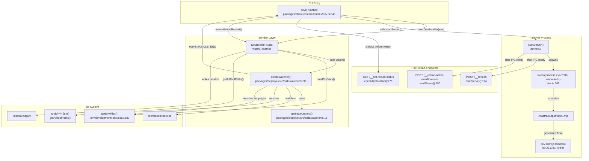

**Sources:** [packages/cli/src/commands/dev/dev.ts:1-499](), [packages/cli/src/commands/dev/DevBundler.ts:1-166](), [packages/deployer/src/build/watcher.ts:1-109]()

## DevBundler Class

The `DevBundler` class extends the base `Bundler` and configures Rollup for development with hot reloading. It detects the runtime environment (Node.js vs Bun) and adjusts the bundler platform accordingly.

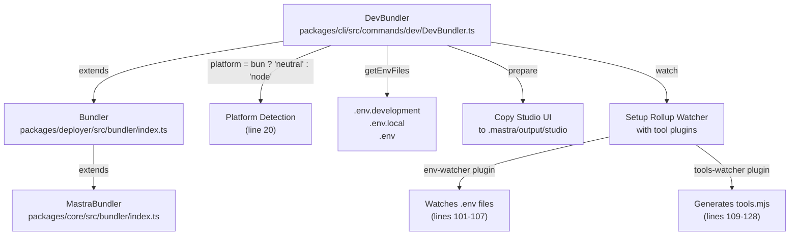

**Key Methods:**

| Method                                          | Purpose                                                                                                      | Line Reference                                          |
| ----------------------------------------------- | ------------------------------------------------------------------------------------------------------------ | ------------------------------------------------------- |
| `constructor(customEnvFile?)`                   | Initializes bundler, sets `this.platform` based on `process.versions.bun`                                    | [packages/cli/src/commands/dev/DevBundler.ts:16-21]()   |
| `getEnvFiles()`                                 | Returns first existing file from `['.env.development', '.env.local', '.env']`, respects `MASTRA_SKIP_DOTENV` | [packages/cli/src/commands/dev/DevBundler.ts:23-44]()   |
| `prepare(outputDirectory)`                      | Calls `super.prepare()`, copies Studio UI from `dist/studio` to `.mastra/output/studio`                      | [packages/cli/src/commands/dev/DevBundler.ts:46-56]()   |
| `watch(entryFile, outputDirectory, toolsPaths)` | Calls `getWatcherInputOptions()`, adds custom plugins, returns `createWatcher()` promise                     | [packages/cli/src/commands/dev/DevBundler.ts:58-160]()  |
| `bundle()`                                      | No-op implementation (development mode doesn't use standard bundle)                                          | [packages/cli/src/commands/dev/DevBundler.ts:162-165]() |

The `watch()` method at line 58 configures a Rollup watcher with two critical plugins:

1. **env-watcher** plugin: Implements `buildStart()` hook that calls `this.addWatchFile(envFile)` for each discovered .env file [packages/cli/src/commands/dev/DevBundler.ts:101-107]()
2. **tools-watcher** plugin: Implements async `buildEnd()` hook that generates `tools.mjs` with import statements like `import * as tool0 from './tools/{uuid}.mjs'` [packages/cli/src/commands/dev/DevBundler.ts:109-128]()

The input configuration at line 130 uses `join(__dirname, 'templates', 'dev.entry.js')` as the main entry point, which differs from production builds that use virtual entry strings.

**Sources:** [packages/cli/src/commands/dev/DevBundler.ts:13-166](), [packages/deployer/src/bundler/index.ts:28-463]()

## Server Process Lifecycle

The dev command manages the server process lifecycle through `startServer`, `rebundleAndRestart`, and `checkAndRestart` functions. The lifecycle includes starting, monitoring, and gracefully restarting the Node.js process.

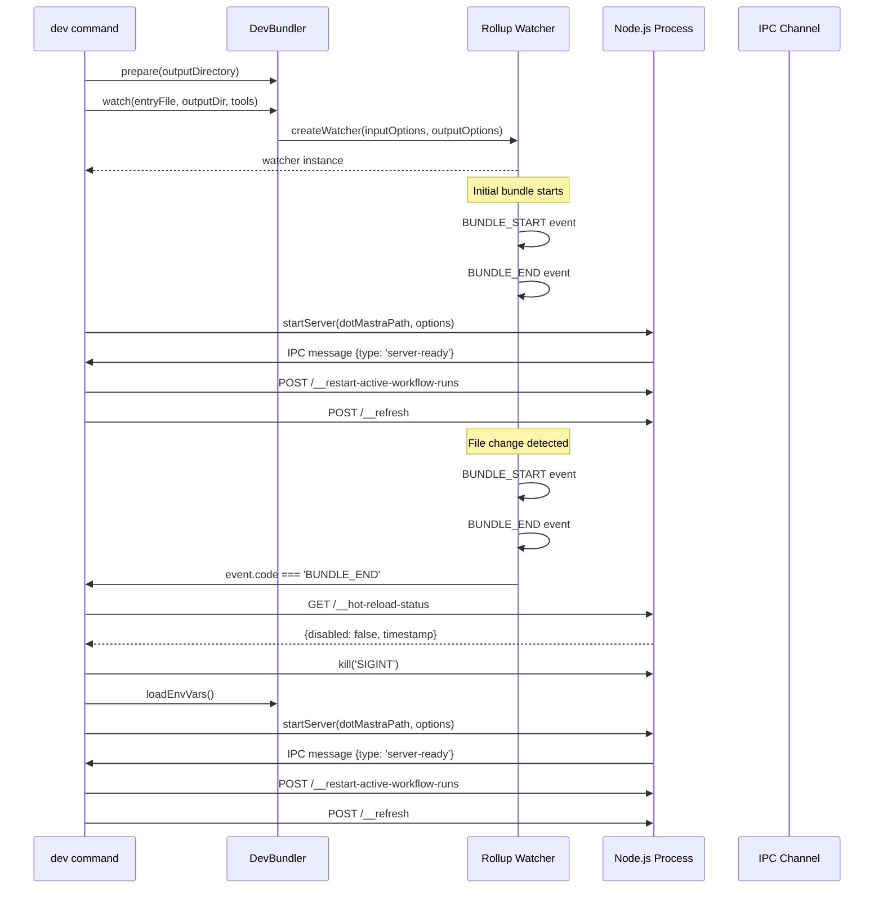

**Server Startup Process:**

The `startServer` function spawns a Node.js child process using `execa` with specific configurations:

| Configuration          | Value                                | Purpose                            |
| ---------------------- | ------------------------------------ | ---------------------------------- |
| `NODE_ENV`             | `'production'`                       | Optimizes dependencies for runtime |
| `MASTRA_DEV`           | `'true'`                             | Signals development mode to server |
| `PORT`                 | Configured or auto-selected          | Server listen port                 |
| `MASTRA_PACKAGES_FILE` | Path to JSON file                    | Passes package version info        |
| `stdio`                | `['inherit', 'pipe', 'pipe', 'ipc']` | Enables IPC communication          |

The process writes discovered Mastra packages to `mastra-packages.json` which is passed via environment variable to the server process [packages/cli/src/commands/dev/dev.ts:101-106]().

**Error Recovery:**

The server implements automatic restart on error with a maximum retry limit:

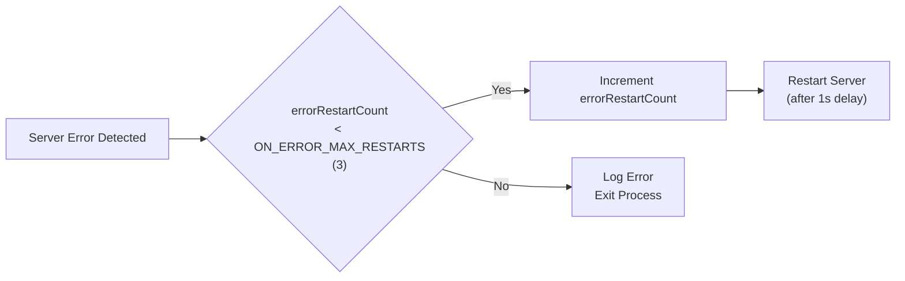

**Sources:** [packages/cli/src/commands/dev/dev.ts:67-261](), [packages/cli/src/commands/dev/dev.ts:234-260]()

## File Watching and Hot Reload Mechanism

The hot reload system monitors source files and environment variables, triggering rebuilds and server restarts when changes occur.

### Watch Configuration

The Rollup watcher monitors multiple file types:

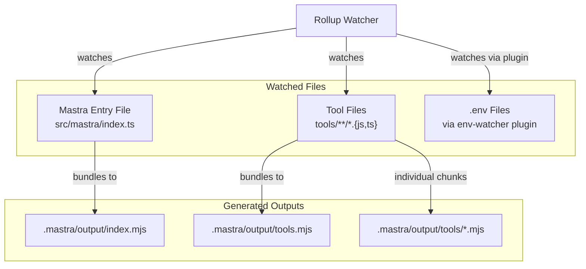

The watcher emits events that the dev command listens to:

| Event Code     | Handler                | Action                                               |
| -------------- | ---------------------- | ---------------------------------------------------- |
| `BUNDLE_START` | `devLogger.bundling()` | Display "Bundling..." message                        |
| `BUNDLE_END`   | `checkAndRestart()`    | Verify hot reload status, then restart server        |
| `ERROR`        | Error handler          | Display error, potentially restart on certain errors |

**Sources:** [packages/cli/src/commands/dev/dev.ts:465-485](), [packages/cli/src/commands/dev/DevBundler.ts:84-139]()

### Hot Reload Status Check

Before restarting the server, the `checkAndRestart()` function at line 263 queries the `/__hot-reload-status` endpoint to determine if hot reload should be skipped:

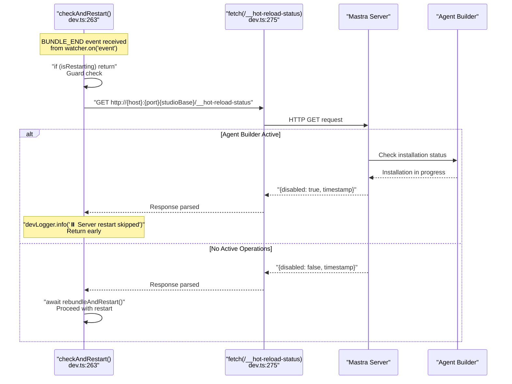

This mechanism prevents server restarts during long-running operations like template installations that occur via the agent builder UI [packages/cli/src/commands/dev/dev.ts:274-286]().

**Sources:** [packages/cli/src/commands/dev/dev.ts:263-291]()

## Environment Variable Management

The DevBundler loads environment variables from multiple sources with precedence rules:

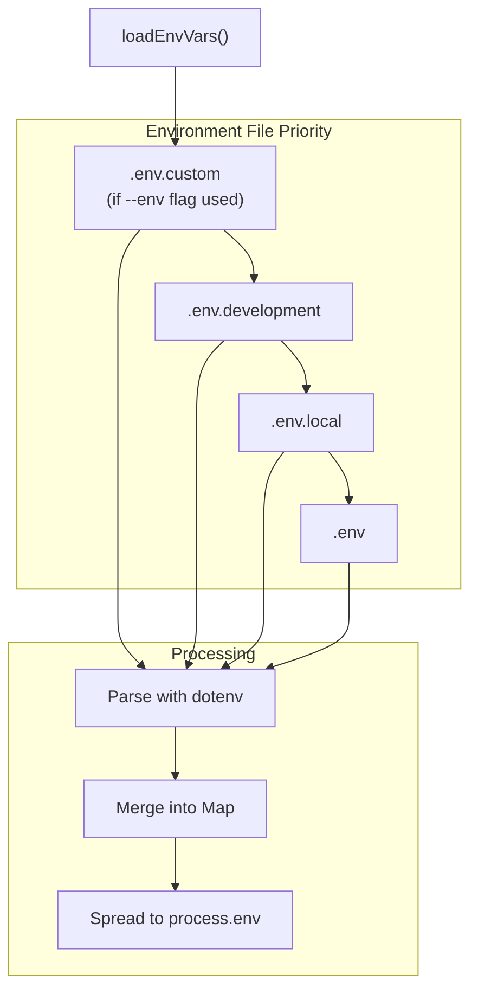

The `getEnvFiles()` method at line 23 returns the first existing file from the priority list. It checks `shouldSkipDotenvLoading()` which reads the `MASTRA_SKIP_DOTENV` environment variable [packages/cli/src/commands/dev/DevBundler.ts:23-44]().

Environment variables are reloaded on each server restart within `rebundleAndRestart()` at line 293:

```typescript
// From rebundleAndRestart function at line 312
const env = await bundler.loadEnvVars()

// Add request context presets to env if available
if (requestContextPresetsJson) {
  env.set('MASTRA_REQUEST_CONTEXT_PRESETS', requestContextPresetsJson)
}

// spread env into process.env
for (const [key, value] of env.entries()) {
  process.env[key] = value
}
```

The base `loadEnvVars()` implementation in `MastraBundler` at [packages/core/src/bundler/index.ts:25-38]() uses the `dotenv` `parse()` function to read each file and merges values into a `Map<string, string>`.

**Sources:** [packages/cli/src/commands/dev/dev.ts:312-323](), [packages/cli/src/commands/dev/DevBundler.ts:23-44](), [packages/core/src/bundler/index.ts:25-38]()

## Tool Discovery and Bundling

The development server automatically discovers and bundles tool files from the tools directory.

### Tool Path Resolution

The `getAllToolPaths` method discovers tools using glob patterns:

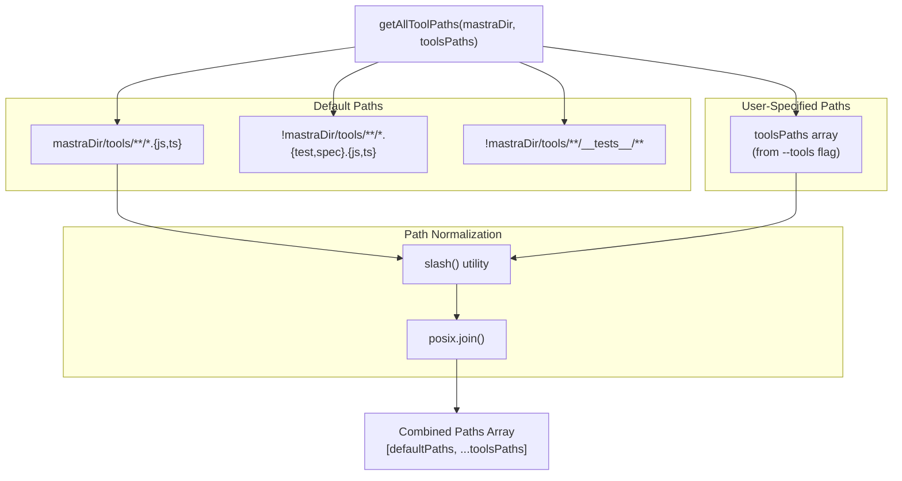

### Tool Bundling Process

Tools are bundled as separate entry points with unique IDs assigned by `crypto.randomUUID()`:

```mermaid
sequenceDiagram
    participant ListTools as "listToolsInputOptions()<br/>bundler/index.ts:232"
    participant Glob as "glob() from tinyglobby<br/>line 236"
    participant FileCheck as "FileService.getFirstExistingFile()<br/>line 243"
    participant Watcher as "Rollup Watcher"
    participant Plugin as "tools-watcher plugin<br/>DevBundler.ts:109"

    ListTools->>ListTools: "const inputs: Record<string, string> = {}"

    loop "for (const toolPath of toolsPaths)"
        ListTools->>Glob: "glob(toolPath, {absolute: true, expandDirectories: false})"
        Glob-->>ListTools: "expandedPaths: string[]"

        loop "for (const path of expandedPaths)"
            ListTools->>FileCheck: "getFirstExistingFile([join(path, 'index.ts'), join(path, 'index.js'), path])"
            FileCheck-->>ListTools: "entryFile or undefined"

            alt "entryFile exists and is not directory"
                ListTools->>ListTools: "const uniqueToolID = crypto.randomUUID()"
                ListTools->>ListTools: "inputs[`tools/${uniqueToolID}`] = normalizedEntryFile"
            else "No valid entry file"
                ListTools->>ListTools: "logger.warn('No entry file found')"
            end
        end
    end

    ListTools-->>Watcher: "return inputs object"
    Watcher->>Watcher: "Bundle each tool as separate chunk"
    Watcher->>Plugin: "buildEnd hook triggered"
    Plugin->>Plugin: "Generate tools.mjs with import statements"

    Note over Plugin: "Generated tools.mjs:<br/>import * as tool0 from './tools/{uuid-1}.mjs';<br/>import * as tool1 from './tools/{uuid-2}.mjs';<br/>export const tools = [tool0, tool1]"
```

Each tool is assigned a random UUID via `crypto.randomUUID()` at line 256 to avoid naming conflicts. The final output is `.mastra/output/tools/{UUID}.mjs` [packages/deployer/src/bundler/index.ts:232-267]().

**Sources:** [packages/deployer/src/bundler/index.ts:209-267](), [packages/cli/src/commands/dev/DevBundler.ts:78-128]()

## Restart Flow and State Management

The restart process coordinates multiple asynchronous operations while preventing race conditions:

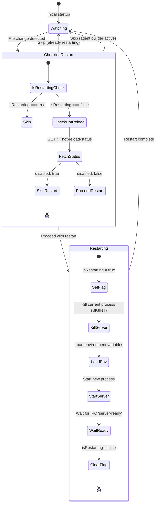

### State Variables

| Variable                    | Type                        | Purpose                                                                                                    | Location                                    |
| --------------------------- | --------------------------- | ---------------------------------------------------------------------------------------------------------- | ------------------------------------------- |
| `currentServerProcess`      | `ChildProcess \| undefined` | Reference to running server returned by execa                                                              | [packages/cli/src/commands/dev/dev.ts:21]() |
| `isRestarting`              | `boolean`                   | Guard flag checked by `checkAndRestart()` to prevent concurrent restarts                                   | [packages/cli/src/commands/dev/dev.ts:22]() |
| `serverStartTime`           | `number \| undefined`       | Set by `Date.now()` at line 77, used by `devLogger.ready()` to display startup time                        | [packages/cli/src/commands/dev/dev.ts:23]() |
| `requestContextPresetsJson` | `string \| undefined`       | JSON string from `loadAndValidatePresets()`, passed to server via `MASTRA_REQUEST_CONTEXT_PRESETS` env var | [packages/cli/src/commands/dev/dev.ts:24]() |
| `ON_ERROR_MAX_RESTARTS`     | `const number = 3`          | Maximum automatic restart attempts after server errors                                                     | [packages/cli/src/commands/dev/dev.ts:25]() |

**Sources:** [packages/cli/src/commands/dev/dev.ts:21-25](), [packages/cli/src/commands/dev/dev.ts:263-338]()

## IPC Communication and Server Readiness

The dev command and server process communicate via IPC to coordinate the hot reload cycle:

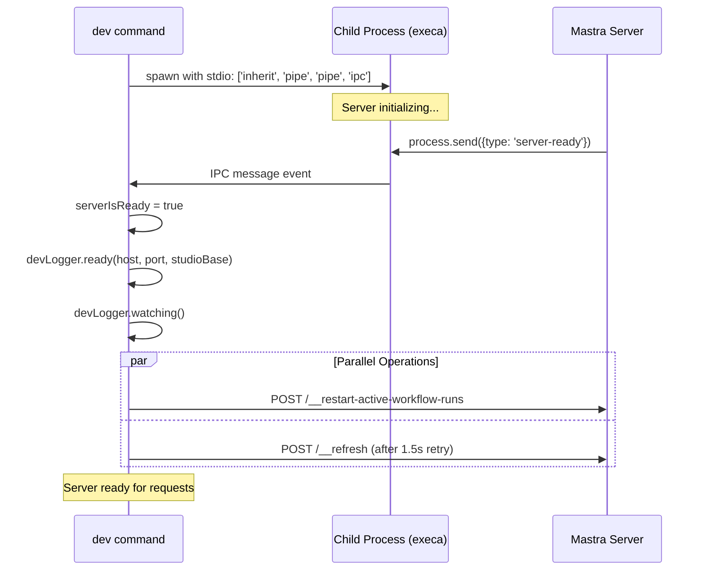

The IPC message handler listens for the `server-ready` message type to know when the server is fully initialized and ready to accept connections [packages/cli/src/commands/dev/dev.ts:184-214]().

### Output Filtering

The dev command filters server output to avoid duplicate log messages:

```typescript
// Filter server output to remove Studio message
if (currentServerProcess.stdout) {
  currentServerProcess.stdout.on('data', (data: Buffer) => {
    const output = data.toString()
    if (
      !output.includes('Studio available') &&
      !output.includes('👨‍💻') &&
      !output.includes('Mastra API running on ')
    ) {
      process.stdout.write(output)
    }
  })
}
```

These messages are filtered because the dev command displays its own formatted startup messages [packages/cli/src/commands/dev/dev.ts:138-149]().

**Sources:** [packages/cli/src/commands/dev/dev.ts:109-214]()

## Studio Integration

The development server includes Studio UI assets and communicates with them via special endpoints:

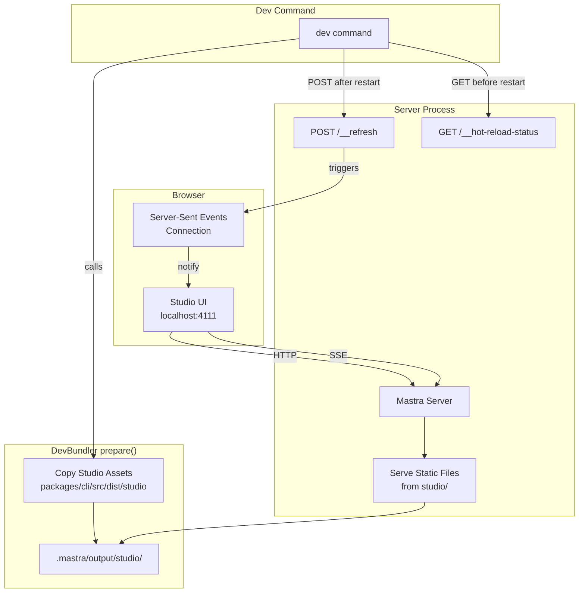

### Studio Copy Process

During the `prepare` phase, DevBundler copies Studio UI assets:

```typescript
const __filename = fileURLToPath(import.meta.url)
const __dirname = dirname(__filename)

const studioServePath = join(outputDirectory, this.outputDir, 'studio')
await fsExtra.copy(
  join(dirname(__dirname), join('dist', 'studio')),
  studioServePath,
  {
    overwrite: true,
  }
)
```

The Studio assets are packaged with the CLI at build time and copied to `.mastra/output/studio` [packages/cli/src/commands/dev/DevBundler.ts:49-55]().

### Refresh Mechanism

After each server restart, the dev command sends a POST request to `/__refresh`:

1. Server restarts and sends `server-ready` IPC message
2. Dev command waits briefly for server to stabilize
3. POST request sent to `/__refresh` endpoint
4. Server broadcasts refresh signal via SSE to connected Studio clients
5. Studio UI reloads agent/workflow definitions

The refresh includes a retry mechanism with 1.5 second delay if the initial request fails [packages/cli/src/commands/dev/dev.ts:193-213]().

**Sources:** [packages/cli/src/commands/dev/dev.ts:193-214](), [packages/cli/src/commands/dev/DevBundler.ts:46-56]()

## Request Context Presets

The dev command supports loading request context presets from a JSON file to provide test data for the Studio UI:

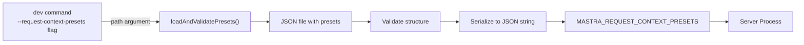

The presets are validated and serialized before being passed to the server process:

```typescript
// Load and validate request context presets if provided
if (requestContextPresets) {
  try {
    requestContextPresetsJson = await loadAndValidatePresets(
      requestContextPresets
    )
    // Add presets to loaded env so it's passed to the server
    loadedEnv.set('MASTRA_REQUEST_CONTEXT_PRESETS', requestContextPresetsJson)
  } catch (error) {
    devLogger.error(
      `Failed to load request context presets: ${error instanceof Error ? error.message : error}`
    )
    process.exit(1)
  }
}
```

The presets are cleared at the start of each `dev` invocation to prevent cross-run leakage [packages/cli/src/commands/dev/dev.ts:378-397]().

**Sources:** [packages/cli/src/commands/dev/dev.ts:378-398]()

## HTTPS Support

The dev command supports HTTPS via two configuration methods:

### Certificate Generation

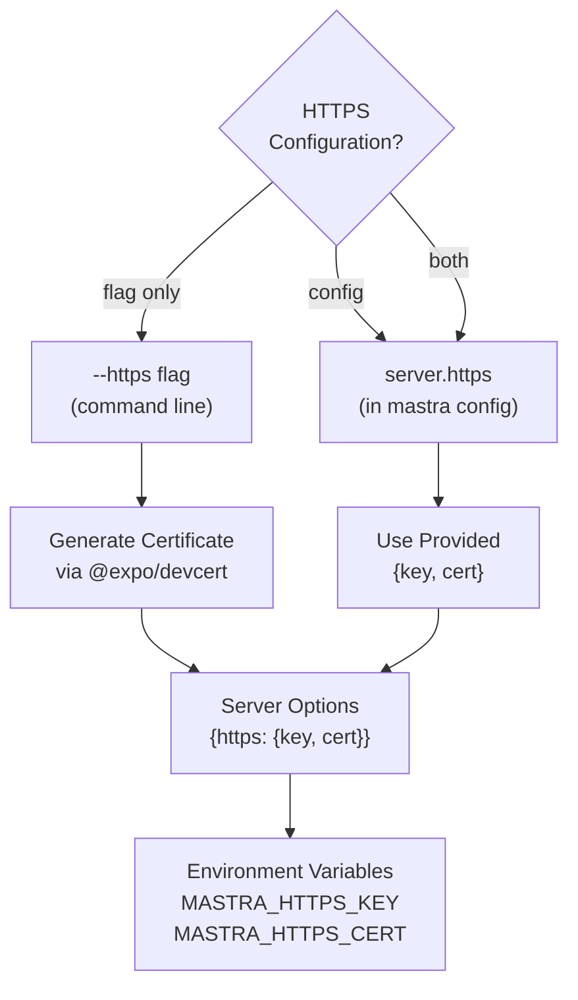

When both `--https` flag and `server.https` config are provided, the config takes precedence with a warning [packages/cli/src/commands/dev/dev.ts:423-425]().

The certificate is generated using `@expo/devcert` which creates a trusted local development certificate:

```typescript
if (https && serverOptions?.https) {
  devLogger.warn(
    '--https flag and server.https config are both specified. Using server.https config.'
  )
}
if (serverOptions?.https) {
  httpsOptions = serverOptions.https
} else if (https) {
  const { key, cert } = await devcert.certificateFor(
    serverOptions?.host ?? 'localhost'
  )
  httpsOptions = { key, cert }
}
```

The certificate buffers are base64-encoded and passed as environment variables to the child process [packages/cli/src/commands/dev/dev.ts:117-121]().

**Sources:** [packages/cli/src/commands/dev/dev.ts:414-431](), [packages/cli/src/commands/dev/dev.ts:117-121]()

## Platform Detection and Bundler Configuration

The DevBundler detects the runtime platform and adjusts bundler configuration accordingly:

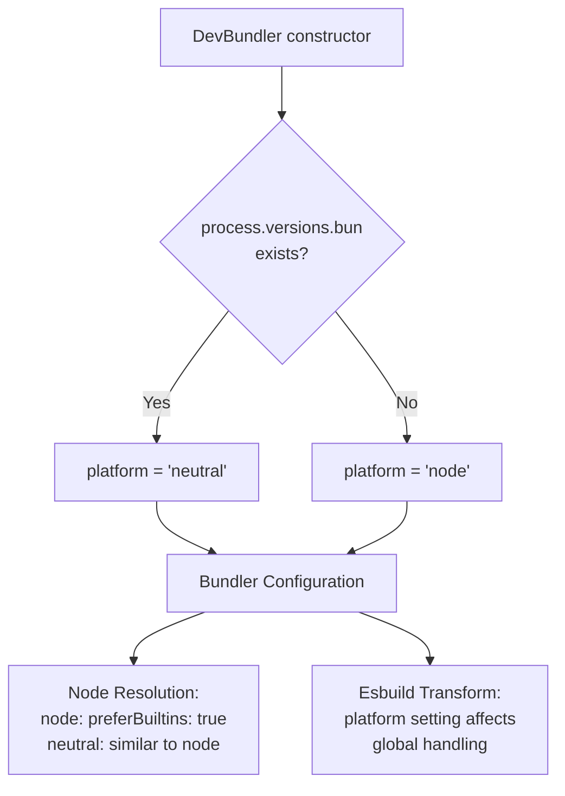

### Platform-Specific Behavior

| Platform    | Value               | Use Case                 | Global Handling                     |
| ----------- | ------------------- | ------------------------ | ----------------------------------- |
| `'node'`    | Default for Node.js | Standard Node.js runtime | Externalizes Node.js built-ins      |
| `'neutral'` | Used for Bun        | Bun runtime support      | Preserves Bun globals like `Bun.s3` |

The platform setting is passed to the watcher's input options, affecting how imports and globals are handled [packages/cli/src/commands/dev/DevBundler.ts:16-21](), [packages/deployer/src/build/watcher.ts:16-28]().

**Sources:** [packages/cli/src/commands/dev/DevBundler.ts:13-21](), [packages/deployer/src/build/bundler.ts:20-162]()

## Development vs Production Bundling

The development server differs from production builds in several key ways:

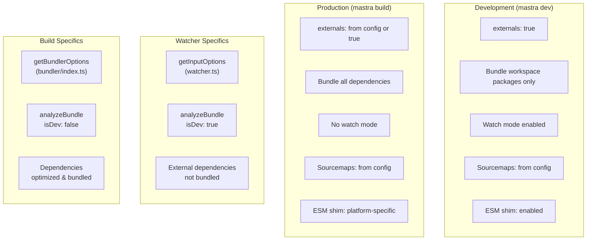

### Key Differences Table

| Aspect                  | Development                 | Production                   |
| ----------------------- | --------------------------- | ---------------------------- |
| Dependency bundling     | Workspace packages only     | All or configured externals  |
| Watch mode              | Enabled with Rollup watcher | Disabled                     |
| Rebuild trigger         | File changes                | Manual `mastra build`        |
| Server restart          | Automatic                   | Manual start                 |
| Dependency optimization | Minimal (faster rebuilds)   | Full (smaller bundles)       |
| `isDev` flag            | `true` in analyzeBundle     | `false` in analyzeBundle     |
| Studio assets           | Copied to output            | Optional via `--studio` flag |

The `isDev` flag affects how workspace dependencies are analyzed. In development, the analyzer recursively checks transitive workspace dependencies to ensure proper hot reloading [packages/deployer/src/build/analyze.ts:387-394]().

**Sources:** [packages/deployer/src/build/watcher.ts:33-63](), [packages/deployer/src/bundler/index.ts:269-307](), [packages/deployer/src/build/analyze/bundleExternals.ts:457-467]()

## Graceful Shutdown

The dev command registers signal handlers to ensure clean shutdown:

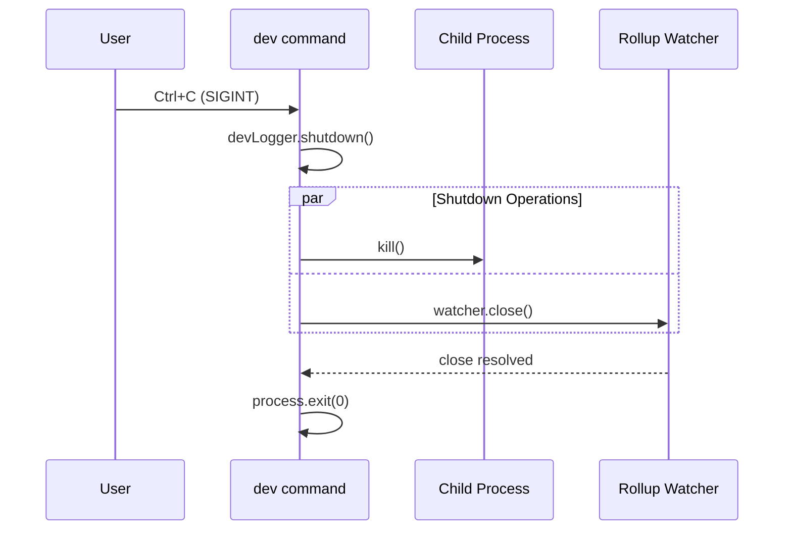

The SIGINT handler performs cleanup in parallel for faster shutdown:

```typescript
process.on('SIGINT', () => {
  devLogger.shutdown()

  if (currentServerProcess) {
    currentServerProcess.kill()
  }

  watcher
    .close()
    .catch(() => {})
    .finally(() => process.exit(0))
})
```

This ensures the Rollup watcher is properly closed and the server process is terminated before exiting [packages/cli/src/commands/dev/dev.ts:487-498]().

**Sources:** [packages/cli/src/commands/dev/dev.ts:487-498]()
