# CLI and Development Tools

<details>
<summary>Relevant source files</summary>

The following files were used as context for generating this wiki page:

- [deployers/cloudflare/src/index.ts](deployers/cloudflare/src/index.ts)
- [deployers/netlify/src/index.ts](deployers/netlify/src/index.ts)
- [deployers/vercel/src/index.ts](deployers/vercel/src/index.ts)
- [docs/src/content/en/docs/deployment/studio.mdx](docs/src/content/en/docs/deployment/studio.mdx)
- [docs/src/content/en/reference/cli/create-mastra.mdx](docs/src/content/en/reference/cli/create-mastra.mdx)
- [e2e-tests/monorepo/monorepo.test.ts](e2e-tests/monorepo/monorepo.test.ts)
- [e2e-tests/monorepo/template/apps/custom/src/mastra/index.ts](e2e-tests/monorepo/template/apps/custom/src/mastra/index.ts)
- [packages/cli/src/commands/actions/create-project.ts](packages/cli/src/commands/actions/create-project.ts)
- [packages/cli/src/commands/actions/init-project.ts](packages/cli/src/commands/actions/init-project.ts)
- [packages/cli/src/commands/build/BuildBundler.ts](packages/cli/src/commands/build/BuildBundler.ts)
- [packages/cli/src/commands/build/build.ts](packages/cli/src/commands/build/build.ts)
- [packages/cli/src/commands/create/bun-detection.test.ts](packages/cli/src/commands/create/bun-detection.test.ts)
- [packages/cli/src/commands/create/create.test.ts](packages/cli/src/commands/create/create.test.ts)
- [packages/cli/src/commands/create/create.ts](packages/cli/src/commands/create/create.ts)
- [packages/cli/src/commands/create/utils.ts](packages/cli/src/commands/create/utils.ts)
- [packages/cli/src/commands/dev/DevBundler.test.ts](packages/cli/src/commands/dev/DevBundler.test.ts)
- [packages/cli/src/commands/dev/DevBundler.ts](packages/cli/src/commands/dev/DevBundler.ts)
- [packages/cli/src/commands/dev/dev.ts](packages/cli/src/commands/dev/dev.ts)
- [packages/cli/src/commands/init/init.test.ts](packages/cli/src/commands/init/init.test.ts)
- [packages/cli/src/commands/init/init.ts](packages/cli/src/commands/init/init.ts)
- [packages/cli/src/commands/init/utils.ts](packages/cli/src/commands/init/utils.ts)
- [packages/cli/src/commands/studio/studio.test.ts](packages/cli/src/commands/studio/studio.test.ts)
- [packages/cli/src/commands/studio/studio.ts](packages/cli/src/commands/studio/studio.ts)
- [packages/cli/src/commands/utils.test.ts](packages/cli/src/commands/utils.test.ts)
- [packages/cli/src/commands/utils.ts](packages/cli/src/commands/utils.ts)
- [packages/cli/src/index.ts](packages/cli/src/index.ts)
- [packages/cli/src/services/service.deps.ts](packages/cli/src/services/service.deps.ts)
- [packages/cli/src/utils/clone-template.test.ts](packages/cli/src/utils/clone-template.test.ts)
- [packages/cli/src/utils/clone-template.ts](packages/cli/src/utils/clone-template.ts)
- [packages/cli/src/utils/template-utils.test.ts](packages/cli/src/utils/template-utils.test.ts)
- [packages/cli/src/utils/template-utils.ts](packages/cli/src/utils/template-utils.ts)
- [packages/cli/tsconfig.json](packages/cli/tsconfig.json)
- [packages/core/src/bundler/index.ts](packages/core/src/bundler/index.ts)
- [packages/create-mastra/src/index.ts](packages/create-mastra/src/index.ts)
- [packages/create-mastra/src/utils.ts](packages/create-mastra/src/utils.ts)
- [packages/create-mastra/tsconfig.json](packages/create-mastra/tsconfig.json)
- [packages/deployer/src/build/analyze.ts](packages/deployer/src/build/analyze.ts)
- [packages/deployer/src/build/analyze/**snapshots**/analyzeEntry.test.ts.snap](packages/deployer/src/build/analyze/__snapshots__/analyzeEntry.test.ts.snap)
- [packages/deployer/src/build/analyze/analyzeEntry.test.ts](packages/deployer/src/build/analyze/analyzeEntry.test.ts)
- [packages/deployer/src/build/analyze/analyzeEntry.ts](packages/deployer/src/build/analyze/analyzeEntry.ts)
- [packages/deployer/src/build/analyze/bundleExternals.test.ts](packages/deployer/src/build/analyze/bundleExternals.test.ts)
- [packages/deployer/src/build/analyze/bundleExternals.ts](packages/deployer/src/build/analyze/bundleExternals.ts)
- [packages/deployer/src/build/bundler.ts](packages/deployer/src/build/bundler.ts)
- [packages/deployer/src/build/utils.test.ts](packages/deployer/src/build/utils.test.ts)
- [packages/deployer/src/build/utils.ts](packages/deployer/src/build/utils.ts)
- [packages/deployer/src/build/watcher.test.ts](packages/deployer/src/build/watcher.test.ts)
- [packages/deployer/src/build/watcher.ts](packages/deployer/src/build/watcher.ts)
- [packages/deployer/src/bundler/index.ts](packages/deployer/src/bundler/index.ts)
- [packages/deployer/src/server/**tests**/option-studio-base.test.ts](packages/deployer/src/server/__tests__/option-studio-base.test.ts)
- [packages/deployer/src/server/index.ts](packages/deployer/src/server/index.ts)
- [packages/playground/e2e/tests/auth/infrastructure.spec.ts](packages/playground/e2e/tests/auth/infrastructure.spec.ts)
- [packages/playground/e2e/tests/auth/viewer-role.spec.ts](packages/playground/e2e/tests/auth/viewer-role.spec.ts)
- [packages/playground/index.html](packages/playground/index.html)
- [packages/playground/src/App.tsx](packages/playground/src/App.tsx)
- [packages/playground/src/components/ui/app-sidebar.tsx](packages/playground/src/components/ui/app-sidebar.tsx)

</details>

The Mastra CLI provides the complete development lifecycle for AI applications, from project scaffolding to production deployment. This document covers the command-line interface, development server, build pipeline, and platform deployers.

For information about the HTTP server and API endpoints exposed by Mastra, see [Server and API Layer](#9). For details about the bundler configuration and options, see [Build, Test, and CI/CD](#12).

---

## Overview

The Mastra CLI is implemented in `packages/cli` and provides seven primary commands:

| Command   | Purpose                                  | Package                   |
| --------- | ---------------------------------------- | ------------------------- |
| `create`  | Scaffold new projects with templates     | `create-mastra`, `mastra` |
| `init`    | Initialize Mastra in existing projects   | `mastra`                  |
| `dev`     | Start development server with hot reload | `mastra`                  |
| `build`   | Bundle for production deployment         | `mastra`                  |
| `start`   | Run built application                    | `mastra`                  |
| `studio`  | Launch standalone Studio UI              | `mastra`                  |
| `migrate` | Run database migrations                  | `mastra`                  |
| `scorers` | Manage evaluation scorers                | `mastra`                  |

Sources: [packages/cli/src/index.ts:37-186]()

---

## CLI Architecture and Command Structure

**CLI Entry Point and Command Registration**

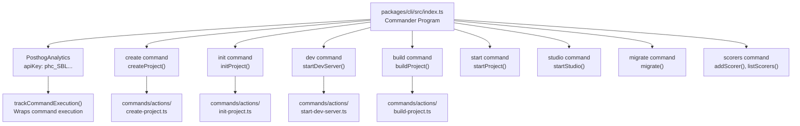

The CLI uses Commander.js for argument parsing and option handling. Each command is registered with flags and options, then dispatched to action handlers in `packages/cli/src/commands/actions/`.

Sources: [packages/cli/src/index.ts:1-191](), [packages/cli/src/analytics/index.ts]()

---

## Project Creation Workflow

**Project Creation Pipeline**

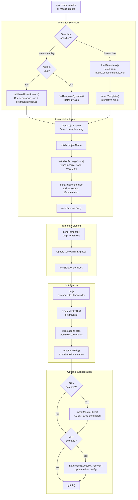

The project creation flow supports three modes:

1. **Template-based**: Clone from 88+ curated templates or any GitHub repo
2. **Interactive**: Step-by-step prompts for configuration
3. **Flag-based**: Non-interactive with CLI arguments

Sources: [packages/cli/src/commands/create/create.ts:21-404](), [packages/cli/src/commands/create/utils.ts:156-343](), [packages/create-mastra/src/index.ts:1-91]()

**Template Validation for GitHub URLs**

When using a GitHub URL as a template, the CLI validates it as a Mastra project:

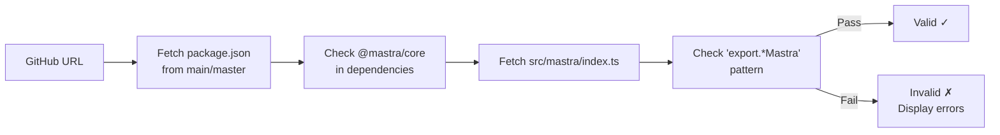

Sources: [packages/cli/src/commands/create/create.ts:131-211]()

---

## Development Server Architecture

**DevBundler and Hot Reload System**

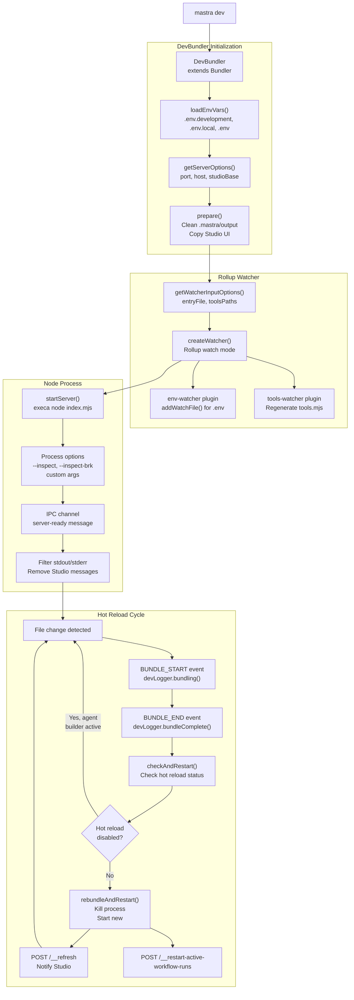

The development server uses Rollup's watch mode for incremental rebuilding. When files change, the bundler emits `BUNDLE_END` events that trigger server restarts unless hot reload is temporarily disabled (e.g., during agent builder template installation).

Sources: [packages/cli/src/commands/dev/dev.ts:340-499](), [packages/cli/src/commands/dev/DevBundler.ts:13-165]()

**Hot Reload Safeguard Mechanism**

The dev server checks a hot reload status endpoint before restarting:

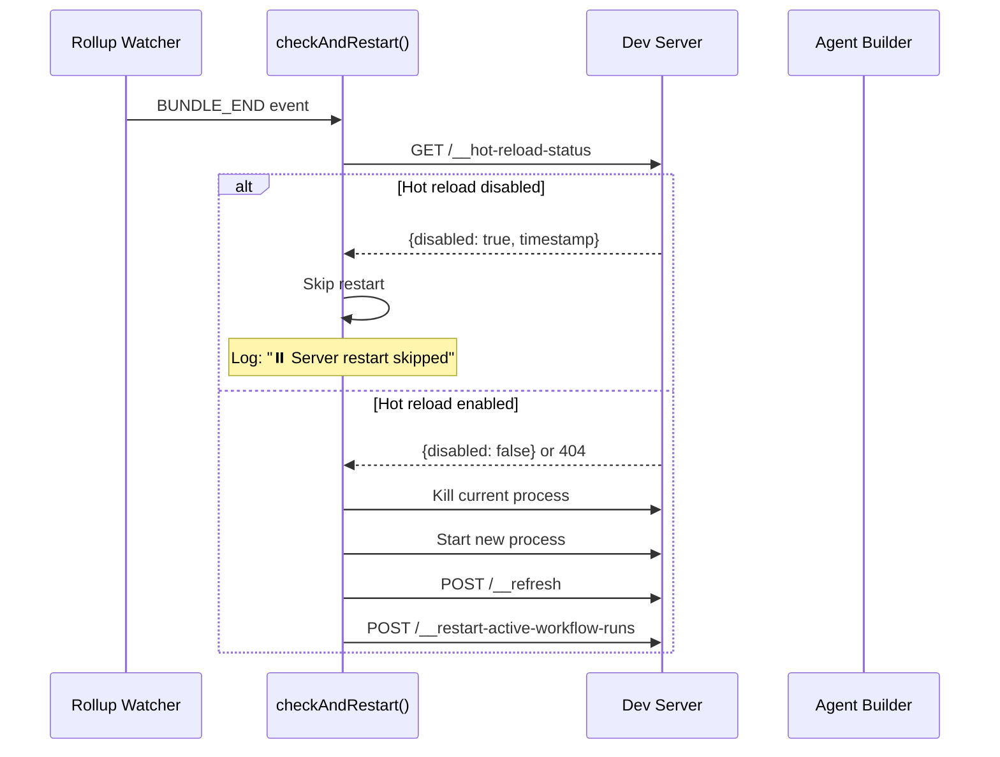

This prevents interrupting long-running operations like skill installations initiated from the Studio UI.

Sources: [packages/cli/src/commands/dev/dev.ts:263-291]()

---

## Build System and Dependency Analysis

**Three-Phase Build Pipeline**

```mermaid
graph TB
    BuildCommand["mastra build"]

    subgraph "Phase 1: Entry Analysis"
        AnalyzeEntry["analyzeEntry()<br/>For each entry file"]
        EntryBundler["Rollup with esbuild<br/>transpile + commonjs"]
        ExtractImports["Extract imports<br/>output.importedBindings"]
        CategorizeImports["Categorize:<br/>- Workspace packages<br/>- Node built-ins<br/>- External deps"]
        CheckTransitive["shouldCheckTransitiveDependencies<br/>For dev/externalsPreset"]
        DepsToOptimize["Map<string, DependencyMetadata><br/>exports, version, isWorkspace"]
    end

    subgraph "Phase 2: Bundle Externals"
        CreateVirtual["createVirtualDependencies()<br/>Generate #virtual-* modules"]
        VirtualEntries["Map fileName to virtual code<br/>export {a,b} from 'pkg'"]
        RollupBundle["Rollup bundle with:<br/>- virtual plugin<br/>- esbuild<br/>- commonjs<br/>- module-resolve-map"]
        OutputChunks["Output chunks<br/>pkg-name.mjs files"]
        UsedExternals["Track used externals<br/>from chunk.imports"]
    end

    subgraph "Phase 3: Validate Output"
        ValidateEach["For each output chunk"]
        RunValidation["validate()<br/>Dynamic import test"]
        DetectErrors["Error detection:<br/>- TypeError<br/>- MODULE_NOT_FOUND<br/>- Native build missing"]
        CheckWorkspace["Check if error in<br/>workspace package"]
        ResolveVersion["Resolve package version<br/>from package.json"]
        ExternalDepsMap["Map<string, ExternalDependencyInfo><br/>{version}"]
    end

    BuildCommand --> AnalyzeEntry
    AnalyzeEntry --> EntryBundler
    EntryBundler --> ExtractImports
    ExtractImports --> CategorizeImports
    CategorizeImports --> CheckTransitive
    CheckTransitive --> DepsToOptimize

    DepsToOptimize --> CreateVirtual
    CreateVirtual --> VirtualEntries
    VirtualEntries --> RollupBundle
    RollupBundle --> OutputChunks
    OutputChunks --> UsedExternals

    UsedExternals --> ValidateEach
    ValidateEach --> RunValidation
    RunValidation --> DetectErrors
    DetectErrors --> CheckWorkspace
    CheckWorkspace --> ResolveVersion
    ResolveVersion --> ExternalDepsMap
```

The build pipeline performs three distinct phases to ensure correct bundling:

1. **analyzeEntry**: Transpile entry files and extract dependency imports
2. **bundleExternals**: Create optimized bundles for workspace packages
3. **validateOutput**: Dynamically import generated bundles to catch errors

Sources: [packages/deployer/src/build/analyze.ts:296-499](), [packages/deployer/src/build/analyze/analyzeEntry.ts:80-232](), [packages/deployer/src/build/analyze/bundleExternals.ts:265-398]()

**Dependency Metadata Structure**

The `analyzeEntry` function builds a `Map<string, DependencyMetadata>` where each entry contains:

| Field         | Type                  | Purpose                                   |
| ------------- | --------------------- | ----------------------------------------- |
| `exports`     | `string[]`            | Named exports used from package           |
| `version`     | `string \| undefined` | Package version from package.json         |
| `isWorkspace` | `boolean`             | Whether package is in pnpm/yarn workspace |
| `rootPath`    | `string \| null`      | Absolute path to package root             |

During dev builds or with `externals: true`, only workspace packages remain in `depsToOptimize`. Other packages become external dependencies.

Sources: [packages/deployer/src/build/types.ts](), [packages/deployer/src/build/analyze.ts:344-400]()

**Virtual Module Generation**

The `createVirtualDependencies` function generates virtual entry points for each optimized package:

```typescript
// Input: Map with { 'lodash': { exports: ['map', 'filter'] } }
// Output: Virtual module
export { map, filter } from 'lodash'
```

Virtual modules are mapped to safe filenames using `__` as a separator to preserve scoped package names:

- `@inner/inner-tools` → `@inner__inner-tools`
- `bcrypt` → `bcrypt`

Sources: [packages/deployer/src/build/analyze/bundleExternals.ts:46-129]()

---

## Bundler Architecture

**Bundler Class Hierarchy**

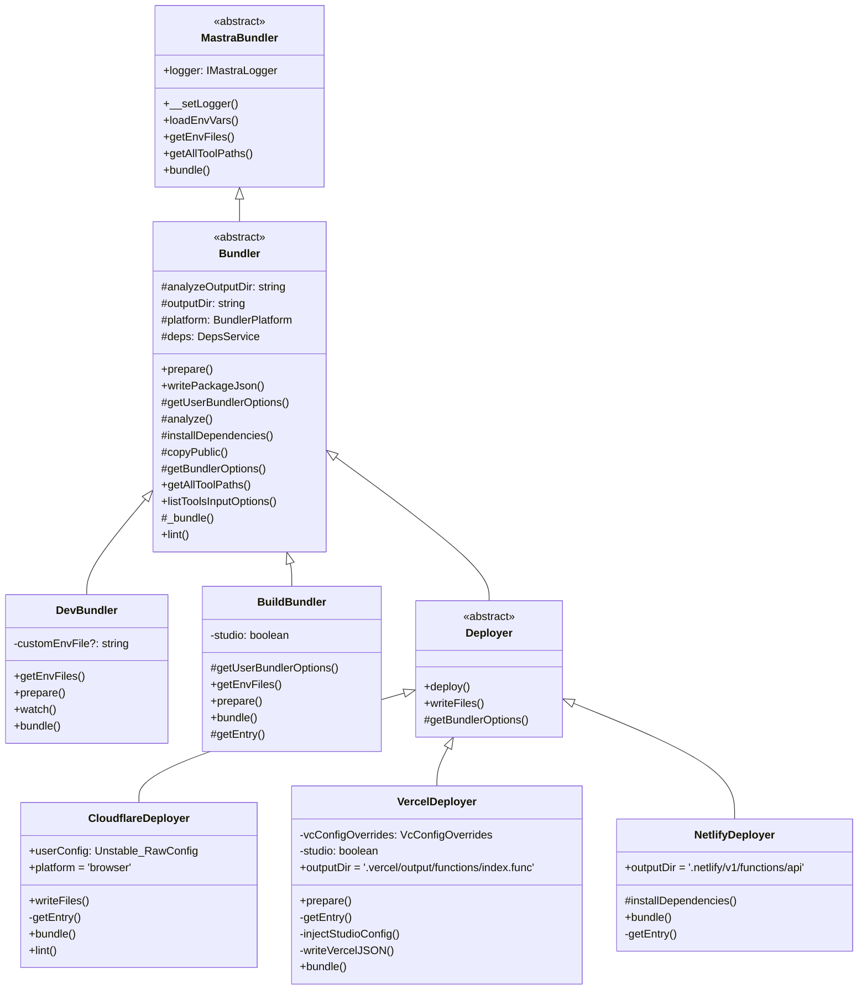

The bundler hierarchy separates concerns:

- `MastraBundler`: Abstract base in `@mastra/core` defining interface
- `Bundler`: Shared implementation in `@mastra/deployer` with analysis and bundling logic
- `DevBundler`/`BuildBundler`: Development vs production bundling strategies
- `Deployer`: Platform-specific deployment extensions

Sources: [packages/core/src/bundler/index.ts:4-56](), [packages/deployer/src/bundler/index.ts:28-463]()

**Platform Detection and Configuration**

The bundler uses `BundlerPlatform` to configure module resolution:

| Platform  | Use Case           | Export Conditions                  | Built-ins  |
| --------- | ------------------ | ---------------------------------- | ---------- |
| `node`    | Node.js servers    | `['node']`                         | External   |
| `browser` | Cloudflare Workers | `['browser', 'worker', 'default']` | Polyfilled |
| `neutral` | Bun runtime        | Default                            | Preserved  |

Cloudflare uses `browser` platform to resolve the Cloudflare SDK to web-compatible implementations instead of Node.js-specific code that depends on `https` module.

Sources: [packages/deployer/src/build/utils.ts:16-39](), [deployers/cloudflare/src/index.ts:44-48]()

---

## Platform Deployers

**Deployer Entry Point Generation**

Each deployer generates a platform-specific entry file that wraps the Mastra instance:

**CloudflareDeployer**

```javascript
// deployers/cloudflare/src/index.ts:175-195
export default {
  fetch: async (request, env, context) => {
    const { mastra } = await import('#mastra')
    const { tools } = await import('#tools')
    const { createHonoServer, getToolExports } = await import('#server')
    const _mastra = mastra()

    // Register internal workflows
    if (_mastra.getStorage()) {
      _mastra.__registerInternalWorkflow(scoreTracesWorkflow)
    }

    const app = await createHonoServer(_mastra, {
      tools: getToolExports(tools),
    })
    return app.fetch(request, env, context)
  },
}
```

**VercelDeployer**

```javascript
// deployers/vercel/src/index.ts:47-68
import { handle } from 'hono/vercel'
import { mastra } from '#mastra'
import { createHonoServer, getToolExports } from '#server'
import { tools } from '#tools'

const app = await createHonoServer(mastra, { tools: getToolExports(tools) })

export const GET = handle(app)
export const POST = handle(app)
// ... other HTTP methods
```

**NetlifyDeployer**

```javascript
// deployers/netlify/src/index.ts:73-88
import { handle } from 'hono/netlify'
import { mastra } from '#mastra'
import { createHonoServer, getToolExports } from '#server'
import { tools } from '#tools'

const app = await createHonoServer(mastra, { tools: getToolExports(tools) })

export default handle(app)
```

Sources: [deployers/cloudflare/src/index.ts:175-196](), [deployers/vercel/src/index.ts:47-68](), [deployers/netlify/src/index.ts:73-88]()

**Deployer Configuration Files**

Each deployer generates platform-specific configuration:

| Deployer   | Config File       | Location                               | Format                       |
| ---------- | ----------------- | -------------------------------------- | ---------------------------- |
| Cloudflare | `wrangler.json`   | `.mastra/output/`                      | Workers config with bindings |
| Cloudflare | `wrangler.jsonc`  | Project root                           | Relative paths for local dev |
| Vercel     | `.vc-config.json` | `.vercel/output/functions/index.func/` | Function configuration       |
| Vercel     | `config.json`     | `.vercel/output/`                      | Build Output API v3          |
| Netlify    | `config.json`     | `.netlify/v1/`                         | Frameworks API config        |

Sources: [deployers/cloudflare/src/index.ts:69-173](), [deployers/vercel/src/index.ts:95-106](), [deployers/netlify/src/index.ts:50-64]()

**TypeScript and Module Stubbing for Workers**

CloudflareDeployer creates stub modules to prevent bundling large libraries:

```javascript
// typescript-stub.mjs
export default {}
export const createSourceFile = () => null
export const createProgram = () => null
// ... minimal TypeScript API surface
```

The `@mastra/agent-builder` package dynamically imports TypeScript for validation, but gracefully degrades when unavailable. The stub prevents the ~10MB TypeScript library from bloating the Workers bundle.

Similarly, `execa` (used for local sandbox processes) is stubbed since it's unavailable in Workers.

Sources: [deployers/cloudflare/src/index.ts:94-127]()

---

## Tool Discovery and Bundling

**Tool Path Resolution Pipeline**

```mermaid
graph TB
    GetAllToolPaths["getAllToolPaths()<br/>mastraDir, toolsPaths[]"]

    subgraph "Default Tools"
        DefaultGlob["Default pattern:<br/>mastraDir/tools/**/*.{js,ts}"]
        IgnoreTests["Ignore patterns:<br/>*.{test,spec}.{js,ts}<br/>__tests__/**"]
        DefaultPaths["[defaultToolsPath,<br/>...ignorePatterns]"]
    end

    subgraph "User Tools"
        UserPaths["User-provided paths<br/>--tools flag"]
        CombinePaths["Combine with defaults<br/>[...toolsPaths, defaultPaths]"]
    end

    subgraph "Input Options Generation"
        ListToolsInputOptions["listToolsInputOptions()<br/>For each path"]
        ExpandGlob["glob(toolPath, {absolute: true})"]
        FindEntry["getFirstExistingFile([<br/>path/index.ts,<br/>path/index.js,<br/>path itself]"]
        CheckIsDir["Check if directory"]
        GenerateToolId["crypto.randomUUID()"]
        ToolInputMap["inputs['tools/uuid'] = entryFile"]
    end

    subgraph "Runtime Loading"
        BundleTools["Bundle each tool to<br/>tools/uuid.mjs"]
        GenerateToolsFile["Generate tools.mjs:<br/>import * as tool0 from './tools/uuid.mjs'<br/>export const tools = [tool0, ...]"]
        ServerImport["Server imports #tools<br/>getToolExports(tools)"]
    end

    GetAllToolPaths --> DefaultGlob
    DefaultGlob --> IgnoreTests
    IgnoreTests --> DefaultPaths
    DefaultPaths --> UserPaths
    UserPaths --> CombinePaths

    CombinePaths --> ListToolsInputOptions
    ListToolsInputOptions --> ExpandGlob
    ExpandGlob --> FindEntry
    FindEntry --> CheckIsDir
    CheckIsDir -->|File| GenerateToolId
    CheckIsDir -->|Dir| FindEntry
    GenerateToolId --> ToolInputMap

    ToolInputMap --> BundleTools
    BundleTools --> GenerateToolsFile
    GenerateToolsFile --> ServerImport
```

Tools are discovered through a two-step process:

1. `getAllToolPaths()` expands globs to absolute paths
2. `listToolsInputOptions()` creates Rollup input entries with random UUIDs

The UUID-based naming prevents conflicts when tools from different directories have the same filename.

Sources: [packages/deployer/src/bundler/index.ts:209-267](), [packages/cli/src/commands/dev/DevBundler.ts:78-128]()

---

## Template System

**Template Discovery and Selection**

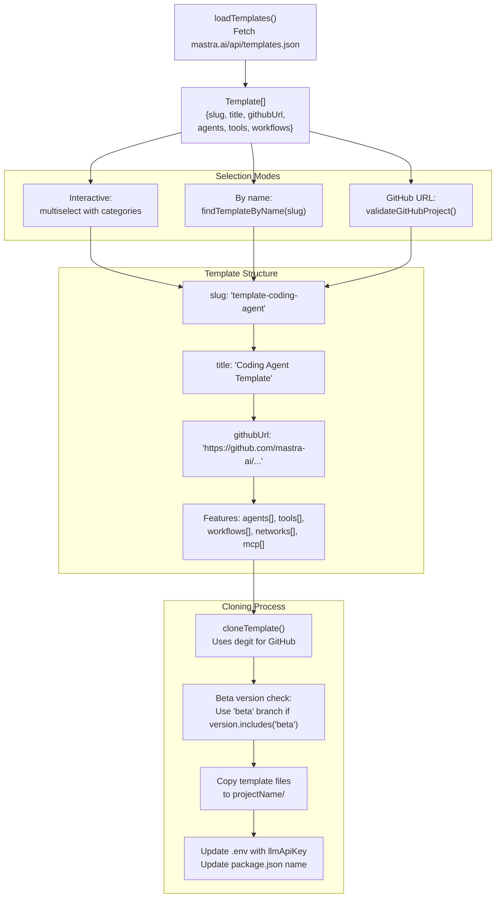

Mastra maintains a public template registry at `https://mastra.ai/api/templates.json` containing 88+ templates. Templates include metadata about their features (agents, tools, workflows) for display in the interactive selector.

Sources: [packages/cli/src/utils/template-utils.ts](), [packages/cli/src/utils/clone-template.ts](), [packages/cli/src/commands/create/create.ts:232-404]()

---

## Skills and MCP Integration

**Skills Installation for Agents**

The CLI supports installing Mastra knowledge as skills for 40+ AI coding agents:

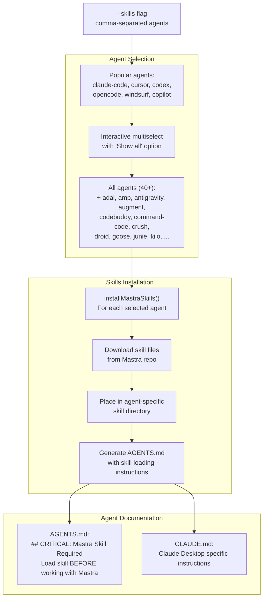

The skills system generates `AGENTS.md` and optionally `CLAUDE.md` files in the project root with instructions for agents to load Mastra knowledge before working with the codebase.

Sources: [packages/cli/src/commands/init/utils.ts:677-931](), [packages/cli/src/commands/init/utils.ts:956-1170]()

**MCP Server Installation**

MCP (Model Context Protocol) server configuration supports multiple editors:

| Editor        | Config Location                                               | Scope   |
| ------------- | ------------------------------------------------------------- | ------- |
| cursor        | `.mcp/cursor.json`                                            | Project |
| cursor-global | `~/Library/Application Support/Cursor/User/mcp_settings.json` | Global  |
| windsurf      | `~/.codeium/windsurf/mcp_settings.json`                       | Global  |
| vscode        | `.vscode/mcp.json`                                            | Project |
| antigravity   | `~/.antigravity/mcp.json`                                     | Global  |

The MCP server provides Mastra documentation as context to editors through the Model Context Protocol.

Sources: [packages/cli/src/commands/init/mcp-docs-server-install.ts]()

---

## Analytics and Telemetry

**PosthogAnalytics Integration**

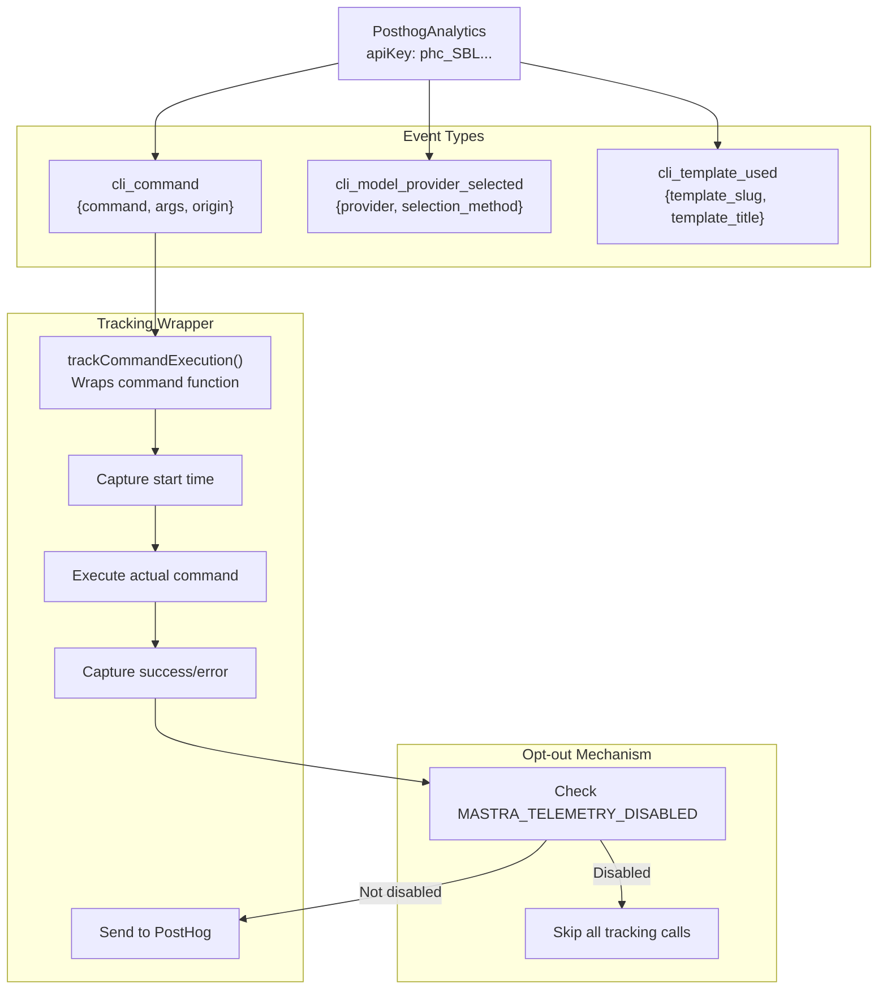

Analytics tracks:

1. **Command execution**: Which commands are run with what arguments
2. **Model provider selection**: Which LLM providers users choose (OpenAI, Anthropic, etc.)
3. **Template usage**: Which templates are used for project creation

Users can opt out by setting `MASTRA_TELEMETRY_DISABLED=true` in their environment.

Sources: [packages/cli/src/analytics/index.ts](), [packages/cli/src/index.ts:25-31]()

---

## Peer Dependency Management

**Version Mismatch Detection**

The CLI checks for peer dependency version mismatches across Mastra packages:

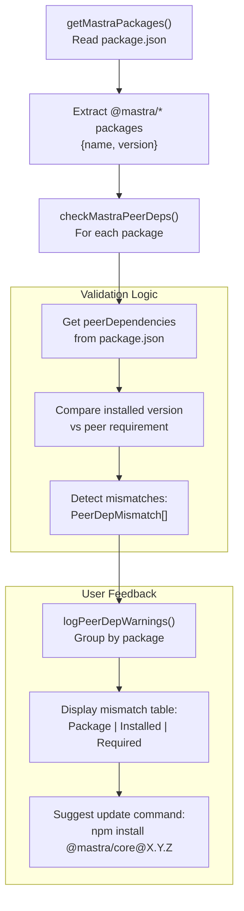

This check runs during `dev` and `build` commands, warning users about version conflicts that could cause runtime errors.

Sources: [packages/cli/src/utils/check-peer-deps.ts](), [packages/cli/src/utils/mastra-packages.ts]()

---

## Request Context Presets

**Preset Loading and Validation**

The dev server supports loading request context presets for testing multi-tenant scenarios:

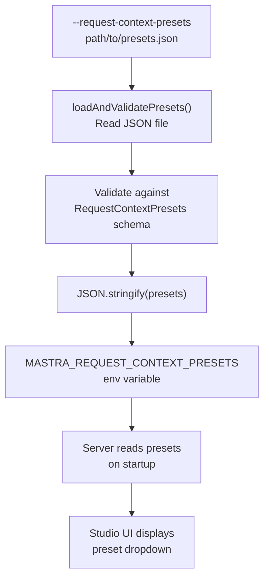

Presets allow developers to test their application with different configurations (e.g., different API keys, model selections, or custom parameters) without code changes.

Sources: [packages/cli/src/utils/validate-presets.ts](), [packages/cli/src/commands/dev/dev.ts:389-398]()
