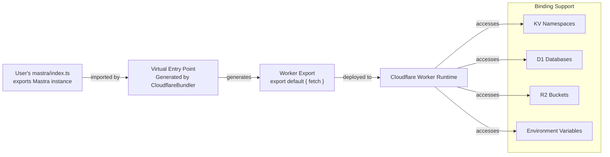
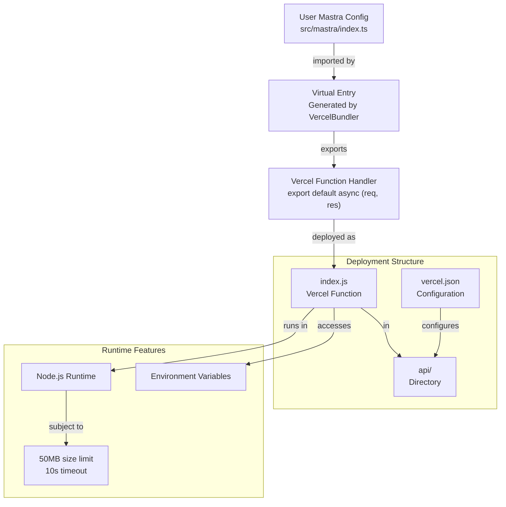
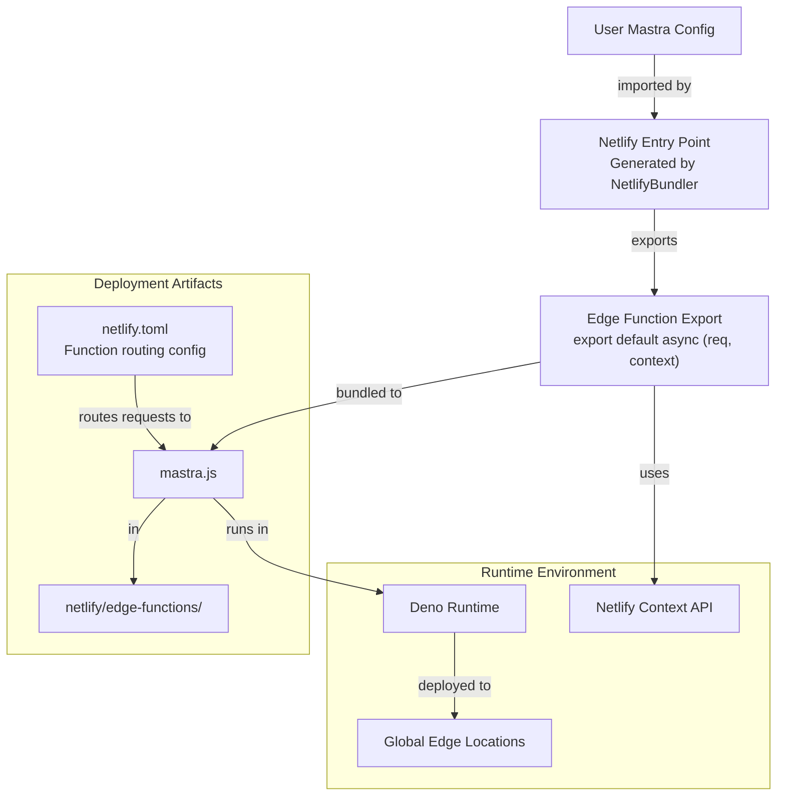
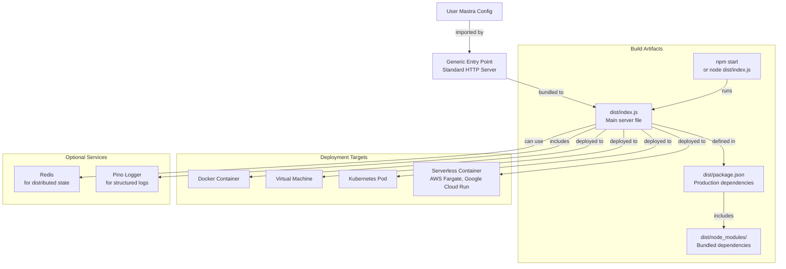
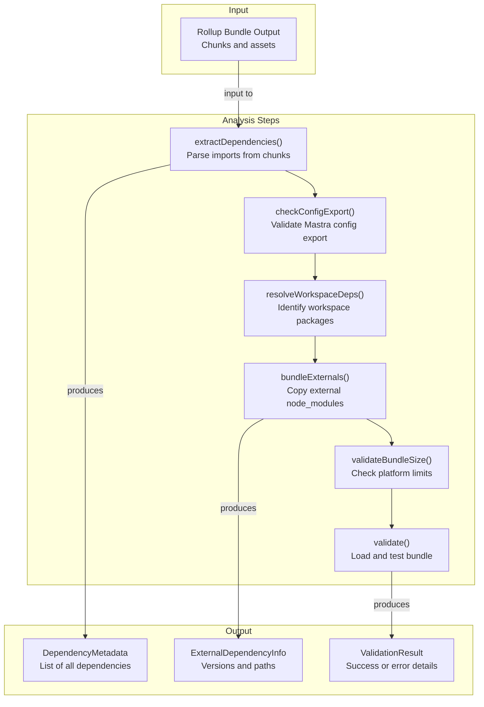
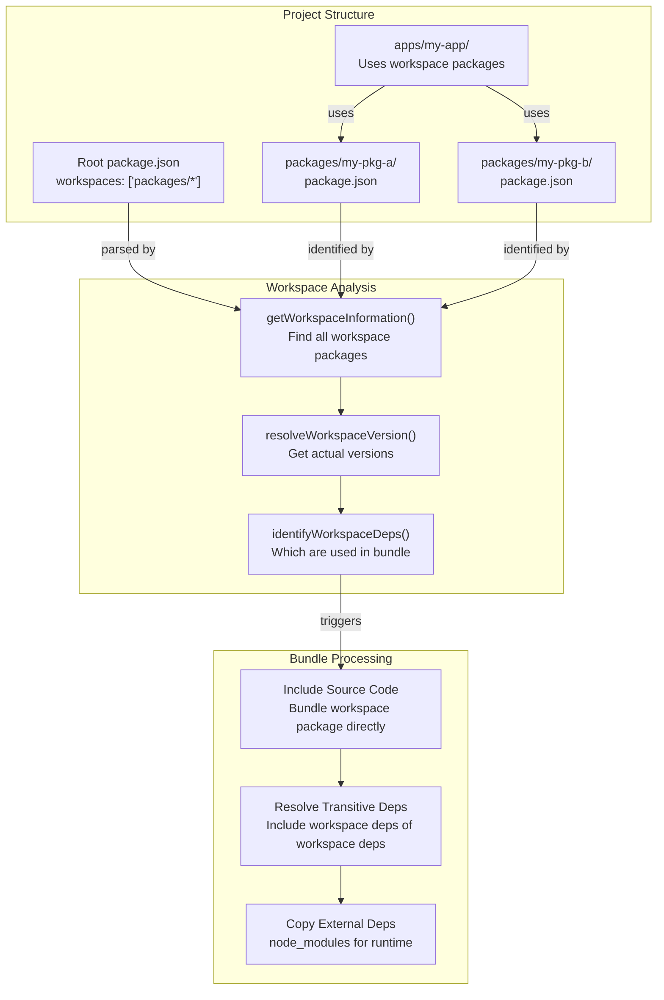
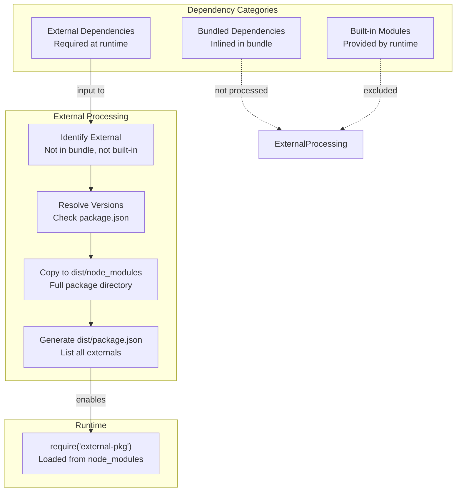

# Platform Deployers

<details>
<summary>Relevant source files</summary>

The following files were used as context for generating this wiki page:

- [deployers/cloudflare/src/index.ts](deployers/cloudflare/src/index.ts)
- [deployers/netlify/src/index.ts](deployers/netlify/src/index.ts)
- [deployers/vercel/src/index.ts](deployers/vercel/src/index.ts)
- [docs/src/content/en/docs/deployment/studio.mdx](docs/src/content/en/docs/deployment/studio.mdx)
- [e2e-tests/monorepo/monorepo.test.ts](e2e-tests/monorepo/monorepo.test.ts)
- [e2e-tests/monorepo/template/apps/custom/src/mastra/index.ts](e2e-tests/monorepo/template/apps/custom/src/mastra/index.ts)
- [packages/cli/src/commands/build/BuildBundler.ts](packages/cli/src/commands/build/BuildBundler.ts)
- [packages/cli/src/commands/build/build.ts](packages/cli/src/commands/build/build.ts)
- [packages/cli/src/commands/dev/DevBundler.ts](packages/cli/src/commands/dev/DevBundler.ts)
- [packages/cli/src/commands/dev/dev.ts](packages/cli/src/commands/dev/dev.ts)
- [packages/cli/src/commands/studio/studio.test.ts](packages/cli/src/commands/studio/studio.test.ts)
- [packages/cli/src/commands/studio/studio.ts](packages/cli/src/commands/studio/studio.ts)
- [packages/core/src/bundler/index.ts](packages/core/src/bundler/index.ts)
- [packages/deployer/src/build/analyze.ts](packages/deployer/src/build/analyze.ts)
- [packages/deployer/src/build/analyze/**snapshots**/analyzeEntry.test.ts.snap](packages/deployer/src/build/analyze/__snapshots__/analyzeEntry.test.ts.snap)
- [packages/deployer/src/build/analyze/analyzeEntry.test.ts](packages/deployer/src/build/analyze/analyzeEntry.test.ts)
- [packages/deployer/src/build/analyze/analyzeEntry.ts](packages/deployer/src/build/analyze/analyzeEntry.ts)
- [packages/deployer/src/build/analyze/bundleExternals.test.ts](packages/deployer/src/build/analyze/bundleExternals.test.ts)
- [packages/deployer/src/build/analyze/bundleExternals.ts](packages/deployer/src/build/analyze/bundleExternals.ts)
- [packages/deployer/src/build/bundler.ts](packages/deployer/src/build/bundler.ts)
- [packages/deployer/src/build/utils.test.ts](packages/deployer/src/build/utils.test.ts)
- [packages/deployer/src/build/utils.ts](packages/deployer/src/build/utils.ts)
- [packages/deployer/src/build/watcher.test.ts](packages/deployer/src/build/watcher.test.ts)
- [packages/deployer/src/build/watcher.ts](packages/deployer/src/build/watcher.ts)
- [packages/deployer/src/bundler/index.ts](packages/deployer/src/bundler/index.ts)
- [packages/deployer/src/server/**tests**/option-studio-base.test.ts](packages/deployer/src/server/__tests__/option-studio-base.test.ts)
- [packages/deployer/src/server/index.ts](packages/deployer/src/server/index.ts)
- [packages/playground/e2e/tests/auth/infrastructure.spec.ts](packages/playground/e2e/tests/auth/infrastructure.spec.ts)
- [packages/playground/e2e/tests/auth/viewer-role.spec.ts](packages/playground/e2e/tests/auth/viewer-role.spec.ts)
- [packages/playground/index.html](packages/playground/index.html)
- [packages/playground/src/App.tsx](packages/playground/src/App.tsx)
- [packages/playground/src/components/ui/app-sidebar.tsx](packages/playground/src/components/ui/app-sidebar.tsx)

</details>

Platform deployers enable Mastra applications to be deployed to serverless environments including Cloudflare Workers, Vercel Functions, Netlify Edge Functions, and generic cloud platforms. Each deployer handles platform-specific bundling, dependency resolution, entry point generation, and configuration management.

For information about the CLI commands that invoke deployers, see [CLI Command Reference](#8.6). For details on the build system and bundler architecture, see [Build System and Dependency Analysis](#8.3) and [Bundler Architecture and Plugin System](#8.4).

## Deployer Package Structure

The Mastra deployment system consists of a base `@mastra/deployer` package providing shared bundling infrastructure, and four platform-specific deployer packages:

| Package                       | Platform           | Runtime            | Entry Point Generation      |
| ----------------------------- | ------------------ | ------------------ | --------------------------- |
| `@mastra/deployer-cloudflare` | Cloudflare Workers | V8 isolate         | Worker format with bindings |
| `@mastra/deployer-vercel`     | Vercel Functions   | Node.js serverless | Vercel function handler     |
| `@mastra/deployer-netlify`    | Netlify Edge       | Deno runtime       | Netlify function handler    |
| `@mastra/deployer-cloud`      | Generic cloud      | Node.js/Docker     | Standard HTTP server        |

Sources: [deployers/cloudflare/package.json:1-90](), [deployers/vercel/package.json:1-66](), [deployers/netlify/package.json:1-67](), [deployers/cloud/package.json:1-162](), [packages/deployer/package.json:1-162]()

## Deployer System Architecture

```mermaid
graph TB
    subgraph "CLI Layer"
        BuildCmd["mastra build"]
        DevCmd["mastra dev"]
    end

    subgraph "Base Deployer Package"
        Bundler["Bundler (abstract)<br/>packages/deployer/src/bundler/index.ts"]
        AnalyzeBundle["analyzeBundle()<br/>packages/deployer/src/build/analyze.ts"]
        CreateBundler["createBundlerUtil()<br/>packages/deployer/src/build/bundler.ts"]
        DepsService["DepsService<br/>packages/deployer/src/services/deps"]
        FileService["FileService<br/>packages/deployer/src/services/fs"]
        WorkspaceInfo["getWorkspaceInformation()<br/>packages/deployer/src/bundler/workspaceDependencies"]
    end

    subgraph "Platform Deployers"
        CloudflareDep["CloudflareBundler<br/>deployers/cloudflare/src/index.ts"]
        VercelDep["VercelBundler<br/>deployers/vercel/src/index.ts"]
        NetlifyDep["NetlifyBundler<br/>deployers/netlify/src/index.ts"]
        CloudDep["CloudBundler<br/>deployers/cloud"]
    end

    subgraph "Build Artifacts"
        DistIndex["dist/index.js"]
        DistPackageJson["dist/package.json"]
        NodeModules["dist/node_modules/"]
        PlatformConfig["Platform-specific config<br/>wrangler.toml, vercel.json, netlify.toml"]
    end

    BuildCmd -->|invokes| Bundler
    DevCmd -->|uses| DevBundler["DevBundler<br/>packages/cli/src/commands/dev/DevBundler.ts"]

    Bundler -->|extended by| CloudflareDep
    Bundler -->|extended by| VercelDep
    Bundler -->|extended by| NetlifyDep
    Bundler -->|extended by| CloudDep

    Bundler -->|uses| AnalyzeBundle
    Bundler -->|uses| CreateBundler
    Bundler -->|uses| DepsService
    Bundler -->|uses| FileService
    Bundler -->|uses| WorkspaceInfo

    AnalyzeBundle -->|validates| BundleOutput["Bundle Output"]
    CreateBundler -->|produces| BundleOutput

    CloudflareDep -->|generates| DistIndex
    CloudflareDep -->|generates| DistPackageJson
    CloudflareDep -->|generates| NodeModules
    CloudflareDep -->|generates| PlatformConfig

    VercelDep -->|generates| DistIndex
    NetlifyDep -->|generates| DistIndex
    CloudDep -->|generates| DistIndex
```



Sources: [packages/deployer/src/bundler/index.ts:1-509](), [packages/deployer/src/build/analyze.ts:1-513](), [packages/deployer/src/build/bundler.ts:1-193](), [deployers/cloudflare/src/index.ts:1-280](), [packages/cli/src/commands/dev/DevBundler.ts:1-169]()

## Base Bundler Class

The abstract `Bundler` class in `@mastra/deployer` provides shared bundling functionality:

```typescript
abstract class Bundler extends MastraBundler {
  abstract getPlatform(): BundlerPlatform
  abstract generateVirtualEntry(options: VirtualEntryGenerationOptions): string
  abstract getVirtualEntryOptions(
    options: Record<string, any>
  ): Record<string, any>
  abstract handleCustomDependencies(
    deps: Map<string, ExternalDependencyInfo>,
    metadata: DependencyMetadata
  ): Promise<void>
}
```

**Key Responsibilities:**

- **Bundle creation**: Orchestrates Rollup bundling with platform-specific plugins
- **Dependency analysis**: Resolves workspace dependencies and external packages
- **Entry point generation**: Creates platform-specific entry points via virtual entries
- **Validation**: Ensures bundle size limits and correct exports

**Platform-specific methods:**

- `getPlatform()`: Returns `'cloudflare' | 'vercel' | 'netlify' | 'generic'`
- `generateVirtualEntry()`: Creates the entry point code for the platform
- `handleCustomDependencies()`: Manages platform-specific dependency handling (e.g., Cloudflare bindings)

Sources: [packages/deployer/src/bundler/index.ts:28-509](), [packages/deployer/src/build/types.ts:1-100]()

## Cloudflare Workers Deployer

The Cloudflare deployer generates Worker-compatible bundles with support for bindings (KV, D1, R2, etc.).

### Cloudflare Entry Point Generation

The deployer creates a virtual entry point that:

1. Imports the user's Mastra configuration
2. Wraps it in a Cloudflare Worker export
3. Handles request routing and response formatting



Sources: [deployers/cloudflare/src/index.ts:1-280]()

### Cloudflare Bundle Optimization

Cloudflare Workers have a 3MB compressed size limit. The deployer applies aggressive optimizations:

**Tree Shaking and Dead Code Elimination:**

- Rollup removes unused exports from dependencies
- Virtual entry points only import required exports from Mastra configuration

**TypeScript Stubbing:**

- TypeScript types are stubbed out during bundling to reduce size
- Type definitions remain for development but are excluded from production bundle

**Code Splitting:**

- Dynamic imports are converted to static imports for Cloudflare's module system
- Large dependencies are analyzed and can be excluded if they exceed size limits

Sources: [deployers/cloudflare/src/index.ts:100-200](), [packages/deployer/src/build/analyze.ts:1-513]()

### Cloudflare Secrets Manager

The Cloudflare deployer provides a secrets management utility:

```typescript
// deployers/cloudflare/secrets-manager
import { SecretsManager } from '@mastra/deployer-cloudflare/secrets-manager'

const secretsManager = new SecretsManager({
  projectName: 'my-mastra-app',
  accountId: process.env.CLOUDFLARE_ACCOUNT_ID,
})

await secretsManager.uploadSecrets({
  OPENAI_API_KEY: process.env.OPENAI_API_KEY,
  DATABASE_URL: process.env.DATABASE_URL,
})
```

Sources: [deployers/cloudflare/package.json:23-31]()

## Vercel Functions Deployer

The Vercel deployer generates serverless functions compatible with Vercel's Node.js runtime.

### Vercel Entry Point Structure



Sources: [deployers/vercel/src/index.ts:1-200](), [deployers/vercel/package.json:1-66]()

### Vercel Bundle Characteristics

**Size Management:**

- 50MB uncompressed limit (less restrictive than Cloudflare)
- Can include larger Node.js dependencies
- No special TypeScript stubbing required

**Entry Point Format:**

```typescript
// Generated entry point structure
import { mastra } from './path/to/user/config'

export default async (req: Request, res: Response) => {
  // Mastra request handling
  const response = await mastra.handleRequest(req)
  return res.status(response.status).send(response.body)
}
```

Sources: [deployers/vercel/package.json:34-36]()

## Netlify Edge Functions Deployer

The Netlify deployer targets Netlify Edge Functions running on Deno.

### Netlify Entry Point and Configuration



Sources: [deployers/netlify/src/index.ts:1-200](), [deployers/netlify/package.json:1-67]()

### Netlify-Specific Considerations

**Deno Compatibility:**

- Bundle must be Deno-compatible (no Node.js-specific APIs unless polyfilled)
- Import specifiers must be explicit (no auto-resolution of `.js` extensions)

**Edge Function Limits:**

- 20MB bundle size limit
- 50ms CPU time limit per request
- Optimized for fast cold starts

**Configuration Generation:**
The deployer generates `netlify.toml` with function declarations:

```toml
[[edge_functions]]
function = "mastra"
path = "/*"
```

Sources: [deployers/netlify/package.json:34-36]()

## Generic Cloud Deployer

The cloud deployer produces standard Node.js server bundles for self-hosted or containerized deployments.

### Cloud Deployer Output Structure



Sources: [deployers/cloud/package.json:1-162]()

### Cloud Deployer Features

**Standard Node.js Output:**

- No platform-specific constraints
- Full Node.js API surface available
- Standard `package.json` with production dependencies

**Optional Integrations:**

- **Redis**: For distributed workflow state management
- **Pino**: Structured JSON logging
- **Process management**: PM2, systemd, or container orchestrators

**Deployment Commands:**

```bash
# Build for generic cloud
npx mastra build --platform cloud

# Deploy artifacts in dist/ directory
cd dist
npm install --production
npm start
```

Sources: [deployers/cloud/package.json:44-70]()

## Bundler Plugin System

The base deployer uses a Rollup plugin pipeline for code transformation:

```mermaid
graph LR
    subgraph "Input Processing"
        UserCode["User Code<br/>src/mastra/"]
        WorkspacePkgs["Workspace Packages<br/>@mastra/*"]
    end

    subgraph "Plugin Pipeline"
        VirtualPlugin["@rollup/plugin-virtual<br/>Virtual entry generation"]
        AliasPlugin["@rollup/plugin-alias<br/>Path resolution"]
        TsConfigPlugin["tsconfig-paths<br/>TypeScript paths"]
        ResolvePlugin["@rollup/plugin-node-resolve<br/>Node module resolution"]
        CommonJSPlugin["@rollup/plugin-commonjs<br/>CJS to ESM conversion"]
        ESBuildPlugin["rollup-plugin-esbuild<br/>TypeScript compilation"]
        JsonPlugin["@rollup/plugin-json<br/>JSON imports"]
        LodashPlugin["@optimize-lodash/rollup-plugin<br/>Lodash tree-shaking"]
    end

    subgraph "Output"
        BundleChunk["dist/index.js<br/>Bundled code"]
        SourceMap["dist/index.js.map<br/>Source maps"]
    end

    UserCode -->|processed by| VirtualPlugin
    WorkspacePkgs -->|processed by| VirtualPlugin

    VirtualPlugin --> AliasPlugin
    AliasPlugin --> TsConfigPlugin
    TsConfigPlugin --> ResolvePlugin
    ResolvePlugin --> CommonJSPlugin
    CommonJSPlugin --> ESBuildPlugin
    ESBuildPlugin --> JsonPlugin
    JsonPlugin --> LodashPlugin

    LodashPlugin -->|outputs| BundleChunk
    LodashPlugin -->|outputs| SourceMap
```



**Plugin Order Significance:**

1. **Virtual**: Must run first to inject generated entry point
2. **Alias & tsconfig-paths**: Resolve path mappings before node resolution
3. **Node resolve**: Locate dependencies in node_modules
4. **CommonJS**: Convert CJS modules to ESM for bundling
5. **ESBuild**: Fast TypeScript/JSX compilation
6. **JSON**: Enable JSON imports
7. **Lodash optimizer**: Remove unused Lodash methods (can save 50KB+)

Sources: [packages/deployer/src/build/bundler.ts:1-193](), [packages/deployer/package.json:96-121]()

## Dependency Analysis and Validation

The `analyzeBundle` function validates bundles and extracts dependency metadata:

### Analysis Pipeline



Sources: [packages/deployer/src/build/analyze.ts:200-513]()

### Dependency Extraction

The analyzer parses bundle chunks to identify:

**Import Statement Patterns:**

```typescript
// Static imports
import { Mastra } from '@mastra/core'
import { OpenAI } from 'openai'

// Dynamic imports
const module = await import('heavy-dependency')

// Require statements (in CJS chunks)
const fs = require('fs-extra')
```

**Built-in Module Handling:**
Node.js built-in modules (`fs`, `path`, `crypto`, etc.) are identified and excluded from bundling since they're provided by the runtime.

**Workspace Package Resolution:**
Workspace packages (e.g., `@mastra/core`, `@mastra/pg`) are identified by checking if their resolved paths are within the monorepo. These are bundled directly rather than treated as external dependencies.

Sources: [packages/deployer/src/build/analyze.ts:100-300]()

### Configuration Export Validation

The analyzer uses Babel to parse the bundle and verify the Mastra configuration export:

**Valid Export Patterns:**

```typescript
// Named export
export const mastra = new Mastra({ ... });

// Default export
export default new Mastra({ ... });

// Deferred initialization
export const mastra = await initializeMastra();
```

**Validation Errors:**

- Missing Mastra export
- Multiple conflicting exports
- Invalid export types (not a Mastra instance)

The validation uses a custom Babel plugin to traverse the AST and check export declarations:

Sources: [packages/deployer/src/build/babel/check-config-export.ts:1-100]()

### Bundle Size Validation

Each platform has different size limits:

| Platform           | Limit             | Notes                                          |
| ------------------ | ----------------- | ---------------------------------------------- |
| Cloudflare Workers | 3MB compressed    | Strict limit, requires aggressive optimization |
| Netlify Edge       | 20MB              | More lenient, Deno runtime                     |
| Vercel Functions   | 50MB uncompressed | Most flexible                                  |
| Generic Cloud      | No hard limit     | Infrastructure-dependent                       |

The analyzer calculates compressed size using gzip compression and fails the build if limits are exceeded.

Sources: [packages/deployer/src/build/analyze.ts:400-450]()

## Workspace Package Resolution

Monorepo support is critical for deploying Mastra applications that use workspace packages.

### Workspace Detection and Resolution



**Key Functions:**

`getWorkspaceInformation()`: Discovers all workspace packages by:

1. Reading root `package.json` workspaces field
2. Globbing workspace directories
3. Parsing each workspace's `package.json`
4. Building dependency graph

`resolveWorkspaceVersion()`: Determines actual version to use:

- Checks for `workspace:*` protocol
- Falls back to version range specified
- Resolves symlinks to get actual package

Sources: [packages/deployer/src/bundler/workspaceDependencies.ts:1-300]()

### Workspace Build Fix (Recent)

A recent fix addressed workspace package bundling issues:

**Problem**: Bundles were missing workspace packages with hyphenated names and failing to compile TypeScript sources in workspace symlinks.

**Solution**:

1. Updated path matching to handle hyphenated package names
2. Added TypeScript compilation for workspace package sources
3. Ensured transitive workspace dependencies are included when entry point is virtual

Sources: [packages/deployer/CHANGELOG.md:7-13]()

## External Dependency Handling

Dependencies not part of the workspace must be copied to `dist/node_modules/` for runtime:

### External Bundling Process



**Copy Strategy:**

- Entire package directory copied (not just used files)
- Preserves package structure for sub-path imports
- Includes transitive dependencies

**Package.json Generation:**

```json
{
  "dependencies": {
    "openai": "^4.20.0",
    "zod": "^3.25.76",
    "pg": "^8.11.0"
  }
}
```

Sources: [packages/deployer/src/build/analyze/bundleExternals.ts:1-200]()

## Build Command Integration

The CLI's `mastra build` command orchestrates the deployment process:

**Command Flow:**

1. Detect or prompt for platform
2. Load user's Mastra configuration
3. Initialize platform-specific bundler
4. Run bundle process
5. Analyze and validate output
6. Copy external dependencies
7. Generate platform configuration files

**Platform Detection:**

```typescript
// Automatic detection from project config
const platform = await detectPlatform(projectRoot);

// Or explicit via flag
npx mastra build --platform cloudflare
```

Sources: [packages/cli/src/commands/dev/dev.ts:1-240]()

## Development Mode Bundler

The `DevBundler` provides fast incremental builds during development:

### Dev vs Production Bundling

| Feature      | DevBundler            | Production Bundler            |
| ------------ | --------------------- | ----------------------------- |
| Speed        | Fast incremental      | Slower, thorough optimization |
| Source maps  | Inline, detailed      | External or omitted           |
| Tree shaking | Minimal               | Aggressive                    |
| Minification | Disabled              | Enabled                       |
| Validation   | Lightweight           | Full validation               |
| Watch mode   | File watching enabled | Single build                  |

**Key Optimization:**
The DevBundler caches unchanged modules and only rebuilds modified files, providing sub-second rebuild times during development.

Sources: [packages/cli/src/commands/dev/DevBundler.ts:1-169]()

## Platform Entry Point Examples

### Cloudflare Worker Entry Point

Generated virtual entry point structure:

```typescript
// Virtual entry generated by CloudflareBundler.generateVirtualEntry()
import { mastra } from './src/mastra/index'

export default {
  async fetch(request: Request, env: Env, ctx: ExecutionContext) {
    // Bind environment variables to Mastra config
    const configuredMastra = mastra.withEnv(env)

    // Handle request
    const response = await configuredMastra.handleRequest(request)
    return response
  },
}
```

**Binding Support:**
Environment variables, KV namespaces, D1 databases, R2 buckets, and Durable Objects are passed via the `env` parameter and made available to the Mastra instance.

Sources: [deployers/cloudflare/src/index.ts:150-250]()

### Vercel Function Entry Point

```typescript
// Virtual entry for Vercel
import { mastra } from './src/mastra/index'

export default async function handler(req: VercelRequest, res: VercelResponse) {
  try {
    const response = await mastra.handleRequest(req)
    res.status(response.status).json(response.body)
  } catch (error) {
    res.status(500).json({ error: error.message })
  }
}
```

Sources: [deployers/vercel/src/index.ts:100-150]()

### Netlify Edge Function Entry Point

```typescript
// Virtual entry for Netlify
import { mastra } from './src/mastra/index'

export default async (request: Request, context: Context) => {
  const response = await mastra.handleRequest(request)
  return new Response(response.body, {
    status: response.status,
    headers: response.headers,
  })
}

export const config = {
  path: '/*',
}
```

Sources: [deployers/netlify/src/index.ts:100-150]()

### Generic Cloud Entry Point

```typescript
// Virtual entry for generic cloud
import { createServer } from 'http'
import { mastra } from './src/mastra/index'

const port = process.env.PORT || 3000

const server = createServer(async (req, res) => {
  const response = await mastra.handleRequest(req)
  res.writeHead(response.status, response.headers)
  res.end(response.body)
})

server.listen(port, () => {
  console.log(`Mastra server listening on port ${port}`)
})
```

Sources: [deployers/cloud/package.json:1-162]()
