# Project Creation and Initialization

<details>
<summary>Relevant source files</summary>

The following files were used as context for generating this wiki page:

- [docs/src/content/en/reference/cli/create-mastra.mdx](docs/src/content/en/reference/cli/create-mastra.mdx)
- [packages/cli/src/commands/actions/create-project.ts](packages/cli/src/commands/actions/create-project.ts)
- [packages/cli/src/commands/actions/init-project.ts](packages/cli/src/commands/actions/init-project.ts)
- [packages/cli/src/commands/create/bun-detection.test.ts](packages/cli/src/commands/create/bun-detection.test.ts)
- [packages/cli/src/commands/create/create.test.ts](packages/cli/src/commands/create/create.test.ts)
- [packages/cli/src/commands/create/create.ts](packages/cli/src/commands/create/create.ts)
- [packages/cli/src/commands/create/utils.ts](packages/cli/src/commands/create/utils.ts)
- [packages/cli/src/commands/dev/DevBundler.test.ts](packages/cli/src/commands/dev/DevBundler.test.ts)
- [packages/cli/src/commands/init/init.test.ts](packages/cli/src/commands/init/init.test.ts)
- [packages/cli/src/commands/init/init.ts](packages/cli/src/commands/init/init.ts)
- [packages/cli/src/commands/init/utils.ts](packages/cli/src/commands/init/utils.ts)
- [packages/cli/src/commands/utils.test.ts](packages/cli/src/commands/utils.test.ts)
- [packages/cli/src/commands/utils.ts](packages/cli/src/commands/utils.ts)
- [packages/cli/src/index.ts](packages/cli/src/index.ts)
- [packages/cli/src/services/service.deps.ts](packages/cli/src/services/service.deps.ts)
- [packages/cli/src/utils/clone-template.test.ts](packages/cli/src/utils/clone-template.test.ts)
- [packages/cli/src/utils/clone-template.ts](packages/cli/src/utils/clone-template.ts)
- [packages/cli/src/utils/template-utils.test.ts](packages/cli/src/utils/template-utils.test.ts)
- [packages/cli/src/utils/template-utils.ts](packages/cli/src/utils/template-utils.ts)
- [packages/cli/tsconfig.json](packages/cli/tsconfig.json)
- [packages/create-mastra/src/index.ts](packages/create-mastra/src/index.ts)
- [packages/create-mastra/src/utils.ts](packages/create-mastra/src/utils.ts)
- [packages/create-mastra/tsconfig.json](packages/create-mastra/tsconfig.json)

</details>

This document covers the Mastra project scaffolding system, including the `create-mastra` command for creating new projects and the `mastra init` command for adding Mastra to existing projects. These commands handle directory structure setup, dependency installation, configuration file generation, and optional integrations with AI coding agents.

For information about the development server and hot-reload system after initialization, see [Development Server and Hot Reload](#8.2). For deployment configuration, see [Platform Deployers](#8.5).

---

## System Architecture

The project creation and initialization system consists of two primary entry points that share common scaffolding logic:

**Diagram: Project Creation and Initialization Architecture**

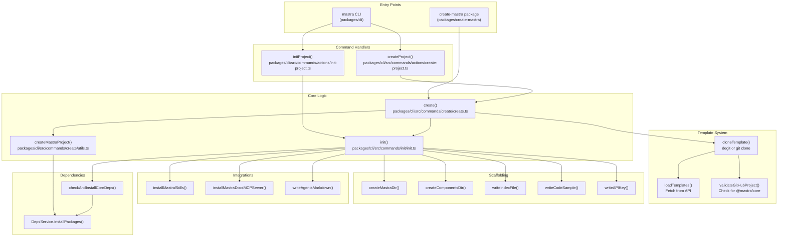

Sources: [packages/cli/src/index.ts:1-191](), [packages/create-mastra/src/index.ts:1-91](), [packages/cli/src/commands/create/create.ts:1-423](), [packages/cli/src/commands/init/init.ts:1-199]()

---

## create-mastra Command

The `create-mastra` package provides a standalone executable for creating new Mastra projects. It wraps the CLI's `create` command with version detection.

### Entry Point and Version Management

The entry point resolves the appropriate version tag (e.g., `beta` or `latest`) to ensure dependency consistency:

**Diagram: create-mastra Execution Flow**

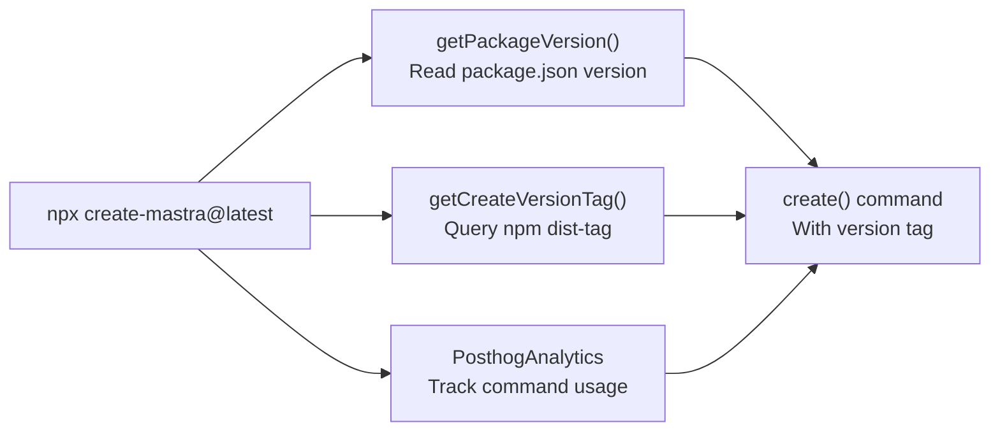

The version detection ensures that when installing `mastra` and `@mastra/core`, the CLI uses matching versions (e.g., both from `beta` tag or both from `latest`).

Sources: [packages/create-mastra/src/index.ts:1-91](), [packages/create-mastra/src/utils.ts:1-31]()

### CLI Flags

| Flag                         | Type    | Description                                                      |
| ---------------------------- | ------- | ---------------------------------------------------------------- |
| `--project-name`             | string  | Project name for package.json and directory                      |
| `--default`                  | boolean | Quick start with defaults (src/, OpenAI, examples)               |
| `--components`               | string  | Comma-separated: agents, tools, workflows, scorers               |
| `--llm`                      | string  | Provider: openai, anthropic, groq, google, cerebras, mistral     |
| `--llm-api-key`              | string  | API key for the model provider                                   |
| `--example` / `--no-example` | boolean | Include/exclude example code                                     |
| `--template`                 | string  | Template name, GitHub URL, or blank for selection                |
| `--timeout`                  | number  | Package installation timeout (default: 60000 ms)                 |
| `--dir`                      | string  | Target directory for Mastra files (default: src/)                |
| `--mcp`                      | string  | MCP server: cursor, cursor-global, windsurf, vscode, antigravity |
| `--skills`                   | string  | Comma-separated agent names for skills installation              |

Sources: [packages/create-mastra/src/index.ts:34-88](), [packages/cli/src/index.ts:50-79]()

---

## mastra init Command

The `mastra init` command adds Mastra to an existing project by creating the directory structure, configuration files, and optionally example code.

### Prerequisites Validation

Before initialization, the CLI validates project prerequisites:

**Diagram: Init Prerequisites Check**

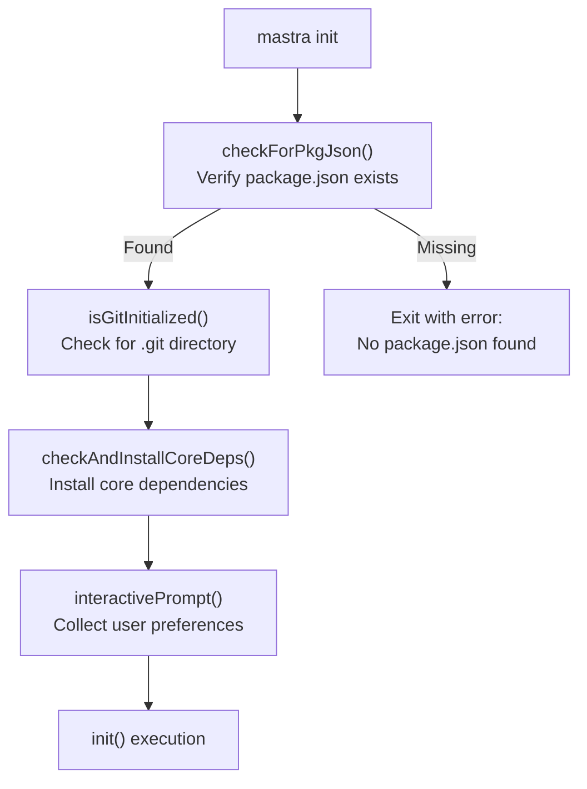

The `checkForPkgJson()` function prevents initialization in directories without a `package.json`, prompting users to run `npm init -y` or use `create-mastra` instead.

Sources: [packages/cli/src/commands/init/utils.ts:936-951](), [packages/cli/src/commands/actions/init-project.ts:1-74]()

### Interactive Prompt Flow

When no CLI flags are provided, the `interactivePrompt()` function guides users through configuration:

**Diagram: Interactive Prompt Decision Tree**

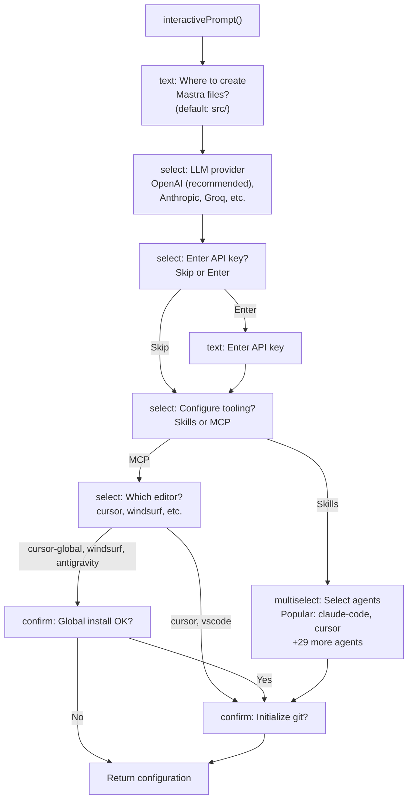

The prompt supports 40+ AI coding agents for skills installation, with popular options (claude-code, cursor, windsurf) shown first and an option to reveal all agents.

Sources: [packages/cli/src/commands/init/utils.ts:677-931](), [packages/cli/src/commands/init/init.ts:24-198]()

### Directory Structure Creation

The `init()` function creates the following structure:

```
src/mastra/               # or custom directory via --dir
├── index.ts              # Mastra instance configuration
├── agents/               # if 'agents' component selected
│   └── weather-agent.ts  # example agent (if --example)
├── workflows/            # if 'workflows' component selected
│   └── weather-workflow.ts
├── tools/                # if 'tools' component selected
│   └── weather-tool.ts
└── scorers/              # if 'scorers' component selected
    └── weather-scorer.ts
```

**Code Execution Flow:**

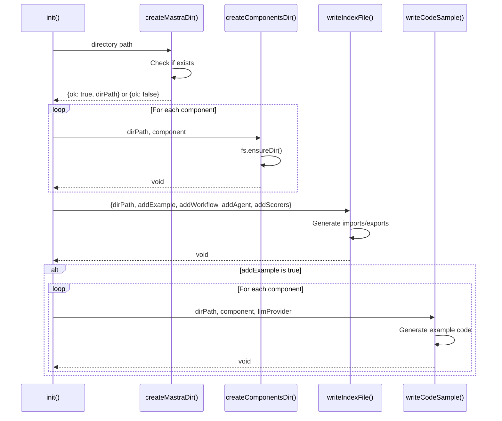

Sources: [packages/cli/src/commands/init/init.ts:24-198](), [packages/cli/src/commands/init/utils.ts:623-653]()

### Generated Configuration File

The `writeIndexFile()` function generates `src/mastra/index.ts` with different content based on the `addExample` flag:

**Minimal Configuration (no examples):**

```typescript
import { Mastra } from '@mastra/core/mastra'

export const mastra = new Mastra()
```

**Full Configuration (with examples):**

```typescript
import { Mastra } from '@mastra/core/mastra'
import { PinoLogger } from '@mastra/loggers'
import { LibSQLStore } from '@mastra/libsql'
import {
  Observability,
  DefaultExporter,
  CloudExporter,
  SensitiveDataFilter,
} from '@mastra/observability'
import { weatherWorkflow } from './workflows/weather-workflow'
import { weatherAgent } from './agents/weather-agent'
import {
  toolCallAppropriatenessScorer,
  completenessScorer,
  translationScorer,
} from './scorers/weather-scorer'

export const mastra = new Mastra({
  workflows: { weatherWorkflow },
  agents: { weatherAgent },
  scorers: {
    toolCallAppropriatenessScorer,
    completenessScorer,
    translationScorer,
  },
  storage: new LibSQLStore({
    id: 'mastra-storage',
    url: 'file:./mastra.db',
  }),
  logger: new PinoLogger({ name: 'Mastra', level: 'info' }),
  observability: new Observability({
    configs: {
      default: {
        serviceName: 'mastra',
        exporters: [new DefaultExporter(), new CloudExporter()],
        spanOutputProcessors: [new SensitiveDataFilter()],
      },
    },
  }),
})
```

Sources: [packages/cli/src/commands/init/utils.ts:458-534]()

### Environment Variable Management

The `writeAPIKey()` function writes the API key to `.env` or `.env.example`:

**Diagram: Environment File Selection**

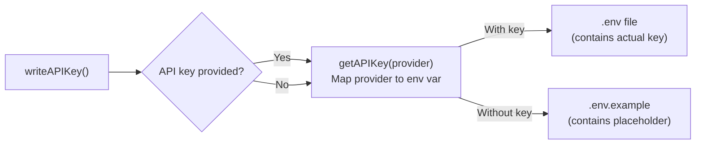

Provider-to-environment variable mapping:

| Provider    | Environment Variable           |
| ----------- | ------------------------------ |
| `openai`    | `OPENAI_API_KEY`               |
| `anthropic` | `ANTHROPIC_API_KEY`            |
| `groq`      | `GROQ_API_KEY`                 |
| `google`    | `GOOGLE_GENERATIVE_AI_API_KEY` |
| `cerebras`  | `CEREBRAS_API_KEY`             |
| `mistral`   | `MISTRAL_API_KEY`              |

If the user skips API key entry, `.env.example` is created with a placeholder, allowing immediate project execution without needing to delete an invalid `.env` file.

Sources: [packages/cli/src/commands/init/utils.ts:589-622]()

---

## mastra create Command

The `mastra create` command creates a complete standalone project with directory, `package.json`, dependencies, and Mastra scaffolding.

### Project Creation Flow

**Diagram: Complete Project Creation Sequence**

```mermaid
sequenceDiagram
    participant User
    participant Create as create()
    participant CreateProject as createMastraProject()
    participant Init as init()
    participant DepsService

    User->>Create: mastra create [name]

    alt template flag provided
        Create->>Create: createFromTemplate()
        Note over Create: Skip standard flow
    else standard flow
        Create->>CreateProject: projectName, options

        CreateProject->>CreateProject: Prompt for project name if missing
        CreateProject->>CreateProject: mkdir(projectName)
        CreateProject->>CreateProject: cd projectName

        CreateProject->>DepsService: initializePackageJson()
        DepsService->>DepsService: npm init -y
        DepsService->>DepsService: Set type: "module"
        DepsService->>DepsService: Set engines.node: ">=22.13.0"
        DepsService-->>CreateProject: package.json created

        CreateProject->>DepsService: Add scripts (dev, build, start)
        CreateProject->>DepsService: Install zod, typescript, @types/node
        CreateProject->>DepsService: Install mastra (dev)
        CreateProject->>DepsService: Install @mastra/core, @mastra/libsql, @mastra/memory
        CreateProject->>CreateProject: Create .gitignore
        CreateProject->>CreateProject: Write README.md
        CreateProject-->>Create: projectName, result

        Create->>Init: Run init in new project
        Init-->>Create: success

        Create->>User: Display completion message
    end
```

Sources: [packages/cli/src/commands/create/utils.ts:156-343](), [packages/cli/src/commands/create/create.ts:21-138]()

### Package Manager Detection

The system detects the package manager from environment variables:

**Diagram: Package Manager Detection Logic**

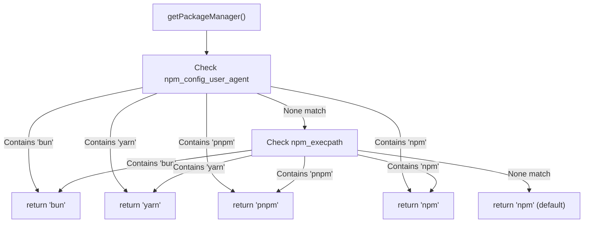

The CLI uses the detected package manager for all subsequent `install` and `add` commands, supporting npm, pnpm, yarn, and bun.

Sources: [packages/cli/src/commands/utils.ts:9-42]()

### Dependency Installation with Fallback

The `installMastraDependency()` function implements version fallback:

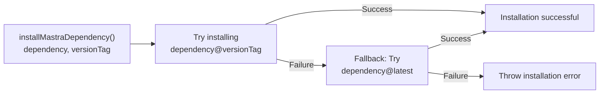

This ensures that if a specific version tag (e.g., `@beta`) fails, the CLI falls back to `@latest` before failing completely.

Sources: [packages/cli/src/commands/create/utils.ts:121-154]()

### Error Handling and Cleanup

The `createMastraProject()` function includes comprehensive error handling:

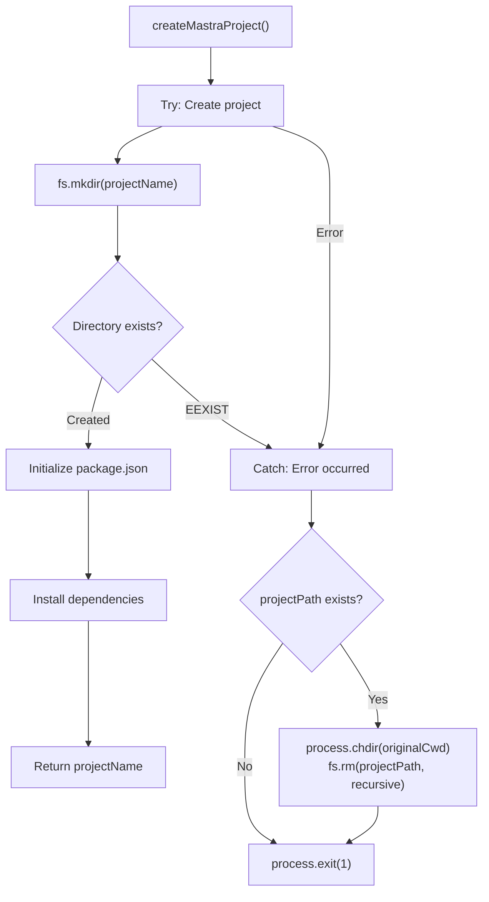

The cleanup process changes back to the original directory before removing the failed project directory, preventing issues with the current working directory being deleted.

Sources: [packages/cli/src/commands/create/utils.ts:210-342]()

---

## Template System

The template system allows projects to be created from pre-built examples or any valid GitHub repository.

### Template Loading and Selection

**Diagram: Template Resolution Flow**

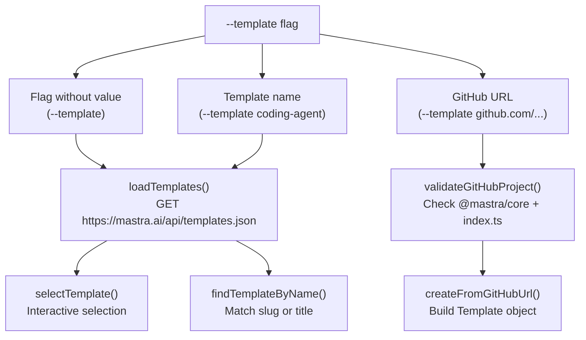

Sources: [packages/cli/src/commands/create/create.ts:250-297](), [packages/cli/src/utils/template-utils.ts:1-93]()

### Template Structure

Templates are defined by the following TypeScript interface:

```typescript
interface Template {
  githubUrl: string // e.g., "https://github.com/mastra-ai/template-coding-agent"
  title: string // e.g., "Coding Agent"
  slug: string // e.g., "template-coding-agent"
  agents: string[] // List of agent IDs in template
  mcp: string[] // MCP server names
  tools: string[] // Tool names
  networks: string[] // Agent network names
  workflows: string[] // Workflow names
}
```

The API at `https://mastra.ai/api/templates.json` returns an array of templates, which are displayed with component counts in the selection prompt.

Sources: [packages/cli/src/utils/template-utils.ts:3-12](), [packages/cli/src/utils/template-utils.ts:34-70]()

### GitHub Repository Validation

Before cloning a GitHub URL as a template, the CLI validates it's a valid Mastra project:

**Validation Criteria:**

1. **package.json exists** with `@mastra/core` in dependencies, devDependencies, or peerDependencies
2. **src/mastra/index.ts exists** and exports a Mastra instance

**Diagram: GitHub Validation Process**

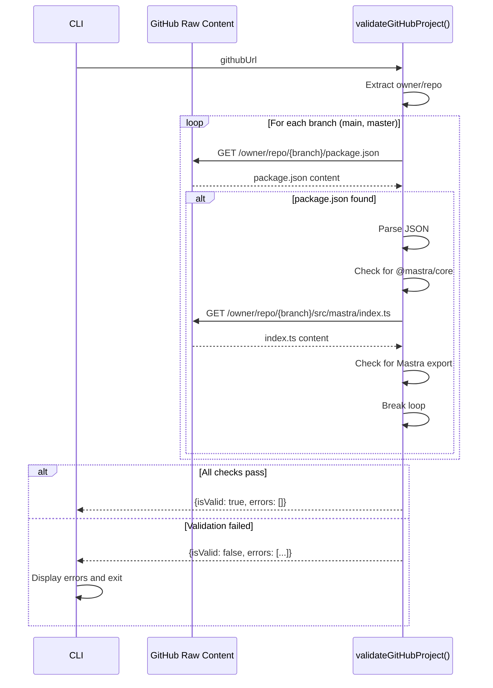

Sources: [packages/cli/src/commands/create/create.ts:149-229]()

### Template Cloning

The `cloneTemplate()` function uses `degit` (preferred) or `git clone` (fallback):

**Diagram: Template Clone Strategy**

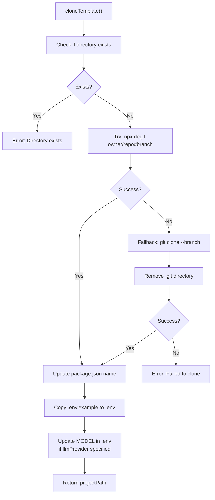

The `degit` tool is faster than `git clone` because it downloads only the latest files without git history. The `.git` directory is removed from git clones to prepare for fresh git initialization.

Sources: [packages/cli/src/utils/clone-template.ts:25-181]()

---

## Skills and MCP Integration

The CLI can install "skills" (context files for AI coding agents) and MCP servers during initialization.

### Skills Installation

Skills are markdown files that provide AI coding agents with knowledge about Mastra's API and patterns:

**Diagram: Skills Installation Flow**

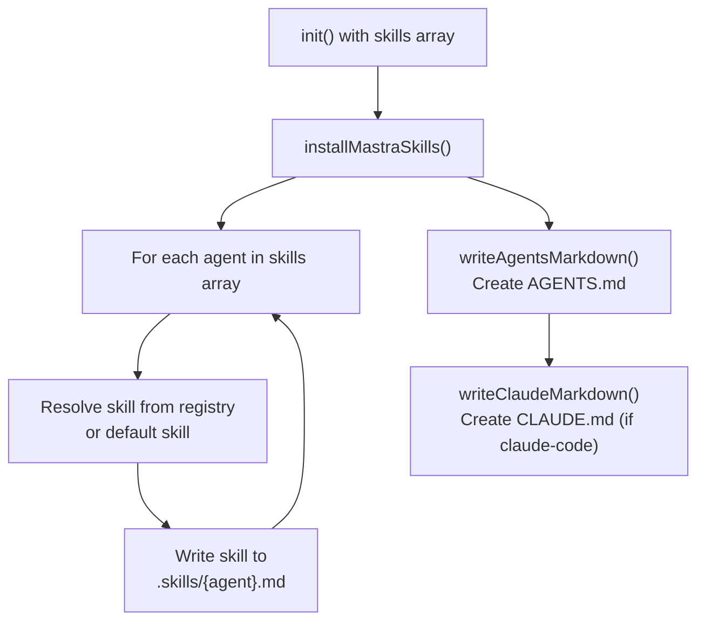

The `--skills` flag accepts a comma-separated list of agent names (e.g., `--skills claude-code,cursor,windsurf`). The CLI writes agent-specific skill files and creates guidance documents.

Sources: [packages/cli/src/commands/init/init.ts:110-168](), [packages/cli/src/commands/init/utils.ts:722-821]()

### MCP Server Installation

MCP (Model Context Protocol) servers provide external tools to AI coding agents. The CLI can install the Mastra docs MCP server:

**Editor-Specific Configuration Paths:**

| Editor          | Config Path                      | Scope                 |
| --------------- | -------------------------------- | --------------------- |
| `cursor`        | `.cursor/mcp_config.json`        | Project-local         |
| `cursor-global` | `~/.cursor/mcp_config.json`      | Global (all projects) |
| `windsurf`      | `~/.windsurf/mcp_config.json`    | Global only           |
| `vscode`        | `.vscode/mcp_config.json`        | Project-local         |
| `antigravity`   | `~/.antigravity/mcp_config.json` | Global only           |

**Diagram: MCP Installation Decision Flow**

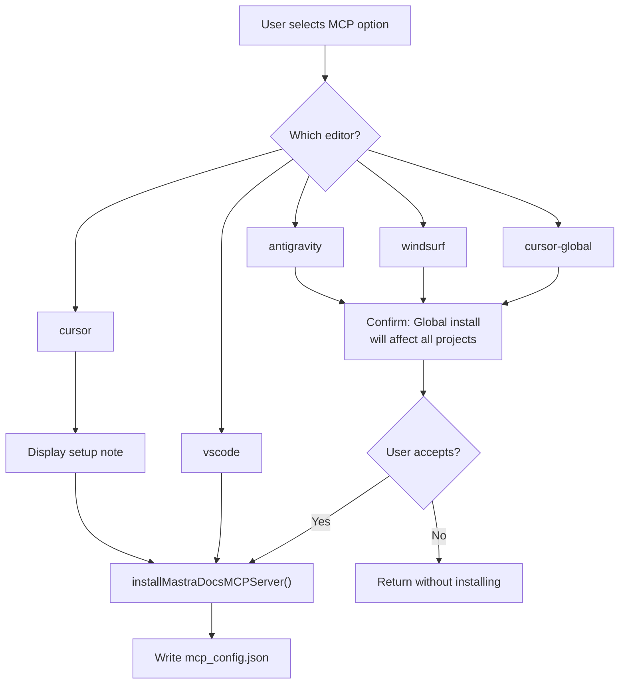

For `cursor` project-local installs, the CLI notes that users must manually enable the MCP server in Cursor Settings → MCP Settings.

Sources: [packages/cli/src/commands/init/utils.ts:824-903]()

---

## Dependency Management

### DepsService Class

The `DepsService` class provides package manager abstraction:

**Class Structure:**

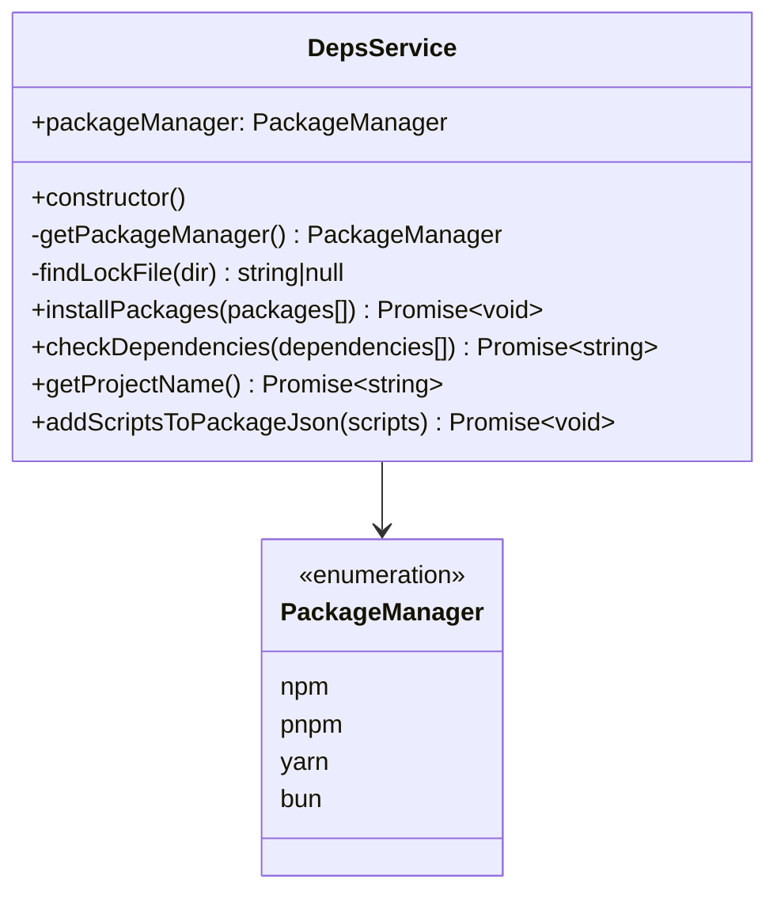

The service detects the package manager by searching for lock files (`pnpm-lock.yaml`, `package-lock.json`, `yarn.lock`, `bun.lock`/`bun.lockb`) starting from the current directory and traversing up the directory tree.

Sources: [packages/cli/src/services/service.deps.ts:8-101]()

### Core Dependencies Installation

The `checkAndInstallCoreDeps()` function installs required packages:

**Dependency Installation Logic:**

```mermaid
graph TB
    Start["checkAndInstallCoreDeps(addExample, versionTag)"]

    CheckCore["checkDependencies(['@mastra/core'])"]
    CheckCLI["checkDependencies(['mastra'])"]
    CheckZod["checkDependencies(['zod'])"]

    CoreMissing{@mastra/core missing?}
    CLIMissing{mastra missing?}
    ZodMissing{zod missing?}

    CheckExample{addExample === true?}
    CheckLibSQL["checkDependencies(['@mastra/libsql'])"]
    LibSQLMissing{@mastra/libsql missing?}

    AddCore["Add @mastra/core@versionTag"]
    AddCLI["Add mastra@versionTag"]
    AddZod["Add zod@^4"]
    AddLibSQL["Add @mastra/libsql@versionTag"]

    Install["installPackages(packages)"]

    Start --> CheckCore
    Start --> CheckCLI
    Start --> CheckZod

    CheckCore --> CoreMissing
    CheckCLI --> CLIMissing
    CheckZod --> ZodMissing

    CoreMissing -->|Yes| AddCore
    CLIMissing -->|Yes| AddCLI
    ZodMissing -->|Yes| AddZod

    CoreMissing -->|No| CheckExample
    CLIMissing -->|No| CheckExample
    ZodMissing -->|No| CheckExample

    CheckExample -->|Yes| CheckLibSQL
    CheckExample -->|No| Install

    CheckLibSQL --> LibSQLMissing
    LibSQLMissing -->|Yes| AddLibSQL
    LibSQLMissing -->|No| Install

    AddCore --> Install
    AddCLI --> Install
    AddZod --> Install
    AddLibSQL --> Install
```

When examples are included, the function also checks for and installs `@mastra/memory`, `@mastra/loggers`, `@mastra/observability`, and `@mastra/evals` (if scorers component selected).

Sources: [packages/cli/src/commands/init/utils.ts:545-587]()

---

## Code Generation

### Example Code Templates

The CLI generates example code for each component type. Here's the mapping:

| Component   | Function                | Generated File                  | Example                                   |
| ----------- | ----------------------- | ------------------------------- | ----------------------------------------- |
| `agents`    | `writeAgentSample()`    | `agents/weather-agent.ts`       | Agent with weather tool integration       |
| `workflows` | `writeWorkflowSample()` | `workflows/weather-workflow.ts` | Multi-step workflow with agent invocation |
| `tools`     | `writeToolSample()`     | `tools/weather-tool.ts`         | External API integration tool             |
| `scorers`   | `writeScorersSample()`  | `scorers/weather-scorer.ts`     | Custom and prebuilt scorers               |

**Agent Code Generation:**

The `writeAgentSample()` function dynamically generates imports and configuration based on selected components:

```typescript
// Conditional imports based on addExampleTool and addScorers
import { Agent } from '@mastra/core/agent';
import { Memory } from '@mastra/memory';
import { weatherTool } from '../tools/weather-tool';  // if addExampleTool
import { scorers } from '../scorers/weather-scorer';   // if addScorers

export const weatherAgent = new Agent({
  id: 'weather-agent',
  name: 'Weather Agent',
  instructions: `...`,
  model: 'openai/gpt-5-mini',  // or provider-specific model
  tools: { weatherTool },       // if addExampleTool
  scorers: { ... },             // if addScorers with sampling config
  memory: new Memory()
});
```

The model identifier is resolved via `getModelIdentifier()` which maps each provider to a recommended model (e.g., `anthropic` → `anthropic/claude-sonnet-4-5`).

Sources: [packages/cli/src/commands/init/utils.ts:62-133](), [packages/cli/src/commands/init/utils.ts:44-60]()

### Workflow Code Generation

The workflow example demonstrates step composition, schema validation, and agent invocation:

```typescript
import { createStep, createWorkflow } from '@mastra/core/workflows'
import { z } from 'zod'

const forecastSchema = z.object({
  date: z.string(),
  maxTemp: z.number(),
  // ... more fields
})

const fetchWeather = createStep({
  id: 'fetch-weather',
  inputSchema: z.object({ city: z.string() }),
  outputSchema: forecastSchema,
  execute: async ({ inputData }) => {
    // Geocoding API call
    // Weather API call
    return forecast
  },
})

const planActivities = createStep({
  id: 'plan-activities',
  inputSchema: forecastSchema,
  outputSchema: z.object({ activities: z.string() }),
  execute: async ({ inputData, mastra }) => {
    const agent = mastra?.getAgent('weatherAgent')
    const response = await agent.stream([{ role: 'user', content: prompt }])
    // Stream processing
    return { activities: activitiesText }
  },
})

const weatherWorkflow = createWorkflow({
  id: 'weather-workflow',
  inputSchema: z.object({ city: z.string() }),
  outputSchema: z.object({ activities: z.string() }),
})
  .then(fetchWeather)
  .then(planActivities)

weatherWorkflow.commit()
```

This example shows accessing the `mastra` instance via step context, agent streaming, and typed input/output schemas.

Sources: [packages/cli/src/commands/init/utils.ts:135-329]()

---

## Version Tag Detection

To ensure version consistency across packages, the CLI detects which npm dist-tag corresponds to the currently running version:

**Diagram: Version Tag Resolution**

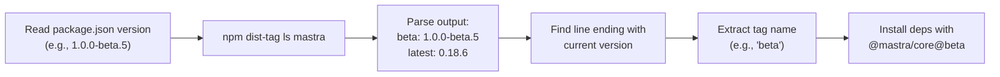

This mechanism prevents version mismatches when a developer installs a beta version of the CLI but dependencies default to `@latest`. The resolved tag is used for all Mastra package installations.

Sources: [packages/cli/src/commands/utils.ts:84-101](), [packages/create-mastra/src/utils.ts:15-30]()

---

## File Structure Reference

**Complete File Mapping:**

```
packages/cli/src/
├── commands/
│   ├── actions/
│   │   ├── create-project.ts       # mastra create command handler
│   │   └── init-project.ts         # mastra init command handler
│   ├── create/
│   │   ├── create.ts               # Core create logic + template support
│   │   └── utils.ts                # createMastraProject() implementation
│   ├── init/
│   │   ├── init.ts                 # Core init logic
│   │   ├── utils.ts                # Scaffolding utilities, interactive prompt
│   │   ├── mcp-docs-server-install.ts  # MCP server installation
│   │   └── skills-install.ts       # Skills installation
│   └── utils.ts                    # Package manager detection, git helpers
├── services/
│   └── service.deps.ts             # DepsService for package management
├── utils/
│   ├── template-utils.ts           # Template loading and selection
│   └── clone-template.ts           # Template cloning with degit/git
└── index.ts                        # CLI entry point (commander setup)

packages/create-mastra/src/
├── index.ts                        # Standalone create-mastra entry point
└── utils.ts                        # Version detection for create-mastra
```

Sources: [packages/cli/src/index.ts:1-191](), [packages/create-mastra/src/index.ts:1-91]()
