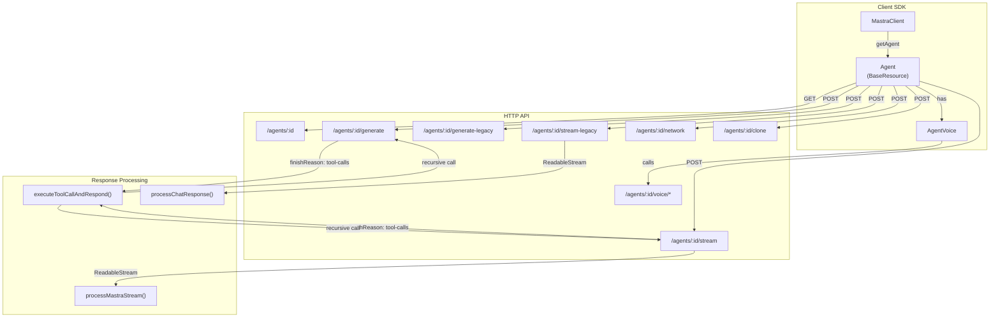
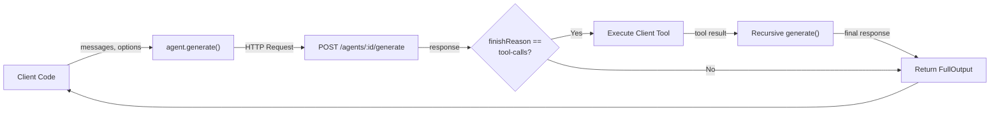
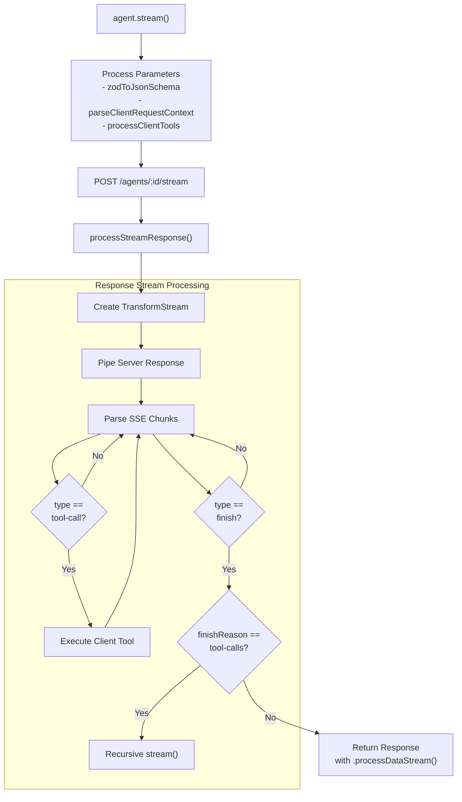
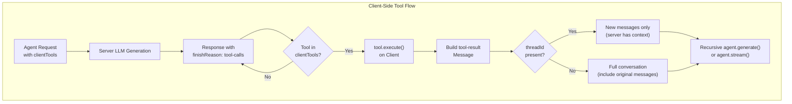
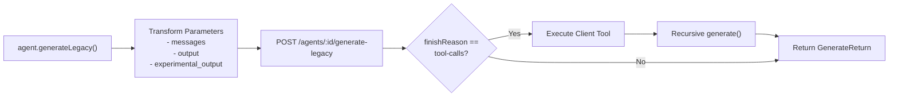
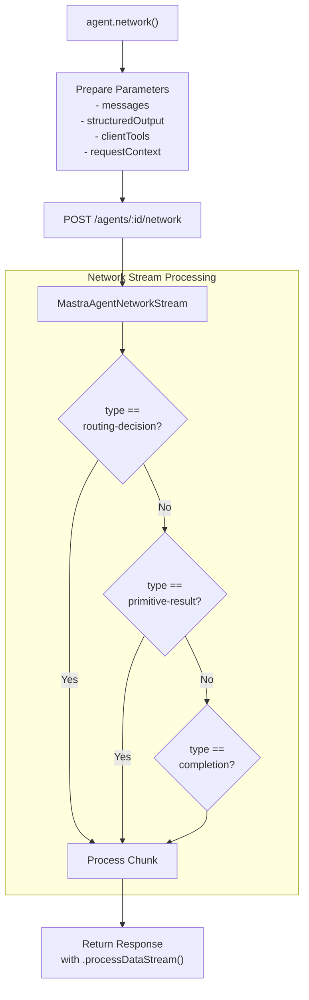
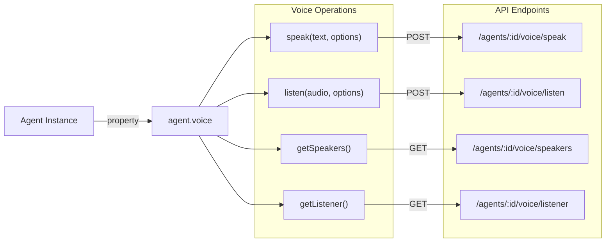
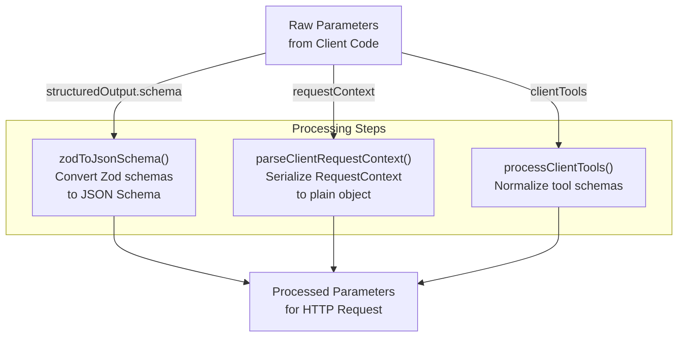

# Agent Client Operations

<details>
<summary>Relevant source files</summary>

The following files were used as context for generating this wiki page:

- [client-sdks/client-js/src/client.ts](client-sdks/client-js/src/client.ts)
- [client-sdks/client-js/src/resources/agent.test.ts](client-sdks/client-js/src/resources/agent.test.ts)
- [client-sdks/client-js/src/resources/agent.ts](client-sdks/client-js/src/resources/agent.ts)
- [client-sdks/client-js/src/resources/agent.vnext.test.ts](client-sdks/client-js/src/resources/agent.vnext.test.ts)
- [client-sdks/client-js/src/resources/index.ts](client-sdks/client-js/src/resources/index.ts)
- [client-sdks/client-js/src/types.ts](client-sdks/client-js/src/types.ts)
- [e2e-tests/create-mastra/create-mastra.test.ts](e2e-tests/create-mastra/create-mastra.test.ts)
- [packages/core/src/agent/**tests**/dynamic-model-fallback.test.ts](packages/core/src/agent/__tests__/dynamic-model-fallback.test.ts)
- [packages/core/src/memory/mock.ts](packages/core/src/memory/mock.ts)
- [packages/core/src/storage/mock.test.ts](packages/core/src/storage/mock.test.ts)
- [packages/core/src/stream/aisdk/v5/transform.test.ts](packages/core/src/stream/aisdk/v5/transform.test.ts)
- [packages/core/src/stream/aisdk/v5/transform.ts](packages/core/src/stream/aisdk/v5/transform.ts)
- [packages/server/src/server/handlers.ts](packages/server/src/server/handlers.ts)
- [packages/server/src/server/handlers/agent.test.ts](packages/server/src/server/handlers/agent.test.ts)
- [packages/server/src/server/handlers/agents.ts](packages/server/src/server/handlers/agents.ts)
- [packages/server/src/server/handlers/memory.test.ts](packages/server/src/server/handlers/memory.test.ts)
- [packages/server/src/server/handlers/memory.ts](packages/server/src/server/handlers/memory.ts)
- [packages/server/src/server/handlers/utils.test.ts](packages/server/src/server/handlers/utils.test.ts)
- [packages/server/src/server/handlers/utils.ts](packages/server/src/server/handlers/utils.ts)
- [packages/server/src/server/handlers/vector.test.ts](packages/server/src/server/handlers/vector.test.ts)
- [packages/server/src/server/schemas/memory.test.ts](packages/server/src/server/schemas/memory.test.ts)
- [packages/server/src/server/schemas/memory.ts](packages/server/src/server/schemas/memory.ts)

</details>

This document describes the client-side operations for interacting with agents through the `@mastra/client-js` SDK. It covers the `Agent` resource class, its methods for generating responses, streaming, client-side tool execution, voice operations, and network collaboration.

For server-side agent implementation and configuration, see [Agent System](#3). For workflow client operations, see [Workflow Client Operations](#10.3).

## Agent Resource Class

The `Agent` class provides the client-side interface for interacting with agents deployed on a Mastra server. It extends `BaseResource` and handles HTTP communication, tool execution, and response processing.



**Agent Class Instantiation**

Clients obtain `Agent` instances through the `MastraClient`:

[client-sdks/client-js/src/client.ts:150-153]()

Sources: [client-sdks/client-js/src/resources/agent.ts:186-195](), [client-sdks/client-js/src/client.ts:150-153]()

## Core Generation Methods

The `Agent` class provides two primary patterns for generating responses: synchronous generation and streaming.

### Generate API (vNext)

The `generate()` method provides synchronous response generation with support for structured output:



**Method Signatures**

[client-sdks/client-js/src/resources/agent.ts:321-331]()

**Key Features:**

- **Structured Output**: Pass `structuredOutput` with a Zod schema or JSON Schema to get validated, typed responses
- **Client Tools**: Tools executed on the client side via the `clientTools` parameter
- **Memory Management**: Supports `memory` parameter with `resource` and `thread` for conversation persistence
- **Request Context**: Per-request configuration via `requestContext` parameter

**Parameter Processing:**

The method performs several transformations before sending the request:

1. **Schema Conversion**: Zod schemas in `structuredOutput` are converted to JSON Schema via `zodToJsonSchema()`
2. **Request Context Serialization**: `RequestContext` objects are converted to plain objects
3. **Client Tool Processing**: Tool schemas are normalized for transmission

[client-sdks/client-js/src/resources/agent.ts:333-360]()

Sources: [client-sdks/client-js/src/resources/agent.ts:321-374](), [client-sdks/client-js/src/types.ts:156-169]()

### Stream API (vNext)

The `stream()` method provides real-time streaming of agent responses:



**Stream Response Processing**

The stream method returns a `Response` object with an enhanced `processDataStream()` method:

[client-sdks/client-js/src/resources/agent.ts:826-849]()

**Server-Sent Events Format:**

Streams use SSE format with `data:` prefixed JSON chunks:

```
data: {"type":"step-start","payload":{"messageId":"m1"}}

data: {"type":"text-delta","payload":{"text":"Hello"}}

data: {"type":"finish","payload":{"reason":"stop"}}

data: [DONE]
```

[client-sdks/client-js/src/utils/process-mastra-stream.ts:23-46]()

Sources: [client-sdks/client-js/src/resources/agent.ts:826-1133](), [client-sdks/client-js/src/utils/process-mastra-stream.ts:1-77]()

## Client Tool Execution

Client tools are tools whose execution logic runs on the client side rather than the server. This pattern is useful for tools that need access to client-side resources or should not be exposed to the server.



**Tool Execution Logic**

The `executeToolCallAndRespond()` function orchestrates client-side tool execution:

[client-sdks/client-js/src/resources/agent.ts:43-115]()

**Key Behaviors:**

1. **Tool Detection**: Checks if the tool name exists in the `clientTools` parameter
2. **Execution Context**: Provides context including `requestContext`, `messages`, `toolCallId`, `threadId`, `resourceId`
3. **Message Construction**: Builds a proper tool-result message with the execution output
4. **Stateful vs Stateless**:
   - **With threadId**: Only sends new messages (server memory maintains context)
   - **Without threadId**: Sends full conversation history to prevent "amnesia"

[client-sdks/client-js/src/resources/agent.ts:89-109]()

**Recursive Call Prevention**

The recursive call mechanism ensures that after a client tool executes, the agent can continue its reasoning with the tool result. This pattern enables multi-turn tool usage within a single logical request.

Sources: [client-sdks/client-js/src/resources/agent.ts:43-115](), [client-sdks/client-js/src/resources/agent.ts:362-374](), [.changeset/green-monkeys-grin.md:1-6]()

## Legacy API Methods

The legacy API provides backward compatibility with an earlier method signature pattern.

### generateLegacy()



**Method Signature:**

[client-sdks/client-js/src/resources/agent.ts:234-246]()

**Differences from vNext API:**

| Feature            | Legacy                                    | vNext                          |
| ------------------ | ----------------------------------------- | ------------------------------ |
| Messages Parameter | Combined with options in single object    | Separate first parameter       |
| Output Schema      | `output` or `experimental_output` keys    | `structuredOutput.schema`      |
| Memory             | Separate `threadId` and `resourceId` keys | `memory: { thread, resource }` |
| Endpoint           | `/generate-legacy`                        | `/generate`                    |

Sources: [client-sdks/client-js/src/resources/agent.ts:234-319](), [client-sdks/client-js/src/types.ts:136-154]()

### streamLegacy()

The legacy streaming API returns a `Response` object with a `processDataStream()` method that provides AI SDK-compatible callbacks:

[client-sdks/client-js/src/resources/agent.ts:726-765]()

**Callback Interface:**

The `processDataStream()` method accepts callbacks for various stream events:

- `onTextPart`: Text delta chunks
- `onToolCallPart`: Tool invocation chunks
- `onToolResultPart`: Tool result chunks
- `onFinishMessagePart`: Final message completion
- `onErrorPart`: Error handling

[client-sdks/client-js/src/resources/agent.ts:474-716]()

Sources: [client-sdks/client-js/src/resources/agent.ts:726-765](), [client-sdks/client-js/src/resources/agent.ts:376-719]()

## Network Operations

The `network()` method enables multi-agent collaboration where a routing agent delegates tasks to other agents, workflows, or tools.



**Network Stream Events:**

| Event Type         | Payload                                                 | Description                                     |
| ------------------ | ------------------------------------------------------- | ----------------------------------------------- |
| `routing-decision` | `{primitiveId, primitiveType, prompt, selectionReason}` | Routing agent decides which primitive to invoke |
| `primitive-result` | `{primitiveId, result, metadata}`                       | Result from executed primitive                  |
| `completion`       | `{finalResult, steps}`                                  | Network execution completed                     |

[client-sdks/client-js/src/resources/agent.ts:1135-1195]()

Sources: [client-sdks/client-js/src/resources/agent.ts:1135-1195](), [client-sdks/client-js/src/types.ts:91-94]()

## Voice Operations

The `AgentVoice` class provides voice input/output capabilities for agents.



**Text-to-Speech:**

[client-sdks/client-js/src/resources/agent.ts:132-141]()

**Speech-to-Text:**

[client-sdks/client-js/src/resources/agent.ts:149-161]()

**Speaker Management:**

Get available voice options for the agent's TTS provider:

[client-sdks/client-js/src/resources/agent.ts:169-173]()

Sources: [client-sdks/client-js/src/resources/agent.ts:117-184]()

## Helper Methods

### details()

Retrieves agent metadata including model configuration, tools, workflows, and memory settings:

[client-sdks/client-js/src/resources/agent.ts:202-204]()

**Response Type:**

[client-sdks/client-js/src/types.ts:96-134]()

### clone()

Creates a stored agent copy from a code-defined agent:

[client-sdks/client-js/src/resources/agent.ts:218-227]()

**Parameters:**

| Parameter        | Type                       | Description                                          |
| ---------------- | -------------------------- | ---------------------------------------------------- |
| `newId`          | `string?`                  | ID for cloned agent (derived from name if omitted)   |
| `newName`        | `string?`                  | Name for cloned agent (defaults to "{name} (Clone)") |
| `metadata`       | `Record<string, unknown>?` | Additional metadata                                  |
| `authorId`       | `string?`                  | Author identifier                                    |
| `requestContext` | `RequestContext?`          | Context for resolving dynamic configuration          |

### enhanceInstructions()

Uses LLM to improve agent instructions based on feedback:

[client-sdks/client-js/src/resources/agent.ts:206-211]()

Sources: [client-sdks/client-js/src/resources/agent.ts:198-227](), [client-sdks/client-js/src/types.ts:869-882]()

## Parameter Processing Pipeline

All agent methods process parameters through a consistent pipeline before transmission:



**Schema Conversion:**

[client-sdks/client-js/src/utils/zod-to-json-schema.ts]() handles Zod to JSON Schema conversion.

**Request Context Serialization:**

[client-sdks/client-js/src/utils/index.ts]() provides `parseClientRequestContext()` to convert `RequestContext` instances to plain objects for JSON serialization.

**Client Tool Processing:**

[client-sdks/client-js/src/utils/process-client-tools.ts]() normalizes tool definitions by converting Zod schemas to JSON Schema format.

Sources: [client-sdks/client-js/src/resources/agent.ts:333-348](), [client-sdks/client-js/src/utils/process-client-tools.ts](), [client-sdks/client-js/src/utils/index.ts]()

## Error Handling

The `Agent` class inherits error handling from `BaseResource`, which implements retry logic with exponential backoff.

**Retry Configuration:**

[client-sdks/client-js/src/types.ts:51-70]()

**Error Processing:**

All errors are processed through `getErrorFromUnknown()` to provide consistent error objects:

[client-sdks/client-js/src/resources/agent.ts:14]()

Sources: [client-sdks/client-js/src/resources/base.ts](), [client-sdks/client-js/src/types.ts:51-70]()
