# Client SDK and UI Components

<details>
<summary>Relevant source files</summary>

The following files were used as context for generating this wiki page:

- [.changeset/pre.json](.changeset/pre.json)
- [client-sdks/client-js/CHANGELOG.md](client-sdks/client-js/CHANGELOG.md)
- [client-sdks/client-js/package.json](client-sdks/client-js/package.json)
- [client-sdks/client-js/src/client.ts](client-sdks/client-js/src/client.ts)
- [client-sdks/client-js/src/resources/agent.test.ts](client-sdks/client-js/src/resources/agent.test.ts)
- [client-sdks/client-js/src/resources/agent.ts](client-sdks/client-js/src/resources/agent.ts)
- [client-sdks/client-js/src/resources/agent.vnext.test.ts](client-sdks/client-js/src/resources/agent.vnext.test.ts)
- [client-sdks/client-js/src/resources/index.ts](client-sdks/client-js/src/resources/index.ts)
- [client-sdks/client-js/src/types.ts](client-sdks/client-js/src/types.ts)
- [client-sdks/react/package.json](client-sdks/react/package.json)
- [deployers/cloudflare/CHANGELOG.md](deployers/cloudflare/CHANGELOG.md)
- [deployers/cloudflare/package.json](deployers/cloudflare/package.json)
- [deployers/netlify/CHANGELOG.md](deployers/netlify/CHANGELOG.md)
- [deployers/netlify/package.json](deployers/netlify/package.json)
- [deployers/vercel/CHANGELOG.md](deployers/vercel/CHANGELOG.md)
- [deployers/vercel/package.json](deployers/vercel/package.json)
- [e2e-tests/create-mastra/create-mastra.test.ts](e2e-tests/create-mastra/create-mastra.test.ts)
- [examples/dane/CHANGELOG.md](examples/dane/CHANGELOG.md)
- [examples/dane/package.json](examples/dane/package.json)
- [package.json](package.json)
- [packages/cli/CHANGELOG.md](packages/cli/CHANGELOG.md)
- [packages/cli/package.json](packages/cli/package.json)
- [packages/core/CHANGELOG.md](packages/core/CHANGELOG.md)
- [packages/core/package.json](packages/core/package.json)
- [packages/core/src/agent/**tests**/dynamic-model-fallback.test.ts](packages/core/src/agent/__tests__/dynamic-model-fallback.test.ts)
- [packages/core/src/memory/mock.ts](packages/core/src/memory/mock.ts)
- [packages/core/src/storage/mock.test.ts](packages/core/src/storage/mock.test.ts)
- [packages/core/src/stream/aisdk/v5/transform.test.ts](packages/core/src/stream/aisdk/v5/transform.test.ts)
- [packages/core/src/stream/aisdk/v5/transform.ts](packages/core/src/stream/aisdk/v5/transform.ts)
- [packages/create-mastra/CHANGELOG.md](packages/create-mastra/CHANGELOG.md)
- [packages/create-mastra/package.json](packages/create-mastra/package.json)
- [packages/deployer/CHANGELOG.md](packages/deployer/CHANGELOG.md)
- [packages/deployer/package.json](packages/deployer/package.json)
- [packages/mcp-docs-server/CHANGELOG.md](packages/mcp-docs-server/CHANGELOG.md)
- [packages/mcp-docs-server/package.json](packages/mcp-docs-server/package.json)
- [packages/mcp/CHANGELOG.md](packages/mcp/CHANGELOG.md)
- [packages/mcp/package.json](packages/mcp/package.json)
- [packages/playground-ui/CHANGELOG.md](packages/playground-ui/CHANGELOG.md)
- [packages/playground-ui/package.json](packages/playground-ui/package.json)
- [packages/playground/CHANGELOG.md](packages/playground/CHANGELOG.md)
- [packages/playground/package.json](packages/playground/package.json)
- [packages/server/CHANGELOG.md](packages/server/CHANGELOG.md)
- [packages/server/package.json](packages/server/package.json)
- [packages/server/src/server/handlers.ts](packages/server/src/server/handlers.ts)
- [packages/server/src/server/handlers/agent.test.ts](packages/server/src/server/handlers/agent.test.ts)
- [packages/server/src/server/handlers/agents.ts](packages/server/src/server/handlers/agents.ts)
- [packages/server/src/server/handlers/memory.test.ts](packages/server/src/server/handlers/memory.test.ts)
- [packages/server/src/server/handlers/memory.ts](packages/server/src/server/handlers/memory.ts)
- [packages/server/src/server/handlers/utils.test.ts](packages/server/src/server/handlers/utils.test.ts)
- [packages/server/src/server/handlers/utils.ts](packages/server/src/server/handlers/utils.ts)
- [packages/server/src/server/handlers/vector.test.ts](packages/server/src/server/handlers/vector.test.ts)
- [packages/server/src/server/schemas/memory.test.ts](packages/server/src/server/schemas/memory.test.ts)
- [packages/server/src/server/schemas/memory.ts](packages/server/src/server/schemas/memory.ts)
- [pnpm-lock.yaml](pnpm-lock.yaml)

</details>

This document covers the client-side libraries and user interfaces for consuming Mastra APIs. For server-side API implementation details, see [Server and API Layer](#9). For authentication and authorization patterns, see [Authentication and Authorization](#9.6).

## Overview

Mastra provides three main client-side packages:

- **@mastra/client-js**: Core TypeScript client SDK with resource-based API access
- **@mastra/react**: React hooks and context providers for React applications
- **@mastra/playground-ui**: Pre-built UI components and full Studio interface

All client packages communicate with the Mastra server via HTTP, using Server-Sent Events (SSE) for streaming responses and standard REST for CRUD operations.

**Sources**: [client-sdks/client-js/package.json:1-72](), [client-sdks/react/package.json:1-95](), [packages/playground-ui/package.json:1-191]()

## Client SDK Architecture

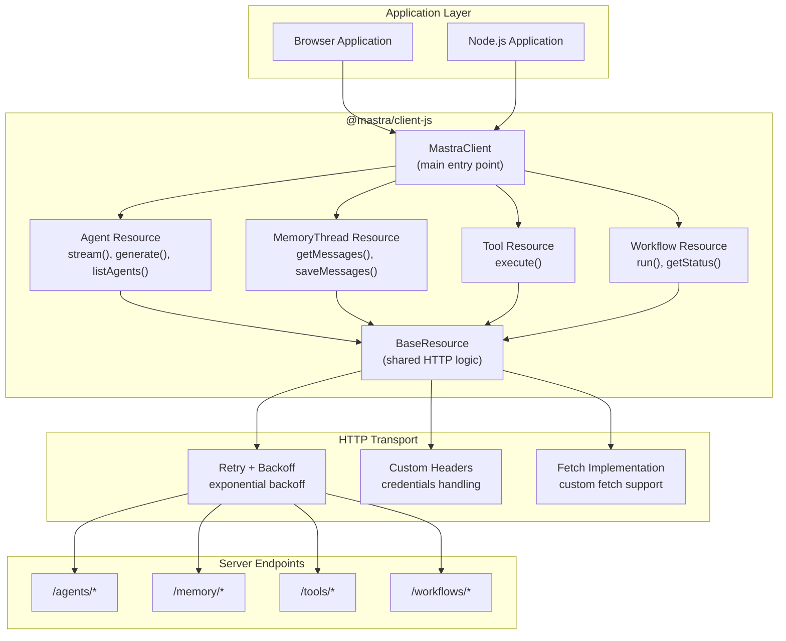

**Sources**: [client-sdks/client-js/src/client.ts:1-200](), [client-sdks/client-js/src/types.ts:52-71]()

### MastraClient Initialization

The `MastraClient` class is the main entry point for all API operations. It accepts a `ClientOptions` configuration object:

| Option         | Type                                   | Description                                   |
| -------------- | -------------------------------------- | --------------------------------------------- |
| `baseUrl`      | `string`                               | Base URL for API requests (required)          |
| `apiPrefix`    | `string`                               | API route prefix (default: `/api`)            |
| `retries`      | `number`                               | Number of retry attempts for failed requests  |
| `backoffMs`    | `number`                               | Initial backoff time in milliseconds          |
| `maxBackoffMs` | `number`                               | Maximum backoff time in milliseconds          |
| `headers`      | `Record<string, string>`               | Custom headers to include with requests       |
| `abortSignal`  | `AbortSignal`                          | Abort signal for requests                     |
| `credentials`  | `'omit' \| 'same-origin' \| 'include'` | Credentials mode for requests                 |
| `fetch`        | `typeof fetch`                         | Custom fetch implementation (e.g., for Tauri) |

The client exposes four resource classes as properties:

- `client.agent` - Agent operations
- `client.memoryThread` - Memory and thread operations
- `client.tool` - Tool execution
- `client.workflow` - Workflow execution

**Sources**: [client-sdks/client-js/src/types.ts:52-71](), [client-sdks/client-js/src/client.ts:1-100]()

### BaseResource Pattern

All resource classes inherit from `BaseResource`, which provides:

1. **Exponential backoff retry logic**: Failed requests are retried with exponentially increasing delays
2. **Custom header injection**: Headers from `ClientOptions` are added to all requests
3. **Credentials handling**: Supports `omit`, `same-origin`, and `include` modes
4. **Custom fetch support**: Allows custom fetch implementations for environments like Tauri
5. **Error handling**: Wraps HTTP errors in structured error objects

**Sources**: [client-sdks/client-js/src/client.ts:1-200]()

## Agent Resource

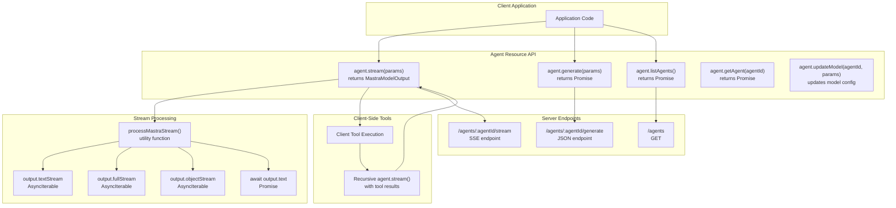

**Sources**: [client-sdks/client-js/src/resources/agent.ts:1-800]()

### Streaming API

The `agent.stream()` method returns a `MastraModelOutput` object with multiple consumption patterns:

```typescript
// Stream params interface
interface StreamParams<OUTPUT = undefined> {
  messages: MessageListInput
  tracingOptions?: TracingOptions
  requestContext?: RequestContext
  clientTools?: ToolsInput
  structuredOutput?: StructuredOutputOptions<OUTPUT>
  // ... other AgentExecutionOptions
}
```

The returned `MastraModelOutput` provides:

1. **`textStream`**: `AsyncIterable<string>` - yields text deltas as they arrive
2. **`fullStream`**: `AsyncIterable<FullOutput>` - yields complete chunks (text, tool calls, finish reason)
3. **`objectStream`**: `AsyncIterable<Partial<T>>` - yields partial structured output objects
4. **`text`**: `Promise<string>` - resolves with complete text when streaming finishes
5. **`object`**: `Promise<T>` - resolves with complete structured output object
6. **`usage`**: `Promise<UsageData>` - resolves with token usage statistics
7. **`finishReason`**: `Promise<string>` - resolves with reason for completion

**Sources**: [client-sdks/client-js/src/types.ts:165-176](), [client-sdks/client-js/src/resources/agent.ts:300-500]()

### Client-Side Tools Pattern

When `clientTools` are provided in `StreamParams`, the client executes them locally and recursively calls `agent.stream()` with results:

1. Server streams a tool call chunk
2. Client identifies it as a client-side tool (not server-side)
3. Client executes the tool function locally
4. Client calls `agent.stream()` again with tool results in messages
5. Server continues generation with tool results

This enables patterns like file access, browser automation, or other local-only operations that cannot run server-side.

**Sources**: [client-sdks/client-js/src/resources/agent.ts:400-600]()

### Generate API (Legacy)

The `agent.generate()` method provides a non-streaming alternative:

```typescript
interface GenerateLegacyParams<T> {
  messages: MessageListInput
  output?: T // Structured output schema
  requestContext?: RequestContext
  clientTools?: ToolsInput
  // ... other AgentGenerateOptions
}
```

Returns a `Promise<GenerateReturn>` with `text`, `object`, `usage`, and `finishReason` properties.

**Sources**: [client-sdks/client-js/src/types.ts:137-146](), [client-sdks/client-js/src/resources/agent.ts:700-800]()

### Agent Management Operations

| Method                                    | Endpoint                                          | Description                                                          |
| ----------------------------------------- | ------------------------------------------------- | -------------------------------------------------------------------- |
| `listAgents()`                            | `GET /agents`                                     | Returns array of all registered agents                               |
| `getAgent(agentId)`                       | `GET /agents/:agentId`                            | Returns agent configuration including tools, workflows, model config |
| `updateModel(agentId, params)`            | `POST /agents/:agentId/model`                     | Updates agent's model (provider and modelId)                         |
| `updateModelInModelList(agentId, params)` | `POST /agents/:agentId/model-list/:modelConfigId` | Updates specific model in agent's model fallback list                |
| `reorderModelList(agentId, params)`       | `POST /agents/:agentId/model-list/reorder`        | Reorders models in fallback list                                     |

**Sources**: [client-sdks/client-js/src/resources/agent.ts:100-300](), [packages/server/src/server/handlers/agents.ts:1-1000]()

## Memory Resource

```mermaid
graph TB
    subgraph "MemoryThread Resource"
        GetMessages["memoryThread.getMessages(params)<br/>retrieve message history"]
        SaveMessages["memoryThread.saveMessages(params)<br/>persist messages"]
        ListThreads["memoryThread.listThreads(params)<br/>list all threads"]
        DeleteThread["memoryThread.deleteThread(params)<br/>delete thread"]
        GetWorkingMemory["memoryThread.getWorkingMemory(params)<br/>get structured state"]
        UpdateWorkingMemory["memoryThread.updateWorkingMemory(params)<br/>update structured state"]
        GetOMStatus["memoryThread.getOMStatus(params)<br/>observational memory status"]
    end

    subgraph "Server Storage Layer"
        ThreadsTable["threads table<br/>metadata.workingMemory"]
        MessagesTable["messages table<br/>content + metadata"]
        OMRecordsTable["om_records table<br/>observations + reflections"]
    end

    GetMessages --> MessagesTable
    SaveMessages --> MessagesTable
    ListThreads --> ThreadsTable
    DeleteThread --> ThreadsTable
    GetWorkingMemory --> ThreadsTable
    UpdateWorkingMemory --> ThreadsTable
    GetOMStatus --> OMRecordsTable
```

**Sources**: [client-sdks/client-js/src/types.ts:200-250]()

### Thread and Message Operations

| Method           | Parameters                                           | Description                               |
| ---------------- | ---------------------------------------------------- | ----------------------------------------- |
| `getMessages()`  | `{ threadId, resourceId?, limit?, before?, after? }` | Retrieves message history with pagination |
| `saveMessages()` | `{ threadId, resourceId?, messages }`                | Persists messages to thread               |
| `listThreads()`  | `{ resourceId?, limit?, offset? }`                   | Lists all threads for a resource          |
| `deleteThread()` | `{ threadId, resourceId? }`                          | Deletes thread and all messages           |

The `resourceId` parameter enables multi-tenant isolation. When provided, it restricts operations to threads owned by that resource. See [Authentication and Authorization](#9.6) for details on resource-scoped access.

**Sources**: [client-sdks/client-js/src/types.ts:200-230]()

### Working Memory Operations

Working memory provides structured, mutable state that agents can read and update:

```typescript
// Get current working memory
const workingMemory = await client.memoryThread.getWorkingMemory({
  threadId: 'thread-123',
  resourceId: 'user-456',
})

// Update working memory
await client.memoryThread.updateWorkingMemory({
  threadId: 'thread-123',
  resourceId: 'user-456',
  workingMemory: { key: 'value' },
})
```

For details on working memory schemas and the `updateWorkingMemory` tool, see [Working Memory and Tool Integration](#7.10).

**Sources**: [client-sdks/client-js/src/types.ts:240-250]()

### Observational Memory Status

The `getOMStatus()` method returns the current state of observational memory processing:

```typescript
const status = await client.memoryThread.getOMStatus({
  threadId: 'thread-123',
  resourceId: 'user-456',
})

// Returns: { activationProgress: number, isActivated: boolean }
```

For details on observational memory architecture, see [Observational Memory System](#7.9).

**Sources**: [client-sdks/client-js/src/types.ts:250-260]()

## Tool Resource

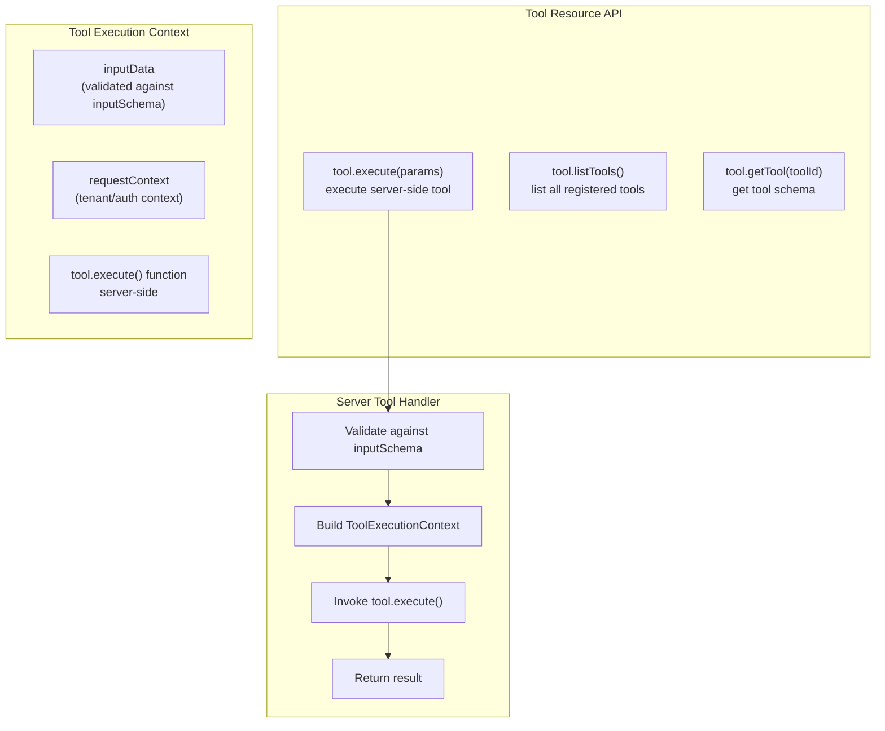

**Sources**: [client-sdks/client-js/src/types.ts:270-290]()

### Tool Execution API

```typescript
// Execute a tool
const result = await client.tool.execute({
  toolId: 'myTool',
  inputData: { param1: 'value' },
  requestContext: { resourceId: 'user-123' },
})

// List all tools
const tools = await client.tool.listTools()

// Get tool schema
const toolSchema = await client.tool.getTool('myTool')
// Returns: { id, description, inputSchema, outputSchema, requestContextSchema }
```

The `requestContext` parameter is passed to the server and made available in the tool's execution context. This enables tools to access tenant-specific data or implement authorization checks.

**Sources**: [client-sdks/client-js/src/types.ts:270-290]()

## Workflow Resource

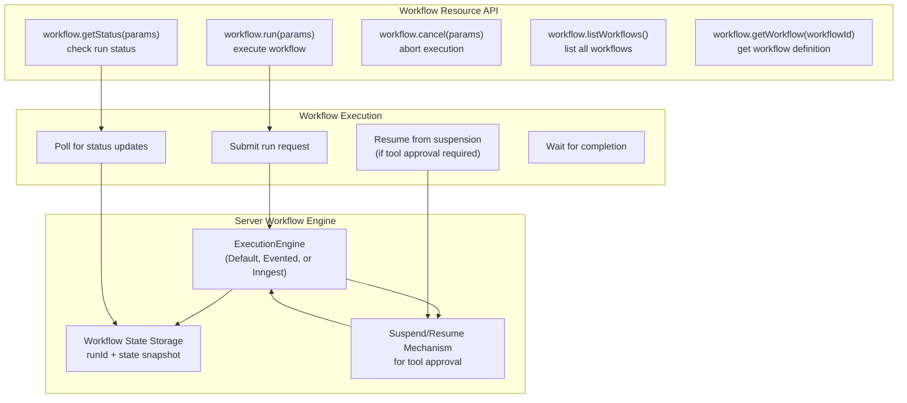

**Sources**: [client-sdks/client-js/src/types.ts:300-330]()

### Workflow Execution API

```typescript
// Execute a workflow
const result = await client.workflow.run({
  workflowId: 'myWorkflow',
  inputData: { param: 'value' },
  requestContext: { resourceId: 'user-123' },
})

// Check workflow status
const status = await client.workflow.getStatus({
  workflowId: 'myWorkflow',
  runId: result.runId,
})

// Cancel a workflow run
await client.workflow.cancel({
  workflowId: 'myWorkflow',
  runId: result.runId,
})
```

For details on workflow state management and suspend/resume, see [Suspend and Resume Mechanism](#4.4).

**Sources**: [client-sdks/client-js/src/types.ts:300-330]()

## React SDK

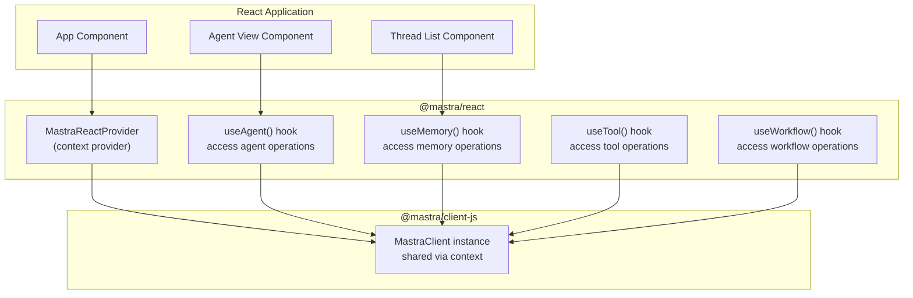

**Sources**: [client-sdks/react/package.json:1-95]()

### MastraReactProvider Setup

The `MastraReactProvider` wraps the application and provides access to the `MastraClient` via React context:

```typescript
import { MastraReactProvider } from '@mastra/react';

function App() {
  return (
    <MastraReactProvider
      baseUrl="http://localhost:3000"
      apiPrefix="/api"
      headers={{ Authorization: 'Bearer token' }}
    >
      <YourApp />
    </MastraReactProvider>
  );
}
```

The provider accepts the same configuration options as `MastraClient` (baseUrl, apiPrefix, headers, etc.).

**Sources**: [client-sdks/react/package.json:1-95]()

### React Hooks

The React SDK provides hooks that wrap the client SDK resources with React-specific patterns (loading states, error handling, etc.):

| Hook            | Returns               | Description                                          |
| --------------- | --------------------- | ---------------------------------------------------- |
| `useAgent()`    | Agent resource        | Access agent operations (stream, generate, list)     |
| `useMemory()`   | MemoryThread resource | Access memory operations (getMessages, saveMessages) |
| `useTool()`     | Tool resource         | Access tool operations (execute, list)               |
| `useWorkflow()` | Workflow resource     | Access workflow operations (run, getStatus)          |

These hooks automatically handle the MastraClient instance from context, eliminating the need to pass the client around manually.

**Sources**: [client-sdks/react/package.json:1-95]()

### UI Components

The React SDK includes pre-built UI components for common use cases:

- **Agent Chat Interface**: Full chat UI with message history, tool call rendering, and streaming support
- **Thread List**: Display and manage conversation threads
- **Tool Call Visualization**: Render tool invocations and results

For a complete UI solution, see the Playground UI package below.

**Sources**: [client-sdks/react/package.json:69-95]()

## Playground UI

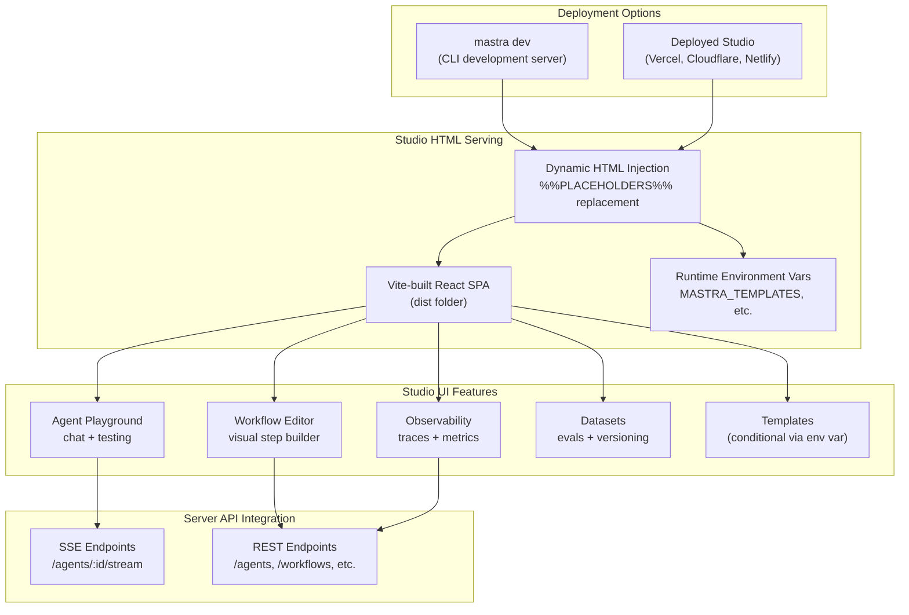

**Sources**: [packages/playground-ui/package.json:1-191](), [packages/playground-ui/CHANGELOG.md:1-100]()

### Studio Architecture

The Playground UI (`@mastra/playground-ui`) is a pre-built React application that provides a complete Studio interface for Mastra. It is served as static assets with runtime configuration via HTML injection.

**Build Process**:

1. Vite builds the React SPA into static assets (HTML, JS, CSS)
2. The HTML file contains placeholder strings like `%%MASTRA_TEMPLATES%%`
3. When served, the server replaces placeholders with runtime environment values

**Deployment Modes**:

1. **Development** (`mastra dev`): CLI bundles and serves Studio with hot-reload
2. **Production**: Deployers (Cloudflare, Vercel, Netlify) bundle and deploy Studio

**Sources**: [packages/cli/CHANGELOG.md:7-11](), [packages/deployer/CHANGELOG.md:9-13]()

### Runtime Configuration

Studio behavior is controlled via environment variables injected at runtime:

| Environment Variable | Default   | Description                            |
| -------------------- | --------- | -------------------------------------- |
| `MASTRA_TEMPLATES`   | `false`   | Show/hide Templates section in sidebar |
| `MASTRA_API_URL`     | (dynamic) | Base URL for API requests              |
| `MASTRA_API_PREFIX`  | `/api`    | API route prefix                       |

These values are injected into the HTML file by replacing `%%PLACEHOLDER%%` strings with actual values from the server environment.

**Sources**: [packages/cli/CHANGELOG.md:7-11](), [packages/deployer/CHANGELOG.md:9-13]()

### Studio Features

| Feature              | Description                                                                          |
| -------------------- | ------------------------------------------------------------------------------------ |
| **Agent Playground** | Interactive chat interface for testing agents, viewing tool calls, inspecting memory |
| **Workflow Editor**  | Visual editor for creating and debugging workflows with step-by-step execution       |
| **Observability**    | Trace viewer, log explorer, metrics dashboard using OpenTelemetry data               |
| **Datasets**         | Dataset management for evaluations with versioning and diff views                    |
| **Templates**        | Pre-built agent/workflow templates (conditionally shown via env var)                 |

**Sources**: [packages/playground-ui/CHANGELOG.md:1-100](), [packages/playground-ui/package.json:1-191]()

### Session View

Studio includes a minimal session view at `/agents/<agentId>/session` that shows only the chat interface without sidebar or information pane. This is useful for:

- Quick internal testing
- Sharing with non-technical team members
- Embedding in other applications

If request context presets are configured, a preset dropdown appears in the header.

**Sources**: [packages/playground-ui/CHANGELOG.md:5-9]()

## Communication Patterns

### Server-Sent Events (SSE)

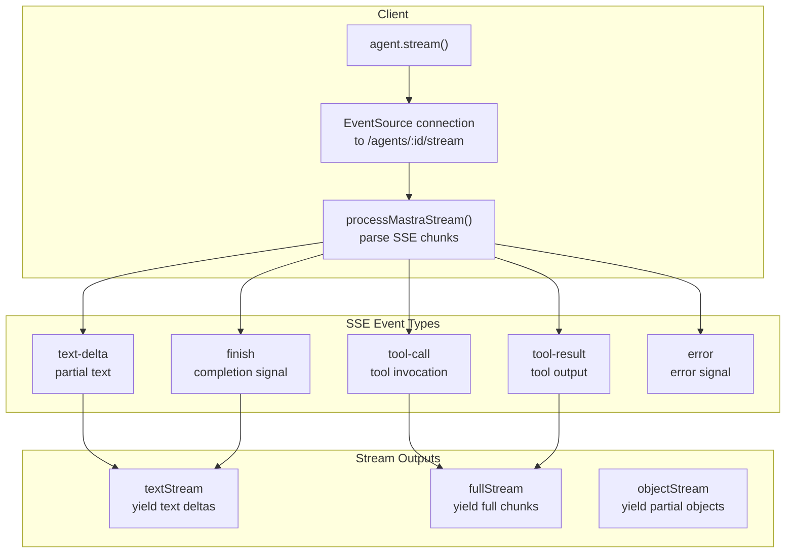

**Sources**: [client-sdks/client-js/src/resources/agent.ts:300-600]()

### SSE Chunk Format

Each SSE event is a JSON object with a `type` field:

```typescript
// Text delta
{ type: 'text-delta', delta: 'Hello' }

// Tool call
{ type: 'tool-call', toolCall: { id: 'call_123', name: 'search', args: {...} } }

// Tool result
{ type: 'tool-result', toolCallId: 'call_123', result: {...} }

// Finish
{ type: 'finish', finishReason: 'stop', usage: {...} }

// Error
{ type: 'error', error: 'Error message' }
```

The `processMastraStream()` utility function parses these chunks and provides typed access via `textStream`, `fullStream`, and `objectStream`.

**Sources**: [client-sdks/client-js/src/resources/agent.ts:400-600]()

### Client-Side Tool Recursion

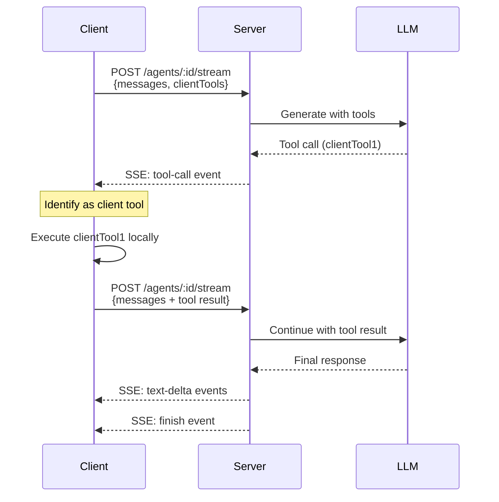

**Sources**: [client-sdks/client-js/src/resources/agent.ts:500-700]()

### Tool Approval Flow

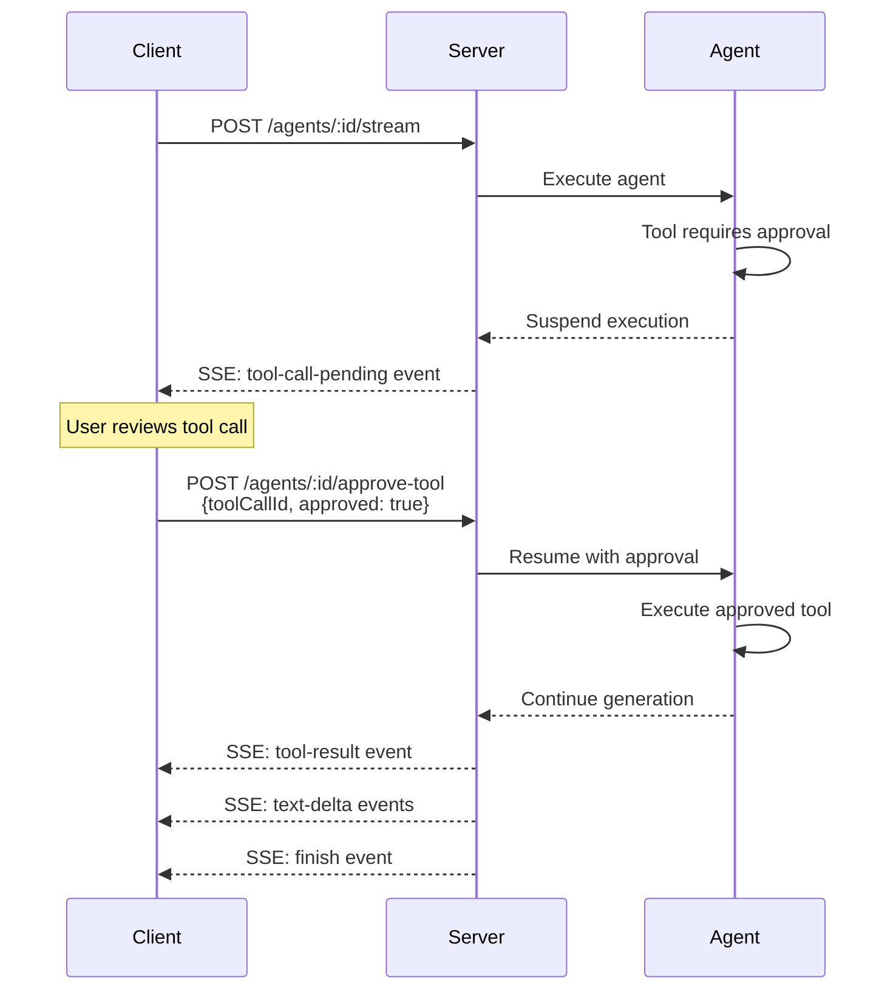

For details on the suspend/resume mechanism, see [Suspend and Resume Mechanism](#4.4).

**Sources**: [client-sdks/client-js/src/types.ts:330-340](), [packages/server/src/server/handlers/agents.ts:500-700]()

### Stream Processing Utilities

The `processMastraStream()` function provides a high-level interface for consuming SSE streams:

```typescript
import { processMastraStream } from '@mastra/client-js';

const response = await fetch('/agents/myAgent/stream', {
  method: 'POST',
  headers: { 'Content-Type': 'application/json' },
  body: JSON.stringify({ messages: [...] })
});

const output = processMastraStream(response.body);

// Consume text stream
for await (const text of output.textStream) {
  console.log(text);
}

// Or wait for final text
const finalText = await output.text;

// Or consume full chunks
for await (const chunk of output.fullStream) {
  if (chunk.type === 'text-delta') {
    console.log(chunk.delta);
  } else if (chunk.type === 'tool-call') {
    console.log('Tool call:', chunk.toolCall);
  }
}
```

**Sources**: [client-sdks/client-js/src/resources/agent.ts:300-500]()

## Error Handling and Retries

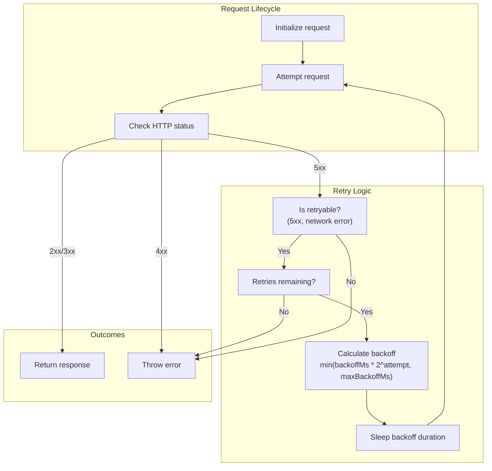

**Sources**: [client-sdks/client-js/src/client.ts:1-200]()

### Retry Configuration

Retry behavior is configured via `ClientOptions`:

```typescript
const client = new MastraClient({
  baseUrl: 'http://localhost:3000',
  retries: 3, // Max retry attempts
  backoffMs: 1000, // Initial backoff (1 second)
  maxBackoffMs: 30000, // Max backoff (30 seconds)
})
```

**Retry Conditions**:

- 5xx server errors (500-599)
- Network errors (connection refused, timeout, etc.)
- Non-retryable: 4xx client errors (400-499)

**Backoff Strategy**: Exponential with jitter

- Attempt 1: `backoffMs` ms
- Attempt 2: `backoffMs * 2` ms
- Attempt 3: `min(backoffMs * 4, maxBackoffMs)` ms

**Sources**: [client-sdks/client-js/src/client.ts:1-200]()

### Custom Fetch Support

For environments that require custom fetch implementations (e.g., Tauri, React Native), provide a custom fetch function:

```typescript
import { fetch as tauriFetch } from '@tauri-apps/api/http'

const client = new MastraClient({
  baseUrl: 'http://localhost:3000',
  fetch: tauriFetch as typeof fetch,
})
```

**Sources**: [client-sdks/client-js/src/types.ts:52-71]()
