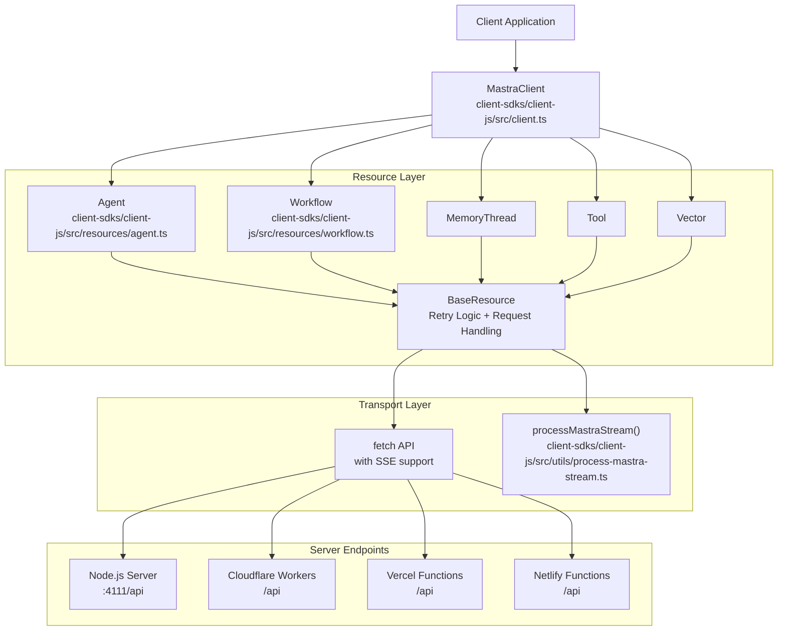
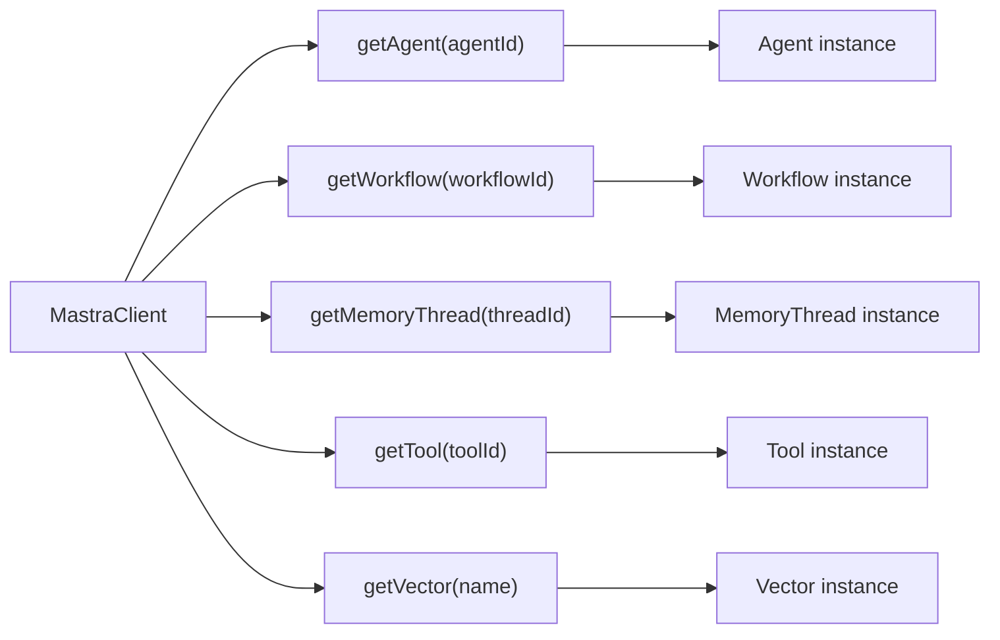
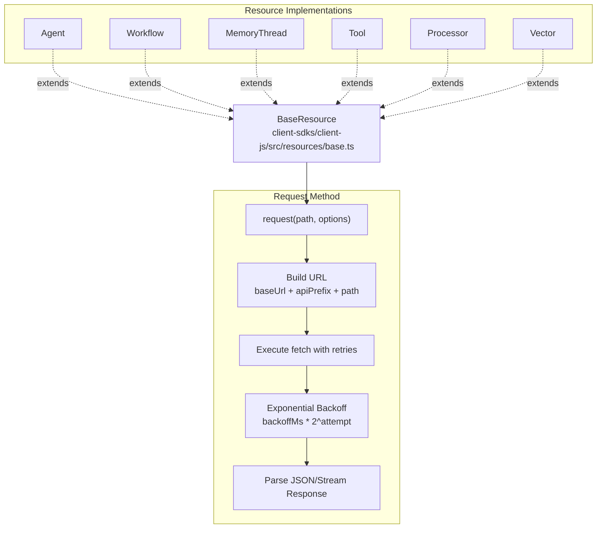
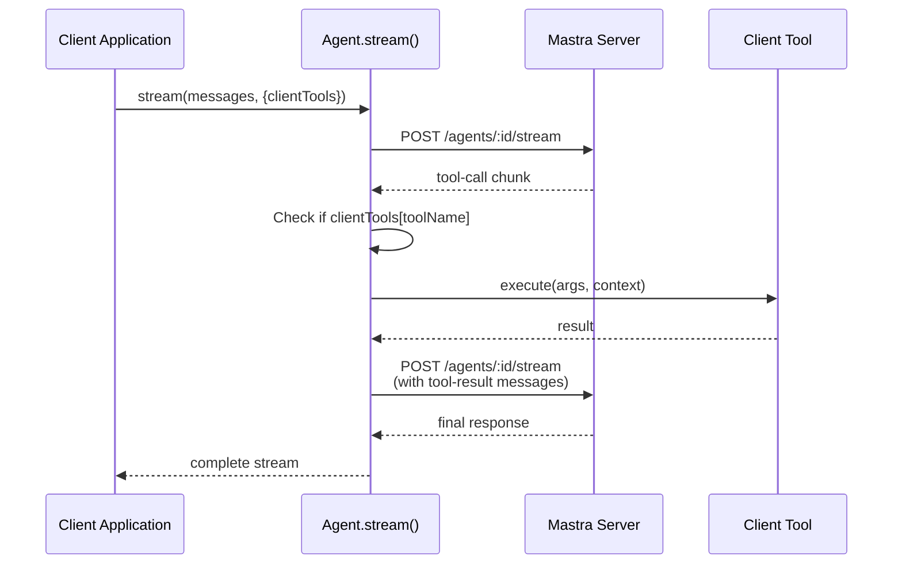
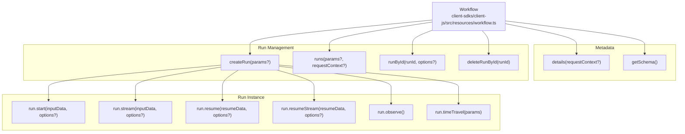
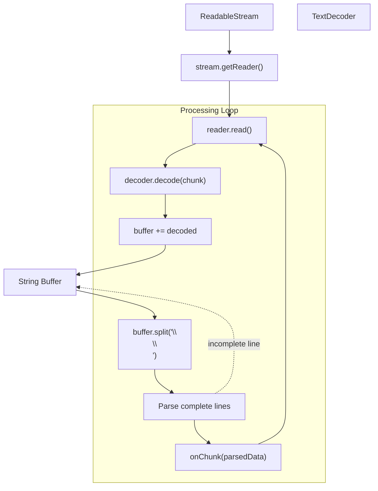
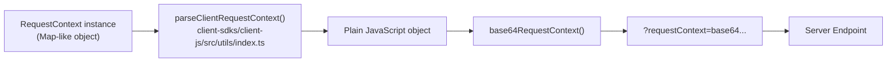
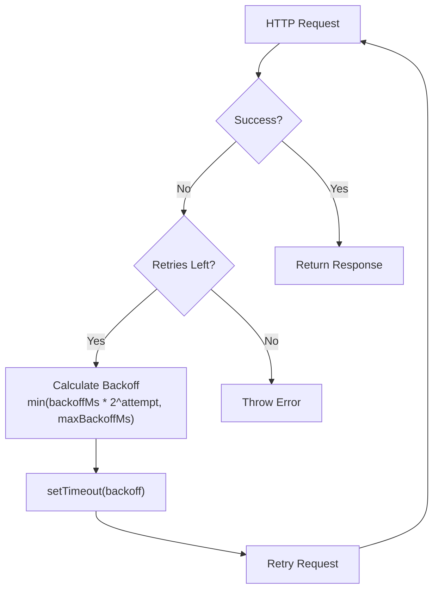

# JavaScript Client SDK

<details>
<summary>Relevant source files</summary>

The following files were used as context for generating this wiki page:

- [client-sdks/client-js/src/client.ts](client-sdks/client-js/src/client.ts)
- [client-sdks/client-js/src/resources/agent.test.ts](client-sdks/client-js/src/resources/agent.test.ts)
- [client-sdks/client-js/src/resources/agent.ts](client-sdks/client-js/src/resources/agent.ts)
- [client-sdks/client-js/src/resources/agent.vnext.test.ts](client-sdks/client-js/src/resources/agent.vnext.test.ts)
- [client-sdks/client-js/src/resources/index.ts](client-sdks/client-js/src/resources/index.ts)
- [client-sdks/client-js/src/types.ts](client-sdks/client-js/src/types.ts)
- [e2e-tests/create-mastra/create-mastra.test.ts](e2e-tests/create-mastra/create-mastra.test.ts)
- [packages/core/src/agent/**tests**/dynamic-model-fallback.test.ts](packages/core/src/agent/__tests__/dynamic-model-fallback.test.ts)
- [packages/core/src/memory/mock.ts](packages/core/src/memory/mock.ts)
- [packages/core/src/storage/mock.test.ts](packages/core/src/storage/mock.test.ts)
- [packages/core/src/stream/aisdk/v5/transform.test.ts](packages/core/src/stream/aisdk/v5/transform.test.ts)
- [packages/core/src/stream/aisdk/v5/transform.ts](packages/core/src/stream/aisdk/v5/transform.ts)
- [packages/server/src/server/handlers.ts](packages/server/src/server/handlers.ts)
- [packages/server/src/server/handlers/agent.test.ts](packages/server/src/server/handlers/agent.test.ts)
- [packages/server/src/server/handlers/agents.ts](packages/server/src/server/handlers/agents.ts)
- [packages/server/src/server/handlers/memory.test.ts](packages/server/src/server/handlers/memory.test.ts)
- [packages/server/src/server/handlers/memory.ts](packages/server/src/server/handlers/memory.ts)
- [packages/server/src/server/handlers/utils.test.ts](packages/server/src/server/handlers/utils.test.ts)
- [packages/server/src/server/handlers/utils.ts](packages/server/src/server/handlers/utils.ts)
- [packages/server/src/server/handlers/vector.test.ts](packages/server/src/server/handlers/vector.test.ts)
- [packages/server/src/server/schemas/memory.test.ts](packages/server/src/server/schemas/memory.test.ts)
- [packages/server/src/server/schemas/memory.ts](packages/server/src/server/schemas/memory.ts)

</details>

The JavaScript Client SDK (`@mastra/client-js`) provides a type-safe HTTP client for interacting with Mastra server APIs from frontend applications. It implements a resource-based architecture with built-in retry logic, streaming support, and request context propagation.

**Scope**: This document covers the client SDK architecture, resource patterns, streaming protocols, and client-side tool execution. For server-side API endpoint details, see [Server and API Layer](#9). For React-specific hooks and components, see [React SDK and Hooks](#10.5).

## Architecture Overview

The client SDK communicates with Mastra servers via HTTP/HTTPS, supporting multiple deployment targets through a unified interface.



**Sources**: [client-sdks/client-js/src/client.ts:110-115](), [client-sdks/client-js/src/resources/base.ts](), [packages/deployer/src/server/index.ts:1-496]()

## Client Configuration

### ClientOptions Interface

The `ClientOptions` interface defines configuration for the `MastraClient`:

| Option         | Type                                   | Description                        | Default            |
| -------------- | -------------------------------------- | ---------------------------------- | ------------------ |
| `baseUrl`      | `string`                               | Base URL for API requests          | Required           |
| `apiPrefix`    | `string`                               | API route prefix                   | `/api`             |
| `retries`      | `number`                               | Retry attempts for failed requests | `3`                |
| `backoffMs`    | `number`                               | Initial backoff time (ms)          | `1000`             |
| `maxBackoffMs` | `number`                               | Maximum backoff time (ms)          | `30000`            |
| `headers`      | `Record<string, string>`               | Custom headers                     | `{}`               |
| `abortSignal`  | `AbortSignal`                          | Abort signal for requests          | `undefined`        |
| `credentials`  | `'omit' \| 'same-origin' \| 'include'` | Credentials mode                   | `'same-origin'`    |
| `fetch`        | `typeof fetch`                         | Custom fetch implementation        | `globalThis.fetch` |

**Sources**: [client-sdks/client-js/src/types.ts:51-70]()

## MastraClient Class

The `MastraClient` class serves as the main entry point for all client SDK operations.

```typescript
import { MastraClient } from '@mastra/client-js'

const client = new MastraClient({
  baseUrl: 'https://api.example.com',
  apiPrefix: '/api', // matches server configuration
  headers: {
    Authorization: 'Bearer token',
  },
})
```

### Factory Methods

The `MastraClient` provides factory methods that return resource instances:



**Sources**: [client-sdks/client-js/src/client.ts:147-152](), [client-sdks/client-js/src/client.ts:224-229](), [client-sdks/client-js/src/client.ts:361-364](), [client-sdks/client-js/src/client.ts:424-427](), [client-sdks/client-js/src/client.ts:449-452]()

### List Methods

The client provides methods to list available resources:

| Method                                     | Return Type                                     | Description         |
| ------------------------------------------ | ----------------------------------------------- | ------------------- |
| `listAgents(requestContext?, partial?)`    | `Promise<Record<string, GetAgentResponse>>`     | List all agents     |
| `listWorkflows(requestContext?, partial?)` | `Promise<Record<string, GetWorkflowResponse>>`  | List all workflows  |
| `listTools(requestContext?)`               | `Promise<Record<string, GetToolResponse>>`      | List all tools      |
| `listProcessors(requestContext?)`          | `Promise<Record<string, GetProcessorResponse>>` | List all processors |

**Sources**: [client-sdks/client-js/src/client.ts:122-140](), [client-sdks/client-js/src/client.ts:400-418](), [client-sdks/client-js/src/client.ts:344-355](), [client-sdks/client-js/src/client.ts:371-384]()

## BaseResource Pattern

All resource classes extend `BaseResource`, which provides core HTTP functionality with exponential backoff retry logic.



### Retry Logic

The `BaseResource.request()` method implements exponential backoff for failed requests:

1. Initial delay: `backoffMs`
2. Maximum retries: `retries` (default: 3)
3. Backoff calculation: `Math.min(backoffMs * Math.pow(2, attempt), maxBackoffMs)`
4. Retries on network errors or 5xx status codes
5. Aborts on 4xx status codes (client errors)

**Sources**: [client-sdks/client-js/src/resources/base.ts](), [client-sdks/client-js/src/types.ts:51-70]()

## Agent Resource

The `Agent` class provides methods for interacting with AI agents, including text generation, streaming, and multi-agent networks.

### Agent Methods

```mermaid
graph TB
    Agent["Agent<br/>client-sdks/client-js/src/resources/agent.ts"]

    subgraph "Core Methods"
        Details["details(requestContext?)"]
        Generate["generate(messages, options?)"]
        Stream["stream(messages, options?)"]
        Network["network(messages, options?)"]
    end

    subgraph "Legacy Methods"
        GenerateLegacy["generateLegacy(params)"]
        StreamLegacy["streamLegacy(params)"]
    end

    subgraph "Voice Methods"
        Voice["voice.speak(text, options?)"]
        Listen["voice.listen(audio, options?)"]
        GetSpeakers["voice.getSpeakers(requestContext?)"]
        GetListener["voice.getListener(requestContext?)"]
    end

    subgraph "Management"
        Clone["clone(params?)"]
        EnhanceInstructions["enhanceInstructions(instructions, comment)"]
    end

    Agent --> Details
    Agent --> Generate
    Agent --> Stream
    Agent --> Network
    Agent --> GenerateLegacy
    Agent --> StreamLegacy
    Agent --> Voice
    Agent --> Listen
    Agent --> GetSpeakers
    Agent --> GetListener
    Agent --> Clone
    Agent --> EnhanceInstructions
```



**Sources**: [client-sdks/client-js/src/resources/agent.ts:181-1203]()

### Generation Methods

The `generate()` method provides synchronous text generation with optional structured output:

```typescript
// Basic generation
const result = await agent.generate(['What is the weather?'])

// With structured output
const result = await agent.generate(['Analyze this'], {
  structuredOutput: {
    schema: z.object({
      sentiment: z.enum(['positive', 'negative', 'neutral']),
      score: z.number(),
    }),
  },
})
```

**Type signatures**:

- `generate(messages, options?)` → `Promise<FullOutput<undefined>>`
- `generate<OUTPUT>(messages, options)` → `Promise<FullOutput<OUTPUT>>`

**Sources**: [client-sdks/client-js/src/resources/agent.ts:316-369]()

### Streaming Methods

The `stream()` method returns a `Response` object with a `processDataStream()` method for consuming SSE events:

```typescript
const response = await agent.stream(['Tell me a story'])

await response.processDataStream({
  onChunk: async (chunk) => {
    if (chunk.type === 'text-delta') {
      console.log(chunk.payload.text)
    }
  },
  onToolCall: async ({ toolCall }) => {
    // Handle tool calls
    return toolResult
  },
  onFinish: async ({ message, finishReason }) => {
    console.log('Done:', finishReason)
  },
})
```

**Sources**: [client-sdks/client-js/src/resources/agent.ts:778-886]()

### Client-Side Tool Execution

The SDK supports client-side tool execution, where tools run in the browser/client environment rather than on the server.



**Implementation details**:

1. Server emits `type: 'tool-call'` chunk with tool name and arguments
2. Client checks if tool exists in `clientTools` parameter
3. If found, client executes tool locally via `tool.execute()`
4. Client constructs tool-result message
5. Client makes recursive call to `stream()` with updated messages
6. Process repeats if server requests more tool calls

**Sources**: [client-sdks/client-js/src/resources/agent.ts:43-110](), [client-sdks/client-js/src/resources/agent.ts:356-366]()

### Network Method

The `network()` method invokes multi-agent networks, where a routing agent selects which primitive (agent, workflow, or tool) to execute:

```typescript
const response = await agent.network(['Create a report'], {
  structuredOutput: {
    schema: z.object({
      title: z.string(),
      sections: z.array(z.string()),
    }),
  },
})

await response.processDataStream({
  onChunk: async (chunk) => {
    if (chunk.type === 'iteration') {
      console.log('Selected resource:', chunk.payload.resourceType)
    }
  },
})
```

**Sources**: [client-sdks/client-js/src/resources/agent.ts:1025-1150]()

## Workflow Resource

The `Workflow` class manages workflow execution, run persistence, and state observation.

### Workflow Methods



**Sources**: [client-sdks/client-js/src/resources/workflow.ts:21-206](), [client-sdks/client-js/src/resources/run.ts]()

### Run Lifecycle

Workflow execution follows a create-run pattern where each execution is a separate run instance:

```typescript
const workflow = client.getWorkflow('data-pipeline')

// Create run instance
const run = await workflow.createRun({
  runId: 'custom-run-id', // optional
  resourceId: 'user-123', // optional
  disableScorers: false, // optional
})

// Execute workflow
const result = await run.start({
  inputData: { files: ['data.csv'] },
  requestContext: { userId: '123' },
})
```

**Sources**: [client-sdks/client-js/src/resources/workflow.ts:160-181]()

### Streaming Workflow Execution

The `run.stream()` method provides real-time updates during workflow execution:

```typescript
const stream = await run.stream({
  inputData: { query: 'search term' },
})

await stream.processDataStream({
  onChunk: async (event) => {
    if (event.type === 'step-start') {
      console.log('Step started:', event.payload.stepId)
    } else if (event.type === 'step-complete') {
      console.log('Step completed:', event.payload.result)
    }
  },
})
```

**Chunk types**:

- `step-start`: Step execution begins
- `step-complete`: Step execution completes
- `step-error`: Step encounters error
- `workflow-complete`: Workflow finishes
- `workflow-error`: Workflow fails

**Sources**: [client-sdks/client-js/src/resources/run.ts](), [client-sdks/client-js/src/types.ts:41-46]()

### Workflow Suspension and Resumption

Workflows can suspend execution and resume later with additional data:

```typescript
// Start workflow that may suspend
const stream = await run.stream({ inputData: { task: 'approval' } })

// Workflow suspends at approval step
// Later, resume with approval decision
const resumeStream = await run.resumeStream({
  resumeData: { approved: true, reason: 'Looks good' },
})
```

**Sources**: [client-sdks/client-js/src/resources/run.ts](), [packages/server/src/server/handlers/workflows.ts:396-451]()

## Memory Operations

The client provides methods for managing conversation threads and messages.

### Memory Thread Management

```mermaid
graph TB
    Client["MastraClient"]

    subgraph "Thread Operations"
        ListThreads["listMemoryThreads(params)"]
        CreateThread["createMemoryThread(params)"]
        GetThread["getMemoryThread({threadId, agentId?})"]
        DeleteThread["deleteThread(threadId, opts)"]
    end

    subgraph "Message Operations"
        ListMessages["listThreadMessages(threadId, opts)"]
        SaveMessages["saveMessageToMemory(params)"]
    end

    subgraph "MemoryThread Instance"
        Details["thread.details()"]
        Update["thread.update(params)"]
        Messages["thread.messages(params?)"]
        Clone["thread.clone(params)"]
        Search["thread.search(params)"]
    end

    subgraph "Observational Memory"
        GetStatus["getMemoryStatus(agentId, rc?, opts?)"]
        GetOM["getObservationalMemory(params)"]
        AwaitBuffer["awaitBufferStatus(params)"]
    end

    Client --> ListThreads
    Client --> CreateThread
    Client --> GetThread
    Client --> DeleteThread
    Client --> ListMessages
    Client --> SaveMessages
    Client --> GetStatus
    Client --> GetOM
    Client --> AwaitBuffer

    GetThread --> Details
    GetThread --> Update
    GetThread --> Messages
    GetThread --> Clone
    GetThread --> Search
```



**Sources**: [client-sdks/client-js/src/client.ts:160-337](), [client-sdks/client-js/src/resources/memory-thread.ts]()

### Thread Filtering and Pagination

The `listMemoryThreads()` method supports filtering by `resourceId`, `metadata`, and pagination:

```typescript
const threads = await client.listMemoryThreads({
  resourceId: 'user-123', // filter by resource
  metadata: { tag: 'support' }, // filter by metadata
  page: 0, // pagination
  perPage: 20,
  orderBy: 'updatedAt', // sort field
  sortDirection: 'DESC',
  agentId: 'agent-1', // optional agent context
  requestContext: { env: 'prod' }, // optional request context
})

// Response includes pagination metadata
console.log(threads.total) // total count
console.log(threads.hasMore) // more pages available
```

**Sources**: [client-sdks/client-js/src/client.ts:160-196](), [client-sdks/client-js/src/types.ts:309-332]()

### Memory Configuration

The `getMemoryConfig()` method retrieves agent memory settings including semantic recall, observational memory, and working memory configuration:

```typescript
const config = await client.getMemoryConfig({
  agentId: 'agent-1',
  requestContext: { userId: '123' },
})

// Returns memory configuration
console.log(config.config.lastMessages) // message window size
console.log(config.config.semanticRecall) // RAG settings
console.log(config.config.observationalMemory) // compression settings
```

**Sources**: [client-sdks/client-js/src/client.ts:203-207](), [client-sdks/client-js/src/types.ts:334-351]()

## Stream Processing

The client SDK implements SSE (Server-Sent Events) protocol for real-time streaming responses.

### SSE Protocol

```mermaid
sequenceDiagram
    participant Client as Client SDK
    participant Fetch as fetch()
    participant Server as Mastra Server
    participant Processor as processMastraStream()

    Client->>Fetch: POST /agents/:id/stream
    Fetch->>Server: HTTP request
    Server-->>Fetch: Response with SSE stream
    Fetch-->>Client: ReadableStream<Uint8Array>
    Client->>Processor: processDataStream({onChunk})

    loop For each SSE message
        Processor->>Processor: Parse "data: {...}\
\
"
        Processor->>Processor: JSON.parse(chunk)
        Processor->>Client: onChunk(parsedChunk)
    end

    Server-->>Processor: "data: [DONE]\
\
"
    Processor->>Client: Stream complete
```

**SSE message format**:

```
data: {"type":"text-delta","payload":{"text":"Hello"},"runId":"run-1","from":"AGENT"}

data: {"type":"finish","payload":{"reason":"stop"},"runId":"run-1","from":"AGENT"}

data: [DONE]

```

**Sources**: [client-sdks/client-js/src/utils/process-mastra-stream.ts:4-76]()

### processMastraStream Implementation

The `processMastraStream()` function handles SSE parsing with buffering for incomplete messages:



**Key implementation details**:

1. Maintains string buffer for incomplete SSE messages
2. Splits on `\
\
` delimiter
3. Keeps last incomplete segment in buffer
4. Handles `[DONE]` marker to terminate stream
5. Continues processing on JSON parse errors
6. Releases reader lock on completion

**Sources**: [client-sdks/client-js/src/utils/process-mastra-stream.ts:4-50]()

### Error Handling in Streams

The stream processor implements graceful error handling:

| Error Type          | Handling Strategy                         |
| ------------------- | ----------------------------------------- |
| JSON parse error    | Log error, continue processing next chunk |
| Network error       | Propagate to caller, release reader lock  |
| `[DONE]` marker     | Clean termination, return successfully    |
| Stream interruption | Release reader in `finally` block         |

**Sources**: [client-sdks/client-js/src/utils/process-mastra-stream.ts:36-49]()

## Type System

The client SDK provides comprehensive TypeScript types for all operations.

### Request and Response Types

Key type exports from `types.ts`:

| Type Category        | Types                                                                              |
| -------------------- | ---------------------------------------------------------------------------------- |
| Client Configuration | `ClientOptions`, `RequestOptions`                                                  |
| Agent Types          | `GetAgentResponse`, `StreamParams`, `GenerateLegacyParams`, `NetworkStreamParams`  |
| Workflow Types       | `GetWorkflowResponse`, `ListWorkflowRunsParams`, `WorkflowRunResult`               |
| Memory Types         | `CreateMemoryThreadParams`, `ListMemoryThreadsParams`, `SaveMessageToMemoryParams` |
| Tool Types           | `GetToolResponse`                                                                  |
| Storage Types        | `StoredAgentResponse`, `CreateStoredAgentParams`, `UpdateStoredAgentParams`        |

**Sources**: [client-sdks/client-js/src/types.ts:1-1338]()

### Schema Transformation

The client SDK automatically converts Zod schemas to JSON Schema for transmission:

```typescript
import { z } from 'zod'

// Client code uses Zod
const outputSchema = z.object({
  name: z.string(),
  age: z.number().min(0),
})

await agent.stream(['Hello'], {
  structuredOutput: { schema: outputSchema },
})

// SDK converts to JSON Schema before transmission
// Server receives:
// {
//   "structuredOutput": {
//     "schema": {
//       "type": "object",
//       "properties": {
//         "name": { "type": "string" },
//         "age": { "type": "number", "minimum": 0 }
//       },
//       "required": ["name", "age"]
//     }
//   }
// }
```

**Sources**: [client-sdks/client-js/src/utils/zod-to-json-schema.ts](), [client-sdks/client-js/src/resources/agent.ts:332-342]()

## Request Context Propagation

The `RequestContext` system enables dynamic configuration and multi-tenancy by passing context data with requests.

### RequestContext Handling



**Transformation flow**:

1. Client creates `RequestContext` instance (Map-like)
2. `parseClientRequestContext()` converts to plain object
3. `base64RequestContext()` encodes as Base64 for query params
4. Server decodes and reconstructs `RequestContext`

**Sources**: [client-sdks/client-js/src/utils/index.ts](), [client-sdks/client-js/src/types.ts:24]()

## Error Handling

The client SDK provides structured error handling with automatic retries and detailed error information.

### Retry Strategy



**Retry conditions**:

- Network errors (connection failures)
- 5xx status codes (server errors)
- Timeout errors

**Non-retry conditions**:

- 4xx status codes (client errors)
- Successful responses (2xx, 3xx)

**Sources**: [client-sdks/client-js/src/resources/base.ts]()

### Error Types

Common error scenarios and their handling:

| Error            | Status | Client Behavior             |
| ---------------- | ------ | --------------------------- |
| Network failure  | N/A    | Retry with backoff          |
| Authentication   | 401    | No retry, throw immediately |
| Not found        | 404    | No retry, throw immediately |
| Server error     | 500    | Retry up to `retries` limit |
| Rate limit       | 429    | Retry with backoff          |
| Validation error | 400    | No retry, throw immediately |

**Sources**: [client-sdks/client-js/src/resources/base.ts]()

## Testing

The client SDK includes comprehensive test coverage for streaming, tool execution, and error handling.

### Test Coverage Areas

Key test files and their focus:

| Test File                       | Coverage                                                         |
| ------------------------------- | ---------------------------------------------------------------- |
| `agent.test.ts`                 | Parameter transformation, RequestContext handling, client tools  |
| `agent.vnext.test.ts`           | Streaming lifecycle, recursive tool execution, error propagation |
| `process-mastra-stream.test.ts` | SSE parsing, buffer handling, JSON errors                        |

**Test patterns demonstrated**:

1. Mock SSE responses with `ReadableStream`
2. Verify parameter transformation (Zod → JSON Schema)
3. Test recursive stream calls on `tool-calls` finish reason
4. Validate buffer handling for incomplete SSE messages
5. Error recovery and graceful degradation

**Sources**: [client-sdks/client-js/src/resources/agent.test.ts:1-312](), [client-sdks/client-js/src/resources/agent.vnext.test.ts:1-311](), [client-sdks/client-js/src/utils/process-mastra-stream.test.ts:1-257]()
