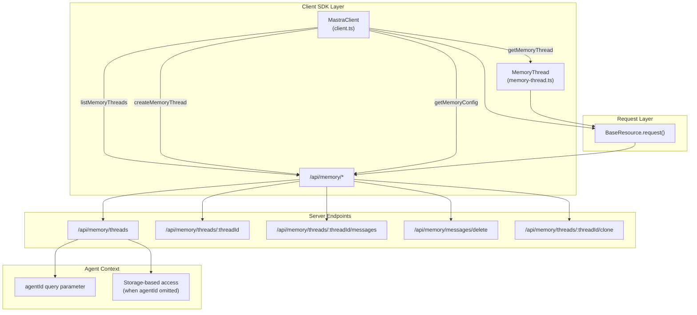
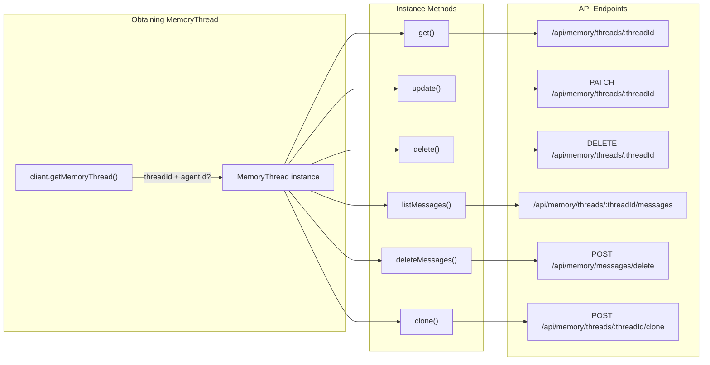
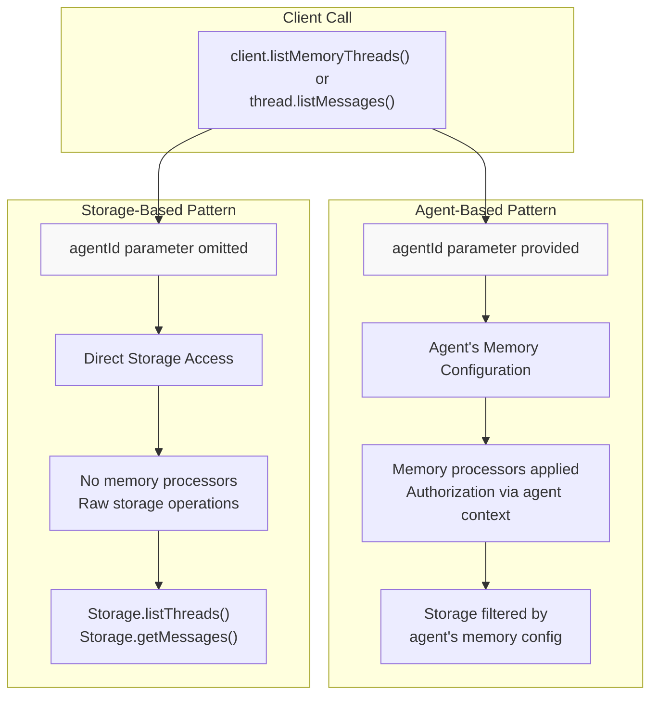

# Memory Client Operations

<details>
<summary>Relevant source files</summary>

The following files were used as context for generating this wiki page:

- [client-sdks/client-js/src/client.ts](client-sdks/client-js/src/client.ts)
- [client-sdks/client-js/src/resources/agent.test.ts](client-sdks/client-js/src/resources/agent.test.ts)
- [client-sdks/client-js/src/resources/agent.ts](client-sdks/client-js/src/resources/agent.ts)
- [client-sdks/client-js/src/resources/agent.vnext.test.ts](client-sdks/client-js/src/resources/agent.vnext.test.ts)
- [client-sdks/client-js/src/resources/index.ts](client-sdks/client-js/src/resources/index.ts)
- [client-sdks/client-js/src/types.ts](client-sdks/client-js/src/types.ts)
- [e2e-tests/create-mastra/create-mastra.test.ts](e2e-tests/create-mastra/create-mastra.test.ts)
- [packages/core/src/agent/**tests**/dynamic-model-fallback.test.ts](packages/core/src/agent/__tests__/dynamic-model-fallback.test.ts)
- [packages/core/src/memory/mock.ts](packages/core/src/memory/mock.ts)
- [packages/core/src/storage/mock.test.ts](packages/core/src/storage/mock.test.ts)
- [packages/core/src/stream/aisdk/v5/transform.test.ts](packages/core/src/stream/aisdk/v5/transform.test.ts)
- [packages/core/src/stream/aisdk/v5/transform.ts](packages/core/src/stream/aisdk/v5/transform.ts)
- [packages/server/src/server/handlers.ts](packages/server/src/server/handlers.ts)
- [packages/server/src/server/handlers/agent.test.ts](packages/server/src/server/handlers/agent.test.ts)
- [packages/server/src/server/handlers/agents.ts](packages/server/src/server/handlers/agents.ts)
- [packages/server/src/server/handlers/memory.test.ts](packages/server/src/server/handlers/memory.test.ts)
- [packages/server/src/server/handlers/memory.ts](packages/server/src/server/handlers/memory.ts)
- [packages/server/src/server/handlers/utils.test.ts](packages/server/src/server/handlers/utils.test.ts)
- [packages/server/src/server/handlers/utils.ts](packages/server/src/server/handlers/utils.ts)
- [packages/server/src/server/handlers/vector.test.ts](packages/server/src/server/handlers/vector.test.ts)
- [packages/server/src/server/schemas/memory.test.ts](packages/server/src/server/schemas/memory.test.ts)
- [packages/server/src/server/schemas/memory.ts](packages/server/src/server/schemas/memory.ts)

</details>

## Purpose and Scope

This document describes the client-side operations for interacting with memory threads, messages, and related memory system functionality through the Mastra JavaScript/TypeScript client SDK. It covers the `MastraClient` memory methods and the `MemoryThread` resource class for managing conversations, messages, and thread metadata.

For server-side memory architecture and storage implementation details, see [Memory System Architecture](#7.1). For thread management concepts and cloning semantics, see [Thread Management and Cloning](#7.2).

---

## Client Memory Architecture Overview

The memory client layer provides two access patterns: top-level `MastraClient` methods for cross-thread operations and `MemoryThread` resource instances for thread-specific operations.



**Diagram: Memory Client Architecture**

The client provides two access modes:

1. **Agent-based**: Operations scoped to an agent's memory configuration (requires `agentId`)
2. **Storage-based**: Direct storage access when `agentId` is omitted

**Sources:** [client-sdks/client-js/src/client.ts:1-700](), [client-sdks/client-js/src/resources/memory-thread.ts:1-142]()

---

## MastraClient Memory Methods

The `MastraClient` class provides top-level methods for memory operations that span multiple threads or require agent-level configuration.

### Thread Listing and Creation

#### `listMemoryThreads(params?)`

Lists memory threads with optional filtering by `resourceId` and/or `metadata`. Returns paginated results.

| Parameter        | Type                          | Description                               |
| ---------------- | ----------------------------- | ----------------------------------------- |
| `resourceId`     | `string?`                     | Filter threads by resource ID             |
| `metadata`       | `Record<string, unknown>?`    | Filter threads by metadata (AND logic)    |
| `agentId`        | `string?`                     | Agent ID for agent-scoped access          |
| `page`           | `number?`                     | Page number (0-indexed)                   |
| `perPage`        | `number?`                     | Items per page                            |
| `orderBy`        | `'createdAt' \| 'updatedAt'?` | Sort field                                |
| `sortDirection`  | `'ASC' \| 'DESC'?`            | Sort direction                            |
| `requestContext` | `RequestContext?`             | Request context for dynamic configuration |

**Returns:** `Promise<ListMemoryThreadsResponse>`

- `threads`: Array of `StorageThreadType` objects
- `total`: Total thread count
- `page`: Current page number
- `perPage`: Items per page
- `hasMore`: Whether more pages exist

```typescript
// Example: List threads for a user
const response = await client.listMemoryThreads({
  resourceId: 'user-123',
  agentId: 'support-agent',
  page: 0,
  perPage: 20,
  orderBy: 'updatedAt',
  sortDirection: 'DESC',
})
```

**Endpoint:** `GET /api/memory/threads?resourceId=...&agentId=...`

**Sources:** [client-sdks/client-js/src/client.ts:114-150](), [client-sdks/client-js/src/types.ts:294-317]()

---

#### `createMemoryThread(params)`

Creates a new memory thread with optional title, metadata, and custom thread ID.

| Parameter        | Type                   | Required | Description                                  |
| ---------------- | ---------------------- | -------- | -------------------------------------------- |
| `agentId`        | `string`               | Yes      | Agent ID for memory configuration            |
| `resourceId`     | `string`               | Yes      | Resource identifier (e.g., user ID)          |
| `threadId`       | `string?`              | No       | Custom thread ID (auto-generated if omitted) |
| `title`          | `string?`              | No       | Thread title                                 |
| `metadata`       | `Record<string, any>?` | No       | Custom metadata                              |
| `requestContext` | `RequestContext?`      | No       | Request context                              |

**Returns:** `Promise<CreateMemoryThreadResponse>` (returns `StorageThreadType`)

```typescript
// Example: Create thread with metadata
const thread = await client.createMemoryThread({
  agentId: 'support-agent',
  resourceId: 'user-123',
  title: 'Support Request #456',
  metadata: {
    category: 'billing',
    priority: 'high',
  },
})
```

**Endpoint:** `POST /api/memory/threads?agentId=...`

**Sources:** [client-sdks/client-js/src/client.ts:168-172](), [client-sdks/client-js/src/types.ts:283-292]()

---

### Memory Configuration and Status

#### `getMemoryConfig(params)`

Retrieves memory configuration for an agent, including recall strategies and storage settings.

```typescript
const config = await client.getMemoryConfig({
  agentId: 'support-agent',
  requestContext,
})
// Returns: { config: MemoryConfig }
```

**Endpoint:** `GET /api/memory/config?agentId=...`

**Sources:** [client-sdks/client-js/src/client.ts:157-160]()

---

#### `getMemoryStatus(agentId, requestContext?)`

Checks if memory is enabled for an agent.

```typescript
const status = await client.getMemoryStatus('support-agent')
// Returns: { result: boolean }
```

**Endpoint:** `GET /api/memory/status?agentId=...`

**Sources:** [client-sdks/client-js/src/client.ts:244-249]()

---

### Direct Message Operations

#### `saveMessageToMemory(params)`

Saves messages directly to memory storage (typically used internally by agents).

| Parameter        | Type                                     | Description      |
| ---------------- | ---------------------------------------- | ---------------- |
| `messages`       | `(MastraMessageV1 \| MastraDBMessage)[]` | Messages to save |
| `agentId`        | `string`                                 | Agent ID         |
| `requestContext` | `RequestContext?`                        | Request context  |

**Endpoint:** `POST /api/memory/save-messages?agentId=...`

**Sources:** [client-sdks/client-js/src/client.ts:228-235](), [client-sdks/client-js/src/types.ts:268-281]()

---

#### `listThreadMessages(threadId, opts?)`

Lists messages for a thread. Supports three access modes:

1. **Network mode**: When `networkId` is provided
2. **Agent mode**: When `agentId` is provided
3. **Storage mode**: When neither is provided (direct storage access)

```typescript
// Agent-based access
const msgs = await client.listThreadMessages('thread-123', {
  agentId: 'support-agent',
})

// Storage-based access
const msgs = await client.listThreadMessages('thread-123')
```

**Endpoint:**

- Network: `GET /api/memory/network/threads/:threadId/messages?networkId=...`
- Agent: `GET /api/memory/threads/:threadId/messages?agentId=...`
- Storage: `GET /api/memory/threads/:threadId/messages`

**Sources:** [client-sdks/client-js/src/client.ts:194-207]()

---

#### `deleteThread(threadId, opts?)`

Deletes a thread. Supports agent and network modes.

```typescript
await client.deleteThread('thread-123', {
  agentId: 'support-agent',
  requestContext,
})
// Returns: { success: boolean, message: string }
```

**Sources:** [client-sdks/client-js/src/client.ts:209-221]()

---

## MemoryThread Resource Class

The `MemoryThread` class provides instance methods for operating on a specific thread. Obtain instances via `client.getMemoryThread({ threadId, agentId? })`.



**Diagram: MemoryThread Instance Methods Flow**

**Sources:** [client-sdks/client-js/src/resources/memory-thread.ts:1-142](), [client-sdks/client-js/src/client.ts:176-183]()

---

### Thread Metadata Operations

#### `get(requestContext?)`

Retrieves thread details including title, metadata, and timestamps.

```typescript
const thread = client.getMemoryThread({
  threadId: 'thread-123',
  agentId: 'agent-1',
})
const details = await thread.get()
// Returns: StorageThreadType with id, title, metadata, resourceId, createdAt, updatedAt
```

**Sources:** [client-sdks/client-js/src/resources/memory-thread.ts:42-46]()

---

#### `update(params)`

Updates thread properties. All fields except `requestContext` are included in the update payload.

| Parameter        | Type                  | Description                      |
| ---------------- | --------------------- | -------------------------------- |
| `title`          | `string`              | New thread title                 |
| `metadata`       | `Record<string, any>` | New metadata (replaces existing) |
| `resourceId`     | `string`              | New resource ID                  |
| `requestContext` | `RequestContext?`     | Request context                  |

```typescript
await thread.update({
  title: 'Updated Support Request',
  metadata: {
    status: 'resolved',
    resolved_at: new Date().toISOString(),
  },
  resourceId: 'user-123',
})
```

**Endpoint:** `PATCH /api/memory/threads/:threadId?agentId=...`

**Sources:** [client-sdks/client-js/src/resources/memory-thread.ts:53-60](), [client-sdks/client-js/src/types.ts:326-331]()

---

#### `delete(requestContext?)`

Deletes the thread and all associated messages.

```typescript
await thread.delete()
// Returns: { result: string }
```

**Endpoint:** `DELETE /api/memory/threads/:threadId?agentId=...`

**Sources:** [client-sdks/client-js/src/resources/memory-thread.ts:67-73]()

---

### Message Listing and Filtering

#### `listMessages(params?)`

Retrieves paginated messages with advanced filtering and ordering options.

| Parameter        | Type                                             | Description                                  |
| ---------------- | ------------------------------------------------ | -------------------------------------------- |
| `page`           | `number?`                                        | Page number (0-indexed)                      |
| `perPage`        | `number?`                                        | Messages per page                            |
| `orderBy`        | `{ field: string, direction: 'ASC' \| 'DESC' }?` | Sort configuration                           |
| `filter`         | `object?`                                        | Filter conditions (e.g., `{ role: 'user' }`) |
| `include`        | `object?`                                        | Include options for related data             |
| `resourceId`     | `string?`                                        | Filter by resource ID                        |
| `requestContext` | `RequestContext?`                                | Request context                              |

```typescript
// Get recent user messages
const messages = await thread.listMessages({
  page: 0,
  perPage: 50,
  orderBy: { field: 'createdAt', direction: 'DESC' },
  filter: { role: 'user' },
})

// Returns: { messages: MastraDBMessage[] }
```

**Endpoint:** `GET /api/memory/threads/:threadId/messages?agentId=...&page=...&perPage=...`

**Sources:** [client-sdks/client-js/src/resources/memory-thread.ts:80-100](), [client-sdks/client-js/src/types.ts:333-337]()

---

### Message Deletion

#### `deleteMessages(messageIds, requestContext?)`

Deletes one or more messages from the thread. Accepts multiple input formats for flexibility.

**Supported input formats:**

1. Single message ID: `string`
2. Array of message IDs: `string[]`
3. Message object: `{ id: string }`
4. Array of message objects: `{ id: string }[]`

```typescript
// Delete single message
await thread.deleteMessages('msg-123')

// Delete multiple messages
await thread.deleteMessages(['msg-1', 'msg-2', 'msg-3'])

// Delete from message objects (e.g., from UI selection)
await thread.deleteMessages([{ id: 'msg-1' }, { id: 'msg-2' }])

// Returns: { success: boolean, message: string }
```

**Endpoint:** `POST /api/memory/messages/delete?agentId=...`

**Body:** `{ messageIds: string | string[] | { id: string } | { id: string }[] }`

**Sources:** [client-sdks/client-js/src/resources/memory-thread.ts:109-125]()

---

### Thread Cloning

#### `clone(params?)`

Creates a copy of the thread with all or filtered messages. Supports selective message copying and metadata customization.

| Parameter                          | Type                   | Description                                             |
| ---------------------------------- | ---------------------- | ------------------------------------------------------- |
| `newThreadId`                      | `string?`              | Custom ID for cloned thread (auto-generated if omitted) |
| `resourceId`                       | `string?`              | New resource ID (defaults to original)                  |
| `title`                            | `string?`              | Title for cloned thread                                 |
| `metadata`                         | `Record<string, any>?` | Metadata for cloned thread                              |
| `options.messageLimit`             | `number?`              | Maximum messages to copy                                |
| `options.messageFilter.startDate`  | `Date?`                | Copy messages after this date                           |
| `options.messageFilter.endDate`    | `Date?`                | Copy messages before this date                          |
| `options.messageFilter.messageIds` | `string[]?`            | Copy only these specific messages                       |
| `requestContext`                   | `RequestContext?`      | Request context                                         |

```typescript
// Clone with recent messages only
const cloned = await thread.clone({
  title: 'Cloned Thread',
  options: {
    messageLimit: 100,
    messageFilter: {
      startDate: new Date('2024-01-01'),
    },
  },
})

// Returns: { thread: StorageThreadType, clonedMessages: MastraDBMessage[] }
```

**Endpoint:** `POST /api/memory/threads/:threadId/clone?agentId=...`

**Sources:** [client-sdks/client-js/src/resources/memory-thread.ts:132-140](), [client-sdks/client-js/src/types.ts:339-358]()

---

## Agent-Based vs Storage-Based Access Patterns

The memory client supports two distinct access patterns that determine how operations are scoped and authorized:



**Diagram: Agent-Based vs Storage-Based Access Decision Flow**

### Agent-Based Access

When `agentId` is provided, operations are scoped through the agent's memory configuration:

- **Memory processors**: Input/output processors are applied (e.g., `MessageHistory`, `SemanticRecall`)
- **Authorization**: Agent's `requestContextSchema` validates access
- **Configuration**: Agent's memory settings determine behavior (e.g., thread selection strategy)

```typescript
// Agent-based: Uses agent's memory configuration
const thread = client.getMemoryThread({
  threadId: 'thread-123',
  agentId: 'support-agent', // <-- Enables agent-based access
})
```

### Storage-Based Access

When `agentId` is omitted, operations bypass agent configuration:

- **Direct storage**: Raw storage operations without processing
- **No processors**: Memory processors are skipped
- **Broader access**: Not limited by agent's memory configuration

```typescript
// Storage-based: Direct storage access
const thread = client.getMemoryThread({
  threadId: 'thread-123',
  // No agentId = storage-based access
})
```

### Implementation Details

The `MemoryThread` class internally manages the `agentId` query parameter:

```typescript
// From memory-thread.ts:33-35
private getAgentIdQueryParam(prefix: '?' | '&' = '?'): string {
  return this.agentId ? `${prefix}agentId=${this.agentId}` : '';
}
```

When `agentId` is present, it's appended to all API requests. When absent, the server routes to storage-based handlers.

**Sources:** [client-sdks/client-js/src/resources/memory-thread.ts:21-46](), [packages/server/src/server/handlers/agents.ts:1-100]()

---

## Request Context Handling

All memory operations support optional `requestContext` parameters for dynamic configuration and multi-tenancy.

### Request Context in Memory Operations

```typescript
import { RequestContext } from '@mastra/core/request-context'

// Create request context with tenant/user info
const requestContext = new RequestContext()
requestContext.set('tenantId', 'tenant-123')
requestContext.set('userId', 'user-456')

// Pass to any memory operation
const threads = await client.listMemoryThreads({
  resourceId: 'user-456',
  agentId: 'support-agent',
  requestContext, // <-- Dynamic configuration
})
```

### Context Serialization

The client automatically serializes request context for API transmission:

```typescript
// From utils.ts - converts RequestContext to base64 query param
const requestContextParam = base64RequestContext(
  parseClientRequestContext(requestContext)
)
// Appended as: ?requestContext=eyJ0ZW5hbnRJZCI6InRlbmFudC0xMjMifQ==
```

**Server-side handling:** The server deserializes the context and passes it to agents, processors, and storage operations. This enables:

- Multi-tenant data isolation
- User-specific memory configuration
- Dynamic agent behavior based on context

**Sources:** [client-sdks/client-js/src/utils/index.ts:1-50](), [client-sdks/client-js/src/client.ts:62-63]()

---

## Common Usage Patterns

### Pattern 1: Thread Lifecycle Management

Complete thread lifecycle from creation to deletion:

```typescript
// 1. Create thread
const thread = await client.createMemoryThread({
  agentId: 'support-agent',
  resourceId: 'user-123',
  title: 'Support Session',
  metadata: { type: 'support' },
})

// 2. Get thread instance for operations
const threadInstance = client.getMemoryThread({
  threadId: thread.id,
  agentId: 'support-agent',
})

// 3. List messages
const messages = await threadInstance.listMessages()

// 4. Update metadata
await threadInstance.update({
  title: 'Support Session - Resolved',
  metadata: {
    type: 'support',
    status: 'resolved',
  },
  resourceId: 'user-123',
})

// 5. Delete when done
await threadInstance.delete()
```

**Sources:** [client-sdks/client-js/src/client.ts:168-183](), [client-sdks/client-js/src/resources/memory-thread.ts:42-73]()

---

### Pattern 2: Paginated Message Retrieval

Efficiently retrieve large message histories:

```typescript
async function getAllMessages(thread: MemoryThread) {
  let page = 0
  const perPage = 100
  const allMessages = []

  while (true) {
    const response = await thread.listMessages({ page, perPage })
    allMessages.push(...response.messages)

    // Check if more pages exist (would need to implement hasMore in response)
    if (response.messages.length < perPage) break
    page++
  }

  return allMessages
}
```

**Sources:** [client-sdks/client-js/src/resources/memory-thread.ts:80-100]()

---

### Pattern 3: Filtered Thread Discovery

Find threads by metadata attributes:

```typescript
// List threads with specific metadata
const supportThreads = await client.listMemoryThreads({
  resourceId: 'user-123',
  agentId: 'support-agent',
  metadata: {
    type: 'support',
    priority: 'high',
    status: 'open', // AND logic: all must match
  },
  orderBy: 'updatedAt',
  sortDirection: 'DESC',
})

// Process matching threads
for (const thread of supportThreads.threads) {
  console.log(`Thread: ${thread.title}, Updated: ${thread.updatedAt}`)
}
```

**Sources:** [client-sdks/client-js/src/client.ts:114-150](), [client-sdks/client-js/src/types.ts:294-317]()

---

### Pattern 4: Thread Archival with Cloning

Archive threads while preserving recent context:

```typescript
async function archiveThread(
  thread: MemoryThread,
  recentMessageCount: number = 50
) {
  // Clone with limited messages for new thread
  const archivedThread = await thread.clone({
    title: `Archive - ${new Date().toISOString()}`,
    metadata: {
      archived: true,
      originalThreadId: thread.threadId,
    },
    options: {
      messageLimit: recentMessageCount,
    },
  })

  // Delete original thread
  await thread.delete()

  return archivedThread.thread.id
}
```

**Sources:** [client-sdks/client-js/src/resources/memory-thread.ts:132-140](), [client-sdks/client-js/src/types.ts:339-358]()

---

### Pattern 5: Bulk Message Deletion

Clean up messages in batches:

```typescript
async function deleteMessagesByRole(
  thread: MemoryThread,
  role: 'user' | 'assistant' | 'system'
) {
  // Get all messages with filter
  const messages = await thread.listMessages({
    filter: { role },
    perPage: 1000, // Adjust based on expected count
  })

  // Extract IDs
  const messageIds = messages.messages.map((msg) => msg.id)

  if (messageIds.length > 0) {
    // Delete in bulk
    await thread.deleteMessages(messageIds)
  }

  return messageIds.length
}
```

**Sources:** [client-sdks/client-js/src/resources/memory-thread.ts:109-125]()

---

## Type Reference

### Core Types

| Type                | Description                                                                | Location        |
| ------------------- | -------------------------------------------------------------------------- | --------------- |
| `StorageThreadType` | Thread metadata structure with id, title, metadata, resourceId, timestamps | [types.ts:21]() |
| `MastraDBMessage`   | Stored message with role, content, metadata, timestamps                    | [types.ts:19]() |
| `MastraMessageV1`   | Message format for storage operations                                      | [types.ts:18]() |
| `RequestContext`    | Dynamic configuration context                                              | [types.ts:24]() |

### Parameter Types

| Type                             | Description                             | Location             |
| -------------------------------- | --------------------------------------- | -------------------- |
| `CreateMemoryThreadParams`       | Parameters for creating threads         | [types.ts:283-292]() |
| `ListMemoryThreadsParams`        | Filtering/pagination for thread listing | [types.ts:294-317]() |
| `UpdateMemoryThreadParams`       | Thread update payload                   | [types.ts:326-331]() |
| `CloneMemoryThreadParams`        | Thread cloning configuration            | [types.ts:339-358]() |
| `ListMemoryThreadMessagesParams` | Message listing/filtering options       | [types.ts:333]()     |

### Response Types

| Type                               | Description                         | Location             |
| ---------------------------------- | ----------------------------------- | -------------------- |
| `ListMemoryThreadsResponse`        | Paginated thread list with metadata | [types.ts:315-317]() |
| `CreateMemoryThreadResponse`       | Created thread (StorageThreadType)  | [types.ts:292]()     |
| `ListMemoryThreadMessagesResponse` | Message list response               | [types.ts:335-337]() |
| `CloneMemoryThreadResponse`        | Cloned thread and copied messages   | [types.ts:355-358]() |

**Sources:** [client-sdks/client-js/src/types.ts:1-1200]()

---

## Error Handling

The memory client methods throw `MastraClientError` for HTTP errors:

```typescript
import { MastraClientError } from '@mastra/client-js'

try {
  const thread = await client.getMemoryThread({
    threadId: 'invalid-id',
    agentId: 'agent-1',
  })
  await thread.get()
} catch (error) {
  if (error instanceof MastraClientError) {
    console.error('HTTP Error:', error.status)
    console.error('Status Text:', error.statusText)
    console.error('Response Body:', error.body)
  }
}
```

**Common error scenarios:**

- `404`: Thread not found or unauthorized access
- `400`: Invalid parameters (empty messageIds array, invalid filter)
- `401`: Authentication required
- `500`: Server-side storage or processing error

**Sources:** [client-sdks/client-js/src/types.ts:1182-1200](), [client-sdks/client-js/src/resources/base.ts:1-100]()
