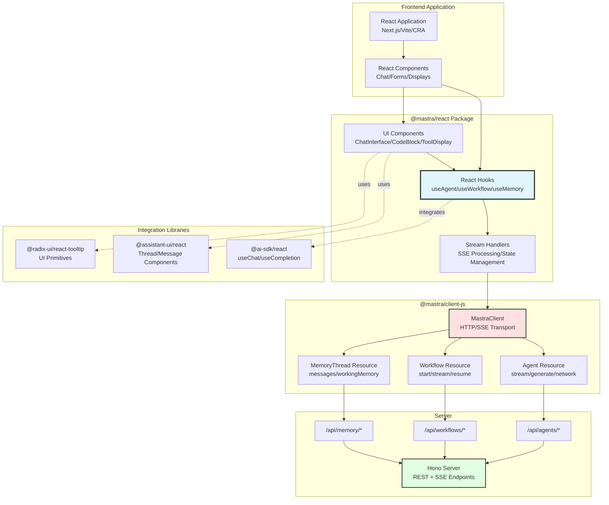
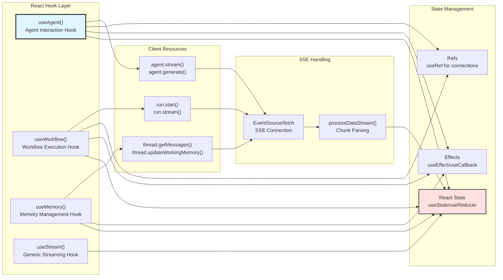
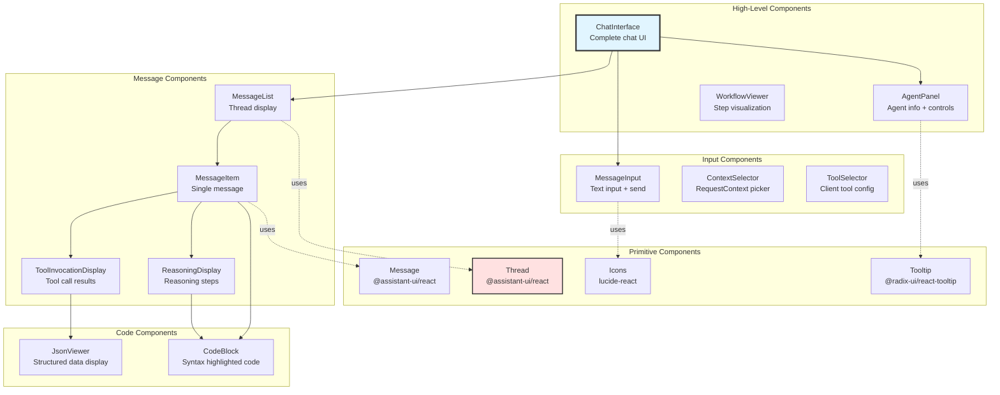
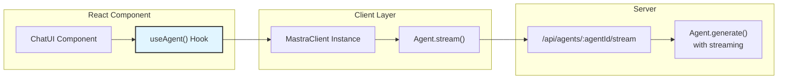
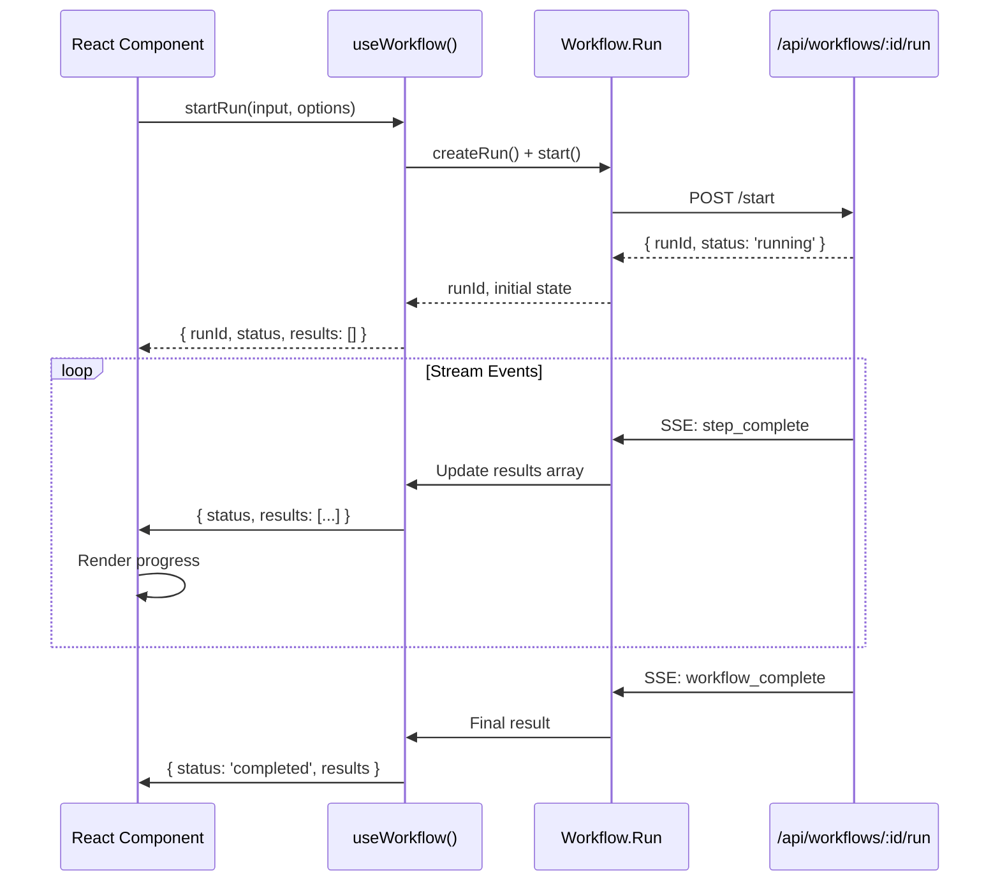
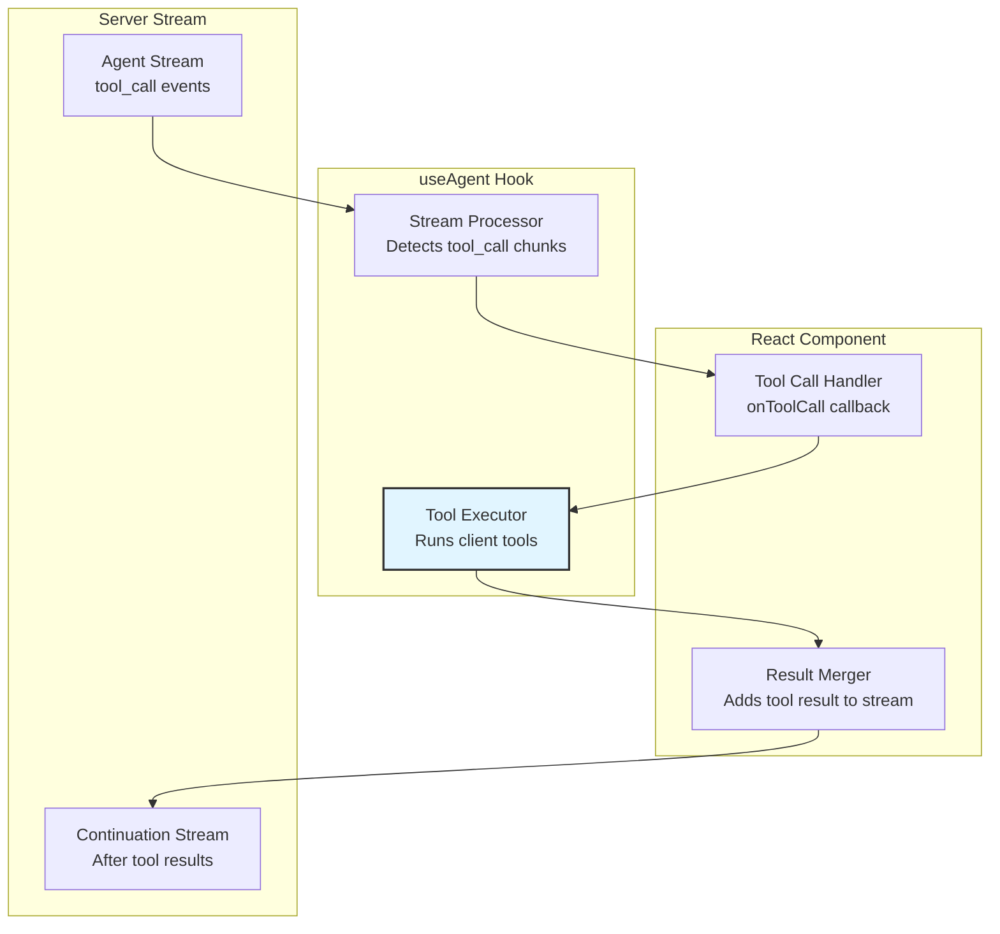
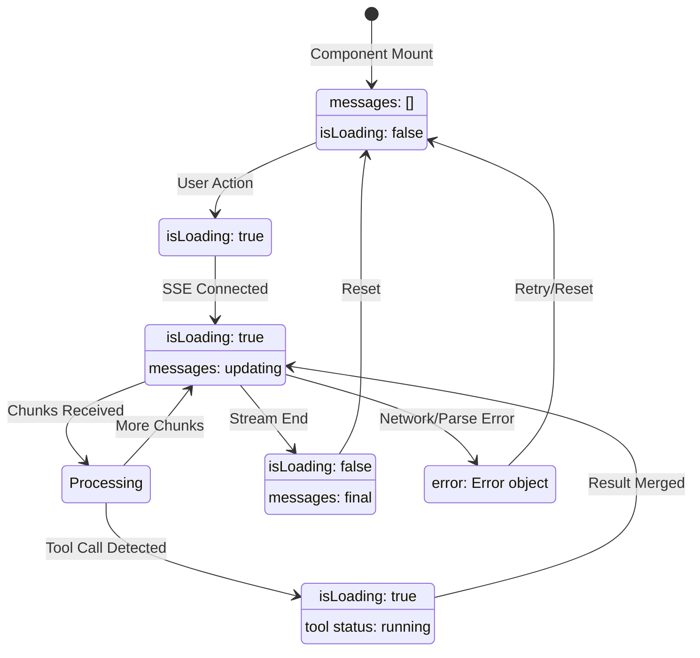
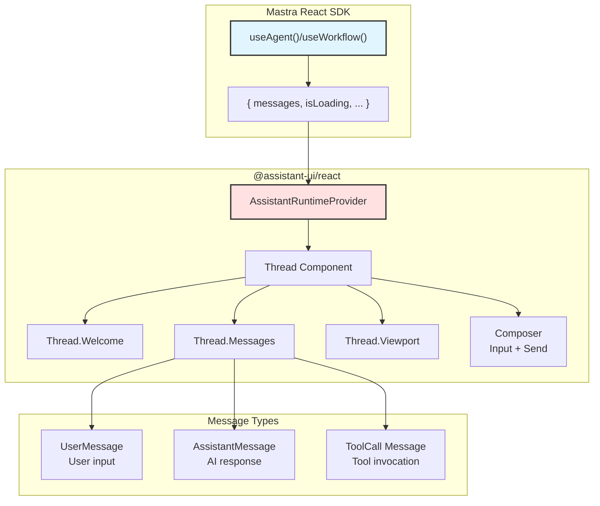

# React SDK and Hooks

<details>
<summary>Relevant source files</summary>

The following files were used as context for generating this wiki page:

- [.changeset/pre.json](.changeset/pre.json)
- [client-sdks/client-js/CHANGELOG.md](client-sdks/client-js/CHANGELOG.md)
- [client-sdks/client-js/package.json](client-sdks/client-js/package.json)
- [client-sdks/react/package.json](client-sdks/react/package.json)
- [deployers/cloudflare/CHANGELOG.md](deployers/cloudflare/CHANGELOG.md)
- [deployers/cloudflare/package.json](deployers/cloudflare/package.json)
- [deployers/netlify/CHANGELOG.md](deployers/netlify/CHANGELOG.md)
- [deployers/netlify/package.json](deployers/netlify/package.json)
- [deployers/vercel/CHANGELOG.md](deployers/vercel/CHANGELOG.md)
- [deployers/vercel/package.json](deployers/vercel/package.json)
- [examples/dane/CHANGELOG.md](examples/dane/CHANGELOG.md)
- [examples/dane/package.json](examples/dane/package.json)
- [package.json](package.json)
- [packages/cli/CHANGELOG.md](packages/cli/CHANGELOG.md)
- [packages/cli/package.json](packages/cli/package.json)
- [packages/core/CHANGELOG.md](packages/core/CHANGELOG.md)
- [packages/core/package.json](packages/core/package.json)
- [packages/create-mastra/CHANGELOG.md](packages/create-mastra/CHANGELOG.md)
- [packages/create-mastra/package.json](packages/create-mastra/package.json)
- [packages/deployer/CHANGELOG.md](packages/deployer/CHANGELOG.md)
- [packages/deployer/package.json](packages/deployer/package.json)
- [packages/mcp-docs-server/CHANGELOG.md](packages/mcp-docs-server/CHANGELOG.md)
- [packages/mcp-docs-server/package.json](packages/mcp-docs-server/package.json)
- [packages/mcp/CHANGELOG.md](packages/mcp/CHANGELOG.md)
- [packages/mcp/package.json](packages/mcp/package.json)
- [packages/playground-ui/CHANGELOG.md](packages/playground-ui/CHANGELOG.md)
- [packages/playground-ui/package.json](packages/playground-ui/package.json)
- [packages/playground/CHANGELOG.md](packages/playground/CHANGELOG.md)
- [packages/playground/package.json](packages/playground/package.json)
- [packages/server/CHANGELOG.md](packages/server/CHANGELOG.md)
- [packages/server/package.json](packages/server/package.json)
- [pnpm-lock.yaml](pnpm-lock.yaml)

</details>

This document covers the `@mastra/react` package, which provides React hooks and UI components for integrating Mastra agents and workflows into frontend applications. The React SDK wraps `@mastra/client-js` (documented in [10.1](#10.1)) and adds React-specific abstractions, including streaming hooks, UI components, and integration patterns.

For server-side API implementation details, see [9.1](#9.1). For JavaScript client operations, see [10.2](#10.2), [10.3](#10.3), and [10.4](#10.4).

---

## Architecture and Package Structure

The React SDK sits at the highest level of the client architecture, providing React-specific abstractions over the base JavaScript client.

### React SDK Architecture



**Sources:** [pnpm-lock.yaml:451-540](), [client-sdks/client-js/src/types.ts:1-270]()

---

## Package Dependencies and Peer Requirements

The `@mastra/react` package has a specific dependency structure that determines its capabilities and integration points.

### Dependency Overview

| Dependency Type         | Package                    | Version   | Purpose                            |
| ----------------------- | -------------------------- | --------- | ---------------------------------- |
| **Core**                | `@mastra/client-js`        | workspace | Base HTTP/SSE client functionality |
| **UI Framework**        | `react`                    | ≥19.0.0   | React runtime (peer dependency)    |
| **UI Framework**        | `react-dom`                | ≥19.0.0   | React DOM (peer dependency)        |
| **Styling**             | `tailwindcss`              | ^3.0.0    | CSS framework (peer dependency)    |
| **AI Integration**      | `@ai-sdk/react`            | ^2.0.57   | Vercel AI SDK React hooks          |
| **Chat UI**             | `@assistant-ui/react`      | ^0.12.10  | Chat interface components          |
| **UI Components**       | `@radix-ui/react-tooltip`  | ^1.2.7    | Accessible tooltips                |
| **Icons**               | `lucide-react`             | ^0.522.0  | Icon library                       |
| **Syntax Highlighting** | `shiki`                    | ^1.29.2   | Code syntax highlighting           |
| **JSX Rendering**       | `hast-util-to-jsx-runtime` | ^2.3.6    | AST to JSX conversion              |
| **Utility**             | `tailwind-merge`           | ^3.4.1    | Tailwind class merging             |
| **UUID**                | `@lukeed/uuid`             | ^2.0.1    | Unique ID generation               |

**Sources:** [pnpm-lock.yaml:451-540](), [client-sdks/react/package.json:1-73]()

### Installation

```bash
npm install @mastra/react @mastra/client-js react react-dom
# or
pnpm add @mastra/react @mastra/client-js react react-dom
# or
yarn add @mastra/react @mastra/client-js react react-dom
```

---

## React Hooks API

The React SDK provides hooks that wrap the JavaScript client methods with React state management and lifecycle handling.

### Hook Architecture



**Sources:** [client-sdks/client-js/src/resources/agent.ts:1-900](), [pnpm-lock.yaml:475-477]()

### Agent Hooks

Agent hooks provide state management for agent interactions with automatic handling of streaming responses, tool calls, and error states.

#### useAgent Hook Pattern

The `useAgent` hook (or similar agent interaction hooks) would typically provide:

- **State**: messages, loading status, error state, tool invocation tracking
- **Actions**: send message, stream response, handle tool calls, cancel requests
- **Effects**: connection lifecycle, cleanup on unmount
- **Refs**: abort controller, connection state

**Typical Usage Pattern:**

```typescript
// Pattern based on integration with @ai-sdk/react
const {
  messages,        // Array of messages in the conversation
  isLoading,       // Boolean indicating streaming/generation state
  error,           // Error object if operation failed
  append,          // Function to add user message
  reload,          // Function to regenerate last response
  stop,            // Function to abort streaming
  setMessages,     // Function to set message history
} = useAgent({
  agentId: 'my-agent',
  requestContext: { userId: 'user-123' },
  clientTools: { ... },
  onToolCall: async (toolCall) => { ... },
  onFinish: (result) => { ... },
});
```

**Key Features:**

- Automatic SSE connection management for streaming
- Tool call interception and client-side execution
- Message history state synchronization
- Abort signal handling for cancellation
- Error boundary integration

**Sources:** [client-sdks/client-js/src/resources/agent.ts:1-50](), [pnpm-lock.yaml:475-477]()

### Workflow Hooks

Workflow hooks manage workflow execution state, including run creation, step progression, and result collection.

#### useWorkflow Hook Pattern

The `useWorkflow` hook provides state management for workflow execution:

- **State**: run status, current step, execution results, error state
- **Actions**: start run, stream progress, resume suspended run, observe completed run
- **Effects**: polling for status updates, cleanup on unmount

**Typical Usage Pattern:**

```typescript
const {
  runId,           // Current run ID
  status,          // WorkflowRunStatus ('pending', 'running', 'completed', etc.)
  results,         // Array of step results
  error,           // Error object if workflow failed
  startRun,        // Function to initiate workflow
  streamRun,       // Function to stream workflow execution
  resumeRun,       // Function to resume suspended workflow
} = useWorkflow({
  workflowId: 'data-pipeline',
  requestContext: { userId: 'user-123' },
  onStepComplete: (step, result) => { ... },
  onComplete: (finalResult) => { ... },
});
```

**Sources:** [client-sdks/client-js/src/types.ts:200-250]()

### Memory Hooks

Memory hooks provide access to conversation threads and working memory management.

#### useMemory Hook Pattern

The `useMemory` hook manages thread state and memory operations:

- **State**: messages, working memory, loading state
- **Actions**: load messages, update working memory, add messages
- **Effects**: initial data loading, optimistic updates

**Typical Usage Pattern:**

```typescript
const {
  messages, // Array of MastraDBMessage objects
  workingMemory, // Current working memory state
  isLoading, // Loading state for operations
  loadMessages, // Function to fetch message history
  addMessage, // Function to append new message
  updateWorkingMemory, // Function to update working memory
} = useMemory({
  threadId: 'thread-456',
  resourceId: 'resource-789',
})
```

**Sources:** [client-sdks/client-js/src/types.ts:20-22]()

---

## UI Components

The React SDK provides pre-built UI components for common interaction patterns, leveraging `@assistant-ui/react` and `@radix-ui` primitives.

### Component Hierarchy



**Sources:** [pnpm-lock.yaml:459-473](), [pnpm-lock.yaml:478-480]()

### Code Syntax Highlighting

The React SDK uses `shiki` for syntax highlighting with support for multiple themes and languages.

**Implementation Pattern:**

- `shiki` generates syntax-highlighted HTML
- `hast-util-to-jsx-runtime` converts HTML AST to React components
- Components render with proper semantic structure and accessibility

**Sources:** [pnpm-lock.yaml:468-470]()

---

## Integration Patterns

The React SDK supports multiple integration patterns depending on application architecture and requirements.

### Pattern 1: Basic Agent Chat



**Configuration Steps:**

1. **Initialize Client** - Create `MastraClient` instance with server URL
2. **Setup Hook** - Use agent hook with agent ID and configuration
3. **Render UI** - Display messages and input components
4. **Handle Events** - Process streaming chunks and tool calls

**Sources:** [client-sdks/client-js/src/types.ts:51-70](), [packages/deployer/src/server/index.ts:240-250]()

### Pattern 2: Workflow Execution with Progress



**Sources:** [client-sdks/client-js/src/types.ts:200-212](), [packages/server/src/server/handlers/agents.ts:1-50]()

### Pattern 3: Client-Side Tool Execution

When tools are provided via `clientTools`, the React SDK intercepts tool calls for client-side execution.



**Tool Execution Flow:**

1. Server emits `tool_call` chunk with tool name and arguments
2. Hook intercepts and checks if tool exists in `clientTools`
3. If client-side, executes tool function and merges result
4. Server continues stream with tool result incorporated

**Sources:** [client-sdks/client-js/src/resources/agent.ts:300-400](), [client-sdks/client-js/src/types.ts:136-154]()

---

## Configuration and Setup

### MastraClient Configuration for React

The React hooks require a configured `MastraClient` instance, typically provided via React Context.

#### Client Provider Pattern

```typescript
// Typical provider setup (conceptual)
import { MastraClient } from '@mastra/client-js';
import { createContext, useContext } from 'react';

const MastraClientContext = createContext<MastraClient | null>(null);

export function MastraProvider({
  children,
  baseUrl = 'http://localhost:4111',
  apiPrefix = '/api',
  headers = {},
}: {
  children: React.ReactNode;
  baseUrl?: string;
  apiPrefix?: string;
  headers?: Record<string, string>;
}) {
  const client = new MastraClient({
    baseUrl,
    apiPrefix,
    headers,
    credentials: 'include',
  });

  return (
    <MastraClientContext.Provider value={client}>
      {children}
    </MastraClientContext.Provider>
  );
}

export function useMastraClient() {
  const client = useContext(MastraClientContext);
  if (!client) {
    throw new Error('useMastraClient must be used within MastraProvider');
  }
  return client;
}
```

**Sources:** [client-sdks/client-js/src/types.ts:51-70]()

### Environment-Specific Configuration

| Environment                  | Base URL                  | Credentials   | Notes                       |
| ---------------------------- | ------------------------- | ------------- | --------------------------- |
| **Development**              | `http://localhost:4111`   | `omit`        | Local dev server            |
| **Production (Same Origin)** | `''` (relative)           | `same-origin` | API on same domain          |
| **Production (CORS)**        | `https://api.example.com` | `include`     | Separate API domain         |
| **Tauri Desktop**            | `http://localhost:4111`   | `omit`        | Custom fetch implementation |

**Sources:** [client-sdks/client-js/src/types.ts:51-70]()

### RequestContext in React

React components can provide dynamic `RequestContext` to agents and workflows for per-request customization.

**Context Resolution:**

```typescript
// Static context
const { append } = useAgent({
  agentId: 'assistant',
  requestContext: { userId: 'user-123', sessionId: 'sess-456' },
})

// Dynamic context from React state
const [userId, setUserId] = useState('user-123')
const { append } = useAgent({
  agentId: 'assistant',
  requestContext: { userId, timestamp: Date.now() },
})
```

**Sources:** [client-sdks/client-js/src/types.ts:23-24]()

---

## Streaming and State Management

The React SDK handles complex streaming scenarios with proper state synchronization and error handling.

### Streaming State Lifecycle



**Sources:** [client-sdks/client-js/src/resources/agent.ts:1-50]()

### Optimistic Updates

The React SDK can perform optimistic updates for better perceived performance:

1. **User Message**: Immediately added to state before server confirmation
2. **Assistant Response**: Empty message added, populated as chunks arrive
3. **Tool Calls**: Status updated optimistically, results merged when available

**Sources:** [client-sdks/client-js/src/resources/agent.ts:200-300]()

---

## Error Handling

The React SDK provides comprehensive error handling for network failures, validation errors, and streaming interruptions.

### Error Types and Recovery

| Error Category       | Trigger              | Hook State                  | Recovery Strategy              |
| -------------------- | -------------------- | --------------------------- | ------------------------------ |
| **Network Error**    | Connection failure   | `error: NetworkError`       | Retry with exponential backoff |
| **Validation Error** | Invalid input schema | `error: ValidationError`    | Display field errors           |
| **Stream Interrupt** | Connection dropped   | `error: StreamError`        | Resume from last chunk         |
| **Tool Error**       | Client tool throws   | `error: ToolExecutionError` | Continue stream with error     |
| **Abort**            | User cancellation    | `error: AbortError`         | Clean state reset              |

**Error Handling Pattern:**

```typescript
const { error, reload } = useAgent({
  agentId: 'assistant',
  onError: (error) => {
    console.error('Agent error:', error);
    // Custom error handling
    if (error.category === 'network') {
      // Retry logic
    }
  },
});

// Display error in UI
if (error) {
  return <ErrorBoundary error={error} retry={reload} />;
}
```

**Sources:** [client-sdks/client-js/src/types.ts:51-70]()

---

## Assistant UI Integration

The React SDK integrates with `@assistant-ui/react` for production-ready chat interfaces with accessibility and customization support.

### Assistant UI Component Mapping



**Integration Steps:**

1. Transform Mastra messages to Assistant UI format
2. Provide runtime adapter for Assistant UI
3. Render Thread component with custom styling
4. Handle tool calls via Assistant UI callbacks

**Sources:** [pnpm-lock.yaml:478-480]()

---

## TypeScript Support

The React SDK provides full TypeScript support with generated types from the server schema.

### Type Safety Features

- **Hook Return Types**: Fully typed based on agent/workflow configuration
- **Message Types**: Type-safe message objects with discriminated unions
- **Tool Types**: Typed tool invocations and results
- **Schema Validation**: Runtime validation with Zod schemas
- **Generic Parameters**: Parameterized by input/output types

**Type Example:**

```typescript
// Fully typed hook usage
const {
  messages,    // UIMessage[]
  append,      // (message: UserMessage) => Promise<void>
  isLoading,   // boolean
  error,       // MastraError | null
} = useAgent({
  agentId: 'typed-agent',
  // TypeScript enforces correct requestContext shape
  requestContext: { userId: string, permissions: string[] },
});
```

**Sources:** [client-sdks/client-js/src/types.ts:1-270]()

---

## Performance Considerations

The React SDK implements several optimizations for production use:

### Optimization Strategies

1. **Memoization**: Hook results memoized to prevent unnecessary re-renders
2. **Debouncing**: Input events debounced for reduced API calls
3. **Connection Pooling**: Reuse SSE connections when possible
4. **Lazy Loading**: Components loaded on-demand
5. **Virtual Scrolling**: Message lists virtualized for large conversations

**Sources:** [pnpm-lock.yaml:451-540]()

### Bundle Size

The React SDK adds approximately:

- **Core hooks**: ~15KB gzipped
- **UI components**: ~30KB gzipped (with Assistant UI)
- **Syntax highlighting**: ~50KB gzipped (Shiki)

Tree-shaking removes unused components in production builds.

**Sources:** [client-sdks/react/package.json:1-73]()

---

## Related Documentation

- [10.1](#10.1) - JavaScript Client SDK (base client functionality)
- [10.2](#10.2) - Agent Client Operations (underlying agent methods)
- [10.3](#10.3) - Workflow Client Operations (underlying workflow methods)
- [10.4](#10.4) - Memory Client Operations (underlying memory methods)
- [9.2](#9.2) - Agent API Endpoints (server-side implementation)
- [9.3](#9.3) - Workflow API Endpoints (server-side implementation)
- [9.5](#9.5) - Streaming Architecture and SSE (streaming protocol)
