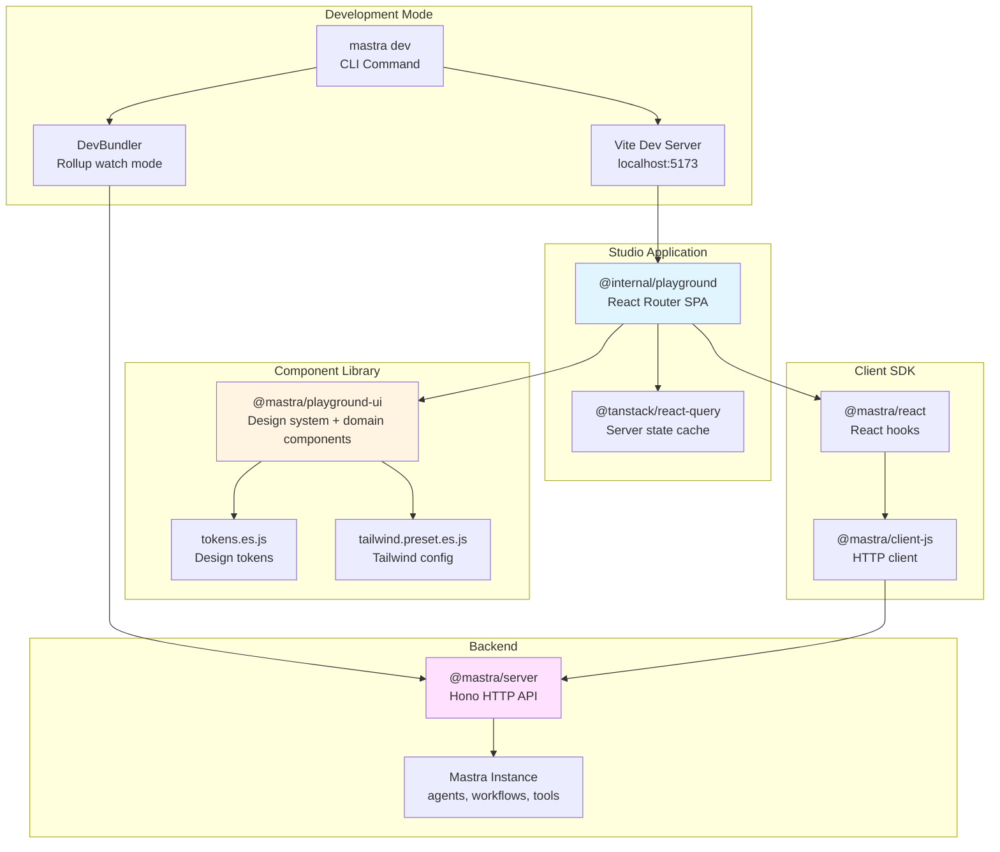
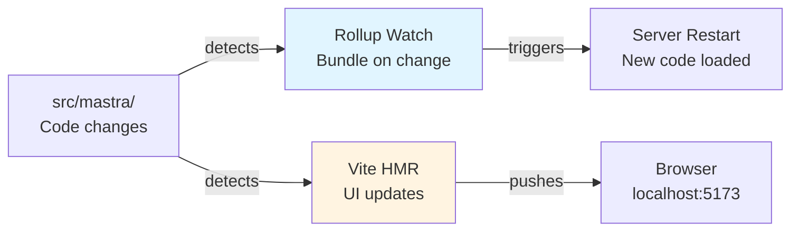
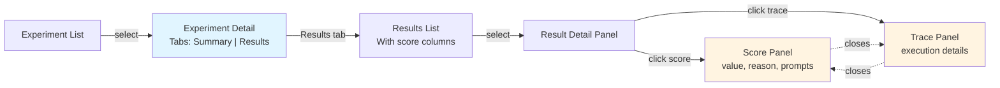
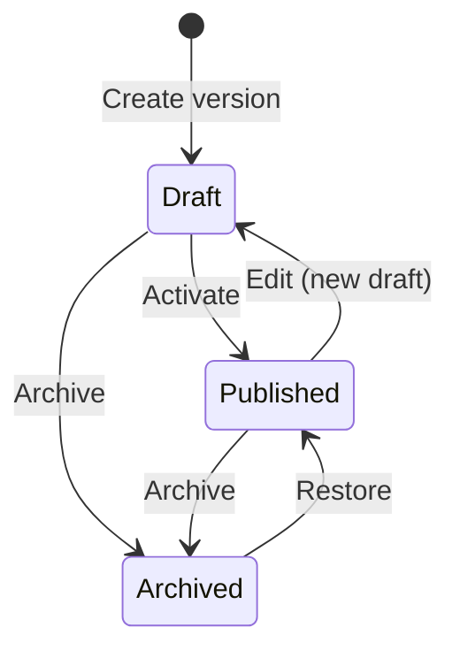
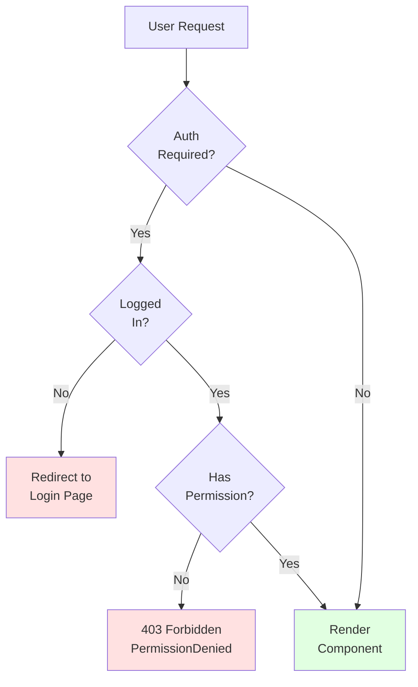
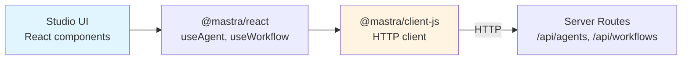

# Studio UI and Playground

<details>
<summary>Relevant source files</summary>

The following files were used as context for generating this wiki page:

- [.changeset/pre.json](.changeset/pre.json)
- [client-sdks/client-js/CHANGELOG.md](client-sdks/client-js/CHANGELOG.md)
- [client-sdks/client-js/package.json](client-sdks/client-js/package.json)
- [client-sdks/react/package.json](client-sdks/react/package.json)
- [deployers/cloudflare/CHANGELOG.md](deployers/cloudflare/CHANGELOG.md)
- [deployers/cloudflare/package.json](deployers/cloudflare/package.json)
- [deployers/cloudflare/src/index.ts](deployers/cloudflare/src/index.ts)
- [deployers/netlify/CHANGELOG.md](deployers/netlify/CHANGELOG.md)
- [deployers/netlify/package.json](deployers/netlify/package.json)
- [deployers/netlify/src/index.ts](deployers/netlify/src/index.ts)
- [deployers/vercel/CHANGELOG.md](deployers/vercel/CHANGELOG.md)
- [deployers/vercel/package.json](deployers/vercel/package.json)
- [deployers/vercel/src/index.ts](deployers/vercel/src/index.ts)
- [docs/src/content/en/docs/deployment/studio.mdx](docs/src/content/en/docs/deployment/studio.mdx)
- [e2e-tests/monorepo/monorepo.test.ts](e2e-tests/monorepo/monorepo.test.ts)
- [e2e-tests/monorepo/template/apps/custom/src/mastra/index.ts](e2e-tests/monorepo/template/apps/custom/src/mastra/index.ts)
- [examples/dane/CHANGELOG.md](examples/dane/CHANGELOG.md)
- [examples/dane/package.json](examples/dane/package.json)
- [package.json](package.json)
- [packages/cli/CHANGELOG.md](packages/cli/CHANGELOG.md)
- [packages/cli/package.json](packages/cli/package.json)
- [packages/cli/src/commands/build/BuildBundler.ts](packages/cli/src/commands/build/BuildBundler.ts)
- [packages/cli/src/commands/build/build.ts](packages/cli/src/commands/build/build.ts)
- [packages/cli/src/commands/dev/DevBundler.ts](packages/cli/src/commands/dev/DevBundler.ts)
- [packages/cli/src/commands/dev/dev.ts](packages/cli/src/commands/dev/dev.ts)
- [packages/cli/src/commands/studio/studio.test.ts](packages/cli/src/commands/studio/studio.test.ts)
- [packages/cli/src/commands/studio/studio.ts](packages/cli/src/commands/studio/studio.ts)
- [packages/core/CHANGELOG.md](packages/core/CHANGELOG.md)
- [packages/core/package.json](packages/core/package.json)
- [packages/core/src/bundler/index.ts](packages/core/src/bundler/index.ts)
- [packages/create-mastra/CHANGELOG.md](packages/create-mastra/CHANGELOG.md)
- [packages/create-mastra/package.json](packages/create-mastra/package.json)
- [packages/deployer/CHANGELOG.md](packages/deployer/CHANGELOG.md)
- [packages/deployer/package.json](packages/deployer/package.json)
- [packages/deployer/src/build/analyze.ts](packages/deployer/src/build/analyze.ts)
- [packages/deployer/src/build/analyze/**snapshots**/analyzeEntry.test.ts.snap](packages/deployer/src/build/analyze/__snapshots__/analyzeEntry.test.ts.snap)
- [packages/deployer/src/build/analyze/analyzeEntry.test.ts](packages/deployer/src/build/analyze/analyzeEntry.test.ts)
- [packages/deployer/src/build/analyze/analyzeEntry.ts](packages/deployer/src/build/analyze/analyzeEntry.ts)
- [packages/deployer/src/build/analyze/bundleExternals.test.ts](packages/deployer/src/build/analyze/bundleExternals.test.ts)
- [packages/deployer/src/build/analyze/bundleExternals.ts](packages/deployer/src/build/analyze/bundleExternals.ts)
- [packages/deployer/src/build/bundler.ts](packages/deployer/src/build/bundler.ts)
- [packages/deployer/src/build/utils.test.ts](packages/deployer/src/build/utils.test.ts)
- [packages/deployer/src/build/utils.ts](packages/deployer/src/build/utils.ts)
- [packages/deployer/src/build/watcher.test.ts](packages/deployer/src/build/watcher.test.ts)
- [packages/deployer/src/build/watcher.ts](packages/deployer/src/build/watcher.ts)
- [packages/deployer/src/bundler/index.ts](packages/deployer/src/bundler/index.ts)
- [packages/deployer/src/server/**tests**/option-studio-base.test.ts](packages/deployer/src/server/__tests__/option-studio-base.test.ts)
- [packages/deployer/src/server/index.ts](packages/deployer/src/server/index.ts)
- [packages/mcp-docs-server/CHANGELOG.md](packages/mcp-docs-server/CHANGELOG.md)
- [packages/mcp-docs-server/package.json](packages/mcp-docs-server/package.json)
- [packages/mcp/CHANGELOG.md](packages/mcp/CHANGELOG.md)
- [packages/mcp/package.json](packages/mcp/package.json)
- [packages/playground-ui/CHANGELOG.md](packages/playground-ui/CHANGELOG.md)
- [packages/playground-ui/package.json](packages/playground-ui/package.json)
- [packages/playground/CHANGELOG.md](packages/playground/CHANGELOG.md)
- [packages/playground/e2e/tests/auth/infrastructure.spec.ts](packages/playground/e2e/tests/auth/infrastructure.spec.ts)
- [packages/playground/e2e/tests/auth/viewer-role.spec.ts](packages/playground/e2e/tests/auth/viewer-role.spec.ts)
- [packages/playground/index.html](packages/playground/index.html)
- [packages/playground/package.json](packages/playground/package.json)
- [packages/playground/src/App.tsx](packages/playground/src/App.tsx)
- [packages/playground/src/components/ui/app-sidebar.tsx](packages/playground/src/components/ui/app-sidebar.tsx)
- [packages/server/CHANGELOG.md](packages/server/CHANGELOG.md)
- [packages/server/package.json](packages/server/package.json)
- [pnpm-lock.yaml](pnpm-lock.yaml)

</details>

This document covers the Mastra Studio UI and Playground system, which provides a visual interface for building, testing, and managing agents, workflows, datasets, and experiments. Studio is a web application that runs during development (`mastra dev`) and can be deployed alongside your API in production.

For information about the HTTP server that Studio communicates with, see [Server and API Layer](#9). For client SDK integration, see [JavaScript Client SDK](#10.1) and [React SDK and Hooks](#10.5).

---

## Architecture Overview

The Studio system consists of two main packages:

1. **`@mastra/playground-ui`** — Reusable React component library
2. **`@internal/playground`** — Standalone web application consuming the UI library



**Diagram: Studio Architecture and Package Dependencies**

Sources: [packages/playground/package.json](), [packages/playground-ui/package.json](), [packages/cli/package.json]()

---

## Package Structure

### @mastra/playground-ui

The `@mastra/playground-ui` package exports:

| Export              | Type   | Purpose                                     |
| ------------------- | ------ | ------------------------------------------- |
| `.`                 | ES/UMD | React components                            |
| `./style.css`       | CSS    | Component styles                            |
| `./tokens`          | ES/CJS | Design tokens (colors, spacing, typography) |
| `./tailwind-preset` | ES/CJS | Tailwind configuration preset               |
| `./utils`           | ES/CJS | Utility functions                           |

Key dependencies:

- `@assistant-ui/react` — AI chat UI primitives
- `@autoform/react` — Dynamic form generation from schemas
- `@codemirror/*` — Code editor components
- `@xyflow/react` — Workflow graph visualization
- `@radix-ui/*` — Unstyled UI primitives
- `react-hook-form` + `@hookform/resolvers` — Form management

Sources: [packages/playground-ui/package.json:1-191]()

### @internal/playground

The standalone application that consumes the UI library. Built with Vite and uses React Router for navigation.

Key routes (inferred from typical Studio structure):

- `/agents` — Agent list and detail pages
- `/workflows` — Workflow list and graph visualization
- `/datasets` — Dataset management and comparison
- `/experiments` — Experiment results and scoring
- `/tools` — Tool registry
- `/auth` — Login/signup when auth is enabled

Sources: [packages/playground/package.json:1-62]()

---

## Development Workflow

### Starting the Dev Server

The `mastra dev` command starts both the API server and Studio UI:

```bash
mastra dev
```

This command:

1. Bundles the Mastra project using `DevBundler` with Rollup watch mode
2. Starts the HTTP server with hot reload
3. Launches Vite dev server for Studio at `http://localhost:5173`

The `DevBundler` watches for file changes and triggers server restarts while Vite provides instant HMR (Hot Module Replacement) for UI updates.

Sources: [packages/cli/package.json:1-110](), [packages/cli/CHANGELOG.md:1-110]()



**Diagram: Hot Reload Mechanism**

Sources: [packages/cli/CHANGELOG.md:1-110]()

### Base Path Configuration

For subpath deployments (e.g., `https://example.com/studio/`), set:

```bash
MASTRA_STUDIO_BASE_PATH=/studio
```

Studio will use this base path for routing and static asset loading.

Sources: [packages/cli/CHANGELOG.md:11]()

---

## Visual Components and Features

### Agent Builder

The agent builder provides:

- **Agent list view** — Table with status badges (Published, Draft, hasDraft)
- **Agent detail page** — Edit instructions, model configuration, tools, memory settings
- **Version combobox** — Switch between versions with status indicators
- **Clone agent** — Duplicate existing agent configuration
- **Create agent** — Scaffold new agent with wizard

When `@mastra/agent-builder` is installed, the "Create an agent" button and editor features appear in Studio. The build command writes package metadata to `.mastra/packages.json` so Studio can detect installed packages at runtime.

Sources: [packages/cli/CHANGELOG.md:37-38](), [packages/playground-ui/CHANGELOG.md:7-9]()

### Workflow Visualization

Workflows are rendered using `@xyflow/react` with:

- **Node types** — Step, Parallel, Branch, Loop, Foreach
- **Edge routing** — Control flow visualization
- **Run history** — Step-by-step execution path tracking
- **Suspend/resume UI** — Visual indicators for paused workflows

The workflow graph shows the `stepExecutionPath` array to highlight which steps actually ran during execution.

Sources: [packages/playground-ui/package.json:111](), [packages/core/CHANGELOG.md:31-61]()

### Dataset Management

Studio provides dataset operations:

- **List datasets** — Searchable combobox header for quick filtering
- **Compare items** — Side-by-side diff view for dataset entries
- **Compare versions** — Track changes across dataset versions
- **Experiments** — Link datasets to experiment runs

The comparison views use a diff algorithm to highlight differences between entries.

Sources: [packages/create-mastra/CHANGELOG.md:19-29]()

### Experiment Results

Experiment pages include:

**Summary tab:**

- `ExperimentScorerSummary` — Per-scorer average scores
- Aggregated metrics across all runs

**Results tab:**

- Master-detail column layout
- Score columns in results list
- `ExperimentScorePanel` — Opens as column when clicking score row
- Shows score value, reason, input/output, LLM prompts (preprocess, analyze, generate score, generate reason)
- Prev/next navigation between scores within a result

The score detail panel and trace panel are mutually exclusive — opening one closes the other.

Sources: [packages/cli/CHANGELOG.md:13-33]()



**Diagram: Experiment Results Navigation**

Sources: [packages/cli/CHANGELOG.md:13-33]()

---

## Version Management UI

Studio integrates with the editor version system:

### Version State Badges

| State     | Color   | Meaning                                   |
| --------- | ------- | ----------------------------------------- |
| Published | Green   | Active version, served by default         |
| Draft     | —       | Editable, not active                      |
| hasDraft  | Colored | Published version has unpublished changes |

### Version Combobox

The version selector allows:

- Listing all versions with status filtering (`?status=draft/published/archived`)
- Switching between versions
- Activating draft versions (updates `activeVersionId`)
- Restoring archived versions

The combobox shows `resolvedVersionId` to indicate which version is currently displayed.

Sources: [packages/core/CHANGELOG.md:1-1000]() (version management sections)



**Diagram: Version State Machine in UI**

Sources: [packages/core/CHANGELOG.md]() (version management)

---

## Authentication and Permissions

When an auth provider is configured on the Mastra instance, Studio displays:

### Auth UI Components

- **Login page** — Email/password or SSO provider buttons
- **Signup page** — User registration form
- **Logout** — Session termination
- **Session validation** — Automatic token refresh

### Permission-Gated Components

Studio enforces route-level permissions using RBAC:

- `AuthRequired` wrapper — Redirects to login if unauthenticated
- `usePermissions` hook — Checks user permissions
- `PermissionDenied` component — Shows 403 error for forbidden actions
- **Table views** — Filter out rows user doesn't have permission to see

When no auth is configured, all permissions default to permissive (backward compatible).

Sources: [packages/playground-ui/CHANGELOG.md:7-9]()



**Diagram: Permission Enforcement Flow**

Sources: [packages/playground-ui/CHANGELOG.md:7-9]()

---

## Deployment Options

### Development Mode

Studio runs on `http://localhost:5173` during `mastra dev`. The Vite dev server provides HMR and fast refresh.

### Built Output

The `mastra build` command can include Studio in the deployment:

#### Vercel Deployment

Enable Studio as static assets served from Edge CDN:

```typescript
import { VercelDeployer } from '@mastra/deployer-vercel'

new VercelDeployer({
  studio: true,
})
```

Studio files are written to `.vercel/output/static/` and served without invoking serverless functions.

Sources: [deployers/vercel/CHANGELOG.md:7-18]()

#### Cloudflare Workers

Studio cannot be deployed to Cloudflare Workers (browser platform). Use a separate static hosting solution or proxy Studio from a different origin.

#### Generic Node.js

The built server can serve Studio via static file middleware. The Studio files are bundled into the `dist/` directory.

---

## Configuration and Environment Variables

### Studio Base Path

```bash
# Subpath deployment
MASTRA_STUDIO_BASE_PATH=/studio
```

Used by:

- Router base URL
- Static asset paths
- API endpoint prefix

### Package Detection

Studio detects installed Mastra packages by reading `.mastra/packages.json`, generated during build. This file contains:

```json
{
  "@mastra/agent-builder": "1.0.9",
  "@mastra/evals": "1.1.2"
}
```

Studio uses this to show/hide CMS features like "Create an agent" button.

Sources: [packages/cli/CHANGELOG.md:37-38]()

### PostHog Analytics

Studio includes PostHog for telemetry:

```typescript
import { PosthogProvider } from '@posthog/react'

// Telemetry events:
// - cli_command
// - cli_model_provider_selected
// - cli_template_used
```

Users can opt out of telemetry via environment variable or CLI flag.

Sources: [packages/playground/package.json:38-39]()

---

## Component Library Design System

### Design Tokens

The `@mastra/playground-ui/tokens` export provides:

- Color palette
- Typography scale
- Spacing system
- Border radii
- Shadow definitions

These tokens are consumed by both the Studio application and external projects using the component library.

### Tailwind Preset

The `@mastra/playground-ui/tailwind-preset` export configures:

- Custom color classes
- Extended spacing scale
- Component-specific utilities
- Container queries support (via `@tailwindcss/container-queries`)

External projects can extend this preset:

```javascript
import mastraPreset from '@mastra/playground-ui/tailwind-preset'

export default {
  presets: [mastraPreset],
  content: ['./src/**/*.{ts,tsx}'],
}
```

Sources: [packages/playground-ui/package.json:31-40]()

---

## Key React Patterns

### State Management

Studio uses `@tanstack/react-query` for server state:

```typescript
// Example: Fetching agent list
const { data: agents } = useQuery({
  queryKey: ['agents'],
  queryFn: () => client.agents.list(),
})
```

React Query handles:

- Caching
- Automatic refetching
- Loading and error states
- Optimistic updates

### Form Handling

Forms use `react-hook-form` with Zod schema validation:

```typescript
import { zodResolver } from '@hookform/resolvers/zod'
import { useForm } from 'react-hook-form'
import { z } from 'zod'

const schema = z.object({
  name: z.string().min(1),
  instructions: z.string(),
})

const form = useForm({
  resolver: zodResolver(schema),
})
```

The `@autoform/react` library generates forms from Zod schemas automatically for structured output configuration.

Sources: [packages/playground-ui/package.json:74-75,87,117-118]()

---

## Studio API Communication

Studio communicates with the backend via `@mastra/client-js`:



**Diagram: Studio Communication Stack**

The client SDK handles:

- Credential management (API keys, session tokens)
- Request retries with exponential backoff
- SSE stream parsing for agent responses
- Zod schema conversion to JSON Schema

Sources: [client-sdks/client-js/package.json:1-72](), [client-sdks/react/package.json:1-100]()

---

## Build Process

The Studio build process follows these steps:

1. **UI Library Build**

   ```bash
   cd packages/playground-ui
   pnpm build
   # Outputs: dist/index.es.js, dist/style.css
   ```

2. **Application Build**

   ```bash
   cd packages/playground
   pnpm build
   # Outputs: dist/ (Vite production build)
   ```

3. **Integration with Deployer**
   ```bash
   mastra build
   # Copies Studio dist/ to deployment output
   # Generates .mastra/packages.json for package detection
   ```

The built Studio assets are optimized for production:

- Tree-shaking removes unused components
- CSS is minified and scoped
- Static assets are hashed for caching

Sources: [packages/playground-ui/package.json:54](), [packages/playground/package.json:22]()
