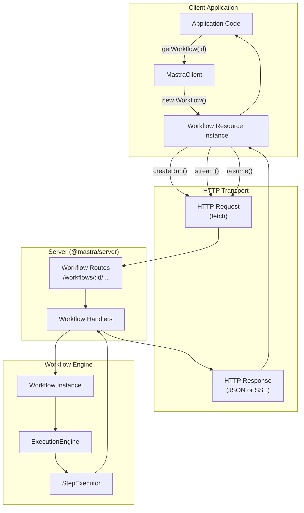
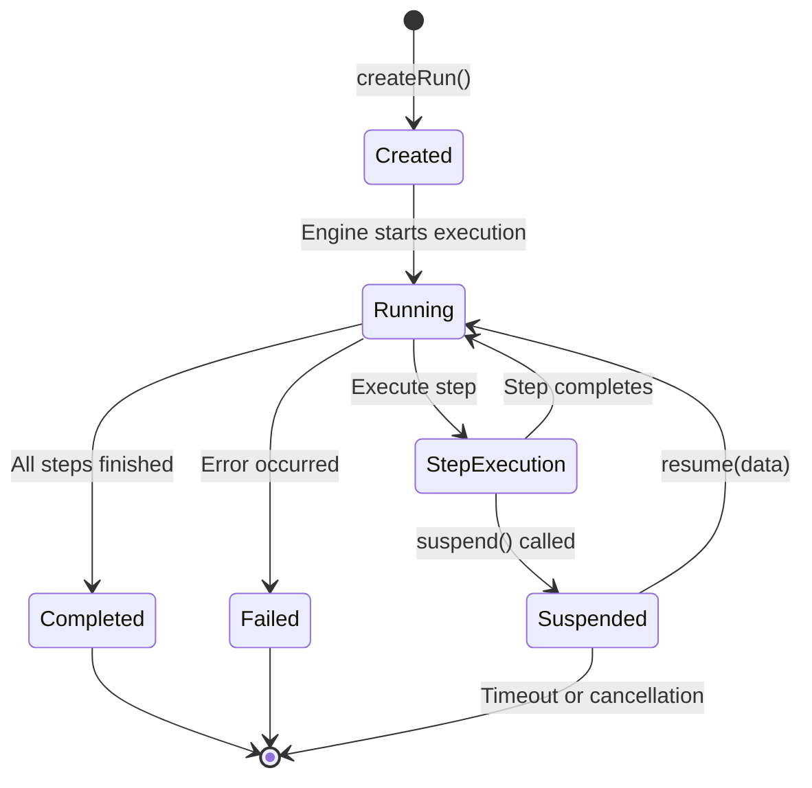
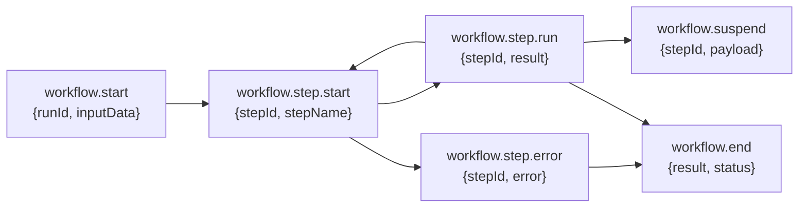

# Workflow Client Operations

<details>
<summary>Relevant source files</summary>

The following files were used as context for generating this wiki page:

- [client-sdks/client-js/src/client.ts](client-sdks/client-js/src/client.ts)
- [client-sdks/client-js/src/resources/agent.test.ts](client-sdks/client-js/src/resources/agent.test.ts)
- [client-sdks/client-js/src/resources/agent.ts](client-sdks/client-js/src/resources/agent.ts)
- [client-sdks/client-js/src/resources/agent.vnext.test.ts](client-sdks/client-js/src/resources/agent.vnext.test.ts)
- [client-sdks/client-js/src/resources/index.ts](client-sdks/client-js/src/resources/index.ts)
- [client-sdks/client-js/src/types.ts](client-sdks/client-js/src/types.ts)
- [e2e-tests/create-mastra/create-mastra.test.ts](e2e-tests/create-mastra/create-mastra.test.ts)
- [packages/core/src/agent/**tests**/dynamic-model-fallback.test.ts](packages/core/src/agent/__tests__/dynamic-model-fallback.test.ts)
- [packages/core/src/memory/mock.ts](packages/core/src/memory/mock.ts)
- [packages/core/src/storage/mock.test.ts](packages/core/src/storage/mock.test.ts)
- [packages/core/src/stream/aisdk/v5/transform.test.ts](packages/core/src/stream/aisdk/v5/transform.test.ts)
- [packages/core/src/stream/aisdk/v5/transform.ts](packages/core/src/stream/aisdk/v5/transform.ts)
- [packages/server/src/server/handlers.ts](packages/server/src/server/handlers.ts)
- [packages/server/src/server/handlers/agent.test.ts](packages/server/src/server/handlers/agent.test.ts)
- [packages/server/src/server/handlers/agents.ts](packages/server/src/server/handlers/agents.ts)
- [packages/server/src/server/handlers/memory.test.ts](packages/server/src/server/handlers/memory.test.ts)
- [packages/server/src/server/handlers/memory.ts](packages/server/src/server/handlers/memory.ts)
- [packages/server/src/server/handlers/utils.test.ts](packages/server/src/server/handlers/utils.test.ts)
- [packages/server/src/server/handlers/utils.ts](packages/server/src/server/handlers/utils.ts)
- [packages/server/src/server/handlers/vector.test.ts](packages/server/src/server/handlers/vector.test.ts)
- [packages/server/src/server/schemas/memory.test.ts](packages/server/src/server/schemas/memory.test.ts)
- [packages/server/src/server/schemas/memory.ts](packages/server/src/server/schemas/memory.ts)

</details>

## Purpose and Scope

This document covers client-side workflow operations provided by the `@mastra/client-js` package, including listing workflows, creating and managing workflow runs, streaming execution, and time-travel debugging. For workflow definition and orchestration concepts, see [Workflow System](#4). For server-side workflow API endpoints, see [Workflow API Endpoints](#9.3). For agent client operations, see [Agent Client Operations](#10.2).

The workflow client provides a TypeScript interface for executing workflows remotely via HTTP, monitoring their execution state, and managing long-running or suspended workflows.

**Sources:** [client-sdks/client-js/src/types.ts:194-247](), [client-sdks/client-js/src/client.ts:388-415]()

## Client-Server Architecture

The workflow client operates as a thin wrapper over HTTP endpoints, translating TypeScript method calls into REST API requests and handling streaming responses.



**Execution Flow:**

1. Application calls `client.getWorkflow(workflowId)` to obtain a `Workflow` resource instance
2. Resource methods (`createRun()`, `stream()`, `resume()`) construct HTTP requests
3. Server routes dispatch to workflow handlers
4. Handlers invoke workflow engine execution
5. Results stream back through HTTP (SSE for streaming, JSON for synchronous)

**Sources:** [client-sdks/client-js/src/client.ts:388-415]()

## Listing and Retrieving Workflows

### Listing All Workflows

The `listWorkflows()` method retrieves all registered workflows with their metadata:

```typescript
const workflows = await client.listWorkflows(requestContext?, partial?);
// Returns: Record<string, GetWorkflowResponse>
```

**Parameters:**

- `requestContext` (optional): Request context for dynamic workflow resolution
- `partial` (optional): Whether to return partial workflow data without full step graph

**Response Structure** (`GetWorkflowResponse`):

| Field                  | Type                              | Description                                  |
| ---------------------- | --------------------------------- | -------------------------------------------- |
| `name`                 | `string`                          | Workflow display name                        |
| `description`          | `string?`                         | Purpose description                          |
| `steps`                | `Record<string, StepMetadata>`    | Top-level steps only                         |
| `allSteps`             | `Record<string, StepMetadata>`    | All steps including nested workflow steps    |
| `stepGraph`            | `Workflow['serializedStepGraph']` | Execution graph structure                    |
| `inputSchema`          | `string`                          | JSON schema for workflow input               |
| `outputSchema`         | `string`                          | JSON schema for workflow output              |
| `stateSchema`          | `string`                          | JSON schema for workflow state               |
| `requestContextSchema` | `string?`                         | JSON schema for context validation           |
| `isProcessorWorkflow`  | `boolean?`                        | Whether auto-generated from agent processors |

**StepMetadata Structure:**

| Field           | Type                       | Description                                            |
| --------------- | -------------------------- | ------------------------------------------------------ |
| `id`            | `string`                   | Unique step identifier                                 |
| `description`   | `string`                   | Step purpose description                               |
| `inputSchema`   | `string`                   | JSON schema for step input                             |
| `outputSchema`  | `string`                   | JSON schema for step output                            |
| `resumeSchema`  | `string`                   | JSON schema for resume data                            |
| `suspendSchema` | `string`                   | JSON schema for suspend payload                        |
| `stateSchema`   | `string`                   | JSON schema for step state                             |
| `isWorkflow`    | `boolean`                  | Whether step is a nested workflow (only in `allSteps`) |
| `metadata`      | `Record<string, unknown>?` | Additional step metadata                               |

**Sources:** [client-sdks/client-js/src/client.ts:388-406](), [client-sdks/client-js/src/types.ts:211-247]()

### Getting a Workflow Resource

The `getWorkflow()` method returns a `Workflow` resource instance for a specific workflow:

```typescript
const workflow = client.getWorkflow(workflowId)
```

This returns a resource object with methods for creating runs, streaming execution, and managing workflow lifecycle.

**Sources:** [client-sdks/client-js/src/client.ts:408-415]()

## Workflow Run Lifecycle



**Run States:**

| State       | Description                 | Can Resume? |
| ----------- | --------------------------- | ----------- |
| `pending`   | Run created but not started | N/A         |
| `running`   | Currently executing steps   | No          |
| `suspended` | Paused awaiting resume data | Yes         |
| `completed` | Successfully finished       | No          |
| `failed`    | Terminated with error       | No          |

**Sources:** [client-sdks/client-js/src/types.ts:194-247](), [packages/core/src/storage/types.ts:7]()

## Creating and Managing Workflow Runs

### Creating a Run

Create a workflow run with input data and optional parameters:

```typescript
const result = await workflow.createRun({
  inputData: { key: 'value' },
  requestContext?: RequestContext,
  tracingOptions?: TracingOptions,
  initialState?: Record<string, any>,
  resumeData?: Record<string, any>,
});
```

**Parameters:**

| Parameter        | Type                   | Description                            |
| ---------------- | ---------------------- | -------------------------------------- |
| `inputData`      | `Record<string, any>`  | Input data for workflow                |
| `requestContext` | `RequestContext?`      | Request context for dynamic resolution |
| `tracingOptions` | `TracingOptions?`      | Distributed tracing configuration      |
| `initialState`   | `Record<string, any>?` | Pre-populated workflow state           |
| `resumeData`     | `Record<string, any>?` | Data for resuming at specific step     |

**Response** (`WorkflowRunResult`):

- Synchronous execution returns complete result with all step outputs
- For long-running workflows, use streaming instead

**Sources:** [client-sdks/client-js/src/types.ts:249]()

### Listing Workflow Runs

Retrieve runs for a workflow with filtering and pagination:

```typescript
const runs = await workflow.listRuns({
  fromDate?: Date,
  toDate?: Date,
  page?: number,
  perPage?: number,
  resourceId?: string,
  status?: WorkflowRunStatus,
});
```

**Parameters** (`ListWorkflowRunsParams`):

| Parameter    | Type                 | Description                          |
| ------------ | -------------------- | ------------------------------------ |
| `fromDate`   | `Date?`              | Filter runs created after this date  |
| `toDate`     | `Date?`              | Filter runs created before this date |
| `page`       | `number?`            | Zero-indexed page number             |
| `perPage`    | `number \| false?`   | Items per page or `false` for all    |
| `resourceId` | `string?`            | Filter by resource identifier        |
| `status`     | `WorkflowRunStatus?` | Filter by run status                 |

**Response** (`ListWorkflowRunsResponse`):

```typescript
interface ListWorkflowRunsResponse {
  runs: WorkflowRun[]
  total: number
  // Pagination details
}
```

**Sources:** [client-sdks/client-js/src/types.ts:194-207]()

### Getting Run Status

Retrieve detailed state for a specific run:

```typescript
const state = await workflow.getRunById(runId)
// Returns: WorkflowState
```

**Response** (`GetWorkflowRunByIdResponse`):

- Full workflow state including step results
- Current execution position
- Suspend state if applicable

**Sources:** [client-sdks/client-js/src/types.ts:209]()

## Streaming Workflow Execution

Streaming enables real-time monitoring of long-running workflows with step-by-step progress updates.

### Stream Method

```typescript
const stream = await workflow.stream({
  inputData: { key: 'value' },
  requestContext?: RequestContext,
  tracingOptions?: TracingOptions,
  initialState?: Record<string, any>,
});

for await (const chunk of stream) {
  // Process chunk
}
```

**Stream Chunk Types:**



**Chunk Structure:**

| Event Type            | Payload                                 |
| --------------------- | --------------------------------------- |
| `workflow.start`      | `{runId, inputData, timestamp}`         |
| `workflow.step.start` | `{stepId, stepName, timestamp}`         |
| `workflow.step.run`   | `{stepId, result, duration}`            |
| `workflow.step.error` | `{stepId, error, timestamp}`            |
| `workflow.suspend`    | `{stepId, suspendPayload, resumeLabel}` |
| `workflow.end`        | `{result, status, duration, steps}`     |

**Sources:** Inferred from workflow streaming patterns in [Workflow System](#4.6)

## Suspend and Resume Operations

Workflows can suspend execution to await external input (human-in-the-loop) and resume from the suspension point.

### Suspend Mechanism

When a workflow step calls `suspend(payload)`:

1. Execution pauses at the current step
2. Client receives `workflow.suspend` chunk with suspension details
3. Run state transitions to `suspended`
4. Workflow awaits `resume()` call with required data

**Suspend Payload:**

- Describes what data/approval is needed
- Includes `resumeLabel` for identifying the suspension point
- May include validation schema for resume data

### Resume Method

```typescript
const result = await workflow.resume({
  runId: 'run-id',
  resumeData: { approved: true },
  stepId?: 'step-id',
  requestContext?: RequestContext,
});
```

**Parameters:**

| Parameter        | Type                  | Description                            |
| ---------------- | --------------------- | -------------------------------------- |
| `runId`          | `string`              | Workflow run identifier                |
| `resumeData`     | `Record<string, any>` | Data to resume with                    |
| `stepId`         | `string?`             | Specific step to resume at             |
| `requestContext` | `RequestContext?`     | Request context for dynamic resolution |

**Resume Behavior:**

- Validates `resumeData` against step's `resumeSchema`
- Injects data into workflow state at suspension point
- Continues execution from the suspended step
- Can resume multiple times if workflow suspends again

**Sources:** Inferred from [Suspend and Resume Mechanism](#4.4)

## Time-Travel Debugging

Time-travel enables re-executing portions of a workflow from a previous run's state, useful for debugging or testing modifications.

### Time-Travel Method

```typescript
const result = await workflow.timeTravel({
  step: 'step-id' | ['step-1', 'step-2'],
  inputData?: Record<string, any>,
  resumeData?: Record<string, any>,
  initialState?: Record<string, any>,
  context?: TimeTravelContext,
  nestedStepsContext?: Record<string, TimeTravelContext>,
  requestContext?: RequestContext,
  tracingOptions?: TracingOptions,
  perStep?: boolean,
});
```

**Parameters** (`TimeTravelParams`):

| Parameter            | Type                                 | Description                            |
| -------------------- | ------------------------------------ | -------------------------------------- |
| `step`               | `string \| string[]`                 | Step(s) to re-execute                  |
| `inputData`          | `Record<string, any>?`               | Override workflow input                |
| `resumeData`         | `Record<string, any>?`               | Override suspend resume data           |
| `initialState`       | `Record<string, any>?`               | Override initial workflow state        |
| `context`            | `TimeTravelContext?`                 | Captured context from previous run     |
| `nestedStepsContext` | `Record<string, TimeTravelContext>?` | Contexts for nested workflows          |
| `requestContext`     | `RequestContext?`                    | Request context for dynamic resolution |
| `tracingOptions`     | `TracingOptions?`                    | Tracing configuration                  |
| `perStep`            | `boolean?`                           | Return result per step vs. final only  |

**Time-Travel Context:**
Contains state captured from a previous workflow run:

- Step results from previous execution
- Workflow state at execution point
- Input/output snapshots
- Allows replaying with modified inputs while preserving context

**Use Cases:**

1. **Debugging:** Re-run failed step with corrected input
2. **Testing:** Verify fixes without full workflow execution
3. **Branching:** Explore alternative execution paths from checkpoint
4. **Development:** Iterate on single step without upstream dependencies

**Sources:** [client-sdks/client-js/src/types.ts:605-615]()

## Workflow Run State and Results

### WorkflowState Structure

```typescript
interface WorkflowState {
  runId: string
  status: WorkflowRunStatus
  inputData: Record<string, any>
  steps: StepResult[]
  output?: any
  error?: SerializedError
  createdAt: Date
  updatedAt: Date
  suspendedAt?: Date
  completedAt?: Date
}
```

**Status Values:**

- `pending`: Created but not started
- `running`: Currently executing
- `suspended`: Awaiting resume
- `completed`: Successfully finished
- `failed`: Terminated with error

### StepResult Structure

Each executed step produces a result:

```typescript
interface StepResult {
  stepId: string
  status: 'success' | 'failure' | 'skipped' | 'suspended'
  output?: any
  error?: SerializedError
  duration?: number
  startedAt?: Date
  completedAt?: Date
  suspendPayload?: any
}
```

**Step Status:**

- `success`: Step completed successfully
- `failure`: Step encountered error
- `skipped`: Step skipped due to conditional
- `suspended`: Step suspended execution

### Accessing Step Results

Workflow results provide structured access to step outputs:

```typescript
const result = await workflow.createRun({
  inputData: { value: 10 },
})

// Access specific step output
const stepOutput = result.steps.find((s) => s.stepId === 'step-1')?.output

// Access final workflow output
const workflowOutput = result.output

// Check for errors
if (result.error) {
  console.error('Workflow failed:', result.error)
}
```

**Sources:** [packages/core/src/storage/types.ts:30-50]()

## Integration Patterns

### Synchronous Execution Pattern

For short-running workflows with predictable completion time:

```typescript
try {
  const result = await workflow.createRun({
    inputData: { task: 'process-data' },
  })

  // Handle result
  processOutput(result.output)
} catch (error) {
  // Handle error
  console.error('Workflow failed:', error)
}
```

### Streaming Pattern with Progress Updates

For long-running workflows requiring real-time feedback:

```typescript
const stream = await workflow.stream({
  inputData: { task: 'long-running-process' },
})

for await (const chunk of stream) {
  switch (chunk.type) {
    case 'workflow.start':
      showProgress('Started', chunk.payload.runId)
      break
    case 'workflow.step.run':
      showProgress(`Step ${chunk.payload.stepId} completed`)
      break
    case 'workflow.suspend':
      await handleSuspension(chunk.payload)
      break
    case 'workflow.end':
      handleCompletion(chunk.payload.result)
      break
  }
}
```

### Human-in-the-Loop Pattern

For workflows requiring approval or input:

```typescript
// Start workflow
const stream = await workflow.stream({
  inputData: { request: 'create-resource' },
})

let runId: string
let suspendPayload: any

for await (const chunk of stream) {
  if (chunk.type === 'workflow.start') {
    runId = chunk.payload.runId
  }

  if (chunk.type === 'workflow.suspend') {
    suspendPayload = chunk.payload
    break // Exit stream, await user input
  }
}

// Later, after user provides input
const userInput = await getUserApproval(suspendPayload)

const result = await workflow.resume({
  runId,
  resumeData: userInput,
})
```

### Polling Pattern for Status

For monitoring long-running workflows without streaming:

```typescript
const initialResult = await workflow.createRun({
  inputData: { task: 'background-job' },
})

// Poll for completion
const pollInterval = setInterval(async () => {
  const state = await workflow.getRunById(initialResult.runId)

  if (state.status === 'completed') {
    clearInterval(pollInterval)
    handleCompletion(state.output)
  } else if (state.status === 'failed') {
    clearInterval(pollInterval)
    handleError(state.error)
  } else if (state.status === 'suspended') {
    clearInterval(pollInterval)
    handleSuspension(state)
  }
}, 5000) // Poll every 5 seconds
```

**Sources:** Inferred from workflow execution patterns in [Workflow System](#4)
