# Example Applications and Patterns

<details>
<summary>Relevant source files</summary>

The following files were used as context for generating this wiki page:

- [.changeset/pre.json](.changeset/pre.json)
- [client-sdks/client-js/CHANGELOG.md](client-sdks/client-js/CHANGELOG.md)
- [client-sdks/client-js/package.json](client-sdks/client-js/package.json)
- [client-sdks/react/package.json](client-sdks/react/package.json)
- [deployers/cloudflare/CHANGELOG.md](deployers/cloudflare/CHANGELOG.md)
- [deployers/cloudflare/package.json](deployers/cloudflare/package.json)
- [deployers/netlify/CHANGELOG.md](deployers/netlify/CHANGELOG.md)
- [deployers/netlify/package.json](deployers/netlify/package.json)
- [deployers/vercel/CHANGELOG.md](deployers/vercel/CHANGELOG.md)
- [deployers/vercel/package.json](deployers/vercel/package.json)
- [examples/dane/CHANGELOG.md](examples/dane/CHANGELOG.md)
- [examples/dane/package.json](examples/dane/package.json)
- [package.json](package.json)
- [packages/cli/CHANGELOG.md](packages/cli/CHANGELOG.md)
- [packages/cli/package.json](packages/cli/package.json)
- [packages/core/CHANGELOG.md](packages/core/CHANGELOG.md)
- [packages/core/package.json](packages/core/package.json)
- [packages/create-mastra/CHANGELOG.md](packages/create-mastra/CHANGELOG.md)
- [packages/create-mastra/package.json](packages/create-mastra/package.json)
- [packages/deployer/CHANGELOG.md](packages/deployer/CHANGELOG.md)
- [packages/deployer/package.json](packages/deployer/package.json)
- [packages/mcp-docs-server/CHANGELOG.md](packages/mcp-docs-server/CHANGELOG.md)
- [packages/mcp-docs-server/package.json](packages/mcp-docs-server/package.json)
- [packages/mcp/CHANGELOG.md](packages/mcp/CHANGELOG.md)
- [packages/mcp/package.json](packages/mcp/package.json)
- [packages/playground-ui/CHANGELOG.md](packages/playground-ui/CHANGELOG.md)
- [packages/playground-ui/package.json](packages/playground-ui/package.json)
- [packages/playground/CHANGELOG.md](packages/playground/CHANGELOG.md)
- [packages/playground/package.json](packages/playground/package.json)
- [packages/server/CHANGELOG.md](packages/server/CHANGELOG.md)
- [packages/server/package.json](packages/server/package.json)
- [pnpm-lock.yaml](pnpm-lock.yaml)

</details>

This document catalogs the example applications in the Mastra repository, demonstrating various patterns and use cases. Examples are organized by complexity level and feature set, providing reference implementations for common scenarios.

For detailed information about the systems demonstrated in these examples, see: [Agent System](#3), [Workflow System](#4), [Tool System](#6), [Memory and Storage Architecture](#7), and [Observability and Evaluation](#11).

---

## Example Application Catalog

The repository contains examples ranging from simple tool demonstrations to full-featured applications with authentication, databases, and evaluation systems.

### Complexity Classification

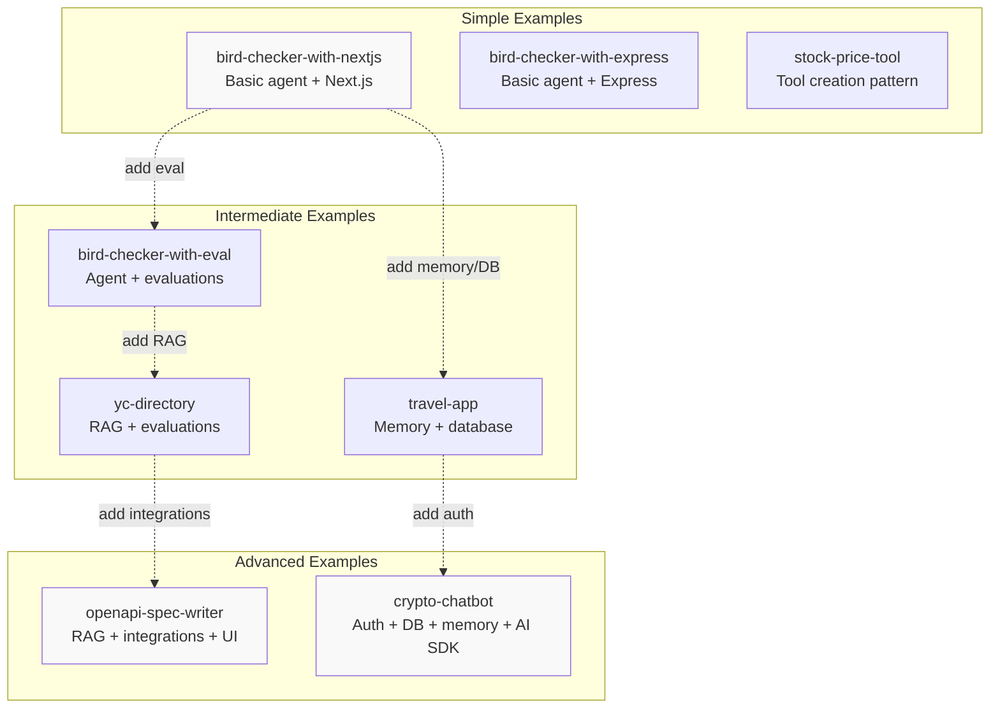

Sources: [examples/bird-checker-with-nextjs/package.json:1-47](), [examples/bird-checker-with-express/package.json:1-39](), [examples/stock-price-tool/package.json:1-30](), [examples/bird-checker-with-nextjs-and-eval/package.json:1-48](), [examples/yc-directory/src/mastra/agents/index.ts:1-22](), [examples/travel-app/package.json:1-70](), [examples/openapi-spec-writer/package.json:1-64](), [examples/crypto-chatbot/package.json:1-105]()

### Feature Matrix

| Example                       | Agent | Workflow | Tools | Memory | DB  | RAG | Auth | Eval | Framework  |
| ----------------------------- | ----- | -------- | ----- | ------ | --- | --- | ---- | ---- | ---------- |
| **bird-checker-with-nextjs**  | ✓     | -        | ✓     | -      | -   | -   | -    | -    | Next.js 15 |
| **bird-checker-with-express** | ✓     | -        | ✓     | -      | -   | -   | -    | -    | Express    |
| **bird-checker-with-eval**    | ✓     | -        | ✓     | -      | -   | -   | -    | ✓    | Next.js 15 |
| **stock-price-tool**          | ✓     | -        | ✓     | -      | -   | -   | -    | -    | CLI        |
| **yc-directory**              | ✓     | -        | ✓     | -      | -   | ✓   | -    | ✓    | -          |
| **travel-app**                | ✓     | -        | ✓     | ✓      | ✓   | -   | -    | -    | Next.js 15 |
| **openapi-spec-writer**       | ✓     | -        | ✓     | -      | -   | ✓   | -    | -    | Next.js 15 |
| **crypto-chatbot**            | ✓     | -        | ✓     | ✓      | ✓   | -   | ✓    | -    | Next.js 15 |

**Legend:**

- **Agent**: Uses `@mastra/core/agent` for LLM interactions
- **Workflow**: Uses `@mastra/core/workflows` for orchestration
- **Tools**: Custom tool implementations
- **Memory**: Conversational memory with `@mastra/memory`
- **DB**: Database integration (PostgreSQL, LibSQL, etc.)
- **RAG**: Retrieval-augmented generation with `@mastra/rag`
- **Auth**: Authentication system (NextAuth, etc.)
- **Eval**: Evaluation/scoring with `@mastra/evals`
- **Framework**: Web framework used

Sources: [examples/bird-checker-with-nextjs/package.json:1-47](), [examples/bird-checker-with-express/package.json:1-39](), [examples/stock-price-tool/package.json:1-30](), [examples/bird-checker-with-nextjs-and-eval/package.json:1-48](), [examples/yc-directory/src/mastra/agents/index.ts:1-22](), [examples/travel-app/package.json:1-70](), [examples/openapi-spec-writer/package.json:1-64](), [examples/crypto-chatbot/package.json:1-105]()

---

## Simple Examples

These examples demonstrate fundamental Mastra concepts with minimal dependencies, suitable for learning core patterns.

### Bird Checker (Next.js)

**Purpose**: Demonstrates basic agent creation, tool integration, and streaming responses in a Next.js application.

**Key Components**:

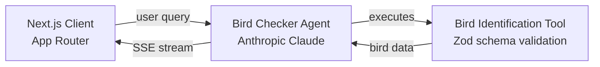

**Dependencies** (from [examples/bird-checker-with-nextjs/package.json:12-27]()):

- `@mastra/core`: Core framework
- `@ai-sdk/anthropic`: Claude model provider
- `next`: Next.js 15.5.8
- `zod`: Schema validation

**Pattern Demonstrated**: Basic agent-tool integration with streaming responses.

Sources: [examples/bird-checker-with-nextjs/package.json:1-47]()

### Bird Checker (Express)

**Purpose**: Same functionality as Next.js variant but using Express server, demonstrating framework flexibility.

**Key Components**:

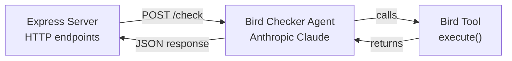

**Dependencies** (from [examples/bird-checker-with-express/package.json:25-29]()):

- `@mastra/core`: Core framework
- `@ai-sdk/anthropic`: Claude provider
- `express`: HTTP server
- `ai`: AI SDK for streaming
- `zod`: Schema validation

**Pattern Demonstrated**: Mastra integration with traditional Node.js HTTP servers.

Sources: [examples/bird-checker-with-express/package.json:1-39]()

### Stock Price Tool

**Purpose**: Minimal example showing custom tool creation with schema validation.

**Key Components**:

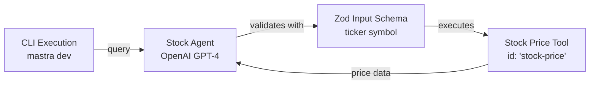

**Dependencies** (from [examples/stock-price-tool/package.json:14-17]()):

- `@ai-sdk/openai`: OpenAI provider
- `@mastra/core`: Core framework
- `zod`: Schema validation

**Pattern Demonstrated**: `createTool()` pattern with input/output schemas.

Sources: [examples/stock-price-tool/package.json:1-30]()

---

## Intermediate Examples

These examples introduce additional complexity with evaluations, memory systems, or RAG capabilities.

### Bird Checker with Evaluations

**Purpose**: Extends basic bird checker with evaluation scoring using Braintrust.

**Key Components**:

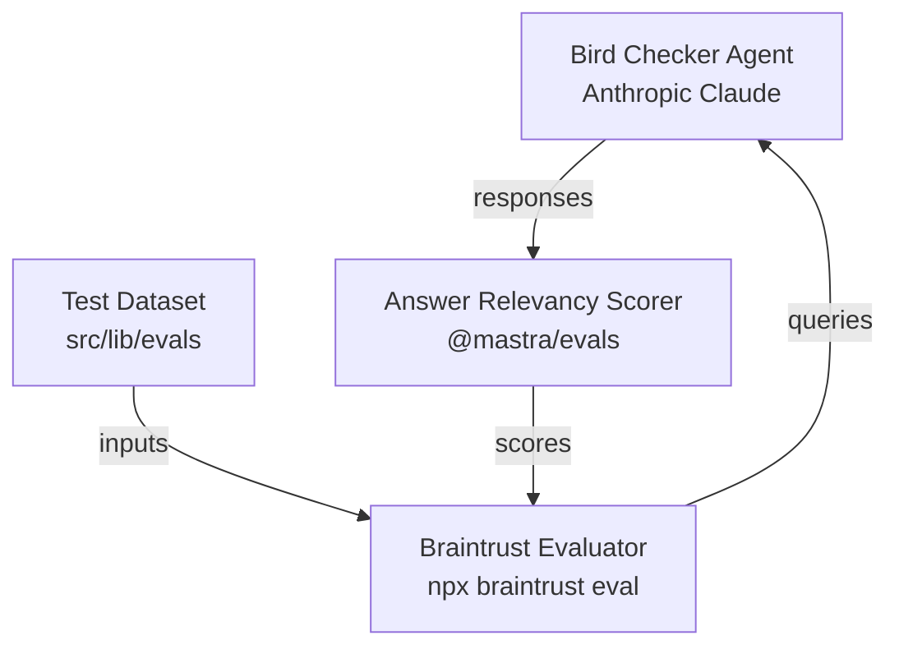

**Dependencies** (from [examples/bird-checker-with-nextjs-and-eval/package.json:14-30]()):

- `@mastra/core`: Core framework
- `@ai-sdk/anthropic`: Claude provider
- `braintrust`: Evaluation platform
- `next`: Next.js framework

**Evaluation Setup** (from [examples/bird-checker-with-nextjs-and-eval/package.json:12]()):

```bash
npx braintrust eval src/lib/evals
```

**Pattern Demonstrated**: Integration of evaluation systems for agent quality assessment.

Sources: [examples/bird-checker-with-nextjs-and-eval/package.json:1-48]()

### YC Directory Agent

**Purpose**: RAG-based agent that answers questions about Y Combinator companies using embedded knowledge.

**Architecture**:

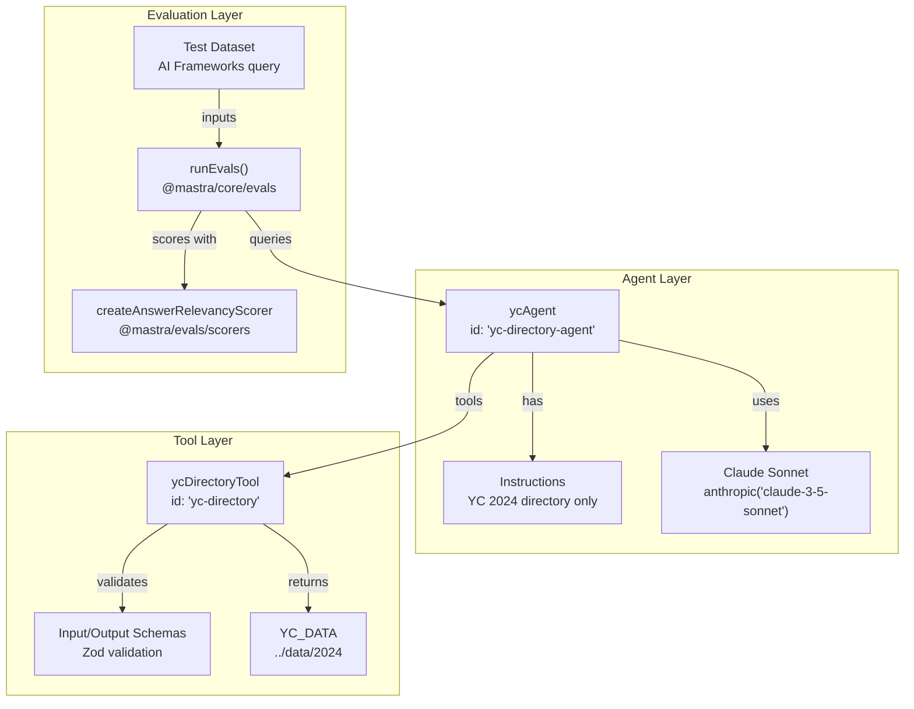

**Agent Definition** (from [examples/yc-directory/src/mastra/agents/index.ts:8-21]()):

- Agent ID: `yc-directory-agent`
- Model: `anthropic('claude-3-5-sonnet-20241022')`
- Instructions: Only provide YC 2024 directory information
- Tools: `ycDirectoryTool`

**Tool Implementation** (from [examples/yc-directory/src/mastra/tools/index.ts:6-22]()):

- Tool ID: `yc-directory`
- Input Schema: Empty object (no parameters)
- Output Schema: Array of company objects with `name`, `longDescription`, `tags`, `industries`, `batch`
- Data Source: Static import from `../data/2024`

**Evaluation Setup** (from [examples/yc-directory/src/mastra/tests/index.ts:5-17]()):

```typescript
const scorer = createAnswerRelevancyScorer({
  model: 'openai/gpt-4o',
  options: { scale: 1, uncertaintyWeight: 0.3 },
})

runEvals({
  data: [
    {
      input:
        'Can you tell me what recent YC companies are working on AI Frameworks?',
    },
  ],
  scorers: [scorer],
  target: ycAgent,
})
```

**Pattern Demonstrated**: RAG pattern with static knowledge base, schema-validated tools, and automated evaluation.

Sources: [examples/yc-directory/src/mastra/agents/index.ts:1-22](), [examples/yc-directory/src/mastra/tools/index.ts:1-23](), [examples/yc-directory/src/mastra/tests/index.ts:1-18](), [examples/yc-directory/src/mastra/index.ts:1-13]()

### Travel App

**Purpose**: Demonstrates memory integration and database operations for conversational agents.

**Key Components**:

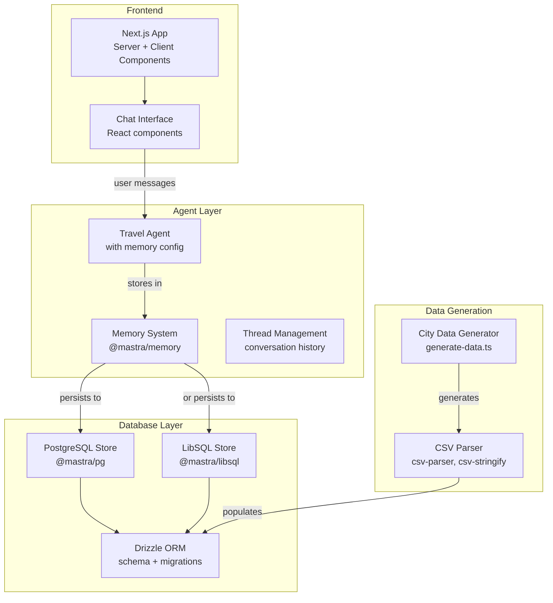

**Dependencies** (from [examples/travel-app/package.json:12-45]()):

- `@mastra/core`: Core framework
- `@mastra/memory`: Memory management
- `@mastra/pg`: PostgreSQL storage
- `@mastra/libsql`: LibSQL/Turso storage
- `drizzle-kit`: Schema migrations
- `csv-parser`, `csv-stringify`: Data generation
- `next`: Next.js 15.5.8

**Data Generation Script** (from [examples/travel-app/package.json:10]()):

```bash
npx tsx src/scripts/generate-data.ts
```

**Pattern Demonstrated**: Persistent conversational memory with multi-storage support and data seeding.

Sources: [examples/travel-app/package.json:1-70]()

---

## Advanced Examples

These examples demonstrate production-ready patterns with multiple integrations, authentication, and complex UI.

### OpenAPI Spec Writer

**Purpose**: Full-featured RAG application that crawls documentation and generates OpenAPI specifications.

**Architecture**:

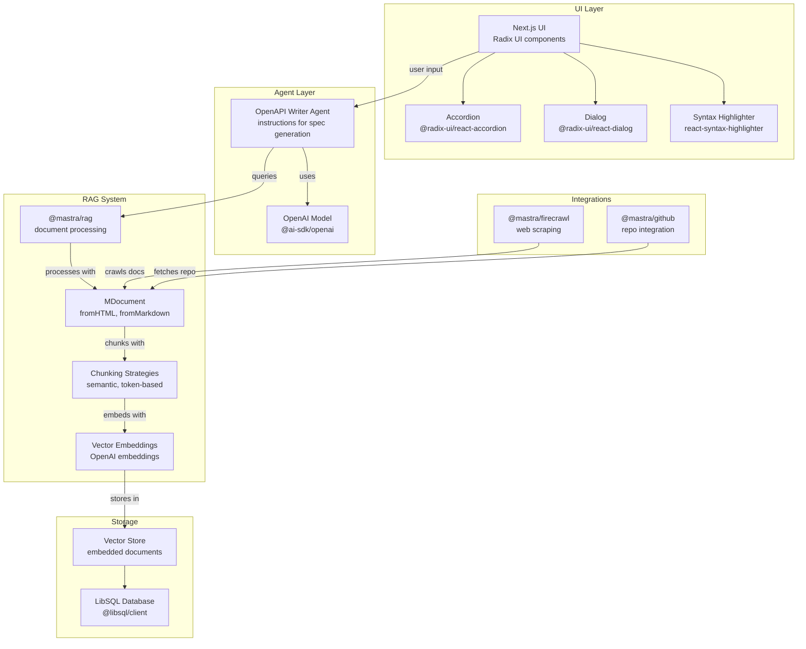

**Dependencies** (from [examples/openapi-spec-writer/package.json:11-33]()):

- `@mastra/core`: Core framework
- `@mastra/rag`: RAG capabilities
- `@mastra/firecrawl`: Web scraping integration
- `@mastra/github`: GitHub integration
- `@ai-sdk/openai`: OpenAI provider
- `@radix-ui/*`: UI component library
- `react-syntax-highlighter`: Code display
- `next`: Next.js 15.4.10

**RAG Workflow**:

1. Firecrawl integration scrapes documentation
2. GitHub integration fetches repository content
3. `MDocument.fromHTML()` and `MDocument.fromMarkdown()` parse content
4. Chunking strategies split documents
5. OpenAI embeddings generate vectors
6. Vector store persists to LibSQL
7. Agent queries vectors for relevant context
8. OpenAI generates spec based on context

**Pattern Demonstrated**: Production RAG pipeline with multiple data sources, semantic chunking, and professional UI.

Sources: [examples/openapi-spec-writer/package.json:1-64]()

### Crypto Chatbot

**Purpose**: Full-stack conversational AI application with authentication, database, memory, and real-time updates.

**Architecture**:

```mermaid
graph TB
    subgraph "Authentication"
        NextAuth["NextAuth 4.24.12<br/>session management"]
        BcryptTS["bcrypt-ts<br/>password hashing"]
        Credentials["Credentials Provider<br/>email/password"]
    end

    subgraph "Frontend"
        NextUI["Next.js 15.5.8<br/>App Router"]
        ReactComponents["React 19.1.1<br/>Client components"]
        FramerMotion["Framer Motion<br/>animations"]
        ProseMirror["ProseMirror<br/>rich text editor"]
        AIReact["@ai-sdk/react<br/>useChat hook"]
    end

    subgraph "Agent Layer"
        CryptoAgent["Crypto Agent<br/>market analysis"]
        OpenAISDK["@ai-sdk/openai<br/>GPT-4 / streaming"]
        Memory["@mastra/memory<br/>conversation history"]
    end

    subgraph "Database Layer"
        Vercel PG["@vercel/postgres<br/>connection pool"]
        DrizzleORM["Drizzle ORM 0.44.2<br/>type-safe queries"]
        Migrations["drizzle-kit<br/>schema migrations"]
        PGStore["@mastra/pg<br/>memory persistence"]
    end

    subgraph "Storage"
        VercelBlob["@vercel/blob<br/>file storage"]
        ChatHistory["Chat Messages<br/>threads table"]
        UserData["User Profiles<br/>users table"]
    end

    NextAuth --> Credentials
    Credentials --> BcryptTS
    NextAuth -->|"session"| NextUI

    NextUI --> ReactComponents
    ReactComponents --> FramerMotion
    ReactComponents --> ProseMirror
    ReactComponents --> AIReact

    AIReact -->|"streams from"| CryptoAgent
    CryptoAgent -->|"uses"| OpenAISDK
    CryptoAgent -->|"stores in"| Memory

    Memory -->|"persists to"| PGStore
    PGStore --> DrizzleORM
    DrizzleORM --> VercelPG

    Migrations -->|"manages"| DrizzleORM

    ChatHistory --> VercelPG
    UserData --> VercelPG
    VercelBlob -->|"stores"| ChatHistory
```

**Dependencies** (from [examples/crypto-chatbot/package.json:12-71]()):

- `@mastra/core`: Core framework
- `@mastra/memory`: Memory management
- `@mastra/pg`: PostgreSQL storage
- `@ai-sdk/openai`: OpenAI provider
- `@ai-sdk/react`: React hooks for AI
- `next-auth`: Authentication (v4.24.12)
- `@vercel/postgres`: Database connection
- `@vercel/blob`: File storage
- `drizzle-orm`: Type-safe ORM
- `framer-motion`: UI animations
- `prosemirror-*`: Rich text editing
- `next`: Next.js 15.5.8

**Database Setup** (from [examples/crypto-chatbot/package.json:8-11]()):

```bash
# Build with migrations
tsx db/migrate && next build

# Generate migrations
drizzle-kit generate

# Run migrations
npx tsx ./db/migrate.ts
```

**AI Integration Features**:

- Streaming responses with `@ai-sdk/react`
- Conversation history persistence
- Real-time UI updates with Framer Motion
- Rich text editing with ProseMirror

**Pattern Demonstrated**: Production-ready full-stack AI application with authentication, database, memory, and professional UX.

Sources: [examples/crypto-chatbot/package.json:1-105]()

---

## Common Patterns Across Examples

### Agent Initialization Pattern

All examples follow a consistent agent creation pattern:

```typescript
// Pattern: Agent with model and tools
import { Agent } from '@mastra/core/agent'
import { modelProvider } from '@ai-sdk/provider'

const agent = new Agent({
  id: 'unique-agent-id',
  name: 'Human-Readable Name',
  instructions: `System prompt defining agent behavior`,
  model: modelProvider('model-name'),
  tools: { toolName },
})
```

**Used in**: All examples
**Source**: [examples/yc-directory/src/mastra/agents/index.ts:8-21]()

### Tool Creation Pattern

Custom tools use `createTool()` with Zod schemas:

```typescript
// Pattern: Tool with input/output validation
import { createTool } from '@mastra/core/tools'
import { z } from 'zod'

const tool = createTool({
  id: 'tool-id',
  description: 'What the tool does',
  inputSchema: z.object({
    /* inputs */
  }),
  outputSchema: z.object({
    /* outputs */
  }),
  execute: async (input) => {
    // Tool logic
    return output
  },
})
```

**Used in**: bird-checker variants, stock-price-tool, yc-directory
**Source**: [examples/yc-directory/src/mastra/tools/index.ts:6-22]()

### Memory Integration Pattern

Apps with conversational memory use `@mastra/memory` and storage providers:

```typescript
// Pattern: Memory with storage
import { Memory } from '@mastra/memory'
import { PostgresStore } from '@mastra/pg'

const memory = new Memory({
  store: new PostgresStore({
    connectionString: process.env.DATABASE_URL,
  }),
})

// Attach to agent
const agent = new Agent({
  id: 'agent-id',
  memory,
  // ...
})
```

**Used in**: travel-app, crypto-chatbot
**Source**: [examples/travel-app/package.json:12-33](), [examples/crypto-chatbot/package.json:12-43]()

### Evaluation Pattern

Examples with quality assessment use `runEvals()` and scorers:

```typescript
// Pattern: Automated evaluation
import { runEvals } from '@mastra/core/evals'
import { createAnswerRelevancyScorer } from '@mastra/evals/scorers/prebuilt'

const scorer = createAnswerRelevancyScorer({
  model: 'openai/gpt-4o',
  options: { scale: 1, uncertaintyWeight: 0.3 },
})

runEvals({
  data: [{ input: 'test query' }],
  scorers: [scorer],
  target: agent,
})
```

**Used in**: bird-checker-with-eval, yc-directory
**Source**: [examples/yc-directory/src/mastra/tests/index.ts:5-17]()

### RAG Pattern

RAG implementations use `@mastra/rag` for document processing:

```typescript
// Pattern: RAG with document processing
import { MDocument } from '@mastra/rag'

// Process documents
const doc = await MDocument.fromHTML(htmlContent)
const chunks = await doc.chunk({ strategy: 'semantic' })

// Embed and store
await vectorStore.upsert(chunks)

// Query in agent
const results = await vectorStore.query(userQuery)
```

**Used in**: openapi-spec-writer, yc-directory (static data variant)
**Source**: [examples/openapi-spec-writer/package.json:11-33]()

### Next.js Integration Pattern

Next.js examples use App Router with server and client components:

```typescript
// Pattern: Next.js App Router with Mastra
// app/api/chat/route.ts (Server Component)
import { mastra } from '@/mastra'

export async function POST(req: Request) {
  const { messages } = await req.json()
  const agent = mastra.getAgent('agent-id')
  const stream = await agent.stream({ messages })
  return new Response(stream)
}

// app/page.tsx (Client Component)
;('use client')
import { useChat } from '@ai-sdk/react'

export default function Chat() {
  const { messages, input, handleSubmit } = useChat({
    api: '/api/chat',
  })
  // Render UI
}
```

**Used in**: bird-checker-with-nextjs, travel-app, openapi-spec-writer, crypto-chatbot
**Source**: [examples/bird-checker-with-nextjs/package.json:12-27]()

---

## Getting Started with Examples

### Prerequisites

All examples require:

- Node.js 18+
- pnpm package manager
- Environment variables (see each example's `.env.example`)

### Running an Example

```bash
# Clone repository
git clone https://github.com/mastra-ai/mastra
cd mastra

# Navigate to example
cd examples/[example-name]

# Install dependencies
pnpm install

# Set up environment
cp .env.example .env
# Edit .env with your API keys

# Run development server
pnpm dev
```

### Building on Examples

Examples are designed as starting points. Common modifications:

1. **Change Model Provider**: Replace `@ai-sdk/anthropic` with `@ai-sdk/openai` or other providers
2. **Add Tools**: Create new tools in `src/mastra/tools/`
3. **Modify Instructions**: Update agent system prompts for different behavior
4. **Add Memory**: Integrate `@mastra/memory` for conversation history
5. **Add Evaluations**: Create test cases and scorers in `src/mastra/tests/`
6. **Switch Storage**: Replace PostgreSQL with LibSQL or other providers

Sources: [examples/bird-checker-with-nextjs/package.json:1-47](), [examples/travel-app/package.json:1-70](), [examples/openapi-spec-writer/package.json:1-64](), [examples/crypto-chatbot/package.json:1-105]()

---

## Example Selection Guide

### Overview

Prior to v1.0.0-beta.10, workflow execution methods (`stream`, `start`, `resume`, etc.) were called directly on the workflow instance. The new Run Instance Pattern introduces a two-step process: first create a run instance with `createRun()`, then execute operations on that run.

### Migration Path

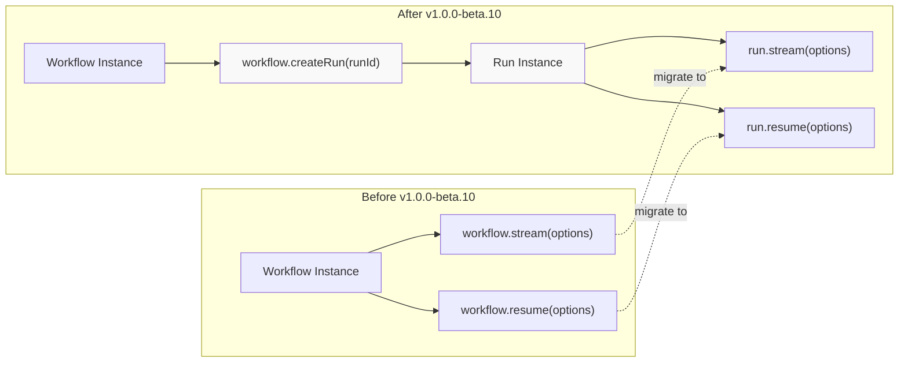

### Code Changes Required

#### Server-Side Workflow Execution

**Before:**

```typescript
// Direct method calls on workflow instance
const result = await workflow.stream({
  runId: '123',
  inputData: { message: 'hello' },
})

const resumeResult = await workflow.resume({
  runId: '123',
  resumeData: { approved: true },
})

const timeTravel = await workflow.timeTravel({
  runId: '123',
  stepId: 'step-2',
})
```

**After:**

```typescript
// Create run instance first, then execute
const run = await workflow.createRun({ runId: '123' })

const stream = await run.stream({
  inputData: { message: 'hello' },
})

const resumeResult = await run.resume({
  resumeData: { approved: true },
})

const timeTravel = await run.timeTravel({
  stepId: 'step-2',
})
```

#### Client-Side Workflow Execution

**Before:**

```typescript
import { MastraClient } from '@mastra/client-js'

const client = new MastraClient({ baseUrl: 'http://localhost:3000' })
const workflow = client.getWorkflow('myWorkflow')

// Direct method calls
const result = await workflow.stream({
  runId: '123',
  inputData: { message: 'hello' },
})
```

**After:**

```typescript
import { MastraClient } from '@mastra/client-js'

const client = new MastraClient({ baseUrl: 'http://localhost:3000' })
const workflow = client.getWorkflow('myWorkflow')

// Create run instance first
const run = await workflow.createRun({ runId: '123' })
const stream = await run.stream({
  inputData: { message: 'hello' },
})
```

### Affected Methods

| Old Method                     | New Method                | Notes                          |
| ------------------------------ | ------------------------- | ------------------------------ |
| `workflow.stream(options)`     | `run.stream(options)`     | `runId` moved to `createRun()` |
| `workflow.start(options)`      | `run.start(options)`      | `runId` moved to `createRun()` |
| `workflow.resume(options)`     | `run.resume(options)`     | `runId` moved to `createRun()` |
| `workflow.restart(options)`    | `run.restart(options)`    | `runId` moved to `createRun()` |
| `workflow.timeTravel(options)` | `run.timeTravel(options)` | `runId` moved to `createRun()` |
| `workflow.cancel(runId)`       | `run.cancel()`            | No parameters needed           |

### Benefits

- **State Isolation**: Each run instance maintains its own execution context
- **Type Safety**: Run-specific operations are properly scoped
- **API Consistency**: Aligns with agent network patterns
- **Concurrent Execution**: Multiple runs can execute without interference

### Migration Checklist

- [ ] Search codebase for `workflow.stream(` and replace with `createRun()` + `run.stream()`
- [ ] Search codebase for `workflow.start(` and replace with `createRun()` + `run.start()`
- [ ] Search codebase for `workflow.resume(` and replace with `createRun()` + `run.resume()`
- [ ] Search codebase for `workflow.timeTravel(` and replace with `createRun()` + `run.timeTravel()`
- [ ] Remove `runId` from all workflow method call options (now passed to `createRun()`)
- [ ] Update client-side workflow code following the same pattern
- [ ] Update tests to use the Run Instance Pattern
- [ ] Verify concurrent workflow executions work correctly

Sources: [packages/cli/CHANGELOG.md:143-151](), [packages/core/CHANGELOG.md:1-100](), [client-sdks/client-js/CHANGELOG.md:1-50]()

---

## Migration 2: VNext Method Removal

### Overview

The temporary `streamVNext`, `resumeStreamVNext`, and `observeStreamVNext` methods introduced during the transition to the Run Instance Pattern have been removed. All code should now use the standard `stream`, `resumeStream`, and `observeStream` methods.

### Migration Path

**Before:**

```typescript
const run = await workflow.createRun({ runId: '123' })
const stream = await run.streamVNext({ inputData: { message: 'hello' } })
const resumed = await run.resumeStreamVNext({ resumeData: { approved: true } })
const observed = await run.observeStreamVNext()
```

**After:**

```typescript
const run = await workflow.createRun({ runId: '123' })
const stream = await run.stream({ inputData: { message: 'hello' } })
const resumed = await run.resumeStream({ resumeData: { approved: true } })
const observed = await run.observeStream()
```

### Search and Replace

| Find                 | Replace         |
| -------------------- | --------------- |
| `streamVNext`        | `stream`        |
| `resumeStreamVNext`  | `resumeStream`  |
| `observeStreamVNext` | `observeStream` |

### Migration Checklist

- [ ] Search codebase for `streamVNext` and replace with `stream`
- [ ] Search codebase for `resumeStreamVNext` and replace with `resumeStream`
- [ ] Search codebase for `observeStreamVNext` and replace with `observeStream`
- [ ] Update import statements if necessary
- [ ] Run tests to verify streaming behavior unchanged

Sources: [packages/cli/CHANGELOG.md:48-54](), [packages/create-mastra/CHANGELOG.md:28-34]()

---

## Migration 3: OUTPUT Generic Refactoring

### Overview

The `OUTPUT` generic type parameter has been refactored from a Zod schema constraint (`OUTPUT extends OutputSchema`) to a plain generic type. This change removes direct Zod dependencies from public APIs and prepares the framework for schema-agnostic architecture.

### Type System Changes

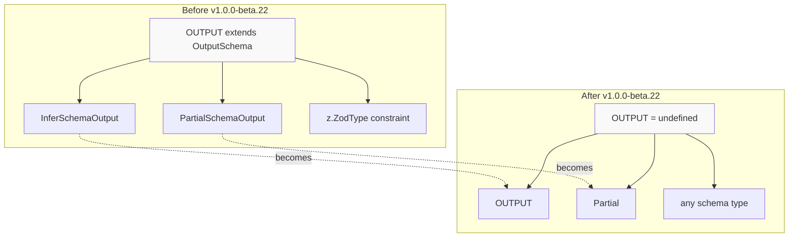

### Code Changes Required

#### Agent Type Signatures

**Before:**

```typescript
import { Agent, OutputSchema } from '@mastra/core'
import { z } from 'zod'

// Agent with Zod schema constraint
const agent = new Agent<z.ZodObject<{ message: z.ZodString }>>({
  id: 'myAgent',
  outputSchema: z.object({ message: z.string() }),
  // ...
})

// Type inference required schema wrapper
type Output = InferSchemaOutput<typeof agent.outputSchema>
```

**After:**

```typescript
import { Agent } from '@mastra/core'
import { z } from 'zod'

// Agent with plain generic
const agent = new Agent<{ message: string }>({
  id: 'myAgent',
  outputSchema: z.object({ message: z.string() }),
  // ...
})

// Direct type usage
type Output = { message: string }
```

#### Agent Execution Options

**Before:**

```typescript
import { AgentExecutionOptions, OutputSchema } from '@mastra/core'

interface MyOptions extends AgentExecutionOptions<MyOutputSchema> {
  customField: string
}
```

**After:**

```typescript
import { AgentExecutionOptions } from '@mastra/core'

interface MyOptions extends AgentExecutionOptions<MyOutputType> {
  customField: string
}
```

#### Model Output Handling

**Before:**

```typescript
import { MastraModelOutput, PartialSchemaOutput } from '@mastra/core'

function processOutput<T extends OutputSchema>(
  output: MastraModelOutput<T>
): PartialSchemaOutput<T> {
  // Process partial schema output
  return output.partialObjectStream
}
```

**After:**

```typescript
import { MastraModelOutput } from '@mastra/core'

function processOutput<T>(output: MastraModelOutput<T>): Partial<T> {
  // Process partial output directly
  return output.partialObjectStream
}
```

### Affected APIs

| Old Type                      | New Type          | Notes                       |
| ----------------------------- | ----------------- | --------------------------- |
| `OUTPUT extends OutputSchema` | `OUTPUT`          | Plain generic               |
| `InferSchemaOutput<OUTPUT>`   | `OUTPUT`          | Direct type usage           |
| `PartialSchemaOutput<OUTPUT>` | `Partial<OUTPUT>` | Standard TypeScript utility |
| `z.ZodObject<any>` constraint | No constraint     | Schema-agnostic             |
| `z.ZodType<any>` constraint   | No constraint     | Schema-agnostic             |

### Migration Checklist

- [ ] Search for `extends OutputSchema` and remove constraint
- [ ] Replace `InferSchemaOutput<T>` with `T`
- [ ] Replace `PartialSchemaOutput<T>` with `Partial<T>`
- [ ] Update generic type parameters on `Agent` instances
- [ ] Update generic type parameters on `AgentExecutionOptions`
- [ ] Update generic type parameters on `MastraModelOutput`
- [ ] Remove unused imports of `OutputSchema`, `InferSchemaOutput`, `PartialSchemaOutput`
- [ ] Run TypeScript compilation to catch type errors
- [ ] Verify agent output types are correctly inferred

Sources: [client-sdks/client-js/CHANGELOG.md:14-41](), [packages/core/CHANGELOG.md:52-70]()

---

## Migration 4: Workflow and Tool Type Refactoring

### Overview

Workflow and tool types have been refactored to remove Zod-specific constraints across all implementations. This ensures type consistency and prepares for Zod v4 migration.

### Generic Type Changes

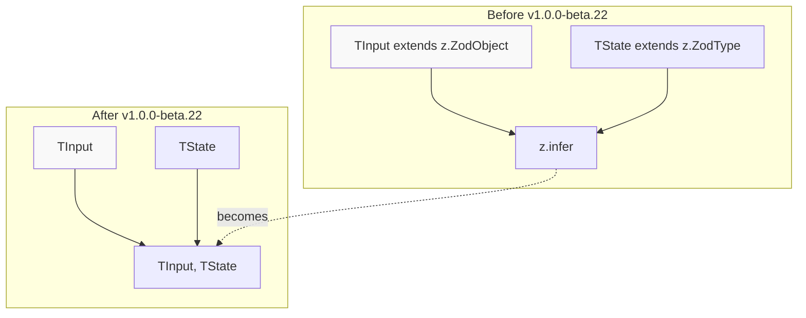

### Code Changes Required

#### Workflow Definition

**Before:**

```typescript
import { createWorkflow } from '@mastra/core'
import { z } from 'zod'

const workflow = createWorkflow<
  z.ZodObject<{ message: z.ZodString }>,
  z.ZodType<{ count: number }>
>({
  inputSchema: z.object({ message: z.string() }),
  stateSchema: z.object({ count: z.number() }),
  // ...
})
```

**After:**

```typescript
import { createWorkflow } from '@mastra/core'
import { z } from 'zod'

const workflow = createWorkflow<{ message: string }, { count: number }>({
  inputSchema: z.object({ message: z.string() }),
  stateSchema: z.object({ count: z.number() }),
  // ...
})
```

#### Tool Definition

**Before:**

```typescript
import { createTool } from '@mastra/core'
import { z } from 'zod'

const tool = createTool<z.ZodObject<{ query: z.ZodString }>>({
  id: 'search',
  inputSchema: z.object({ query: z.string() }),
  execute: async (params: z.infer<typeof schema>) => {
    // ...
  },
})
```

**After:**

```typescript
import { createTool } from '@mastra/core'
import { z } from 'zod'

const tool = createTool<{ query: string }>({
  id: 'search',
  inputSchema: z.object({ query: z.string() }),
  execute: async (params: { query: string }) => {
    // ...
  },
})
```

#### Step Execution Context

**Before:**

```typescript
import { StepContext } from '@mastra/core/workflows'

function myStep<T extends z.ZodType<any>>(context: StepContext<z.infer<T>>) {
  // Process context
}
```

**After:**

```typescript
import { StepContext } from '@mastra/core/workflows'

function myStep<T>(context: StepContext<T>) {
  // Process context directly
}
```

### Affected Implementations

| Component                | Change                        | Impact                     |
| ------------------------ | ----------------------------- | -------------------------- |
| `DefaultExecutionEngine` | Generic constraints removed   | Type signatures simplified |
| `EventedExecutionEngine` | Generic constraints removed   | Type signatures simplified |
| `InngestExecutionEngine` | Generic constraints removed   | Type signatures simplified |
| `ToolExecutionContext`   | Zod schema constraint removed | Schema-agnostic            |
| `StepContext`            | Generic parameter simplified  | Direct type usage          |

### Migration Checklist

- [ ] Search for `extends z.ZodObject<any>` in workflow definitions
- [ ] Search for `extends z.ZodType<any>` in workflow definitions
- [ ] Replace `z.infer<T>` with direct type `T` in method signatures
- [ ] Update `createWorkflow` generic parameters
- [ ] Update `createTool` generic parameters
- [ ] Update custom step definitions
- [ ] Update tool execution context types
- [ ] Run TypeScript compilation to verify types
- [ ] Test workflow execution with updated types
- [ ] Test tool execution with updated types

Sources: [packages/core/CHANGELOG.md:52-70]()

---

## Migration 5: Studio Rename (Playground → Studio)

### Overview

The internal name "playground" has been renamed to "studio" throughout the codebase. This affects configuration properties, file paths, and CLI commands.

### Configuration Changes

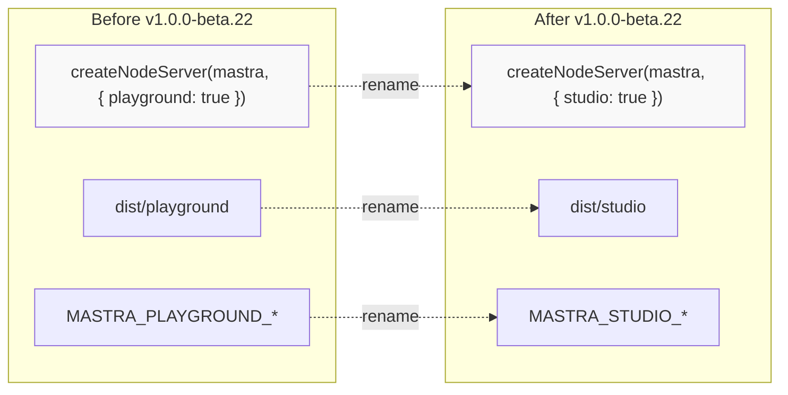

### Code Changes Required

#### Server Configuration

**Before:**

```typescript
import { createNodeServer } from '@mastra/deployer/server'

await createNodeServer(mastra, {
  playground: true,
  swaggerUI: false,
  tools: {},
})
```

**After:**

```typescript
import { createNodeServer } from '@mastra/deployer/server'

await createNodeServer(mastra, {
  studio: true,
  swaggerUI: false,
  tools: {},
})
```

#### Build Configuration

**Before:**

```bash
# CLI command
mastra build --playground

# Output directory: .mastra/output/playground
```

**After:**

```bash
# CLI command
mastra build --studio

# Output directory: .mastra/output/studio
```

#### File Paths

| Old Path                     | New Path                 | Notes                 |
| ---------------------------- | ------------------------ | --------------------- |
| `dist/playground`            | `dist/studio`            | Build output          |
| `.mastra/output/playground`  | `.mastra/output/studio`  | CLI build output      |
| `window.MASTRA_PLAYGROUND_*` | `window.MASTRA_STUDIO_*` | Environment variables |

### Migration Checklist

- [ ] Replace `playground: true` with `studio: true` in `createNodeServer()` calls
- [ ] Update CLI commands from `--playground` to `--studio`
- [ ] Update `.gitignore` to exclude `dist/studio` instead of `dist/playground`
- [ ] Update deployment scripts to reference `studio` paths
- [ ] Update documentation references from "playground" to "studio"
- [ ] Clear build cache to remove old `playground` directories
- [ ] Verify studio UI loads correctly after migration

Sources: [packages/cli/CHANGELOG.md:9-13](), [packages/deployer/CHANGELOG.md:15-30]()

---

## Migration 6: Zod v3/v4 Compatibility

### Overview

Mastra now supports both Zod v3 and Zod v4 through peer dependency configuration and schema compatibility layers. This section covers how to ensure your code works with either version.

### Compatibility Strategy

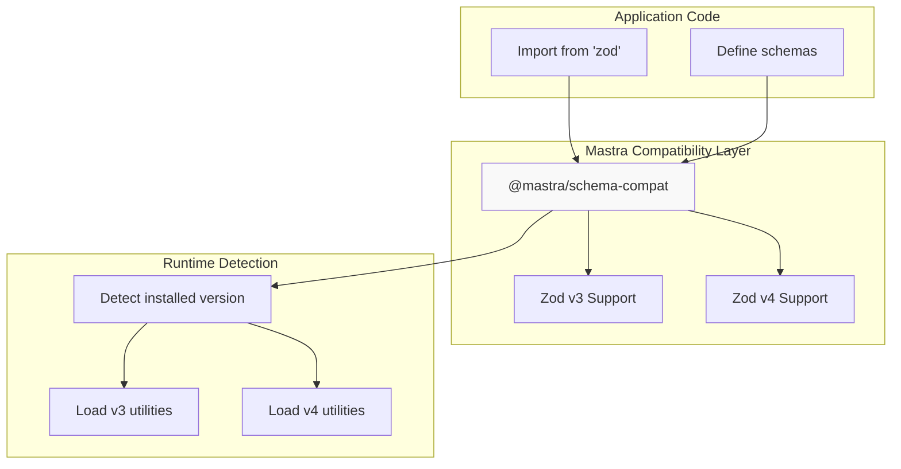

### Peer Dependencies

The following packages support both Zod v3 and v4:

```json
{
  "peerDependencies": {
    "zod": "^3.25.0 || ^4.0.0"
  }
}
```

Packages with dual Zod support:

- `@mastra/core`
- `@mastra/client-js`
- `@mastra/deployer`
- `@mastra/mcp`
- All storage providers
- All deployers

### Code Compatibility

#### Schema Definitions

Schemas should be defined the same way regardless of Zod version:

```typescript
import { z } from 'zod'

// Compatible with both v3 and v4
const schema = z.object({
  name: z.string(),
  age: z.number(),
  email: z.string().email(),
})
```

#### Transform and JSON Schema

**Zod v3:**

```typescript
import { z } from 'zod'
import { zodToJsonSchema } from 'zod-to-json-schema'

const schema = z.object({ value: z.string() })
const jsonSchema = zodToJsonSchema(schema)
```

**Zod v4:**

```typescript
import { z } from 'zod'

const schema = z.object({ value: z.string() })
const jsonSchema = schema.toJsonSchema() // Native support
```

Mastra handles this internally via `@mastra/schema-compat`.

### Migration Considerations

| Aspect         | Zod v3               | Zod v4                  | Notes                |
| -------------- | -------------------- | ----------------------- | -------------------- |
| Basic schemas  | ✓                    | ✓                       | Fully compatible     |
| Transform      | `zod-to-json-schema` | Native `toJsonSchema()` | Abstracted by Mastra |
| Tuple support  | ✓                    | ✓                       | Fixed in beta.22     |
| Type inference | `z.infer<T>`         | `z.infer<T>`            | Unchanged            |
| Validation     | ✓                    | ✓                       | API unchanged        |

### Testing Both Versions

The repository includes E2E tests for both versions:

[e2e-tests/client-js/zod-v3/package.json:1-30]()
[e2e-tests/client-js/zod-v4/package.json:1-30]()

### Migration Checklist

- [ ] Verify `zod` peer dependency is `^3.25.0 || ^4.0.0` in package.json
- [ ] Test application with Zod v3 installed
- [ ] Test application with Zod v4 installed
- [ ] Replace direct `zod-to-json-schema` usage with Mastra utilities
- [ ] Update lock files after version changes
- [ ] Run full test suite with both versions
- [ ] Document Zod version requirements for users

Sources: [packages/core/package.json:237-238](), [pnpm-lock.yaml:27-28](), [packages/core/CHANGELOG.md:400-450]()

---

## Migration 7: Externals Bundling Configuration

### Overview

Starting with v1.0.0-beta.11, the default bundler behavior changed to `externals: true`, meaning dependencies are not bundled by default. This reduces bundle issues with native dependencies but may require explicit configuration for some use cases.

### Bundler Behavior

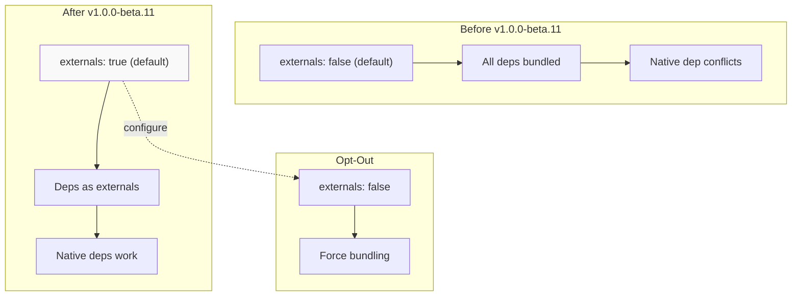

### Configuration Changes

**Before (v1.0.0-beta.10 and earlier):**

```bash
# All dependencies were bundled by default
mastra build
```

**After (v1.0.0-beta.11+):**

```bash
# Dependencies are external by default
mastra build

# Explicitly bundle dependencies if needed
mastra build --externals=false
```

### Cloud Deployer Configuration

**Before:**

```typescript
// Dependencies bundled by default
import { CloudDeployer } from '@mastra/deployer-cloud'

const deployer = new CloudDeployer({
  // No externals configuration needed
})
```

**After:**

```typescript
// Externals true by default, configure if needed
import { CloudDeployer } from '@mastra/deployer-cloud'

const deployer = new CloudDeployer({
  bundler: {
    externals: false, // Opt into bundling
  },
})
```

### When to Use Each Configuration

| Scenario                            | Configuration      | Reason                         |
| ----------------------------------- | ------------------ | ------------------------------ |
| Native dependencies (sqlite3, etc.) | `externals: true`  | Avoid binding conflicts        |
| Edge/Workers deployment             | `externals: false` | Single-file bundle required    |
| Large dependency tree               | `externals: true`  | Faster builds, smaller bundles |
| Minimal dependencies                | `externals: false` | Simpler deployment             |

### Migration Checklist

- [ ] Test build with default `externals: true` setting
- [ ] Verify native dependencies work correctly
- [ ] Check deployment bundle size
- [ ] For edge deployments, explicitly set `externals: false`
- [ ] Update CI/CD scripts if externals behavior assumed
- [ ] Document externals requirements for team

Sources: [packages/cli/CHANGELOG.md:114-117]()

---

## Migration 8: Storage Initialization Control

### Overview

Storage providers now support a `disableInit` option for CI/CD pipelines, allowing separation of schema management from runtime initialization.

### Configuration

**Before:**

```typescript
import { PostgresStore } from '@mastra/pg'

const storage = new PostgresStore({
  connectionString: process.env.DATABASE_URL,
  // Schema always initialized on startup
})
```

**After:**

```typescript
import { PostgresStore } from '@mastra/pg'

const storage = new PostgresStore({
  connectionString: process.env.DATABASE_URL,
  disableInit: process.env.CI === 'true', // Skip in CI
})
```

### Use Cases

| Scenario          | disableInit | Reason                |
| ----------------- | ----------- | --------------------- |
| Local development | `false`     | Auto-create schemas   |
| CI/CD testing     | `true`      | Pre-created test DB   |
| Production        | `false`     | Ensure schema exists  |
| Migration scripts | `true`      | Manual schema control |

### Migration Checklist

- [ ] Identify environments where schema is pre-created
- [ ] Add `disableInit: true` for those environments
- [ ] Update deployment documentation
- [ ] Test initialization behavior in all environments

Sources: [packages/core/CHANGELOG.md:900-950]()

---

## Complete Migration Checklist

Use this comprehensive checklist to track your migration progress:

### Workflow APIs

- [ ] Convert all `workflow.stream()` to `createRun()` + `run.stream()`
- [ ] Convert all `workflow.start()` to `createRun()` + `run.start()`
- [ ] Convert all `workflow.resume()` to `createRun()` + `run.resume()`
- [ ] Convert all `workflow.timeTravel()` to `createRun()` + `run.timeTravel()`
- [ ] Replace `streamVNext` with `stream`
- [ ] Replace `resumeStreamVNext` with `resumeStream`
- [ ] Replace `observeStreamVNext` with `observeStream`
- [ ] Update client-side workflow code

### Type System

- [ ] Remove `extends OutputSchema` constraints from generics
- [ ] Replace `InferSchemaOutput<T>` with `T`
- [ ] Replace `PartialSchemaOutput<T>` with `Partial<T>`
- [ ] Remove `z.ZodObject<any>` constraints from workflows
- [ ] Remove `z.ZodType<any>` constraints from workflows
- [ ] Replace `z.infer<T>` with direct types in method signatures
- [ ] Update agent generic type parameters
- [ ] Update tool generic type parameters

### Configuration

- [ ] Replace `playground: true` with `studio: true`
- [ ] Update CLI commands from `--playground` to `--studio`
- [ ] Update file paths from `playground` to `studio`
- [ ] Configure `externals` setting for bundler
- [ ] Add `disableInit` for storage where appropriate

### Testing

- [ ] Run tests with Zod v3
- [ ] Run tests with Zod v4
- [ ] Test workflow execution with new pattern
- [ ] Test agent output types
- [ ] Test studio UI loads correctly
- [ ] Test bundled deployments
- [ ] Test storage initialization behavior

### Documentation

- [ ] Update README files
- [ ] Update API documentation
- [ ] Update code examples
- [ ] Update deployment guides
- [ ] Document Zod version requirements

---

## Getting Help

If you encounter issues during migration:

1. **Check CHANGELOGs**: Review package-specific changelogs for detailed breaking changes
   - [packages/core/CHANGELOG.md]()
   - [packages/cli/CHANGELOG.md]()
   - [client-sdks/client-js/CHANGELOG.md]()

2. **Review Examples**: Check updated examples in the repository
   - [examples/dane]()
   - E2E tests in [e2e-tests/client-js]()

3. **GitHub Issues**: Search or create issues at https://github.com/mastra-ai/mastra/issues

4. **Version Tags**: Each breaking change is documented in changelog with version numbers and PR references

Sources: [packages/core/CHANGELOG.md:1-100](), [packages/cli/CHANGELOG.md:1-100](), [client-sdks/client-js/CHANGELOG.md:1-100]()
