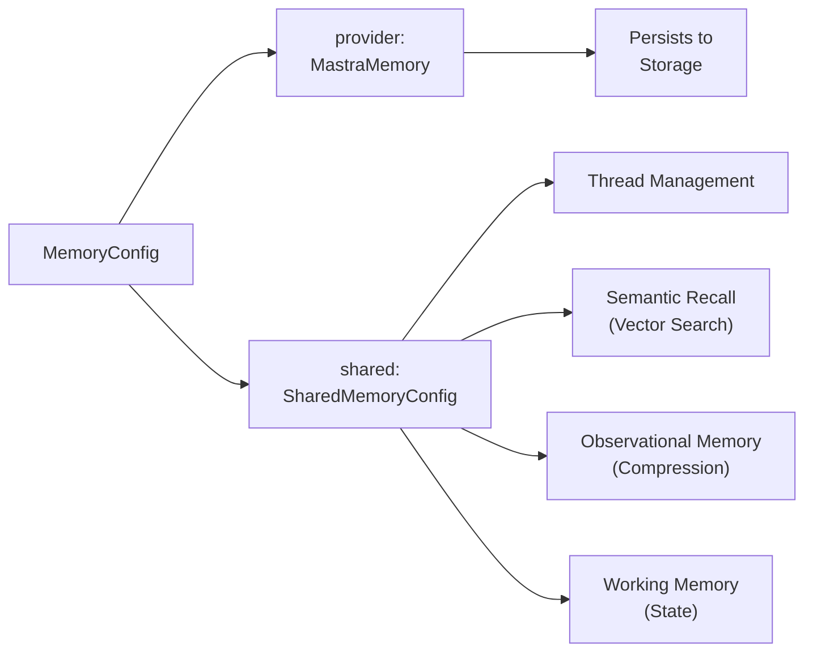
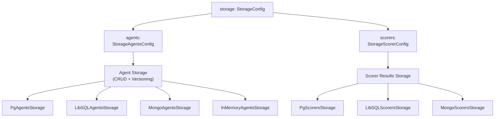
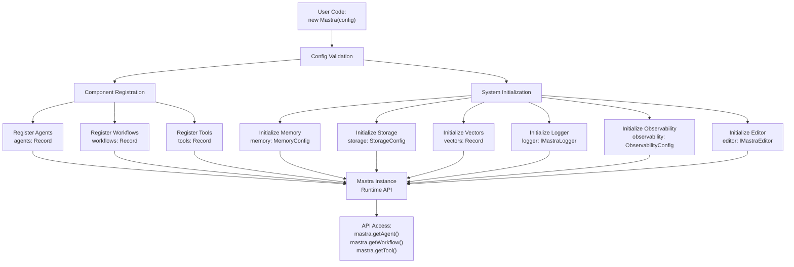
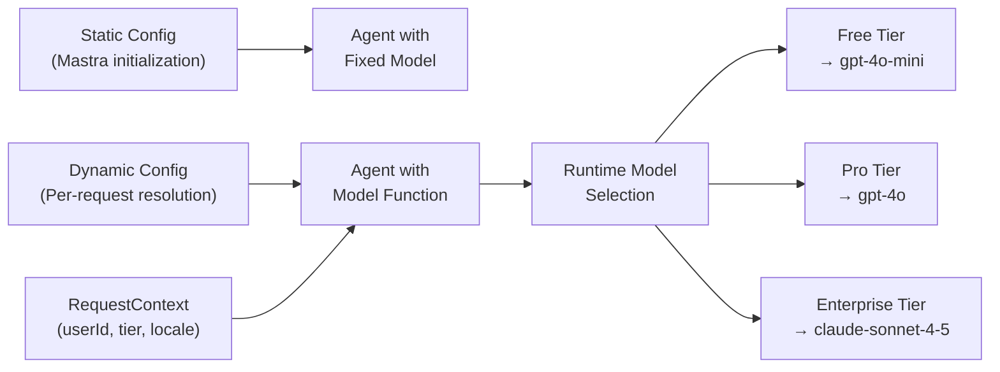

# Configuration Schema and Options

<details>
<summary>Relevant source files</summary>

The following files were used as context for generating this wiki page:

- [packages/core/src/index.ts](packages/core/src/index.ts)

</details>

The `Config` interface is the primary configuration object passed to the `Mastra` constructor. It defines all system components (agents, workflows, tools, memory, storage, vectors, logger, observability, etc.) and their initialization parameters. This page documents the complete configuration schema and all available options.

For information about runtime configuration using RequestContext, see [RequestContext and Dynamic Configuration](#2.2). For details on specific agent configuration, see [Agent Configuration and Execution](#3.1).

---

## Configuration Overview

The `Config` interface serves as the declarative specification for the entire Mastra system. During initialization, the Mastra constructor processes this configuration to build an internal component registry, validate dependencies, and prepare all subsystems for execution.

### Configuration Structure Diagram

```mermaid
graph TB
    Config["Config Interface"]

    Config --> Agents["agents:<br/>Record&lt;string, Agent&gt;"]
    Config --> Workflows["workflows:<br/>Record&lt;string, Workflow&gt;"]
    Config --> Tools["tools:<br/>Record&lt;string, ToolAction&gt;"]
    Config --> Memory["memory:<br/>MemoryConfig"]
    Config --> Storage["storage:<br/>StorageConfig"]
    Config --> Vectors["vectors:<br/>Record&lt;string, MastraVector&gt;"]
    Config --> Logger["logger:<br/>IMastraLogger"]
    Config --> Observability["observability:<br/>ObservabilityConfig"]
    Config --> Deployer["deployer:<br/>DeployerConfig"]
    Config --> Server["server:<br/>ServerConfig"]
    Config --> MCPServers["mcpServers:<br/>McpServersConfig"]
    Config --> Editor["editor:<br/>IMastraEditor"]

    Storage --> StorageAgents["agents:<br/>StorageAgentsConfig"]
    Storage --> StorageScorers["scorers:<br/>StorageScorerConfig"]

    Memory --> MemoryProvider["provider:<br/>MastraMemory"]
    Memory --> SharedConfig["shared:<br/>SharedMemoryConfig"]

    Vectors --> VectorStore["MastraVector<br/>Embedding & Search"]

    Observability --> ObsExporter["exporter:<br/>ObservabilityExporter"]
    Observability --> ObsConfig["config:<br/>TraceConfig"]
```



**Sources:** [packages/core/src/index.ts:1-13](), [packages/core/package.json:1-309]()

---

## Core Component Configuration

### Agents Configuration

The `agents` field accepts a record mapping agent IDs to `Agent` instances. Agents define LLM-powered entities with specific instructions, models, tools, memory, and processors.

**Type Signature:**

```typescript
agents?: Record<string, Agent>
```

**Usage Pattern:**

```typescript
import { Mastra, Agent } from '@mastra/core'
import { openai } from '@ai-sdk/openai'

const mastra = new Mastra({
  agents: {
    'customer-support': new Agent({
      name: 'customer-support',
      instructions: 'You are a helpful customer support agent',
      model: openai('gpt-4'),
      tools: { searchKnowledgeBase, createTicket },
    }),
    'data-analyst': new Agent({
      name: 'data-analyst',
      instructions: 'Analyze data and provide insights',
      model: openai('gpt-4o'),
      tools: { queryDatabase, generateChart },
    }),
  },
})
```

The agent configuration includes model selection, instructions, tool integration, memory configuration, input/output processors, and evaluation scorers. Detailed agent options are covered in [Agent Configuration and Execution](#3.1).

**Key Properties:**

- Agent ID keys must be unique within the configuration
- Agents can reference tools and workflows defined elsewhere in the config
- Agents can be nested (sub-agents) within other agent configurations
- Agent memory can be configured per-agent or shared via the memory config

**Sources:** [packages/core/src/index.ts:4]()

---

### Workflows Configuration

The `workflows` field registers workflow definitions for multi-step orchestration. Workflows can execute custom logic, agents, tools, and nested workflows with control flow patterns (sequential, parallel, conditional, iteration).

**Type Signature:**

```typescript
workflows?: Record<string, Workflow>
```

**Workflow Definition Pattern:**

```typescript
import { Workflow } from '@mastra/core'

const mastra = new Mastra({
  workflows: {
    'customer-onboarding': new Workflow({
      name: 'customer-onboarding',
      triggerSchema: z.object({
        email: z.string().email(),
        companyName: z.string(),
      }),
    })
      .step('validate-email')
      .then('create-account')
      .then('send-welcome-email')
      .then('notify-sales-team'),

    'data-pipeline': new Workflow({
      name: 'data-pipeline',
      triggerSchema: z.object({
        dataSource: z.string(),
        outputFormat: z.enum(['json', 'csv', 'parquet']),
      }),
    })
      .step('extract-data')
      .parallel(['transform-data', 'validate-data'])
      .then('load-data'),
  },
})
```

Workflows support three execution engines: DefaultExecutionEngine (in-memory), EventedExecutionEngine (event-driven with PubSub), and InngestExecutionEngine (durable serverless). See [Workflow Definition and Step Composition](#4.1) and [Execution Engines](#4.2) for details.

**Sources:** [packages/core/src/index.ts:9]()

---

### Tools Configuration

The `tools` field registers tool actions that can be executed by agents, workflows, or MCP clients. Tools encapsulate external functions with validated inputs/outputs using Zod schemas.

**Type Signature:**

```typescript
tools?: Record<string, ToolAction>
```

**Tool Registration Example:**

```typescript
import { ToolAction } from '@mastra/core'
import { z } from 'zod'

const mastra = new Mastra({
  tools: {
    'search-knowledge-base': new ToolAction({
      id: 'search-knowledge-base',
      description: 'Search the knowledge base for relevant articles',
      inputSchema: z.object({
        query: z.string(),
        limit: z.number().optional().default(10),
      }),
      outputSchema: z.object({
        results: z.array(
          z.object({
            title: z.string(),
            content: z.string(),
            relevanceScore: z.number(),
          })
        ),
      }),
      execute: async (input, context) => {
        // Tool implementation
        return { results: await searchKB(input.query, input.limit) }
      },
    }),

    'create-ticket': new ToolAction({
      id: 'create-ticket',
      description: 'Create a support ticket',
      inputSchema: z.object({
        subject: z.string(),
        description: z.string(),
        priority: z.enum(['low', 'medium', 'high', 'urgent']),
      }),
      outputSchema: z.object({
        ticketId: z.string(),
        status: z.string(),
      }),
      execute: async (input, context) => {
        // Tool implementation with optional suspension
        if (input.priority === 'urgent') {
          await context.workflow?.suspend?.({
            label: 'urgent-ticket-approval',
            payload: { ticketData: input },
          })
        }
        return { ticketId: 'TICK-123', status: 'created' }
      },
    }),
  },
})
```

Tools can suspend execution for human-in-the-loop scenarios using the `context.workflow.suspend()` or `context.agent.suspend()` methods. See [Tool Integration and Execution](#3.3) and [Tool Definition and Execution Context](#6.1).

**Sources:** [packages/core/src/index.ts:8]()

---

## Memory and Storage Configuration

### Memory Configuration

The `memory` field configures the memory system for conversation history, semantic recall (vector search), observational memory (compression/reflections), and working memory (structured state).

**Type Signature:**

```typescript
memory?: MemoryConfig
```

**Memory Configuration Structure:**



**Memory Configuration Example:**

```typescript
import { Memory } from '@mastra/memory'
import { PgStore } from '@mastra/pg'

const mastra = new Mastra({
  memory: {
    provider: new Memory({
      storage: new PgStore({
        connectionString: process.env.DATABASE_URL,
      }),
      options: {
        observationalMemory: true, // Enable compression
      },
    }),
    shared: {
      maxMessages: 50, // Max messages per thread
      semanticRecall: {
        enabled: true,
        topK: 5, // Number of semantic search results
        similarityThreshold: 0.7,
      },
      observationalMemory: {
        enabled: true,
        compressionRatio: 10, // 10:1 compression (10 messages → 1 observation)
        reflectionInterval: 50, // Create reflection every 50 observations
      },
    },
  },
})
```

The memory system provides four capabilities:

1. **Thread Management:** Conversation storage with message persistence and title generation
2. **Semantic Recall:** Vector-based search over historical messages
3. **Observational Memory:** Automatic compression of messages into observations and reflections (5-40x compression)
4. **Working Memory:** Structured state persistence across agent calls

See [Memory System Architecture](#7.1) for implementation details.

**Sources:** [packages/core/src/index.ts:5]()

---

### Storage Configuration

The `storage` field configures persistence layers for different data types. Storage is partitioned into domain-specific stores (agents, scorers, workflows, etc.), each with dedicated interfaces.

**Type Signature:**

```typescript
storage?: {
  agents?: StorageAgentsConfig;
  scorers?: StorageScorerConfig;
  // Additional storage domains...
}
```

**Storage Architecture Diagram:**



**Storage Configuration Example:**

```typescript
import { Mastra } from '@mastra/core'
import { PgStore, PgAgentsStorage, PgScorersStorage } from '@mastra/pg'

const mastra = new Mastra({
  storage: {
    // Stored agents with versioning
    agents: new PgAgentsStorage({
      connectionString: process.env.DATABASE_URL,
      autoVersioning: true, // Enable automatic versioning on updates
    }),

    // Scorer results storage
    scorers: new PgScorersStorage({
      connectionString: process.env.DATABASE_URL,
    }),
  },

  // Memory storage (separate from storage config)
  memory: {
    provider: new Memory({
      storage: new PgStore({
        connectionString: process.env.DATABASE_URL,
      }),
    }),
  },
})
```

**Storage Domains:**

- `agents`: Stored agent configurations with version tracking (see [Agent Networks and Multi-Agent Collaboration](#3.7))
- `scorers`: Evaluation results and scoring data (see [Evaluation System and Scorers](#11.3))

**Supported Storage Providers:**

- PostgreSQL (`@mastra/pg`): Full DB + vector capabilities, agent versioning
- LibSQL (`@mastra/libsql`): Dual DB + vector, edge-compatible
- MongoDB (`@mastra/mongodb`): Document-based storage
- In-memory: Development and testing

See [Storage Domain Architecture](#7.3) and [PostgreSQL Storage Provider](#7.4) for provider details.

**Sources:** [packages/core/src/index.ts:11]()

---

### Vectors Configuration

The `vectors` field registers vector stores for embedding generation and similarity search. Vector stores power semantic recall in the memory system and RAG document processing.

**Type Signature:**

```typescript
vectors?: Record<string, MastraVector>
```

**Vector Configuration Example:**

```typescript
import { Mastra } from '@mastra/core'
import { PineconeStore } from '@mastra/pinecone'
import { ChromaStore } from '@mastra/chroma'
import { QdrantStore } from '@mastra/qdrant'

const mastra = new Mastra({
  vectors: {
    'pinecone-prod': new PineconeStore({
      apiKey: process.env.PINECONE_API_KEY,
      environment: process.env.PINECONE_ENVIRONMENT,
      indexName: 'production',
    }),

    'chroma-dev': new ChromaStore({
      url: process.env.CHROMA_URL || 'http://localhost:8000',
      collectionName: 'dev-embeddings',
    }),

    'qdrant-staging': new QdrantStore({
      url: process.env.QDRANT_URL,
      apiKey: process.env.QDRANT_API_KEY,
      collectionName: 'staging',
    }),
  },

  memory: {
    provider: new Memory({
      // Reference vector store by ID
      vectorStore: 'pinecone-prod',
    }),
  },
})
```

**Supported Vector Providers:**

- **Vector-only:** Chroma, Qdrant, Pinecone, OpenSearch, Couchbase, Cloudflare Vectorize
- **Dual DB+Vector:** PostgreSQL (pgvector), LibSQL (vector extension)
- **Cloud-native:** Cloudflare Vectorize, Upstash Vector

Vector stores implement the `MastraVector` interface with methods for embedding generation, similarity search, and batch operations. See [Vector Storage and Embeddings](#7.6) for provider comparison.

**Sources:** [packages/core/src/index.ts:6]()

---

## Infrastructure Configuration

### Logger Configuration

The `logger` field configures the logging system for capturing system events, errors, and debugging information.

**Type Signature:**

```typescript
logger?: IMastraLogger
```

**Logger Configuration Example:**

```typescript
import { Mastra } from '@mastra/core'
import { createLogger } from '@mastra/loggers'

const mastra = new Mastra({
  logger: createLogger({
    type: 'console',
    level: 'info',
  }),

  // Or custom logger implementation
  logger: {
    info: (message, meta) => console.log('[INFO]', message, meta),
    warn: (message, meta) => console.warn('[WARN]', message, meta),
    error: (message, meta) => console.error('[ERROR]', message, meta),
    debug: (message, meta) => console.debug('[DEBUG]', message, meta),
  },
})
```

The `IMastraLogger` interface requires four methods: `info`, `warn`, `error`, and `debug`. Custom logger implementations can integrate with external logging services (Datadog, Sentry, etc.).

**Sources:** [packages/core/src/index.ts:7]()

---

### Observability Configuration

The `observability` field configures tracing and telemetry for monitoring agent execution, workflow runs, tool calls, and system performance.

**Type Signature:**

```typescript
observability?: {
  exporter?: ObservabilityExporter;
  config?: TraceConfig;
}
```

**Observability Configuration Example:**

```typescript
import { Mastra } from '@mastra/core'
import { LangfuseExporter } from '@mastra/langfuse'
import { DatadogExporter } from '@mastra/datadog'

const mastra = new Mastra({
  observability: {
    exporter: new LangfuseExporter({
      publicKey: process.env.LANGFUSE_PUBLIC_KEY,
      secretKey: process.env.LANGFUSE_SECRET_KEY,
    }),

    config: {
      sampling: {
        ratio: 0.1, // Sample 10% of traces
      },
      attributes: {
        environment: process.env.NODE_ENV,
        version: process.env.APP_VERSION,
      },
    },
  },
})
```

**Supported Observability Backends:**

- Langfuse (`@mastra/langfuse`)
- Datadog (`@mastra/datadog`)
- Langsmith (`@mastra/langsmith`)
- Braintrust (`@mastra/braintrust`)
- Arize (`@mastra/arize`)
- Laminar (`@mastra/laminar`)
- PostHog (`@mastra/posthog`)
- Sentry (`@mastra/sentry`)
- OpenTelemetry Bridge (`@mastra/otel-bridge`)

See [Observability System and Tracing](#11.1) and [Observability Integration and Exporters](#11.2) for implementation details.

**Sources:** Based on system architecture diagrams

---

### Deployer Configuration

The `deployer` field configures build and deployment settings for different cloud platforms (Cloudflare Workers, Vercel Functions, Netlify Edge, generic cloud).

**Type Signature:**

```typescript
deployer?: DeployerConfig
```

**Deployer Configuration Example:**

```typescript
import { Mastra } from '@mastra/core'

const mastra = new Mastra({
  deployer: {
    platform: 'cloudflare',
    build: {
      entry: './src/index.ts',
      outDir: './dist',
      minify: true,
      sourcemap: true,
      external: ['@cloudflare/workers-types'],
    },
    cloudflare: {
      accountId: process.env.CLOUDFLARE_ACCOUNT_ID,
      compatibilityDate: '2024-01-01',
      compatibilityFlags: ['nodejs_compat'],
      bindings: {
        DATABASE: 'my-d1-database',
        VECTOR_STORE: 'my-vectorize-index',
      },
    },
  },
})
```

The deployer configuration is primarily used by the CLI during `mastra build` and `mastra deploy` commands. It specifies bundler options, platform-specific settings, and environment bindings. See [Build System and Dependency Analysis](#8.3) and [Platform Deployers](#8.5).

**Sources:** [packages/deployer/package.json:1-162]()

---

### Server Configuration

The `server` field configures HTTP API server settings including port, CORS, authentication, and API route prefixes.

**Type Signature:**

```typescript
server?: {
  port?: number;
  host?: string;
  cors?: CorsOptions;
  apiPrefix?: string;
  auth?: AuthConfig;
}
```

**Server Configuration Example:**

```typescript
import { Mastra } from '@mastra/core'

const mastra = new Mastra({
  server: {
    port: 3000,
    host: '0.0.0.0',
    apiPrefix: '/api/mastra',

    cors: {
      origin: ['http://localhost:3001', 'https://app.example.com'],
      credentials: true,
    },

    auth: {
      provider: 'clerk',
      publicKey: process.env.CLERK_PUBLIC_KEY,
      secretKey: process.env.CLERK_SECRET_KEY,
    },
  },
})
```

Server configuration affects the `@mastra/server` package and its adapters (Hono, Express, Fastify, Koa). The `apiPrefix` option is particularly useful when mounting Mastra routes under a custom path. See [Server Architecture and Setup](#9.1) and [Authentication and Authorization](#9.6).

**Sources:** [packages/server/package.json:1-125]()

---

### MCP Servers Configuration

The `mcpServers` field registers Model Context Protocol (MCP) servers for tool discovery and external service integration.

**Type Signature:**

```typescript
mcpServers?: Record<string, McpServerConfig>
```

**MCP Configuration Example:**

```typescript
import { Mastra } from '@mastra/core'
import { StdioServerTransport } from '@mastra/mcp'

const mastra = new Mastra({
  mcpServers: {
    filesystem: {
      transport: new StdioServerTransport({
        command: 'npx',
        args: ['-y', '@modelcontextprotocol/server-filesystem', '/tmp'],
      }),
      capabilities: ['tools', 'resources'],
    },

    github: {
      transport: new StdioServerTransport({
        command: 'npx',
        args: ['-y', '@modelcontextprotocol/server-github'],
        env: {
          GITHUB_TOKEN: process.env.GITHUB_TOKEN,
        },
      }),
      capabilities: ['tools', 'resources', 'prompts'],
    },

    'custom-api': {
      transport: new StdioServerTransport({
        command: 'node',
        args: ['./custom-mcp-server.js'],
      }),
      capabilities: ['tools'],
    },
  },
})
```

MCP servers expose tools that agents can discover and execute dynamically. The MCP integration supports stdio, HTTP, and SSE transports. See [Model Context Protocol (MCP) Integration](#7.8) for details.

**Sources:** [packages/mcp/package.json:1-83]()

---

### Editor Configuration

The `editor` field configures the MastraEditor for managing and resolving stored agent configurations from database storage.

**Type Signature:**

```typescript
editor?: IMastraEditor
```

**Editor Configuration Example:**

```typescript
import { Mastra } from '@mastra/core'
import { MastraEditor } from '@mastra/editor'

const mastra = new Mastra({
  editor: new MastraEditor({
    cache: {
      enabled: true,
      ttl: 300000, // 5 minutes
    },
  }),

  storage: {
    agents: new PgAgentsStorage({
      connectionString: process.env.DATABASE_URL,
      autoVersioning: true,
    }),
  },
})

// Use the editor to retrieve stored agents
const editor = mastra.getEditor()
const agent = await editor?.getStoredAgentById('stored-agent-id')
```

The editor provides dependency resolution for stored agents, instantiating all required tools, workflows, sub-agents, scorers, processors, and memory from the Mastra registry. It includes built-in caching for performance. See the changelog references for stored agent management features.

**Sources:** [packages/core/src/index.ts:12](), [packages/core/CHANGELOG.md]()

---

## Configuration Initialization Flow

The following diagram shows how the Config object flows through the Mastra initialization process:



**Initialization Steps:**

1. **Config Validation:** The Mastra constructor validates the config object structure and type constraints
2. **Component Registration:** Agents, workflows, and tools are registered in the internal component registry with ID-based lookups
3. **System Initialization:** Infrastructure components (memory, storage, vectors, logger, observability, editor) are initialized with their respective configurations
4. **Runtime API:** The Mastra instance exposes methods for accessing registered components and executing workflows/agents

**Sources:** [packages/core/src/index.ts:1](), System architecture diagrams

---

## Configuration Resolution and RequestContext

Configuration values can be static (defined at initialization) or dynamic (resolved per-request using RequestContext). Dynamic configuration enables multi-tenant scenarios, A/B testing, user-tier differentiation, and context-aware model selection.



**Dynamic Configuration Example:**

```typescript
const agent = new Agent({
  name: 'support-agent',
  instructions: 'You are a customer support agent',

  // Dynamic model selection based on user tier
  model: ({ requestContext }) => {
    const tier = requestContext?.get('userTier')
    if (tier === 'enterprise') {
      return anthropic('claude-sonnet-4-5')
    } else if (tier === 'pro') {
      return openai('gpt-4o')
    }
    return openai('gpt-4o-mini')
  },

  // Dynamic tool selection
  tools: ({ requestContext }) => {
    const tools = { searchKB, createTicket }
    const tier = requestContext?.get('userTier')
    if (tier === 'enterprise') {
      return { ...tools, priorityEscalation }
    }
    return tools
  },
})
```

For complete details on dynamic configuration patterns, see [RequestContext and Dynamic Configuration](#2.2) and [Dynamic Model Selection](#5.4).

**Sources:** System architecture diagrams, [Model Configuration Patterns](#5.2)

---

## Configuration Best Practices

### Environment-Based Configuration

Separate configuration by environment using environment variables and conditional logic:

```typescript
const isDevelopment = process.env.NODE_ENV === 'development'
const isProduction = process.env.NODE_ENV === 'production'

const mastra = new Mastra({
  logger: createLogger({
    level: isDevelopment ? 'debug' : 'info',
  }),

  observability: isProduction
    ? {
        exporter: new DatadogExporter({
          apiKey: process.env.DATADOG_API_KEY,
        }),
        config: { sampling: { ratio: 0.1 } },
      }
    : undefined,

  storage: {
    agents: isDevelopment
      ? new InMemoryAgentsStorage()
      : new PgAgentsStorage({
          connectionString: process.env.DATABASE_URL!,
        }),
  },
})
```

### Modular Configuration

Split large configurations into separate modules for maintainability:

```typescript
// config/agents.ts
export const agents = {
  'support-agent': new Agent({
    /* ... */
  }),
  'sales-agent': new Agent({
    /* ... */
  }),
}

// config/workflows.ts
export const workflows = {
  onboarding: new Workflow({
    /* ... */
  }),
  escalation: new Workflow({
    /* ... */
  }),
}

// config/index.ts
import { agents } from './agents'
import { workflows } from './workflows'

export const mastra = new Mastra({
  agents,
  workflows,
  // ... other config
})
```

### Configuration Validation

Validate required environment variables at startup to fail fast:

```typescript
const requiredEnvVars = [
  'DATABASE_URL',
  'OPENAI_API_KEY',
  'LANGFUSE_PUBLIC_KEY',
  'LANGFUSE_SECRET_KEY',
]

for (const envVar of requiredEnvVars) {
  if (!process.env[envVar]) {
    throw new Error(`Missing required environment variable: ${envVar}`)
  }
}

const mastra = new Mastra({
  // Safe to use environment variables here
  storage: {
    agents: new PgAgentsStorage({
      connectionString: process.env.DATABASE_URL!,
    }),
  },
})
```

**Sources:** Best practices derived from example configurations in system documentation

---

## Summary Table

| Config Field    | Type                              | Required | Purpose                                                               |
| --------------- | --------------------------------- | -------- | --------------------------------------------------------------------- |
| `agents`        | `Record<string, Agent>`           | No       | Register LLM-powered agents with instructions, models, tools          |
| `workflows`     | `Record<string, Workflow>`        | No       | Register multi-step orchestration workflows                           |
| `tools`         | `Record<string, ToolAction>`      | No       | Register tool actions for agent/workflow execution                    |
| `memory`        | `MemoryConfig`                    | No       | Configure conversation history, semantic recall, observational memory |
| `storage`       | `StorageConfig`                   | No       | Configure persistence for agents, scorers, and other data             |
| `vectors`       | `Record<string, MastraVector>`    | No       | Register vector stores for embeddings and similarity search           |
| `logger`        | `IMastraLogger`                   | No       | Configure logging system for events and errors                        |
| `observability` | `ObservabilityConfig`             | No       | Configure tracing and telemetry for monitoring                        |
| `deployer`      | `DeployerConfig`                  | No       | Configure build and deployment settings                               |
| `server`        | `ServerConfig`                    | No       | Configure HTTP server port, CORS, auth, API prefix                    |
| `mcpServers`    | `Record<string, McpServerConfig>` | No       | Register MCP servers for tool discovery                               |
| `editor`        | `IMastraEditor`                   | No       | Configure stored agent management and resolution                      |

**Sources:** [packages/core/src/index.ts:1-13](), System architecture overview
