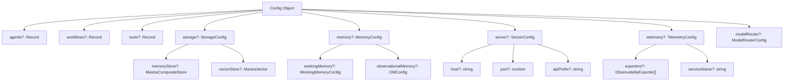
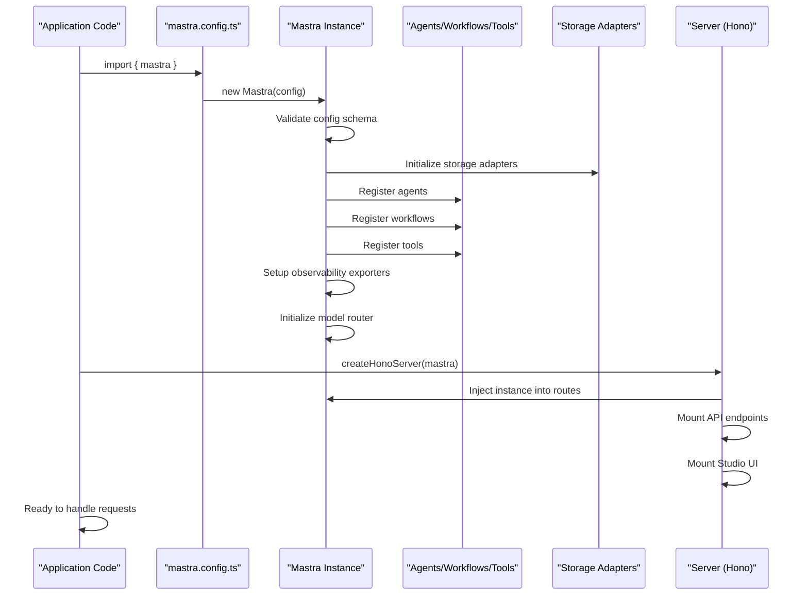
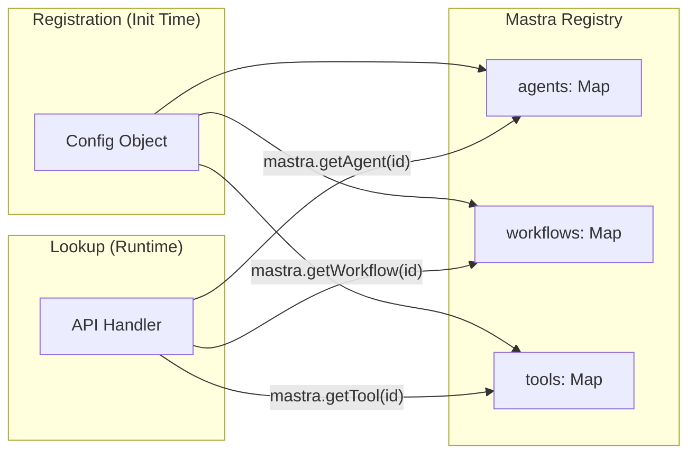
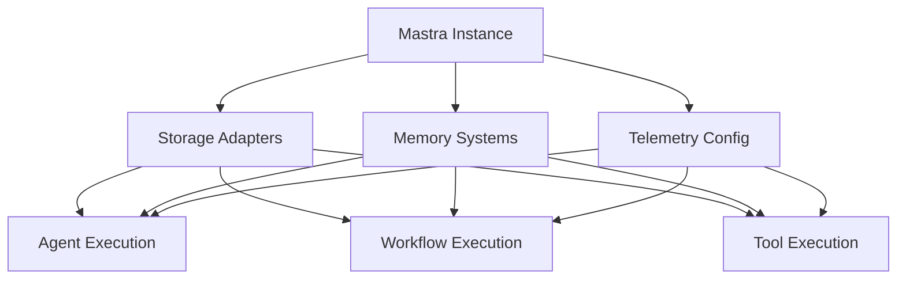
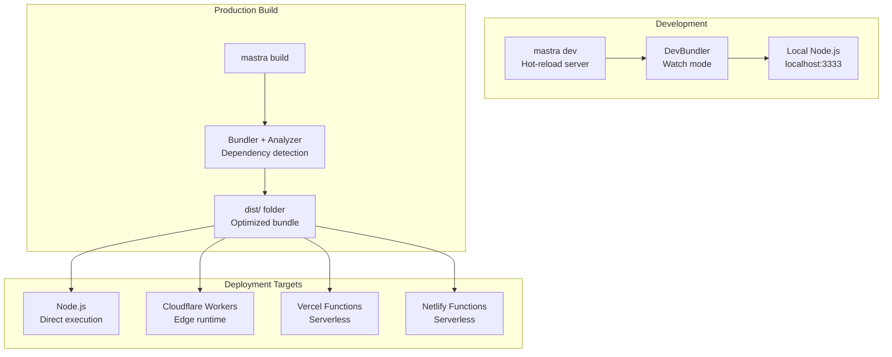
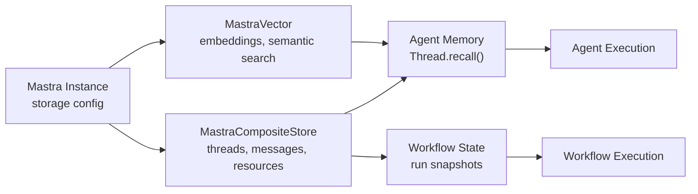
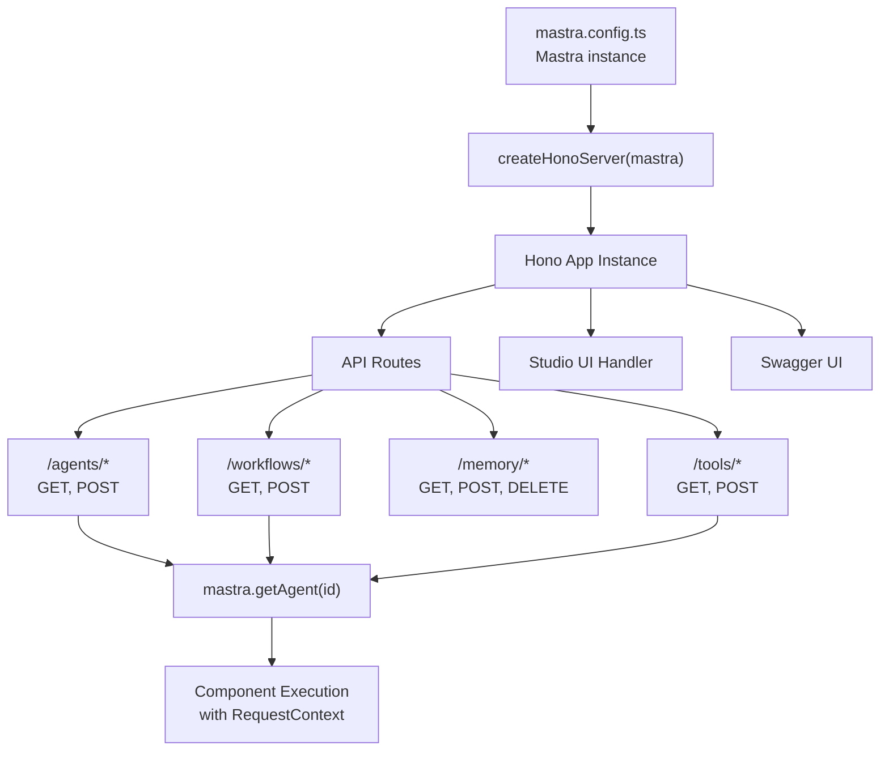
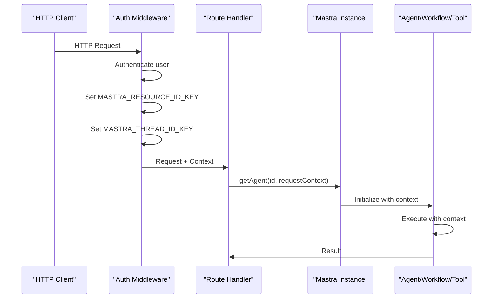
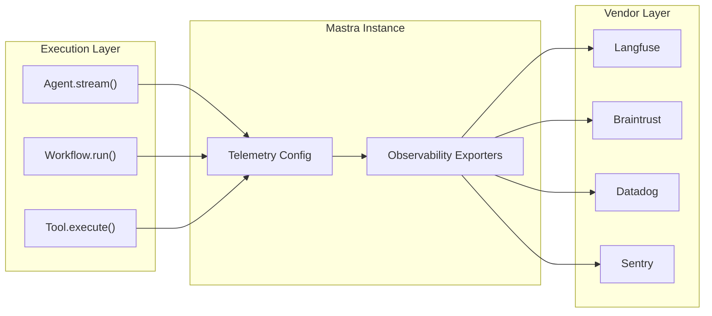

# Mastra Core and Configuration

<details>
<summary>Relevant source files</summary>

The following files were used as context for generating this wiki page:

- [.changeset/pre.json](.changeset/pre.json)
- [client-sdks/client-js/CHANGELOG.md](client-sdks/client-js/CHANGELOG.md)
- [client-sdks/client-js/package.json](client-sdks/client-js/package.json)
- [client-sdks/react/package.json](client-sdks/react/package.json)
- [deployers/cloudflare/CHANGELOG.md](deployers/cloudflare/CHANGELOG.md)
- [deployers/cloudflare/package.json](deployers/cloudflare/package.json)
- [deployers/netlify/CHANGELOG.md](deployers/netlify/CHANGELOG.md)
- [deployers/netlify/package.json](deployers/netlify/package.json)
- [deployers/vercel/CHANGELOG.md](deployers/vercel/CHANGELOG.md)
- [deployers/vercel/package.json](deployers/vercel/package.json)
- [examples/dane/CHANGELOG.md](examples/dane/CHANGELOG.md)
- [examples/dane/package.json](examples/dane/package.json)
- [package.json](package.json)
- [packages/cli/CHANGELOG.md](packages/cli/CHANGELOG.md)
- [packages/cli/package.json](packages/cli/package.json)
- [packages/core/CHANGELOG.md](packages/core/CHANGELOG.md)
- [packages/core/package.json](packages/core/package.json)
- [packages/core/src/index.ts](packages/core/src/index.ts)
- [packages/create-mastra/CHANGELOG.md](packages/create-mastra/CHANGELOG.md)
- [packages/create-mastra/package.json](packages/create-mastra/package.json)
- [packages/deployer/CHANGELOG.md](packages/deployer/CHANGELOG.md)
- [packages/deployer/package.json](packages/deployer/package.json)
- [packages/mcp-docs-server/CHANGELOG.md](packages/mcp-docs-server/CHANGELOG.md)
- [packages/mcp-docs-server/package.json](packages/mcp-docs-server/package.json)
- [packages/mcp/CHANGELOG.md](packages/mcp/CHANGELOG.md)
- [packages/mcp/package.json](packages/mcp/package.json)
- [packages/playground-ui/CHANGELOG.md](packages/playground-ui/CHANGELOG.md)
- [packages/playground-ui/package.json](packages/playground-ui/package.json)
- [packages/playground/CHANGELOG.md](packages/playground/CHANGELOG.md)
- [packages/playground/package.json](packages/playground/package.json)
- [packages/server/CHANGELOG.md](packages/server/CHANGELOG.md)
- [packages/server/package.json](packages/server/package.json)
- [pnpm-lock.yaml](pnpm-lock.yaml)

</details>

## Purpose and Scope

This page documents the `Mastra` class and its configuration system, which serve as the central orchestration layer for Mastra applications. The `Mastra` instance acts as a registry and dependency injection container that wires together agents, workflows, tools, memory systems, and storage adapters into a cohesive application.

For detailed configuration schema options, see [Configuration Schema and Options](#2.1). For information about runtime context and dynamic configuration, see [RequestContext and Dynamic Configuration](#2.2). For system architecture patterns across the entire framework, see [System Architecture Overview](#1.2).

**Sources:** [packages/core/src/index.ts:1-2](), [packages/core/package.json:1-334]()

---

## The Mastra Class

The `Mastra` class is the primary entry point for building Mastra applications. It serves as a centralized registry that:

- **Registers agents, workflows, and tools** from configuration
- **Provides storage and memory systems** to all components
- **Manages observability** and telemetry configuration
- **Enables deployment** across multiple platforms via deployers
- **Handles dynamic configuration** through RequestContext

The class follows a singleton-like pattern within each application instance, initialized once at startup with a `Config` object and then accessed throughout the application lifecycle.

**Key Responsibilities:**

| Responsibility               | Description                                                    |
| ---------------------------- | -------------------------------------------------------------- |
| **Component Registry**       | Stores and retrieves agents, workflows, tools by ID            |
| **Storage Provider**         | Supplies storage adapters to memory, RAG, and workflow systems |
| **Configuration Repository** | Holds server options, model configs, telemetry settings        |
| **Context Manager**          | Provides RequestContext to all execution paths                 |
| **Lifecycle Manager**        | Initializes components, validates config, exposes APIs         |

**Sources:** [packages/core/src/index.ts:1-2](), Diagram 1 from high-level architecture

---

## Configuration Structure

The `Config` type defines the initialization options for a Mastra instance. It encompasses all aspects of the application including agents, workflows, tools, storage, memory, observability, and server settings.



**Configuration Categories:**

| Category        | Purpose                                    | Child Page Reference                             |
| --------------- | ------------------------------------------ | ------------------------------------------------ |
| **agents**      | Agent definitions and configurations       | [Agent Configuration and Execution](#3.1)        |
| **workflows**   | Workflow definitions and execution engines | [Workflow Definition and Step Composition](#4.1) |
| **tools**       | Tool definitions and execution contexts    | [Tool Definition and Execution Context](#6.1)    |
| **storage**     | Storage adapters for persistence           | [Storage Domain Architecture](#7.3)              |
| **memory**      | Memory system configuration                | [Memory System Architecture](#7.1)               |
| **server**      | HTTP server settings and routing           | [Server Architecture and Setup](#9.1)            |
| **telemetry**   | Observability and tracing config           | [Observability System and Tracing](#11.1)        |
| **modelRouter** | LLM provider and model settings            | [Provider Registry and Model Catalog](#5.1)      |

**Sources:** [packages/core/package.json:1-334](), [packages/cli/package.json:1-110](), [packages/server/package.json:1-140]()

---

## Mastra Initialization Flow

The initialization of a Mastra instance follows a specific sequence that validates configuration, registers components, and prepares runtime systems.



**Initialization Steps:**

1. **Configuration Loading**: The `mastra.config.ts` file exports a configured Mastra instance
2. **Schema Validation**: Config object is validated against internal schemas
3. **Storage Initialization**: Storage adapters (libSQL, PostgreSQL, etc.) are instantiated
4. **Component Registration**: Agents, workflows, and tools are registered in internal maps
5. **Observability Setup**: Telemetry exporters and tracing are configured
6. **Model Router Preparation**: LLM provider configurations are indexed
7. **Server Creation**: Hono server is created with Mastra instance injected into route handlers

**Sources:** [packages/cli/package.json:1-110](), [packages/deployer/package.json:1-165](), [packages/server/package.json:1-140]()

---

## Core Architecture Patterns

### Registry Pattern

Mastra uses a registry pattern to store and retrieve components by string identifiers. Agents, workflows, and tools are registered during initialization and accessed by ID at runtime.



**Registry Methods (Conceptual):**

| Method            | Returns                 | Description                    |
| ----------------- | ----------------------- | ------------------------------ |
| `getAgent(id)`    | `Agent \| undefined`    | Retrieves agent by ID          |
| `getWorkflow(id)` | `Workflow \| undefined` | Retrieves workflow by ID       |
| `getTool(id)`     | `Tool \| undefined`     | Retrieves tool by ID           |
| `listAgents()`    | `Agent[]`               | Lists all registered agents    |
| `listWorkflows()` | `Workflow[]`            | Lists all registered workflows |
| `listTools()`     | `Tool[]`                | Lists all registered tools     |

**Sources:** [packages/core/package.json:1-334](), [packages/server/package.json:1-140]()

### Dependency Injection

Mastra provides storage, memory, and observability systems to agents, workflows, and tools through constructor injection or context passing. This enables components to be tested in isolation and deployed with different backend configurations.



**Injection Points:**

- **Agent Construction**: Storage and memory injected via agent config
- **Workflow Execution**: Engine receives storage from Mastra instance
- **Tool Context**: Execution context includes `mastra` reference with full access
- **Request Handling**: RequestContext flows from Mastra through all layers

**Sources:** [packages/core/package.json:1-334](), [packages/server/package.json:1-140](), Diagram 1 from high-level architecture

### Plugin Architecture

Tools, storage adapters, and observability exporters follow a plugin pattern where implementations conform to interfaces defined in `@mastra/core`. This allows third-party packages to extend Mastra without modifying core code.

**Plugin Categories:**

| Plugin Type                | Interface               | Example Packages                                            |
| -------------------------- | ----------------------- | ----------------------------------------------------------- |
| **Storage Adapter**        | `MastraCompositeStore`  | `@mastra/pg`, `@mastra/libsql`, `@mastra/upstash`           |
| **Vector Store**           | `MastraVector`          | `@mastra/pinecone`, `@mastra/qdrant`, `@mastra/chroma`      |
| **Observability Exporter** | `ObservabilityExporter` | `@mastra/langfuse`, `@mastra/braintrust`, `@mastra/datadog` |
| **Model Provider**         | Provider Registry       | 94 providers via `provider-registry.json`                   |
| **Tool**                   | `Tool` interface        | User-defined, MCP servers, Vercel AI SDK tools              |

**Sources:** [packages/core/package.json:1-334](), [pnpm-lock.yaml:1-1967947]() showing storage adapter packages

---

## Mastra Instance Lifecycle

A Mastra instance progresses through three main phases during its lifetime:

### 1. Initialization Phase

The instance is created with a `Config` object. Configuration is validated, storage adapters are connected, and components are registered. No requests are handled yet.

**Occurs In:**

- `mastra.config.ts` file at import time
- Deployer bundling process during build
- CLI `mastra dev` server startup

### 2. Registration Phase

Components (agents, workflows, tools) are added to internal registries. This phase is complete when the config object has been fully processed and all components are accessible via lookup methods.

**Validation Steps:**

- Agent IDs are unique
- Tool schemas are valid
- Storage adapters are connectable
- Model router configurations are resolvable

### 3. Runtime Phase

The Mastra instance serves requests via the server layer or direct API calls. Components are retrieved from registries and executed with RequestContext.

**Runtime Operations:**

- Retrieve agent by ID and call `.generate()` or `.stream()`
- Retrieve workflow by ID and call `.run()`
- Retrieve tool by ID and call `.execute()`
- Provide storage/memory to all executions
- Inject RequestContext into all operations

**Sources:** [packages/cli/package.json:1-110](), [packages/deployer/package.json:1-165](), [packages/server/package.json:1-140]()

---

## Deployment Contexts

Mastra instances are designed to run in multiple deployment environments with different runtime characteristics:



**Deployment Characteristics by Platform:**

| Platform               | Runtime              | Storage Constraints                   | Server Type       |
| ---------------------- | -------------------- | ------------------------------------- | ----------------- |
| **Node.js**            | Long-running process | Full file system access               | HTTP server       |
| **Cloudflare Workers** | Edge runtime         | No file system, KV/D1/Durable Objects | Hono on Workers   |
| **Vercel Functions**   | Serverless (Node.js) | Ephemeral file system                 | Hono on Node      |
| **Netlify Functions**  | Serverless (Node.js) | Ephemeral file system                 | Hono on Node      |
| **CLI Dev Mode**       | Local Node.js        | Full file system access               | Hot-reload server |

**Configuration Differences:**

- **Storage**: Production uses remote databases (PostgreSQL, Upstash), dev may use libSQL
- **Observability**: Production exports to vendors (Langfuse, Braintrust), dev uses console
- **Server**: Production uses platform-specific adapters, dev uses vanilla Node HTTP

**Sources:** [packages/cli/package.json:1-110](), [packages/deployer/package.json:1-165](), [deployers/cloudflare/package.json:1-90](), [deployers/vercel/package.json:1-67](), [deployers/netlify/package.json:1-67]()

---

## Integration Points

The Mastra instance serves as the integration hub connecting all major subsystems. Each subsystem accesses Mastra through well-defined interfaces.

### Agent Integration

Agents are registered in the Mastra config and retrieved at runtime. The agent execution context includes a reference to the Mastra instance, allowing agents to:

- Access storage for memory persistence
- Call other agents via network tools
- Use configured model router for LLM calls
- Emit telemetry via observability exporters

**Agent Access Pattern:**

```typescript
// Configuration time
const mastra = new Mastra({
  agents: { myAgent: new Agent({ ... }) }
});

// Runtime
const agent = mastra.getAgent('myAgent');
const result = await agent.generate('Hello', { requestContext });
```

**Sources:** [packages/core/src/index.ts:1-2](), [packages/server/package.json:1-140]()

### Workflow Integration

Workflows are registered similarly to agents and use Mastra-provided storage for state persistence and event publishing.

**Workflow Execution Context:**

- `ExecutionEngine` receives storage adapter from Mastra
- Workflow steps can invoke agents and tools via Mastra registry
- Suspend/resume data persists in Mastra-provided storage
- Events published to Mastra-configured PubSub systems

**Sources:** [packages/core/package.json:1-334](), [packages/server/package.json:1-140]()

### Storage and Memory Integration

Mastra provides storage adapters to both memory systems and workflow engines. Memory systems query storage for messages, threads, and embeddings. Workflows persist run state and snapshots.

**Storage Flow:**



**Sources:** [packages/core/package.json:1-334](), [packages/server/package.json:1-140](), Diagram 4 from high-level architecture

### Observability Integration

Telemetry configuration in Mastra determines which observability exporters receive trace and span data from agent and workflow execution.

**Observability Providers:**

- Configured once in Mastra config
- Injected into all execution contexts
- Spans created via OpenTelemetry API
- Exporters send data to vendors (Langfuse, Braintrust, Datadog, etc.)

**Sources:** [packages/core/package.json:1-334](), [pnpm-lock.yaml:1-1967947]() showing observability packages

---

## Configuration File Pattern

Most Mastra applications define a `mastra.config.ts` file at the project root that exports a configured Mastra instance. The CLI and deployers import this file to access the instance.

**Typical Structure:**

```
project/
├── mastra.config.ts       # Exports configured Mastra instance
├── src/
│   ├── agents/           # Agent definitions
│   ├── workflows/        # Workflow definitions
│   ├── tools/            # Tool definitions
│   └── index.ts          # Server entry point
└── package.json
```

**Configuration File Responsibilities:**

- Import agents, workflows, tools from source files
- Initialize storage adapters (e.g., `new PostgresStore()`)
- Configure memory systems (working memory, observational memory)
- Set server options (host, port, apiPrefix)
- Configure observability exporters
- Export single Mastra instance for entire application

**Sources:** [packages/cli/package.json:1-110](), [packages/deployer/package.json:1-165](), [packages/create-mastra/package.json:1-74]()

---

## Server Integration

The Mastra instance is passed to server creation functions which mount API routes and Studio UI. The server uses Mastra's registry to handle requests.



**Server Routes Accessing Mastra:**

| Route Pattern               | Mastra Method                    | Purpose                       |
| --------------------------- | -------------------------------- | ----------------------------- |
| `GET /agents`               | `mastra.listAgents()`            | List all agents               |
| `GET /agents/:id`           | `mastra.getAgent(id)`            | Get agent details             |
| `POST /agents/:id/generate` | `mastra.getAgent(id).generate()` | Execute agent (non-streaming) |
| `POST /agents/:id/stream`   | `mastra.getAgent(id).stream()`   | Execute agent (streaming)     |
| `GET /workflows`            | `mastra.listWorkflows()`         | List all workflows            |
| `POST /workflows/:id/run`   | `mastra.getWorkflow(id).run()`   | Execute workflow              |
| `GET /tools`                | `mastra.listTools()`             | List all tools                |
| `POST /tools/:id/execute`   | `mastra.getTool(id).execute()`   | Execute tool                  |

**Sources:** [packages/server/package.json:1-140](), [packages/deployer/package.json:1-165](), Diagram 6 from high-level architecture

---

## RequestContext Flow

The `RequestContext` object flows through all execution paths from the HTTP request handler down to individual tool executions. Mastra serves as the origin point for RequestContext creation and injection.

**Context Creation:**



**RequestContext Usage:**

- **Authentication**: Resource ID and Thread ID from middleware
- **Tenant Isolation**: Storage queries filtered by resource ID
- **Dynamic Configuration**: Agent model selection per user
- **Tracing**: Trace IDs propagated through context

For detailed information about RequestContext structure and usage patterns, see [RequestContext and Dynamic Configuration](#2.2).

**Sources:** [packages/server/package.json:1-140](), [packages/core/package.json:1-334](), Diagram 6 from high-level architecture

---

## Telemetry and Observability

Mastra manages observability configuration and provides telemetry infrastructure to all components. Trace and span data flow from execution contexts through Mastra-configured exporters to observability vendors.

**Telemetry Architecture:**



**Telemetry Configuration:**

- Defined once in Mastra config
- Exporters initialized at Mastra construction
- Trace/span data collected via OpenTelemetry API
- Exporters receive batched telemetry data
- Service name, environment, and tags configurable

For detailed information about observability configuration and integration, see [Observability System and Tracing](#11.1) and [Observability Integration and Exporters](#11.2).

**Sources:** [packages/core/package.json:1-334](), [pnpm-lock.yaml:1-1967947]() showing observability packages, Diagram 1 from high-level architecture

---

## Summary

The Mastra class serves as the central orchestration layer that:

1. **Registers** agents, workflows, and tools from configuration
2. **Provides** storage, memory, and observability systems to all components
3. **Manages** RequestContext for authentication and tenant isolation
4. **Enables** deployment to multiple platforms (Node.js, Cloudflare, Vercel, Netlify)
5. **Exposes** APIs via server integration for client consumption

The configuration-driven architecture allows developers to define their entire application in a single `mastra.config.ts` file, with Mastra handling component wiring, dependency injection, and lifecycle management.

**Next Steps:**

- For detailed configuration options, see [Configuration Schema and Options](#2.1)
- For RequestContext patterns, see [RequestContext and Dynamic Configuration](#2.2)
- For agent system details, see [Agent System](#3)
- For workflow system details, see [Workflow System](#4)

**Sources:** [packages/core/src/index.ts:1-2](), [packages/core/package.json:1-334](), [packages/cli/package.json:1-110](), [packages/server/package.json:1-140](), [packages/deployer/package.json:1-165]()
