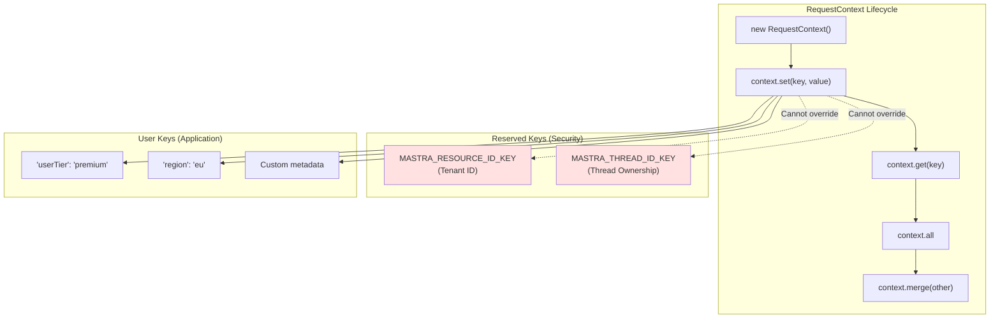
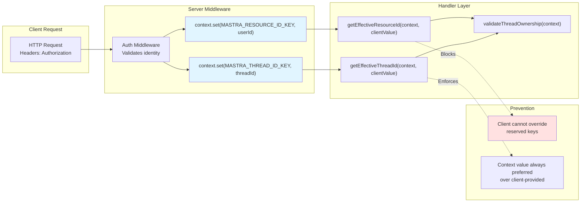
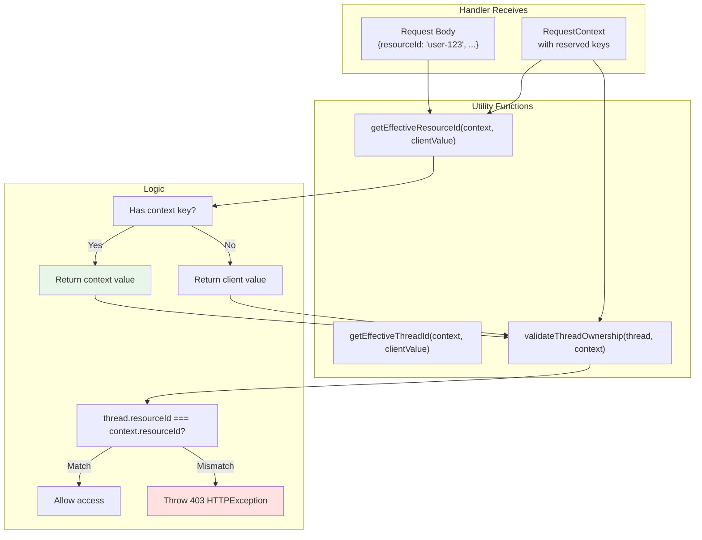
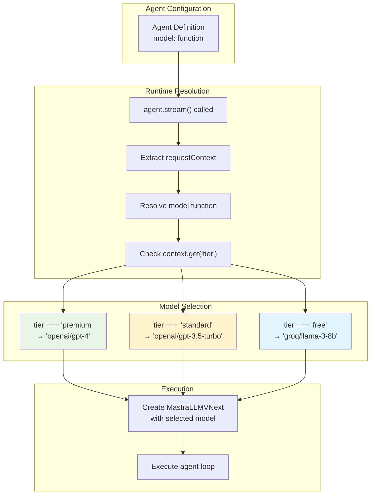
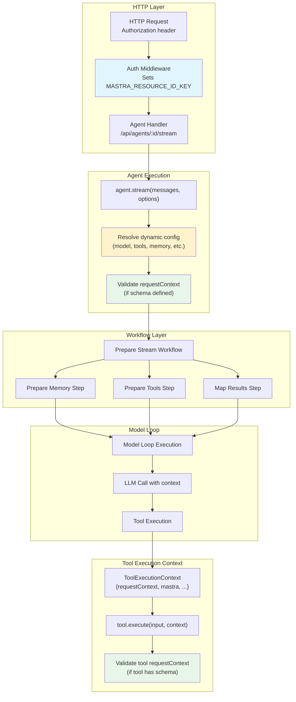

# RequestContext and Dynamic Configuration

<details>
<summary>Relevant source files</summary>

The following files were used as context for generating this wiki page:

- [client-sdks/client-js/src/client.ts](client-sdks/client-js/src/client.ts)
- [client-sdks/client-js/src/resources/agent.test.ts](client-sdks/client-js/src/resources/agent.test.ts)
- [client-sdks/client-js/src/resources/agent.ts](client-sdks/client-js/src/resources/agent.ts)
- [client-sdks/client-js/src/resources/agent.vnext.test.ts](client-sdks/client-js/src/resources/agent.vnext.test.ts)
- [client-sdks/client-js/src/resources/index.ts](client-sdks/client-js/src/resources/index.ts)
- [client-sdks/client-js/src/types.ts](client-sdks/client-js/src/types.ts)
- [e2e-tests/create-mastra/create-mastra.test.ts](e2e-tests/create-mastra/create-mastra.test.ts)
- [examples/bird-checker-with-express/src/index.ts](examples/bird-checker-with-express/src/index.ts)
- [examples/bird-checker-with-nextjs-and-eval/src/lib/mastra/actions.ts](examples/bird-checker-with-nextjs-and-eval/src/lib/mastra/actions.ts)
- [packages/core/src/action/index.ts](packages/core/src/action/index.ts)
- [packages/core/src/agent/**tests**/dynamic-model-fallback.test.ts](packages/core/src/agent/__tests__/dynamic-model-fallback.test.ts)
- [packages/core/src/agent/**tests**/utils.test.ts](packages/core/src/agent/__tests__/utils.test.ts)
- [packages/core/src/agent/agent-legacy.ts](packages/core/src/agent/agent-legacy.ts)
- [packages/core/src/agent/agent.test.ts](packages/core/src/agent/agent.test.ts)
- [packages/core/src/agent/agent.ts](packages/core/src/agent/agent.ts)
- [packages/core/src/agent/agent.types.ts](packages/core/src/agent/agent.types.ts)
- [packages/core/src/agent/index.ts](packages/core/src/agent/index.ts)
- [packages/core/src/agent/trip-wire.ts](packages/core/src/agent/trip-wire.ts)
- [packages/core/src/agent/types.ts](packages/core/src/agent/types.ts)
- [packages/core/src/agent/utils.ts](packages/core/src/agent/utils.ts)
- [packages/core/src/agent/workflows/prepare-stream/index.ts](packages/core/src/agent/workflows/prepare-stream/index.ts)
- [packages/core/src/agent/workflows/prepare-stream/map-results-step.ts](packages/core/src/agent/workflows/prepare-stream/map-results-step.ts)
- [packages/core/src/agent/workflows/prepare-stream/prepare-memory-step.ts](packages/core/src/agent/workflows/prepare-stream/prepare-memory-step.ts)
- [packages/core/src/agent/workflows/prepare-stream/prepare-tools-step.ts](packages/core/src/agent/workflows/prepare-stream/prepare-tools-step.ts)
- [packages/core/src/agent/workflows/prepare-stream/stream-step.ts](packages/core/src/agent/workflows/prepare-stream/stream-step.ts)
- [packages/core/src/llm/index.ts](packages/core/src/llm/index.ts)
- [packages/core/src/llm/model/model.test.ts](packages/core/src/llm/model/model.test.ts)
- [packages/core/src/llm/model/model.ts](packages/core/src/llm/model/model.ts)
- [packages/core/src/mastra/index.ts](packages/core/src/mastra/index.ts)
- [packages/core/src/memory/mock.ts](packages/core/src/memory/mock.ts)
- [packages/core/src/observability/types/tracing.ts](packages/core/src/observability/types/tracing.ts)
- [packages/core/src/storage/mock.test.ts](packages/core/src/storage/mock.test.ts)
- [packages/core/src/stream/aisdk/v5/execute.ts](packages/core/src/stream/aisdk/v5/execute.ts)
- [packages/core/src/stream/aisdk/v5/transform.test.ts](packages/core/src/stream/aisdk/v5/transform.test.ts)
- [packages/core/src/stream/aisdk/v5/transform.ts](packages/core/src/stream/aisdk/v5/transform.ts)
- [packages/core/src/tools/tool-builder/builder.test.ts](packages/core/src/tools/tool-builder/builder.test.ts)
- [packages/core/src/tools/tool-builder/builder.ts](packages/core/src/tools/tool-builder/builder.ts)
- [packages/core/src/tools/tool.ts](packages/core/src/tools/tool.ts)
- [packages/core/src/tools/types.ts](packages/core/src/tools/types.ts)
- [packages/server/src/server/handlers.ts](packages/server/src/server/handlers.ts)
- [packages/server/src/server/handlers/agent.test.ts](packages/server/src/server/handlers/agent.test.ts)
- [packages/server/src/server/handlers/agents.ts](packages/server/src/server/handlers/agents.ts)
- [packages/server/src/server/handlers/memory.test.ts](packages/server/src/server/handlers/memory.test.ts)
- [packages/server/src/server/handlers/memory.ts](packages/server/src/server/handlers/memory.ts)
- [packages/server/src/server/handlers/utils.test.ts](packages/server/src/server/handlers/utils.test.ts)
- [packages/server/src/server/handlers/utils.ts](packages/server/src/server/handlers/utils.ts)
- [packages/server/src/server/handlers/vector.test.ts](packages/server/src/server/handlers/vector.test.ts)
- [packages/server/src/server/schemas/memory.test.ts](packages/server/src/server/schemas/memory.test.ts)
- [packages/server/src/server/schemas/memory.ts](packages/server/src/server/schemas/memory.ts)

</details>

This page documents the `RequestContext` system for managing request-scoped state and the dynamic configuration pattern that enables runtime adaptation of agents, tools, workflows, and other Mastra components based on contextual data. For information about agent-specific memory configuration, see [Agent Memory System](#3.4). For workflow-specific state management, see [Workflow State Management and Persistence](#4.3).

## Purpose and Scope

The RequestContext system provides:

1. **Request-scoped key-value storage** for passing contextual data through the execution stack
2. **Tenant isolation** via reserved security keys that prevent unauthorized access
3. **Dynamic configuration resolution** enabling runtime adaptation of components based on context
4. **Authorization enforcement** through middleware-controlled reserved keys

All components in Mastra (agents, workflows, tools, processors, memory) can access and utilize RequestContext for context-aware behavior.

---

## RequestContext: Core Concepts

### Key-Value Store

`RequestContext` is a simple key-value store that carries request-scoped data throughout the execution lifecycle. It provides type-safe access to context values and supports both primitive and complex data types.



**RequestContext Operations**

| Method            | Description                                         | Example                            |
| ----------------- | --------------------------------------------------- | ---------------------------------- |
| `set(key, value)` | Set a context value (cannot override reserved keys) | `context.set('tier', 'premium')`   |
| `get(key)`        | Retrieve a context value                            | `const tier = context.get('tier')` |
| `all`             | Get all context values as object                    | `const data = context.all`         |
| `merge(other)`    | Merge another RequestContext into this one          | `context.merge(otherContext)`      |
| `has(key)`        | Check if key exists                                 | `if (context.has('tier'))`         |

**Sources:** [packages/core/src/request-context/index.ts:1-100]()

### Reserved Keys and Security Model

Two keys are **reserved** and controlled exclusively by server-side middleware to enforce multi-tenant isolation and authorization:



**Reserved Key Constants**

```typescript
// From packages/core/src/request-context/index.ts
export const MASTRA_RESOURCE_ID_KEY = '__MASTRA_RESOURCE_ID__'
export const MASTRA_THREAD_ID_KEY = '__MASTRA_THREAD_ID__'
```

These keys enforce:

- **Tenant Isolation**: `MASTRA_RESOURCE_ID_KEY` identifies the authenticated user/tenant
- **Thread Ownership**: `MASTRA_THREAD_ID_KEY` associates threads with specific resources
- **Authorization**: Prevents clients from spoofing identity by setting these keys

**Sources:** [packages/core/src/request-context/index.ts:5-10](), [packages/server/src/server/handlers/utils.ts:1-150]()

### Security Enforcement Pattern

The server uses utility functions to enforce security invariants:



**Sources:** [packages/server/src/server/handlers/utils.ts:50-120]()

### RequestContext Validation

Agents, workflows, and tools can define schemas to validate RequestContext values before execution:

```typescript
// Agent with requestContextSchema
const agent = new Agent({
  id: 'tenant-agent',
  name: 'Tenant Agent',
  instructions: 'You are a tenant-aware agent',
  model: 'openai/gpt-4',
  requestContextSchema: z.object({
    tier: z.enum(['free', 'premium', 'enterprise']),
    region: z.string(),
    userId: z.string(),
  }),
})
```

Validation occurs before execution and throws a `MastraError` if the context doesn't match the schema.

**Sources:** [packages/core/src/agent/agent.ts:382-407]()

---

## Dynamic Configuration Pattern

Dynamic configuration allows components to adapt their behavior based on RequestContext. Instead of static values, configuration fields accept functions that receive the context and return the appropriate value.

### DynamicArgument Type

The `DynamicArgument<T, TRequestContext>` type represents values that can be static or dynamically resolved:

```typescript
type DynamicArgument<T, TRequestContext = unknown> =
  | T
  | ((context: {
      requestContext: RequestContext<TRequestContext>
    }) => T | Promise<T>)
```

This pattern applies to most agent configuration fields:

- `model` - Select model based on user tier, region, or feature flags
- `instructions` - Customize system prompt per tenant or locale
- `tools` - Enable/disable tools based on permissions
- `workflows` - Provide different workflows per tenant
- `agents` - Configure sub-agents dynamically
- `scorers` - Apply different evaluation criteria
- `memory` - Use tenant-specific memory instances
- `workspace` - Isolate workspaces per tenant
- `inputProcessors` / `outputProcessors` - Dynamic pre/post-processing

**Sources:** [packages/core/src/types.ts:1-50]()

### Dynamic Model Selection

Model selection is one of the most common use cases for dynamic configuration:



**Example: Tier-Based Model Selection**

```typescript
const agent = new Agent({
  id: 'assistant',
  name: 'Assistant',
  instructions: 'You are a helpful assistant',
  model: ({ requestContext }) => {
    const tier = requestContext.get('tier')
    if (tier === 'premium') {
      return 'openai/gpt-4'
    } else if (tier === 'standard') {
      return 'openai/gpt-3.5-turbo'
    }
    return 'groq/llama-3-8b' // free tier
  },
  // ... other config
})

// Usage with RequestContext
const context = new RequestContext()
context.set('tier', 'premium')

const response = await agent.stream('Hello!', {
  requestContext: context,
})
```

**Sources:** [packages/core/src/agent/agent.ts:158-254](), [client-sdks/client-js/src/types.ts:178-227]()

### Dynamic Model Fallback Arrays

Model fallbacks can also be configured dynamically to provide different retry strategies per tenant:

```typescript
const agent = new Agent({
  id: 'resilient-agent',
  name: 'Resilient Agent',
  instructions: 'You are a resilient agent with fallbacks',
  model: ({ requestContext }) => {
    const tier = requestContext.get('tier')

    if (tier === 'premium') {
      // Premium: multiple high-quality fallbacks
      return [
        { model: 'openai/gpt-4', maxRetries: 3 },
        { model: 'anthropic/claude-3-opus', maxRetries: 2 },
        { model: 'openai/gpt-3.5-turbo', maxRetries: 1 },
      ]
    }

    // Standard: single model with retries
    return [{ model: 'openai/gpt-3.5-turbo', maxRetries: 2 }]
  },
  // ... other config
})
```

**Sources:** [packages/core/src/agent/types.ts:125-219]()

### Dynamic Instructions

System instructions can adapt based on user locale, tenant configuration, or feature flags:

```typescript
const agent = new Agent({
  id: 'localized-agent',
  name: 'Localized Agent',
  instructions: ({ requestContext }) => {
    const locale = requestContext.get('locale') || 'en'
    const tier = requestContext.get('tier')

    let instructions = INSTRUCTIONS[locale] || INSTRUCTIONS['en']

    if (tier === 'premium') {
      instructions +=
        '\
\
You have access to advanced features like code execution and web search.'
    }

    return instructions
  },
  model: 'openai/gpt-4',
  // ... other config
})
```

**Sources:** [packages/core/src/agent/agent.ts:156-157]()

### Dynamic Tools

Tools can be enabled/disabled based on user permissions, feature flags, or tenant configuration:

```typescript
const agent = new Agent({
  id: 'permissioned-agent',
  name: 'Permissioned Agent',
  instructions: 'You are a permissioned agent',
  model: 'openai/gpt-4',
  tools: ({ requestContext }) => {
    const permissions = requestContext.get('permissions') || []

    const baseTools = {
      searchWeb: webSearchTool,
      getWeather: weatherTool,
    }

    // Add admin tools only if user has admin permission
    if (permissions.includes('admin')) {
      return {
        ...baseTools,
        deleteUser: deleteUserTool,
        modifySettings: modifySettingsTool,
      }
    }

    return baseTools
  },
  // ... other config
})
```

**Sources:** [packages/core/src/agent/agent.ts:169-278]()

### Dynamic Memory Configuration

Memory instances can be tenant-scoped to ensure data isolation:

```typescript
// Mastra instance with multiple tenant-scoped memory instances
const mastra = new Mastra({
  memory: {
    tenantA: new Memory({ storage, vector: vectorA }),
    tenantB: new Memory({ storage, vector: vectorB }),
  },
})

// Agent with dynamic memory selection
const agent = new Agent({
  id: 'tenant-agent',
  name: 'Tenant Agent',
  instructions: 'You are a tenant-aware agent',
  model: 'openai/gpt-4',
  memory: ({ requestContext }) => {
    const tenantId = requestContext.get('tenantId')
    return mastra.getMemory(`tenant${tenantId}`)
  },
  // ... other config
})
```

**Sources:** [packages/core/src/agent/agent.ts:281-282]()

---

## RequestContext Flow Through Execution

RequestContext propagates through the entire execution stack, from HTTP request to tool execution:



**Sources:** [packages/server/src/server/handlers/agents.ts:1-100](), [packages/core/src/agent/agent.ts:1500-1700](), [packages/core/src/tools/tool-builder/builder.ts:310-450]()

### Context Propagation Points

| Layer                  | How Context Passes                                           | Code Reference                                              |
| ---------------------- | ------------------------------------------------------------ | ----------------------------------------------------------- |
| **HTTP Handler**       | Extracted from `options.requestContext` in request body      | [packages/server/src/server/handlers/agents.ts:400-500]()   |
| **Agent Execution**    | Passed to `agent.stream(messages, { requestContext })`       | [packages/core/src/agent/agent.ts:1500-1600]()              |
| **Dynamic Resolution** | Provided to dynamic config functions as `{ requestContext }` | [packages/core/src/agent/agent.ts:800-1000]()               |
| **Workflow Steps**     | Available in workflow step context via `prepareStep`         | [packages/core/src/workflows/types.ts:100-200]()            |
| **Tool Execution**     | Passed in `ToolExecutionContext` to `tool.execute()`         | [packages/core/src/tools/tool-builder/builder.ts:310-400]() |
| **Processors**         | Available in processor input/output via context              | [packages/core/src/processors/types.ts:1-100]()             |

---

## Server-Side RequestContext Management

### Auth Middleware Pattern

Server middleware sets reserved keys based on authenticated identity:

```typescript
// Simplified example from server handlers
const authMiddleware = (c: Context, next: () => Promise<void>) => {
  const userId = authenticateUser(c.req.header('Authorization'))

  // Create RequestContext and set reserved key
  const requestContext = new RequestContext()
  requestContext.set(MASTRA_RESOURCE_ID_KEY, userId)

  // Store in request state for handlers
  c.set('requestContext', requestContext)

  return next()
}
```

**Sources:** [packages/server/src/server/handlers/utils.ts:1-50]()

### Override Prevention

Handler utilities always prefer context values over client-provided values:

```typescript
// From packages/server/src/server/handlers/utils.ts
export function getEffectiveResourceId(
  requestContext: RequestContext | undefined,
  clientProvidedResourceId?: string
): string | undefined {
  // Context value takes precedence (set by auth middleware)
  const contextResourceId = requestContext?.get(MASTRA_RESOURCE_ID_KEY)
  if (contextResourceId) {
    return contextResourceId
  }

  // Fall back to client value only if no context value
  return clientProvidedResourceId
}

export function getEffectiveThreadId(
  requestContext: RequestContext | undefined,
  clientProvidedThreadId?: string
): string | undefined {
  const contextThreadId = requestContext?.get(MASTRA_THREAD_ID_KEY)
  if (contextThreadId) {
    return contextThreadId
  }
  return clientProvidedThreadId
}
```

**Sources:** [packages/server/src/server/handlers/utils.ts:50-100]()

### Thread Ownership Validation

Before accessing threads, handlers validate ownership:

```typescript
// From packages/server/src/server/handlers/utils.ts
export async function validateThreadOwnership(
  thread: StorageThreadType,
  requestContext?: RequestContext
): Promise<void> {
  const effectiveResourceId = requestContext?.get(MASTRA_RESOURCE_ID_KEY)

  if (!effectiveResourceId) {
    // No authenticated user - skip validation
    return
  }

  if (thread.resourceId !== effectiveResourceId) {
    throw new HTTPException(403, {
      message: 'You do not have permission to access this thread',
    })
  }
}
```

**Sources:** [packages/server/src/server/handlers/utils.ts:120-150]()

---

## RequestContext in Different Execution Modes

### Agent Execution

```typescript
// Client provides context
const context = new RequestContext()
context.set('tier', 'premium')
context.set('locale', 'en-US')

// Context is used for:
// 1. Dynamic configuration resolution
// 2. Validation (if agent has requestContextSchema)
// 3. Passed to tools, processors, memory
const response = await agent.stream('Hello!', {
  requestContext: context,
})
```

**Sources:** [packages/core/src/agent/agent.ts:1500-1700]()

### Workflow Execution

```typescript
// Workflows can access context in prepareStep
const workflow = createWorkflow({
  id: 'tenant-workflow',
  inputSchema: z.object({ query: z.string() }),
  outputSchema: z.object({ result: z.string() }),
})
  .prepareStep(async ({ inputData, requestContext }) => {
    // Access context to customize step execution
    const tier = requestContext?.get('tier')
    return {
      ...inputData,
      model: tier === 'premium' ? 'gpt-4' : 'gpt-3.5-turbo',
    }
  })
  .then(/* ... */)

// Context is passed when running
const result = await workflow.run(
  { query: 'test' },
  { requestContext: context }
)
```

**Sources:** [packages/core/src/workflows/types.ts:100-200]()

### Tool Execution

Tools receive RequestContext in their execution context:

```typescript
const tenantTool = createTool({
  id: 'tenant-tool',
  description: 'A tenant-aware tool',
  inputSchema: z.object({ action: z.string() }),
  requestContextSchema: z.object({
    tenantId: z.string(),
    permissions: z.array(z.string()),
  }),
  execute: async (input, context) => {
    // Access context
    const tenantId = context.requestContext?.get('tenantId')
    const permissions = context.requestContext?.get('permissions') || []

    // Use context for authorization
    if (!permissions.includes('admin')) {
      throw new Error('Insufficient permissions')
    }

    // Perform tenant-scoped operation
    return performAction(tenantId, input.action)
  },
})
```

**Sources:** [packages/core/src/tools/tool.ts:1-200]()

---

## Code Entity Reference

This section maps high-level concepts to specific code entities for easy searching:

### Core Classes and Types

| Concept              | Code Entity                           | Location                                              |
| -------------------- | ------------------------------------- | ----------------------------------------------------- |
| RequestContext class | `RequestContext`                      | [packages/core/src/request-context/index.ts:20-150]() |
| Resource ID key      | `MASTRA_RESOURCE_ID_KEY`              | [packages/core/src/request-context/index.ts:5]()      |
| Thread ID key        | `MASTRA_THREAD_ID_KEY`                | [packages/core/src/request-context/index.ts:6]()      |
| Dynamic type         | `DynamicArgument<T, TRequestContext>` | [packages/core/src/types.ts:1-50]()                   |
| Agent config         | `AgentConfig` interface               | [packages/core/src/agent/types.ts:132-290]()          |
| Tool context         | `ToolExecutionContext`                | [packages/core/src/tools/types.ts:32-59]()            |

### Server Security Functions

| Function                    | Purpose                           | Location                                                 |
| --------------------------- | --------------------------------- | -------------------------------------------------------- |
| `getEffectiveResourceId()`  | Prefer context over client value  | [packages/server/src/server/handlers/utils.ts:50-65]()   |
| `getEffectiveThreadId()`    | Prefer context over client value  | [packages/server/src/server/handlers/utils.ts:67-82]()   |
| `validateThreadOwnership()` | Ensure thread belongs to resource | [packages/server/src/server/handlers/utils.ts:120-140]() |

### Validation Functions

| Function                           | Purpose                             | Location                                        |
| ---------------------------------- | ----------------------------------- | ----------------------------------------------- |
| `agent.__validateRequestContext()` | Validate context against schema     | [packages/core/src/agent/agent.ts:382-407]()    |
| `validateRequestContext()` (tool)  | Validate context for tool execution | [packages/core/src/tools/validation.ts:1-100]() |

---

## Best Practices

### Security

1. **Never trust client-provided resource/thread IDs** - Always use `getEffectiveResourceId()` and `getEffectiveThreadId()` in handlers
2. **Set reserved keys in middleware only** - Auth middleware should set `MASTRA_RESOURCE_ID_KEY` and `MASTRA_THREAD_ID_KEY`
3. **Validate thread ownership** - Use `validateThreadOwnership()` before accessing threads
4. **Define requestContextSchema** - Validate context structure for agents and tools that depend on specific keys

### Dynamic Configuration

1. **Use functions for tenant-specific config** - Model selection, tools, memory should be dynamic if serving multiple tenants
2. **Keep dynamic functions lightweight** - Avoid expensive operations in config resolution
3. **Handle missing context gracefully** - Provide sensible defaults when context keys are missing
4. **Document required context keys** - Use `requestContextSchema` to make context requirements explicit

### Performance

1. **Cache resolved configurations** - Resolved dynamic values are not automatically cached; consider caching if expensive
2. **Minimize context size** - Only store necessary data in RequestContext
3. **Avoid async in dynamic functions when possible** - Synchronous resolution is faster

**Sources:** [packages/core/src/agent/agent.ts:1-2000](), [packages/server/src/server/handlers/utils.ts:1-150](), [packages/core/src/tools/tool.ts:1-300]()
