# Memory and Storage Architecture

<details>
<summary>Relevant source files</summary>

The following files were used as context for generating this wiki page:

- [packages/agent-builder/integration-tests/.gitignore](packages/agent-builder/integration-tests/.gitignore)
- [packages/agent-builder/integration-tests/README.md](packages/agent-builder/integration-tests/README.md)
- [packages/agent-builder/integration-tests/docker-compose.yml](packages/agent-builder/integration-tests/docker-compose.yml)
- [packages/agent-builder/integration-tests/src/fixtures/minimal-mastra-project/.gitignore](packages/agent-builder/integration-tests/src/fixtures/minimal-mastra-project/.gitignore)
- [packages/agent-builder/integration-tests/src/fixtures/minimal-mastra-project/env.example](packages/agent-builder/integration-tests/src/fixtures/minimal-mastra-project/env.example)
- [packages/core/src/memory/memory.ts](packages/core/src/memory/memory.ts)
- [packages/core/src/memory/types.ts](packages/core/src/memory/types.ts)
- [packages/memory/CHANGELOG.md](packages/memory/CHANGELOG.md)
- [packages/memory/integration-tests/docker-compose.yml](packages/memory/integration-tests/docker-compose.yml)
- [packages/memory/integration-tests/src/agent-memory.test.ts](packages/memory/integration-tests/src/agent-memory.test.ts)
- [packages/memory/integration-tests/src/processors.test.ts](packages/memory/integration-tests/src/processors.test.ts)
- [packages/memory/integration-tests/src/streaming-memory.test.ts](packages/memory/integration-tests/src/streaming-memory.test.ts)
- [packages/memory/integration-tests/src/test-utils.ts](packages/memory/integration-tests/src/test-utils.ts)
- [packages/memory/integration-tests/src/with-libsql-storage.test.ts](packages/memory/integration-tests/src/with-libsql-storage.test.ts)
- [packages/memory/integration-tests/src/with-pg-storage.test.ts](packages/memory/integration-tests/src/with-pg-storage.test.ts)
- [packages/memory/integration-tests/src/with-upstash-storage.test.ts](packages/memory/integration-tests/src/with-upstash-storage.test.ts)
- [packages/memory/integration-tests/src/worker/generic-memory-worker.ts](packages/memory/integration-tests/src/worker/generic-memory-worker.ts)
- [packages/memory/integration-tests/src/working-memory.test.ts](packages/memory/integration-tests/src/working-memory.test.ts)
- [packages/memory/integration-tests/vitest.config.ts](packages/memory/integration-tests/vitest.config.ts)
- [packages/memory/package.json](packages/memory/package.json)
- [packages/memory/src/index.test.ts](packages/memory/src/index.test.ts)
- [packages/memory/src/index.ts](packages/memory/src/index.ts)
- [packages/memory/src/tools/working-memory.ts](packages/memory/src/tools/working-memory.ts)
- [stores/pg/CHANGELOG.md](stores/pg/CHANGELOG.md)
- [stores/pg/package.json](stores/pg/package.json)

</details>

## Purpose and Scope

This page provides an overview of Mastra's memory and storage architecture, which enables agents to maintain conversation context, persist data, and retrieve relevant information across sessions. The architecture separates concerns between:

- **Memory abstraction layer**: High-level APIs for working with threads, messages, and memory types
- **Storage layer**: Pluggable adapters for persisting data (PostgreSQL, LibSQL, Upstash)
- **Vector layer**: Embedding generation and semantic search capabilities

For detailed information on specific memory types, see [Working Memory and Tool Integration](#7.10) and [Observational Memory System](#7.9). For RAG and document processing, see [RAG System and Document Processing](#7.7). For model context protocol integration, see [Model Context Protocol (MCP) Integration](#7.8).

---

## Core Architecture Overview

The memory system is built on a layered architecture that separates the memory abstraction from storage implementation details.

### Memory Class Hierarchy

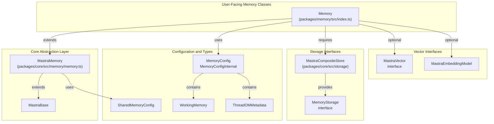

**Sources**: [packages/memory/src/index.ts:78-93](), [packages/core/src/memory/memory.ts:109-196](), [packages/core/src/memory/types.ts:1-114]()

---

## Storage Domain Architecture

The storage layer uses a **domain pattern** where different concerns (memory, workflows, logs, etc.) are isolated into separate storage domains. Memory operations access the `memory` domain through the `MastraCompositeStore`.

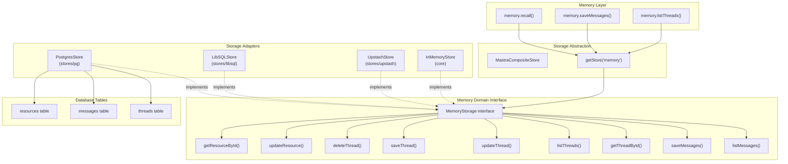

**Sources**: [packages/memory/src/index.ts:98-104](), [packages/core/src/storage/storage.ts](), [stores/pg/src/index.ts]()

---

## Memory Types and Data Flow

Mastra supports multiple memory types that work together to provide comprehensive context management.

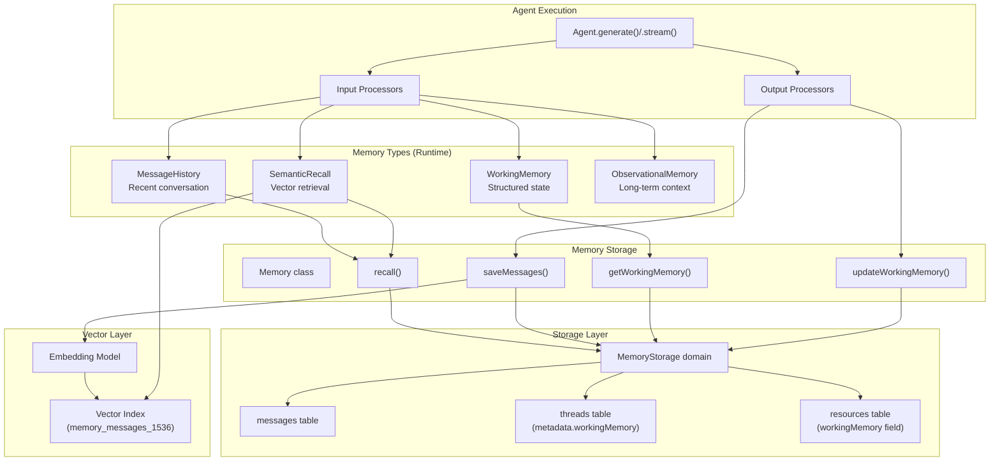

**Sources**: [packages/memory/src/index.ts:151-312](), [packages/core/src/memory/memory.ts:608-852](), [packages/core/src/processors/memory/]()

---

## Vector Storage and Semantic Recall

Semantic recall enables agents to retrieve relevant messages from past conversations using vector similarity search.

### Vector Index Management

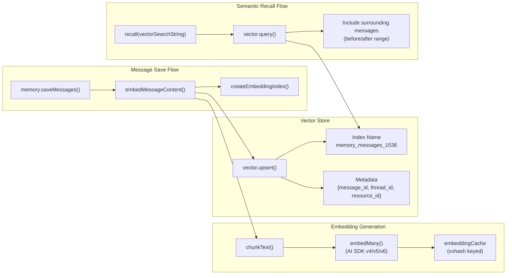

**Sources**: [packages/memory/src/index.ts:706-867](), [packages/memory/src/index.ts:310-348](), [packages/core/src/memory/memory.ts:269-348]()

---

## Working Memory Scopes

Working memory can be scoped at either the **resource** level (shared across threads) or **thread** level (isolated per conversation).

| Scope                | Storage Location                       | Use Case                                                  | Access Pattern                              |
| -------------------- | -------------------------------------- | --------------------------------------------------------- | ------------------------------------------- |
| `resource` (default) | `resources.workingMemory` field        | User preferences, facts that persist across conversations | Shared by all threads for same `resourceId` |
| `thread`             | `threads.metadata.workingMemory` field | Conversation-specific context                             | Isolated per thread                         |

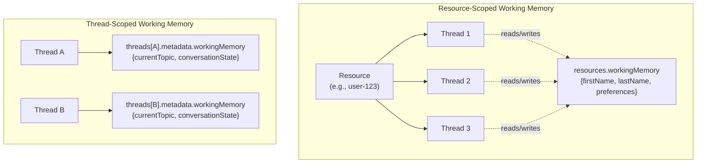

**Sources**: [packages/memory/src/index.ts:449-511](), [packages/core/src/memory/types.ts:173-184]()

---

## Working Memory Tool Integration

Working memory is updated via the `updateWorkingMemory` tool, which supports both template-based (Markdown) and schema-based (JSON) modes.

### Schema-Based Working Memory (Merge Semantics)

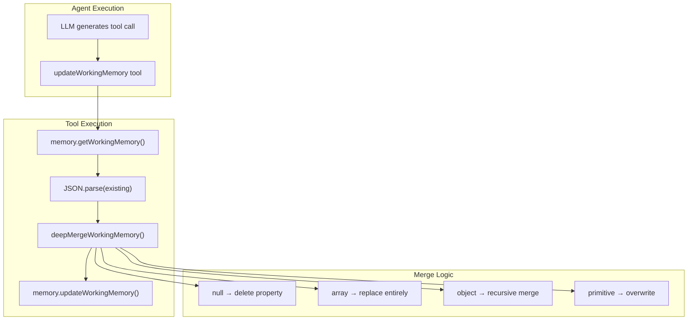

**Sources**: [packages/memory/src/tools/working-memory.ts:64-230](), [packages/memory/src/tools/working-memory.ts:8-62]()

---

## Message Storage and Recall Flow

The `recall()` method retrieves messages from storage with optional semantic recall and applies pagination/ordering logic.

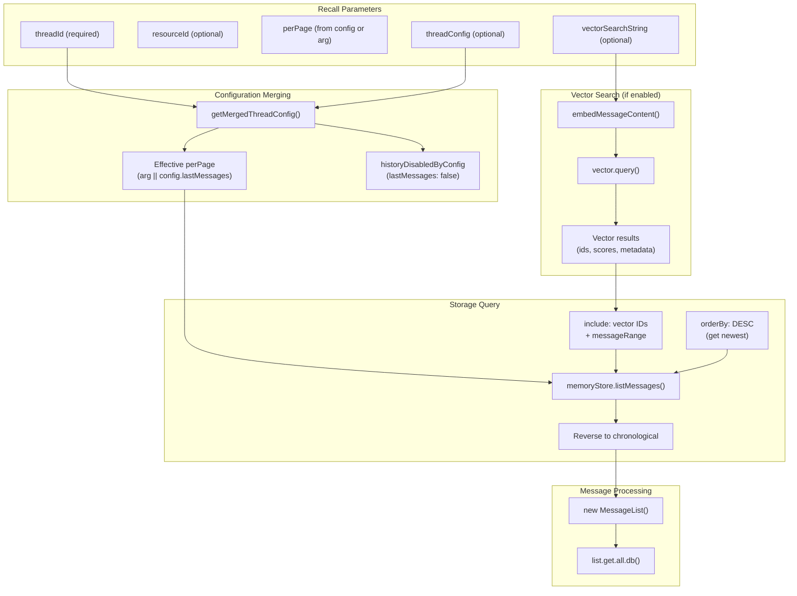

**Sources**: [packages/memory/src/index.ts:151-312](), [packages/memory/src/index.ts:176-186]()

---

## Storage Adapter Pattern

All storage adapters implement the `MemoryStorage` interface, allowing different backends to be used interchangeably.

### Adapter Implementations

| Adapter         | Package           | Database              | Vector Support            | Use Case                    |
| --------------- | ----------------- | --------------------- | ------------------------- | --------------------------- |
| `PostgresStore` | `@mastra/pg`      | PostgreSQL + pgvector | Yes (via `PgVector`)      | Production, complex queries |
| `LibSQLStore`   | `@mastra/libsql`  | LibSQL (SQLite fork)  | Yes (via `LibSQLVector`)  | Edge, serverless            |
| `UpstashStore`  | `@mastra/upstash` | Upstash Redis         | Yes (via `UpstashVector`) | Serverless, low-latency     |
| `InMemoryStore` | `@mastra/core`    | In-memory             | No                        | Testing, development        |

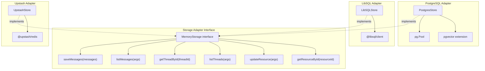

**Sources**: [packages/core/src/storage/storage.ts](), [stores/pg/package.json:1-75](), [packages/memory/integration-tests/src/with-pg-storage.test.ts]()

---

## Thread and Resource Model

The storage model separates threads (conversations) from resources (users/entities) to enable multi-tenancy and resource-scoped data.

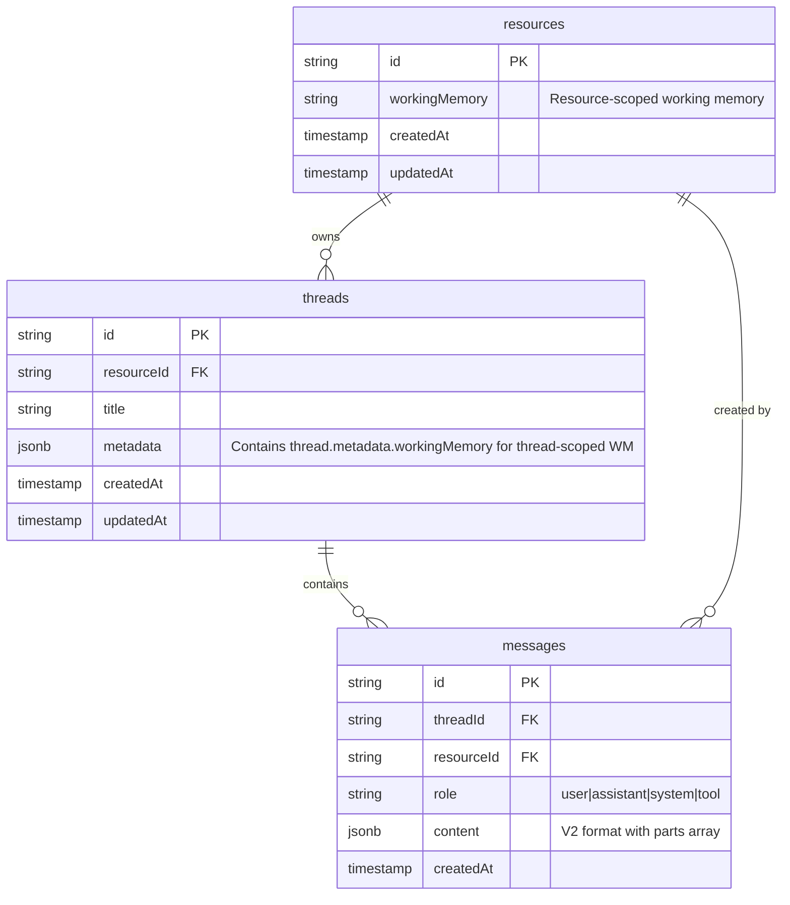

**Sources**: [packages/core/src/memory/types.ts:38-113](), [packages/memory/src/index.ts:314-400]()

---

## Observational Memory Records

Observational Memory (OM) stores observations and reflections in a separate table with thread-level metadata for tracking state.

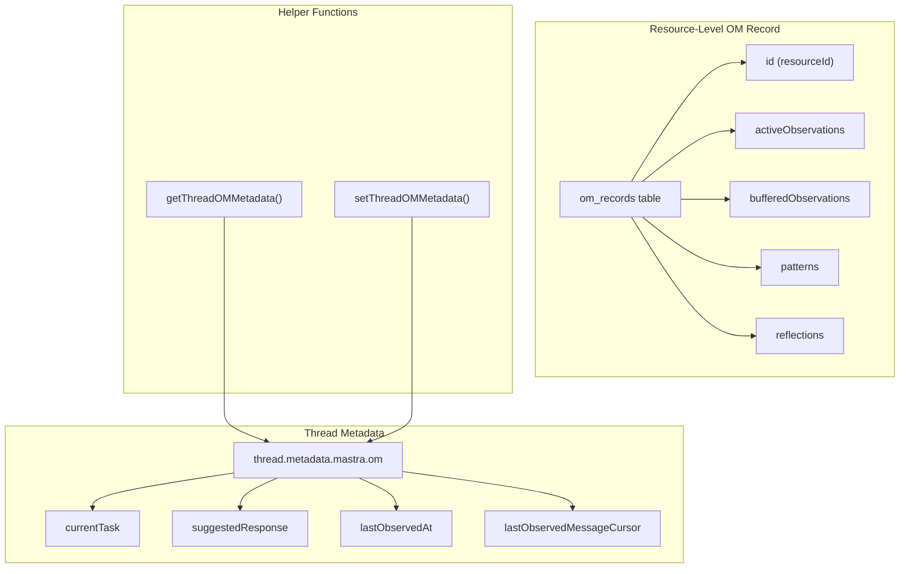

**Sources**: [packages/core/src/memory/types.ts:48-113]()

---

## Configuration and Options

Memory behavior is controlled through `MemoryConfig` which supports various options for different memory types.

### Configuration Structure

```typescript
// From packages/core/src/memory/types.ts
type MemoryConfig = {
  lastMessages?: number | false // Message history limit
  semanticRecall?: boolean | SemanticRecall // Vector retrieval
  generateTitle?: boolean // Auto-generate thread titles
  workingMemory?: WorkingMemory // Structured state
  observationalMemory?: boolean | ObservationalMemoryOptions // Long-term context
  readOnly?: boolean // Disable writes (for shared contexts)
}
```

### Default Configuration

| Option                  | Default Value | Description                          |
| ----------------------- | ------------- | ------------------------------------ |
| `lastMessages`          | `10`          | Number of recent messages to include |
| `semanticRecall`        | `false`       | Disabled by default                  |
| `generateTitle`         | `false`       | No auto-title generation             |
| `workingMemory.enabled` | `false`       | Working memory disabled              |
| `workingMemory.scope`   | `'resource'`  | Resource-scoped when enabled         |
| `observationalMemory`   | `undefined`   | Disabled by default                  |

**Sources**: [packages/core/src/memory/memory.ts:79-98](), [packages/memory/src/index.ts:79-93]()

---

## Processor Integration

Memory integrates with the agent system via input and output processors, which are automatically registered based on configuration.

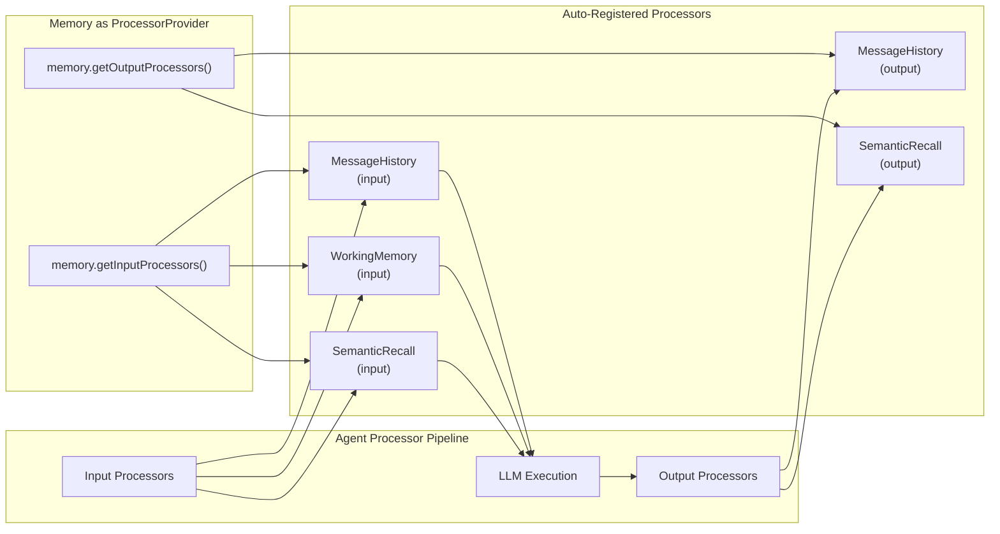

**Sources**: [packages/core/src/memory/memory.ts:608-852]()

---

## Mutex Protection for Working Memory

To prevent race conditions when multiple concurrent agent calls update working memory, the Memory class uses in-memory mutexes.

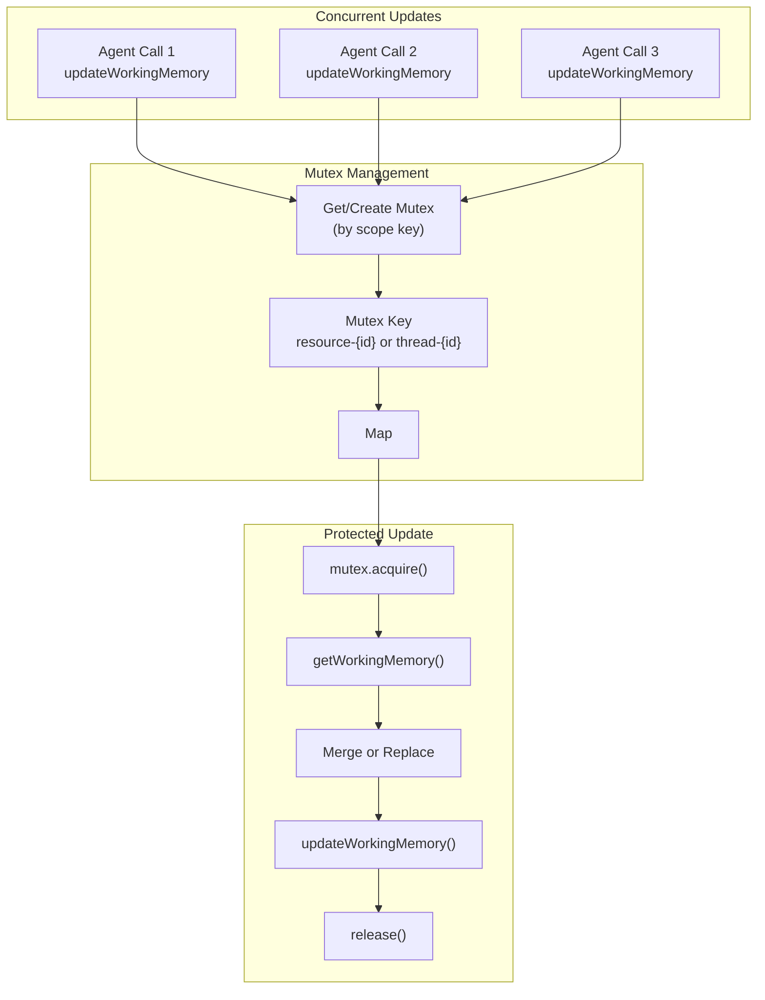

**Sources**: [packages/memory/src/index.ts:476-511](), [packages/memory/src/index.ts:513]()

---

## Message Format (V2)

Messages are stored in a V2 format with a `parts` array for structured content representation.

```typescript
// From packages/core/src/agent/message-list.ts
type MastraDBMessage = {
  id: string
  threadId?: string
  resourceId?: string
  role: 'user' | 'assistant' | 'system' | 'tool'
  content: {
    format: 2
    content?: string // Plain text representation
    parts: Array<
      | { type: 'text'; text: string }
      | { type: 'image'; image: string | Uint8Array }
      | { type: 'tool-invocation'; toolInvocation: ToolInvocation }
      | { type: 'file'; data: string | Uint8Array; mimeType: string }
    >
    experimental_attachments?: Attachment[]
  }
  createdAt: Date
}
```

**Sources**: [packages/core/src/agent/message-list.ts](), [packages/memory/src/index.ts:869-912]()

---

## Summary

The memory and storage architecture provides:

1. **Flexible Storage**: Multiple adapter options (PostgreSQL, LibSQL, Upstash) via a unified interface
2. **Multi-Tier Memory**: Working memory, semantic recall, observational memory, and message history
3. **Thread/Resource Model**: Isolated threads with shared resource-level data
4. **Vector Integration**: Embedding generation and semantic search for RAG
5. **Processor Pattern**: Automatic integration with agent input/output pipelines
6. **Concurrency Safety**: Mutex-protected working memory updates

For implementation details on specific memory types and storage providers, see the subsections linked at the beginning of this document.
