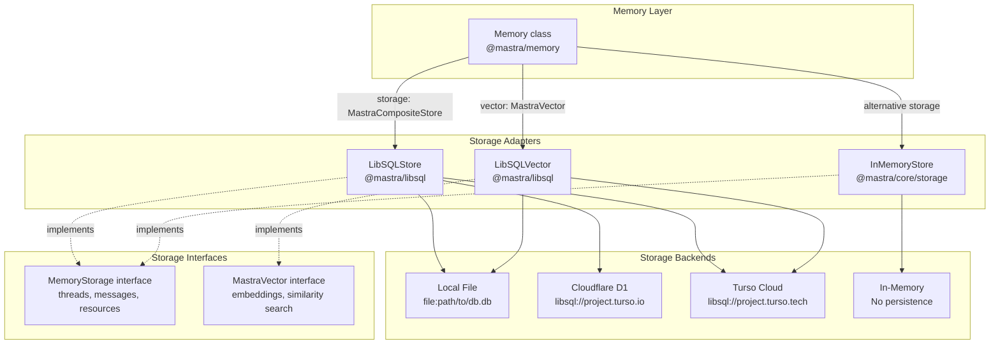
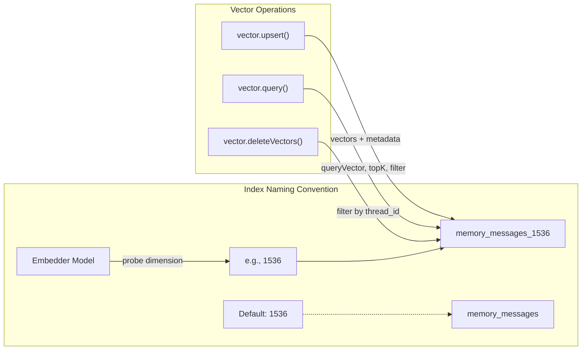
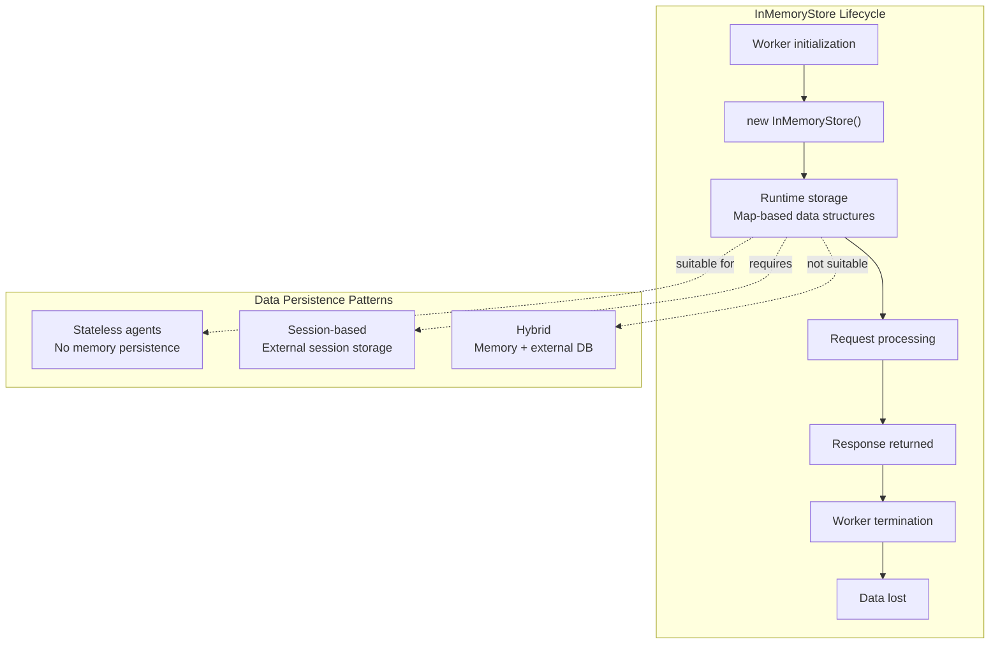
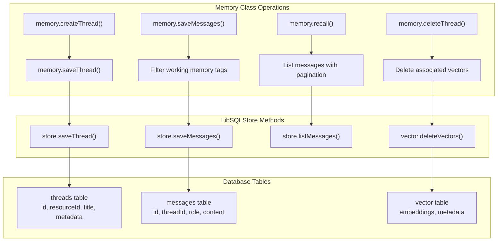
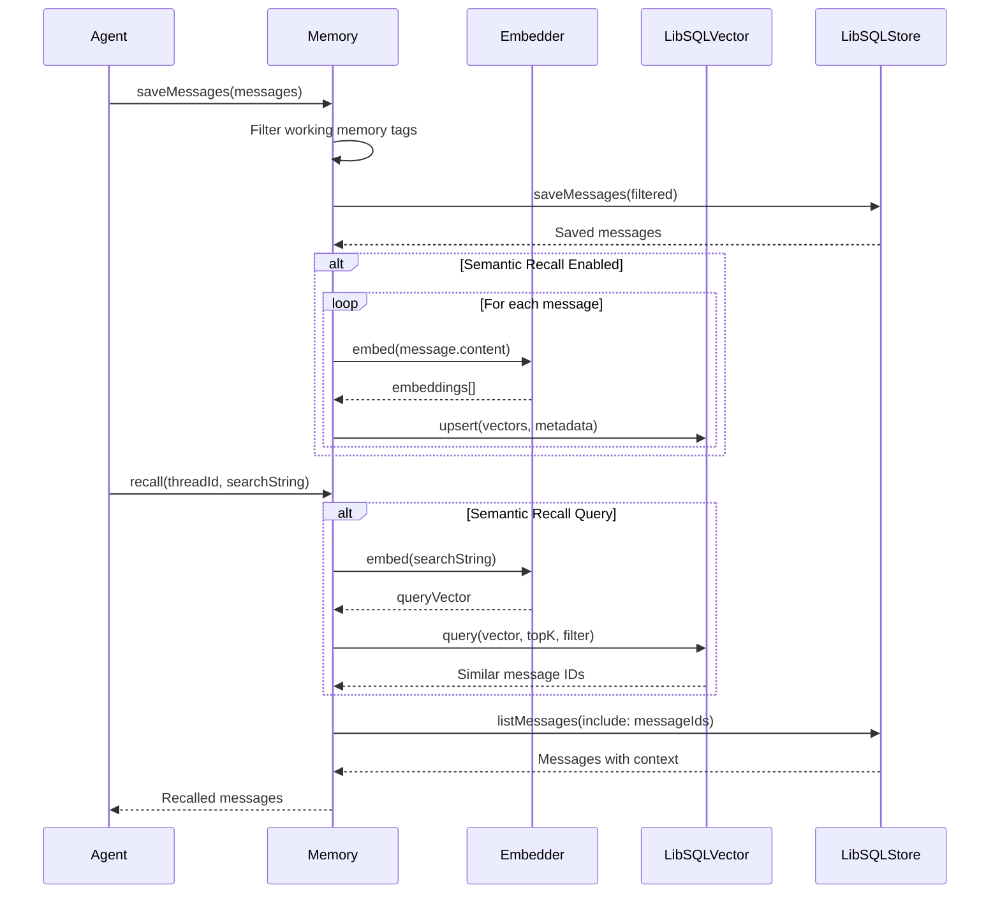
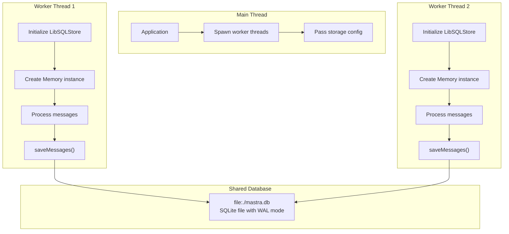

# LibSQL and Edge Storage

<details>
<summary>Relevant source files</summary>

The following files were used as context for generating this wiki page:

- [packages/agent-builder/integration-tests/.gitignore](packages/agent-builder/integration-tests/.gitignore)
- [packages/agent-builder/integration-tests/README.md](packages/agent-builder/integration-tests/README.md)
- [packages/agent-builder/integration-tests/docker-compose.yml](packages/agent-builder/integration-tests/docker-compose.yml)
- [packages/agent-builder/integration-tests/src/fixtures/minimal-mastra-project/.gitignore](packages/agent-builder/integration-tests/src/fixtures/minimal-mastra-project/.gitignore)
- [packages/agent-builder/integration-tests/src/fixtures/minimal-mastra-project/env.example](packages/agent-builder/integration-tests/src/fixtures/minimal-mastra-project/env.example)
- [packages/core/src/memory/memory.ts](packages/core/src/memory/memory.ts)
- [packages/core/src/memory/types.ts](packages/core/src/memory/types.ts)
- [packages/memory/integration-tests/docker-compose.yml](packages/memory/integration-tests/docker-compose.yml)
- [packages/memory/integration-tests/src/agent-memory.test.ts](packages/memory/integration-tests/src/agent-memory.test.ts)
- [packages/memory/integration-tests/src/processors.test.ts](packages/memory/integration-tests/src/processors.test.ts)
- [packages/memory/integration-tests/src/streaming-memory.test.ts](packages/memory/integration-tests/src/streaming-memory.test.ts)
- [packages/memory/integration-tests/src/test-utils.ts](packages/memory/integration-tests/src/test-utils.ts)
- [packages/memory/integration-tests/src/with-libsql-storage.test.ts](packages/memory/integration-tests/src/with-libsql-storage.test.ts)
- [packages/memory/integration-tests/src/with-pg-storage.test.ts](packages/memory/integration-tests/src/with-pg-storage.test.ts)
- [packages/memory/integration-tests/src/with-upstash-storage.test.ts](packages/memory/integration-tests/src/with-upstash-storage.test.ts)
- [packages/memory/integration-tests/src/worker/generic-memory-worker.ts](packages/memory/integration-tests/src/worker/generic-memory-worker.ts)
- [packages/memory/integration-tests/src/working-memory.test.ts](packages/memory/integration-tests/src/working-memory.test.ts)
- [packages/memory/integration-tests/vitest.config.ts](packages/memory/integration-tests/vitest.config.ts)
- [packages/memory/src/index.test.ts](packages/memory/src/index.test.ts)
- [packages/memory/src/index.ts](packages/memory/src/index.ts)
- [packages/memory/src/tools/working-memory.ts](packages/memory/src/tools/working-memory.ts)

</details>

This page documents the LibSQL storage adapter and edge-compatible storage options in Mastra. LibSQL provides SQLite-compatible storage with edge runtime support, enabling deployment to Cloudflare Workers, Vercel Edge Functions, and other serverless environments. For general storage architecture concepts, see [Storage Domain Architecture](#7.3). For PostgreSQL-specific features, see [PostgreSQL Storage Provider](#7.4).

## LibSQL Overview

LibSQL is a fork of SQLite designed for edge computing environments. Mastra provides two LibSQL-based adapters:

| Adapter         | Purpose                                                | Edge Compatible | Use Case                       |
| --------------- | ------------------------------------------------------ | --------------- | ------------------------------ |
| `LibSQLStore`   | Structured data storage (threads, messages, resources) | Yes             | Conversation history, metadata |
| `LibSQLVector`  | Vector embeddings storage                              | Yes             | Semantic search, RAG retrieval |
| `InMemoryStore` | Ephemeral in-memory storage                            | Yes             | Stateless workers, testing     |

**Sources:** [packages/memory/integration-tests/src/with-libsql-storage.test.ts:6-38]()

## Storage Architecture with LibSQL



**Sources:** [packages/memory/integration-tests/src/with-libsql-storage.test.ts:24-38](), [packages/core/src/memory/memory.ts:118-122]()

## LibSQLStore Configuration

### Local File-Based Storage

`LibSQLStore` stores structured conversation data in a SQLite-compatible database file. This is the simplest configuration for local development and edge deployments with persistent storage.

```typescript
import { LibSQLStore } from '@mastra/libsql'
import { Memory } from '@mastra/memory'

const memory = new Memory({
  storage: new LibSQLStore({
    url: 'file:./mastra.db', // Local file path
    id: 'my-libsql-store', // Unique identifier
  }),
})
```

### Turso Cloud Storage

For production edge deployments, Turso provides hosted LibSQL databases with global replication:

```typescript
const memory = new Memory({
  storage: new LibSQLStore({
    url: 'libsql://your-database.turso.io',
    authToken: process.env.TURSO_AUTH_TOKEN,
    id: 'turso-store',
  }),
})
```

### Configuration Options

| Option         | Type     | Required   | Description                                     |
| -------------- | -------- | ---------- | ----------------------------------------------- |
| `url`          | `string` | Yes        | Database URL (`file:path` or `libsql://host`)   |
| `authToken`    | `string` | For remote | Authentication token for Turso/remote databases |
| `id`           | `string` | Yes        | Unique identifier for this store instance       |
| `syncUrl`      | `string` | No         | URL for embedded replica sync                   |
| `syncInterval` | `number` | No         | Sync interval in milliseconds                   |

**Sources:** [packages/memory/integration-tests/src/with-libsql-storage.test.ts:28-31](), [packages/memory/integration-tests/src/worker/generic-memory-worker.ts:48-50]()

## LibSQLVector Configuration

### Vector Storage Setup

`LibSQLVector` stores embeddings for semantic recall. It supports the same URL formats as `LibSQLStore` but manages vector-specific operations like similarity search.

```typescript
import { LibSQLVector } from '@mastra/libsql'
import { fastembed } from '@mastra/fastembed'

const memory = new Memory({
  storage: new LibSQLStore({
    url: 'file:./mastra.db',
    id: 'storage',
  }),
  vector: new LibSQLVector({
    url: 'file:./vectors.db', // Can be same or separate file
    id: 'vector-store',
  }),
  embedder: fastembed,
  options: {
    semanticRecall: {
      topK: 5,
      messageRange: 2,
    },
  },
})
```

### Index Management

LibSQL vector storage automatically manages indexes for semantic search. The index name is determined by embedding dimensions:



**Sources:** [packages/core/src/memory/memory.ts:302-308](), [packages/memory/src/index.ts:414-420](), [packages/memory/src/index.ts:428-447]()

## In-Memory Storage for Edge Workers

### InMemoryStore Adapter

For stateless edge workers or testing, `InMemoryStore` provides ephemeral storage without persistence:

```typescript
import { InMemoryStore } from '@mastra/core/storage'

const memory = new Memory({
  storage: new InMemoryStore(),
  // No vector or embedder for stateless workers
  options: {
    lastMessages: 10,
    semanticRecall: false, // Disabled for in-memory
  },
})
```

### Ephemeral Storage Characteristics



**Use cases for `InMemoryStore`:**

- Testing memory operations without database setup
- Stateless request handlers where conversation history is passed explicitly
- Edge workers with external session management
- Short-lived workers processing single requests

**Limitations:**

- No persistence across requests
- No semantic recall (requires vector storage)
- Not suitable for multi-turn conversations
- Memory lost on worker termination

**Sources:** [packages/memory/src/index.test.ts:206-212](), [packages/memory/integration-tests/src/worker/generic-memory-worker.ts:15-19]()

## Edge Deployment Configurations

### Cloudflare Workers with D1

Cloudflare Workers can use D1 (SQLite) for structured storage and LibSQL for vectors:

```typescript
// Cloudflare Workers configuration
import { LibSQLStore, LibSQLVector } from '@mastra/libsql'

export default {
  async fetch(request, env, ctx) {
    const memory = new Memory({
      storage: new LibSQLStore({
        // D1 binding or Turso URL
        url: env.TURSO_URL,
        authToken: env.TURSO_AUTH_TOKEN,
        id: 'cf-storage',
      }),
      vector: new LibSQLVector({
        url: env.TURSO_URL,
        authToken: env.TURSO_AUTH_TOKEN,
        id: 'cf-vector',
      }),
      embedder: 'openai/text-embedding-3-small',
    })

    // Handle request with memory
  },
}
```

### Vercel Edge Functions

Vercel Edge Functions support LibSQL with Turso for global edge deployments:

```typescript
import type { NextRequest } from 'next/server'
import { LibSQLStore, LibSQLVector } from '@mastra/libsql'
import { Memory } from '@mastra/memory'

export const config = {
  runtime: 'edge',
}

export default async function handler(req: NextRequest) {
  const memory = new Memory({
    storage: new LibSQLStore({
      url: process.env.TURSO_URL!,
      authToken: process.env.TURSO_AUTH_TOKEN!,
      id: 'vercel-edge-storage',
    }),
    vector: new LibSQLVector({
      url: process.env.TURSO_VECTOR_URL!,
      authToken: process.env.TURSO_AUTH_TOKEN!,
      id: 'vercel-edge-vector',
    }),
  })

  // Process request
}
```

### Node.js with Local Files

For Node.js deployments (not edge), local file-based storage is simplest:

```typescript
const memory = new Memory({
  storage: new LibSQLStore({
    url: 'file:./data/mastra.db',
    id: 'node-storage',
  }),
  vector: new LibSQLVector({
    url: 'file:./data/vectors.db',
    id: 'node-vector',
  }),
})
```

**Sources:** [packages/memory/integration-tests/src/with-libsql-storage.test.ts:28-38](), [packages/memory/integration-tests/src/worker/generic-memory-worker.ts:46-51]()

## Integration with Memory System

### Thread and Message Storage

`LibSQLStore` implements the `MemoryStorage` interface, providing these operations:



### Vector Operations for Semantic Recall

When semantic recall is enabled, `LibSQLVector` handles embedding storage and retrieval:



**Key integration points:**

- `memory.saveMessages()` automatically generates embeddings when `semanticRecall` is enabled
- `memory.recall()` uses vector similarity search to retrieve relevant messages
- `memory.deleteThread()` cleans up both structured data and vector embeddings
- Vector index names are dimension-aware: `memory_messages_1536` for 1536-dimension embeddings

**Sources:** [packages/memory/src/index.ts:759-867](), [packages/memory/src/index.ts:151-312](), [packages/memory/src/index.ts:402-447]()

## Worker Thread Compatibility

### Generic Memory Worker Pattern

LibSQL storage adapters work seamlessly in worker threads, enabling concurrent message processing:



### Worker Configuration

Worker threads receive storage configuration from the main thread:

```typescript
// Worker data structure
interface WorkerData {
  messages: MessageToProcess[]
  storageType: 'libsql' | 'pg' | 'upstash'
  storageConfig: {
    url: string
    id: string
  }
  vectorConfig?: {
    url: string
    id: string
  }
  memoryOptions?: SharedMemoryConfig['options']
}

// Worker initialization
const { storageConfig, vectorConfig } = workerData

const store = new LibSQLStore({
  url: storageConfig.url,
  id: 'worker-storage',
})

const vector = new LibSQLVector({
  url: vectorConfig.url,
  id: 'worker-vector',
})

const memory = new Memory({
  storage: store,
  vector: vector,
  embedder: mockEmbedder,
  options: memoryOptions,
})
```

**Thread safety considerations:**

- LibSQL uses SQLite's WAL (Write-Ahead Logging) mode for concurrent access
- Each worker thread creates its own store/vector instances
- Database-level locking prevents conflicts
- Working memory updates use in-memory mutexes to prevent race conditions

**Sources:** [packages/memory/integration-tests/src/worker/generic-memory-worker.ts:1-98](), [packages/memory/integration-tests/src/shared/reusable-tests.ts]() (referenced in worker tests)

## Testing LibSQL Storage

### Integration Test Setup

Integration tests use temporary databases for isolation:

```typescript
import { mkdtemp, rm } from 'node:fs/promises'
import { tmpdir } from 'node:os'
import { join } from 'node:path'

let dbStoragePath: string

beforeAll(async () => {
  // Create temporary directory
  dbStoragePath = await mkdtemp(join(tmpdir(), 'memory-test-'))

  memory = new Memory({
    storage: new LibSQLStore({
      url: `file:${join(dbStoragePath, 'test.db')}`,
      id: randomUUID(),
    }),
    vector: new LibSQLVector({
      url: 'file:libsql-test.db',
      id: randomUUID(),
    }),
    embedder: fastembed,
    options: {
      lastMessages: 10,
      semanticRecall: {
        topK: 3,
        messageRange: 2,
      },
    },
  })
})

afterAll(async () => {
  // Clean up temporary files
  await rm(dbStoragePath, { recursive: true })
})
```

### Docker Compose for Comparison Testing

The integration test suite uses Docker Compose to run PostgreSQL alongside LibSQL tests, enabling storage adapter comparison:

```yaml
services:
  postgres:
    image: pgvector/pgvector:pg18-trixie
    ports:
      - '5434:5432'
    environment:
      POSTGRES_USER: postgres
      POSTGRES_PASSWORD: password
      POSTGRES_DB: mastra
```

**Test coverage:**

- Thread creation and retrieval
- Message saving and recall
- Semantic recall with vector search
- Working memory updates (resource-scoped and thread-scoped)
- Thread cloning with message filters
- Worker thread concurrent access
- lastMessages ordering (newest messages, not oldest)

**Sources:** [packages/memory/integration-tests/src/with-libsql-storage.test.ts:11-124](), [packages/memory/integration-tests/docker-compose.yml:1-78]()

## Performance and Limitations

### LibSQL Performance Characteristics

| Operation                | Performance             | Notes                             |
| ------------------------ | ----------------------- | --------------------------------- |
| Local file reads         | Very fast               | SQLite's page cache               |
| Local file writes        | Fast                    | WAL mode enables concurrent reads |
| Turso Cloud reads        | ~50-150ms               | Global edge replication           |
| Turso Cloud writes       | ~100-300ms              | Primary region + replication      |
| Vector similarity search | Fast for < 100K vectors | Full scan with cosine similarity  |
| Concurrent workers       | Good                    | WAL mode allows multiple readers  |

### Limitations

1. **Vector Storage Scalability**: LibSQL vector storage uses full table scans for similarity search. For large datasets (>100K embeddings), consider PostgreSQL with pgvector's index support (see [PostgreSQL Storage Provider](#7.4)).

2. **Edge Function Size Limits**: LibSQL adds ~1.5MB to bundle size. Some edge platforms have strict size limits:
   - Cloudflare Workers: 1MB compressed, 10MB uncompressed (use `InMemoryStore` instead)
   - Vercel Edge Functions: No hard limit but slower cold starts with larger bundles

3. **No Server-Side Transactions**: Unlike PostgreSQL, LibSQL does not support multi-statement transactions in edge runtimes. Each operation is atomic.

4. **File-Based Concurrency**: When using `file:` URLs, concurrent access from multiple processes (not threads) may cause locking issues. Use Turso Cloud for multi-process deployments.

**Sources:** [packages/memory/integration-tests/src/with-libsql-storage.test.ts:60-123](), [packages/memory/integration-tests/src/with-upstash-storage.test.ts:81-144]()

## Migration Between Storage Adapters

### From InMemoryStore to LibSQLStore

When transitioning from stateless to stateful storage:

```typescript
// Before: Ephemeral storage
const memory = new Memory({
  storage: new InMemoryStore(),
  options: { lastMessages: 10 },
})

// After: Persistent storage
const memory = new Memory({
  storage: new LibSQLStore({
    url: 'file:./mastra.db',
    id: 'persistent-storage',
  }),
  vector: new LibSQLVector({
    url: 'file:./vectors.db',
    id: 'persistent-vector',
  }),
  embedder: 'openai/text-embedding-3-small',
  options: {
    lastMessages: 10,
    semanticRecall: {
      // Now possible with vector storage
      topK: 5,
      messageRange: 2,
    },
  },
})
```

### From LibSQL to PostgreSQL

For scaling beyond LibSQL's vector limitations, migrate to PostgreSQL with pgvector:

```typescript
// Before: LibSQL
import { LibSQLStore, LibSQLVector } from '@mastra/libsql'

// After: PostgreSQL
import { PostgresStore, PgVector } from '@mastra/pg'

const memory = new Memory({
  storage: new PostgresStore({
    connectionString: process.env.DATABASE_URL!,
    id: 'pg-storage',
  }),
  vector: new PgVector({
    connectionString: process.env.DATABASE_URL!,
    id: 'pg-vector',
  }),
  embedder: 'openai/text-embedding-3-small',
  options: {
    semanticRecall: {
      topK: 10,
      indexConfig: {
        // PostgreSQL-specific optimizations
        type: 'hnsw',
        metric: 'dotproduct',
        hnsw: { m: 16, efConstruction: 64 },
      },
    },
  },
})
```

**Migration checklist:**

1. Export threads and messages from LibSQL using `memory.listThreads()` and `memory.recall()`
2. Initialize PostgreSQL schema using `PostgresStore.prototype.init()`
3. Import threads using `memory.saveThread()` for each thread
4. Import messages using `memory.saveMessages()` in batches
5. Re-generate embeddings for semantic recall (indexes are incompatible)
6. Update deployment configuration with new connection strings
7. Test semantic recall performance with representative queries

**Sources:** [packages/memory/integration-tests/src/with-libsql-storage.test.ts](), [packages/memory/integration-tests/src/with-pg-storage.test.ts]() (comparison test structure)
