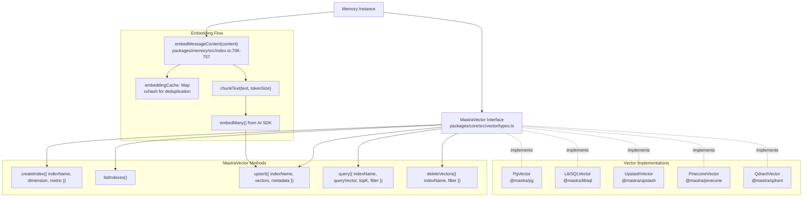
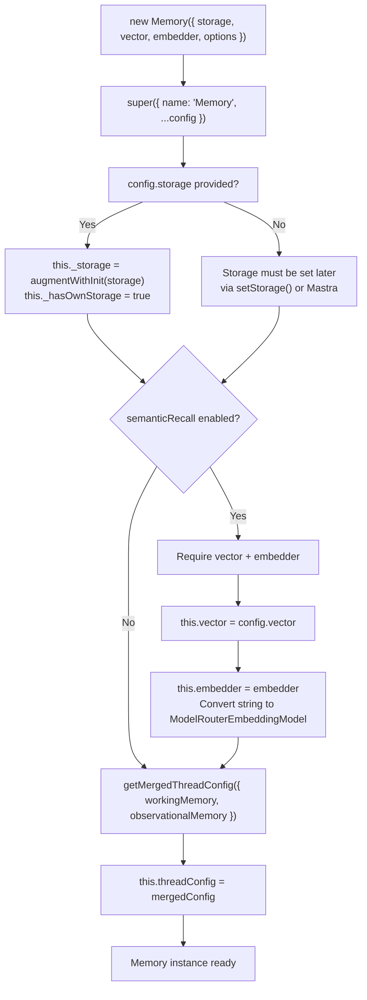
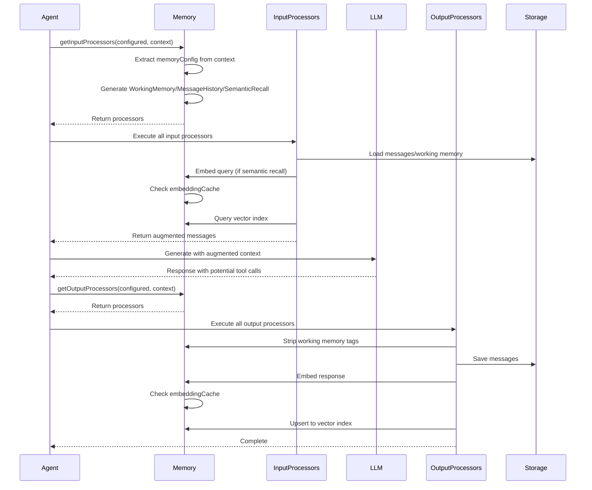
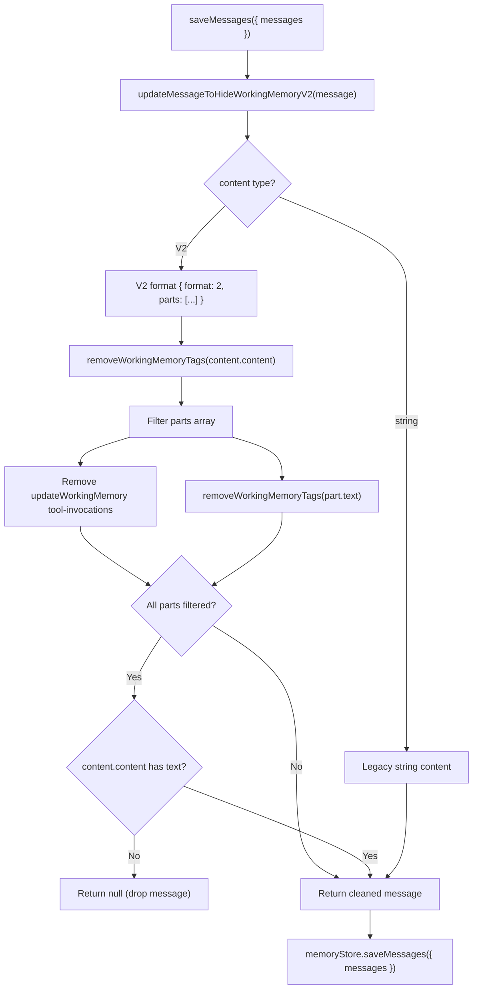

# Memory System Architecture

<details>
<summary>Relevant source files</summary>

The following files were used as context for generating this wiki page:

- [packages/agent-builder/integration-tests/.gitignore](packages/agent-builder/integration-tests/.gitignore)
- [packages/agent-builder/integration-tests/README.md](packages/agent-builder/integration-tests/README.md)
- [packages/agent-builder/integration-tests/docker-compose.yml](packages/agent-builder/integration-tests/docker-compose.yml)
- [packages/agent-builder/integration-tests/src/fixtures/minimal-mastra-project/.gitignore](packages/agent-builder/integration-tests/src/fixtures/minimal-mastra-project/.gitignore)
- [packages/agent-builder/integration-tests/src/fixtures/minimal-mastra-project/env.example](packages/agent-builder/integration-tests/src/fixtures/minimal-mastra-project/env.example)
- [packages/core/src/memory/memory.ts](packages/core/src/memory/memory.ts)
- [packages/core/src/memory/types.ts](packages/core/src/memory/types.ts)
- [packages/memory/integration-tests/docker-compose.yml](packages/memory/integration-tests/docker-compose.yml)
- [packages/memory/integration-tests/src/agent-memory.test.ts](packages/memory/integration-tests/src/agent-memory.test.ts)
- [packages/memory/integration-tests/src/processors.test.ts](packages/memory/integration-tests/src/processors.test.ts)
- [packages/memory/integration-tests/src/streaming-memory.test.ts](packages/memory/integration-tests/src/streaming-memory.test.ts)
- [packages/memory/integration-tests/src/test-utils.ts](packages/memory/integration-tests/src/test-utils.ts)
- [packages/memory/integration-tests/src/with-libsql-storage.test.ts](packages/memory/integration-tests/src/with-libsql-storage.test.ts)
- [packages/memory/integration-tests/src/with-pg-storage.test.ts](packages/memory/integration-tests/src/with-pg-storage.test.ts)
- [packages/memory/integration-tests/src/with-upstash-storage.test.ts](packages/memory/integration-tests/src/with-upstash-storage.test.ts)
- [packages/memory/integration-tests/src/worker/generic-memory-worker.ts](packages/memory/integration-tests/src/worker/generic-memory-worker.ts)
- [packages/memory/integration-tests/src/working-memory.test.ts](packages/memory/integration-tests/src/working-memory.test.ts)
- [packages/memory/integration-tests/vitest.config.ts](packages/memory/integration-tests/vitest.config.ts)
- [packages/memory/src/index.test.ts](packages/memory/src/index.test.ts)
- [packages/memory/src/index.ts](packages/memory/src/index.ts)
- [packages/memory/src/tools/working-memory.ts](packages/memory/src/tools/working-memory.ts)

</details>

This document describes the architectural foundations of Mastra's memory system. It covers the core abstractions (`MastraMemory`, `Memory`), memory types (Working, Observational, Semantic Recall, Message History), configuration patterns, and integration with storage/vector backends.

For specific memory type implementations and usage patterns, see:

- Thread and message storage operations: [7.2](#7.2)
- Storage adapter interfaces and composite store: [7.3](#7.3)
- Vector storage and semantic search mechanics: [7.6](#7.6)
- Observational Memory three-tier system: [7.9](#7.9)
- Working Memory tool-based updates and scoping: [7.10](#7.10)

---

## Class Hierarchy and Abstraction Layers

The memory system uses a two-tier class hierarchy that separates core abstractions from concrete implementations.

### Class Structure Diagram

```mermaid
graph TB
    MastraBase["MastraBase<br/>(component: 'MEMORY')"]
    MastraMemory["MastraMemory<br/>(abstract base class)<br/>packages/core/src/memory/memory.ts"]
    Memory["Memory<br/>(concrete implementation)<br/>packages/memory/src/index.ts"]

    MastraBase --> MastraMemory
    MastraMemory --> Memory

    subgraph "Abstract Methods (MastraMemory)"
        getThreadById["getThreadById()"]
        listThreads["listThreads()"]
        saveThread["saveThread()"]
        saveMessages["saveMessages()"]
        recall["recall()"]
        deleteThread["deleteThread()"]
        getWorkingMemory["getWorkingMemory()"]
        updateWorkingMemory["updateWorkingMemory()"]
        getWorkingMemoryTemplate["getWorkingMemoryTemplate()"]
        cloneThread["cloneThread()"]
        deleteMessages["deleteMessages()"]
    end

    subgraph "Core Properties"
        storage["_storage: MastraCompositeStore"]
        vector["vector?: MastraVector"]
        embedder["embedder?: MastraEmbeddingModel"]
        threadConfig["threadConfig: MemoryConfigInternal"]
    end

    subgraph "Processor Integration"
        getInputProcessors["getInputProcessors()<br/>Returns: WorkingMemory, MessageHistory, SemanticRecall"]
        getOutputProcessors["getOutputProcessors()<br/>Returns: SemanticRecall, MessageHistory"]
    end

    MastraMemory --> getThreadById
    MastraMemory --> listThreads
    MastraMemory --> saveThread
    MastraMemory --> saveMessages
    MastraMemory --> recall
    MastraMemory --> deleteThread
    MastraMemory --> getWorkingMemory
    MastraMemory --> updateWorkingMemory
    MastraMemory --> getWorkingMemoryTemplate
    MastraMemory --> cloneThread
    MastraMemory --> deleteMessages

    MastraMemory --> storage
    MastraMemory --> vector
    MastraMemory --> embedder
    MastraMemory --> threadConfig

    MastraMemory --> getInputProcessors
    MastraMemory --> getOutputProcessors

    Memory -.implements.-> getThreadById
    Memory -.implements.-> listThreads
    Memory -.implements.-> saveThread
    Memory -.implements.-> saveMessages
    Memory -.implements.-> recall
    Memory -.implements.-> deleteThread
    Memory -.implements.-> getWorkingMemory
    Memory -.implements.-> updateWorkingMemory
```



**Sources:**

- [packages/core/src/memory/memory.ts:109-852]()
- [packages/memory/src/index.ts:78-93]()

### MastraMemory Base Class

`MastraMemory` is the abstract base class that defines the memory interface. It provides:

**Core Responsibilities:**

- Storage and vector adapter management
- Configuration merging via `getMergedThreadConfig()`
- Processor generation for input/output pipelines
- Embedding index management

**Key Properties:**

- `_storage?: MastraCompositeStore` - Backend storage adapter
- `vector?: MastraVector` - Vector database for semantic recall
- `embedder?: MastraEmbeddingModel<string>` - Embedding model for vectorization
- `threadConfig: MemoryConfigInternal` - Merged memory configuration

**Processor Factory Methods:**
The base class automatically generates processors based on configuration:

```typescript
async getInputProcessors(
  configuredProcessors: InputProcessorOrWorkflow[] = [],
  context?: RequestContext,
): Promise<InputProcessor[]>
```

This method examines the effective memory configuration (from `RequestContext` if available, otherwise instance config) and creates:

- `WorkingMemory` processor if `workingMemory.enabled === true`
- `MessageHistory` processor if `lastMessages` is set
- `SemanticRecall` processor if `semanticRecall` is configured

**Sources:**

- [packages/core/src/memory/memory.ts:109-196]()
- [packages/core/src/memory/memory.ts:608-743]()

### Memory Concrete Implementation

The `Memory` class in `@mastra/memory` extends `MastraMemory` and provides:

**Additional Features:**

- Multi-version AI SDK support (v1/v2/v3) for embeddings
- Embedding caching with xxhash
- Working memory tag stripping from saved messages
- Mutex-protected concurrent updates to working memory
- Vector cleanup on thread deletion

**Constructor Logic:**

```typescript
constructor(config: Omit<SharedMemoryConfig, 'working'> = {}) {
  super({ name: 'Memory', ...config });

  const mergedConfig = this.getMergedThreadConfig({
    workingMemory: config.options?.workingMemory || {
      enabled: false,
      template: this.defaultWorkingMemoryTemplate,
    },
    observationalMemory: config.options?.observationalMemory,
  });
  this.threadConfig = mergedConfig;
}
```

**Sources:**

- [packages/memory/src/index.ts:78-93]()
- [packages/memory/src/index.ts:693-757]() (embedding caching)
- [packages/memory/src/index.ts:513]() (mutex map for working memory)

---

## Memory Types and Their Purposes

The memory system supports four distinct memory types, each serving a different purpose in agent interactions.

### Memory Types Architecture Diagram


**Sources:**

- [packages/core/src/memory/types.ts:758-828]()
- [packages/core/src/processors/memory/message-history.ts]()
- [packages/core/src/processors/memory/working-memory.ts]()
- [packages/core/src/processors/memory/semantic-recall.ts]()

### Message History (Conversation Context)

**Configuration:**

```typescript
type MemoryConfig = {
  lastMessages?: number | false
}
```

**Purpose:** Provides short-term conversational continuity by including the most recent N messages in the LLM context.

**Behavior:**

- `lastMessages: 10` - Include last 10 messages (default)
- `lastMessages: false` - Disable conversation history entirely
- When limited, queries messages in `DESC` order to get newest, then reverses for chronological order

**Implementation Detail:**
The `recall()` method handles the DESC-then-reverse pattern to ensure "last N messages" means the most recent N, not the oldest N:

```typescript
const shouldGetNewestAndReverse = !orderBy && perPage !== false
const effectiveOrderBy = shouldGetNewestAndReverse
  ? { field: 'createdAt' as const, direction: 'DESC' as const }
  : orderBy
// ... query with effectiveOrderBy
const rawMessages = shouldGetNewestAndReverse
  ? paginatedResult.messages.reverse()
  : paginatedResult.messages
```

**Sources:**

- [packages/memory/src/index.ts:151-312]() (recall implementation)
- [packages/core/src/memory/memory.ts:79-98]() (default config)

### Working Memory (Structured State)

**Configuration:**

```typescript
type WorkingMemory = {
  enabled: boolean
  scope?: 'thread' | 'resource'
  template?: string // Markdown template
  schema?: PublicSchema // JSON schema
  version?: 'stable' | 'vnext'
}
```

**Purpose:** Persistent, structured state that agents can read and update via the `updateWorkingMemory` tool.

**Storage Scopes:**

- `resource` - Shared across all threads for a user/tenant (default)
- `thread` - Isolated per conversation thread

**Update Semantics:**

- **Template mode** (Markdown): Replace semantics - new content replaces old
- **Schema mode** (JSON): Merge semantics - deep merge with `deepMergeWorkingMemory()`

**Mutex Protection:**
Concurrent updates to the same resource/thread are serialized using an in-memory mutex map to prevent race conditions:

```typescript
private updateWorkingMemoryMutexes = new Map<string, Mutex>();
```

**Sources:**

- [packages/core/src/memory/types.ts:172-202]()
- [packages/memory/src/index.ts:449-511]() (updateWorkingMemory with mutex)
- [packages/memory/src/tools/working-memory.ts:15-62]() (deepMergeWorkingMemory)

### Semantic Recall (Vector-Based Retrieval)

**Configuration:**

```typescript
type SemanticRecall = {
  topK: number
  messageRange: number | { before: number; after: number }
  scope?: 'thread' | 'resource'
  indexConfig?: VectorIndexConfig
  threshold?: number
}
```

**Purpose:** RAG-style retrieval of relevant past messages using vector similarity search.

**Workflow:**

1. Embed the current user message/search string
2. Query vector index with `topK` parameter
3. Retrieve matched messages + surrounding context (`messageRange`)
4. Include in LLM context alongside recent history

**Index Naming Convention:**
The index name includes the embedding dimension to prevent mismatches:

```typescript
protected getEmbeddingIndexName(dimensions?: number): string {
  const defaultDimensions = 1536;
  const usedDimensions = dimensions ?? defaultDimensions;
  const isDefault = usedDimensions === defaultDimensions;
  const separator = this.vector?.indexSeparator ?? '_';
  return isDefault
    ? `memory${separator}messages`
    : `memory${separator}messages${separator}${usedDimensions}`;
}
```

**Dimension Probing:**
To avoid index name mismatches, the system probes the embedder for its actual dimension on first use:

```typescript
protected async getEmbeddingDimension(): Promise<number | undefined> {
  if (!this._embeddingDimensionPromise) {
    this._embeddingDimensionPromise = (async () => {
      const result = await this.embedder!.doEmbed({ values: ['a'] });
      return result.embeddings[0]?.length;
    })();
  }
  return this._embeddingDimensionPromise;
}
```

**Sources:**

- [packages/core/src/memory/memory.ts:270-296]() (dimension probing)
- [packages/core/src/memory/memory.ts:302-348]() (index creation)
- [packages/memory/src/index.ts:206-269]() (vector search in recall)
- [packages/core/src/memory/types.ts:299-374]()

### Observational Memory (Three-Tier Long-Term)

**Configuration:**

```typescript
type ObservationalMemoryOptions = {
  enabled?: boolean
  model?: AgentConfig['model']
  scope?: 'resource' | 'thread'
  observation?: ObservationalMemoryObservationConfig
  reflection?: ObservationalMemoryReflectionConfig
  shareTokenBudget?: boolean
}
```

**Purpose:** Hierarchical compression of conversation history for efficient long-term memory:

- **Tier 1:** Raw messages (short-term)
- **Tier 2:** Observations extracted by Observer agent (medium-term)
- **Tier 3:** Reflections consolidated by Reflector agent (long-term)

**Async Buffering:**
Observational Memory pre-computes observations in the background at configurable intervals (`bufferTokens`) so that activation is instant when the threshold (`messageTokens`) is reached.

**Token Budget Sharing:**
When `shareTokenBudget: true`, the total context budget is shared between messages and observations, allowing flexible allocation based on current needs.

**Sources:**

- [packages/core/src/memory/types.ts:681-730]()
- For detailed implementation, see [7.9](#7.9)

---

## Configuration System

### MemoryConfigInternal Structure

The `MemoryConfigInternal` type defines all memory configuration options:

```mermaid
graph TB
    MemoryConfigInternal["MemoryConfigInternal"]

    subgraph "History Config"
        lastMessages["lastMessages: number | false<br/>Default: 10"]
        readOnly["readOnly?: boolean<br/>Prevents saving new messages"]
    end

    subgraph "Working Memory Config"
        WM_enabled["enabled: boolean"]
        WM_scope["scope?: 'thread' | 'resource'"]
        WM_template["template?: string"]
        WM_schema["schema?: PublicSchema"]
        WM_version["version?: 'stable' | 'vnext'"]
    end

    subgraph "Semantic Recall Config"
        SR_boolean["boolean (enable with defaults)"]
        SR_object["OR object with:"]
        SR_topK["topK: number"]
        SR_messageRange["messageRange: number | {before, after}"]
        SR_scope["scope?: 'thread' | 'resource'"]
        SR_indexConfig["indexConfig?: VectorIndexConfig"]
    end

    subgraph "Observational Memory Config"
        OM_boolean["boolean (enable with defaults)"]
        OM_object["OR object with:"]
        OM_enabled["enabled?: boolean"]
        OM_model["model?: AgentConfig['model']"]
        OM_observation["observation?: ObservationalMemoryObservationConfig"]
        OM_reflection["reflection?: ObservationalMemoryReflectionConfig"]
    end

    subgraph "Other Options"
        generateTitle["generateTitle?: boolean | GenerateTitleConfig"]
    end

    MemoryConfigInternal --> lastMessages
    MemoryConfigInternal --> readOnly
    MemoryConfigInternal --> WM_enabled
    WM_enabled --> WM_scope
    WM_enabled --> WM_template
    WM_enabled --> WM_schema
    WM_enabled --> WM_version

    MemoryConfigInternal --> SR_boolean
    MemoryConfigInternal --> SR_object
    SR_object --> SR_topK
    SR_object --> SR_messageRange
    SR_object --> SR_scope
    SR_object --> SR_indexConfig

    MemoryConfigInternal --> OM_boolean
    MemoryConfigInternal --> OM_object
    OM_object --> OM_enabled
    OM_object --> OM_model
    OM_object --> OM_observation
    OM_object --> OM_reflection

    MemoryConfigInternal --> generateTitle
```



**Sources:**

- [packages/core/src/memory/types.ts:758-828]()
- [packages/core/src/memory/memory.ts:79-98]() (defaults)

### Configuration Merging

Memory configuration can be specified at multiple levels and is merged in priority order:

1. **Runtime configuration** via `RequestContext` (highest priority)
2. **Per-call configuration** passed to methods like `recall()`, `saveMessages()`
3. **Instance configuration** set in Memory constructor (lowest priority)

The `getMergedThreadConfig()` method performs deep merging:

```typescript
public getMergedThreadConfig(config?: MemoryConfigInternal): MemoryConfigInternal {
  const mergedConfig = deepMerge(this.threadConfig, config || {});

  // Special handling for schema (not deep merged, replaced entirely)
  if (
    typeof config?.workingMemory === 'object' &&
    config.workingMemory?.schema &&
    typeof mergedConfig.workingMemory === 'object'
  ) {
    mergedConfig.workingMemory.schema = config.workingMemory.schema;
  }

  return mergedConfig;
}
```

**Sources:**

- [packages/core/src/memory/memory.ts:350-372]()
- [packages/core/src/memory/memory.ts:608-743]() (RequestContext extraction)

### RequestContext-Based Configuration

Processors can access runtime memory configuration via `RequestContext`:

```typescript
export type MemoryRequestContext = {
  thread?: Partial<StorageThreadType> & { id: string }
  resourceId?: string
  memoryConfig?: MemoryConfigInternal
}
```

This enables per-request memory configuration when agents share a global `Memory` instance but need different settings per tenant/user:

```typescript
async getInputProcessors(
  configuredProcessors: InputProcessorOrWorkflow[] = [],
  context?: RequestContext,
): Promise<InputProcessor[]> {
  // Extract runtime memoryConfig from context if available
  const memoryContext = context?.get('MastraMemory') as MemoryRequestContext | undefined;
  const runtimeMemoryConfig = memoryContext?.memoryConfig;
  const effectiveConfig = runtimeMemoryConfig
    ? this.getMergedThreadConfig(runtimeMemoryConfig)
    : this.threadConfig;

  // Use effectiveConfig to generate processors...
}
```

**Sources:**

- [packages/core/src/memory/types.ts:116-165]()
- [packages/core/src/memory/memory.ts:608-660]()

---

## Processor Integration

Memory integrates with the agent execution pipeline via input and output processors. The `MastraMemory` base class auto-generates processors based on configuration.

### Processor Generation Flow

```mermaid
graph TB
    Agent["Agent.generate() or Agent.stream()"]
    PrepareInput["Prepare Input Processors"]
    MemoryGetInput["memory.getInputProcessors(configured, context)"]

    CheckWorkingMemory{"workingMemory.enabled?"}
    CheckMessageHistory{"lastMessages !== false?"}
    CheckSemanticRecall{"semanticRecall enabled?"}
    CheckObservational{"observationalMemory enabled?"}

    CreateWorkingMemory["new WorkingMemory(...)"]
    CreateMessageHistory["new MessageHistory(...)"]
    CreateSemanticRecall["new SemanticRecall(...)"]
    SkipMessageHistory["Skip MessageHistory<br/>(OM handles it)"]

    MergeProcessors["Merge auto-generated with configured"]
    ExecuteInput["Execute Input Processors"]

    PrepareOutput["Prepare Output Processors"]
    MemoryGetOutput["memory.getOutputProcessors(configured, context)"]
    CheckSemanticRecallOut{"semanticRecall enabled?"}
    CheckMessageHistoryOut{"lastMessages !== false?"}
    CheckObservationalOut{"observationalMemory enabled?"}

    CreateSemanticRecallOut["new SemanticRecall(...)"]
    CreateMessageHistoryOut["new MessageHistory(...)"]
    SkipMessageHistoryOut["Skip MessageHistory<br/>(OM handles it)"]

    MergeProcessorsOut["Merge auto-generated with configured"]
    ExecuteOutput["Execute Output Processors"]

    Agent --> PrepareInput
    PrepareInput --> MemoryGetInput
    MemoryGetInput --> CheckWorkingMemory
    CheckWorkingMemory -->|Yes| CreateWorkingMemory
    CheckWorkingMemory -->|No| CheckMessageHistory
    CreateWorkingMemory --> CheckMessageHistory

    CheckMessageHistory -->|Yes| CheckObservational
    CheckMessageHistory -->|No| CheckSemanticRecall

    CheckObservational -->|Yes| SkipMessageHistory
    CheckObservational -->|No| CreateMessageHistory
    SkipMessageHistory --> CheckSemanticRecall
    CreateMessageHistory --> CheckSemanticRecall

    CheckSemanticRecall -->|Yes| CreateSemanticRecall
    CheckSemanticRecall -->|No| MergeProcessors
    CreateSemanticRecall --> MergeProcessors

    MergeProcessors --> ExecuteInput

    ExecuteInput --> PrepareOutput
    PrepareOutput --> MemoryGetOutput
    MemoryGetOutput --> CheckSemanticRecallOut
    CheckSemanticRecallOut -->|Yes| CreateSemanticRecallOut
    CheckSemanticRecallOut -->|No| CheckMessageHistoryOut
    CreateSemanticRecallOut --> CheckMessageHistoryOut

    CheckMessageHistoryOut -->|Yes| CheckObservationalOut
    CheckMessageHistoryOut -->|No| MergeProcessorsOut

    CheckObservationalOut -->|Yes| SkipMessageHistoryOut
    CheckObservationalOut -->|No| CreateMessageHistoryOut
    SkipMessageHistoryOut --> MergeProcessorsOut
    CreateMessageHistoryOut --> MergeProcessorsOut

    MergeProcessorsOut --> ExecuteOutput
```



**Sources:**

- [packages/core/src/memory/memory.ts:608-743]() (getInputProcessors)
- [packages/core/src/memory/memory.ts:757-851]() (getOutputProcessors)

### Input Processors (Pre-LLM)

Input processors run **before** the LLM call and inject memory context into the prompt:

1. **WorkingMemory Processor**
   - Retrieves working memory data from storage
   - Injects as system message with instructions to update via tool
   - Adds `updateWorkingMemoryTool` to available tools

2. **MessageHistory Processor**
   - Loads recent messages from storage
   - Converts to `CoreMessage[]` format for LLM

3. **SemanticRecall Processor**
   - Embeds the user's latest message
   - Queries vector index for similar messages
   - Retrieves matched messages with surrounding context
   - Prepends to message history with special markers

**Deduplication:**
The system checks if the user already manually added these processors to avoid duplicates:

```typescript
const hasWorkingMemory = configuredProcessors.some(
  p => !isProcessorWorkflow(p) && p.id === 'working-memory'
);
if (!hasWorkingMemory) {
  processors.push(new WorkingMemory({...}));
}
```

**Sources:**

- [packages/core/src/memory/memory.ts:620-687]()
- [packages/core/src/processors/memory/working-memory.ts]()
- [packages/core/src/processors/memory/message-history.ts]()
- [packages/core/src/processors/memory/semantic-recall.ts]()

### Output Processors (Post-LLM)

Output processors run **after** the LLM response and persist memory state:

1. **SemanticRecall Processor (Output)**
   - Embeds assistant's response
   - Upserts embeddings to vector index
   - Associates metadata (message_id, thread_id, resource_id)

2. **MessageHistory Processor (Output)**
   - Saves messages to storage
   - Strips working memory tags before saving
   - Filters out `updateWorkingMemory` tool invocations

**ReadOnly Mode:**
When `memoryConfig.readOnly === true`, the output processors check this at execution time and skip saving:

```typescript
const memoryContext = context?.get('MastraMemory') as
  | MemoryRequestContext
  | undefined
if (memoryContext?.memoryConfig?.readOnly) {
  // Skip saving - readOnly mode
  return
}
```

**Sources:**

- [packages/core/src/memory/memory.ts:757-851]()
- [packages/memory/src/index.ts:759-867]() (saveMessages with vector embedding)

---

## Storage and Vector Backend Integration

Memory connects to storage and vector adapters via standardized interfaces, allowing different backends to be swapped without changing application code.

### Storage Integration Architecture

```mermaid
graph TB
    Memory["Memory Instance"]
    MastraCompositeStore["MastraCompositeStore<br/>packages/core/src/storage/composite-store.ts"]
    MemoryStorage["MemoryStorage Interface<br/>packages/core/src/storage/interfaces/memory.ts"]

    subgraph "Storage Implementations"
        PostgresStore["PostgresStore<br/>@mastra/pg"]
        LibSQLStore["LibSQLStore<br/>@mastra/libsql"]
        UpstashStore["UpstashStore<br/>@mastra/upstash"]
        InMemoryStore["InMemoryStore<br/>@mastra/core"]
    end

    subgraph "MemoryStorage Methods"
        saveThread["saveThread()"]
        getThreadById["getThreadById()"]
        listThreads["listThreads()"]
        updateThread["updateThread()"]
        deleteThread["deleteThread()"]
        saveMessages["saveMessages()"]
        listMessages["listMessages()"]
        deleteMessages["deleteMessages()"]
        cloneThread["cloneThread()"]
        updateResource["updateResource()"]
        getResourceById["getResourceById()"]
    end

    Memory --> MastraCompositeStore
    MastraCompositeStore -->|getStore('memory')| MemoryStorage
    MemoryStorage --> saveThread
    MemoryStorage --> getThreadById
    MemoryStorage --> listThreads
    MemoryStorage --> updateThread
    MemoryStorage --> deleteThread
    MemoryStorage --> saveMessages
    MemoryStorage --> listMessages
    MemoryStorage --> deleteMessages
    MemoryStorage --> cloneThread
    MemoryStorage --> updateResource
    MemoryStorage --> getResourceById

    MemoryStorage -.implements.- PostgresStore
    MemoryStorage -.implements.- LibSQLStore
    MemoryStorage -.implements.- UpstashStore
    MemoryStorage -.implements.- InMemoryStore
```

**Sources:**

- [packages/core/src/storage/composite-store.ts]()
- [packages/core/src/storage/interfaces/memory.ts]()
- For detailed storage architecture, see [7.3](#7.3)

### Accessing MemoryStorage

The `Memory` class provides a helper method to access the storage domain with error handling:

```typescript
protected async getMemoryStore(): Promise<MemoryStorage> {
  const store = await this.storage.getStore('memory');
  if (!store) {
    throw new Error(
      `Memory storage domain is not available on ${this.storage.constructor.name}`
    );
  }
  return store;
}
```

All memory operations then use this method:

```typescript
async saveThread({ thread, memoryConfig }): Promise<StorageThreadType> {
  const memoryStore = await this.getMemoryStore();
  const savedThread = await memoryStore.saveThread({ thread });
  // ... handle working memory metadata
  return savedThread;
}
```

**Sources:**

- [packages/memory/src/index.ts:98-104]()
- [packages/memory/src/index.ts:350-400]() (saveThread/updateThread)

### Vector Storage Integration

Memory integrates with vector databases through the `MastraVector` interface for semantic recall:



**Sources:**

- [packages/core/src/vector/types.ts]()
- [packages/memory/src/index.ts:663-691]() (chunkText)
- [packages/memory/src/index.ts:693-757]() (embedMessageContent with caching)
- For detailed vector architecture, see [7.6](#7.6)

### Embedding Optimization

The `Memory` class implements several optimizations for embedding operations:

**1. Embedding Cache:**
Uses xxhash to cache embeddings by content hash, avoiding redundant API calls:

```typescript
private embeddingCache = new Map<
  number,
  {
    chunks: string[];
    embeddings: Awaited<ReturnType<typeof embedMany>>['embeddings'];
    usage?: { tokens: number };
    dimension: number | undefined;
  }
>();

protected async embedMessageContent(content: string) {
  const key = (await this.hasher).h32(content);
  const cached = this.embeddingCache.get(key);
  if (cached) return cached;
  // ... embed and cache
}
```

**2. FastEmbed Initialization Guard:**
FastEmbed requires model download on first use. Concurrent calls fail if the download isn't complete. The system serializes the first embed call:

```typescript
private firstEmbed: Promise<any> | undefined;

const isFastEmbed = this.embedder.provider === `fastembed`;
if (isFastEmbed && this.firstEmbed instanceof Promise) {
  await this.firstEmbed;  // Wait for first call to complete
}
const promise = embedFn({...});
if (isFastEmbed && !this.firstEmbed) this.firstEmbed = promise;
```

**3. Chunking:**
Messages are chunked before embedding to stay within token limits:

```typescript
protected chunkText(text: string, tokenSize = 4096) {
  const charSize = tokenSize * CHARS_PER_TOKEN;
  const chunks: string[] = [];
  // Split by words to avoid breaking words
  const words = text.split(/\s+/);
  // ... chunk logic
}
```

**Sources:**

- [packages/memory/src/index.ts:693-757]()
- [packages/memory/src/index.ts:663-691]()

### Batch Embedding in saveMessages

When saving messages with semantic recall enabled, embeddings are batched to avoid pool exhaustion:

```typescript
async saveMessages({ messages, memoryConfig }): Promise<...> {
  // ... save messages to storage first

  if (this.vector && config.semanticRecall) {
    // Collect all embeddings first (CPU-bound, no DB connections)
    const embeddingData: Array<{
      embeddings: number[][];
      metadata: Array<{...}>;
    }> = [];

    await Promise.all(
      messages.map(async message => {
        const result = await this.embedMessageContent(textForEmbedding);
        embeddingData.push({
          embeddings: result.embeddings,
          metadata: result.chunks.map(() => ({
            message_id: message.id,
            thread_id: message.threadId,
            resource_id: message.resourceId,
          })),
        });
      })
    );

    // Flatten and batch upsert (single DB call)
    const allVectors: number[][] = [];
    const allMetadata: Array<{...}> = [];
    for (const data of embeddingData) {
      allVectors.push(...data.embeddings);
      allMetadata.push(...data.metadata);
    }

    await this.vector.upsert({
      indexName,
      vectors: allVectors,
      metadata: allMetadata,
    });
  }
}
```

**Sources:**

- [packages/memory/src/index.ts:759-867]()

---

## Memory Lifecycle

### Initialization



**Sources:**

- [packages/memory/src/index.ts:78-93]()
- [packages/core/src/memory/memory.ts:125-195]()

### Registration with Mastra

When a `Memory` instance is registered with a `Mastra` instance, storage is automatically inherited if not already set:

```typescript
// In Mastra class
registerMemory(memory: MastraMemory) {
  if (!memory.hasOwnStorage && this._storage) {
    memory.setStorage(this._storage);
  }
  memory.__registerMastra(this);
}
```

This allows sharing a single storage adapter across multiple memory instances.

**Sources:**

- [packages/core/src/mastra.ts]() (Mastra.registerMemory)
- [packages/core/src/memory/memory.ts:197-204]() (\_\_registerMastra)

### Usage in Agent Execution



**Sources:**

- [packages/core/src/agent/agent.ts]() (Agent execution flow)
- [packages/core/src/memory/memory.ts:608-851]() (processor generation)

### Thread Creation and Deletion

**Thread Creation:**

```typescript
async createThread({
  threadId,
  resourceId,
  title,
  metadata,
  memoryConfig,
  saveThread = true,
}): Promise<StorageThreadType> {
  const thread: StorageThreadType = {
    id: threadId || this.generateId({
      idType: 'thread',
      source: 'memory',
      resourceId
    }),
    title: title || '',
    resourceId,
    createdAt: new Date(),
    updatedAt: new Date(),
    metadata,
  };

  return saveThread ? this.saveThread({ thread, memoryConfig }) : thread;
}
```

**Thread Deletion with Vector Cleanup:**
When a thread is deleted, the system automatically cleans up orphaned vector embeddings:

```typescript
async deleteThread(threadId: string): Promise<void> {
  const memoryStore = await this.getMemoryStore();
  await memoryStore.deleteThread({ threadId });

  if (this.vector) {
    void this.deleteThreadVectors(threadId);  // Async cleanup
  }
}

private async deleteThreadVectors(threadId: string): Promise<void> {
  const memoryIndexes = await this.getMemoryVectorIndexes();

  await Promise.all(
    memoryIndexes.map(async (indexName: string) => {
      await this.vector!.deleteVectors({
        indexName,
        filter: { thread_id: threadId },
      });
    })
  );
}
```

**Sources:**

- [packages/core/src/memory/memory.ts:470-501]() (createThread)
- [packages/memory/src/index.ts:402-447]() (deleteThread with vector cleanup)

---

## Working Memory Tag Stripping

To prevent exposing internal working memory updates to the conversation history, the system strips working memory tags and tool calls before saving messages.

### Tag Removal Process



**Implementation:**

```typescript
protected updateMessageToHideWorkingMemoryV2(message: MastraDBMessage): MastraDBMessage | null {
  const newMessage = { ...message };

  // Strip tags from content.content
  if (typeof newMessage.content?.content === 'string') {
    newMessage.content.content = removeWorkingMemoryTags(newMessage.content.content).trim();
  }

  // Filter parts
  if (Array.isArray(newMessage.content?.parts)) {
    newMessage.content.parts = newMessage.content.parts
      .filter(part => {
        // Remove updateWorkingMemory tool invocations
        if (part?.type === 'tool-invocation') {
          return part.toolInvocation?.toolName !== 'updateWorkingMemory';
        }
        return true;
      })
      .map(part => {
        // Strip tags from text parts
        if (part?.type === 'text') {
          return {
            ...part,
            text: removeWorkingMemoryTags(part.text).trim(),
          };
        }
        return part;
      });

    // If all parts were filtered out and no content.content text, drop message
    if (newMessage.content.parts.length === 0) {
      const hasContentText =
        typeof newMessage.content.content === 'string' &&
        newMessage.content.content.trim().length > 0;

      if (!hasContentText) {
        return null;  // Drop message
      }
    }
  }

  return newMessage;
}
```

**Sources:**

- [packages/memory/src/index.ts:869-912]()
- [packages/core/src/memory/memory.ts]() (removeWorkingMemoryTags utility)

---

## Summary

The Memory System Architecture provides a flexible, multi-layered approach to conversation memory:

**Key Design Principles:**

1. **Abstraction via `MastraMemory`** - Core interface defined in `@mastra/core`, implementations in `@mastra/memory`
2. **Storage/Vector Agnostic** - Adapters allow swapping backends (PostgreSQL, LibSQL, Upstash, etc.)
3. **Processor-Based Integration** - Memory integrates with agent execution via auto-generated processors
4. **Configuration Merging** - Runtime configuration via `RequestContext` enables multi-tenant scenarios
5. **Optimization** - Embedding caching, batch upserts, mutex-protected updates

**Four Memory Types:**

- **Message History** - Recent conversation context (`lastMessages`)
- **Working Memory** - Structured mutable state (schema or template)
- **Semantic Recall** - Vector-based RAG retrieval
- **Observational Memory** - Three-tier hierarchical compression (see [7.9](#7.9))

**Next Steps:**

- For thread/message CRUD operations: [7.2](#7.2)
- For storage adapter interfaces: [7.3](#7.3)
- For vector operations: [7.6](#7.6)
- For working memory tool mechanics: [7.10](#7.10)
