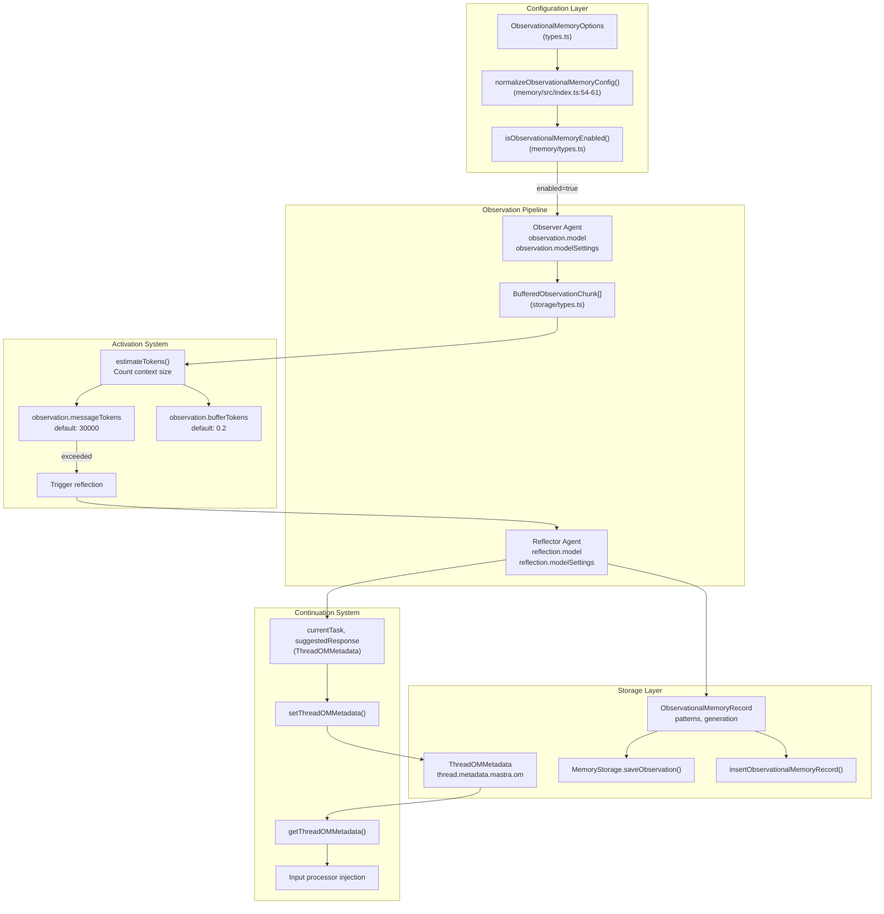
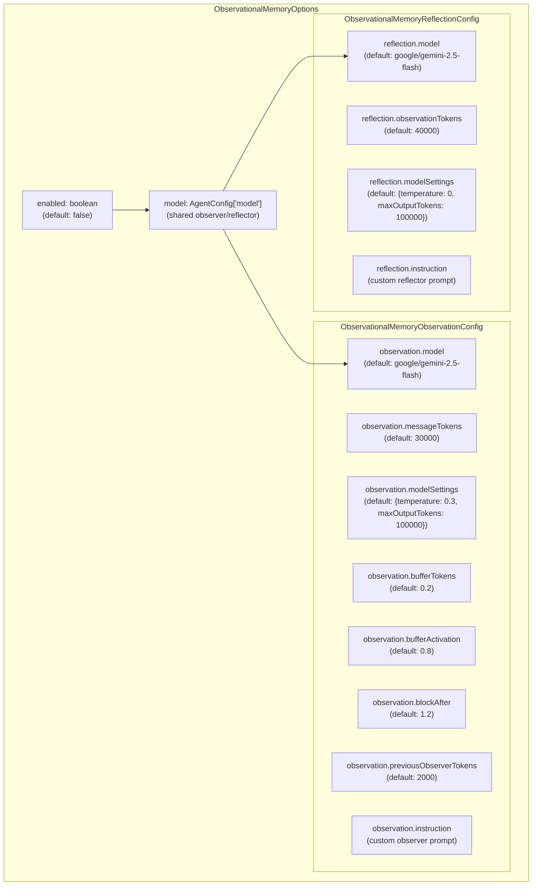
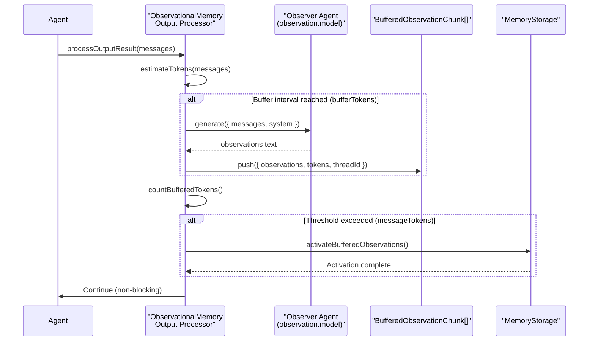
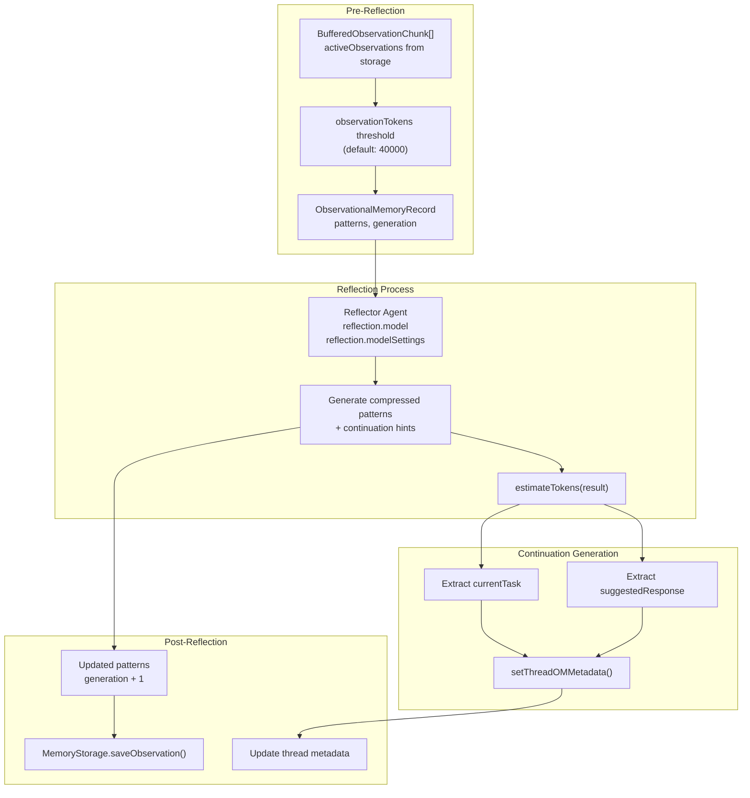
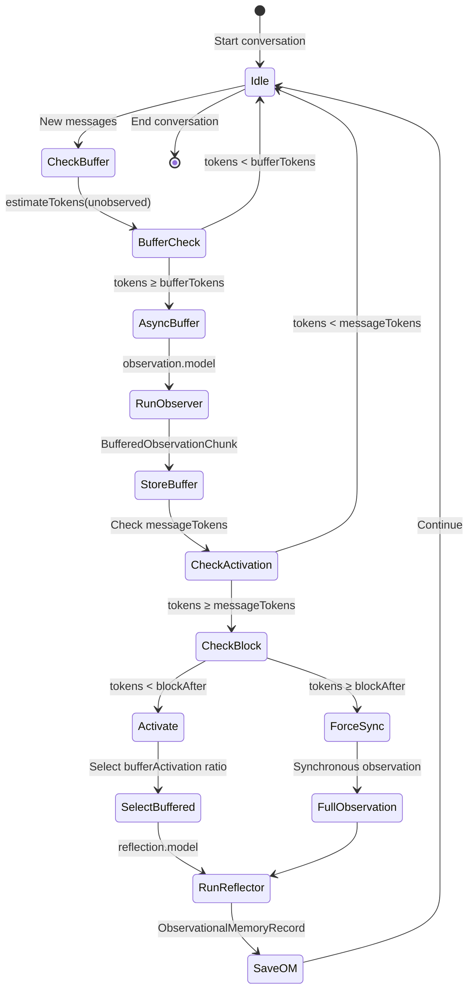
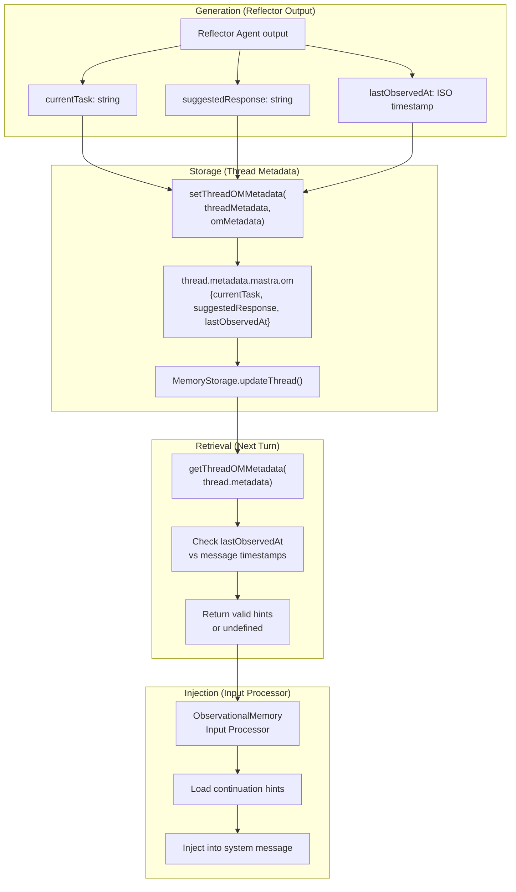
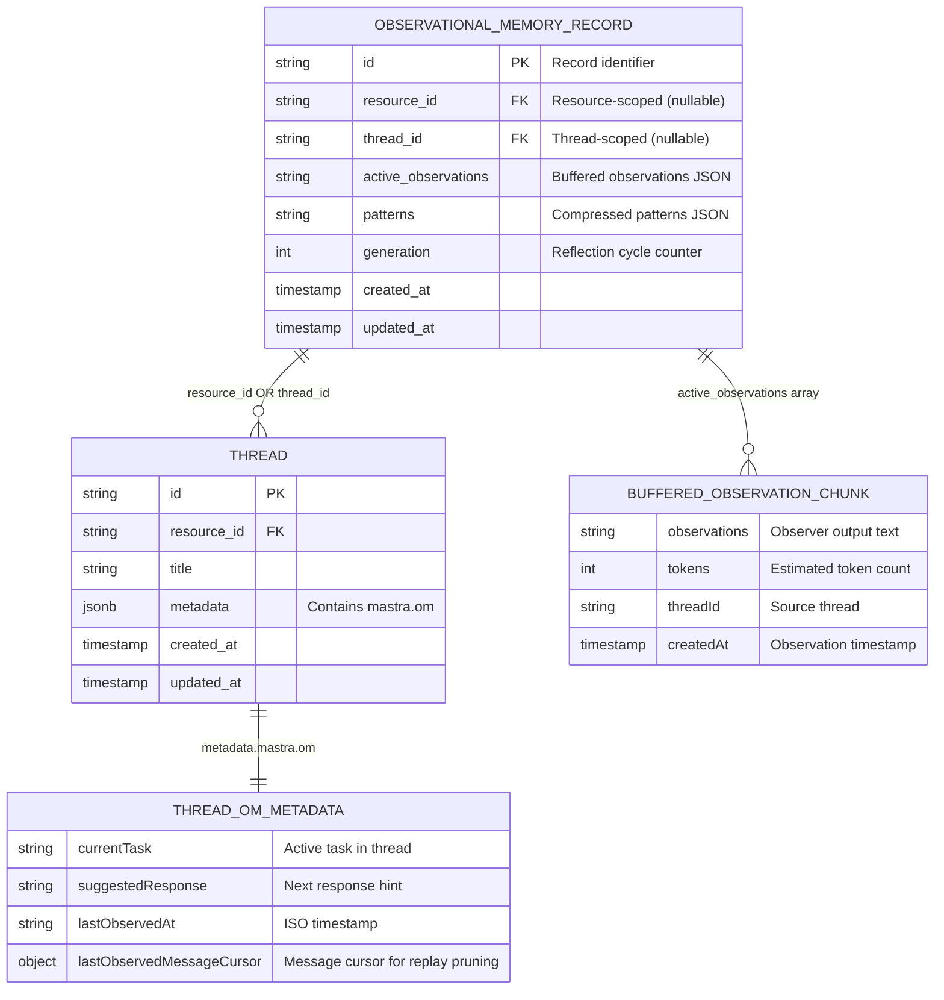
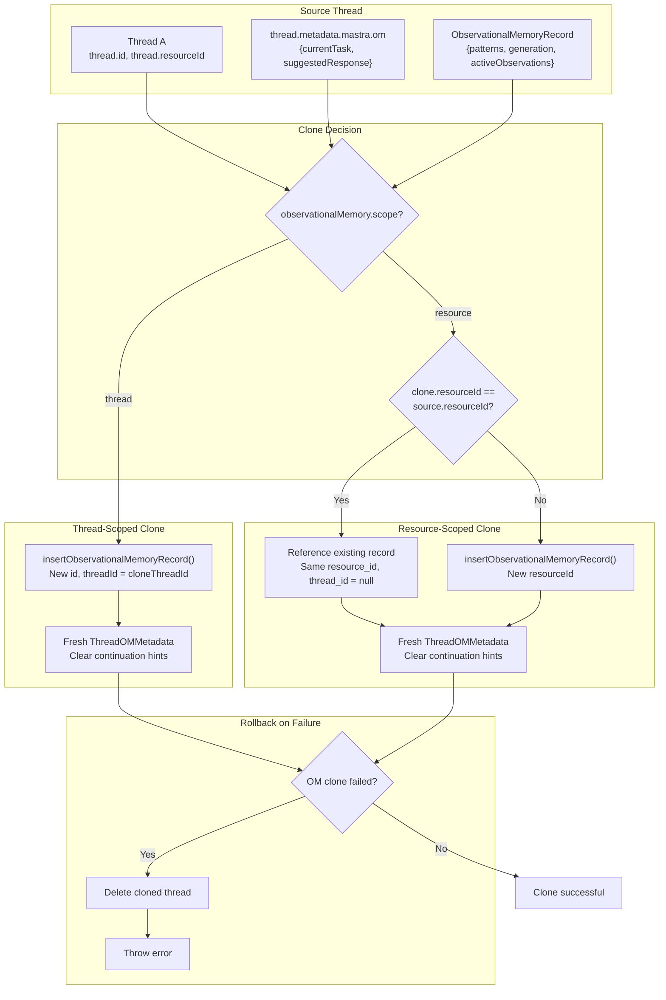
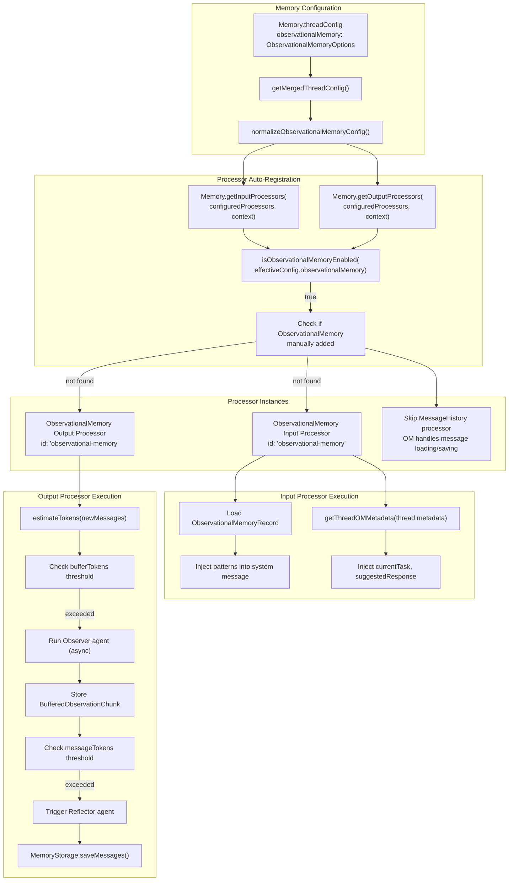
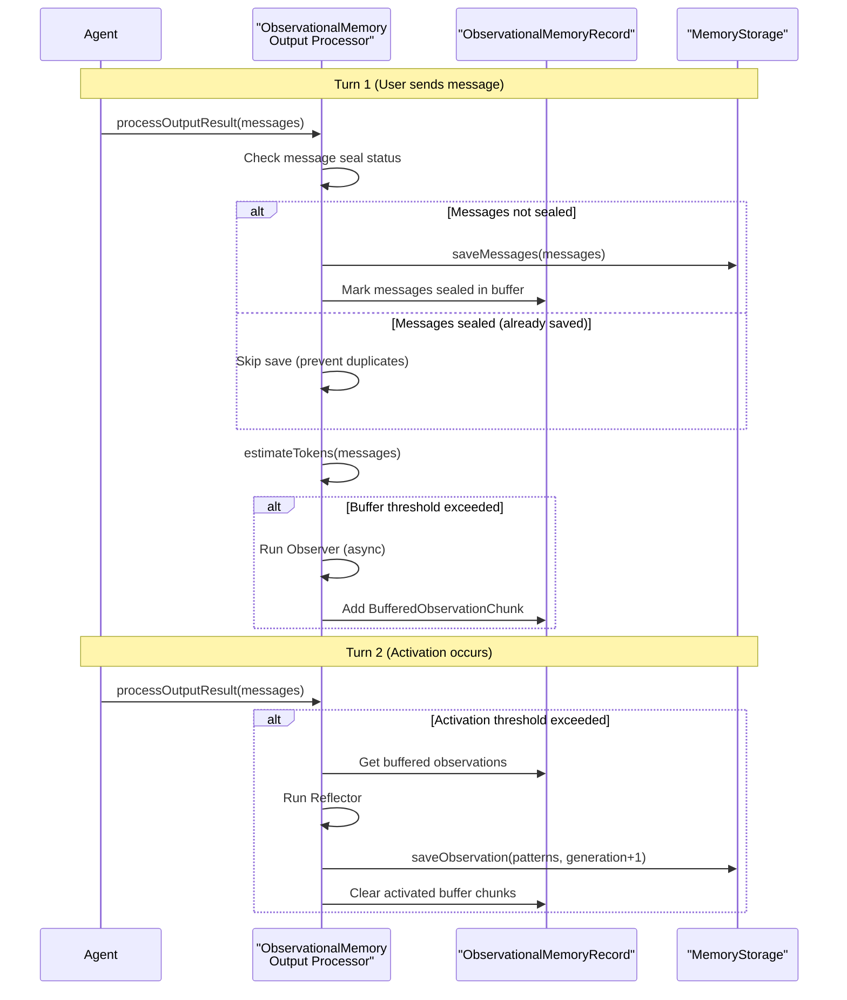

# Observational Memory System

<details>
<summary>Relevant source files</summary>

The following files were used as context for generating this wiki page:

- [packages/agent-builder/integration-tests/.gitignore](packages/agent-builder/integration-tests/.gitignore)
- [packages/agent-builder/integration-tests/README.md](packages/agent-builder/integration-tests/README.md)
- [packages/agent-builder/integration-tests/docker-compose.yml](packages/agent-builder/integration-tests/docker-compose.yml)
- [packages/agent-builder/integration-tests/src/fixtures/minimal-mastra-project/.gitignore](packages/agent-builder/integration-tests/src/fixtures/minimal-mastra-project/.gitignore)
- [packages/agent-builder/integration-tests/src/fixtures/minimal-mastra-project/env.example](packages/agent-builder/integration-tests/src/fixtures/minimal-mastra-project/env.example)
- [packages/core/src/memory/memory.ts](packages/core/src/memory/memory.ts)
- [packages/core/src/memory/types.ts](packages/core/src/memory/types.ts)
- [packages/memory/CHANGELOG.md](packages/memory/CHANGELOG.md)
- [packages/memory/integration-tests/docker-compose.yml](packages/memory/integration-tests/docker-compose.yml)
- [packages/memory/integration-tests/src/agent-memory.test.ts](packages/memory/integration-tests/src/agent-memory.test.ts)
- [packages/memory/integration-tests/src/processors.test.ts](packages/memory/integration-tests/src/processors.test.ts)
- [packages/memory/integration-tests/src/streaming-memory.test.ts](packages/memory/integration-tests/src/streaming-memory.test.ts)
- [packages/memory/integration-tests/src/test-utils.ts](packages/memory/integration-tests/src/test-utils.ts)
- [packages/memory/integration-tests/src/with-libsql-storage.test.ts](packages/memory/integration-tests/src/with-libsql-storage.test.ts)
- [packages/memory/integration-tests/src/with-pg-storage.test.ts](packages/memory/integration-tests/src/with-pg-storage.test.ts)
- [packages/memory/integration-tests/src/with-upstash-storage.test.ts](packages/memory/integration-tests/src/with-upstash-storage.test.ts)
- [packages/memory/integration-tests/src/worker/generic-memory-worker.ts](packages/memory/integration-tests/src/worker/generic-memory-worker.ts)
- [packages/memory/integration-tests/src/working-memory.test.ts](packages/memory/integration-tests/src/working-memory.test.ts)
- [packages/memory/integration-tests/vitest.config.ts](packages/memory/integration-tests/vitest.config.ts)
- [packages/memory/package.json](packages/memory/package.json)
- [packages/memory/src/index.test.ts](packages/memory/src/index.test.ts)
- [packages/memory/src/index.ts](packages/memory/src/index.ts)
- [packages/memory/src/tools/working-memory.ts](packages/memory/src/tools/working-memory.ts)
- [stores/pg/CHANGELOG.md](stores/pg/CHANGELOG.md)
- [stores/pg/package.json](stores/pg/package.json)

</details>

## Purpose and Scope

The Observational Memory System is a three-tier compression mechanism that maintains conversation continuity when message history exceeds model context windows. It uses an Observer LLM to extract key observations from conversation chunks, a Reflector LLM to compress observations when token thresholds are crossed, and automatic activation triggers to prevent context overflow.

This system is distinct from other memory capabilities:

- For recent message history retrieval, see [Thread Management and Message Storage](#7.2)
- For working memory (persistent user profiles), see [Working Memory and Version Management](#7.10)
- For semantic search across conversations, see [Vector Storage and Semantic Search](#7.6)

**Sources:** [packages/memory/src/index.ts:54-61](), [packages/core/src/memory/types.ts:376-634]()

## Architecture Overview



**Observational Memory Processing Pipeline**

The system operates in three phases:

1. **Observation Phase**: The Observer LLM extracts structured observations from conversation chunks and stores them in an async buffer
2. **Activation Phase**: When token count exceeds the configured threshold, the activation system triggers compression
3. **Reflection Phase**: The Reflector LLM compresses buffered observations and generates continuation hints

Observations are scoped either at the resource level (shared across all threads for a user) or thread level (isolated per conversation), configurable via `scope` option.

**Sources:** [packages/memory/src/index.ts:54-61](), [packages/core/src/memory/types.ts:48-113](), [packages/core/src/memory/types.ts:376-634]()

## Configuration Schema

### ObservationalMemoryOptions Type



**Configuration Structure**

| Field                                | Type                               | Default                                       | Description                                                                          |
| ------------------------------------ | ---------------------------------- | --------------------------------------------- | ------------------------------------------------------------------------------------ |
| `enabled`                            | `boolean`                          | `false`                                       | Enable/disable observational memory                                                  |
| `model`                              | `AgentConfig['model']`             | `undefined`                                   | Shared model for observer and reflector (overridden by observation/reflection.model) |
| `observation.model`                  | `AgentConfig['model']`             | `'google/gemini-2.5-flash'`                   | LLM for extracting observations                                                      |
| `observation.messageTokens`          | `number`                           | `30000`                                       | Token count of unobserved messages triggering observation                            |
| `observation.modelSettings`          | `ObservationalMemoryModelSettings` | `{temperature: 0.3, maxOutputTokens: 100000}` | Model settings (only for default model)                                              |
| `observation.bufferTokens`           | `number \| false`                  | `0.2`                                         | Token interval for async buffering (fraction or absolute count)                      |
| `observation.bufferActivation`       | `number`                           | `0.8`                                         | Ratio of buffered observations to activate (0-1)                                     |
| `observation.blockAfter`             | `number`                           | `1.2`                                         | Threshold for synchronous observation (multiplier or absolute)                       |
| `observation.previousObserverTokens` | `number \| false`                  | `2000`                                        | Token budget for observer context truncation                                         |
| `observation.instruction`            | `string`                           | Built-in prompt                               | Custom observer prompt appended to system message                                    |
| `reflection.model`                   | `AgentConfig['model']`             | `'google/gemini-2.5-flash'`                   | LLM for compressing observations                                                     |
| `reflection.observationTokens`       | `number`                           | `40000`                                       | Token count of observations triggering reflection                                    |
| `reflection.modelSettings`           | `ObservationalMemoryModelSettings` | `{temperature: 0, maxOutputTokens: 100000}`   | Model settings (only for default model)                                              |
| `reflection.instruction`             | `string`                           | Built-in prompt                               | Custom reflector prompt appended to system message                                   |

**Configuration Normalization**

The `normalizeObservationalMemoryConfig()` function converts boolean shorthand to full configuration:

```typescript
// packages/memory/src/index.ts:24-31
function normalizeObservationalMemoryConfig(
  config: boolean | ObservationalMemoryOptions | undefined
): ObservationalMemoryOptions | undefined {
  if (config === true) return { model: 'google/gemini-2.5-flash' }
  if (config === false || config === undefined) return undefined
  if (
    typeof config === 'object' &&
    (config as ObservationalMemoryOptions).enabled === false
  )
    return undefined
  return config as ObservationalMemoryOptions
}
```

**Sources:** [packages/core/src/memory/types.ts:376-634](), [packages/memory/src/index.ts:54-61]()

## Observer LLM Component

The Observer extracts structured observations from conversation chunks without compressing the actual message content. It operates asynchronously to avoid blocking agent responses.

### Observation Extraction Process



**Observation Chunking Strategy**

The processor divides the conversation into chunks for observation:

1. **Chunk Creation**: Messages are grouped based on token limits
2. **Async Processing**: Observer calls run without blocking the agent response
3. **Buffering**: Observations accumulate in `BufferedObservationChunk[]` array
4. **Token Tracking**: Each chunk tracks its token count for activation decisions

**Model Configuration**

As of recent changes, custom observer models no longer receive automatic `maxOutputTokens: 100000` injection. This only applies to the default model:

```typescript
// Only applies when using default 'google/gemini-2.5-flash'
observation: {
  model: 'google/gemini-2.5-flash',
  modelSettings: { maxOutputTokens: 100000 } // Auto-applied
}

// Custom models must specify explicitly if needed
observation: {
  model: 'anthropic/claude-3.5-sonnet',
  modelSettings: { maxOutputTokens: 50000 } // Must specify manually
}
```

**Streaming Compatibility**

Observer and reflector calls use the streaming API internally to support providers that require `stream: true` in requests (e.g., Codex).

**Sources:** [packages/core/src/memory/types.ts:385-550](), [packages/memory/CHANGELOG.md:99-139]()

## Reflector LLM Component

The Reflector compresses buffered observations when activation thresholds are crossed. It operates with automatic retry logic to ensure successful compression within token limits.

### Reflection and Compression Flow



**Reflection Behavior**

The reflector compresses observations using these strategies:

1. **First Attempt**: Compress buffered observations + existing patterns into consolidated patterns
2. **Retry Attempts**: If result exceeds token limit, retry with stronger compression instructions
3. **Max Retries**: After `reflection.maxRetries` attempts (default 3), throw error
4. **Continuation Generation**: Generate `suggestedContinuation` and `currentTask` hints for next turn

**Token Limit Enforcement**

The reflector must produce output that fits within the remaining context window. The retry mechanism progressively increases compression pressure:

```
Attempt 1: "Compress these observations..."
Attempt 2: "Compress these observations MORE AGGRESSIVELY..."
Attempt 3: "Compress these observations EXTREMELY AGGRESSIVELY..."
```

**Pattern Storage**

Compressed patterns are stored in the `ObservationalMemoryRecord` at either resource or thread scope, depending on configuration.

**Sources:** [packages/core/src/memory/types.ts:553-634](), [packages/core/src/storage/types.ts:1-100]()

## Activation and Buffering System

### Token-Based Activation



**Activation Parameters**

| Parameter                      | Type              | Behavior                                                  | Example                                    |
| ------------------------------ | ----------------- | --------------------------------------------------------- | ------------------------------------------ |
| `observation.messageTokens`    | `number`          | Unobserved message tokens triggering observation          | `30000` (default)                          |
| `observation.bufferTokens`     | `number \| false` | Token interval for async buffering (fraction or absolute) | `0.2` = 20% of messageTokens (6000 tokens) |
| `observation.bufferActivation` | `number`          | Ratio of buffered observations to activate (0-1)          | `0.8` = activate 80%, keep 20% in reserve  |
| `observation.blockAfter`       | `number`          | Synchronous observation threshold                         | `1.2` = 1.2× messageTokens (36000 tokens)  |
| `reflection.observationTokens` | `number`          | Observation tokens triggering reflection                  | `40000` (default)                          |

**Activation Timing**

Recent fixes ensure activation triggers **mid-step** as soon as the threshold is crossed, rather than waiting for the next user message. This prevents context from growing too large before compression.

**Partial vs Full Activation**

The system now distinguishes between:

1. **Partial Activation** (preferred): Compress buffered chunks, preserve some recent context
2. **Full Observation** (fallback): When partial can't compress enough, clear everything and start fresh

Activation is **skipped** when it can't compress enough context, falling back to full observation instead. This prevents scenarios where compression leaves too little context.

**Async Buffering**

Observations are buffered asynchronously to avoid blocking agent responses:

```
User message → Agent starts processing → Observer runs in background → Agent responds
                                        ↓
                                    Observations buffered
                                        ↓
                                    Token count checked
                                        ↓
                                    Activation triggered (if needed)
```

**Token Counting Fixes**

Recent changes exclude reasoning-only message parts from token counts to prevent premature context reduction. Only text content that would be sent to the LLM is counted.

**Sources:** [packages/core/src/memory/types.ts:385-550](), [packages/memory/CHANGELOG.md:99-139](), [packages/memory/CHANGELOG.md:151-167]()

## Continuation Hints

Continuation hints maintain conversational flow across observation compressions by providing context about the current task and suggested next response.

### Hint Storage and Lifecycle



**ThreadOMMetadata Structure**

The `ThreadOMMetadata` type defines thread-level observational memory metadata:

```typescript
// packages/core/src/memory/types.ts:48-61
export type ThreadOMMetadata = {
  /** The current task being worked on in this thread */
  currentTask?: string
  /** Suggested response for continuing this thread's conversation */
  suggestedResponse?: string
  /** Timestamp of the last observed message in this thread (ISO string) */
  lastObservedAt?: string
}
```

This metadata is stored at `thread.metadata.mastra.om` and accessed via helper functions:

- `getThreadOMMetadata(threadMetadata)`: Safely extracts OM metadata from thread
- `setThreadOMMetadata(threadMetadata, omMetadata)`: Immutably updates OM metadata

**Staleness Prevention**

Recent fixes address stale continuation hints:

1. **Detection**: When newer outputs omit continuation hints, old hints are identified as stale
2. **Clearing**: Stale hints are removed from thread metadata
3. **Prevention**: Prevents agents from replying to old messages or working on completed tasks

This resolves issues where async buffered observations generated continuation hints that became outdated by the time they were injected into the next turn.

**Hint Injection**

Continuation hints are injected into the agent's context during the input processing phase, before the LLM generates a response. This provides guidance without explicit user prompting.

**Sources:** [packages/core/src/memory/types.ts:48-113](), [packages/core/src/memory/types.ts:80-113]()

## Storage Schema

### ObservationalMemoryRecord



**Record Scoping**

Observational memory records can be scoped at two levels:

1. **Resource-Scoped** (`scope: 'resource'`):
   - `resource_id` is set, `thread_id` is NULL
   - Patterns shared across all threads for the resource
   - Used for user-wide behavioral patterns

2. **Thread-Scoped** (`scope: 'thread'`):
   - Both `resource_id` and `thread_id` are set
   - Patterns isolated per conversation
   - Used for conversation-specific context

**Generation History**

The `generation` field tracks observation compression cycles:

- Generation 0: Initial observations
- Generation 1: First compression
- Generation 2: Second compression
- etc.

Only the current generation is used for context injection. Older generations are historical and not cloned during thread forking.

**Storage Operations**

Storage adapters implement these operations:

- `saveObservation()`: Insert/update observation record
- `getObservation()`: Retrieve by resource/thread ID
- `insertObservationalMemoryRecord()`: Direct insert for cloning (PostgreSQL, LibSQL, MongoDB, Upstash)

**Sources:** [packages/core/src/storage/types.ts:1-100](), [packages/core/src/memory/types.ts:48-62]()

## Thread Cloning and Migration

When threads are cloned (e.g., forking a conversation), observational memory follows specific rules:

### Cloning Behavior



**Cloning Rules**

1. **Thread-Scoped OM**:
   - OM record is cloned with remapped message IDs
   - New thread gets fresh OM metadata
   - Only current generation is cloned (history is not copied)

2. **Resource-Scoped OM (same resourceId)**:
   - OM record is shared (no clone needed)
   - New thread gets fresh OM metadata
   - Patterns remain linked to original resource

3. **Resource-Scoped OM (different resourceId)**:
   - OM record is cloned with remapped thread tags
   - New thread gets fresh OM metadata
   - Patterns duplicated for new resource

**Rollback on Failure**

If OM cloning fails, the already-persisted thread clone is rolled back to maintain consistency. This prevents orphaned threads without their observational memory.

**Storage Implementation**

The `insertObservationalMemoryRecord()` method was added to PostgreSQL, LibSQL, MongoDB, and Upstash adapters to support direct insertion during cloning operations.

**Sources:** [packages/core/src/storage/types.ts:1-100](), [stores/pg/CHANGELOG.md:7-16]()

## Integration with Input/Output Processors

Observational memory integrates with the agent execution pipeline via processors, operating transparently alongside other memory systems.

### Processor Registration



**Input Processor Responsibilities**

The ObservationalMemory input processor:

1. Loads compressed patterns from OM record
2. Retrieves continuation hints from thread metadata
3. Injects both into agent context before LLM call
4. **Handles message loading** (MessageHistory processor is skipped when OM is enabled)

**Output Processor Responsibilities**

The ObservationalMemory output processor:

1. Chunks new messages for observation
2. Extracts observations via Observer LLM (async)
3. Buffers observations for later activation
4. Triggers reflection when threshold exceeded
5. **Handles message saving** (MessageHistory processor is skipped when OM is enabled)

**Automatic Deduplication**

The processor system checks for manual ObservationalMemory processor registration:

```typescript
// packages/core/src/memory/memory.ts:666-669
const hasObservationalMemory =
  configuredProcessors.some(
    (p) => !isProcessorWorkflow(p) && p.id === 'observational-memory'
  ) || isObservationalMemoryEnabled(effectiveConfig.observationalMemory)
```

If a user manually adds an ObservationalMemory processor, the auto-registration is skipped to prevent duplicate processing.

**Sources:** [packages/core/src/memory/memory.ts:608-743](), [packages/core/src/memory/memory.ts:757-852]()

## Duplicate Message Prevention

Recent fixes address duplicate user messages when async buffering is active:

### Buffering Seal Pattern



**Sealing Mechanism**

Messages are "sealed for buffering" with special markers to track their save status:

1. **First Save**: Messages without observation markers are saved to storage
2. **Marking**: Messages are marked as "sealed for buffering" in the buffer
3. **Skip Logic**: On subsequent saves, sealed messages without new observations are skipped
4. **Prevention**: This prevents re-saving with new IDs, which would create duplicates

**Detection Logic**

The processor checks for both:

- Whether message is sealed for buffering
- Whether message lacks observation markers (indicating it was already saved)

Only messages that are both sealed AND lack observation markers are skipped.

**Sources:** [packages/memory/CHANGELOG.md:7-16](), [packages/core/src/storage/types.ts:1-100]()

## Common Patterns and Pitfalls

### Configuration Patterns

**Pattern: Basic Enablement**

```typescript
// Minimal configuration with defaults
memory: new Memory({
  options: {
    observationalMemory: true, // Uses google/gemini-2.5-flash
  },
})
```

**Pattern: Custom Models**

```typescript
// Custom models without automatic maxOutputTokens
memory: new Memory({
  options: {
    observationalMemory: {
      observation: {
        model: 'anthropic/claude-3.5-sonnet',
        modelSettings: {
          maxOutputTokens: 50000, // Must specify explicitly
        },
      },
      reflection: {
        model: 'openai/gpt-4',
        modelSettings: {
          maxOutputTokens: 30000, // Must specify explicitly
        },
      },
    },
  },
})
```

**Pattern: Thread-Scoped OM**

```typescript
// Isolate observations per conversation
memory: new Memory({
  options: {
    observationalMemory: {
      enabled: true,
      scope: 'thread', // Not shared across threads
    },
  },
})
```

### Pitfall: Stale Continuation Hints

**Problem**: Async buffered observations generate continuation hints that become outdated by the next turn.

**Solution**: The system now clears continuation hints when newer outputs omit them, preventing agents from responding to old context.

**Detection**: Monitor for agents replying to completed tasks or old messages. This indicates stale hint injection.

### Pitfall: Premature Context Reduction

**Problem**: Token counting includes reasoning-only message parts, causing premature activation.

**Solution**: Recent fixes exclude reasoning content from token counts. Only text that would be sent to the LLM is counted.

**Verification**: Check that activation only triggers when actual conversational context exceeds threshold, not internal reasoning.

### Pitfall: Stream-Only Provider Compatibility

**Problem**: Some providers (e.g., Codex) require `stream: true` in requests, but OM used non-streaming calls.

**Solution**: Observer and reflector now use streaming API internally, making them compatible with stream-only providers.

**Migration**: No code changes needed. Existing configurations work with stream-only providers.

### Pitfall: Insufficient Compression

**Problem**: Partial activation leaves too little context after compression.

**Solution**: Activation is now skipped when compression can't free enough tokens, falling back to full observation instead.

**Indicator**: Watch for logs indicating "activation skipped, falling back to full observation" to detect this scenario.

**Sources:** [packages/memory/CHANGELOG.md:10-24](), [packages/memory/CHANGELOG.md:61-66]()
