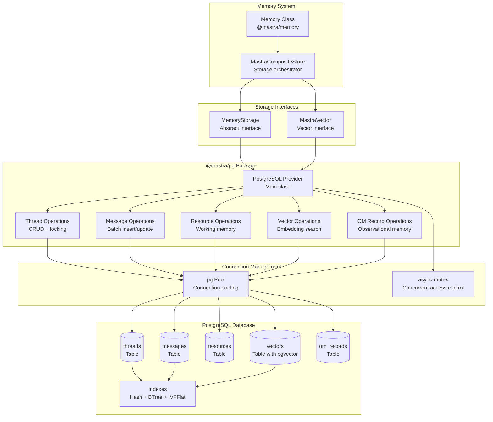
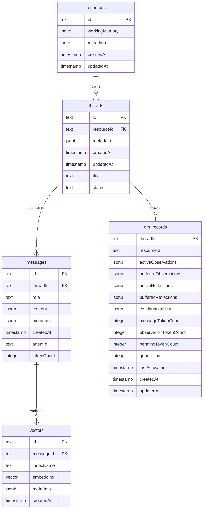
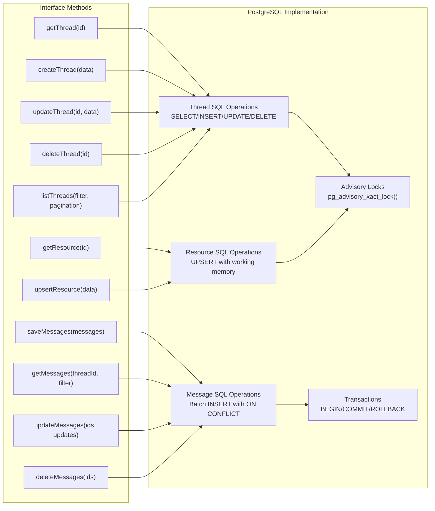
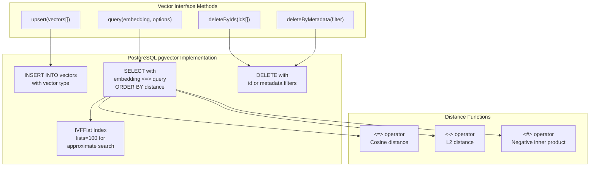
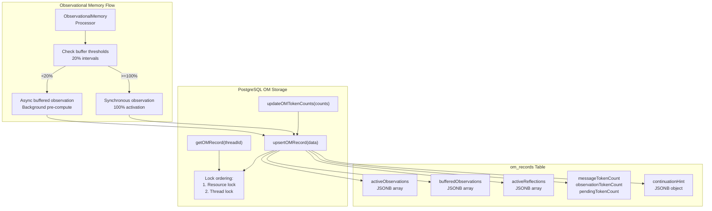

# PostgreSQL Storage Provider

<details>
<summary>Relevant source files</summary>

The following files were used as context for generating this wiki page:

- [packages/memory/CHANGELOG.md](packages/memory/CHANGELOG.md)
- [packages/memory/package.json](packages/memory/package.json)
- [stores/pg/CHANGELOG.md](stores/pg/CHANGELOG.md)
- [stores/pg/package.json](stores/pg/package.json)

</details>

The PostgreSQL Storage Provider (`@mastra/pg`) implements Mastra's storage abstraction layer using PostgreSQL as the backing database. This provider handles both relational data storage (threads, messages, resources, working memory) and vector storage (embeddings for semantic search) in a unified PostgreSQL instance with pgvector extension support.

For information about the storage abstraction layer and interfaces, see [Storage Domain Architecture](#7.3). For alternative storage providers, see [LibSQL and Edge Storage](#7.5). For vector-specific operations, see [Vector Storage and Semantic Search](#7.6).

---

## Package Overview

The `@mastra/pg` package provides a PostgreSQL-backed implementation of Mastra's storage interfaces, offering production-ready persistence with ACID guarantees, concurrent access patterns, and vector similarity search capabilities.

**Key Features:**

- Implementation of `MemoryStorage` interface for threads, messages, and resources
- Implementation of `MastraVector` interface for embedding storage and similarity search
- Support for PostgreSQL 12+ with pgvector extension
- Transaction support for atomic multi-table operations
- Connection pooling via `pg` library
- Concurrent operation safety with mutex protection
- Hash-based efficient lookups using xxhash-wasm

**Package Structure:**

| Aspect           | Value                  |
| ---------------- | ---------------------- |
| Package Name     | `@mastra/pg`           |
| Location         | `stores/pg/`           |
| Main Export      | `dist/index.js`        |
| Type Definitions | `dist/index.d.ts`      |
| Peer Dependency  | `@mastra/core` >=1.4.0 |

**Dependencies:**

```
async-mutex: ^0.5.0      # Concurrent access protection
pg: ^8.20.0               # PostgreSQL client
xxhash-wasm: ^1.1.0       # Fast hashing for efficient lookups
```

Sources: [stores/pg/package.json:1-75]()

---

## Architecture Overview



**Architecture: PostgreSQL Storage Provider Integration**

The PostgreSQL provider implements both `MemoryStorage` and `MastraVector` interfaces through a unified class that manages a connection pool to a PostgreSQL instance. Operations are organized into domain-specific modules (threads, messages, resources, vectors, OM records) that share the pool. Concurrent access to shared resources is protected via async-mutex.

Sources: [stores/pg/package.json:37-41]()

---

## Database Schema Design

The PostgreSQL provider defines a normalized schema with five primary tables optimized for Mastra's memory and storage patterns.

### Schema Tables



**Schema: Core Tables and Relationships**

### Table Details

**threads**

- Primary key: `id` (text)
- Foreign key: `resourceId` → `resources.id`
- Purpose: Stores conversation threads with metadata and working memory
- Key fields:
  - `metadata`: JSONB containing `workingMemory`, custom metadata, and system flags
  - `title`: Thread display name, generated on first message
  - `status`: Thread lifecycle state (active, archived, etc.)

**messages**

- Primary key: `id` (text)
- Foreign key: `threadId` → `threads.id`
- Purpose: Stores conversation messages with role, content, and token counts
- Key fields:
  - `role`: Message role (user, assistant, tool, system)
  - `content`: JSONB array of message parts (text, tool calls, tool results, images)
  - `agentId`: Agent that generated the message (for assistant messages)
  - `tokenCount`: Cached token count for observational memory thresholds

**resources**

- Primary key: `id` (text)
- Purpose: Stores resource-scoped data including working memory
- Key fields:
  - `workingMemory`: JSONB containing resource-scoped working memory state
  - `metadata`: Custom resource metadata

**vectors**

- Primary key: `id` (text)
- Foreign key: `messageId` → `messages.id`
- Purpose: Stores embeddings for semantic search with pgvector
- Key fields:
  - `embedding`: PostgreSQL `vector` type (requires pgvector extension)
  - `indexName`: Semantic index identifier (e.g., `message_messages_1536`)
  - `metadata`: JSONB with search metadata

**om_records**

- Primary key: `threadId` (text)
- Foreign key: `threadId` → `threads.id`, `resourceId` → `resources.id`
- Purpose: Stores observational memory state for threads
- Key fields:
  - `activeObservations`: JSONB array of current observations
  - `bufferedObservations`: JSONB array of pre-computed observations
  - `activeReflections`: JSONB array of consolidated reflections
  - `messageTokenCount`, `observationTokenCount`: Token tracking for thresholds
  - `generation`: OM activation cycle counter

Sources: [stores/pg/package.json:4](), [packages/memory/CHANGELOG.md:243-257]()

---

## Storage Domain Implementation

The PostgreSQL provider implements the storage domain interfaces defined by `@mastra/core`. These interfaces are used by `MastraCompositeStore` to provide storage capabilities to the memory system.

### MemoryStorage Interface Implementation



**Implementation: MemoryStorage Interface to SQL Operations**

**Thread Operations:**

- `getThread()`: Single SELECT by id with metadata parsing
- `createThread()`: INSERT with generated id, timestamps, and JSONB metadata
- `updateThread()`: UPDATE with partial metadata merge
- `deleteThread()`: DELETE with cascade to messages and vectors
- `listThreads()`: SELECT with filtering, pagination, and ORDER BY

**Message Operations:**

- `saveMessages()`: Batch INSERT with `ON CONFLICT (id) DO UPDATE` for idempotency
- `getMessages()`: SELECT with thread filter, role filter, pagination, and ORDER BY createdAt
- `updateMessages()`: UPDATE multiple messages in single transaction
- `deleteMessages()`: DELETE with automatic vector cleanup (see vector embedding cleanup fix in changelog)

**Resource Operations:**

- `getResource()`: SELECT by id with working memory parsing
- `upsertResource()`: INSERT ON CONFLICT UPDATE for atomic create-or-update

Sources: [packages/memory/CHANGELOG.md:243-257](), [stores/pg/package.json:37-41]()

### MastraVector Interface Implementation



**Implementation: Vector Storage with pgvector**

**Vector Operations:**

- `upsert()`: Batch INSERT of embeddings with `ON CONFLICT (id) DO UPDATE`
- `query()`: Similarity search using pgvector distance operators with configurable top-K and metadata filters
- `deleteByIds()`: DELETE by primary key array
- `deleteByMetadata()`: DELETE with JSONB metadata filtering

**Distance Metrics:**

- Cosine distance (`<=>`): Default for semantic search, normalized similarity
- L2 distance (`<->`): Euclidean distance for absolute similarity
- Inner product (`<#>`): Negative inner product for maximum similarity

**Index Strategy:**
The provider creates IVFFlat indexes on vector columns for approximate nearest neighbor search, balancing query speed and accuracy. The index uses `lists=100` for partitioning, suitable for datasets up to ~100k vectors.

Sources: [stores/pg/package.json:4](), [packages/memory/CHANGELOG.md:243-257]()

---

## Observational Memory Integration

The PostgreSQL provider includes dedicated support for Observational Memory (OM) state persistence, enabling multi-tier memory systems with async buffering.

### OM Record Management



**Diagram: Observational Memory State Persistence**

**OM Record Fields:**

| Field                   | Type         | Purpose                                            |
| ----------------------- | ------------ | -------------------------------------------------- |
| `activeObservations`    | JSONB array  | Current observations in agent context              |
| `bufferedObservations`  | JSONB array  | Pre-computed observations ready for activation     |
| `activeReflections`     | JSONB array  | Consolidated reflections from observations         |
| `bufferedReflections`   | JSONB array  | Pre-computed reflections                           |
| `continuationHint`      | JSONB object | Current task and suggested response for activation |
| `messageTokenCount`     | integer      | Total message window tokens                        |
| `observationTokenCount` | integer      | Total observation tokens                           |
| `pendingTokenCount`     | integer      | Buffered observation tokens not yet activated      |
| `generation`            | integer      | Activation cycle counter                           |
| `lastActivation`        | timestamp    | Last OM activation time                            |

**Concurrency Safety:**

The PostgreSQL provider implements lock ordering to prevent deadlocks when multiple threads share a resourceId (e.g., parallel agents with different threadIds but same resourceId). The lock order is:

1. Resource-level lock (if resource-scoped OM)
2. Thread-level lock (always)

This consistent ordering prevents lock inversion that could cause deadlocks when thread A locks resource then thread while thread B locks thread then resource.

Sources: [packages/memory/CHANGELOG.md:376-397](), [packages/memory/CHANGELOG.md:662-713]()

---

## Configuration and Setup

### Database Setup

**Prerequisites:**

- PostgreSQL 12 or later
- pgvector extension installed

**Extension Installation:**

```sql
-- Install pgvector extension
CREATE EXTENSION IF NOT EXISTS vector;
```

### Provider Initialization

```typescript
import { PgStorageProvider } from '@mastra/pg'

// Initialize with connection string
const storage = new PgStorageProvider({
  connectionString: process.env.DATABASE_URL,
})

// Or with connection config
const storage = new PgStorageProvider({
  host: 'localhost',
  port: 5432,
  database: 'mastra',
  user: 'postgres',
  password: process.env.DB_PASSWORD,
})

// Use with Memory
const memory = new Memory({
  storage,
})
```

**Configuration Options:**

| Option              | Type   | Description                     |
| ------------------- | ------ | ------------------------------- |
| `connectionString`  | string | PostgreSQL connection URI       |
| `host`              | string | Database host                   |
| `port`              | number | Database port (default: 5432)   |
| `database`          | string | Database name                   |
| `user`              | string | Database user                   |
| `password`          | string | Database password               |
| `ssl`               | object | SSL configuration               |
| `max`               | number | Maximum pool size (default: 20) |
| `idleTimeoutMillis` | number | Idle connection timeout         |

### Schema Initialization

The provider automatically creates required tables on first use. To manually initialize:

```typescript
await storage.initialize()
```

This creates:

- `threads` table with indexes
- `messages` table with indexes on threadId and createdAt
- `resources` table
- `vectors` table with pgvector support
- `om_records` table
- IVFFlat indexes for vector similarity search

Sources: [stores/pg/package.json:37-41]()

---

## PostgreSQL-Specific Features

### Transaction Support

The provider uses transactions for atomic multi-table operations:

```typescript
// Thread deletion cascades to messages and vectors in single transaction
await storage.deleteThread(threadId)

// Batch message operations are atomic
await storage.saveMessages([msg1, msg2, msg3])
```

### Advisory Locks

PostgreSQL advisory locks prevent race conditions in concurrent OM operations:

```typescript
// Thread-scoped OM uses thread-level lock
SELECT pg_advisory_xact_lock(hash(threadId));

// Resource-scoped OM uses resource-level lock first, then thread-level
SELECT pg_advisory_xact_lock(hash(resourceId));
SELECT pg_advisory_xact_lock(hash(threadId));
```

Advisory locks are session-scoped and automatically released on transaction commit/rollback.

Sources: [packages/memory/CHANGELOG.md:376-397]()

### Vector Indexing Strategies

The provider supports multiple vector index types:

**IVFFlat (Default):**

```sql
CREATE INDEX ON vectors
USING ivfflat (embedding vector_cosine_ops)
WITH (lists = 100);
```

Suitable for:

- Datasets up to ~1M vectors
- Balance between speed and accuracy
- Lower memory overhead than HNSW

**Configuration:**

- `lists`: Number of partitions (default: 100)
- Rule of thumb: `lists = rows / 1000` for < 1M rows

### Performance Optimizations

**Connection Pooling:**
The `pg` client maintains a connection pool with configurable size:

- Default max connections: 20
- Idle timeout: 30 seconds
- Connection reuse reduces overhead

**Batch Operations:**
Message inserts use batch INSERT with `ON CONFLICT` for efficient bulk writes:

```sql
INSERT INTO messages (id, threadId, role, content, createdAt)
VALUES ($1, $2, $3, $4, $5), ($6, $7, $8, $9, $10), ...
ON CONFLICT (id) DO UPDATE SET content = EXCLUDED.content;
```

**Index Strategy:**

- B-tree indexes on frequently queried columns (threadId, createdAt)
- Hash indexes on equality lookups (id)
- IVFFlat indexes on vector columns for approximate search
- Partial indexes on filtered queries (e.g., role = 'user')

**Query Optimization:**

- JSONB GIN indexes for metadata filtering
- `EXPLAIN ANALYZE` for query plan inspection
- Prepared statements for repeated queries

Sources: [stores/pg/package.json:37-41]()

---

## Testing Infrastructure

The PostgreSQL provider includes comprehensive integration tests using Docker Compose for isolated test environments.

### Test Setup

**Docker Compose Configuration:**

```bash
# Start test database
pnpm pretest  # Starts PostgreSQL in Docker, waits for ready

# Run tests
pnpm test     # Executes vitest with PostgreSQL connection

# Cleanup
pnpm posttest # Stops and removes containers
```

**Test Scripts:**

| Script       | Purpose                                           |
| ------------ | ------------------------------------------------- |
| `pretest`    | Start PostgreSQL container, wait for pg_isready   |
| `test`       | Run vitest integration tests                      |
| `posttest`   | Stop containers, remove volumes                   |
| `test:watch` | Run tests in watch mode with persistent container |
| `test:perf`  | Performance benchmarks with larger datasets       |

**Performance Testing:**

```bash
# Run performance benchmarks
pnpm pretest:perf   # Start DB with perf config
pnpm test:perf      # Execute with 16GB heap
pnpm posttest:perf  # Cleanup
```

The performance tests use `NODE_OPTIONS='--max-old-space-size=16384'` for testing large-scale vector operations.

Sources: [stores/pg/package.json:22-34]()

---

## Migration and Compatibility

### Version Compatibility

| @mastra/pg | @mastra/core   | Notes          |
| ---------- | -------------- | -------------- |
| 1.8.x      | 1.4.x - 1.14.x | Current stable |
| 1.7.x      | 1.4.x - 1.11.x | Legacy support |

The provider uses semver with `>=1.4.0-0 <2.0.0-0` peer dependency range for forward compatibility within major versions.

### Breaking Changes

**1.8.0 (Current):**

- No breaking changes, backward compatible

**Key Fixes in 1.8.x:**

- Integer token count validation for PostgreSQL strict typing
- Vector embedding cleanup on message deletion
- Deadlock prevention with lock ordering

Sources: [stores/pg/package.json:56-58](), [packages/memory/CHANGELOG.md:376-397](), [packages/memory/CHANGELOG.md:243-257]()

---

## Common Patterns and Best Practices

### Resource-Scoped vs Thread-Scoped Storage

**Thread-Scoped (Default):**

```typescript
// Working memory isolated per thread
await memory.updateWorkingMemory(threadId, {
  userPreferences: { theme: 'dark' },
})
```

**Resource-Scoped:**

```typescript
// Working memory shared across threads for a resource
const memory = new Memory({
  storage,
  workingMemory: {
    scope: 'resource',
    schema: userPreferencesSchema,
  },
})

// Updates persist across all threads for this resourceId
await memory.updateWorkingMemory(threadId, data, { resourceId })
```

### Concurrent Access Patterns

**Mutex Protection:**
The provider uses `async-mutex` to prevent race conditions:

```typescript
// Working memory updates are mutex-protected
await memory.updateWorkingMemory(threadId, updates)
// Concurrent calls queue, preventing data corruption
```

**Advisory Locks:**
Observational memory operations use PostgreSQL advisory locks:

```typescript
// Automatic locking in OM operations
await storage.upsertOMRecord({
  threadId,
  resourceId, // Triggers resource-level lock if present
  activeObservations,
})
```

### Vector Cleanup on Deletion

The provider automatically cleans up orphaned vectors when messages or threads are deleted:

```typescript
// Delete messages and associated vectors atomically
await storage.deleteMessages([msg1Id, msg2Id])

// Delete thread, cascade to messages and vectors
await storage.deleteThread(threadId)
```

This prevents vector table bloat and ensures consistency between messages and embeddings.

Sources: [packages/memory/CHANGELOG.md:243-257](), [packages/memory/CHANGELOG.md:250-256]()

---

## Troubleshooting

### Common Issues

**"invalid input syntax for type integer" errors:**

Fixed in version 1.8.0. Token counts must be integers. If using an older version, ensure token counts are rounded:

```typescript
const tokenCount = Math.round(estimatedTokens)
```

Sources: [packages/memory/CHANGELOG.md:606-607]()

**Deadlock errors with parallel agents:**

Fixed in version 1.8.0. Ensure lock ordering is consistent (resource lock before thread lock). Upgrade to latest version or ensure single-threaded OM operations.

Sources: [packages/memory/CHANGELOG.md:376-397]()

**Missing vector extension:**

```
ERROR: type "vector" does not exist
```

Install pgvector:

```sql
CREATE EXTENSION IF NOT EXISTS vector;
```

**Connection pool exhaustion:**

Increase pool size:

```typescript
const storage = new PgStorageProvider({
  connectionString: process.env.DATABASE_URL,
  max: 50, // Increase from default 20
})
```

### Performance Tuning

**Slow vector queries:**

- Create IVFFlat indexes if missing
- Adjust `lists` parameter based on dataset size
- Consider HNSW indexes for larger datasets (>1M vectors)

**Large observation token counts:**

- Token counts are cached in `messages.tokenCount`
- Repeated counts use cached values
- Provider-backed counting preferred over estimation

Sources: [packages/memory/CHANGELOG.md:243-257]()

---

## Related Documentation

- [Storage Domain Architecture](#7.3) - Abstract storage interfaces
- [LibSQL and Edge Storage](#7.5) - Alternative storage providers
- [Vector Storage and Semantic Search](#7.6) - Vector operations and semantic recall
- [Observational Memory System](#7.9) - OM architecture and token management
- [Thread Management and Message Storage](#7.2) - Thread and message operations
