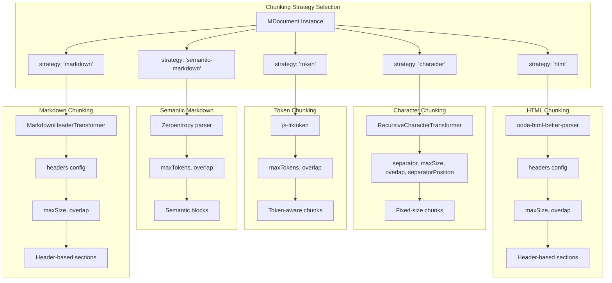
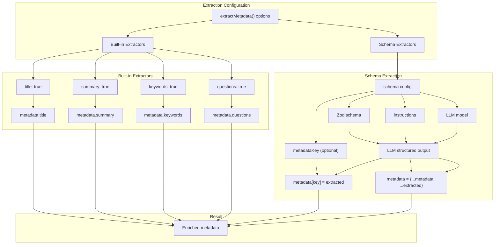
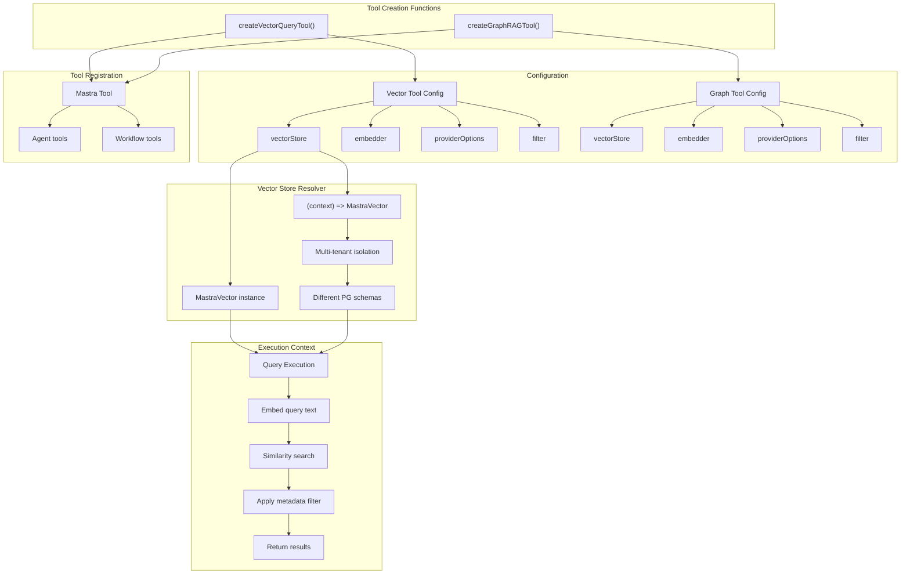
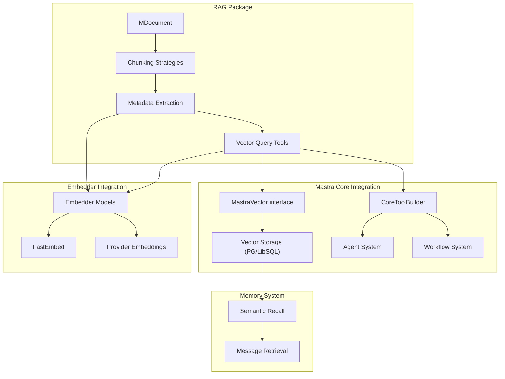

# RAG System and Document Processing

<details>
<summary>Relevant source files</summary>

The following files were used as context for generating this wiki page:

- [packages/evals/CHANGELOG.md](packages/evals/CHANGELOG.md)
- [packages/evals/package.json](packages/evals/package.json)
- [packages/rag/CHANGELOG.md](packages/rag/CHANGELOG.md)
- [packages/rag/package.json](packages/rag/package.json)

</details>

This document describes the RAG (Retrieval-Augmented Generation) system provided by the `@mastra/rag` package. It covers document loading, chunking strategies, metadata extraction, and integration with vector stores for semantic search.

For information about vector storage and semantic recall within the Memory system, see [Vector Storage and Semantic Search](#7.6). For information about creating tools that use these capabilities, see [Tool Definition and Execution Context](#6.1).

## Package Overview

The `@mastra/rag` package provides document processing capabilities for building RAG pipelines. It handles document parsing, chunking, metadata extraction, and provides utilities for creating vector query tools.

**Key capabilities:**

- Document loading from HTML, Markdown, and text formats
- Multiple chunking strategies (character, token, semantic, HTML headers, markdown headers)
- Schema-driven metadata extraction with Zod
- Code-aware chunking for 20+ programming languages
- Vector query tool generation
- Graph RAG support

**Package structure:**

- Main exports from `packages/rag/dist/index.js`
- Peer dependencies: `@mastra/core` (>=1.0.0 <2.0.0) and `zod` (^3.25.0 || ^4.0.0)
- Core dependencies: `js-tiktoken`, `node-html-better-parser`, `zeroentropy`

Sources: [packages/rag/package.json:1-94]()

## Document Loading and Representation

### MDocument Class

The `MDocument` class is the central abstraction for document processing. It wraps content with metadata and provides methods for chunking and metadata extraction.

```mermaid
graph TB
    subgraph "Document Creation"
        HTML[HTML Content]
        Markdown[Markdown Content]
        Text[Plain Text]

        HTML --> fromHTML["MDocument.fromHTML()"]
        Markdown --> fromMarkdown["MDocument.fromMarkdown()"]
        Text --> constructor["new MDocument()"]
    end

    subgraph "MDocument Instance"
        Instance[MDocument Instance]
        Content["content: string"]
        Metadata["metadata: Record<string, any>"]
        ChunkMethod["chunk() method"]
        ExtractMethod["extractMetadata() method"]

        Instance --> Content
        Instance --> Metadata
        Instance --> ChunkMethod
        Instance --> ExtractMethod
    end

    subgraph "Processing Methods"
        ChunkMethod --> ChunkingStrats["Chunking Strategies"]
        ExtractMethod --> MetadataExtracts["Metadata Extractors"]
    end

    fromHTML --> Instance
    fromMarkdown --> Instance
    constructor --> Instance

    ChunkingStrats --> ChunkedDocs["Chunked MDocument[]"]
    MetadataExtracts --> EnrichedDoc["MDocument with metadata"]
```

**Static factory methods:**

- `MDocument.fromHTML(htmlContent)` - Parses HTML and extracts text content
- `MDocument.fromMarkdown(markdownContent)` - Loads markdown content
- Constructor accepts `content: string` and optional `metadata: Record<string, any>`

**Instance methods:**

- `chunk(options)` - Splits document into chunks based on strategy
- `extractMetadata(options)` - Enriches document chunks with extracted metadata

The document maintains both content and metadata throughout the chunking process, with metadata being inherited and optionally merged by child chunks.

Sources: [packages/rag/CHANGELOG.md:370-444]()

## Chunking Strategies

The RAG system provides five primary chunking strategies, each optimized for different content types and use cases.



### Strategy Details

| Strategy            | Use Case             | Key Parameters                                         | Preserves Structure |
| ------------------- | -------------------- | ------------------------------------------------------ | ------------------- |
| `character`         | General text, code   | `separator`, `maxSize`, `overlap`, `separatorPosition` | Separator-based     |
| `token`             | Token-limited models | `maxTokens`, `overlap`                                 | Token boundaries    |
| `semantic-markdown` | Markdown documents   | `maxTokens`, `overlap`                                 | Markdown semantics  |
| `html`              | HTML documents       | `headers`, `maxSize`, `overlap`                        | HTML sections       |
| `markdown`          | Structured markdown  | `headers`, `maxSize`, `overlap`                        | Markdown sections   |

### Character Strategy with RecursiveCharacterTransformer

The `RecursiveCharacterTransformer` implements a recursive splitting approach that tries multiple separators in order of preference. It supports code-aware chunking for 20+ programming languages.

**Supported languages:**

- **General**: CPP, C, TS, JS, MARKDOWN, LATEX, HTML
- **Modern**: GO, JAVA, KOTLIN, PYTHON, RUBY, RUST, SCALA, SWIFT
- **Additional**: PHP, SOL (Solidity), CSHARP, COBOL, LUA, PERL, HASKELL, ELIXIR, POWERSHELL
- **Data formats**: PROTO (Protocol Buffers), RST (reStructuredText)

Each language has separator definitions based on its syntax patterns (modules, classes, functions, control structures).

**Usage pattern:**

```typescript
// Language-specific chunking
RecursiveCharacterTransformer.fromLanguage(Language.PYTHON)

// Custom separator-based chunking
new RecursiveCharacterTransformer({
  separators: [
    '\
\
',
    '\
',
    ' ',
  ],
  maxSize: 1000,
  overlap: 100,
  separatorPosition: 'start', // or 'end', or omit to discard
})
```

The `separatorPosition` parameter controls where separators are placed:

- `'start'` - Separator at beginning of chunk
- `'end'` - Separator at end of chunk
- Omit - Separator discarded (default behavior)

Sources: [packages/rag/CHANGELOG.md:39-183](), [packages/rag/CHANGELOG.md:602-652]()

### HTML Chunking with maxSize Support

HTML chunking strategies (`headers` and `sections`) support `maxSize` parameter to prevent excessively large chunks. When `maxSize` is specified, the system applies `RecursiveCharacterTransformer` after header-based or section-based splitting.

**Without maxSize:**

- Sections remain intact regardless of size
- Can produce very large chunks (45,000+ characters)

**With maxSize:**

- Large sections are further split
- Maintains context with overlap parameter
- Typically produces hundreds of manageable chunks

Example results from arXiv paper test:

- Without maxSize: 22 chunks, max 45,531 chars
- With maxSize=512: 499 chunks, max 512 chars

Sources: [packages/rag/CHANGELOG.md:357-401]()

### Markdown Table Preservation

The `MarkdownHeaderTransformer` automatically detects and preserves markdown tables during chunking. Tables are treated as semantic units similar to code blocks, preventing splits that would break table structure.

**Detection:** Lines containing pipe characters (`|`) are identified as table rows
**Behavior:** Tables are kept together as a single block within chunks

Sources: [packages/rag/CHANGELOG.md:402-444]()

## Metadata Extraction

The RAG system provides both built-in extractors and schema-driven extraction using Zod.



### SchemaExtractor

The `SchemaExtractor` enables extraction of domain-specific structured data from document chunks using user-defined Zod schemas. This uses LLM structured output to reliably extract complex metadata.

**Configuration options:**

- `schema` - Zod schema defining the extraction structure
- `instructions` - Custom prompt for the LLM
- `metadataKey` - Optional key to nest extracted data under
- `model` - LLM model to use for extraction

**Example patterns:**

```typescript
// Product metadata extraction
const productSchema = z.object({
  name: z.string(),
  price: z.number(),
  category: z.string(),
})

await document.extractMetadata({
  extract: {
    title: true, // Built-in extractor
    schema: {
      schema: productSchema,
      instructions: 'Extract product details from the document',
      metadataKey: 'product', // Nests under metadata.product
    },
  },
})

// Result with metadataKey:
// {
//   title: "Product Document",
//   product: {
//     name: "Wireless Headphones",
//     price: 149.99,
//     category: "Electronics"
//   }
// }

// Result without metadataKey (inline):
// {
//   title: "Product Document",
//   name: "Wireless Headphones",
//   price: 149.99,
//   category: "Electronics"
// }
```

The extractor uses the agent's configured LLM model with structured output mode to ensure type-safe extraction matching the provided Zod schema.

Sources: [packages/rag/CHANGELOG.md:222-291]()

## Vector Query Tools

The RAG package provides utilities to create tools that query vector stores for semantic search.



### createVectorQueryTool

Creates a tool that performs semantic search against a vector store. The tool accepts query text and returns relevant document chunks based on embedding similarity.

**Key configuration:**

- `vectorStore` - Can be a static `MastraVector` instance or a resolver function `(context: ToolExecutionContext) => MastraVector`
- `embedder` - Embedding model for query vectorization
- `providerOptions` - Type-safe options for the embedding provider (uses `MastraEmbeddingOptions`)
- `filter` - Optional metadata filter for scoping search results

**Multi-tenant support:**

The resolver function pattern enables tenant isolation:

```typescript
createVectorQueryTool({
  vectorStore: (context) => {
    const tenantId = context.requestContext?.get(MASTRA_RESOURCE_ID_KEY)
    // Return vector store scoped to tenant's schema
    return getTenantVectorStore(tenantId)
  },
  embedder: 'openai/text-embedding-3-small',
})
```

This allows each tenant to have isolated data in separate PostgreSQL schemas or different vector store instances.

Sources: [packages/rag/CHANGELOG.md:293-301]()

### createGraphRAGTool

Similar to `createVectorQueryTool` but implements Graph RAG patterns for enhanced retrieval. Supports the same configuration options including dynamic vector store resolution for multi-tenant scenarios.

Graph RAG extends traditional vector search by incorporating relationships between document chunks, enabling more context-aware retrieval.

Sources: [packages/rag/CHANGELOG.md:293-301]()

### Filter Validation

Both vector query tools validate filter inputs to prevent unintended behavior. Invalid filter inputs throw explicit errors instead of silently falling back to empty filters, which would return unfiltered results.

**Error handling:**

- Invalid filter structure → throws error
- Missing required filter fields → throws error
- Type mismatches → throws error

This ensures developers are aware when filters are not being applied as expected.

Sources: [packages/rag/CHANGELOG.md:445-446]()

## Token Counting and Performance

The RAG system uses `js-tiktoken` for accurate token counting, which is critical for chunking strategies that respect token limits.

**Token-based chunking performance:**

- Token and semantic-markdown strategies have been optimized for faster chunking
- Lower tokenization overhead for markdown knowledge bases
- Significant performance improvements for large document sets

**Token estimation includes:**

- Text content tokens
- Attachment tokens (if present)
- Provider-specific token counting when available

Sources: [packages/rag/CHANGELOG.md:7-8](), [packages/rag/CHANGELOG.md:16-17]()

## Integration with Mastra Core

The RAG system integrates with Mastra's core memory and vector storage systems.



**Key integration points:**

1. **Vector Storage**: RAG tools use `MastraVector` interface from `@mastra/core` for storage abstraction
2. **Tool System**: Vector query tools are registered as Mastra tools using `CoreToolBuilder`
3. **Embedding Models**: Shared embedding infrastructure with memory system
4. **Request Context**: Tools respect `RequestContext` for tenant isolation and authorization

**Workflow:**

1. Documents are loaded and chunked using RAG strategies
2. Metadata is extracted and enriched
3. Chunks are embedded using configured embedding model
4. Embeddings are stored in vector store (PostgreSQL, LibSQL, etc.)
5. Vector query tools enable semantic retrieval within agents and workflows

Sources: [packages/rag/package.json:42-47]()

## Dependencies and Requirements

**Core dependencies:**

- `js-tiktoken` - Token counting for OpenAI models
- `node-html-better-parser` - HTML parsing
- `zeroentropy` - Semantic markdown parsing
- `big.js` - Precision arithmetic for similarity calculations
- `pathe` - Cross-platform path utilities
- `@paralleldrive/cuid2` - Unique ID generation

**Peer dependencies:**

- `@mastra/core` (>=1.0.0 <2.0.0)
- `zod` (^3.25.0 || ^4.0.0)

**Minimum Node.js version:** 22.13.0

Sources: [packages/rag/package.json:35-46](), [packages/rag/package.json:91-93]()
