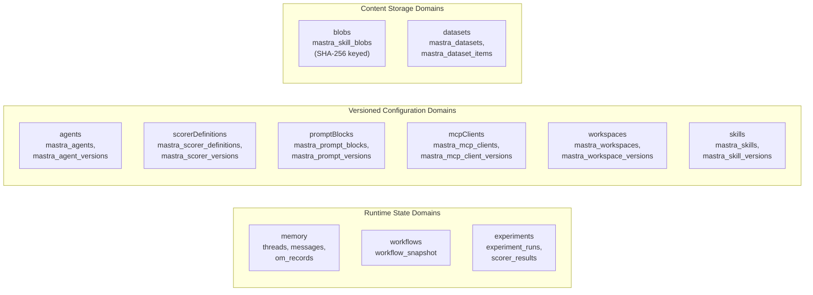
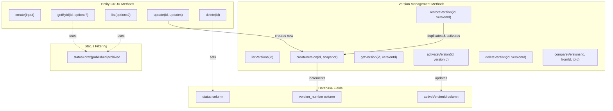
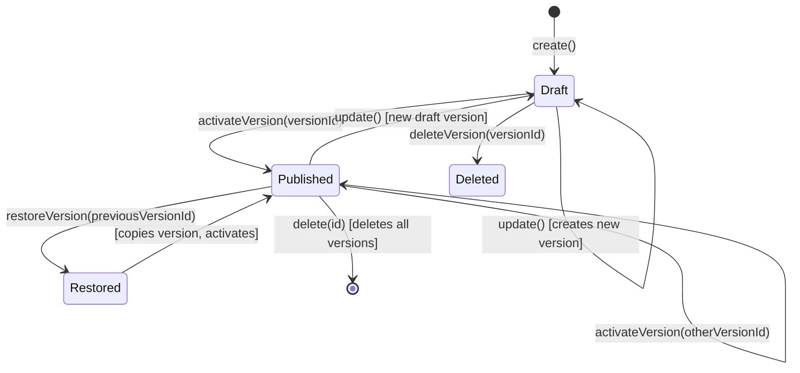
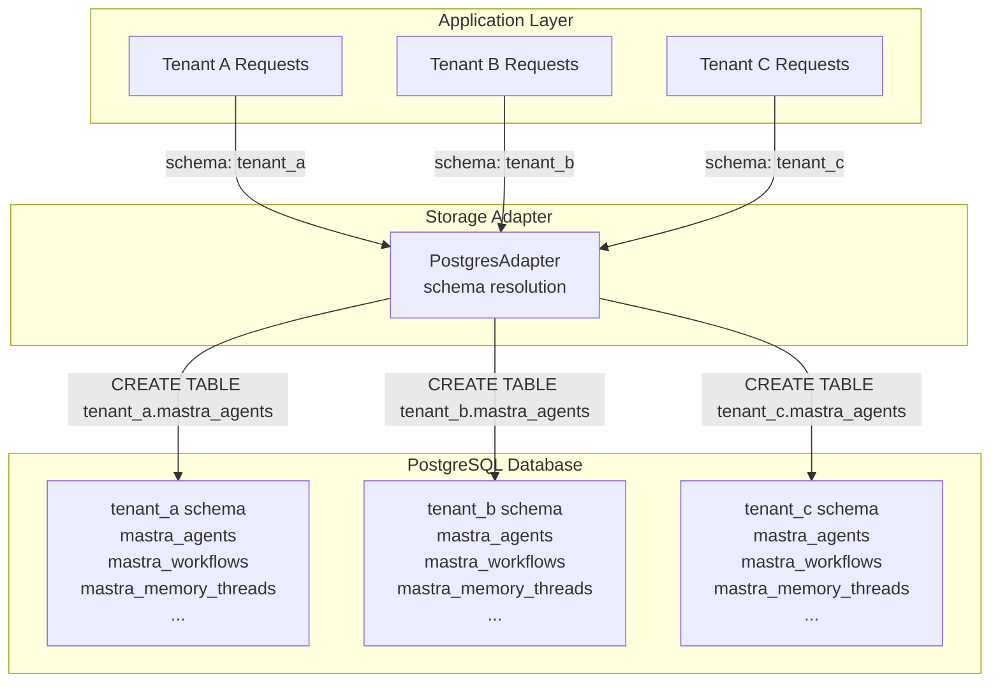
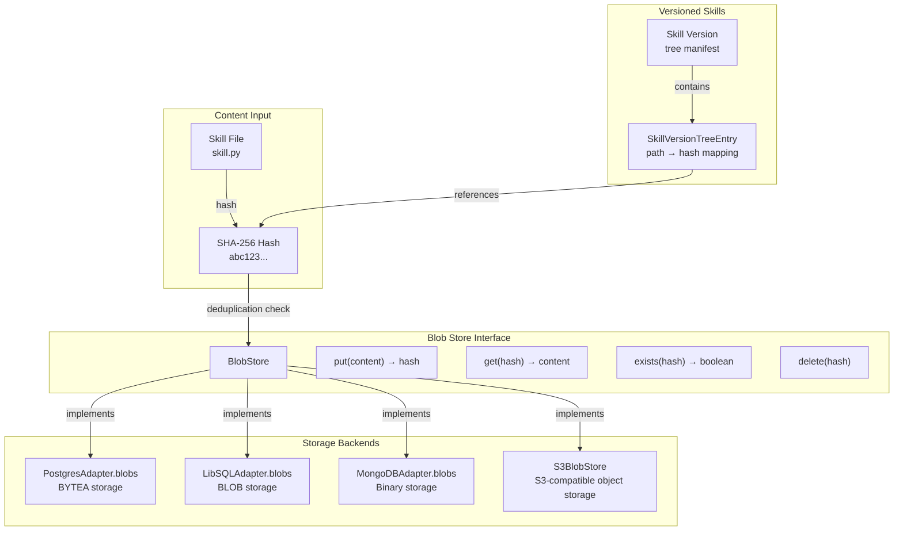
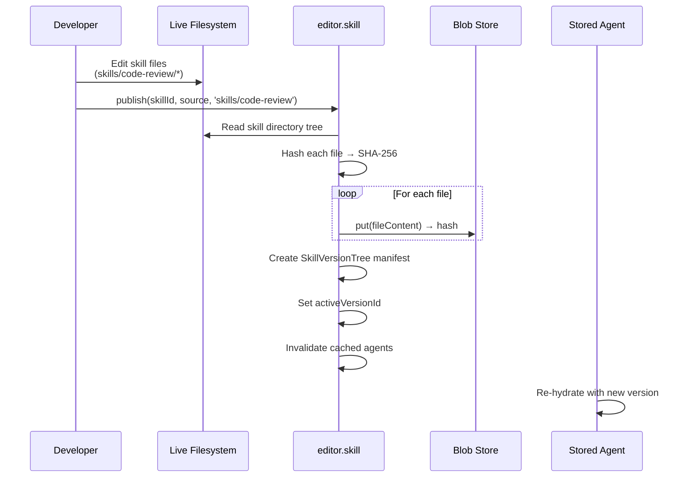

# Storage Domain Architecture

<details>
<summary>Relevant source files</summary>

The following files were used as context for generating this wiki page:

- [packages/agent-builder/integration-tests/.gitignore](packages/agent-builder/integration-tests/.gitignore)
- [packages/agent-builder/integration-tests/README.md](packages/agent-builder/integration-tests/README.md)
- [packages/agent-builder/integration-tests/docker-compose.yml](packages/agent-builder/integration-tests/docker-compose.yml)
- [packages/agent-builder/integration-tests/src/fixtures/minimal-mastra-project/.gitignore](packages/agent-builder/integration-tests/src/fixtures/minimal-mastra-project/.gitignore)
- [packages/agent-builder/integration-tests/src/fixtures/minimal-mastra-project/env.example](packages/agent-builder/integration-tests/src/fixtures/minimal-mastra-project/env.example)
- [packages/core/src/memory/memory.ts](packages/core/src/memory/memory.ts)
- [packages/core/src/memory/types.ts](packages/core/src/memory/types.ts)
- [packages/memory/integration-tests/docker-compose.yml](packages/memory/integration-tests/docker-compose.yml)
- [packages/memory/integration-tests/src/agent-memory.test.ts](packages/memory/integration-tests/src/agent-memory.test.ts)
- [packages/memory/integration-tests/src/processors.test.ts](packages/memory/integration-tests/src/processors.test.ts)
- [packages/memory/integration-tests/src/streaming-memory.test.ts](packages/memory/integration-tests/src/streaming-memory.test.ts)
- [packages/memory/integration-tests/src/test-utils.ts](packages/memory/integration-tests/src/test-utils.ts)
- [packages/memory/integration-tests/src/with-libsql-storage.test.ts](packages/memory/integration-tests/src/with-libsql-storage.test.ts)
- [packages/memory/integration-tests/src/with-pg-storage.test.ts](packages/memory/integration-tests/src/with-pg-storage.test.ts)
- [packages/memory/integration-tests/src/with-upstash-storage.test.ts](packages/memory/integration-tests/src/with-upstash-storage.test.ts)
- [packages/memory/integration-tests/src/worker/generic-memory-worker.ts](packages/memory/integration-tests/src/worker/generic-memory-worker.ts)
- [packages/memory/integration-tests/src/working-memory.test.ts](packages/memory/integration-tests/src/working-memory.test.ts)
- [packages/memory/integration-tests/vitest.config.ts](packages/memory/integration-tests/vitest.config.ts)
- [packages/memory/src/index.test.ts](packages/memory/src/index.test.ts)
- [packages/memory/src/index.ts](packages/memory/src/index.ts)
- [packages/memory/src/tools/working-memory.ts](packages/memory/src/tools/working-memory.ts)

</details>

## Purpose and Scope

This document describes Mastra's storage domain architecture, which provides a unified abstraction layer for persisting framework data across multiple backends. The storage system organizes data into 12 distinct domains (Memory, Agent, Workflow, Dataset, Workspace, MCP, Blob, Scorer Definitions, Prompt Blocks, and Experiments), each with domain-specific operations and versioning semantics.

For storage provider implementations (PostgreSQL, LibSQL, MongoDB, etc.), see sections [7.4](#7.4), [7.5](#7.5). For memory-specific storage patterns, see [7.1](#7.1) and [7.2](#7.2). For vector storage, see [7.6](#7.6).

---

## Composite Store Architecture

The `MastraCompositeStore` interface serves as the central abstraction for all storage operations in Mastra. It aggregates multiple domain-specific storage interfaces under a single entry point, allowing applications to access any domain through a consistent API.

**MastraCompositeStore Domain Access Pattern**

```mermaid
graph TB
    subgraph "Application Layer"
        App["Application Code"]
        MemoryInst["Memory Instance"]
        AgentInst["Agent Instance"]
        WorkflowInst["Workflow Instance"]
    end

    subgraph "Storage Abstraction"
        CompositeStore["MastraCompositeStore"]
        MemoryDomain["memory<br/>threads, messages,<br/>om_records tables"]
        AgentDomain["agents<br/>mastra_agents,<br/>mastra_agent_versions"]
        WorkflowDomain["workflows<br/>mastra_workflow_snapshot"]
        DatasetDomain["datasets<br/>mastra_datasets,<br/>mastra_dataset_items"]
        WorkspaceDomain["workspaces<br/>mastra_workspaces,<br/>mastra_workspace_versions"]
        MCPDomain["mcpClients<br/>mastra_mcp_clients,<br/>mastra_mcp_client_versions"]
        BlobDomain["blobs<br/>mastra_skill_blobs"]
        ScorerDomain["scorerDefinitions<br/>mastra_scorer_definitions,<br/>mastra_scorer_versions"]
        PromptDomain["promptBlocks<br/>mastra_prompt_blocks,<br/>mastra_prompt_versions"]
        SkillDomain["skills<br/>mastra_skills,<br/>mastra_skill_versions"]
        ExperimentDomain["experiments<br/>mastra_experiments,<br/>mastra_experiment_runs"]
    end

    subgraph "Storage Adapters"
        PG["@mastra/pg<br/>PostgresAdapter<br/>PgVector"]
        LibSQL["@mastra/libsql<br/>LibSQLAdapter"]
        Upstash["@mastra/upstash<br/>UpstashAdapter"]
    end

    App -->|"storage.memory"| CompositeStore
    MemoryInst -->|"storage.memory"| CompositeStore
    AgentInst -->|"storage.agents"| CompositeStore
    WorkflowInst -->|"storage.workflows"| CompositeStore

    CompositeStore -->|"memory"| MemoryDomain
    CompositeStore -->|"agents"| AgentDomain
    CompositeStore -->|"workflows"| WorkflowDomain
    CompositeStore -->|"datasets"| DatasetDomain
    CompositeStore -->|"workspaces"| WorkspaceDomain
    CompositeStore -->|"mcpClients"| MCPDomain
    CompositeStore -->|"blobs"| BlobDomain
    CompositeStore -->|"scorerDefinitions"| ScorerDomain
    CompositeStore -->|"promptBlocks"| PromptDomain
    CompositeStore -->|"skills"| SkillDomain
    CompositeStore -->|"experiments"| ExperimentDomain

    MemoryDomain -.implements.-> PG
    AgentDomain -.implements.-> PG
    WorkflowDomain -.implements.-> PG
    DatasetDomain -.implements.-> PG
    WorkspaceDomain -.implements.-> PG
    MCPDomain -.implements.-> PG
    BlobDomain -.implements.-> PG
    ScorerDomain -.implements.-> PG
    PromptDomain -.implements.-> PG
    SkillDomain -.implements.-> PG
    ExperimentDomain -.implements.-> PG

    MemoryDomain -.implements.-> LibSQL
    AgentDomain -.implements.-> LibSQL
    WorkflowDomain -.implements.-> LibSQL
    BlobDomain -.implements.-> LibSQL

    MemoryDomain -.implements.-> Upstash
    AgentDomain -.implements.-> Upstash
```



Sources: [stores/pg/CHANGELOG.md:7-28](), [stores/pg/CHANGELOG.md:129-160](), [stores/upstash/package.json:1-68](), [packages/memory/CHANGELOG.md:1-27]()

The composite store pattern enables:

| Capability               | Description                                                                   |
| ------------------------ | ----------------------------------------------------------------------------- |
| **Domain Isolation**     | Each domain manages its own tables, indexes, and business logic independently |
| **Pluggable Backends**   | Applications swap storage adapters without changing domain access patterns    |
| **Incremental Adoption** | Not all adapters must implement all domains (e.g., vector-only stores)        |
| **Multi-Tenancy**        | PostgreSQL adapter supports schema-based tenant isolation across all domains  |

---

## Storage Domain Types

Mastra organizes storage into 11 distinct domains, each with domain-specific data models and operations.

**Domain Classification and Responsibilities**



Sources: [stores/pg/CHANGELOG.md:7-28](), [stores/pg/CHANGELOG.md:129-160](), [stores/pg/CHANGELOG.md:271-296]()

### Domain-Specific Characteristics

| Domain                | Primary Entities              | Versioning Strategy                  | Key Storage Tables                                             |
| --------------------- | ----------------------------- | ------------------------------------ | -------------------------------------------------------------- |
| **memory**            | Threads, Messages, OM Records | None (mutable)                       | `threads`, `messages`, `om_records`                            |
| **agents**            | Agent configurations          | Draft/publish with `activeVersionId` | `mastra_agents`, `mastra_agent_versions`                       |
| **workflows**         | Workflow runs, state          | Snapshots per run                    | `mastra_workflow_snapshot`                                     |
| **datasets**          | Dataset items                 | SCD-2 (Slowly Changing Dimensions)   | `mastra_datasets`, `mastra_dataset_items`                      |
| **workspaces**        | Workspace configs             | Draft/publish with `activeVersionId` | `mastra_workspaces`, `mastra_workspace_versions`               |
| **mcpClients**        | MCP server configs            | Draft/publish with `activeVersionId` | `mastra_mcp_clients`, `mastra_mcp_client_versions`             |
| **blobs**             | Content blobs                 | Content-addressed (SHA-256)          | `mastra_skill_blobs`                                           |
| **scorerDefinitions** | Scorer configs                | Draft/publish with `activeVersionId` | `mastra_scorer_definitions`, `mastra_scorer_versions`          |
| **promptBlocks**      | Prompt templates              | Draft/publish with `activeVersionId` | `mastra_prompt_blocks`, `mastra_prompt_versions`               |
| **experiments**       | Experiment runs               | Append-only                          | `mastra_experiments`, `mastra_experiment_runs`                 |
| **skills**            | Skill definitions             | Filesystem + blob versioning         | `mastra_skills`, `mastra_skill_versions`, `mastra_skill_blobs` |

Sources: [stores/pg/CHANGELOG.md:7-28](), [stores/pg/CHANGELOG.md:129-160](), [stores/pg/CHANGELOG.md:271-296]()

---

## Versioned Storage Domain API

The `VersionedStorageDomain` interface provides a generic API for managing versioned entities (agents, scorers, prompt blocks, MCP clients, workspaces, skills). All versioned domains implement the same method signatures, enabling consistent CRUD and version management patterns.

**VersionedStorageDomain Method Structure**



Sources: [stores/pg/CHANGELOG.md:241-269](), [stores/pg/CHANGELOG.md:271-296]()

### Draft/Publish Workflow

Versioned domains follow a draft-to-publish lifecycle:



Sources: [stores/pg/CHANGELOG.md:119-149]()

**Status Resolution Semantics**

| Query                              | Returns                            | Use Case                | Resolves To                         |
| ---------------------------------- | ---------------------------------- | ----------------------- | ----------------------------------- |
| `getById(id)`                      | Active published version           | Runtime execution       | Row where `id = activeVersionId`    |
| `getById(id, { status: 'draft' })` | Latest unpublished version         | Editor UI               | Row with highest `version_number`   |
| `list()`                           | Entities with published versions   | Default runtime listing | Joins on `activeVersionId`          |
| `list({ status: 'draft' })`        | Entities with unpublished changes  | Editor drafts view      | Latest version per entity           |
| `list({ status: 'published' })`    | Only entities with active versions | Production filtering    | Where `activeVersionId IS NOT NULL` |
| `list({ status: 'archived' })`     | Archived entities                  | History/audit           | Where `status = 'archived'`         |

Sources: [stores/pg/CHANGELOG.md:241-269](), [stores/pg/CHANGELOG.md:271-296]()

### Generic vs Entity-Specific Methods

All storage adapters use generic `VersionedStorageDomain` methods for consistent CRUD operations:

| Operation        | Method Signature                       | Example                                                  |
| ---------------- | -------------------------------------- | -------------------------------------------------------- |
| Create           | `store.create(input)`                  | `storage.agents.create({ agent: input })`                |
| Get by ID        | `store.getById(id, options?)`          | `storage.agents.getById('agent-1', { status: 'draft' })` |
| Update           | `store.update(id, updates)`            | `storage.agents.update('agent-1', { name: 'New Name' })` |
| Delete           | `store.delete(id)`                     | `storage.agents.delete('agent-1')`                       |
| List             | `store.list(options?)`                 | `storage.agents.list({ status: 'published' })`           |
| List Versions    | `store.listVersions(id)`               | `storage.agents.listVersions('agent-1')`                 |
| Activate Version | `store.activateVersion(id, versionId)` | `storage.agents.activateVersion('agent-1', 'v2')`        |

Sources: [stores/pg/CHANGELOG.md:241-269](), [stores/pg/CHANGELOG.md:271-296]()

This unification enables:

- Generic editor code that works across all versioned domains
- Consistent version management APIs for all entity types
- Type-safe domain access through `storage.getStore('agents')` pattern

---

## Multi-Schema Support

The PostgreSQL adapter implements multi-schema support for tenant isolation. Each tenant's data resides in a separate PostgreSQL schema, enabling:

**Multi-Schema Isolation Pattern**



Sources: [stores/pg/CHANGELOG.md:479-490]()

### Schema-Prefixed Constraints

PostgreSQL enforces a 63-byte limit on identifiers. Multi-schema setups require schema-prefixed constraint names, which the adapter automatically truncates:

| Constraint Type  | Naming Pattern                     | Example                                            |
| ---------------- | ---------------------------------- | -------------------------------------------------- |
| Primary Key      | `{schema}__{table}__pk`            | `tenant_a__mastra_agents__pk`                      |
| Foreign Key      | `{schema}__{table}__{column}_fk`   | `tenant_a__mastra_agent_versions__agent_id_fk`     |
| Index            | `{schema}__{table}__{columns}_idx` | `tenant_a__mastra_memory_threads__resource_id_idx` |
| Check Constraint | `{schema}__{table}__{field}_check` | `tenant_a__mastra_workflows__status_check`         |

If a schema-prefixed constraint name exceeds 63 bytes, the adapter truncates it while preserving uniqueness through hash suffixes.

Sources: [stores/pg/CHANGELOG.md:483-488]()

**Cross-Schema Constraint Handling**

In multi-schema setups, foreign key constraints and indexes must reference tables within the same schema. The adapter ensures all DDL statements (CREATE TABLE, CREATE INDEX, ALTER TABLE) include schema prefixes to avoid cross-schema errors.

Sources: [stores/pg/CHANGELOG.md:483-484]()

---

## Content-Addressed Blob Storage

The **Blob Domain** provides content-addressed storage keyed by SHA-256 hashes, enabling deduplication and immutable versioning for filesystem-based content (skills, documents, attachments).

**Blob Storage Architecture**



Sources: [stores/pg/CHANGELOG.md:36-90]()

### Blob Store Implementations

| Implementation          | Backend                         | Table Schema         | Deduplication         | Max Blob Size     | Use Case                    |
| ----------------------- | ------------------------------- | -------------------- | --------------------- | ----------------- | --------------------------- |
| `PostgresAdapter.blobs` | PostgreSQL BYTEA                | `mastra_skill_blobs` | Automatic via SHA-256 | 1GB (recommended) | Single-database deployments |
| `LibSQLAdapter.blobs`   | SQLite BLOB                     | `mastra_skill_blobs` | Automatic via SHA-256 | Limited by SQLite | Edge deployments            |
| `S3BlobStore`           | S3/R2/MinIO/DigitalOcean Spaces | S3 object keys       | Automatic via SHA-256 | 5TB               | Large-scale production      |
| `InMemoryBlobStore`     | In-memory Map                   | Memory only          | Automatic via SHA-256 | Process memory    | Testing                     |

Sources: [stores/pg/CHANGELOG.md:159-240](), [stores/pg/CHANGELOG.md:271-296]()

### Filesystem-Native Skill Versioning

Skills use blob storage to implement a draft-to-publish workflow where the editing surface (live filesystem) is separated from the serving surface (versioned blob store):



Sources: [stores/pg/CHANGELOG.md:36-90]()

**Skill Resolution Strategies**

Agents reference skills with three resolution strategies:

| Strategy             | Behavior                                           | Version Stability | Use Case                            |
| -------------------- | -------------------------------------------------- | ----------------- | ----------------------------------- |
| `strategy: 'latest'` | Resolves active version (honors `activeVersionId`) | Follows publishes | Default production use              |
| `pin: '<versionId>'` | Resolves specific version                          | Immutable         | Version pinning for reproducibility |
| `strategy: 'live'`   | Reads directly from live filesystem                | Unstable          | Development/testing                 |

Sources: [stores/pg/CHANGELOG.md:36-90]()

---

## Storage Adapter Implementations

Mastra provides storage adapters for multiple backends. Each adapter implements a subset of domains based on backend capabilities.

**Adapter Domain Support Matrix**

| Adapter           | memory | agents | workflows | datasets | workspaces | mcpClients | blobs | scorers | prompts | experiments | skills |
| ----------------- | ------ | ------ | --------- | -------- | ---------- | ---------- | ----- | ------- | ------- | ----------- | ------ |
| `@mastra/pg`      | ✅     | ✅     | ✅        | ✅       | ✅         | ✅         | ✅    | ✅      | ✅      | ✅          | ✅     |
| `@mastra/libsql`  | ✅     | ✅     | ✅        | ✅       | ✅         | ✅         | ✅    | ✅      | ✅      | ✅          | ✅     |
| `@mastra/upstash` | ✅     | ✅     | ❌        | ❌       | ❌         | ❌         | ❌    | ❌      | ❌      | ❌          | ❌     |

**Key differences:**

- `@mastra/pg`: Full-featured relational storage with pgvector extension for semantic search
- `@mastra/libsql`: Lightweight SQL storage compatible with Turso edge databases
- `@mastra/upstash`: Redis-based storage with vector search for serverless deployments

Sources: [stores/pg/package.json:1-75](), [stores/upstash/package.json:1-68]()

### Adapter Selection Criteria

| Factor                  | PostgreSQL (`@mastra/pg`)    | LibSQL (`@mastra/libsql`)   | Upstash (`@mastra/upstash`)         |
| ----------------------- | ---------------------------- | --------------------------- | ----------------------------------- |
| **Best For**            | Production, multi-tenant     | Edge, embedded              | Serverless, Redis-based             |
| **Schema Isolation**    | Multi-schema support         | Single database             | Redis namespacing                   |
| **Blob Storage**        | `mastra_skill_blobs` (BYTEA) | `mastra_skill_blobs` (BLOB) | Not supported                       |
| **Vector Support**      | `pgvector` extension         | Not supported               | `@upstash/vector`                   |
| **Transaction Support** | Full ACID                    | Full ACID                   | Redis transactions                  |
| **Dependencies**        | `pg` package                 | `@libsql/client`            | `@upstash/redis`, `@upstash/vector` |
| **Deployment**          | Self-hosted, Neon, Supabase  | Self-hosted, Turso          | Upstash Cloud                       |

Sources: [stores/pg/package.json:36-75](), [stores/upstash/package.json:31-34]()

### Storage Provider Configuration

Storage adapters are configured at Mastra instantiation:

```typescript
import { Mastra } from '@mastra/core'
import { PostgresAdapter } from '@mastra/pg'
import { LibSQLAdapter } from '@mastra/libsql'
import { MongoDBAdapter } from '@mastra/mongodb'

// PostgreSQL with multi-schema support
const mastra = new Mastra({
  storage: new PostgresAdapter({
    connectionString: process.env.DATABASE_URL,
    schema: 'tenant_123', // Optional: for multi-tenancy
  }),
})

// LibSQL for edge deployments
const mastra = new Mastra({
  storage: new LibSQLAdapter({
    url: 'file:./mastra.db',
  }),
})

// MongoDB for document-oriented workloads
const mastra = new Mastra({
  storage: new MongoDBAdapter({
    uri: process.env.MONGODB_URI,
    database: 'mastra',
  }),
})
```

Applications can swap adapters without changing domain access patterns:

```typescript
// Domain access is adapter-agnostic
await storage.agents.create({ agent: agentConfig })
await storage.memory.threads.create({ threadId, resourceId })
await storage.workspaces.create({ workspace: workspaceConfig })
```

Sources: [stores/pg/CHANGELOG.md:322-447](), [stores/pg/package.json:36-75]()

---

## Domain-Specific Schema Examples

Each domain defines its own table schema, indexes, and constraints. The following examples illustrate schema patterns across different domains.

**Agent Domain Schema (PostgreSQL)**

```sql
-- Main entity table
CREATE TABLE mastra_agents (
  id TEXT PRIMARY KEY,
  name TEXT NOT NULL,
  created_at TIMESTAMPTZ DEFAULT NOW(),
  updated_at TIMESTAMPTZ DEFAULT NOW(),
  active_version_id TEXT,
  status TEXT CHECK (status IN ('draft', 'published', 'archived'))
);

-- Version snapshots table
CREATE TABLE mastra_agent_versions (
  id TEXT PRIMARY KEY,
  agent_id TEXT NOT NULL REFERENCES mastra_agents(id) ON DELETE CASCADE,
  version_number INTEGER NOT NULL,
  model JSONB NOT NULL,
  instructions JSONB,
  tools JSONB,
  workspace JSONB,
  skills JSONB,
  skills_format TEXT,
  mcp_clients JSONB,
  request_context_schema JSONB,
  processor_graph JSONB,
  created_at TIMESTAMPTZ DEFAULT NOW(),
  UNIQUE(agent_id, version_number)
);

-- Indexes for efficient lookups
CREATE INDEX idx_agent_versions_agent_id ON mastra_agent_versions(agent_id);
CREATE INDEX idx_agents_status ON mastra_agents(status);
CREATE INDEX idx_agents_active_version ON mastra_agents(active_version_id);
```

Sources: [stores/pg/CHANGELOG.md:271-296](), [stores/pg/CHANGELOG.md:129-160]()

**Blob Domain Schema (PostgreSQL)**

```sql
CREATE TABLE mastra_skill_blobs (
  hash TEXT PRIMARY KEY,  -- SHA-256 hash
  content BYTEA NOT NULL,
  size INTEGER NOT NULL,
  created_at TIMESTAMPTZ DEFAULT NOW()
);

CREATE INDEX idx_skill_blobs_size ON mastra_skill_blobs(size);
```

Sources: [stores/pg/CHANGELOG.md:36-90]()

**Observational Memory Schema (PostgreSQL)**

```sql
CREATE TABLE om_records (
  thread_id TEXT NOT NULL,
  resource_id TEXT,
  cycle_id INTEGER NOT NULL,
  observations TEXT[],
  reflections TEXT[],
  tokens_messages INTEGER NOT NULL,
  tokens_observations INTEGER NOT NULL,
  tokens_reflections INTEGER NOT NULL,
  suggested_continuation TEXT,
  current_task TEXT,
  created_at TIMESTAMPTZ DEFAULT NOW(),
  PRIMARY KEY (thread_id, resource_id, cycle_id)
);

-- Index for efficient retrieval by thread/resource
CREATE INDEX idx_om_records_thread_resource ON om_records(thread_id, resource_id);

-- Index for cloning support
CREATE INDEX idx_om_records_lookup ON om_records(thread_id, resource_id, cycle_id);
```

Sources: [stores/pg/CHANGELOG.md:7-28](), [packages/memory/CHANGELOG.md:7]()

**Dataset Domain Schema (PostgreSQL)**

```sql
-- Dataset metadata
CREATE TABLE mastra_datasets (
  id TEXT PRIMARY KEY,
  name TEXT NOT NULL,
  description TEXT,
  input_schema JSONB,
  ground_truth_schema JSONB,
  created_at TIMESTAMPTZ DEFAULT NOW(),
  updated_at TIMESTAMPTZ DEFAULT NOW()
);

-- Dataset items with SCD-2 versioning
CREATE TABLE mastra_dataset_items (
  id TEXT PRIMARY KEY,
  dataset_id TEXT NOT NULL REFERENCES mastra_datasets(id) ON DELETE CASCADE,
  input JSONB NOT NULL,
  ground_truth JSONB,
  valid_from TIMESTAMPTZ DEFAULT NOW(),
  valid_to TIMESTAMPTZ,
  is_current BOOLEAN DEFAULT TRUE,
  version INTEGER NOT NULL,
  UNIQUE(dataset_id, id, version)
);

-- SCD-2 (Slowly Changing Dimensions Type 2) index
-- Efficiently finds current version of each item
CREATE INDEX idx_dataset_items_current ON mastra_dataset_items(dataset_id, id)
  WHERE is_current = TRUE;

-- Ordering index to prevent non-deterministic results
CREATE INDEX idx_dataset_items_order ON mastra_dataset_items(dataset_id, id, created_at);
```

Sources: [stores/pg/CHANGELOG.md:107-120](), [stores/pg/CHANGELOG.md:271-296]()

---

## Conclusion

The storage domain architecture provides a flexible, pluggable foundation for persisting Mastra framework data. Key design principles include:

1. **Domain Isolation**: Each domain manages its own data model and business logic
2. **Unified API**: `VersionedStorageDomain` interface standardizes CRUD and version management
3. **Multi-Tenancy**: PostgreSQL schema-based isolation for tenant data separation
4. **Content-Addressed Storage**: Blob domain enables deduplication and immutable versioning
5. **Pluggable Backends**: Applications swap storage adapters without code changes

This architecture enables Mastra to support diverse deployment patterns—from edge SQLite databases to multi-tenant PostgreSQL clusters—while maintaining consistent domain access semantics across all storage backends.

Sources: [stores/pg/CHANGELOG.md:1-490](), [packages/memory/CHANGELOG.md:1-100](), [packages/rag/CHANGELOG.md:1-100]()
