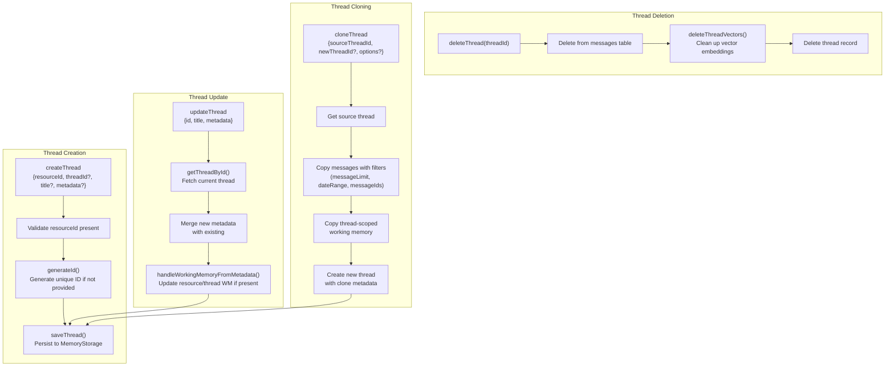
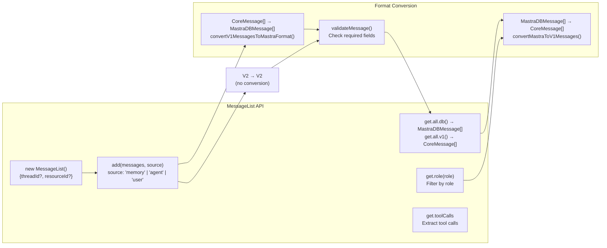
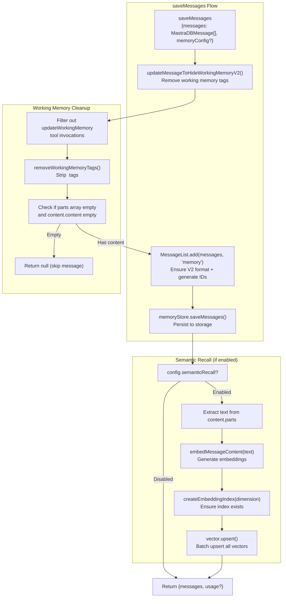
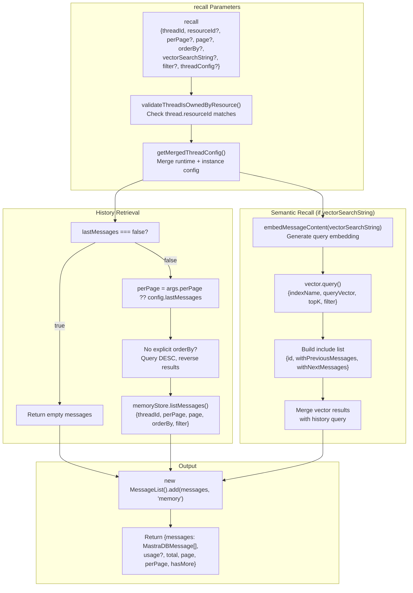
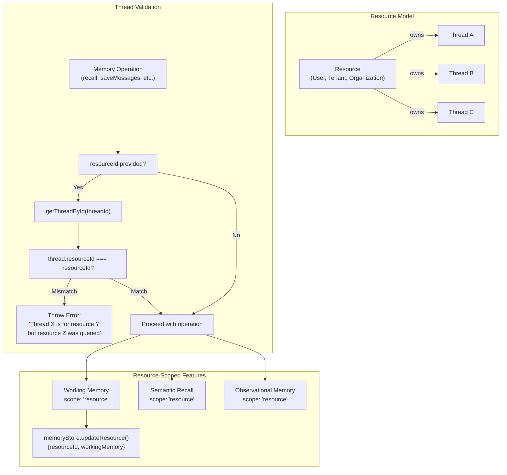
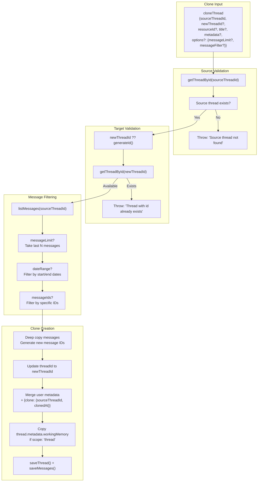

# Thread Management and Message Storage

<details>
<summary>Relevant source files</summary>

The following files were used as context for generating this wiki page:

- [packages/agent-builder/integration-tests/.gitignore](packages/agent-builder/integration-tests/.gitignore)
- [packages/agent-builder/integration-tests/README.md](packages/agent-builder/integration-tests/README.md)
- [packages/agent-builder/integration-tests/docker-compose.yml](packages/agent-builder/integration-tests/docker-compose.yml)
- [packages/agent-builder/integration-tests/src/fixtures/minimal-mastra-project/.gitignore](packages/agent-builder/integration-tests/src/fixtures/minimal-mastra-project/.gitignore)
- [packages/agent-builder/integration-tests/src/fixtures/minimal-mastra-project/env.example](packages/agent-builder/integration-tests/src/fixtures/minimal-mastra-project/env.example)
- [packages/core/src/memory/memory.ts](packages/core/src/memory/memory.ts)
- [packages/core/src/memory/types.ts](packages/core/src/memory/types.ts)
- [packages/memory/integration-tests/docker-compose.yml](packages/memory/integration-tests/docker-compose.yml)
- [packages/memory/integration-tests/src/agent-memory.test.ts](packages/memory/integration-tests/src/agent-memory.test.ts)
- [packages/memory/integration-tests/src/processors.test.ts](packages/memory/integration-tests/src/processors.test.ts)
- [packages/memory/integration-tests/src/streaming-memory.test.ts](packages/memory/integration-tests/src/streaming-memory.test.ts)
- [packages/memory/integration-tests/src/test-utils.ts](packages/memory/integration-tests/src/test-utils.ts)
- [packages/memory/integration-tests/src/with-libsql-storage.test.ts](packages/memory/integration-tests/src/with-libsql-storage.test.ts)
- [packages/memory/integration-tests/src/with-pg-storage.test.ts](packages/memory/integration-tests/src/with-pg-storage.test.ts)
- [packages/memory/integration-tests/src/with-upstash-storage.test.ts](packages/memory/integration-tests/src/with-upstash-storage.test.ts)
- [packages/memory/integration-tests/src/worker/generic-memory-worker.ts](packages/memory/integration-tests/src/worker/generic-memory-worker.ts)
- [packages/memory/integration-tests/src/working-memory.test.ts](packages/memory/integration-tests/src/working-memory.test.ts)
- [packages/memory/integration-tests/vitest.config.ts](packages/memory/integration-tests/vitest.config.ts)
- [packages/memory/src/index.test.ts](packages/memory/src/index.test.ts)
- [packages/memory/src/index.ts](packages/memory/src/index.ts)
- [packages/memory/src/tools/working-memory.ts](packages/memory/src/tools/working-memory.ts)

</details>

This page documents how Mastra Memory organizes conversations into threads and persists messages to storage. It covers thread lifecycle management, message storage and retrieval operations, and the MessageList abstraction that handles format conversions between different message representations.

For memory configuration and processor integration, see [Memory System Architecture](#7.1). For vector embeddings and semantic search, see [Vector Storage and Semantic Search](#7.6). For working memory that persists across threads, see [Working Memory and Tool Integration](#7.10).

---

## Thread Structure and Lifecycle

### Thread Data Model

Threads represent individual conversations owned by a resource (typically a user or tenant). Each thread maintains metadata, timestamps, and an optional title.

```typescript
type StorageThreadType = {
  id: string // Unique thread identifier
  title?: string // Optional display title
  resourceId: string // Owner resource ID (required)
  createdAt: Date // Thread creation timestamp
  updatedAt: Date // Last modification timestamp
  metadata?: Record<string, unknown> // Arbitrary metadata storage
}
```

**Thread Metadata Structure**:

- `workingMemory`: Thread-scoped working memory content (when `scope: 'thread'`)
- `mastra.om`: Observational memory metadata (current task, suggested response, last observed timestamp)
- `clone`: Clone metadata (sourceThreadId, clonedAt) when thread is cloned
- Custom fields: Application-specific data

Sources: [packages/core/src/memory/types.ts:38-45](), [packages/core/src/memory/types.ts:48-113]()

### Thread Lifecycle Operations



**Thread Creation Flow**:

1. User provides `resourceId` (required), optional `threadId`, `title`, and `metadata`
2. If `threadId` not provided, `generateId()` creates a unique ID via Mastra instance or `crypto.randomUUID()`
3. Thread object constructed with timestamps
4. `saveThread()` persists to storage and handles working memory metadata
5. Returns saved thread with generated/provided ID

**Thread Update Flow**:

1. `updateThread()` fetches existing thread by ID
2. Merges new `title` and `metadata` with existing values
3. If `metadata.workingMemory` is present and working memory enabled, calls `handleWorkingMemoryFromMetadata()`
4. For resource-scoped WM: Updates `resources` table
5. For thread-scoped WM: Updates `thread.metadata.workingMemory`
6. Returns updated thread

**Thread Deletion Flow**:

1. `deleteThread()` removes thread record from storage
2. Storage adapter cascades deletion to associated messages
3. If vector store configured, `deleteThreadVectors()` cleans up embeddings
4. Vectors deleted in batches across all memory indexes matching thread filter

**Thread Cloning**:

- Clones thread with all or filtered messages to new thread ID
- Options: `messageLimit` (last N messages), `messageFilter` (date range or message IDs)
- Preserves thread-scoped working memory in cloned thread metadata
- Adds clone metadata: `{ clone: { sourceThreadId, clonedAt } }`
- Can clone to different `resourceId` for cross-tenant sharing

Sources: [packages/core/src/memory/memory.ts:470-501](), [packages/memory/src/index.ts:350-400](), [packages/memory/src/index.ts:402-447](), [packages/memory/src/index.test.ts:270-661]()

---

## Message Storage and Format

### MastraDBMessage Format (V2)

Messages use the V2 format with a `parts` array for structured content representation. This format supports text, tool invocations, and attachments in a single message.

```typescript
type MastraDBMessage = {
  id: string
  role: 'user' | 'assistant' | 'system' | 'tool'
  threadId?: string
  resourceId?: string
  createdAt: Date
  content: {
    format: 2 // Version indicator
    content?: string // Legacy text field
    parts: Array<TextPart | ToolInvocationPart> // Structured content
    experimental_attachments?: Attachment[] // File attachments
  }
}
```

**Content Parts**:

- `TextPart`: `{ type: 'text', text: string }`
- `ToolInvocationPart`: `{ type: 'tool-invocation', toolInvocation: { state: 'call' | 'result', toolCallId, toolName, args, result? } }`

**Message Roles**:

- `user`: User input messages
- `assistant`: Agent responses (text + tool calls)
- `system`: System prompts (rarely stored)
- `tool`: Tool results (legacy, now in `ToolInvocationPart`)

Sources: [packages/core/src/agent/message-list.ts:40-51](), [packages/core/src/memory/types.ts:20-31]()

### MessageList: Format Conversion Abstraction

`MessageList` provides bidirectional conversion between storage format (V2) and AI SDK formats (V1/CoreMessage).



**Usage Pattern**:

```typescript
// Add messages from various sources
const list = new MessageList({ threadId, resourceId })
  .add(messagesFromMemory, 'memory') // Already V2 format
  .add(messagesFromAgent, 'agent') // V1 format, converted to V2
  .add(userMessages, 'user') // V1 format, converted to V2

// Retrieve in desired format
const dbMessages = list.get.all.db() // V2 for storage
const coreMessages = list.get.all.v1() // V1 for AI SDK
const userMessages = list.get.role('user').v1()
```

**Conversion Features**:

- Handles legacy V1 format (content as string/array)
- Normalizes tool calls into `tool-invocation` parts
- Preserves thread/resource IDs across conversions
- Generates message IDs if not present
- Filters out null/undefined messages

Sources: [packages/core/src/agent/message-list.ts:100-200](), [packages/memory/src/index.ts:774-780]()

---

## Message Storage Operations

### saveMessages: Persisting Conversation History



**Working Memory Stripping**:

- `updateMessageToHideWorkingMemoryV2()` removes working memory artifacts before storage
- Filters out `tool-invocation` parts where `toolName === 'updateWorkingMemory'`
- Removes `<working_memory>...</working_memory>` tags from text parts
- Drops messages where all parts filtered out and no `content.content` text
- Prevents pollution of conversation history with internal memory operations

**Message Validation**:

- Messages with empty `parts[]` but valid `content.content` are **preserved** (not dropped)
- Only drops when both `parts[]` empty and `content.content` empty/missing
- Fixes issue where legitimate messages were silently dropped

**Embedding Generation** (if semantic recall enabled):

- Extracts text from `content.content` and `content.parts[type='text']`
- Calls `embedMessageContent()` with concatenated text
- Chunks large content into ~4096 token chunks
- Caches embeddings by xxhash of content (avoids recomputation)
- Batches all embeddings into single `vector.upsert()` call
- Metadata includes `message_id`, `thread_id`, `resource_id` for filtering

Sources: [packages/memory/src/index.ts:759-867](), [packages/memory/src/index.ts:869-912](), [packages/memory/src/index.test.ts:131-172](), [packages/memory/src/index.test.ts:205-268]()

### recall: Retrieving Messages with Filtering



**Pagination and Ordering**:

- `perPage`: Number of messages per page (or `false` to fetch all)
- `page`: Zero-indexed page number
- Default `perPage` comes from `config.lastMessages` if not explicitly provided
- When `lastMessages: false` and no explicit `perPage`, returns empty messages (history disabled)
- **Order reversal fix**: When querying with limit but no explicit `orderBy`, queries DESC (newest first), then reverses results to restore chronological order
  - Without this, `lastMessages: 64` returned the _oldest_ 64 messages instead of the _last_ 64
  - Explicit `orderBy` parameter bypasses this logic

**Semantic Recall Integration**:

- If `vectorSearchString` provided and `config.semanticRecall` enabled:
  1. Embed search string into query vector
  2. Query vector store with `topK`, `threshold`, and scope filter
  3. Build `include` list with `messageRange` (surrounding context)
  4. Storage layer fetches semantic results + specified surrounding messages
  5. Merges with history query results

**Resource vs Thread Scoping**:

- `scope: 'thread'`: Filters vectors by `thread_id` (default for semantic recall)
- `scope: 'resource'`: Filters vectors by `resource_id` (searches across all threads)
- Throws error if resource-scoped but no `resourceId` provided

**Filter Options**:

- `dateRange`: `{ start?, end?, startExclusive?, endExclusive? }`
- `include`: Array of specific message IDs with surrounding context

Sources: [packages/memory/src/index.ts:151-312](), [packages/memory/integration-tests/src/with-libsql-storage.test.ts:60-123]()

---

## Thread and Message Listing

### listThreads: Query Threads with Filtering

```typescript
async listThreads(args: {
  filter?: {
    resourceId?: string;                     // Optional resource filter
    metadata?: Record<string, unknown>;      // Metadata key-value pairs (AND logic)
  };
  page?: number;                             // Zero-indexed page number
  perPage?: number | false;                  // Items per page (false = all)
  orderBy?: {
    field?: 'createdAt' | 'updatedAt';      // Sort field
    direction?: 'ASC' | 'DESC';             // Sort direction
  };
}): Promise<{
  threads: StorageThreadType[];
  total: number;
  page: number;
  perPage: number | false;
  hasMore: boolean;
}>
```

**Filtering Behavior**:

- **Optional resourceId**: Unlike message operations, thread listing doesn't require `resourceId`
- **Metadata filtering**: Uses AND logic - all key-value pairs must match
- **No filter**: Returns all threads across all resources (use with caution in multi-tenant apps)

**Pagination**:

- `page: 0` = first page, `page: 1` = second page, etc.
- `perPage: false` = fetch all threads (no limit)
- Returns `hasMore: true` if additional pages available

Sources: [packages/core/src/memory/memory.ts:386-417](), [packages/memory/src/index.ts:319-322]()

### listMessagesByResourceId: Cross-Thread Message Query

```typescript
async listMessagesByResourceId(args: {
  resourceId: string;                        // Required resource ID
  perPage?: number | false;
  page?: number;
  orderBy?: { field?: 'createdAt'; direction?: 'ASC' | 'DESC' };
  filter?: {
    dateRange?: {
      start?: Date;
      end?: Date;
      startExclusive?: boolean;
      endExclusive?: boolean;
    };
  };
  include?: Array<{
    id: string;                              // Message ID to include
    threadId?: string;                       // Optional thread context
    withPreviousMessages?: number;           // N messages before
    withNextMessages?: number;               // N messages after
  }>;
}): Promise<{
  messages: MastraDBMessage[];
  total: number;
  page: number;
  perPage: number | false;
  hasMore: boolean;
}>
```

**Use Cases**:

- Fetch all messages for a resource across threads
- Build user activity timeline
- Export conversation data
- Audit message history

**Include Mechanism**:

- Ensures specific messages are in results even if outside pagination window
- Fetches surrounding context for each included message
- Useful for semantic recall results that need context

Sources: [packages/memory/src/index.ts:106-128]()

---

## Resource and Thread Ownership

### Resource-Based Isolation



**Ownership Validation**:

- `validateThreadIsOwnedByResource()` called at start of operations that modify or read sensitive data
- Fetches thread by ID and checks `thread.resourceId === requestedResourceId`
- Prevents cross-tenant data access in multi-tenant applications
- Throws descriptive error if mismatch detected

**Resource-Scoped vs Thread-Scoped**:

| Feature              | Thread-Scoped                             | Resource-Scoped                            |
| -------------------- | ----------------------------------------- | ------------------------------------------ |
| Working Memory       | Stored in `thread.metadata.workingMemory` | Stored in `resources.workingMemory`        |
| Semantic Recall      | Searches vectors filtered by `thread_id`  | Searches vectors filtered by `resource_id` |
| Observational Memory | Observations per thread                   | Observations across all threads            |
| Use Case             | Isolated conversations                    | Persistent user profile                    |

**Resource Table**:

- Separate table for resource-level data: `memoryStore.getResourceById({ resourceId })`
- Fields: `id`, `workingMemory`, custom metadata
- Updated via `memoryStore.updateResource({ resourceId, workingMemory })`

Sources: [packages/memory/src/index.ts:130-149](), [packages/memory/src/index.ts:324-348](), [packages/memory/src/index.ts:449-511]()

---

## Storage Domain Integration

### MemoryStorage Interface

Memory operations delegate to the `MemoryStorage` domain of `MastraCompositeStore`:

```typescript
interface MemoryStorage {
  // Thread operations
  getThreadById({ threadId }: { threadId: string }): Promise<StorageThreadType | null>;
  saveThread({ thread }: { thread: StorageThreadType }): Promise<StorageThreadType>;
  updateThread({ id, title, metadata }): Promise<StorageThreadType>;
  deleteThread({ threadId }: { threadId: string }): Promise<void>;
  listThreads(args: StorageListThreadsInput): Promise<StorageListThreadsOutput>;
  cloneThread(args: StorageCloneThreadInput): Promise<StorageCloneThreadOutput>;

  // Message operations
  saveMessages({ messages }: { messages: MastraDBMessage[] }): Promise<{ messages: MastraDBMessage[] }>;
  listMessages(args: StorageListMessagesInput): Promise<{
    messages: MastraDBMessage[];
    total: number;
    page: number;
    perPage: number | false;
    hasMore: boolean;
  }>;
  listMessagesByResourceId(args): Promise<{ messages: MastraDBMessage[]; ... }>;
  deleteMessages(messageIds: MessageDeleteInput): Promise<void>;

  // Resource operations
  getResourceById({ resourceId }): Promise<{ id: string; workingMemory?: string } | null>;
  updateResource({ resourceId, workingMemory }): Promise<void>;
}
```

**Storage Adapter Retrieval**:

```typescript
protected async getMemoryStore(): Promise<MemoryStorage> {
  const store = await this.storage.getStore('memory');
  if (!store) {
    throw new Error(`Memory storage domain is not available on ${this.storage.constructor.name}`);
  }
  return store;
}
```

**Adapter Implementations**:

- `PostgresStore` ([@mastra/pg](#7.4)): PostgreSQL with pgvector
- `LibSQLStore` ([@mastra/libsql](#7.5)): SQLite-compatible (Turso, libSQL)
- `UpstashStore` ([@mastra/upstash](#7.5)): Redis-based with Upstash
- `InMemoryStore` ([@mastra/core](#7.3)): Non-persistent, for testing

Sources: [packages/core/src/storage/storage-domain.ts:80-150](), [packages/memory/src/index.ts:98-104]()

### Database Schema (PostgreSQL Example)

```sql
-- Threads table
CREATE TABLE IF NOT EXISTS threads (
  id TEXT PRIMARY KEY,
  resource_id TEXT NOT NULL,
  title TEXT,
  metadata JSONB DEFAULT '{}'::jsonb,
  created_at TIMESTAMPTZ DEFAULT NOW(),
  updated_at TIMESTAMPTZ DEFAULT NOW()
);
CREATE INDEX idx_threads_resource_id ON threads(resource_id);

-- Messages table
CREATE TABLE IF NOT EXISTS messages (
  id TEXT PRIMARY KEY,
  thread_id TEXT REFERENCES threads(id) ON DELETE CASCADE,
  resource_id TEXT,
  role TEXT NOT NULL,
  content JSONB NOT NULL,
  created_at TIMESTAMPTZ DEFAULT NOW()
);
CREATE INDEX idx_messages_thread_id ON messages(thread_id);
CREATE INDEX idx_messages_resource_id ON messages(resource_id);
CREATE INDEX idx_messages_created_at ON messages(created_at);

-- Resources table (for resource-scoped working memory)
CREATE TABLE IF NOT EXISTS resources (
  id TEXT PRIMARY KEY,
  working_memory TEXT,
  metadata JSONB DEFAULT '{}'::jsonb
);
```

**Index Strategy**:

- `resource_id` indexes for tenant isolation
- `created_at` index for temporal queries
- Cascade delete ensures messages deleted when thread deleted
- JSONB columns for flexible metadata storage

Sources: [packages/pg/src/pg.ts:150-300]()

---

## Thread Cloning

### Clone Operations and Options



**Message Filtering Options**:

| Option                     | Type       | Description                                    |
| -------------------------- | ---------- | ---------------------------------------------- |
| `messageLimit`             | `number`   | Include only the last N messages (most recent) |
| `messageFilter.startDate`  | `Date`     | Include messages after this date               |
| `messageFilter.endDate`    | `Date`     | Include messages before this date              |
| `messageFilter.messageIds` | `string[]` | Include only specific message IDs              |

**Clone Metadata**:

```typescript
{
  clone: {
    sourceThreadId: string;     // Original thread ID
    clonedAt: string;           // ISO timestamp
    clonedBy?: string;          // Optional user identifier
  },
  ...customMetadata             // User-provided metadata
}
```

**Working Memory Preservation**:

- Thread-scoped WM: Copied from `sourceThread.metadata.workingMemory` to cloned thread
- Resource-scoped WM: Not copied (belongs to resource, not thread)
- Allows cloning conversational context without cross-resource data leakage

**Cross-Resource Cloning**:

```typescript
// Clone thread to different resource (e.g., sharing conversation template)
await memory.cloneThread({
  sourceThreadId: 'template-thread',
  resourceId: 'new-user-id',
  title: 'Onboarding Conversation',
})
```

Sources: [packages/core/src/storage/storage-domain.ts:180-220](), [packages/memory/src/index.test.ts:270-661]()

---

## Integration with Memory Processors

### Processor Access to Thread Context

Memory processors (MessageHistory, WorkingMemory, SemanticRecall) receive thread information via `RequestContext`:

```typescript
// Memory sets context before processors run
requestContext.set('MastraMemory', {
  thread: { id: threadId, ...threadData },
  resourceId: resourceId,
  memoryConfig: runtimeConfig,
})

// Processors extract context
const memoryContext = requestContext.get('MastraMemory') as MemoryRequestContext
const threadId = memoryContext.thread?.id
const resourceId = memoryContext.resourceId
```

**Processor Thread Operations**:

- `MessageHistory` (input): Calls `memory.recall()` to load recent messages
- `MessageHistory` (output): Calls `memory.saveMessages()` to persist new messages
- `WorkingMemory` (input): Calls `memory.getWorkingMemory()` using thread/resource ID
- `SemanticRecall` (input): Calls `memory.recall()` with `vectorSearchString`
- All processors respect `readOnly` flag to skip writes

**Thread Creation on First Message**:

- If thread doesn't exist when saving messages, processors may auto-create thread
- Working memory tool ensures thread exists before updating: `getThreadById() || createThread()`

Sources: [packages/core/src/memory/types.ts:116-165](), [packages/core/src/processors/memory/message-history.ts:50-120](), [packages/memory/src/tools/working-memory.ts:126-140]()

---

## Common Patterns

### Pattern: Conversation Initialization

```typescript
// 1. Create thread for new conversation
const thread = await memory.createThread({
  resourceId: userId,
  title: 'Customer Support Chat',
  metadata: { channel: 'web', priority: 'high' },
})

// 2. Add initial system message (optional)
await memory.saveMessages({
  messages: [
    {
      id: generateId(),
      threadId: thread.id,
      resourceId: userId,
      role: 'system',
      content: {
        format: 2,
        parts: [{ type: 'text', text: 'You are a helpful support agent.' }],
      },
      createdAt: new Date(),
    },
  ],
})

// 3. Use thread.id for subsequent agent calls
const result = await agent.generate(userMessage, {
  threadId: thread.id,
  resourceId: userId,
})
```

### Pattern: Pagination Through Thread History

```typescript
const pageSize = 20
let page = 0
let hasMore = true

while (hasMore) {
  const result = await memory.recall({
    threadId,
    resourceId,
    perPage: pageSize,
    page,
    orderBy: { field: 'createdAt', direction: 'DESC' },
  })

  // Process messages
  for (const message of result.messages) {
    console.log(message.content)
  }

  hasMore = result.hasMore
  page++
}
```

### Pattern: Thread Export with Metadata

```typescript
// Export thread with all data for archival
const thread = await memory.getThreadById({ threadId })
const { messages } = await memory.recall({
  threadId,
  resourceId: thread.resourceId,
  perPage: false, // Fetch all messages
})

const exportData = {
  thread: {
    id: thread.id,
    title: thread.title,
    createdAt: thread.createdAt,
    metadata: thread.metadata,
  },
  messages: messages.map((m) => ({
    id: m.id,
    role: m.role,
    content: m.content,
    createdAt: m.createdAt,
  })),
  messageCount: messages.length,
}

await fs.writeFile(
  `thread-${threadId}.json`,
  JSON.stringify(exportData, null, 2)
)
```

### Pattern: Cross-Thread Search

```typescript
// Find all messages for a resource containing keyword
const allMessages = await memory.listMessagesByResourceId({
  resourceId: userId,
  perPage: false,
})

const keyword = 'billing'
const relevantMessages = allMessages.messages.filter((msg) => {
  const text = msg.content.parts
    .filter((p) => p.type === 'text')
    .map((p) => p.text)
    .join(' ')
  return text.toLowerCase().includes(keyword)
})
```

Sources: [packages/memory/integration-tests/src/shared/agent-memory.ts:100-250]()
