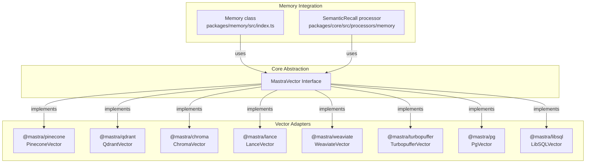
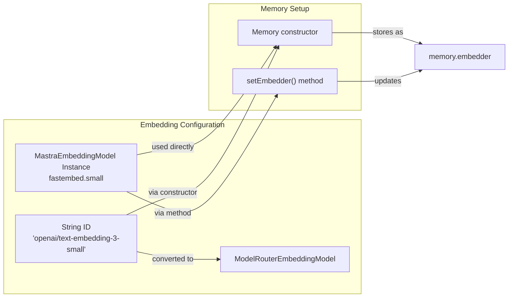
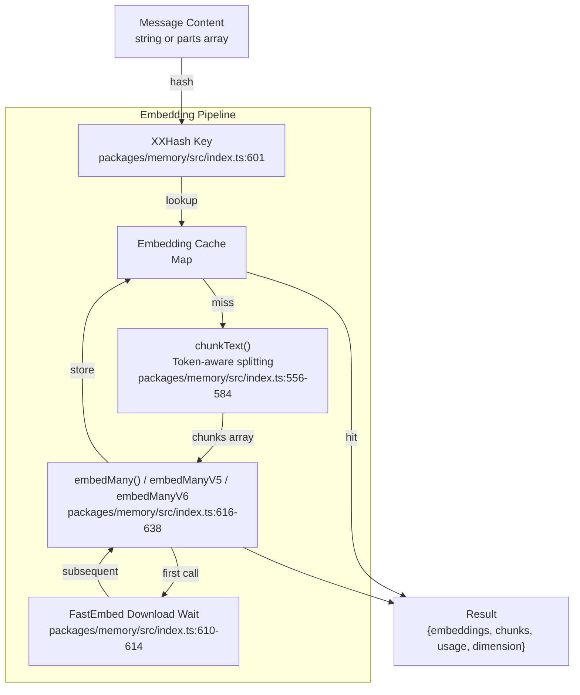
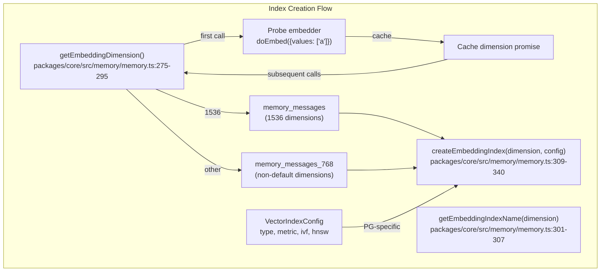
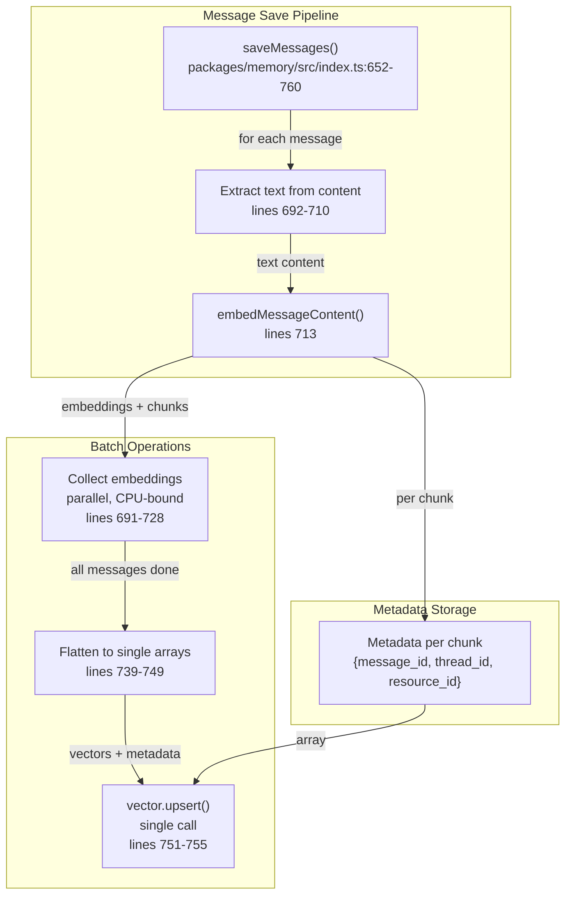
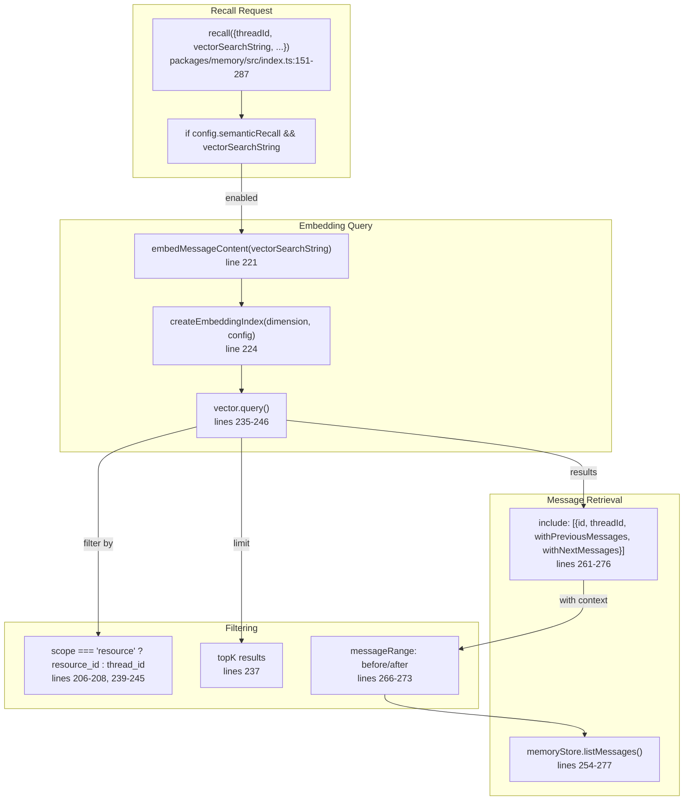
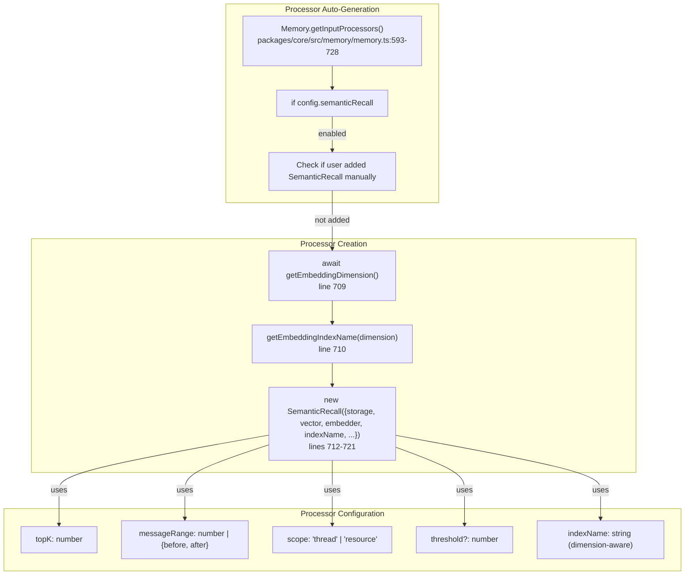

# Vector Storage and Semantic Search

<details>
<summary>Relevant source files</summary>

The following files were used as context for generating this wiki page:

- [packages/agent-builder/integration-tests/.gitignore](packages/agent-builder/integration-tests/.gitignore)
- [packages/agent-builder/integration-tests/README.md](packages/agent-builder/integration-tests/README.md)
- [packages/agent-builder/integration-tests/docker-compose.yml](packages/agent-builder/integration-tests/docker-compose.yml)
- [packages/agent-builder/integration-tests/src/fixtures/minimal-mastra-project/.gitignore](packages/agent-builder/integration-tests/src/fixtures/minimal-mastra-project/.gitignore)
- [packages/agent-builder/integration-tests/src/fixtures/minimal-mastra-project/env.example](packages/agent-builder/integration-tests/src/fixtures/minimal-mastra-project/env.example)
- [packages/core/src/memory/memory.ts](packages/core/src/memory/memory.ts)
- [packages/core/src/memory/types.ts](packages/core/src/memory/types.ts)
- [packages/memory/integration-tests/docker-compose.yml](packages/memory/integration-tests/docker-compose.yml)
- [packages/memory/integration-tests/src/agent-memory.test.ts](packages/memory/integration-tests/src/agent-memory.test.ts)
- [packages/memory/integration-tests/src/processors.test.ts](packages/memory/integration-tests/src/processors.test.ts)
- [packages/memory/integration-tests/src/streaming-memory.test.ts](packages/memory/integration-tests/src/streaming-memory.test.ts)
- [packages/memory/integration-tests/src/test-utils.ts](packages/memory/integration-tests/src/test-utils.ts)
- [packages/memory/integration-tests/src/with-libsql-storage.test.ts](packages/memory/integration-tests/src/with-libsql-storage.test.ts)
- [packages/memory/integration-tests/src/with-pg-storage.test.ts](packages/memory/integration-tests/src/with-pg-storage.test.ts)
- [packages/memory/integration-tests/src/with-upstash-storage.test.ts](packages/memory/integration-tests/src/with-upstash-storage.test.ts)
- [packages/memory/integration-tests/src/worker/generic-memory-worker.ts](packages/memory/integration-tests/src/worker/generic-memory-worker.ts)
- [packages/memory/integration-tests/src/working-memory.test.ts](packages/memory/integration-tests/src/working-memory.test.ts)
- [packages/memory/integration-tests/vitest.config.ts](packages/memory/integration-tests/vitest.config.ts)
- [packages/memory/src/index.test.ts](packages/memory/src/index.test.ts)
- [packages/memory/src/index.ts](packages/memory/src/index.ts)
- [packages/memory/src/tools/working-memory.ts](packages/memory/src/tools/working-memory.ts)

</details>

This document describes the vector storage abstraction layer and semantic search capabilities in Mastra's memory system. It covers the `MastraVector` interface, vector database adapters (Pinecone, Qdrant, Chroma, Lance, Weaviate, Turbopuffer), embedding model integration, index management, and semantic recall functionality.

For information about:

- Overall memory architecture, see [Memory System Architecture](#7.1)
- RAG document processing and chunking, see [RAG System and Document Processing](#7.7)
- Message storage and thread management, see [Thread Management and Message Storage](#7.2)

## MastraVector Interface

The `MastraVector` interface defines the contract that all vector database adapters must implement. Memory instances use this interface to store and query vector embeddings of messages for semantic search.



Sources: [packages/core/src/memory/memory.ts:118-121](), [stores/pg/package.json:1-75]()

### Core Methods

The `MastraVector` interface requires implementations to provide:

| Method             | Purpose                                                            |
| ------------------ | ------------------------------------------------------------------ |
| `createIndex()`    | Creates a vector index with specified dimensions and configuration |
| `upsert()`         | Inserts or updates vectors with associated metadata                |
| `query()`          | Performs similarity search returning top-k nearest neighbors       |
| `deleteByFilter()` | Removes vectors matching metadata filters                          |
| `indexSeparator`   | Character used to separate index name components (default: `_`)    |

## Embedding Integration

Memory instances integrate with embedding models through the `MastraEmbeddingModel` interface to convert text content into vector representations.

### Embedding Model Configuration



Sources: [packages/core/src/memory/memory.ts:173-194](), [packages/core/src/memory/memory.ts:229-241]()

The `Memory` class accepts embedders in two forms:

1. **String ID**: Automatically converted to `ModelRouterEmbeddingModel` instance [packages/core/src/memory/memory.ts:184]()
2. **MastraEmbeddingModel instance**: Used directly (e.g., `fastembed.small`) [packages/core/src/memory/memory.ts:186]()

### Embedding Cache and Chunking

Message content is chunked and embedded with aggressive caching to avoid redundant computation:



Sources: [packages/memory/src/index.ts:556-650]()

The caching strategy uses `xxhash` (line 586) to generate compact integer keys, preventing memory inflation from storing full message strings. FastEmbed models require special handling (lines 610-614) because multiple concurrent initial calls fail if the model hasn't been downloaded yet.

## Index Management

Vector indices are created and managed with dimension-aware naming and PostgreSQL-specific optimization options.

### Dimension Detection and Index Naming



Sources: [packages/core/src/memory/memory.ts:275-340]()

The dimension detection probes the embedder by embedding a single character (line 281), then caches the result as a promise (line 278) to deduplicate concurrent calls. Index names include the dimension count when non-default (lines 304-306) to prevent collisions when switching embedders.

### VectorIndexConfig Options

PostgreSQL with pgvector supports advanced index configuration, while other vector stores use their default settings:

```typescript
interface VectorIndexConfig {
  type?: 'ivfflat' | 'hnsw' | 'flat'
  metric?: 'cosine' | 'euclidean' | 'dotproduct'
  ivf?: { lists?: number }
  hnsw?: { m?: number; efConstruction?: number }
}
```

Sources: [packages/core/src/memory/types.ts:206-287]()

| Option                | Default     | Purpose                                                                      |
| --------------------- | ----------- | ---------------------------------------------------------------------------- |
| `type`                | `'ivfflat'` | Index algorithm: IVFFlat (balanced), HNSW (fast), or Flat (exact)            |
| `metric`              | `'cosine'`  | Distance function: cosine (text), euclidean (geometric), dotproduct (OpenAI) |
| `ivf.lists`           | `100`       | Number of inverted lists (higher = better recall, slower build)              |
| `hnsw.m`              | `16`        | Max bidirectional links per node (higher = better recall, larger index)      |
| `hnsw.efConstruction` | `64`        | Dynamic candidate list size (higher = better quality, slower build)          |

These settings are passed to `vector.createIndex()` at lines 323-338, but only PostgreSQL adapters use them. Other vector stores (Pinecone, Qdrant, etc.) ignore these parameters.

## Vector Storage Operations

### Upsert Flow

When messages are saved, their content is embedded and stored in the vector database:



Sources: [packages/memory/src/index.ts:652-760]()

**Key optimization**: All embeddings are computed concurrently (lines 691-728) since embedding is CPU-bound and doesn't consume database connections. Results are then batched into a single `upsert()` call (line 751) to avoid pool exhaustion that occurred when each message triggered a separate database write.

Text extraction handles multiple content formats:

- Direct string content: `message.content.content` (line 698)
- Parts array: Concatenates all text parts (lines 701-708)
- Empty content: Skipped (line 711)

Each text chunk gets metadata linking it back to the source message (lines 721-725), enabling retrieval of surrounding context during queries.

### Query Flow for Semantic Recall

Semantic recall queries retrieve relevant messages using vector similarity search:



Sources: [packages/memory/src/index.ts:151-287]()

The query process:

1. **Embed search string**: Convert the user's query into vectors (line 221)
2. **Index lookup**: Use dimension-aware index name (line 224)
3. **Filter by scope**: Either `resource_id` (cross-thread) or `thread_id` (single thread) (lines 239-245)
4. **Top-K retrieval**: Get most similar vectors (line 237)
5. **Context expansion**: Fetch surrounding messages using `include` parameter (lines 261-276)

The `messageRange` configuration (lines 266-273) controls how many adjacent messages are retrieved. For example, `{ before: 1, after: 3 }` fetches 1 message before and 3 messages after each match.

## SemanticRecall Processor Integration

The `SemanticRecall` processor automatically integrates with Memory to load relevant messages during agent execution:



Sources: [packages/core/src/memory/memory.ts:675-723]()

The processor is created with:

- **Storage adapter**: For loading messages (line 714)
- **Vector instance**: For similarity search (line 715)
- **Embedder**: For query embedding (line 716)
- **Embedder options**: Provider-specific settings (line 717)
- **Index name**: Dimension-aware name from probe (line 718)
- **Semantic config**: topK, messageRange, scope, threshold (line 719)

The dimension probe (line 709) ensures the processor uses the same index name as the Memory instance, preventing mismatches when embedders have non-standard dimensions.

## Configuration and Usage

### Basic Setup

```typescript
import { Memory } from '@mastra/memory'
import { PgVector } from '@mastra/pg'
import { fastembed } from '@mastra/fastembed'

const memory = new Memory({
  vector: new PgVector({ connectionString: 'postgres://...' }),
  embedder: fastembed.small, // or 'openai/text-embedding-3-small'
  options: {
    semanticRecall: {
      topK: 3,
      messageRange: 2,
      scope: 'resource',
    },
  },
})
```

### PostgreSQL Index Optimization

```typescript
const memory = new Memory({
  vector: new PgVector({ connectionString: 'postgres://...' }),
  embedder: 'openai/text-embedding-3-small',
  options: {
    semanticRecall: {
      topK: 5,
      messageRange: { before: 1, after: 3 },
      indexConfig: {
        type: 'hnsw',
        metric: 'dotproduct', // Best for OpenAI embeddings
        hnsw: { m: 16, efConstruction: 64 },
      },
    },
  },
})
```

Sources: [packages/core/src/memory/types.ts:288-373]()

### Semantic Recall Configuration Matrix

| Field          | Type                        | Default          | Purpose                                    |
| -------------- | --------------------------- | ---------------- | ------------------------------------------ |
| `topK`         | `number`                    | Required         | Number of similar messages to retrieve     |
| `messageRange` | `number \| {before, after}` | Required         | Surrounding context messages per match     |
| `scope`        | `'thread' \| 'resource'`    | `'resource'`     | Search within thread or across all threads |
| `threshold`    | `number` (0-1)              | None             | Minimum similarity score filter            |
| `indexName`    | `string`                    | Auto-generated   | Custom index name override                 |
| `indexConfig`  | `VectorIndexConfig`         | Adapter defaults | PostgreSQL index optimization              |

Sources: [packages/core/src/memory/types.ts:288-373]()

### Resource vs Thread Scope

The `scope` parameter controls the search boundary:

**Resource scope** (default):

- Searches across all threads owned by the same `resourceId` (user)
- Enables cross-conversation recall
- Filter: `{ resource_id: resourceId }` [packages/memory/src/index.ts:240-242]()

**Thread scope**:

- Searches only within the current thread
- Isolated per-conversation
- Filter: `{ thread_id: threadId }` [packages/memory/src/index.ts:243-245]()

If resource scope is enabled but no `resourceId` is provided, an error is thrown (lines 211-216) to prevent unintended global queries.

## Vector Database Adapters

Each adapter implements the `MastraVector` interface with provider-specific optimizations:

| Package               | Provider              | Index Separator | Notes                                  |
| --------------------- | --------------------- | --------------- | -------------------------------------- |
| `@mastra/pinecone`    | Pinecone              | `-`             | Managed cloud vector database          |
| `@mastra/qdrant`      | Qdrant                | `_`             | Self-hosted or cloud, high performance |
| `@mastra/chroma`      | Chroma                | `_`             | Embedded or client-server              |
| `@mastra/lance`       | LanceDB               | `_`             | Embedded, columnar format              |
| `@mastra/weaviate`    | Weaviate              | `_`             | GraphQL API, semantic search           |
| `@mastra/turbopuffer` | Turbopuffer           | `_`             | High-speed serverless vector DB        |
| `@mastra/pg`          | PostgreSQL + pgvector | `_`             | SQL database with vector extension     |
| `@mastra/libsql`      | LibSQL                | `_`             | SQLite-compatible, edge-optimized      |

The `indexSeparator` character is used in index name generation: `memory{separator}messages` or `memory{separator}messages{separator}{dimension}`.

Sources: [packages/memory/package.json:1-92](), [stores/pg/package.json:1-75]()

## Performance Considerations

### Embedding Cache Benefits

The xxhash-based cache (line 586-601) provides:

- **Deduplication**: Repeated messages don't re-embed
- **Memory efficiency**: Integer keys instead of full strings
- **Cross-call persistence**: Cache survives multiple `saveMessages()` calls within the process lifetime

### Batch Upsert Strategy

The single-call upsert pattern (line 751) prevents:

- **Pool exhaustion**: Multiple concurrent database writes were exhausting connection pools
- **Transaction overhead**: Batching reduces round trips
- **Lock contention**: Single write instead of many small writes

This optimization was critical for the multi-message save flow, as documented in the commit history.

Sources: [packages/memory/src/index.ts:730-756]()

### FastEmbed Download Handling

FastEmbed models require special handling (lines 610-614):

- **Problem**: Multiple concurrent calls fail if model not downloaded
- **Solution**: Wait for first call to complete, then allow subsequent calls
- **Implementation**: `this.firstEmbed` promise serializes initial downloads

## Integration with Storage Domains

Vector operations coordinate with the Memory storage domain:

```mermaid
graph TB
    subgraph "Message Save Flow"
        SaveMessagesCall["saveMessages()"]
        StripWorkingMemory["Strip working memory tags<br/>lines 660-664"]
        DBSave["memoryStore.saveMessages()<br/>lines 676-678"]
        VectorEmbedding["Embed and upsert vectors<br/>lines 682-757"]
    end

    subgraph "Recall Flow"
        RecallCall["recall()"]
        VectorQuery["Vector query for matches<br/>lines 220-250"]
        DBList["memoryStore.listMessages({include})<br/>lines 254-277"]
        MessageList["MessageList conversion<br/>lines 281-284"]
    end

    SaveMessagesCall --> StripWorkingMemory
    StripWorkingMemory --> DBSave
    DBSave --> VectorEmbedding

    RecallCall --> VectorQuery
    VectorQuery -->|message IDs| DBList
    DBList --> MessageList
```



Sources: [packages/memory/src/index.ts:652-760](), [packages/memory/src/index.ts:151-287]()

The vector database stores only embeddings and metadata, while the full message content resides in the Memory storage domain. The `include` parameter (lines 261-276) bridges the two by retrieving complete message objects using IDs from vector search results.
