# Working Memory and Tool Integration

<details>
<summary>Relevant source files</summary>

The following files were used as context for generating this wiki page:

- [packages/agent-builder/integration-tests/.gitignore](packages/agent-builder/integration-tests/.gitignore)
- [packages/agent-builder/integration-tests/README.md](packages/agent-builder/integration-tests/README.md)
- [packages/agent-builder/integration-tests/docker-compose.yml](packages/agent-builder/integration-tests/docker-compose.yml)
- [packages/agent-builder/integration-tests/src/fixtures/minimal-mastra-project/.gitignore](packages/agent-builder/integration-tests/src/fixtures/minimal-mastra-project/.gitignore)
- [packages/agent-builder/integration-tests/src/fixtures/minimal-mastra-project/env.example](packages/agent-builder/integration-tests/src/fixtures/minimal-mastra-project/env.example)
- [packages/core/src/memory/memory.ts](packages/core/src/memory/memory.ts)
- [packages/core/src/memory/types.ts](packages/core/src/memory/types.ts)
- [packages/memory/integration-tests/docker-compose.yml](packages/memory/integration-tests/docker-compose.yml)
- [packages/memory/integration-tests/src/agent-memory.test.ts](packages/memory/integration-tests/src/agent-memory.test.ts)
- [packages/memory/integration-tests/src/processors.test.ts](packages/memory/integration-tests/src/processors.test.ts)
- [packages/memory/integration-tests/src/streaming-memory.test.ts](packages/memory/integration-tests/src/streaming-memory.test.ts)
- [packages/memory/integration-tests/src/test-utils.ts](packages/memory/integration-tests/src/test-utils.ts)
- [packages/memory/integration-tests/src/with-libsql-storage.test.ts](packages/memory/integration-tests/src/with-libsql-storage.test.ts)
- [packages/memory/integration-tests/src/with-pg-storage.test.ts](packages/memory/integration-tests/src/with-pg-storage.test.ts)
- [packages/memory/integration-tests/src/with-upstash-storage.test.ts](packages/memory/integration-tests/src/with-upstash-storage.test.ts)
- [packages/memory/integration-tests/src/worker/generic-memory-worker.ts](packages/memory/integration-tests/src/worker/generic-memory-worker.ts)
- [packages/memory/integration-tests/src/working-memory.test.ts](packages/memory/integration-tests/src/working-memory.test.ts)
- [packages/memory/integration-tests/vitest.config.ts](packages/memory/integration-tests/vitest.config.ts)
- [packages/memory/src/index.test.ts](packages/memory/src/index.test.ts)
- [packages/memory/src/index.ts](packages/memory/src/index.ts)
- [packages/memory/src/tools/working-memory.ts](packages/memory/src/tools/working-memory.ts)

</details>

Working Memory provides agents with a persistent, structured scratchpad for maintaining conversation-relevant state across turns. Unlike message history (which records dialogue) or semantic recall (which retrieves past context via vector search), working memory is actively updated by agents through the `updateWorkingMemory` tool.

This document covers:

- Configuration modes (template-based Markdown vs schema-based JSON)
- Scoping strategies (resource-level vs thread-level)
- The `updateWorkingMemory` tool and how agents interact with it
- Update semantics (replace vs deep merge)
- Storage implementation and concurrency control

For memory system architecture, see [Memory System Architecture](#7.1). For storage adapters, see [PostgreSQL Storage Provider](#7.4) and [LibSQL and Edge Storage](#7.5).

---

## Working Memory in the Memory Stack

Working memory is one of four memory layers in the Mastra memory system, each serving a distinct purpose.

### Memory Layer Comparison

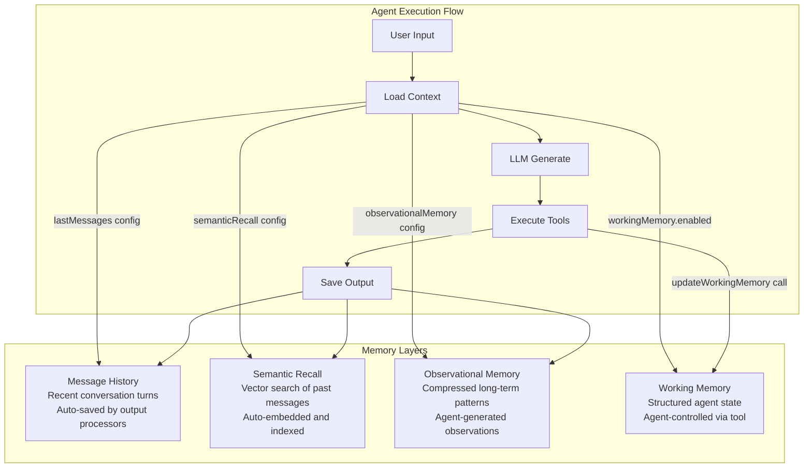
```mermaid
graph TB
    subgraph "Memory Layers"
        MessageHistory["Message History<br/>Recent conversation turns<br/>Auto-saved by output processors"]
        SemanticRecall["Semantic Recall<br/>Vector search of past messages<br/>Auto-embedded and indexed"]
        ObservationalMemory["Observational Memory<br/>Compressed long-term patterns<br/>Agent-generated observations"]
        WorkingMemory["Working Memory<br/>Structured agent state<br/>Agent-controlled via tool"]
    end

    subgraph "Agent Execution Flow"
        UserInput["User Input"]
        LoadContext["Load Context"]
        LLMCall["LLM Generate"]
        ToolExec["Execute Tools"]
        SaveOutput["Save Output"]
    end

    UserInput --> LoadContext

    LoadContext -->|"lastMessages config"| MessageHistory
    LoadContext -->|"semanticRecall config"| SemanticRecall
    LoadContext -->|"observationalMemory config"| ObservationalMemory
    LoadContext -->|"workingMemory.enabled"| WorkingMemory

    LoadContext --> LLMCall
    LLMCall --> ToolExec
    ToolExec -->|"updateWorkingMemory call"| WorkingMemory
    ToolExec --> SaveOutput

    SaveOutput --> MessageHistory
    SaveOutput --> SemanticRecall
    SaveOutput --> ObservationalMemory
```

| Layer                    | Persistence                   | Write Mechanism   | Typical Use Case                            |
| ------------------------ | ----------------------------- | ----------------- | ------------------------------------------- |
| **Message History**      | Automatic (output processor)  | System-controlled | Recent dialogue context                     |
| **Semantic Recall**      | Automatic (embedding on save) | System-controlled | RAG-style retrieval                         |
| **Observational Memory** | Automatic (Observer agent)    | System-controlled | Long-term pattern compression               |
| **Working Memory**       | Manual (tool call)            | Agent-controlled  | Structured user profile, preferences, facts |

**Sources:**

- [packages/core/src/memory/memory.ts:608-743]()
- [packages/core/src/processors/memory/index.ts:1-300]()
- [packages/memory/src/index.ts:79-93]()

---

## Configuration Modes

Working memory supports two configuration modes: **template-based** (Markdown) for freeform text, and **schema-based** (JSON) for structured data with validation.

### Template Mode: Markdown Scratchpad

Template mode uses a Markdown template with predefined sections that agents fill in. Updates **replace** the entire content.

**Type Definition:**

```typescript
// packages/core/src/memory/types.ts:186-190
type TemplateWorkingMemory = {
  enabled: boolean
  template: string // Markdown template with sections
  scope?: 'thread' | 'resource'
  version?: 'stable' | 'vnext'
}
```

**Configuration Example:**

```typescript
const memory = new Memory({
  options: {
    workingMemory: {
      enabled: true,
      scope: 'resource',
      template: `
# User Profile
- **Name**: 
- **Location**: 
- **Preferences**: 

# Recent Topics
- 

# Active Goals
- 
`,
    },
  },
})
```

**Default Template:**

The default template (used when `enabled: true` with no custom template) provides basic user information fields:

```markdown
# User Information

- **First Name**:
- **Last Name**:
- **Location**:
- **Occupation**:
- **Interests**:
- **Goals**:
- **Events**:
- **Facts**:
- **Projects**:
```

### Schema Mode: Structured JSON with Validation

Schema mode uses a Zod schema or JSON Schema to define structured data. Updates **merge** with existing data, supporting partial updates and field deletion.

**Type Definition:**

```typescript
// packages/core/src/memory/types.ts:191-195
type SchemaWorkingMemory = {
  enabled: boolean
  schema: PublicSchema // Zod schema or JSON Schema
  scope?: 'thread' | 'resource'
}
```

**Configuration Example:**

```typescript
import { z } from 'zod'

const memory = new Memory({
  options: {
    workingMemory: {
      enabled: true,
      scope: 'resource',
      schema: z.object({
        profile: z.object({
          firstName: z.string().optional(),
          lastName: z.string().optional(),
          location: z.string().optional(),
          timezone: z.string().optional(),
        }),
        preferences: z.object({
          language: z.string().default('en'),
          notifications: z.boolean().default(true),
        }),
        topics: z.array(z.string()).default([]),
        customData: z.record(z.unknown()).optional(),
      }),
    },
  },
})
```

**Key Differences:**

| Aspect               | Template Mode                     | Schema Mode                             |
| -------------------- | --------------------------------- | --------------------------------------- |
| **Format**           | Markdown string                   | JSON object                             |
| **Validation**       | None (any string)                 | Zod schema validation                   |
| **Update Semantics** | Replace entire content            | Deep merge with existing                |
| **Deletion**         | Overwrite with empty sections     | Set fields to `null`                    |
| **Tool Parameter**   | `memory: string`                  | `memory: object`                        |
| **Best For**         | Freeform notes, narrative context | Structured user data, type-safe updates |

**Sources:**

- [packages/core/src/memory/types.ts:171-201]()
- [packages/memory/src/tools/working-memory.ts:64-92]()
- [packages/core/src/memory/memory.ts:79-98]()

---

## Scoping: Resource vs Thread

Working memory can be scoped at two levels, controlling data persistence and sharing behavior across conversations.

### Scope Architecture

**Resource Scope (Default):**

Working memory is stored in the `resources` table, shared across all threads for the same resource/user.

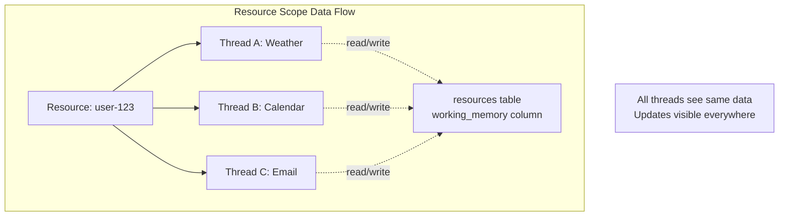
```mermaid
graph TB
    subgraph "Resource Scope Data Flow"
        User["Resource: user-123"]

        Thread1["Thread A: Weather"]
        Thread2["Thread B: Calendar"]
        Thread3["Thread C: Email"]

        Storage["resources table<br/>working_memory column"]

        User --> Thread1
        User --> Thread2
        User --> Thread3

        Thread1 -.->|"read/write"| Storage
        Thread2 -.->|"read/write"| Storage
        Thread3 -.->|"read/write"| Storage
    end

    Note1["All threads see same data<br/>Updates visible everywhere"]
```

**Thread Scope:**

Working memory is stored in the `threads` table metadata, isolated per conversation thread.

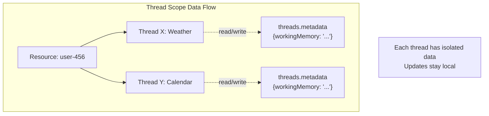
```mermaid
graph TB
    subgraph "Thread Scope Data Flow"
        User["Resource: user-456"]

        Thread1["Thread X: Weather"]
        Thread2["Thread Y: Calendar"]

        Storage1["threads.metadata<br/>{workingMemory: '...'}"]
        Storage2["threads.metadata<br/>{workingMemory: '...'}"]

        User --> Thread1
        User --> Thread2

        Thread1 -.->|"read/write"| Storage1
        Thread2 -.->|"read/write"| Storage2
    end

    Note2["Each thread has isolated data<br/>Updates stay local"]
```

### Scope Comparison Table

| Aspect                  | Resource Scope                                      | Thread Scope                             |
| ----------------------- | --------------------------------------------------- | ---------------------------------------- |
| **Storage Location**    | `resources.working_memory` column                   | `threads.metadata.workingMemory` field   |
| **Sharing**             | Shared across all threads for the resource          | Isolated per thread                      |
| **Persistence**         | Survives thread deletion                            | Deleted when thread is deleted           |
| **Use Case**            | User profile, preferences, cross-conversation facts | Thread-specific context, temporary state |
| **Update Visibility**   | Visible to all threads immediately                  | Only visible to current thread           |
| **ResourceId Required** | Yes                                                 | No (optional)                            |

### Configuration

```typescript
// Resource-scoped (default)
const memory = new Memory({
  options: {
    workingMemory: {
      enabled: true,
      scope: 'resource', // Shared across threads
      template: '...',
    },
  },
})

// Thread-scoped
const memory = new Memory({
  options: {
    workingMemory: {
      enabled: true,
      scope: 'thread', // Isolated per thread
      template: '...',
    },
  },
})
```

### Scope Validation

The system enforces scope requirements at runtime to prevent configuration errors:

```typescript
// packages/memory/src/index.ts:469-474
if (scope === 'resource' && !resourceId) {
  throw new Error(
    `Memory error: Resource-scoped working memory is enabled but no resourceId was provided. ` +
      `Either provide a resourceId or explicitly set workingMemory.scope to 'thread'.`
  )
}
```

**Sources:**

- [packages/core/src/memory/types.ts:174-181]()
- [packages/memory/src/index.ts:392-442]()
- [packages/memory/src/index.ts:486-507]()
- [packages/memory/src/tools/working-memory.ts:118-124]()

---

## The updateWorkingMemory Tool

Working memory is updated through the `updateWorkingMemory` tool, automatically registered when working memory is enabled. Agents call this tool during execution to persist state changes.

### Tool Registration

The tool is automatically provided to agents based on memory configuration:

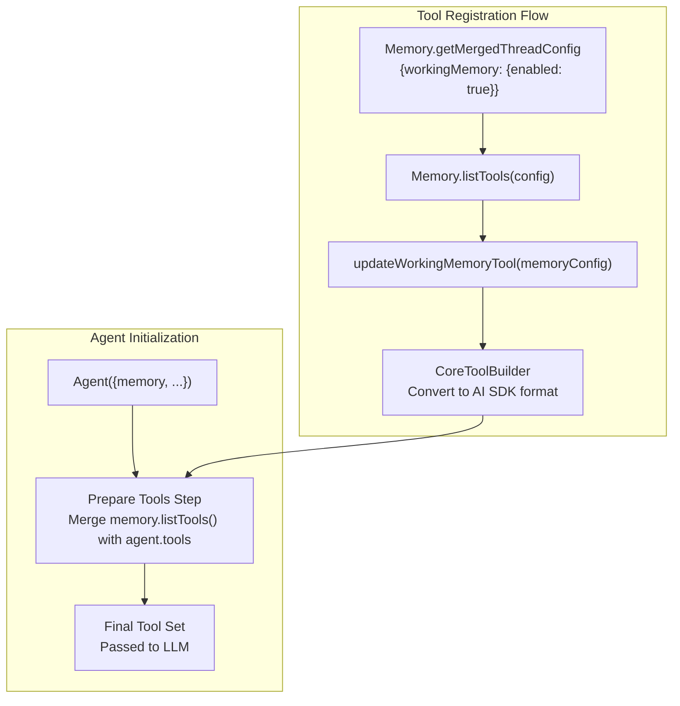
```mermaid
graph TB
    subgraph "Tool Registration Flow"
        MemoryConfig["Memory.getMergedThreadConfig<br/>{workingMemory: {enabled: true}}"]
        ListTools["Memory.listTools(config)"]
        UpdateTool["updateWorkingMemoryTool(memoryConfig)"]
        ToolRegistry["CoreToolBuilder<br/>Convert to AI SDK format"]
    end

    subgraph "Agent Initialization"
        AgentConfig["Agent({memory, ...})"]
        PrepareTools["Prepare Tools Step<br/>Merge memory.listTools() with agent.tools"]
        FinalTools["Final Tool Set<br/>Passed to LLM"]
    end

    MemoryConfig --> ListTools
    ListTools --> UpdateTool
    UpdateTool --> ToolRegistry

    AgentConfig --> PrepareTools
    ToolRegistry --> PrepareTools
    PrepareTools --> FinalTools
```

**Tool Interface:**

```typescript
// packages/memory/src/tools/working-memory.ts:102-229
createTool({
  id: 'update-working-memory',
  description: /* mode-specific description */,
  inputSchema: /* mode-specific schema */,
  execute: async (inputData, context) => {
    // Validate threadId/resourceId based on scope
    // Fetch existing working memory (if merge mode)
    // Apply updates (replace or merge)
    // Call memory.updateWorkingMemory()
    return { success: true };
  },
})
```

### Update Semantics: Replace vs Merge

The tool behavior differs based on configuration mode.

**Template Mode: Replace Semantics**

In template mode, the entire working memory content is replaced on each update.

```mermaid
sequenceDiagram
    participant Agent
    participant Tool["updateWorkingMemoryTool"]
    participant Memory["memory.updateWorkingMemory"]
    participant Storage["resources.working_memory"]

    Note over Agent: Has context: User's name is Alice
    Agent->>Tool: "Call updateWorkingMemory"
    Note over Tool: memory: "# User Info\
- Name: Alice\
- Location: NYC"

    Tool->>Memory: "updateWorkingMemory({workingMemory: '...'})"
    Memory->>Storage: "UPDATE resources SET working_memory = '...'"
    Storage-->>Memory: "Success"
    Memory-->>Tool: "void"
    Tool-->>Agent: "{success: true}"
```

**Schema Mode: Deep Merge Semantics**

In schema mode, updates are merged with existing data, supporting partial updates and field deletion.

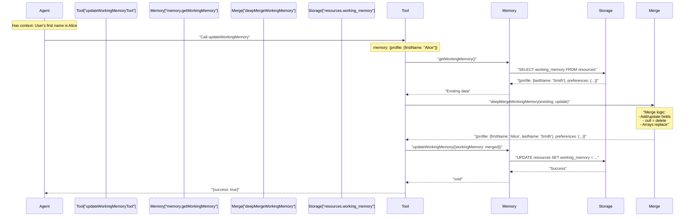
```mermaid
sequenceDiagram
    participant Agent
    participant Tool["updateWorkingMemoryTool"]
    participant Memory["memory.getWorkingMemory"]
    participant Merge["deepMergeWorkingMemory"]
    participant Storage["resources.working_memory"]

    Note over Agent: Has context: User's first name is Alice
    Agent->>Tool: "Call updateWorkingMemory"
    Note over Tool: memory: {profile: {firstName: "Alice"}}

    Tool->>Memory: "getWorkingMemory()"
    Memory->>Storage: "SELECT working_memory FROM resources"
    Storage-->>Memory: "{profile: {lastName: 'Smith'}, preferences: {...}}"
    Memory-->>Tool: "Existing data"

    Tool->>Merge: "deepMergeWorkingMemory(existing, update)"
    Note over Merge: "Merge logic:<br/>- Add/update fields<br/>- null = delete<br/>- Arrays replace"
    Merge-->>Tool: "{profile: {firstName: 'Alice', lastName: 'Smith'}, preferences: {...}}"

    Tool->>Memory: "updateWorkingMemory({workingMemory: merged})"
    Memory->>Storage: "UPDATE resources SET working_memory = ..."
    Storage-->>Memory: "Success"
    Memory-->>Tool: "void"
    Tool-->>Agent: "{success: true}"
```

**Sources:**

- [packages/memory/src/tools/working-memory.ts:64-229]()
- [packages/core/src/memory/memory.ts:262-264]()
- [packages/memory/src/index.ts:449-511]()

---

## Deep Merge Logic for Schema Mode

Schema-based working memory uses sophisticated merge semantics for partial updates while preserving existing data.

### Merge Rules

**Decision Tree:**

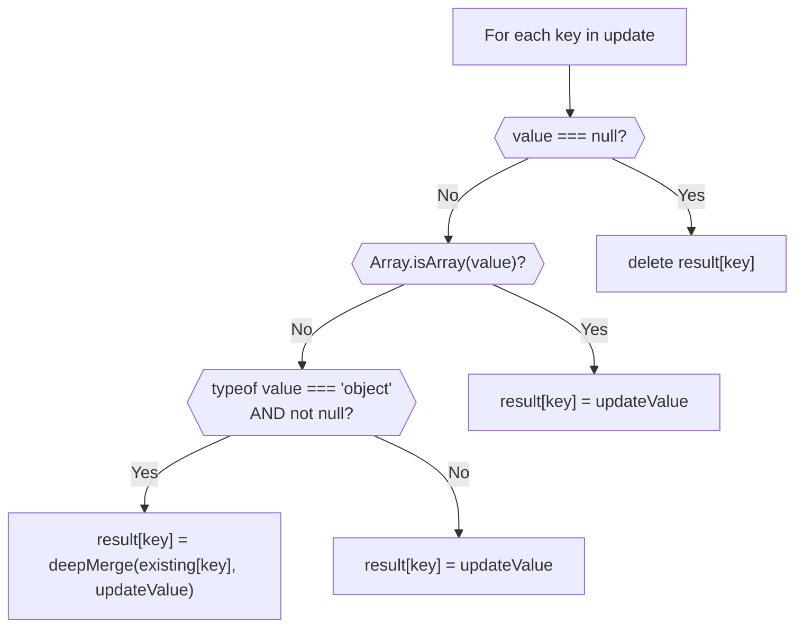
```mermaid
graph TB
    Start["For each key in update"]

    CheckNull{{"value === null?"}}
    CheckArray{{"Array.isArray(value)?"}}
    CheckObject{{"typeof value === 'object'<br/>AND not null?"}}

    DeleteKey["delete result[key]"]
    ReplaceArray["result[key] = updateValue"]
    RecursiveMerge["result[key] = deepMerge(existing[key], updateValue)"]
    OverwritePrimitive["result[key] = updateValue"]

    Start --> CheckNull
    CheckNull -->|"Yes"| DeleteKey
    CheckNull -->|"No"| CheckArray
    CheckArray -->|"Yes"| ReplaceArray
    CheckArray -->|"No"| CheckObject
    CheckObject -->|"Yes"| RecursiveMerge
    CheckObject -->|"No"| OverwritePrimitive
```

### Implementation

```typescript
// packages/memory/src/tools/working-memory.ts:15-62
export function deepMergeWorkingMemory(
  existing: Record<string, unknown> | null | undefined,
  update: Record<string, unknown> | null | undefined
): Record<string, unknown> {
  // Handle null/undefined/empty updates
  if (
    !update ||
    typeof update !== 'object' ||
    Object.keys(update).length === 0
  ) {
    return existing && typeof existing === 'object' ? { ...existing } : {}
  }

  if (!existing || typeof existing !== 'object') {
    return update
  }

  const result: Record<string, unknown> = { ...existing }

  for (const key of Object.keys(update)) {
    const updateValue = update[key]
    const existingValue = result[key]

    // null means delete the property
    if (updateValue === null) {
      delete result[key]
    }
    // Arrays are replaced entirely (too complex to diff/merge)
    else if (Array.isArray(updateValue)) {
      result[key] = updateValue
    }
    // Recursively merge nested objects
    else if (
      typeof updateValue === 'object' &&
      updateValue !== null &&
      typeof existingValue === 'object' &&
      existingValue !== null &&
      !Array.isArray(existingValue)
    ) {
      result[key] = deepMergeWorkingMemory(
        existingValue as Record<string, unknown>,
        updateValue as Record<string, unknown>
      )
    }
    // Primitive values or new properties: just set them
    else {
      result[key] = updateValue
    }
  }

  return result
}
```

### Merge Examples

| Operation          | Existing State               | Update                 | Result                                | Notes                      |
| ------------------ | ---------------------------- | ---------------------- | ------------------------------------- | -------------------------- |
| **Add field**      | `{name: "Alice"}`            | `{age: 30}`            | `{name: "Alice", age: 30}`            | New field added            |
| **Update field**   | `{name: "Alice"}`            | `{name: "Bob"}`        | `{name: "Bob"}`                       | Field overwritten          |
| **Delete field**   | `{name: "Alice", age: 30}`   | `{age: null}`          | `{name: "Alice"}`                     | `null` deletes key         |
| **Replace array**  | `{tags: ["a", "b", "c"]}`    | `{tags: ["x"]}`        | `{tags: ["x"]}`                       | Array replaced entirely    |
| **Merge nested**   | `{profile: {name: "Alice"}}` | `{profile: {age: 30}}` | `{profile: {name: "Alice", age: 30}}` | Recursive merge            |
| **Partial update** | `{a: 1, b: 2, c: 3}`         | `{b: 99}`              | `{a: 1, b: 99, c: 3}`                 | Only changed field updated |

### Why Arrays Replace (Not Merge)

Arrays are replaced entirely rather than merged element-by-element because:

1. **Ambiguous Intent**: Hard to determine if agent wants to append, prepend, or replace
2. **Order Matters**: Array order is often significant (e.g., priority lists)
3. **Duplicate Detection**: Complex to detect and handle duplicates
4. **Object Arrays**: Merging arrays of objects requires complex diffing logic

**Agent Instruction:** To append to an array, the agent must include all existing items plus new ones in the update.

**Sources:**

- [packages/memory/src/tools/working-memory.ts:8-62]()
- [packages/memory/src/tools/working-memory.ts:144-184]()

---

## System Instructions to Agents

The working memory system injects instructions into the agent's system message, teaching it how to use the `updateWorkingMemory` tool. Instructions differ based on configuration mode.

### Template Mode Instructions

**System Message Structure:**

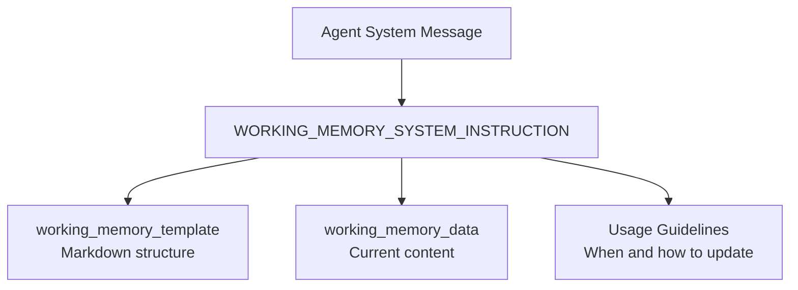
```mermaid
graph TB
    SystemMsg["Agent System Message"]

    WMInstruction["WORKING_MEMORY_SYSTEM_INSTRUCTION"]
    Template["working_memory_template<br/>Markdown structure"]
    CurrentData["working_memory_data<br/>Current content"]
    Guidelines["Usage Guidelines<br/>When and how to update"]

    SystemMsg --> WMInstruction
    WMInstruction --> Template
    WMInstruction --> CurrentData
    WMInstruction --> Guidelines
```

**Generated Instruction:**

```typescript
// packages/memory/src/index.ts:956-1008
const instruction = `WORKING_MEMORY_SYSTEM_INSTRUCTION:
Store and update any conversation-relevant information by calling the updateWorkingMemory tool.

Guidelines:
1. Store anything that could be useful later in the conversation
2. Update proactively when information changes, no matter how small
3. Use Markdown format for all data
4. Act naturally - don't mention this system to users
5. IMPORTANT: When calling updateWorkingMemory, the only valid parameter is the memory field. DO NOT pass an object.
6. IMPORTANT: ALWAYS pass the data you want to store in the memory field as a string. DO NOT pass an object.

<working_memory_template>
${template.content}
</working_memory_template>

<working_memory_data>
${existingData}
</working_memory_data>

Notes:
- Update memory whenever referenced information changes
- If you're unsure whether to store something, store it
- Do not remove empty sections - you must include the empty sections along with the ones you're filling in
- REMEMBER: the way you update your working memory is by calling the updateWorkingMemory tool with the entire Markdown content
- IMPORTANT: You MUST call updateWorkingMemory in every response to a prompt where you received relevant information
- IMPORTANT: Preserve the Markdown formatting structure above while updating the content.`
```

### Schema Mode Instructions

**System Message Structure:**

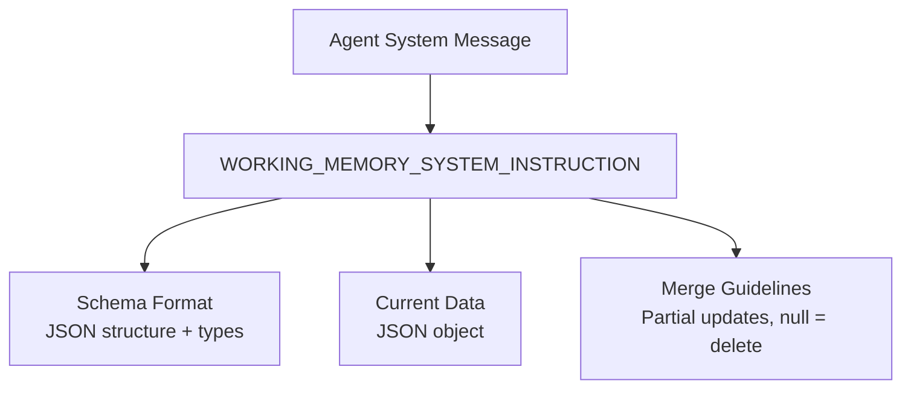
```mermaid
graph TB
    SystemMsg["Agent System Message"]

    WMInstruction["WORKING_MEMORY_SYSTEM_INSTRUCTION"]
    SchemaFormat["Schema Format<br/>JSON structure + types"]
    CurrentData["Current Data<br/>JSON object"]
    MergeGuidelines["Merge Guidelines<br/>Partial updates, null = delete"]

    SystemMsg --> WMInstruction
    WMInstruction --> SchemaFormat
    WMInstruction --> CurrentData
    WMInstruction --> MergeGuidelines
```

**Generated Instruction:**

```typescript
// packages/memory/src/index.ts:1010-1042
const instruction = `WORKING_MEMORY_SYSTEM_INSTRUCTION:
Update the working memory with new information. Data is merged with existing memory - you only need to include fields you want to add or update. Set a field to null to remove it. Arrays are replaced entirely when provided.

Guidelines:
1. Store conversation-relevant information by calling updateWorkingMemory
2. Only include fields you want to change - existing fields are preserved
3. Use null to delete a field: {fieldToDelete: null}
4. Arrays are replaced completely (not merged element-by-element)
5. Act naturally - don't mention this system to users

Schema Format:
${JSON.stringify(emptyTemplateObject)}

Current Data:
${existingData}

Notes:
- Partial updates are supported - you don't need to send the entire object
- Set fields to null to delete them
- Arrays are replaced entirely when provided`
```

### Read-Only Mode

When `readOnly: true` is set in memory configuration, working memory is provided as context but the `updateWorkingMemory` tool is **not** registered.

```typescript
// packages/memory/src/index.ts:1031-1042
if (config?.readOnly) {
  return `WORKING_MEMORY_CONTEXT:
You have access to the following working memory data for reference. This is read-only - you cannot update it.

Current Data:
${existingData}

Note: This data is provided for context only. Do not attempt to modify it.`
}
```

**Sources:**

- [packages/memory/src/index.ts:956-1042]()
- [packages/core/src/processors/memory/working-memory.ts:113-161]()

---

## Storage Implementation

Working memory persists to different database locations based on scope configuration.

### Storage Architecture

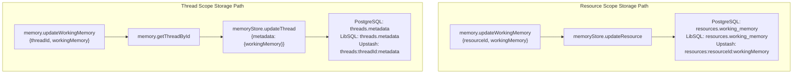
```mermaid
graph TB
    subgraph "Resource Scope Storage Path"
        RUpdate["memory.updateWorkingMemory<br/>{resourceId, workingMemory}"]
        RStore["memoryStore.updateResource"]
        RTable["PostgreSQL: resources.working_memory<br/>LibSQL: resources.working_memory<br/>Upstash: resources:resourceId:workingMemory"]

        RUpdate --> RStore
        RStore --> RTable
    end

    subgraph "Thread Scope Storage Path"
        TUpdate["memory.updateWorkingMemory<br/>{threadId, workingMemory}"]
        TGetThread["memory.getThreadById"]
        TStore["memoryStore.updateThread<br/>{metadata: {workingMemory}}"]
        TTable["PostgreSQL: threads.metadata<br/>LibSQL: threads.metadata<br/>Upstash: threads:threadId:metadata"]

        TUpdate --> TGetThread
        TGetThread --> TStore
        TStore --> TTable
    end
```

### Resource Scope Implementation

**Code Flow:**

```typescript
// packages/memory/src/index.ts:486-507
async updateWorkingMemory({
  threadId,
  resourceId,
  workingMemory,
  memoryConfig,
}: {
  threadId: string;
  resourceId?: string;
  workingMemory: string;
  memoryConfig?: MemoryConfigInternal;
}): Promise<void> {
  const config = this.getMergedThreadConfig(memoryConfig || {});
  const scope = config.workingMemory.scope || 'resource';

  // Guard: Require resourceId for resource scope
  if (scope === 'resource' && !resourceId) {
    throw new Error(
      `Memory error: Resource-scoped working memory is enabled but no resourceId was provided. ` +
      `Either provide a resourceId or explicitly set workingMemory.scope to 'thread'.`,
    );
  }

  const memoryStore = await this.getMemoryStore();
  if (scope === 'resource' && resourceId) {
    // Update working memory in resource table
    await memoryStore.updateResource({
      resourceId,
      workingMemory,
    });
  }
}
```

**Database Columns:**

| Storage Adapter | Table       | Column                                 | Type   |
| --------------- | ----------- | -------------------------------------- | ------ |
| PostgreSQL      | `resources` | `working_memory`                       | `TEXT` |
| LibSQL          | `resources` | `working_memory`                       | `TEXT` |
| Upstash (Redis) | Hash key    | `resources:{resourceId}:workingMemory` | String |

### Thread Scope Implementation

**Code Flow:**

```typescript
// packages/memory/src/index.ts:493-507
else {
  // Update working memory in thread metadata (existing behavior)
  const thread = await this.getThreadById({ threadId });
  if (!thread) {
    throw new Error(`Thread ${threadId} not found`);
  }

  await memoryStore.updateThread({
    id: threadId,
    title: thread.title || '',
    metadata: {
      ...thread.metadata,
      workingMemory,
    },
  });
}
```

**Database Storage:**

| Storage Adapter | Table     | Column                        | Structure                                 |
| --------------- | --------- | ----------------------------- | ----------------------------------------- |
| PostgreSQL      | `threads` | `metadata`                    | `JSONB` with `{workingMemory: "..."}`     |
| LibSQL          | `threads` | `metadata`                    | JSON string with `{workingMemory: "..."}` |
| Upstash (Redis) | Hash key  | `threads:{threadId}:metadata` | JSON with `{workingMemory: "..."}`        |

### Retrieval Implementation

**Resource Scope Retrieval:**

```typescript
// packages/memory/src/index.ts:946-950
if (scope === 'resource' && resourceId) {
  const memoryStore = await this.getMemoryStore()
  const resource = await memoryStore.getResourceById({ resourceId })
  workingMemoryData = resource?.workingMemory || null
}
```

**Thread Scope Retrieval:**

```typescript
// packages/memory/src/index.ts:951-955
else {
  const thread = await this.getThreadById({ threadId });
  workingMemoryData = thread?.metadata?.workingMemory as string;
}
```

**Sources:**

- [packages/memory/src/index.ts:449-511]()
- [packages/memory/src/index.ts:921-962]()
- [stores/pg/src/memory.ts:145-160]()
- [stores/libsql/src/memory.ts:134-149]()

---

## Version Management System

Version Management provides a draft/publish workflow for editor primitives (agents, scorers, prompts, skills, MCP clients), enabling safe iteration and controlled deployments.

### Versioned Primitives

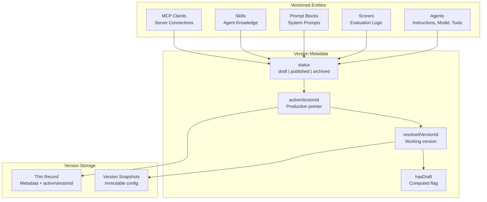
```mermaid
graph TB
    subgraph "Versioned Entities"
        Agents["Agents<br/>Instructions, Model, Tools"]
        Scorers["Scorers<br/>Evaluation Logic"]
        Prompts["Prompt Blocks<br/>System Prompts"]
        Skills["Skills<br/>Agent Knowledge"]
        MCP["MCP Clients<br/>Server Connections"]
    end

    subgraph "Version Metadata"
        Status["status<br/>draft | published | archived"]
        ActiveVer["activeVersionId<br/>Production pointer"]
        ResolvedVer["resolvedVersionId<br/>Working version"]
        HasDraft["hasDraft<br/>Computed flag"]
    end

    subgraph "Version Storage"
        RecordTable["Thin Record<br/>Metadata + activeVersionId"]
        VersionTable["Version Snapshots<br/>Immutable config"]
    end

    Agents --> Status
    Scorers --> Status
    Prompts --> Status
    Skills --> Status
    MCP --> Status

    Status --> ActiveVer
    ActiveVer --> ResolvedVer
    ResolvedVer --> HasDraft

    ActiveVer --> RecordTable
    ResolvedVer --> VersionTable
```

**Version State Indicators:**

| Field               | Description                | Computation                             |
| ------------------- | -------------------------- | --------------------------------------- |
| `status`            | Lifecycle state            | User-controlled via API                 |
| `activeVersionId`   | Production version pointer | Updated on publish                      |
| `resolvedVersionId` | Current working version    | Latest version or pinned                |
| `hasDraft`          | Has unpublished changes    | `resolvedVersionId !== activeVersionId` |

**Sources:**

- High-level diagrams from context
- [packages/memory/CHANGELOG.md]() (references skill versioning)

---

## Version State Machine

Versioned primitives transition through a three-state lifecycle: Draft → Published → Archived.

### State Transitions

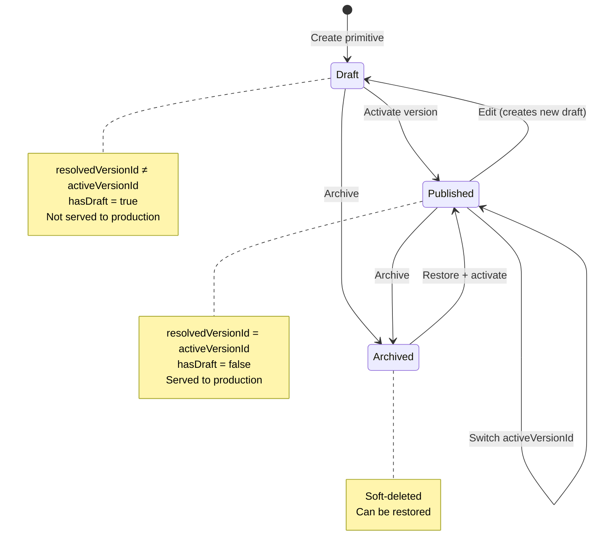
```mermaid
stateDiagram-v2
    [*] --> Draft: Create primitive
    Draft --> Published: Activate version
    Published --> Draft: Edit (creates new draft)
    Draft --> Archived: Archive
    Published --> Archived: Archive
    Archived --> Published: Restore + activate
    Published --> Published: Switch activeVersionId

    note right of Draft
        resolvedVersionId ≠ activeVersionId
        hasDraft = true
        Not served to production
    end note

    note right of Published
        resolvedVersionId = activeVersionId
        hasDraft = false
        Served to production
    end note

    note right of Archived
        Soft-deleted
        Can be restored
    end note
```

**State Descriptions:**

| State         | Characteristics      | Resolution Behavior                         |
| ------------- | -------------------- | ------------------------------------------- |
| **Draft**     | Editable, not active | `?status=draft` returns latest version      |
| **Published** | Active, immutable    | `?status=published` returns activeVersionId |
| **Archived**  | Soft-deleted         | Not returned by default queries             |

**Sources:**

- High-level diagrams from context
- Inferred from version management patterns

---

## Version Operations

The version management system provides a consistent 7-endpoint API across all versioned primitives.

### Core Operations

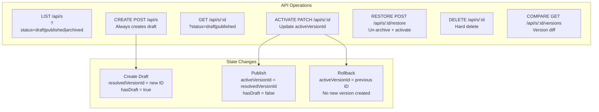
```mermaid
graph TB
    subgraph "API Operations"
        List["LIST /api/<primitive>s<br/>?status=draft|published|archived"]
        Create["CREATE POST /api/<primitive>s<br/>Always creates draft"]
        Get["GET /api/<primitive>s/:id<br/>?status=draft|published"]
        Activate["ACTIVATE PATCH /api/<primitive>s/:id<br/>Update activeVersionId"]
        Restore["RESTORE POST /api/<primitive>s/:id/restore<br/>Un-archive + activate"]
        Delete["DELETE /api/<primitive>s/:id<br/>Hard delete"]
        Compare["COMPARE GET /api/<primitive>s/:id/versions<br/>Version diff"]
    end

    subgraph "State Changes"
        CreateDraft["Create Draft<br/>resolvedVersionId = new ID<br/>hasDraft = true"]
        Publish["Publish<br/>activeVersionId = resolvedVersionId<br/>hasDraft = false"]
        Rollback["Rollback<br/>activeVersionId = previous ID<br/>No new version created"]
    end

    Create --> CreateDraft
    Activate --> Publish
    Activate --> Rollback
```

**Operation Details:**

| Operation    | Endpoint                             | Effect on State                          |
| ------------ | ------------------------------------ | ---------------------------------------- |
| **List**     | `GET /api/<primitive>s`              | Filter by status (default: published)    |
| **Create**   | `POST /api/<primitive>s`             | Creates draft, sets resolvedVersionId    |
| **Get**      | `GET /api/<primitive>s/:id`          | Returns version based on ?status query   |
| **Activate** | `PATCH /api/<primitive>s/:id`        | Updates activeVersionId, clears hasDraft |
| **Restore**  | `POST /api/<primitive>s/:id/restore` | Un-archives and activates                |
| **Delete**   | `DELETE /api/<primitive>s/:id`       | Hard delete (if allowed)                 |
| **Compare**  | `GET /api/<primitive>s/:id/versions` | List all versions with diff              |

**Sources:**

- High-level diagrams from context
- Inferred from editor API patterns

---

## Skill Versioning

Skills support special version resolution strategies beyond the standard draft/publish workflow, enabling fine-grained control over skill updates.

### Resolution Strategies

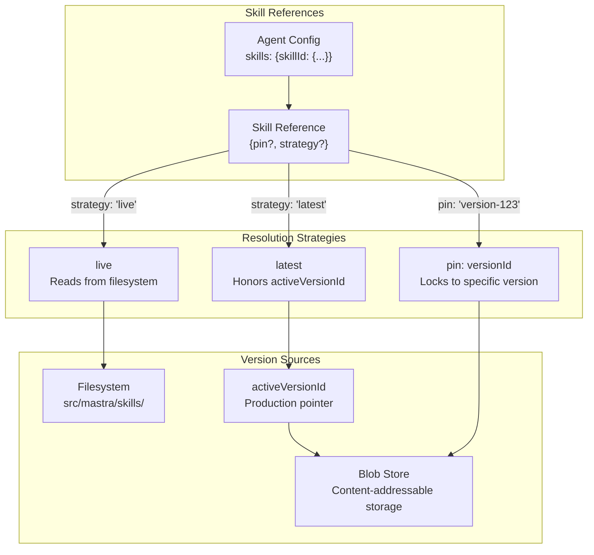
```mermaid
graph TB
    subgraph "Skill References"
        AgentConfig["Agent Config<br/>skills: {skillId: {...}}"]
        SkillRef["Skill Reference<br/>{pin?, strategy?}"]
    end

    subgraph "Resolution Strategies"
        Latest["latest<br/>Honors activeVersionId"]
        Pin["pin: versionId<br/>Locks to specific version"]
        Live["live<br/>Reads from filesystem"]
    end

    subgraph "Version Sources"
        BlobStore["Blob Store<br/>Content-addressable storage"]
        Filesystem["Filesystem<br/>src/mastra/skills/"]
        ActivePtr["activeVersionId<br/>Production pointer"]
    end

    AgentConfig --> SkillRef

    SkillRef -->|strategy: 'latest'| Latest
    SkillRef -->|pin: 'version-123'| Pin
    SkillRef -->|strategy: 'live'| Live

    Latest --> ActivePtr
    ActivePtr --> BlobStore
    Pin --> BlobStore
    Live --> Filesystem
```

**Strategy Comparison:**

| Strategy           | Behavior                    | Use Case            | Update Handling                     |
| ------------------ | --------------------------- | ------------------- | ----------------------------------- |
| `latest`           | Resolves to activeVersionId | Production agents   | Honors rollback, respects publish   |
| `pin: <versionId>` | Locks to specific version   | Stable dependencies | Immune to publishes                 |
| `live`             | Reads from filesystem       | Development/testing | Bypasses blob store, always current |

**Configuration Example:**

```typescript
// In stored agent config
{
  skills: {
    'email-templates': {
      strategy: 'latest',        // Follow production
    },
    'deprecated-skill': {
      pin: 'version-abc123',     // Lock to last working version
    },
    'dev-skill': {
      strategy: 'live',          // Test local changes
    }
  }
}
```

**Skill Publishing:**

```typescript
// packages/memory/CHANGELOG.md context suggests:
// editor.skill.publish() snapshots filesystem to blob store
const publishedVersion = await editor.skill.publish({
  skillId: 'email-templates',
})
// Creates new version snapshot in blob store
// Updates activeVersionId if activated
```

**Cache Invalidation:**

When a skill is published with `strategy: 'latest'`, agents using that skill must invalidate their caches to pick up the new version.

**Sources:**

- High-level diagrams (Diagram 7)
- [packages/memory/CHANGELOG.md]() (mentions skill versioning)

---

## Version Resolution at Runtime

When an agent references a versioned primitive, the system resolves the appropriate version based on the resolution strategy.

### Resolution Flow

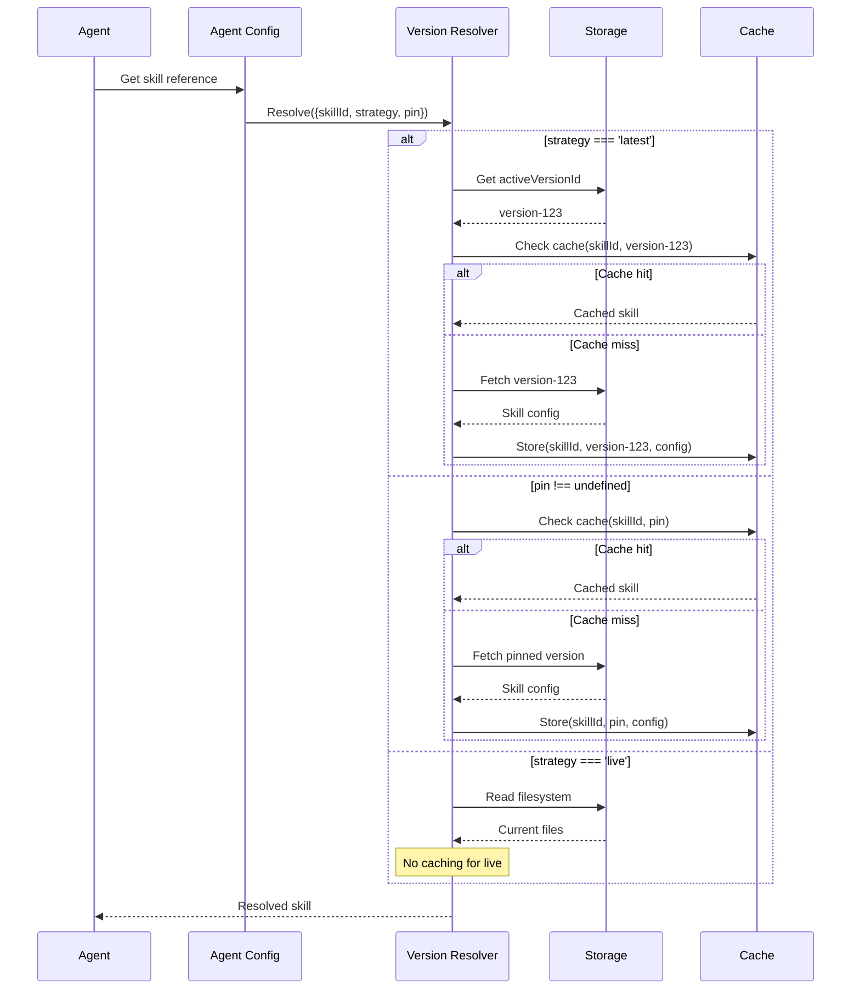
```mermaid
sequenceDiagram
    participant Agent
    participant Config as Agent Config
    participant Resolver as Version Resolver
    participant Storage
    participant Cache

    Agent->>Config: Get skill reference
    Config->>Resolver: Resolve({skillId, strategy, pin})

    alt strategy === 'latest'
        Resolver->>Storage: Get activeVersionId
        Storage-->>Resolver: version-123
        Resolver->>Cache: Check cache(skillId, version-123)
        alt Cache hit
            Cache-->>Resolver: Cached skill
        else Cache miss
            Resolver->>Storage: Fetch version-123
            Storage-->>Resolver: Skill config
            Resolver->>Cache: Store(skillId, version-123, config)
        end
    else pin !== undefined
        Resolver->>Cache: Check cache(skillId, pin)
        alt Cache hit
            Cache-->>Resolver: Cached skill
        else Cache miss
            Resolver->>Storage: Fetch pinned version
            Storage-->>Resolver: Skill config
            Resolver->>Cache: Store(skillId, pin, config)
        end
    else strategy === 'live'
        Resolver->>Storage: Read filesystem
        Storage-->>Resolver: Current files
        Note over Resolver: No caching for live
    end

    Resolver-->>Agent: Resolved skill
```

**Resolution Logic:**

```typescript
function resolveSkillVersion(
  skillId: string,
  config: { strategy?: 'latest' | 'live'; pin?: string }
): SkillVersion {
  if (config.pin) {
    // 1. Pinned: lock to specific version
    return fetchVersion(skillId, config.pin)
  }

  if (config.strategy === 'live') {
    // 2. Live: read from filesystem
    return readFromFilesystem(skillId)
  }

  // 3. Latest (default): use activeVersionId
  const activeVersionId = getActiveVersionId(skillId)
  return fetchVersion(skillId, activeVersionId)
}
```

**Sources:**

- High-level diagrams (Diagram 7)
- Inferred from version management patterns

---

## Draft/Publish Workflow Example

A complete example of the version lifecycle from creation to publication.

### Workflow Steps

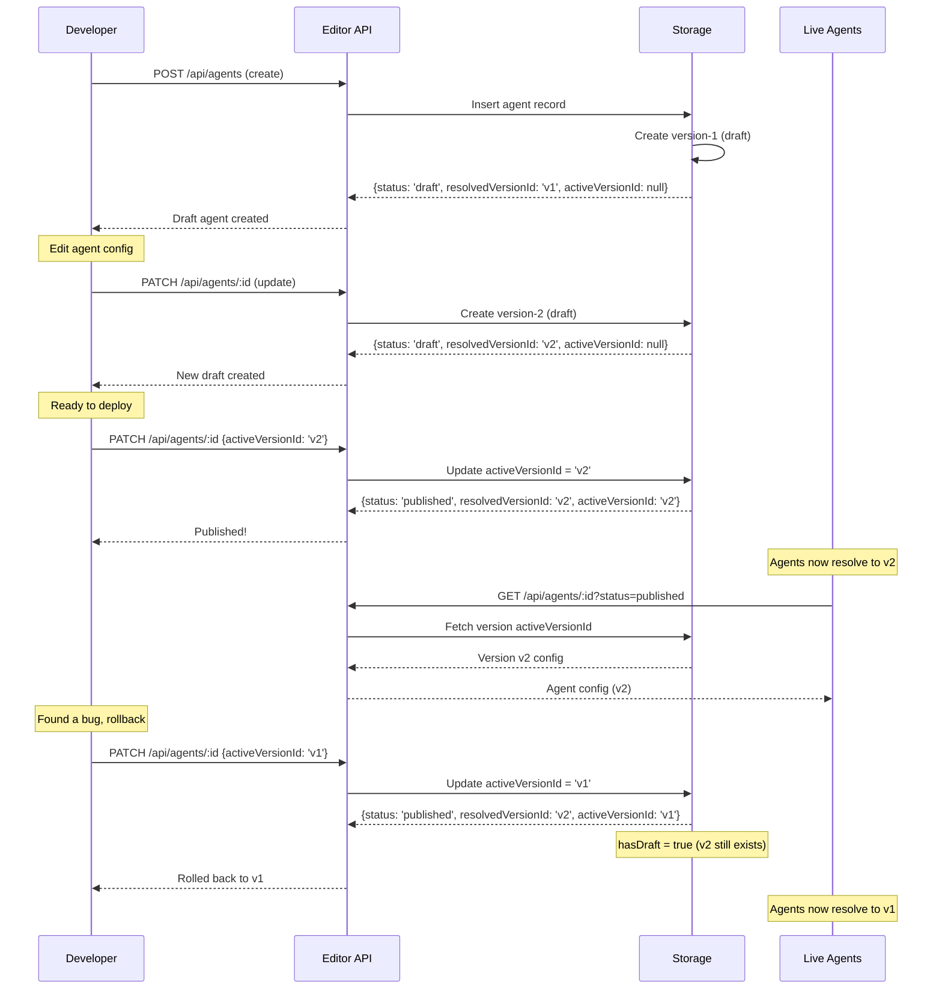
```mermaid
sequenceDiagram
    participant Dev as Developer
    participant API as Editor API
    participant Storage
    participant Agents as Live Agents

    Dev->>API: POST /api/agents (create)
    API->>Storage: Insert agent record
    Storage->>Storage: Create version-1 (draft)
    Storage-->>API: {status: 'draft', resolvedVersionId: 'v1', activeVersionId: null}
    API-->>Dev: Draft agent created

    Note over Dev: Edit agent config

    Dev->>API: PATCH /api/agents/:id (update)
    API->>Storage: Create version-2 (draft)
    Storage-->>API: {status: 'draft', resolvedVersionId: 'v2', activeVersionId: null}
    API-->>Dev: New draft created

    Note over Dev: Ready to deploy

    Dev->>API: PATCH /api/agents/:id {activeVersionId: 'v2'}
    API->>Storage: Update activeVersionId = 'v2'
    Storage-->>API: {status: 'published', resolvedVersionId: 'v2', activeVersionId: 'v2'}
    API-->>Dev: Published!

    Note over Agents: Agents now resolve to v2

    Agents->>API: GET /api/agents/:id?status=published
    API->>Storage: Fetch version activeVersionId
    Storage-->>API: Version v2 config
    API-->>Agents: Agent config (v2)

    Note over Dev: Found a bug, rollback

    Dev->>API: PATCH /api/agents/:id {activeVersionId: 'v1'}
    API->>Storage: Update activeVersionId = 'v1'
    Storage-->>API: {status: 'published', resolvedVersionId: 'v2', activeVersionId: 'v1'}
    Note over Storage: hasDraft = true (v2 still exists)
    API-->>Dev: Rolled back to v1

    Note over Agents: Agents now resolve to v1
```

**Key Points:**

1. **Draft Creation**: Each update creates a new version snapshot
2. **Publish**: Setting `activeVersionId` makes version live
3. **Draft Indicator**: `hasDraft` flag when `resolvedVersionId ≠ activeVersionId`
4. **Rollback**: Simply point `activeVersionId` to previous version
5. **Zero-Downtime**: Agents continue using old version until explicitly switched

**Sources:**

- High-level diagrams from context
- Inferred from version management patterns

---

## Storage Schema and Types

### Agent Storage Interface

The `StoredAgentResponse` type defines the complete stored agent structure returned from the API:

**Thin Record Fields:**

- `id: string` - Agent identifier
- `status: string` - Lifecycle status
- `activeVersionId?: string` - Production version pointer
- `authorId?: string` - Creator identifier
- `metadata?: Record<string, unknown>` - User metadata
- `createdAt: string` - Creation timestamp
- `updatedAt: string` - Last modified timestamp

**Version Snapshot Config:**

- `name: string` - Display name
- `description?: string` - Agent description
- `instructions: string | AgentInstructionBlock[]` - System prompt
- `model: ConditionalField<{provider, name, ...}>` - LLM configuration
- `tools?: ConditionalField<Record<string, StoredAgentToolConfig>>` - Tool registry
- `workflows?: ConditionalField<Record<string, StoredAgentToolConfig>>` - Workflow references
- `agents?: ConditionalField<Record<string, StoredAgentToolConfig>>` - Sub-agent references
- `integrationTools?: ConditionalField<Record<string, StoredMCPClientToolsConfig>>` - Integration provider tools
- `mcpClients?: ConditionalField<Record<string, StoredMCPClientToolsConfig>>` - MCP client configurations
- `inputProcessors?: ConditionalField<StoredProcessorGraph>` - Input processor pipeline
- `outputProcessors?: ConditionalField<StoredProcessorGraph>` - Output processor pipeline
- `memory?: ConditionalField<SerializedMemoryConfig>` - Memory system configuration
- `scorers?: ConditionalField<Record<string, StoredAgentScorerConfig>>` - Evaluation scorers
- `skills?: ConditionalField<Record<string, StoredAgentSkillConfig>>` - Skill references
- `workspace?: ConditionalField<StoredWorkspaceRef>` - Workspace configuration
- `requestContextSchema?: Record<string, unknown>` - Request context validation schema

**Sources:**

- [client-sdks/client-js/src/types.ts:810-841]()
- [client-sdks/client-js/src/types.ts:681-712]()

---

## Conditional Fields and Rule-Based Configuration

Stored agents support dynamic configuration based on request context using `ConditionalField<T>`, which enables A/B testing, user-specific behavior, and environment-based routing without creating multiple agent versions.

### ConditionalField Structure

```typescript
type ConditionalField<T> =
  | T // Static value
  | ConditionalVariant<T>[] // Rule-based variants
```

A `ConditionalVariant<T>` contains:

- `variant: T` - The value to use when rules match
- `rules?: RuleGroup` - Conditions for this variant

### Rule Evaluation

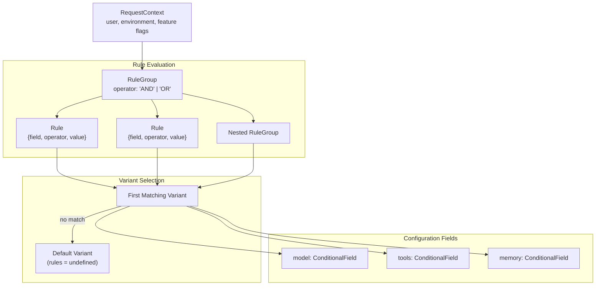
```mermaid
graph TB
    RequestContext["RequestContext<br/>user, environment, feature flags"]

    subgraph "Rule Evaluation"
        RuleGroup["RuleGroup<br/>operator: 'AND' | 'OR'"]
        Rule1["Rule<br/>{field, operator, value}"]
        Rule2["Rule<br/>{field, operator, value}"]
        Nested["Nested RuleGroup"]
    end

    subgraph "Variant Selection"
        Match["First Matching Variant"]
        Fallback["Default Variant<br/>(rules = undefined)"]
    end

    subgraph "Configuration Fields"
        ModelConfig["model: ConditionalField"]
        ToolConfig["tools: ConditionalField"]
        MemoryConfig["memory: ConditionalField"]
    end

    RequestContext --> RuleGroup
    RuleGroup --> Rule1
    RuleGroup --> Rule2
    RuleGroup --> Nested

    Rule1 --> Match
    Rule2 --> Match
    Nested --> Match
    Match -->|no match| Fallback

    Match --> ModelConfig
    Match --> ToolConfig
    Match --> MemoryConfig
```

**Example: User Tier-Based Model Selection**

```typescript
{
  model: [
    {
      variant: { provider: 'openai', name: 'gpt-4' },
      rules: {
        operator: 'AND',
        conditions: [
          { field: 'user.tier', operator: 'equals', value: 'premium' },
        ],
      },
    },
    {
      variant: { provider: 'openai', name: 'gpt-3.5-turbo' },
      // No rules = default fallback
    },
  ]
}
```

**Sources:**

- [client-sdks/client-js/src/types.ts:798-805]()
- [client-sdks/client-js/src/types.ts:823-839]()

---

## Memory Configuration Serialization

Memory configuration must be serializable for storage, replacing runtime instances with string identifiers that are hydrated during agent resolution.

### SerializedMemoryConfig Structure

| Field                    | Type                                             | Description                                |
| ------------------------ | ------------------------------------------------ | ------------------------------------------ |
| `vector`                 | `string \| false`                                | Vector database identifier or disabled     |
| `embedder`               | `string`                                         | Embedding model in `provider/model` format |
| `embedderOptions`        | `Record<string, unknown>`                        | Embedder configuration                     |
| `options.readOnly`       | `boolean`                                        | Disable write operations                   |
| `options.lastMessages`   | `number \| false`                                | Message window size                        |
| `options.semanticRecall` | `boolean \| SemanticRecallConfig`                | Vector search configuration                |
| `options.generateTitle`  | `TitleGenerationConfig`                          | Thread title generation                    |
| `observationalMemory`    | `boolean \| SerializedObservationalMemoryConfig` | Long-term memory compression               |

### Semantic Recall Configuration

```typescript
interface SemanticRecallConfig {
  topK: number // Results to retrieve
  messageRange: number | { before; after } // Context window
  scope?: 'thread' | 'resource' // Search scope
  threshold?: number // Similarity threshold
  indexName?: string // Vector index name
}
```

### Observational Memory Serialization

```typescript
interface SerializedObservationalMemoryConfig {
  model?: string // Observer/reflector model
  scope?: 'resource' | 'thread' // Memory scope
  shareTokenBudget?: boolean // Budget sharing
  observation?: SerializedObservationConfig // Observer settings
  reflection?: SerializedReflectionConfig // Reflector settings
}
```

**Sources:**

- [client-sdks/client-js/src/types.ts:681-712]()
- [client-sdks/client-js/src/types.ts:626-633]()
- [client-sdks/client-js/src/types.ts:650-679]()

---

## Model and Default Options Serialization

Agent model configuration and execution options must be serializable for storage. Model specifications support multiple formats for flexibility.

### Model Configuration

Stored agents use a simplified model configuration structure:

```typescript
interface StoredModelConfig {
  provider: string // Provider ID (e.g., 'openai', 'anthropic')
  name: string // Model name (e.g., 'gpt-4', 'claude-3')
  [key: string]: unknown // Provider-specific options
}
```

### Default Execution Options

The `DefaultOptions` interface captures serializable execution parameters:

| Category          | Fields                                                                                                                   |
| ----------------- | ------------------------------------------------------------------------------------------------------------------------ |
| **Execution**     | `runId`, `savePerStep`, `maxSteps`, `maxProcessorRetries`                                                                |
| **Tools**         | `activeTools`, `toolChoice`, `requireToolApproval`, `autoResumeSuspendedTools`, `toolCallConcurrency`                    |
| **Model**         | `temperature`, `maxTokens`, `topP`, `topK`, `frequencyPenalty`, `presencePenalty`, `stopSequences`, `seed`, `maxRetries` |
| **Observability** | `tracingOptions`, `returnScorerData`, `includeRawChunks`                                                                 |

**Sources:**

- [client-sdks/client-js/src/types.ts:714-747]()
- [client-sdks/client-js/src/types.ts:823-827]()

---

## Tool and Integration Configuration

Stored agents reference tools, workflows, and integrations through configuration objects that support description overrides and rule-based filtering.

### Tool Configuration Schema

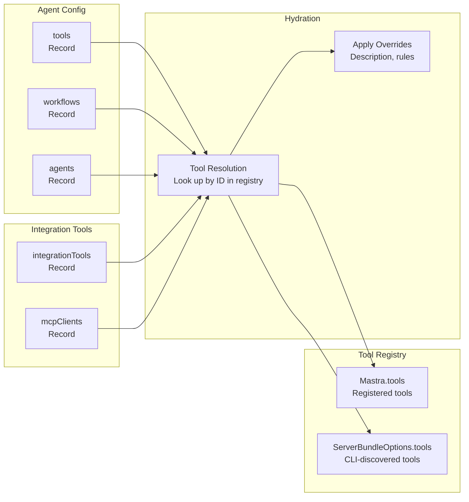
```mermaid
graph LR
    subgraph "Agent Config"
        Tools["tools<br/>Record<string, StoredAgentToolConfig>"]
        Workflows["workflows<br/>Record<string, StoredAgentToolConfig>"]
        Agents["agents<br/>Record<string, StoredAgentToolConfig>"]
    end

    subgraph "Integration Tools"
        IntegrationTools["integrationTools<br/>Record<string, StoredMCPClientToolsConfig>"]
        MCPClients["mcpClients<br/>Record<string, StoredMCPClientToolsConfig>"]
    end

    subgraph "Tool Registry"
        MastraTools["Mastra.tools<br/>Registered tools"]
        BundledTools["ServerBundleOptions.tools<br/>CLI-discovered tools"]
    end

    subgraph "Hydration"
        ResolveTools["Tool Resolution<br/>Look up by ID in registry"]
        ApplyOverrides["Apply Overrides<br/>Description, rules"]
    end

    Tools --> ResolveTools
    Workflows --> ResolveTools
    Agents --> ResolveTools
    IntegrationTools --> ResolveTools
    MCPClients --> ResolveTools

    ResolveTools --> MastraTools
    ResolveTools --> BundledTools
    ResolveTools --> ApplyOverrides
```

**StoredAgentToolConfig:**

```typescript
interface StoredAgentToolConfig {
  description?: string // Override default description
  rules?: RuleGroup // Conditional availability
}
```

**StoredMCPClientToolsConfig:**

```typescript
interface StoredMCPClientToolsConfig {
  tools?: Record<string, StoredAgentToolConfig> // Tool-level config
  // When omitted, all tools from the source are included
}
```

**Sources:**

- [client-sdks/client-js/src/types.ts:750-765]()
- [packages/deployer/src/server/index.ts:78-88]()

---

## Skills and Workspace References

Stored agents can reference skills and workspaces, with skills supporting version pinning and resolution strategies for controlled updates.

### Skill Configuration

```typescript
interface StoredAgentSkillConfig {
  description?: string // Override skill description
  instructions?: string // Override skill instructions
  pin?: string // Pin to specific version ID
  strategy?: 'latest' | 'live' // Version resolution strategy
}
```

**Resolution Strategies:**

| Strategy           | Behavior                                            | Use Case            |
| ------------------ | --------------------------------------------------- | ------------------- |
| `latest`           | Resolves to `activeVersionId`, honors rollback      | Production agents   |
| `live`             | Reads directly from filesystem, bypasses blob store | Development/testing |
| `pin: <versionId>` | Locks to specific version, immune to publishes      | Stable dependencies |

### Workspace References

```typescript
type StoredWorkspaceRef =
  | { type: 'id'; workspaceId: string } // Reference by ID
  | { type: 'inline'; config: Record<string, unknown> } // Inline config
```

**Sources:**

- [client-sdks/client-js/src/types.ts:778-787]()
- [client-sdks/client-js/src/types.ts:793-795]()
- [stores/pg/CHANGELOG.md:37-56]()

---

## Editor API Operations

The Editor API provides CRUD operations for stored agents through the `mastra.getEditor()?.agent` namespace. All operations return stored agent responses with full version metadata.

### Operation Mapping

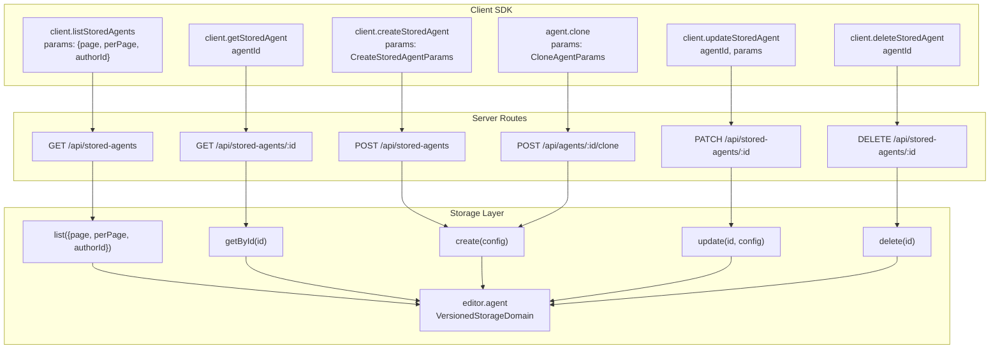
```mermaid
graph TB
    subgraph "Client SDK"
        ListStoredAgents["client.listStoredAgents<br/>params: {page, perPage, authorId}"]
        GetStoredAgent["client.getStoredAgent<br/>agentId"]
        CreateStoredAgent["client.createStoredAgent<br/>params: CreateStoredAgentParams"]
        UpdateStoredAgent["client.updateStoredAgent<br/>agentId, params"]
        DeleteStoredAgent["client.deleteStoredAgent<br/>agentId"]
        CloneAgent["agent.clone<br/>params: CloneAgentParams"]
    end

    subgraph "Server Routes"
        ListRoute["GET /api/stored-agents"]
        GetRoute["GET /api/stored-agents/:id"]
        CreateRoute["POST /api/stored-agents"]
        UpdateRoute["PATCH /api/stored-agents/:id"]
        DeleteRoute["DELETE /api/stored-agents/:id"]
        CloneRoute["POST /api/agents/:id/clone"]
    end

    subgraph "Storage Layer"
        AgentDomain["editor.agent<br/>VersionedStorageDomain"]
        List["list({page, perPage, authorId})"]
        GetById["getById(id)"]
        Create["create(config)"]
        Update["update(id, config)"]
        Delete["delete(id)"]
    end

    ListStoredAgents --> ListRoute
    GetStoredAgent --> GetRoute
    CreateStoredAgent --> CreateRoute
    UpdateStoredAgent --> UpdateRoute
    DeleteStoredAgent --> DeleteRoute
    CloneAgent --> CloneRoute

    ListRoute --> List
    GetRoute --> GetById
    CreateRoute --> Create
    UpdateRoute --> Update
    DeleteRoute --> Delete
    CloneRoute --> Create

    List --> AgentDomain
    GetById --> AgentDomain
    Create --> AgentDomain
    Update --> AgentDomain
    Delete --> AgentDomain
```

**List Parameters:**

| Field               | Type                         | Description              |
| ------------------- | ---------------------------- | ------------------------ |
| `page`              | `number`                     | Zero-indexed page number |
| `perPage`           | `number`                     | Results per page         |
| `orderBy.field`     | `'createdAt' \| 'updatedAt'` | Sort field               |
| `orderBy.direction` | `'ASC' \| 'DESC'`            | Sort direction           |
| `authorId`          | `string`                     | Filter by author         |
| `metadata`          | `Record<string, unknown>`    | Filter by metadata       |

**Sources:**

- [client-sdks/client-js/src/types.ts:845-866]()
- [client-sdks/client-js/src/types.ts:869-882]()
- [client-sdks/client-js/src/client.ts:225-234]()

---

## Agent Cloning

Agent cloning enables converting code-defined agents to stored agents, capturing the current configuration including dynamic values resolved from request context.

### Clone Flow

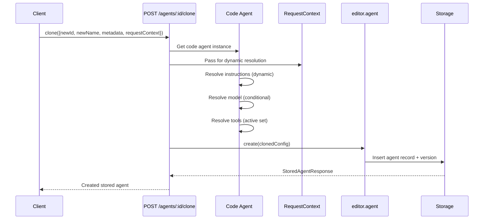
```mermaid
sequenceDiagram
    participant Client
    participant API as POST /agents/:id/clone
    participant Agent as Code Agent
    participant RequestContext
    participant Editor as editor.agent
    participant Storage

    Client->>API: clone({newId, newName, metadata, requestContext})
    API->>Agent: Get code agent instance
    API->>RequestContext: Pass for dynamic resolution
    Agent->>Agent: Resolve instructions (dynamic)
    Agent->>Agent: Resolve model (conditional)
    Agent->>Agent: Resolve tools (active set)
    API->>Editor: create(clonedConfig)
    Editor->>Storage: Insert agent record + version
    Storage-->>API: StoredAgentResponse
    API-->>Client: Created stored agent
```

**Clone Parameters:**

```typescript
interface CloneAgentParams {
  newId?: string // Derived from name if omitted
  newName?: string // Defaults to "{name} (Clone)"
  metadata?: Record<string, unknown> // Additional metadata
  authorId?: string // Author identifier
  requestContext?: RequestContext // For dynamic resolution
}
```

**Dynamic Resolution During Clone:**

When cloning, the system resolves dynamic agent configuration using the provided `requestContext`:

1. **Instructions**: Template variables (e.g., `<userId>`) are replaced with actual values
2. **Model**: Conditional model selection is evaluated
3. **Tools**: Active tools subset is captured
4. **Memory**: Current memory configuration is serialized
5. **Options**: Default execution options are captured

**Sources:**

- [client-sdks/client-js/src/types.ts:869-882]()
- [client-sdks/client-js/src/resources/agent.ts:209-222]()

---

## Agent Resolution and Hydration

When a stored agent is retrieved, it must be hydrated from its serialized configuration into a runtime `Agent` instance. This involves resolving references, deserializing memory configuration, and evaluating conditional fields.

### Hydration Pipeline

```mermaid
graph TB
    subgraph "Retrieval"
        GetById["editor.agent.getById<br/>agentId"]
        AgentRecord["Agent Record<br/>status, activeVersionId"]
        VersionSnapshot["Version Snapshot<br/>serialized config"]
    end

    subgraph "Deserialization"
        ParseMemory["Deserialize Memory<br/>vector string → MastraVector<br/>embedder string → Model"]
        ParseModel["Parse Model<br/>'provider/model' → LanguageModel"]
        EvalConditional["Evaluate ConditionalFields<br/>requestContext rules"]
    end

    subgraph "Resolution"
        ResolveTools["Resolve Tools<br/>Lookup in Mastra registry"]
        ResolveSkills["Resolve Skills<br/>Version strategy + hydration"]
        ResolveWorkspace["Resolve Workspace<br/>ID lookup or inline config"]
        ResolveMCP["Resolve MCP Clients<br/>Server config hydration"]
    end

    subgraph "Construction"
        BuildAgent["new Agent({<br/>  ...config,<br/>  memory: hydratedMemory,<br/>  model: hydratedModel,<br/>  tools: resolvedTools<br/>})"]
        SetMetadata["Set metadata:<br/>source: 'stored'<br/>status, activeVersionId"]
    end

    GetById --> AgentRecord
    AgentRecord --> VersionSnapshot

    VersionSnapshot --> ParseMemory
    VersionSnapshot --> ParseModel
    VersionSnapshot --> EvalConditional

    ParseMemory --> ResolveTools
    ParseModel --> ResolveTools
    EvalConditional --> ResolveTools

    ResolveTools --> ResolveSkills
    ResolveSkills --> ResolveWorkspace
    ResolveWorkspace --> ResolveMCP

    ResolveMCP --> BuildAgent
    BuildAgent --> SetMetadata
    SetMetadata --> AgentInstance["Agent Instance<br/>ready for execution"]
```

**Resolution Precedence:**

For each resource type (tools, skills, workspaces), the hydration process follows this lookup order:

1. **Mastra Registry**: `mastra.tools`, `mastra.workflows`, `mastra.agents`
2. **Bundled Tools**: Tools discovered by CLI bundler (in `options.tools`)
3. **Editor Storage**: Stored definitions (skills, workspaces, MCP clients)
4. **Runtime Creation**: Dynamically construct from configuration

**Sources:**

- [packages/server/src/server/handlers/agents.ts:546-595]()
- [packages/deployer/src/server/index.ts:78-88]()

---

## Version Management Operations

Stored agents support version operations including publishing, rollback, and draft management.

### Version Operations

| Operation          | Method                                                | Effect                                                         |
| ------------------ | ----------------------------------------------------- | -------------------------------------------------------------- |
| **Create Draft**   | `update(id, config)` with `activeVersionId` unchanged | Creates new `resolvedVersionId`, sets `hasDraft = true`        |
| **Publish**        | `update(id, {activeVersionId: resolvedVersionId})`    | Sets `activeVersionId = resolvedVersionId`, `hasDraft = false` |
| **Rollback**       | `update(id, {activeVersionId: previousVersionId})`    | Switches active version without creating new snapshot          |
| **Get History**    | `getVersions(agentId)`                                | Returns list of all version snapshots                          |
| **Delete Version** | `deleteVersion(agentId, versionId)`                   | Removes version snapshot (if not active)                       |

**Draft Detection Logic:**

```typescript
const hasDraft = !!(
  agent.resolvedVersionId &&
  agent.activeVersionId &&
  agent.resolvedVersionId !== agent.activeVersionId
)
```

**Sources:**

- [packages/server/src/server/handlers/agents.ts:538-543]()
- [client-sdks/client-js/src/types.ts:810-841]()

---

## Processor Graph Storage

Stored agents support processor graphs for input and output processing pipelines, enabling complex data transformation workflows to be persisted alongside agent configuration.

### StoredProcessorGraph Structure

```typescript
interface StoredProcessorGraph {
  processors: Array<{
    id: string
    name?: string
    config?: Record<string, unknown>
  }>
  composition?: 'sequential' | 'parallel'
}
```

**Processor Resolution:**

During agent hydration, processor IDs are resolved to actual processor instances:

1. **Built-in Processors**: `UnicodeNormalizer`, `TokenLimiterProcessor`, etc.
2. **Memory Processors**: Auto-generated from memory configuration
3. **Custom Processors**: Registered in `Mastra.processors`
4. **Processor Workflows**: Multi-step processor compositions

**Sources:**

- [stores/pg/CHANGELOG.md:11]()
- [packages/server/src/server/handlers/agents.ts:464-474]()

---

## Request Context Schema Validation

Stored agents can define a `requestContextSchema` to validate request context at runtime, ensuring dynamic configuration receives correctly shaped data.

### Schema Definition

```typescript
interface StoredAgentResponse {
  // ... other fields
  requestContextSchema?: Record<string, unknown> // JSON Schema
}
```

**Validation Flow:**

```mermaid
graph LR
    Request["Incoming Request<br/>requestContext data"]
    Schema["requestContextSchema<br/>JSON Schema definition"]
    Validate["Validate Context<br/>against schema"]
    Accept["Accept: Valid"]
    Reject["Reject: 400 Error"]

    Request --> Validate
    Schema --> Validate
    Validate -->|valid| Accept
    Validate -->|invalid| Reject
    Accept --> Execute["Execute Agent"]
```

**Sources:**

- [client-sdks/client-js/src/types.ts:840]()
- [packages/server/src/server/handlers/agents.ts:501-508]()
