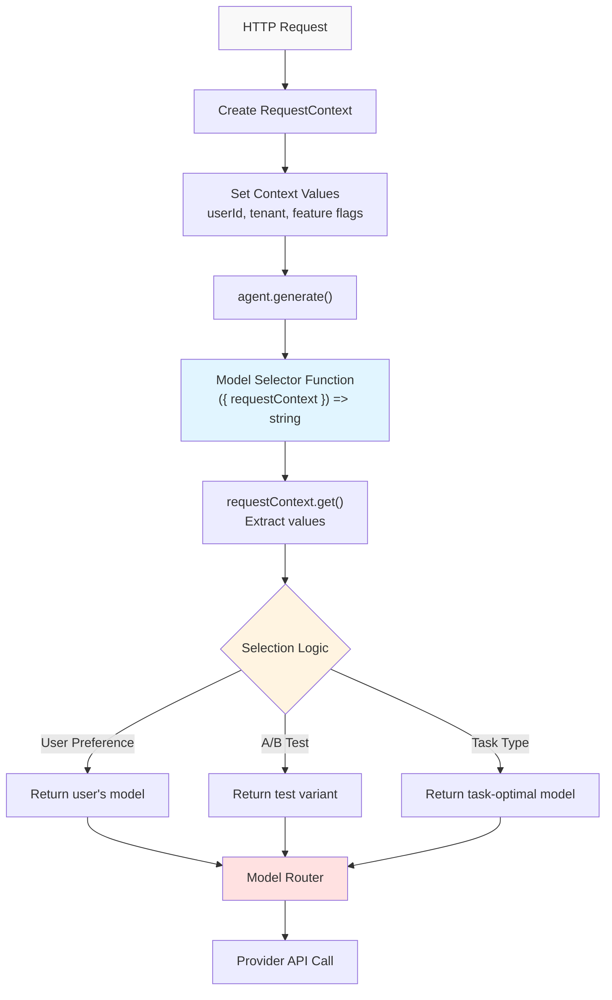
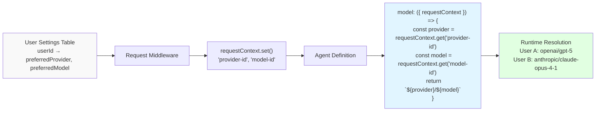
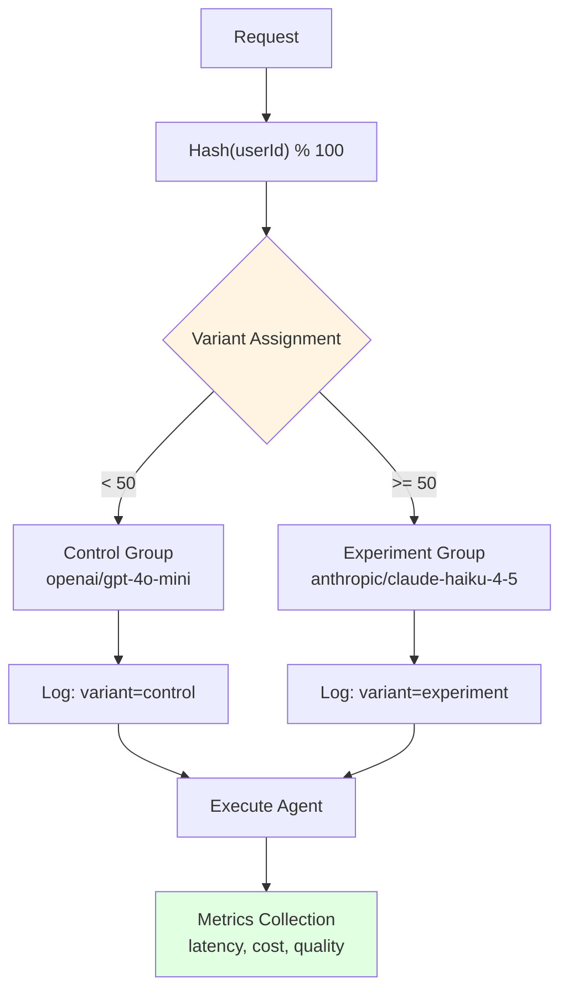
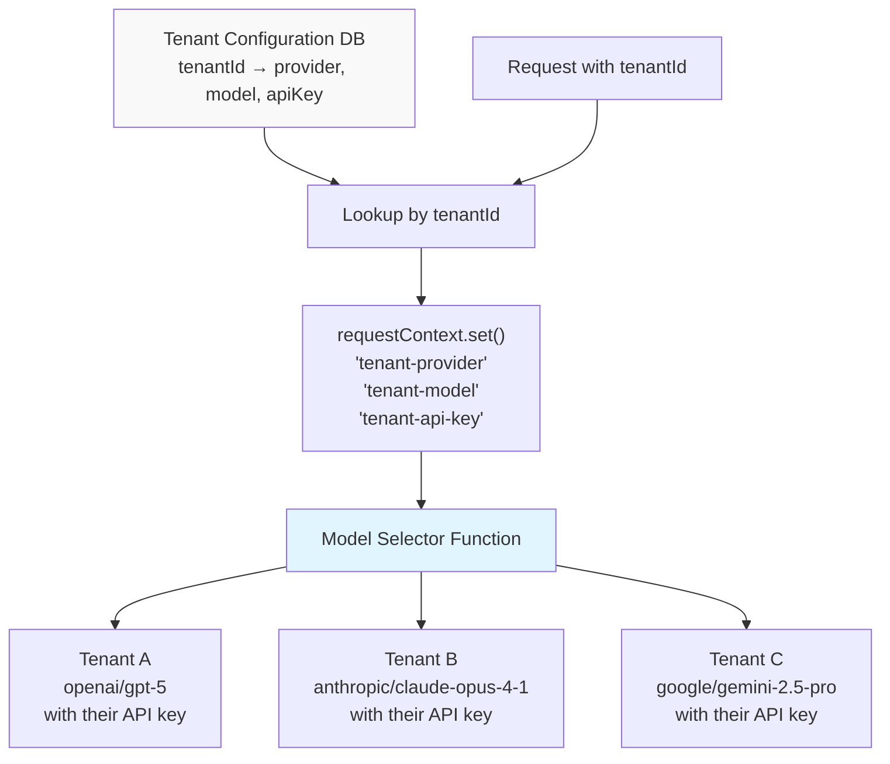
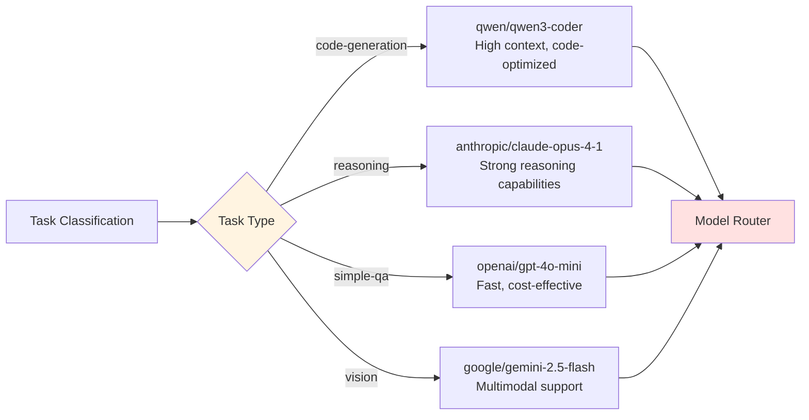
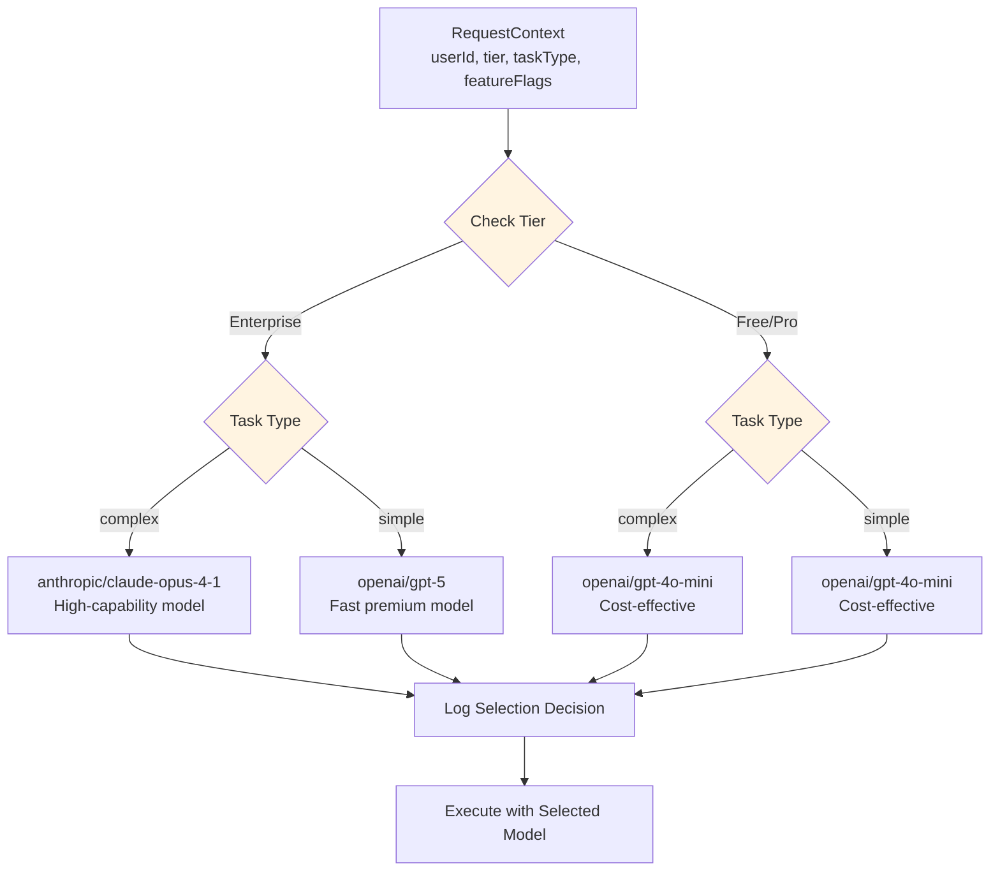

# Dynamic Model Selection

<details>
<summary>Relevant source files</summary>

The following files were used as context for generating this wiki page:

- [docs/src/content/en/models/gateways/index.mdx](docs/src/content/en/models/gateways/index.mdx)
- [docs/src/content/en/models/gateways/netlify.mdx](docs/src/content/en/models/gateways/netlify.mdx)
- [docs/src/content/en/models/gateways/openrouter.mdx](docs/src/content/en/models/gateways/openrouter.mdx)
- [docs/src/content/en/models/gateways/vercel.mdx](docs/src/content/en/models/gateways/vercel.mdx)
- [docs/src/content/en/models/index.mdx](docs/src/content/en/models/index.mdx)
- [docs/src/content/en/models/providers/\_meta.ts](docs/src/content/en/models/providers/_meta.ts)
- [docs/src/content/en/models/providers/alibaba-cn.mdx](docs/src/content/en/models/providers/alibaba-cn.mdx)
- [docs/src/content/en/models/providers/alibaba.mdx](docs/src/content/en/models/providers/alibaba.mdx)
- [docs/src/content/en/models/providers/anthropic.mdx](docs/src/content/en/models/providers/anthropic.mdx)
- [docs/src/content/en/models/providers/baseten.mdx](docs/src/content/en/models/providers/baseten.mdx)
- [docs/src/content/en/models/providers/cerebras.mdx](docs/src/content/en/models/providers/cerebras.mdx)
- [docs/src/content/en/models/providers/chutes.mdx](docs/src/content/en/models/providers/chutes.mdx)
- [docs/src/content/en/models/providers/cortecs.mdx](docs/src/content/en/models/providers/cortecs.mdx)
- [docs/src/content/en/models/providers/deepinfra.mdx](docs/src/content/en/models/providers/deepinfra.mdx)
- [docs/src/content/en/models/providers/github-models.mdx](docs/src/content/en/models/providers/github-models.mdx)
- [docs/src/content/en/models/providers/google.mdx](docs/src/content/en/models/providers/google.mdx)
- [docs/src/content/en/models/providers/groq.mdx](docs/src/content/en/models/providers/groq.mdx)
- [docs/src/content/en/models/providers/index.mdx](docs/src/content/en/models/providers/index.mdx)
- [docs/src/content/en/models/providers/modelscope.mdx](docs/src/content/en/models/providers/modelscope.mdx)
- [docs/src/content/en/models/providers/nano-gpt.mdx](docs/src/content/en/models/providers/nano-gpt.mdx)
- [docs/src/content/en/models/providers/nebius.mdx](docs/src/content/en/models/providers/nebius.mdx)
- [docs/src/content/en/models/providers/nvidia.mdx](docs/src/content/en/models/providers/nvidia.mdx)
- [docs/src/content/en/models/providers/openai.mdx](docs/src/content/en/models/providers/openai.mdx)
- [docs/src/content/en/models/providers/opencode.mdx](docs/src/content/en/models/providers/opencode.mdx)
- [docs/src/content/en/models/providers/perplexity.mdx](docs/src/content/en/models/providers/perplexity.mdx)
- [docs/src/content/en/models/providers/requesty.mdx](docs/src/content/en/models/providers/requesty.mdx)
- [docs/src/content/en/models/providers/scaleway.mdx](docs/src/content/en/models/providers/scaleway.mdx)
- [docs/src/content/en/models/providers/synthetic.mdx](docs/src/content/en/models/providers/synthetic.mdx)
- [docs/src/content/en/models/providers/togetherai.mdx](docs/src/content/en/models/providers/togetherai.mdx)
- [docs/src/content/en/models/providers/upstage.mdx](docs/src/content/en/models/providers/upstage.mdx)
- [docs/src/content/en/models/providers/venice.mdx](docs/src/content/en/models/providers/venice.mdx)
- [docs/src/content/en/models/providers/vultr.mdx](docs/src/content/en/models/providers/vultr.mdx)
- [docs/src/content/en/models/providers/wandb.mdx](docs/src/content/en/models/providers/wandb.mdx)
- [docs/src/content/en/models/providers/xai.mdx](docs/src/content/en/models/providers/xai.mdx)
- [docs/src/content/en/models/providers/zai-coding-plan.mdx](docs/src/content/en/models/providers/zai-coding-plan.mdx)
- [docs/src/content/en/models/providers/zai.mdx](docs/src/content/en/models/providers/zai.mdx)
- [docs/src/content/en/models/providers/zhipuai-coding-plan.mdx](docs/src/content/en/models/providers/zhipuai-coding-plan.mdx)
- [docs/src/content/en/models/providers/zhipuai.mdx](docs/src/content/en/models/providers/zhipuai.mdx)
- [docs/src/content/en/models/sidebars.js](docs/src/content/en/models/sidebars.js)
- [examples/bird-checker-with-express/src/index.ts](examples/bird-checker-with-express/src/index.ts)
- [examples/bird-checker-with-nextjs-and-eval/src/lib/mastra/actions.ts](examples/bird-checker-with-nextjs-and-eval/src/lib/mastra/actions.ts)
- [packages/core/src/action/index.ts](packages/core/src/action/index.ts)
- [packages/core/src/agent/**tests**/utils.test.ts](packages/core/src/agent/__tests__/utils.test.ts)
- [packages/core/src/agent/agent-legacy.ts](packages/core/src/agent/agent-legacy.ts)
- [packages/core/src/agent/agent.test.ts](packages/core/src/agent/agent.test.ts)
- [packages/core/src/agent/agent.ts](packages/core/src/agent/agent.ts)
- [packages/core/src/agent/agent.types.ts](packages/core/src/agent/agent.types.ts)
- [packages/core/src/agent/index.ts](packages/core/src/agent/index.ts)
- [packages/core/src/agent/trip-wire.ts](packages/core/src/agent/trip-wire.ts)
- [packages/core/src/agent/types.ts](packages/core/src/agent/types.ts)
- [packages/core/src/agent/utils.ts](packages/core/src/agent/utils.ts)
- [packages/core/src/agent/workflows/prepare-stream/index.ts](packages/core/src/agent/workflows/prepare-stream/index.ts)
- [packages/core/src/agent/workflows/prepare-stream/map-results-step.ts](packages/core/src/agent/workflows/prepare-stream/map-results-step.ts)
- [packages/core/src/agent/workflows/prepare-stream/prepare-memory-step.ts](packages/core/src/agent/workflows/prepare-stream/prepare-memory-step.ts)
- [packages/core/src/agent/workflows/prepare-stream/prepare-tools-step.ts](packages/core/src/agent/workflows/prepare-stream/prepare-tools-step.ts)
- [packages/core/src/agent/workflows/prepare-stream/stream-step.ts](packages/core/src/agent/workflows/prepare-stream/stream-step.ts)
- [packages/core/src/llm/index.ts](packages/core/src/llm/index.ts)
- [packages/core/src/llm/model/model.test.ts](packages/core/src/llm/model/model.test.ts)
- [packages/core/src/llm/model/model.ts](packages/core/src/llm/model/model.ts)
- [packages/core/src/llm/model/provider-registry.json](packages/core/src/llm/model/provider-registry.json)
- [packages/core/src/llm/model/provider-types.generated.d.ts](packages/core/src/llm/model/provider-types.generated.d.ts)
- [packages/core/src/mastra/index.ts](packages/core/src/mastra/index.ts)
- [packages/core/src/observability/types/tracing.ts](packages/core/src/observability/types/tracing.ts)
- [packages/core/src/stream/aisdk/v5/execute.ts](packages/core/src/stream/aisdk/v5/execute.ts)
- [packages/core/src/tools/tool-builder/builder.test.ts](packages/core/src/tools/tool-builder/builder.test.ts)
- [packages/core/src/tools/tool-builder/builder.ts](packages/core/src/tools/tool-builder/builder.ts)
- [packages/core/src/tools/tool.ts](packages/core/src/tools/tool.ts)
- [packages/core/src/tools/types.ts](packages/core/src/tools/types.ts)

</details>

This document covers function-based model selection in Mastra, enabling runtime model resolution based on request context, user preferences, or execution environment. For static model configuration patterns, see [Model Configuration Patterns](#5.2). For model fallback chains, see [Model Fallbacks and Error Handling](#5.5).

## Overview

Dynamic model selection allows agents to resolve their model configuration at runtime using a function instead of a static string. The function receives contextual information about the request and returns the appropriate model identifier. This enables sophisticated routing patterns without hardcoding model choices.

**Sources:** [docs/src/content/en/models/index.mdx:192-212]()

## Function Signature and Return Values

The model configuration accepts a function with the following signature:

```typescript
type ModelSelector = (context: {
  requestContext: RequestContext
}) => string | ModelConfig
```

The function receives a context object containing `requestContext` and must return either:

- A model string in `provider/model-name` format
- A `ModelConfig` object for advanced configuration

**Return Value Formats:**

| Return Type        | Example                              | Use Case                        |
| ------------------ | ------------------------------------ | ------------------------------- |
| Model String       | `"openai/gpt-5"`                     | Simple provider/model selection |
| Model String       | `"anthropic/claude-opus-4-1"`        | Switch between providers        |
| ModelConfig Object | `{ id: "custom/model", url: "..." }` | Custom endpoints or headers     |

**Sources:** [docs/src/content/en/models/index.mdx:192-204](), [docs/src/content/en/models/providers/opencode.mdx:432-443]()

## Request Context Flow



**Sources:** [docs/src/content/en/models/index.mdx:192-212]()

## Selection Pattern: User Preferences

Users select their preferred model through application settings, stored in the request context.



**Example Implementation:**

The agent definition uses the model selector function:

```typescript
// Agent with user-selectable model
const agent = new Agent({
  id: 'dynamic-assistant',
  model: ({ requestContext }) => {
    const provider = requestContext.get('provider-id')
    const model = requestContext.get('model-id')
    return `${provider}/${model}`
  },
})
```

Context is populated from user preferences during request handling, allowing each user to bring their own model configuration.

**Sources:** [docs/src/content/en/models/index.mdx:195-204]()

## Selection Pattern: A/B Testing

Compare model performance in production by routing a percentage of traffic to different variants.



**Example Implementation:**

```typescript
const agent = new Agent({
  id: 'ab-test-agent',
  model: ({ requestContext }) => {
    const userId = requestContext.get('user-id')
    const variant = hashUserId(userId) % 2

    // 50/50 split between two models
    return variant === 0 ? 'openai/gpt-4o-mini' : 'anthropic/claude-haiku-4-5'
  },
})
```

The consistent hash ensures each user experiences the same model across sessions, enabling valid performance comparisons.

**Sources:** [docs/src/content/en/models/index.mdx:207-209]()

## Selection Pattern: Multi-Tenant Applications

Each tenant (customer organization) configures their own model preferences and API keys.



**Example Implementation:**

```typescript
const agent = new Agent({
  id: 'multi-tenant-agent',
  model: ({ requestContext }) => {
    const provider = requestContext.get('tenant-provider')
    const model = requestContext.get('tenant-model')
    const apiKey = requestContext.get('tenant-api-key')

    return {
      id: `${provider}/${model}`,
      apiKey: apiKey,
    }
  },
})
```

This pattern enables SaaS applications where each customer uses their own LLM provider accounts, avoiding shared rate limits and providing cost isolation.

**Sources:** [docs/src/content/en/models/index.mdx:210-211]()

## Selection Pattern: Task-Based Selection

Route different task types to models optimized for those workloads.



**Example Implementation:**

```typescript
const agent = new Agent({
  id: 'task-optimized-agent',
  model: ({ requestContext }) => {
    const taskType = requestContext.get('task-type')

    const modelMap = {
      'code-generation': 'qwen/qwen3-coder',
      reasoning: 'anthropic/claude-opus-4-1',
      'simple-qa': 'openai/gpt-4o-mini',
      vision: 'google/gemini-2.5-flash',
    }

    return modelMap[taskType] || 'openai/gpt-4o-mini'
  },
})
```

Task classification can happen upstream in the request pipeline, with the task type set in the context before agent execution.

**Sources:** [docs/src/content/en/models/providers/opencode.mdx:432-443]()

## Integration with Model Configuration

Dynamic selection works with all model configuration options, including custom headers and advanced settings.

**Returning Advanced Configuration:**

```typescript
const agent = new Agent({
  id: 'advanced-dynamic-agent',
  model: ({ requestContext }) => {
    const orgId = requestContext.get('org-id')
    const useAdvanced = requestContext.get('use-advanced-model')

    if (useAdvanced) {
      return {
        id: 'openai/gpt-5',
        apiKey: process.env.OPENAI_API_KEY,
        headers: {
          'OpenAI-Organization': orgId,
        },
      }
    }

    return 'openai/gpt-4o-mini'
  },
})
```

The function can return either a simple string or a full `ModelConfig` object with custom headers, API keys, and base URLs.

**Sources:** [docs/src/content/en/models/index.mdx:251-263]()

## Pattern Composition

Multiple selection criteria can be combined in a single function:



**Example Implementation:**

```typescript
const agent = new Agent({
  id: 'tiered-agent',
  model: ({ requestContext }) => {
    const userTier = requestContext.get('user-tier')
    const taskComplexity = requestContext.get('task-complexity')

    // Enterprise users get best models
    if (userTier === 'enterprise') {
      return taskComplexity === 'complex'
        ? 'anthropic/claude-opus-4-1'
        : 'openai/gpt-5'
    }

    // Free/Pro users get cost-effective models
    return 'openai/gpt-4o-mini'
  },
})
```

**Sources:** [docs/src/content/en/models/index.mdx:192-211]()

## Best Practices

| Practice                    | Rationale                                                                        |
| --------------------------- | -------------------------------------------------------------------------------- |
| **Cache Model Lookups**     | Avoid database queries on every request by caching tenant/user model preferences |
| **Provide Defaults**        | Always have a fallback model when context values are missing                     |
| **Log Selection Decisions** | Record which model was selected for debugging and analytics                      |
| **Validate Context Values** | Check that provider/model combinations exist before returning                    |
| **Use Type-Safe Accessors** | Define TypeScript interfaces for your context keys                               |
| **Test Edge Cases**         | Verify behavior when context is missing or contains invalid values               |

**Error Handling Pattern:**

```typescript
const agent = new Agent({
  id: 'safe-dynamic-agent',
  model: ({ requestContext }) => {
    try {
      const provider = requestContext.get('provider-id')
      const model = requestContext.get('model-id')

      // Validate both values exist
      if (!provider || !model) {
        console.warn('Missing provider or model in context, using default')
        return 'openai/gpt-4o-mini'
      }

      return `${provider}/${model}`
    } catch (error) {
      console.error('Model selection error:', error)
      return 'openai/gpt-4o-mini' // Safe fallback
    }
  },
})
```

**Sources:** [docs/src/content/en/models/index.mdx:192-211]()

## Interaction with Model Fallbacks

Dynamic selection can be combined with model fallback arrays:

```typescript
const agent = new Agent({
  id: 'dynamic-with-fallbacks',
  model: ({ requestContext }) => {
    const userPreferred = requestContext.get('preferred-model')

    // Return fallback array with user preference first
    return [
      { model: userPreferred || 'openai/gpt-5', maxRetries: 3 },
      { model: 'anthropic/claude-opus-4-1', maxRetries: 2 },
      { model: 'openai/gpt-4o-mini', maxRetries: 2 },
    ]
  },
})
```

The function can return a model array instead of a single model, enabling both dynamic selection and automatic failover.

**Sources:** [docs/src/content/en/models/index.mdx:276-297]()
