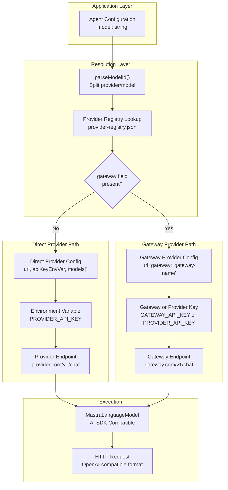
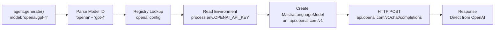
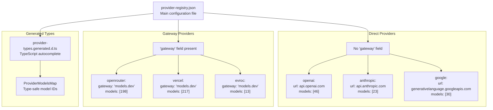
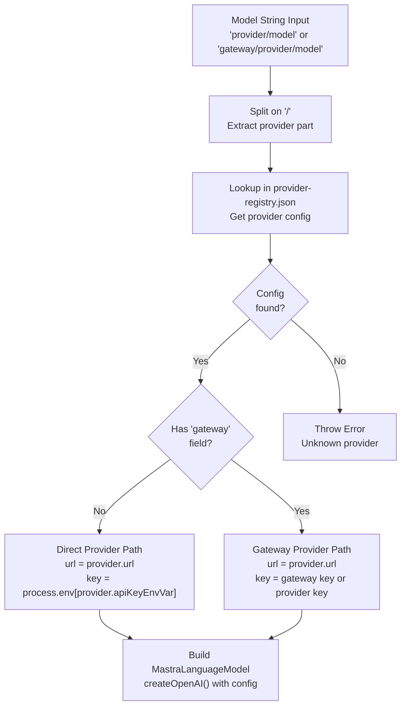

# Gateway vs Direct Providers

<details>
<summary>Relevant source files</summary>

The following files were used as context for generating this wiki page:

- [docs/src/content/en/models/gateways/index.mdx](docs/src/content/en/models/gateways/index.mdx)
- [docs/src/content/en/models/gateways/netlify.mdx](docs/src/content/en/models/gateways/netlify.mdx)
- [docs/src/content/en/models/gateways/openrouter.mdx](docs/src/content/en/models/gateways/openrouter.mdx)
- [docs/src/content/en/models/gateways/vercel.mdx](docs/src/content/en/models/gateways/vercel.mdx)
- [docs/src/content/en/models/index.mdx](docs/src/content/en/models/index.mdx)
- [docs/src/content/en/models/providers/\_meta.ts](docs/src/content/en/models/providers/_meta.ts)
- [docs/src/content/en/models/providers/alibaba-cn.mdx](docs/src/content/en/models/providers/alibaba-cn.mdx)
- [docs/src/content/en/models/providers/alibaba.mdx](docs/src/content/en/models/providers/alibaba.mdx)
- [docs/src/content/en/models/providers/anthropic.mdx](docs/src/content/en/models/providers/anthropic.mdx)
- [docs/src/content/en/models/providers/baseten.mdx](docs/src/content/en/models/providers/baseten.mdx)
- [docs/src/content/en/models/providers/cerebras.mdx](docs/src/content/en/models/providers/cerebras.mdx)
- [docs/src/content/en/models/providers/chutes.mdx](docs/src/content/en/models/providers/chutes.mdx)
- [docs/src/content/en/models/providers/cortecs.mdx](docs/src/content/en/models/providers/cortecs.mdx)
- [docs/src/content/en/models/providers/deepinfra.mdx](docs/src/content/en/models/providers/deepinfra.mdx)
- [docs/src/content/en/models/providers/github-models.mdx](docs/src/content/en/models/providers/github-models.mdx)
- [docs/src/content/en/models/providers/google.mdx](docs/src/content/en/models/providers/google.mdx)
- [docs/src/content/en/models/providers/groq.mdx](docs/src/content/en/models/providers/groq.mdx)
- [docs/src/content/en/models/providers/index.mdx](docs/src/content/en/models/providers/index.mdx)
- [docs/src/content/en/models/providers/modelscope.mdx](docs/src/content/en/models/providers/modelscope.mdx)
- [docs/src/content/en/models/providers/nano-gpt.mdx](docs/src/content/en/models/providers/nano-gpt.mdx)
- [docs/src/content/en/models/providers/nebius.mdx](docs/src/content/en/models/providers/nebius.mdx)
- [docs/src/content/en/models/providers/nvidia.mdx](docs/src/content/en/models/providers/nvidia.mdx)
- [docs/src/content/en/models/providers/openai.mdx](docs/src/content/en/models/providers/openai.mdx)
- [docs/src/content/en/models/providers/opencode.mdx](docs/src/content/en/models/providers/opencode.mdx)
- [docs/src/content/en/models/providers/perplexity.mdx](docs/src/content/en/models/providers/perplexity.mdx)
- [docs/src/content/en/models/providers/requesty.mdx](docs/src/content/en/models/providers/requesty.mdx)
- [docs/src/content/en/models/providers/scaleway.mdx](docs/src/content/en/models/providers/scaleway.mdx)
- [docs/src/content/en/models/providers/synthetic.mdx](docs/src/content/en/models/providers/synthetic.mdx)
- [docs/src/content/en/models/providers/togetherai.mdx](docs/src/content/en/models/providers/togetherai.mdx)
- [docs/src/content/en/models/providers/upstage.mdx](docs/src/content/en/models/providers/upstage.mdx)
- [docs/src/content/en/models/providers/venice.mdx](docs/src/content/en/models/providers/venice.mdx)
- [docs/src/content/en/models/providers/vultr.mdx](docs/src/content/en/models/providers/vultr.mdx)
- [docs/src/content/en/models/providers/wandb.mdx](docs/src/content/en/models/providers/wandb.mdx)
- [docs/src/content/en/models/providers/xai.mdx](docs/src/content/en/models/providers/xai.mdx)
- [docs/src/content/en/models/providers/zai-coding-plan.mdx](docs/src/content/en/models/providers/zai-coding-plan.mdx)
- [docs/src/content/en/models/providers/zai.mdx](docs/src/content/en/models/providers/zai.mdx)
- [docs/src/content/en/models/providers/zhipuai-coding-plan.mdx](docs/src/content/en/models/providers/zhipuai-coding-plan.mdx)
- [docs/src/content/en/models/providers/zhipuai.mdx](docs/src/content/en/models/providers/zhipuai.mdx)
- [docs/src/content/en/models/sidebars.js](docs/src/content/en/models/sidebars.js)
- [packages/core/src/llm/model/provider-registry.json](packages/core/src/llm/model/provider-registry.json)
- [packages/core/src/llm/model/provider-types.generated.d.ts](packages/core/src/llm/model/provider-types.generated.d.ts)

</details>

This page explains the distinction between gateway and direct model providers in Mastra's provider system, how they're configured differently, and when to use each type.

For information about the overall model provider system and catalog, see [Provider Registry and Model Catalog](#5.1). For details on configuring individual models, see [Model Configuration Patterns](#5.2).

## Provider Type Overview

Mastra supports two types of model providers:

1. **Direct Providers**: First-party APIs from model creators (OpenAI, Anthropic, Google, etc.) that provide direct access to their models
2. **Gateway Providers**: Aggregation services (OpenRouter, Vercel, Netlify) that proxy requests to multiple underlying providers and add middleware features

The provider type affects API endpoint routing, authentication patterns, model ID formats, and available features.

**Provider Type Architecture**



**Sources:** [packages/core/src/llm/model/provider-registry.json:1-1352](), [docs/src/content/en/models/index.mdx:1-358](), [docs/src/content/en/models/gateways/index.mdx:1-44]()

## Direct Providers

Direct providers are first-party APIs from model creators. Each provider exposes their own models through their official API endpoints.

### Configuration

Direct providers in the registry have no `gateway` field and specify their own API endpoint:

| Field          | Description                      | Example                              |
| -------------- | -------------------------------- | ------------------------------------ |
| `url`          | Provider's API base URL          | `"https://api.openai.com/v1"`        |
| `apiKeyEnvVar` | Environment variable for API key | `"OPENAI_API_KEY"`                   |
| `apiKeyHeader` | HTTP header for authentication   | `"Authorization"`                    |
| `name`         | Display name                     | `"OpenAI"`                           |
| `models`       | Array of model IDs               | `["gpt-4", "gpt-4-turbo", ...]`      |
| `docUrl`       | Provider documentation           | `"https://platform.openai.com/docs"` |

**Example from Registry:**

```typescript
// From provider-registry.json
{
  "openai": {
    "url": "https://api.openai.com/v1",
    "apiKeyEnvVar": "OPENAI_API_KEY",
    "apiKeyHeader": "Authorization",
    "name": "OpenAI",
    "models": [
      "gpt-4",
      "gpt-4-turbo",
      "gpt-4o",
      // ... more models
    ],
    "docUrl": "https://platform.openai.com/docs/models"
  }
}
```

### Model Access Pattern

Direct provider models use a two-part identifier: `provider/model-name`

```typescript
// Direct provider usage
const agent = new Agent({
  id: 'assistant',
  model: 'openai/gpt-4-turbo', // provider/model
})

const agent2 = new Agent({
  id: 'assistant2',
  model: 'anthropic/claude-3.5-sonnet', // provider/model
})
```

**Request Flow for Direct Providers:**



### Authentication

Each direct provider requires its own API key:

```bash
# .env file
OPENAI_API_KEY=sk-proj-...
ANTHROPIC_API_KEY=sk-ant-...
GOOGLE_GENERATIVE_AI_API_KEY=...
DEEPSEEK_API_KEY=...
```

The `apiKeyEnvVar` field in the registry determines which environment variable to read. Mastra automatically constructs the `Authorization` header using the value from that variable.

### Use Cases for Direct Providers

**When to use direct providers:**

- **Full Feature Access**: Provider-specific features not available through gateways (e.g., OpenAI's `reasoningEffort`, Anthropic's prompt caching)
- **Lower Latency**: No gateway hop, direct connection to provider
- **Provider Relationship**: Direct billing relationship with provider
- **Compliance Requirements**: Data must go directly to provider without intermediaries
- **Latest Models**: Immediate access to newly released models without gateway support lag

**Example with provider-specific features:**

```typescript
const agent = new Agent({
  id: 'planner',
  model: 'openai/o3-pro',
  instructions: {
    role: 'system',
    content: 'You are a planning assistant',
    providerOptions: {
      // OpenAI-specific reasoningEffort only works with direct provider
      openai: { reasoningEffort: 'high' },
    },
  },
})
```

**Sources:** [packages/core/src/llm/model/provider-registry.json:2143-2170](), [docs/src/content/en/models/providers/openai.mdx:1-358](), [docs/src/content/en/models/index.mdx:214-245]()

## Gateway Providers

Gateway providers aggregate multiple model providers and add middleware features like caching, rate limiting, analytics, and automatic failover.

### Configuration

Gateway providers in the registry include a `gateway` field indicating they proxy to other providers:

| Field          | Description                          | Example                               |
| -------------- | ------------------------------------ | ------------------------------------- |
| `url`          | Gateway's API endpoint               | `"https://openrouter.ai/api/v1"`      |
| `apiKeyEnvVar` | Gateway API key variable             | `"OPENROUTER_API_KEY"`                |
| `apiKeyHeader` | HTTP header for auth                 | `"Authorization"`                     |
| `name`         | Display name                         | `"OpenRouter"`                        |
| `models`       | Array of provider/model combinations | `["anthropic/claude-3.5-haiku", ...]` |
| `gateway`      | Marker field                         | `"models.dev"` or provider type       |
| `docUrl`       | Gateway documentation                | `"https://openrouter.ai/docs"`        |

**Example from Registry:**

```typescript
// Gateway provider with 'gateway' field
{
  "openrouter": {
    "url": "https://openrouter.ai/api/v1",
    "apiKeyEnvVar": "OPENROUTER_API_KEY",
    "apiKeyHeader": "Authorization",
    "name": "OpenRouter",
    "models": [
      "anthropic/claude-3.5-haiku",
      "openai/gpt-4",
      "google/gemini-2.5-flash",
      // ... 198 models from various providers
    ],
    "docUrl": "https://openrouter.ai/models",
    "gateway": "models.dev"  // Marker indicating this is a gateway
  }
}
```

**Built-in Gateways:**

| Gateway      | Model Count | Special Configuration                        |
| ------------ | ----------- | -------------------------------------------- |
| OpenRouter   | 198         | Standard gateway pattern                     |
| Vercel       | 217         | Uses `AI_GATEWAY_API_KEY`                    |
| Netlify      | 63          | Requires `NETLIFY_TOKEN` + `NETLIFY_SITE_ID` |
| Azure OpenAI | Variable    | Deployment-name based routing                |

### Model Access Pattern

Gateway provider models use a three-part identifier: `gateway/provider/model-name`

```typescript
// Gateway provider usage - three-part ID
const agent = new Agent({
  id: 'assistant',
  model: 'openrouter/anthropic/claude-haiku-4-5', // gateway/provider/model
})

const agent2 = new Agent({
  id: 'assistant2',
  model: 'vercel/google/gemini-2.5-flash', // gateway/provider/model
})
```

**Request Flow for Gateway Providers:**

```mermaid
graph LR
    AgentCall["agent.generate()<br/>model: 'openrouter/anthropic/claude-3.5'"]
    Parse["Parse Model ID<br/>'openrouter' + 'anthropic/claude-3.5'"]
    Lookup["Registry Lookup<br/>openrouter config<br/>gateway: 'models.dev'"]
    EnvCheck["Read Environment<br/>OPENROUTER_API_KEY<br/>or ANTHROPIC_API_KEY"]
    CreateModel["Create MastraLanguageModel<br/>url: openrouter.ai/api/v1"]
    GatewayRequest["HTTP POST<br/>openrouter.ai/api/v1/chat/completions"]
    GatewayMiddleware["Gateway Processing<br/>Rate limiting, caching, analytics"]
    ProviderRequest["Gateway → Provider<br/>api.anthropic.com"]
    Response["Response<br/>Via OpenRouter"]

    AgentCall --> Parse
    Parse --> Lookup
    Lookup --> EnvCheck
    EnvCheck --> CreateModel
    CreateModel --> GatewayRequest
    GatewayRequest --> GatewayMiddleware
    GatewayMiddleware --> ProviderRequest
    ProviderRequest --> Response
```



### Authentication Options

Gateways support two authentication patterns:

**Option 1: Gateway API Key** (Recommended)

```bash
# Single key for all models through gateway
OPENROUTER_API_KEY=sk-or-v1-...
VERCEL_AI_GATEWAY_API_KEY=...
NETLIFY_TOKEN=nf-...
```

**Option 2: Provider API Keys**

```bash
# Provide individual provider keys
# Gateway uses these for routing
OPENAI_API_KEY=sk-proj-...
ANTHROPIC_API_KEY=sk-ant-...
GOOGLE_GENERATIVE_AI_API_KEY=...
```

Most gateways prefer their own API key but fall back to provider keys if available.

### Gateway Features

**Middleware Capabilities:**

| Feature                | Description                                    | Benefit                         |
| ---------------------- | ---------------------------------------------- | ------------------------------- |
| **Caching**            | Response caching for identical requests        | Reduced costs and latency       |
| **Rate Limiting**      | Automatic throttling and queueing              | Prevent rate limit errors       |
| **Analytics**          | Request logging and usage tracking             | Observability and cost analysis |
| **Automatic Failover** | Retry failed requests with alternate providers | Higher reliability              |
| **Unified Billing**    | Single invoice for all providers               | Simplified accounting           |
| **Model Discovery**    | Access new models without code changes         | Faster iteration                |

**Example of Gateway-Level Configuration:**

```typescript
// Gateway-specific headers for features
const agent = new Agent({
  id: 'assistant',
  model: {
    id: 'openrouter/anthropic/claude-haiku-4-5',
    headers: {
      'HTTP-Referer': 'https://myapp.com', // OpenRouter analytics
      'X-Title': 'My App', // OpenRouter dashboard label
    },
  },
})
```

### Use Cases for Gateway Providers

**When to use gateway providers:**

- **Multi-Provider Access**: Need models from multiple providers without managing separate API keys
- **Cost Management**: Unified billing and budget controls across providers
- **Observability**: Centralized logging, analytics, and usage tracking
- **Simplified Operations**: Single integration point for 100+ models
- **Built-in Resilience**: Automatic failover when a provider has an outage
- **Rate Limit Management**: Automatic throttling and queueing

**Example of Multi-Provider Access:**

```typescript
// Access models from different providers through single gateway
const agents = [
  new Agent({
    id: 'fast-agent',
    model: 'openrouter/google/gemini-2.5-flash', // Fast, cheap model
  }),
  new Agent({
    id: 'smart-agent',
    model: 'openrouter/anthropic/claude-opus-4-6', // Powerful model
  }),
  new Agent({
    id: 'coding-agent',
    model: 'openrouter/openai/gpt-5-codex', // Specialized model
  }),
]

// All use single OPENROUTER_API_KEY
```

**Sources:** [docs/src/content/en/models/gateways/index.mdx:1-44](), [docs/src/content/en/models/gateways/openrouter.mdx:1-250](), [docs/src/content/en/models/gateways/vercel.mdx:1-268](), [docs/src/content/en/models/gateways/netlify.mdx:1-117]()

## Registry Structure

The `provider-registry.json` file categorizes providers using the `gateway` field:

**Direct Provider Entry:**

```typescript
{
  "anthropic": {
    "url": "https://api.anthropic.com/v1",
    "apiKeyEnvVar": "ANTHROPIC_API_KEY",
    "apiKeyHeader": "x-api-key",
    "name": "Anthropic",
    "models": ["claude-3-haiku-20240307", ...],
    "docUrl": "https://docs.anthropic.com",
    // NO gateway field = direct provider
  }
}
```

**Gateway Provider Entry:**

```typescript
{
  "evroc": {
    "url": "https://models.think.evroc.com/v1",
    "apiKeyEnvVar": "EVROC_API_KEY",
    "apiKeyHeader": "Authorization",
    "name": "evroc",
    "models": ["Qwen/Qwen3-30B-A3B-Instruct-2507-FP8", ...],
    "docUrl": "https://docs.evroc.com",
    "gateway": "models.dev"  // Indicates gateway type
  }
}
```

**Registry Organization:**



**Provider Statistics:**

| Category          | Count | Example Providers                                 |
| ----------------- | ----- | ------------------------------------------------- |
| Direct Providers  | 90    | openai, anthropic, google, deepseek, mistral, xai |
| Gateway Providers | 4     | openrouter, vercel, netlify, azure-openai         |
| Total Models      | 3373+ | Across all providers                              |

**Sources:** [packages/core/src/llm/model/provider-registry.json:1-1352](), [packages/core/src/llm/model/provider-types.generated.d.ts:1-819]()

## Choosing Between Gateway and Direct

**Decision Matrix:**

| Factor                         | Use Direct Provider                 | Use Gateway Provider         |
| ------------------------------ | ----------------------------------- | ---------------------------- |
| **Number of providers needed** | Single provider                     | Multiple providers           |
| **API key management**         | Can manage multiple keys            | Want single key              |
| **Latency requirements**       | Lowest latency critical             | Acceptable gateway hop       |
| **Provider-specific features** | Need full feature access            | Standard features sufficient |
| **Observability needs**        | Provider's native tools sufficient  | Want unified analytics       |
| **Cost tracking**              | Per-provider tracking OK            | Want consolidated billing    |
| **Failover requirements**      | Application-level fallbacks         | Want gateway-level failover  |
| **Compliance**                 | Direct provider connection required | Intermediary acceptable      |

**Example: Multi-Provider Strategy**

```typescript
// Mix direct and gateway providers based on needs
const agents = {
  // Direct provider for lowest latency + full features
  primary: new Agent({
    id: 'primary',
    model: 'openai/gpt-4-turbo',
    instructions: {
      role: 'system',
      content: 'High-priority assistant',
      providerOptions: {
        openai: {
          reasoningEffort: 'high', // Provider-specific feature
          store: true, // Conversation storage
        },
      },
    },
  }),

  // Gateway for cost-effective access to multiple models
  secondary: new Agent({
    id: 'secondary',
    model: 'openrouter/google/gemini-2.5-flash', // Cheaper model via gateway
  }),

  // Gateway for experimental models
  experimental: new Agent({
    id: 'experimental',
    model: 'openrouter/deepseek/deepseek-v3.2', // New model via gateway
  }),
}
```

**Cost Comparison Example:**

```typescript
// Direct provider: Full cost per request
const directCost = {
  provider: 'openai/gpt-4-turbo',
  inputCost: 10, // $/M tokens
  outputCost: 30, // $/M tokens
}

// Gateway: Add gateway margin
const gatewayCost = {
  provider: 'openrouter/openai/gpt-4-turbo',
  inputCost: 10, // $/M tokens (same)
  outputCost: 30, // $/M tokens (same)
  gatewayMargin: 0.01, // Gateway overhead
  features: ['caching', 'analytics', 'failover'], // Added value
}
```

**Sources:** [docs/src/content/en/models/index.mdx:1-358](), [docs/src/content/en/models/gateways/index.mdx:1-44]()

## Implementation Details

### Model ID Resolution

Mastra's model resolution logic handles both provider types:

**Resolution Flow:**



### Environment Variable Priority

Gateway providers support fallback authentication:

```typescript
// Priority order for gateway authentication
function resolveGatewayApiKey(gatewayConfig, modelString) {
  // 1. Gateway-specific key (highest priority)
  const gatewayKey = process.env[gatewayConfig.apiKeyEnvVar]
  if (gatewayKey) return gatewayKey

  // 2. Extract provider from model string
  const provider = modelString.split('/')[1] // e.g., "anthropic" from "openrouter/anthropic/claude"

  // 3. Try provider-specific key (fallback)
  const providerKey = process.env[`${provider.toUpperCase()}_API_KEY`]
  if (providerKey) return providerKey

  // 4. Error if no key found
  throw new Error(`Missing API key for gateway ${gatewayConfig.name}`)
}
```

### Type Generation

The `provider-types.generated.d.ts` file provides type safety for both provider types:

```typescript
// Generated types distinguish gateway and direct providers
export type ProviderModelsMap = {
  // Direct provider - simple model array
  readonly openai: readonly [
    'gpt-4',
    'gpt-4-turbo',
    'gpt-4o',
    // ...
  ]

  // Gateway provider - includes provider prefix in model names
  readonly openrouter: readonly [
    'anthropic/claude-3.5-haiku',
    'openai/gpt-4',
    'google/gemini-2.5-flash',
    // ...
  ]
}

// Usage with type checking
const model: `${keyof ProviderModelsMap}/${string}` = 'openai/gpt-4' // Valid
const gatewayModel: `${keyof ProviderModelsMap}/${string}` =
  'openrouter/anthropic/claude-3.5-haiku' // Valid
```

**Sources:** [packages/core/src/llm/model/provider-registry.json:1-1352](), [packages/core/src/llm/model/provider-types.generated.d.ts:1-819]()

## Summary

**Key Differences:**

| Aspect              | Direct Providers                  | Gateway Providers                 |
| ------------------- | --------------------------------- | --------------------------------- |
| **Model ID Format** | `provider/model`                  | `gateway/provider/model`          |
| **API Endpoint**    | Provider's URL                    | Gateway's URL                     |
| **Authentication**  | Provider API key                  | Gateway key or provider keys      |
| **Registry Marker** | No `gateway` field                | Has `gateway` field               |
| **Feature Access**  | Full provider features            | Standard features only            |
| **Latency**         | Direct connection                 | One additional hop                |
| **Multi-Provider**  | Separate integration per provider | Single integration                |
| **Observability**   | Provider's tools                  | Gateway's unified analytics       |
| **Cost Model**      | Direct provider pricing           | Provider pricing + gateway margin |
| **Example Count**   | 90 providers, 3200+ models        | 4 gateways, 198-217 models each   |

**Sources:** [packages/core/src/llm/model/provider-registry.json:1-1352](), [docs/src/content/en/models/index.mdx:1-358](), [docs/src/content/en/models/gateways/index.mdx:1-44](), [docs/src/content/en/models/providers/index.mdx:1-466]()
