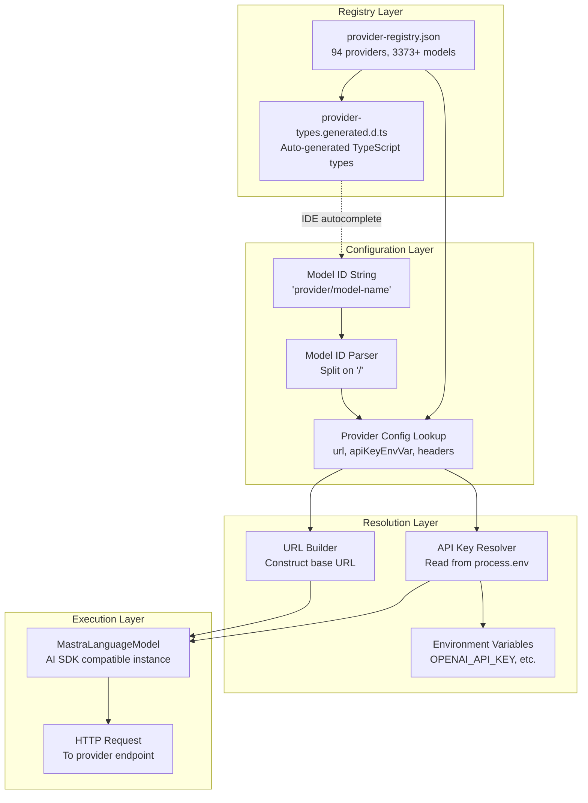
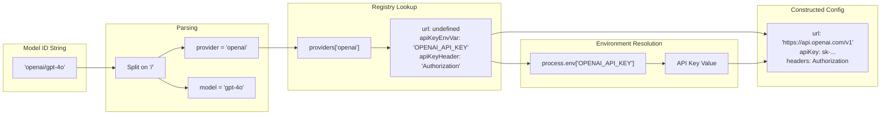
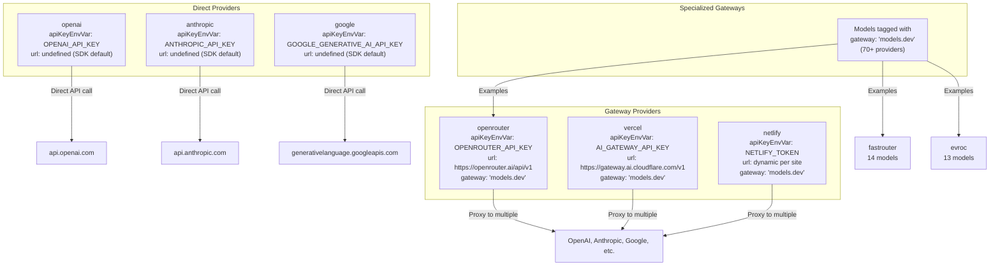

# Model Provider System

<details>
<summary>Relevant source files</summary>

The following files were used as context for generating this wiki page:

- [docs/src/content/en/models/gateways/index.mdx](docs/src/content/en/models/gateways/index.mdx)
- [docs/src/content/en/models/gateways/netlify.mdx](docs/src/content/en/models/gateways/netlify.mdx)
- [docs/src/content/en/models/gateways/openrouter.mdx](docs/src/content/en/models/gateways/openrouter.mdx)
- [docs/src/content/en/models/gateways/vercel.mdx](docs/src/content/en/models/gateways/vercel.mdx)
- [docs/src/content/en/models/index.mdx](docs/src/content/en/models/index.mdx)
- [docs/src/content/en/models/providers/\_meta.ts](docs/src/content/en/models/providers/_meta.ts)
- [docs/src/content/en/models/providers/alibaba-cn.mdx](docs/src/content/en/models/providers/alibaba-cn.mdx)
- [docs/src/content/en/models/providers/alibaba.mdx](docs/src/content/en/models/providers/alibaba.mdx)
- [docs/src/content/en/models/providers/anthropic.mdx](docs/src/content/en/models/providers/anthropic.mdx)
- [docs/src/content/en/models/providers/baseten.mdx](docs/src/content/en/models/providers/baseten.mdx)
- [docs/src/content/en/models/providers/cerebras.mdx](docs/src/content/en/models/providers/cerebras.mdx)
- [docs/src/content/en/models/providers/chutes.mdx](docs/src/content/en/models/providers/chutes.mdx)
- [docs/src/content/en/models/providers/cortecs.mdx](docs/src/content/en/models/providers/cortecs.mdx)
- [docs/src/content/en/models/providers/deepinfra.mdx](docs/src/content/en/models/providers/deepinfra.mdx)
- [docs/src/content/en/models/providers/github-models.mdx](docs/src/content/en/models/providers/github-models.mdx)
- [docs/src/content/en/models/providers/google.mdx](docs/src/content/en/models/providers/google.mdx)
- [docs/src/content/en/models/providers/groq.mdx](docs/src/content/en/models/providers/groq.mdx)
- [docs/src/content/en/models/providers/index.mdx](docs/src/content/en/models/providers/index.mdx)
- [docs/src/content/en/models/providers/modelscope.mdx](docs/src/content/en/models/providers/modelscope.mdx)
- [docs/src/content/en/models/providers/nano-gpt.mdx](docs/src/content/en/models/providers/nano-gpt.mdx)
- [docs/src/content/en/models/providers/nebius.mdx](docs/src/content/en/models/providers/nebius.mdx)
- [docs/src/content/en/models/providers/nvidia.mdx](docs/src/content/en/models/providers/nvidia.mdx)
- [docs/src/content/en/models/providers/openai.mdx](docs/src/content/en/models/providers/openai.mdx)
- [docs/src/content/en/models/providers/opencode.mdx](docs/src/content/en/models/providers/opencode.mdx)
- [docs/src/content/en/models/providers/perplexity.mdx](docs/src/content/en/models/providers/perplexity.mdx)
- [docs/src/content/en/models/providers/requesty.mdx](docs/src/content/en/models/providers/requesty.mdx)
- [docs/src/content/en/models/providers/scaleway.mdx](docs/src/content/en/models/providers/scaleway.mdx)
- [docs/src/content/en/models/providers/synthetic.mdx](docs/src/content/en/models/providers/synthetic.mdx)
- [docs/src/content/en/models/providers/togetherai.mdx](docs/src/content/en/models/providers/togetherai.mdx)
- [docs/src/content/en/models/providers/upstage.mdx](docs/src/content/en/models/providers/upstage.mdx)
- [docs/src/content/en/models/providers/venice.mdx](docs/src/content/en/models/providers/venice.mdx)
- [docs/src/content/en/models/providers/vultr.mdx](docs/src/content/en/models/providers/vultr.mdx)
- [docs/src/content/en/models/providers/wandb.mdx](docs/src/content/en/models/providers/wandb.mdx)
- [docs/src/content/en/models/providers/xai.mdx](docs/src/content/en/models/providers/xai.mdx)
- [docs/src/content/en/models/providers/zai-coding-plan.mdx](docs/src/content/en/models/providers/zai-coding-plan.mdx)
- [docs/src/content/en/models/providers/zai.mdx](docs/src/content/en/models/providers/zai.mdx)
- [docs/src/content/en/models/providers/zhipuai-coding-plan.mdx](docs/src/content/en/models/providers/zhipuai-coding-plan.mdx)
- [docs/src/content/en/models/providers/zhipuai.mdx](docs/src/content/en/models/providers/zhipuai.mdx)
- [docs/src/content/en/models/sidebars.js](docs/src/content/en/models/sidebars.js)
- [packages/core/src/llm/model/provider-registry.json](packages/core/src/llm/model/provider-registry.json)
- [packages/core/src/llm/model/provider-types.generated.d.ts](packages/core/src/llm/model/provider-types.generated.d.ts)

</details>

The Model Provider System provides unified access to 94 AI providers and 3373+ models through a centralized registry, auto-generated TypeScript types, and a string-based model identification scheme. This system abstracts away provider-specific configuration, enabling developers to switch between models and providers without changing application code.

For information about how agents use models, see [Agent Configuration and Execution](#3.1). For model fallback configuration, see [Model Fallbacks and Error Handling](#5.5). For dynamic model selection patterns, see [Dynamic Model Selection](#5.4).

---

## Architecture Overview

The Model Provider System consists of four primary components: a centralized JSON registry that defines all provider configurations, a type generation system that produces TypeScript definitions for IDE support, a model resolution engine that translates string-based model IDs into executable configurations, and an API key management layer that reads credentials from environment variables.



**Sources:** [packages/core/src/llm/model/provider-registry.json:1-1498](), [packages/core/src/llm/model/provider-types.generated.d.ts:1-10](), [docs/src/content/en/models/index.mdx:1-358]()

---

## Provider Registry Structure

The provider registry is a JSON file that defines all available providers and their models. Each provider entry contains configuration metadata required to make API calls, including API endpoint URLs, authentication headers, and the list of supported models.

### Registry Schema

The registry is structured as a top-level `providers` object where each key is a provider identifier and each value is a provider configuration object.

| Field          | Type     | Required | Description                                                    |
| -------------- | -------- | -------- | -------------------------------------------------------------- |
| `url`          | string   | No       | Base URL for API requests. If omitted, uses OpenAI SDK default |
| `apiKeyEnvVar` | string   | Yes      | Environment variable name containing the API key               |
| `apiKeyHeader` | string   | No       | HTTP header name for API key (defaults to "Authorization")     |
| `name`         | string   | Yes      | Human-readable provider name                                   |
| `models`       | string[] | Yes      | Array of model identifiers                                     |
| `docUrl`       | string   | No       | Link to provider documentation                                 |
| `gateway`      | string   | No       | Identifies gateway providers (e.g., "models.dev")              |
| `npm`          | string   | No       | NPM package for AI SDK integration                             |

**Example Provider Entry:**

```json
{
  "providers": {
    "openai": {
      "apiKeyEnvVar": "OPENAI_API_KEY",
      "name": "OpenAI",
      "models": ["gpt-4o", "gpt-4o-mini", "gpt-5", "o3-mini"],
      "docUrl": "https://platform.openai.com/docs/models"
    }
  }
}
```

**Sources:** [packages/core/src/llm/model/provider-registry.json:1-1498]()

---

## Model Catalog and Type Generation

The model catalog provides type-safe access to all available models through auto-generated TypeScript definitions. These types enable IDE autocomplete and compile-time validation of model identifiers.

### Generated Type Structure

The type generation system produces a `ProviderModelsMap` type that maps each provider to a readonly tuple of its model identifiers:

```typescript
export type ProviderModelsMap = {
  readonly evroc: readonly [
    'KBLab/kb-whisper-large',
    'Qwen/Qwen3-30B-A3B-Instruct-2507-FP8',
    // ... more models
  ]
  readonly openai: readonly [
    'gpt-4o',
    'gpt-4o-mini',
    'gpt-5',
    // ... more models
  ]
  // ... more providers
}
```

This structure enables IDE features like autocomplete when developers type model IDs in their code.

### Development Auto-Refresh

In development mode, the registry automatically refreshes every hour to ensure TypeScript autocomplete and Studio UI stay current with the latest models. This behavior can be disabled by setting `MASTRA_AUTO_REFRESH_PROVIDERS=false`. Auto-refresh is disabled by default in production environments.

**Sources:** [packages/core/src/llm/model/provider-types.generated.d.ts:1-1048](), [docs/src/content/en/models/index.mdx:160-165]()

---

## Model ID Format and Resolution

Models are identified using a consistent string format: `"provider/model-name"`. This format provides a uniform interface across all providers while maintaining human readability and type safety.



### Provider ID Patterns

**Direct Providers** use simple identifiers:

- `"openai/gpt-4o"` → OpenAI API
- `"anthropic/claude-opus-4"` → Anthropic API
- `"google/gemini-2.5-flash"` → Google Generative AI API

**Gateway Providers** prefix model names with sub-providers:

- `"openrouter/anthropic/claude-opus-4"` → Claude via OpenRouter
- `"vercel/openai/gpt-5"` → GPT-5 via Vercel AI Gateway
- `"netlify/google/gemini-2.5-flash"` → Gemini via Netlify

**Custom/Local Providers** support arbitrary identifiers:

- `"lmstudio/qwen3-30b"` → Local LMStudio server
- `"custom/my-model"` → Custom OpenAI-compatible endpoint

**Sources:** [docs/src/content/en/models/index.mdx:27-44](), [docs/src/content/en/models/gateways/index.mdx:1-44]()

---

## Provider Configuration Patterns

Providers are configured through a combination of registry entries and environment variables. The system supports three configuration approaches: registry-based (default), inline configuration objects, and dynamic configuration functions.

### Environment Variable-Based Configuration

The most common pattern reads API keys from environment variables specified in the registry:

```typescript
// Agent using registry-based configuration
const agent = new Agent({
  model: 'openai/gpt-4o', // Reads OPENAI_API_KEY automatically
})
```

The system looks up `apiKeyEnvVar` from the provider registry (`"OPENAI_API_KEY"`) and reads `process.env.OPENAI_API_KEY`.

### Inline Configuration Objects

For custom headers, API keys, or URLs, use configuration objects:

```typescript
const agent = new Agent({
  model: {
    id: 'openai/gpt-4o',
    apiKey: process.env.CUSTOM_KEY,
    headers: {
      'OpenAI-Organization': 'org-abc123',
    },
  },
})
```

### Custom Provider URLs

Local models or custom endpoints specify a `url` field:

```typescript
const agent = new Agent({
  model: {
    id: 'custom/my-qwen3-model',
    url: 'http://localhost:1234/v1', // LMStudio endpoint
  },
})
```

The `url` must point to an OpenAI-compatible base endpoint (not including `/chat/completions`).

**Sources:** [docs/src/content/en/models/index.mdx:249-270](), [docs/src/content/en/models/index.mdx:304-342]()

---

## Gateway vs Direct Providers

The system distinguishes between **direct providers** (first-party APIs) and **gateway providers** (aggregators that proxy multiple providers). This distinction affects routing, caching, and observability.



### Direct Providers

Direct providers communicate with first-party APIs:

- **OpenAI**: 46 models including GPT-4, GPT-5, o3, and Codex variants
- **Anthropic**: 23 models including Claude Opus, Sonnet, and Haiku families
- **Google**: 30 models including Gemini 2.5, 3.0, and embedding models
- **Mistral**: 26 models including Codestral, Devstral, and Mistral Large
- **xAI**: 25 models including Grok 3, Grok 4, and Grok Code

### Gateway Providers

Gateway providers aggregate models from multiple sources and add features like caching, rate limiting, and analytics:

- **OpenRouter**: 198 models from 20+ providers
- **Vercel AI Gateway**: 217 models with built-in observability
- **Netlify AI Gateway**: 63 models with edge caching

Gateway providers are identified by the `"gateway"` field in their registry entry. Most gateway providers use `"gateway": "models.dev"`.

**Sources:** [packages/core/src/llm/model/provider-registry.json:3-1498](), [docs/src/content/en/models/gateways/index.mdx:10-18](), [docs/src/content/en/models/providers/index.mdx:10-12]()

---

## Provider-Specific Configuration

Different providers expose unique configuration options through `providerOptions`. These options can be set at the agent level (applies to all messages) or per-message (applies to a single request).

### Common Provider Options

| Provider  | Option            | Description                                                   |
| --------- | ----------------- | ------------------------------------------------------------- |
| OpenAI    | `reasoningEffort` | Controls o1/o3 model thinking depth ("low", "medium", "high") |
| Anthropic | `cacheControl`    | Enables prompt caching for repeated context                   |
| Google    | `safetySettings`  | Configures content filtering thresholds                       |
| Mistral   | `safePrompt`      | Enables/disables safety guardrails                            |

### Agent-Level Configuration

Provider options in the `instructions` field apply to all future agent calls:

```typescript
const agent = new Agent({
  model: 'openai/o3-pro',
  instructions: {
    role: 'system',
    content: 'You are a helpful assistant.',
    providerOptions: {
      openai: { reasoningEffort: 'low' },
    },
  },
})
```

### Message-Level Configuration

Provider options in individual messages override agent-level settings:

```typescript
const response = await agent.generate([
  {
    role: 'user',
    content: 'Solve this complex problem',
    providerOptions: {
      openai: { reasoningEffort: 'high' }, // Overrides agent default
    },
  },
])
```

This pattern enables dynamic adjustment of model behavior based on task complexity.

**Sources:** [docs/src/content/en/models/index.mdx:213-245]()

---

## Multi-Provider Model Access

The registry includes both mainstream providers and specialized platforms, enabling developers to access cutting-edge models without managing multiple SDKs.

### Provider Categories

**Major Cloud Providers:**

- OpenAI (46 models)
- Anthropic (23 models)
- Google (30 models)
- Amazon Bedrock (multi-provider access)
- Azure OpenAI (private deployments)

**Specialized Inference Platforms:**

- Deep Infra (27 models)
- Fireworks AI (13 models)
- Together AI (17 models)
- Groq (9 models, optimized for speed)

**Regional Providers:**

- Alibaba (41 international, 74 China-specific models)
- Moonshot AI (6 models, Kimi K2 family)
- Z.AI (10 models, GLM family)
- Xiaomi (1 model, Mimo V2)

**Gateway Aggregators:**

- OpenRouter (198 models)
- Vercel (217 models)
- Netlify (63 models)
- Kilo Gateway (335 models)

**Coding-Specialized Platforms:**

- Alibaba Coding Plan (8 models)
- MiniMax Coding Plan (4 models)
- Z.AI Coding Plan (11 models)
- KUAE Cloud Coding Plan (1 model)

The complete list of 94 providers is maintained in the registry JSON file.

**Sources:** [packages/core/src/llm/model/provider-registry.json:1-1498](), [docs/src/content/en/models/providers/index.mdx:14-465]()

---

## Model Metadata and Capabilities

While the registry stores basic provider configuration, individual model metadata (context windows, pricing, capabilities) is stored separately and used for documentation generation.

### Model Capability Fields

Documentation files expose model-specific metadata through `ProviderModelsTable` components:

| Field           | Type           | Description                       |
| --------------- | -------------- | --------------------------------- |
| `imageInput`    | boolean        | Supports image input (multimodal) |
| `audioInput`    | boolean        | Supports audio input              |
| `videoInput`    | boolean        | Supports video input              |
| `toolUsage`     | boolean        | Supports function/tool calling    |
| `reasoning`     | boolean        | Extended thinking/reasoning mode  |
| `contextWindow` | number         | Maximum input tokens              |
| `maxOutput`     | number         | Maximum output tokens             |
| `inputCost`     | number \| null | Cost per 1M input tokens (USD)    |
| `outputCost`    | number \| null | Cost per 1M output tokens (USD)   |

**Example Model Metadata:**

```typescript
{
  "model": "openai/gpt-5",
  "imageInput": true,
  "audioInput": false,
  "videoInput": false,
  "toolUsage": true,
  "reasoning": true,
  "contextWindow": 400000,
  "maxOutput": 128000,
  "inputCost": 1.25,
  "outputCost": 10
}
```

This metadata is used to generate model documentation pages but is not directly used by the runtime model resolution system.

**Sources:** [docs/src/content/en/models/providers/openai.mdx:40-100](), [docs/src/content/en/models/providers/opencode.mdx:46-432]()

---

## Registry Maintenance and Extension

The provider registry is designed to be easily extended with new providers and models. The registry follows a strict JSON schema to ensure consistency across all provider entries.

### Adding a New Provider

To add a provider to the registry:

1. Add a new entry to the `providers` object in `provider-registry.json`
2. Define required fields: `name`, `apiKeyEnvVar`, `models`
3. Add optional fields: `url`, `apiKeyHeader`, `docUrl`, `gateway`, `npm`
4. Regenerate TypeScript types (automated by the type generation system)
5. Update documentation (automated by documentation generation)

### Gateway Provider Identification

Providers that aggregate models from multiple sources include the `"gateway"` field:

```json
{
  "openrouter": {
    "url": "https://openrouter.ai/api/v1",
    "apiKeyEnvVar": "OPENROUTER_API_KEY",
    "apiKeyHeader": "Authorization",
    "name": "OpenRouter",
    "models": ["anthropic/claude-opus-4", "openai/gpt-5"],
    "gateway": "models.dev"
  }
}
```

The `"gateway": "models.dev"` marker indicates this provider proxies to others.

### NPM Package Integration

Providers with AI SDK packages specify the `npm` field:

```json
{
  "deepinfra": {
    "apiKeyEnvVar": "DEEPINFRA_API_KEY",
    "name": "Deep Infra",
    "models": ["MiniMaxAI/MiniMax-M2.5"],
    "npm": "@ai-sdk/deepinfra"
  }
}
```

This enables developers to use AI SDK provider modules directly if needed.

**Sources:** [packages/core/src/llm/model/provider-registry.json:355-390](), [packages/core/src/llm/model/provider-registry.json:64-143]()

---

## Custom Gateway Implementation

Developers can implement custom gateways for private LLM deployments or specialized provider integrations. Custom gateways must provide an OpenAI-compatible API endpoint.

### Custom Gateway Pattern

```typescript
const agent = new Agent({
  model: {
    id: 'custom-gateway/provider/model-name',
    url: 'https://my-gateway.example.com/v1',
    apiKey: process.env.GATEWAY_API_KEY,
    headers: {
      'X-Custom-Header': 'value',
    },
  },
})
```

The URL must point to the base endpoint (not including `/chat/completions`). The system appends `/chat/completions` automatically when making requests.

### Azure OpenAI Gateway

Azure OpenAI requires special handling for deployment names and API versions:

```typescript
const agent = new Agent({
  model: {
    id: 'azure-openai/my-deployment-name',
    url: 'https://my-resource.openai.azure.com',
    apiKey: process.env.AZURE_OPENAI_API_KEY,
    headers: {
      'api-key': process.env.AZURE_OPENAI_API_KEY,
    },
  },
})
```

Azure-specific configuration is documented separately in gateway documentation.

**Sources:** [docs/src/content/en/models/gateways/index.mdx:14-17](), [docs/src/content/en/models/index.mdx:304-342]()

---

## Integration with Agent System

The Model Provider System integrates with the Agent System through model resolution at agent initialization and execution time. Agents accept model configurations in three formats: string IDs, configuration objects, or dynamic functions.

### String-Based Model Selection

```typescript
const agent = new Agent({
  model: 'openai/gpt-4o', // Resolved via registry
})
```

### Object-Based Model Configuration

```typescript
const agent = new Agent({
  model: {
    id: 'anthropic/claude-opus-4',
    apiKey: process.env.CUSTOM_KEY,
  },
})
```

### Dynamic Model Selection

```typescript
const agent = new Agent({
  model: ({ requestContext }) => {
    const tier = requestContext.get('user-tier')
    return tier === 'premium' ? 'anthropic/claude-opus-4' : 'openai/gpt-4o-mini'
  },
})
```

The dynamic pattern enables A/B testing, user-based model selection, and multi-tenant applications where different customers use different models.

**Sources:** [docs/src/content/en/models/index.mdx:193-212]()
