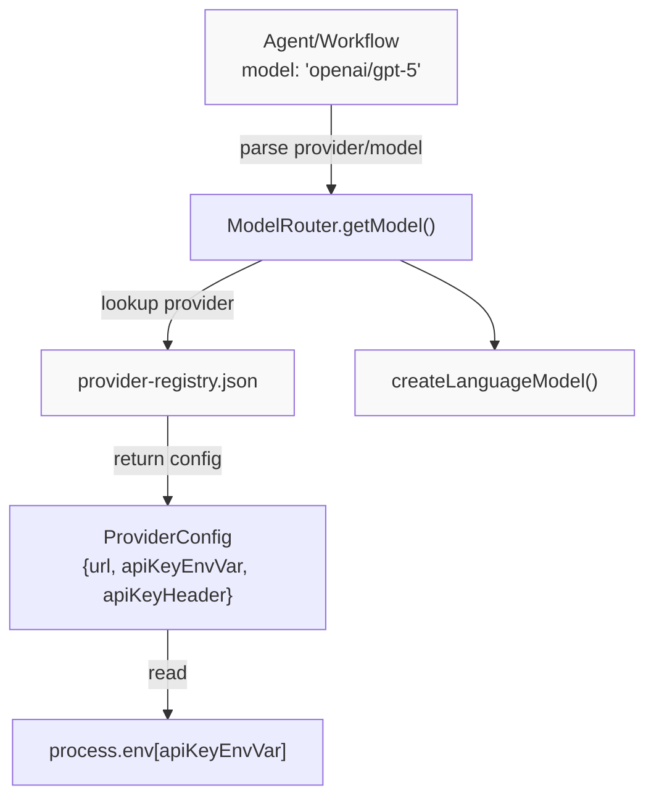
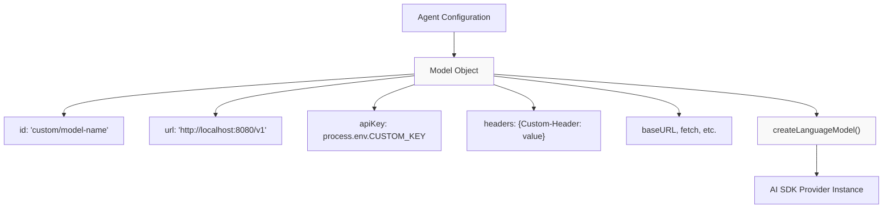
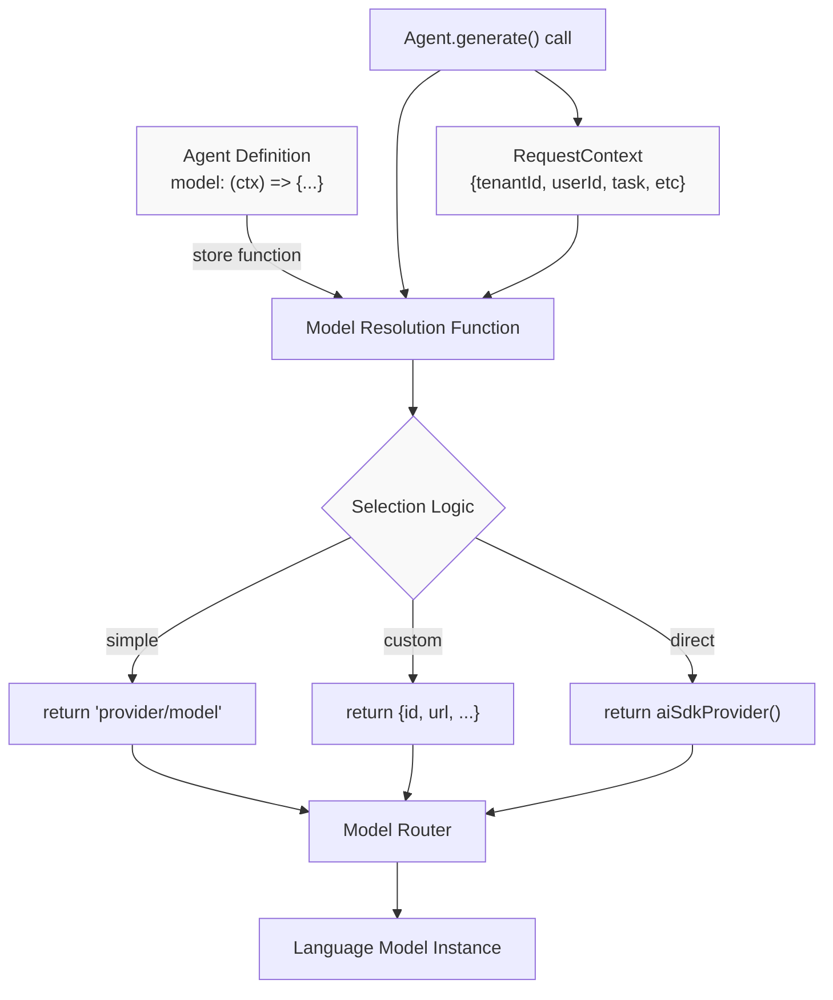
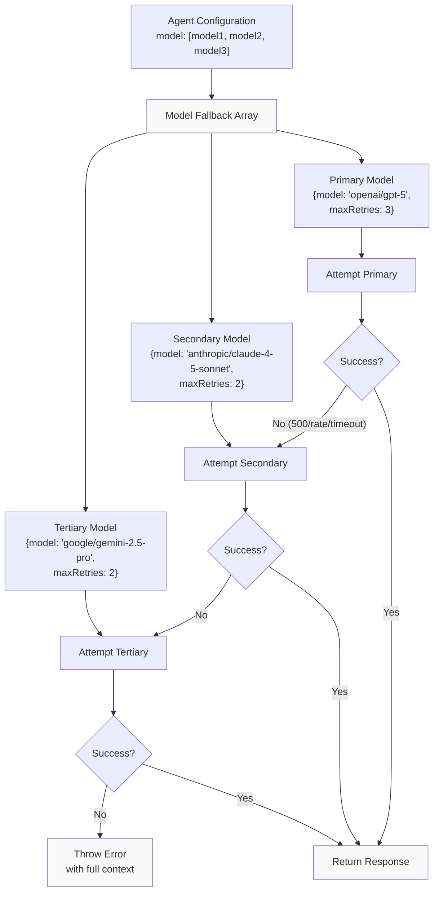
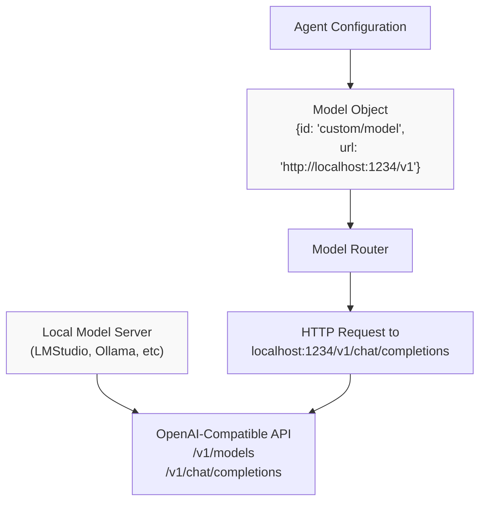
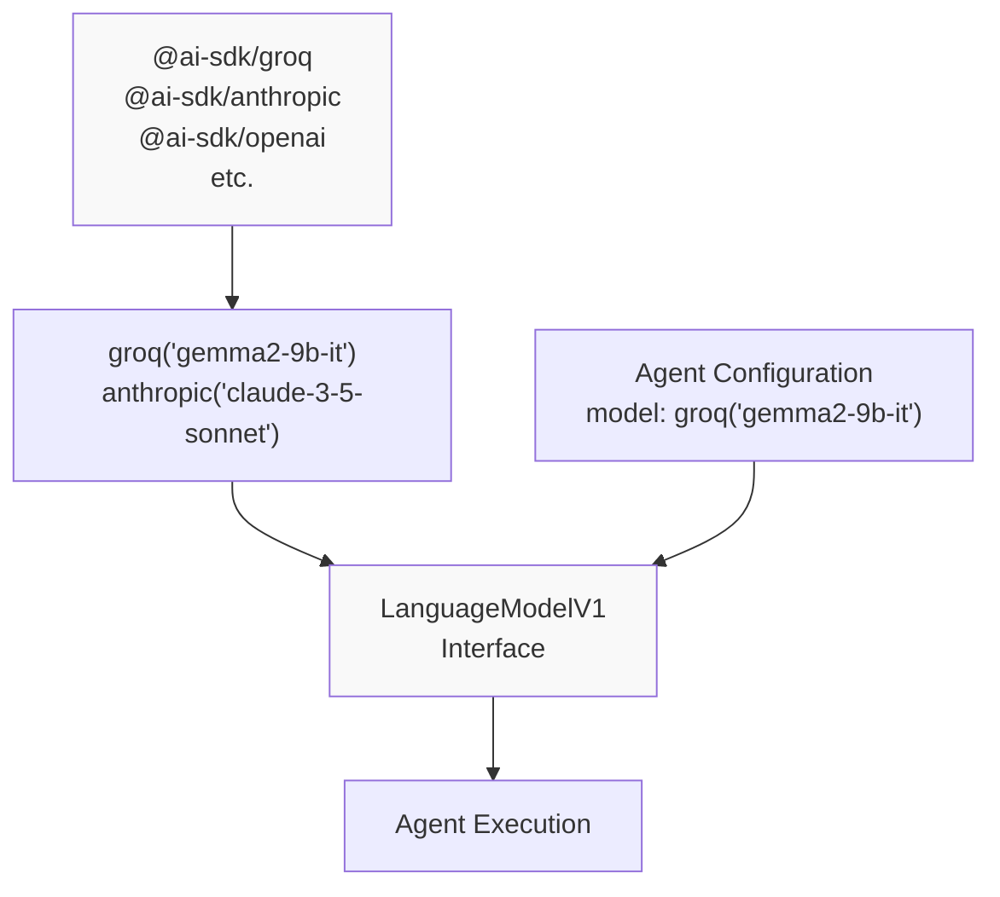
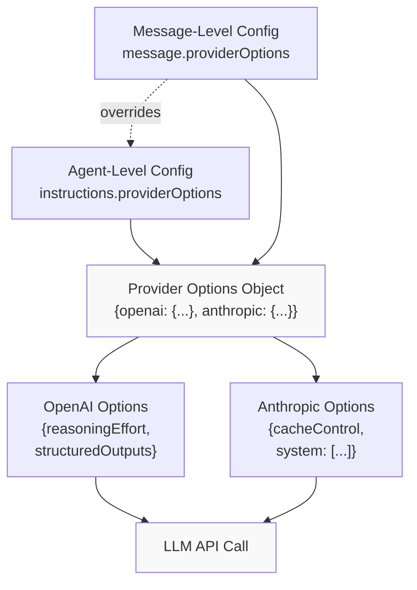
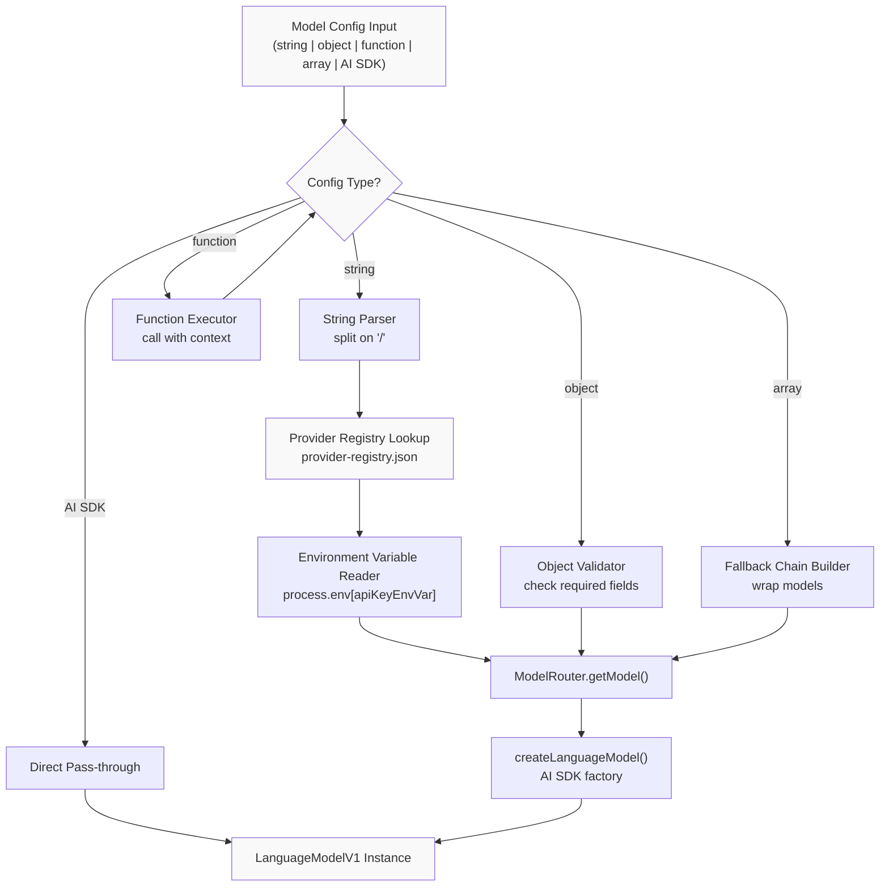
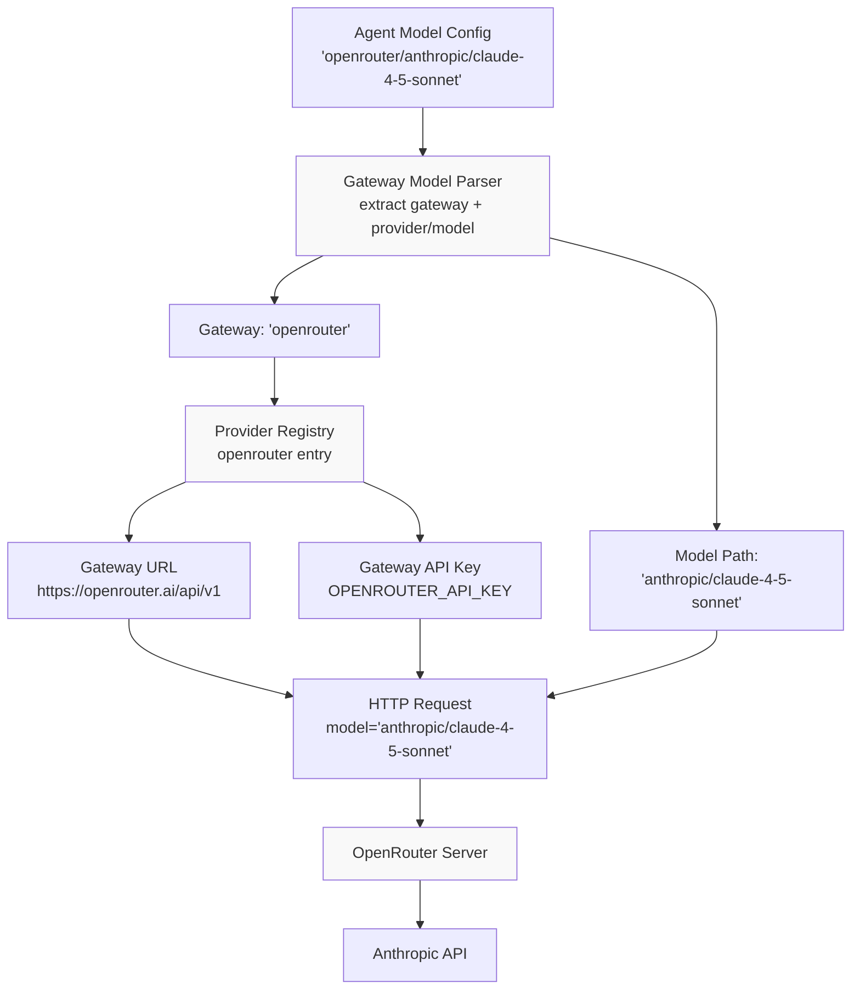

# Model Configuration Patterns

<details>
<summary>Relevant source files</summary>

The following files were used as context for generating this wiki page:

- [docs/src/content/en/models/gateways/index.mdx](docs/src/content/en/models/gateways/index.mdx)
- [docs/src/content/en/models/gateways/netlify.mdx](docs/src/content/en/models/gateways/netlify.mdx)
- [docs/src/content/en/models/gateways/openrouter.mdx](docs/src/content/en/models/gateways/openrouter.mdx)
- [docs/src/content/en/models/gateways/vercel.mdx](docs/src/content/en/models/gateways/vercel.mdx)
- [docs/src/content/en/models/index.mdx](docs/src/content/en/models/index.mdx)
- [docs/src/content/en/models/providers/\_meta.ts](docs/src/content/en/models/providers/_meta.ts)
- [docs/src/content/en/models/providers/alibaba-cn.mdx](docs/src/content/en/models/providers/alibaba-cn.mdx)
- [docs/src/content/en/models/providers/alibaba.mdx](docs/src/content/en/models/providers/alibaba.mdx)
- [docs/src/content/en/models/providers/anthropic.mdx](docs/src/content/en/models/providers/anthropic.mdx)
- [docs/src/content/en/models/providers/baseten.mdx](docs/src/content/en/models/providers/baseten.mdx)
- [docs/src/content/en/models/providers/cerebras.mdx](docs/src/content/en/models/providers/cerebras.mdx)
- [docs/src/content/en/models/providers/chutes.mdx](docs/src/content/en/models/providers/chutes.mdx)
- [docs/src/content/en/models/providers/cortecs.mdx](docs/src/content/en/models/providers/cortecs.mdx)
- [docs/src/content/en/models/providers/deepinfra.mdx](docs/src/content/en/models/providers/deepinfra.mdx)
- [docs/src/content/en/models/providers/github-models.mdx](docs/src/content/en/models/providers/github-models.mdx)
- [docs/src/content/en/models/providers/google.mdx](docs/src/content/en/models/providers/google.mdx)
- [docs/src/content/en/models/providers/groq.mdx](docs/src/content/en/models/providers/groq.mdx)
- [docs/src/content/en/models/providers/index.mdx](docs/src/content/en/models/providers/index.mdx)
- [docs/src/content/en/models/providers/modelscope.mdx](docs/src/content/en/models/providers/modelscope.mdx)
- [docs/src/content/en/models/providers/nano-gpt.mdx](docs/src/content/en/models/providers/nano-gpt.mdx)
- [docs/src/content/en/models/providers/nebius.mdx](docs/src/content/en/models/providers/nebius.mdx)
- [docs/src/content/en/models/providers/nvidia.mdx](docs/src/content/en/models/providers/nvidia.mdx)
- [docs/src/content/en/models/providers/openai.mdx](docs/src/content/en/models/providers/openai.mdx)
- [docs/src/content/en/models/providers/opencode.mdx](docs/src/content/en/models/providers/opencode.mdx)
- [docs/src/content/en/models/providers/perplexity.mdx](docs/src/content/en/models/providers/perplexity.mdx)
- [docs/src/content/en/models/providers/requesty.mdx](docs/src/content/en/models/providers/requesty.mdx)
- [docs/src/content/en/models/providers/scaleway.mdx](docs/src/content/en/models/providers/scaleway.mdx)
- [docs/src/content/en/models/providers/synthetic.mdx](docs/src/content/en/models/providers/synthetic.mdx)
- [docs/src/content/en/models/providers/togetherai.mdx](docs/src/content/en/models/providers/togetherai.mdx)
- [docs/src/content/en/models/providers/upstage.mdx](docs/src/content/en/models/providers/upstage.mdx)
- [docs/src/content/en/models/providers/venice.mdx](docs/src/content/en/models/providers/venice.mdx)
- [docs/src/content/en/models/providers/vultr.mdx](docs/src/content/en/models/providers/vultr.mdx)
- [docs/src/content/en/models/providers/wandb.mdx](docs/src/content/en/models/providers/wandb.mdx)
- [docs/src/content/en/models/providers/xai.mdx](docs/src/content/en/models/providers/xai.mdx)
- [docs/src/content/en/models/providers/zai-coding-plan.mdx](docs/src/content/en/models/providers/zai-coding-plan.mdx)
- [docs/src/content/en/models/providers/zai.mdx](docs/src/content/en/models/providers/zai.mdx)
- [docs/src/content/en/models/providers/zhipuai-coding-plan.mdx](docs/src/content/en/models/providers/zhipuai-coding-plan.mdx)
- [docs/src/content/en/models/providers/zhipuai.mdx](docs/src/content/en/models/providers/zhipuai.mdx)
- [docs/src/content/en/models/sidebars.js](docs/src/content/en/models/sidebars.js)
- [packages/core/src/llm/model/provider-registry.json](packages/core/src/llm/model/provider-registry.json)
- [packages/core/src/llm/model/provider-types.generated.d.ts](packages/core/src/llm/model/provider-types.generated.d.ts)

</details>

This document describes the various patterns for configuring LLM models in Mastra agents and workflows. It covers the model specification formats, dynamic selection strategies, fallback mechanisms, and custom provider integrations.

For information about the provider registry system and model catalog, see [Provider Registry and Model Catalog](#5.1). For details on dynamic model selection based on request context, see [Dynamic Model Selection](#5.4). For model fallback error handling, see [Model Fallbacks and Error Handling](#5.5).

## Overview

Mastra supports multiple configuration patterns for specifying which LLM model an agent or workflow should use. The configuration can range from a simple string identifier to complex objects with custom authentication, headers, and dynamic resolution logic. The system abstracts over 88 providers and 2609+ models through a unified interface.

Model configuration accepts four primary formats:

1. **String format**: `"provider/model-name"` for registry-based models
2. **Object format**: Configuration object for custom endpoints and authentication
3. **Function format**: Dynamic resolution based on request context
4. **Array format**: Multiple models for fallback chains
5. **AI SDK format**: Direct AI SDK provider module instances

## String-Based Model Configuration

The simplest and most common pattern uses a string in the format `"provider/model-name"`. This leverages the provider registry to automatically resolve the API endpoint, authentication headers, and model-specific settings.



**String Format Parsing**

The string is split on the `/` character to extract the provider ID and model ID. The provider ID must match a key in the provider registry.

```typescript
// Example: "openai/gpt-5"
// provider: "openai"
// model: "gpt-5"
```

**Environment Variable Resolution**

Each provider in the registry specifies which environment variable contains its API key via the `apiKeyEnvVar` field. The system automatically reads this at runtime:

```typescript
// For "openai/gpt-5", the registry specifies:
// apiKeyEnvVar: "OPENAI_API_KEY"
// The system reads: process.env.OPENAI_API_KEY
```

**Type Safety**

The auto-generated `ProviderModelsMap` type provides autocomplete and type checking for valid provider/model combinations.

Sources: [packages/core/src/llm/model/provider-registry.json:1-13969](), [packages/core/src/llm/model/provider-types.generated.d.ts:1-3900](), [docs/src/content/en/models/index.mdx:27-44]()

## Object-Based Model Configuration

Object configuration provides full control over model endpoints, authentication, and request settings. This pattern is used for custom deployments, local models, or when you need to override default provider settings.



**Configuration Fields**

The model object accepts the following fields:

- `id`: Model identifier (required) - used for display and logging
- `url`: Base URL for OpenAI-compatible endpoint (optional)
- `apiKey`: Authentication key (optional, falls back to env vars)
- `headers`: Custom HTTP headers object (optional)
- `baseURL`: Alias for `url` (optional)
- Additional AI SDK provider options

**Custom Endpoints**

For local models or custom deployments, specify the base URL without the `/chat/completions` path:

```typescript
{
  id: "custom/my-model",
  url: "http://localhost:1234/v1"  // LMStudio server
}
```

The system appends the appropriate endpoint path based on the operation (chat completions, embeddings, etc.).

**Custom Headers**

Headers are merged with provider defaults. Common use cases include organization IDs, request metadata, or custom authentication:

```typescript
{
  id: "openai/gpt-4-turbo",
  headers: {
    "OpenAI-Organization": "org-abc123",
    "X-Request-Id": requestId
  }
}
```

Sources: [docs/src/content/en/models/index.mdx:251-263](), [docs/src/content/en/models/index.mdx:311-341](), [docs/src/content/en/models/providers/opencode.mdx:415-428]()

## Dynamic Model Selection Pattern

Function-based configuration enables runtime model selection based on request context, user preferences, or application state. The function receives the request context and returns a model configuration (string, object, or AI SDK instance).



**Function Signature**

```typescript
type ModelResolver = (context: {
  requestContext?: RequestContext
  // other context fields
}) => string | ModelObject | LanguageModelV1
```

**Common Patterns**

1. **Multi-tenant selection**: Different customers use different model providers
2. **A/B testing**: Route percentage of traffic to experimental models
3. **Task-based routing**: Use specialized models for specific task types
4. **Cost optimization**: Select cheaper models for simple tasks
5. **User preference**: Let users choose their preferred model

**Context Access**

The `requestContext` parameter provides access to per-request data set by middleware or application code:

```typescript
model: ({ requestContext }) => {
  const provider = requestContext?.get('provider-id')
  const model = requestContext?.get('model-id')
  return `${provider}/${model}`
}
```

**Conditional Logic Example**

```typescript
model: ({ requestContext }) => {
  const task = requestContext?.get('task-type')

  if (task === 'complex-reasoning') {
    return 'anthropic/claude-opus-4-1'
  } else if (task === 'fast-response') {
    return 'openai/gpt-4o-mini'
  } else {
    return 'openai/gpt-5'
  }
}
```

Sources: [docs/src/content/en/models/index.mdx:193-212](), [docs/src/content/en/models/providers/opencode.mdx:432-443]()

## Model Fallback Chain Configuration

Array configuration creates a fallback chain where the system attempts models in sequence until one succeeds. This provides resilience against provider outages, rate limits, and transient errors.



**Fallback Item Structure**

Each item in the fallback array can be:

- A string: `"provider/model-name"`
- An object with `model` and optional `maxRetries`:

```typescript
{
  model: "openai/gpt-5",  // string or object or AI SDK instance
  maxRetries: 3           // per-model retry count
}
```

**Triggering Conditions**

Fallback to the next model occurs when encountering:

- HTTP 500 errors (server errors)
- HTTP 429 errors (rate limiting)
- Timeout errors
- Connection failures

Non-retryable errors (4xx client errors except 429) fail immediately without trying fallbacks.

**Retry Behavior**

Each model in the chain has its own retry budget. The system:

1. Attempts the primary model with its `maxRetries`
2. If all retries fail, moves to the next model
3. Attempts that model with its `maxRetries`
4. Continues until a model succeeds or the chain is exhausted

**Error Context Preservation**

When all models fail, the error includes:

- Full chain of attempted models
- Error details from each attempt
- Retry counts and timing information

Sources: [docs/src/content/en/models/index.mdx:272-301]()

## Local and Custom Model Configuration

Mastra supports local models running on your own infrastructure through OpenAI-compatible API servers. This enables use of open-source models (gpt-oss, Qwen3, DeepSeek, Llama, etc.) without sending data to external providers.



**Requirements**

The local server must provide:

- OpenAI-compatible `/v1/chat/completions` endpoint
- Standard request/response format
- Optional: `/v1/models` endpoint for model listing

**URL Configuration**

Use the base URL without the endpoint path. Mastra appends the appropriate path:

```typescript
{
  id: "lmstudio/qwen/qwen3-30b-a3b-2507",
  url: "http://localhost:1234/v1"
}
// Mastra calls: http://localhost:1234/v1/chat/completions
```

**Model ID Convention**

For local models, the `id` format is flexible since it's not used for registry lookup:

- `"custom/my-model"`: Generic custom prefix
- `"lmstudio/model-name"`: LMStudio-specific
- `"ollama/model-name"`: Ollama-specific
- Any format you prefer for internal identification

**Common Local Model Servers**

1. **LMStudio**: Desktop app with GUI and API server
   - Default URL: `http://localhost:1234/v1`
   - Model ID displayed in LMStudio interface

2. **Ollama**: CLI-based local model server
   - Default URL: `http://localhost:11434/v1`
   - Model pulled via `ollama pull`

3. **vLLM**: High-performance inference server
4. **text-generation-webui**: Web interface with API
5. **Custom deployments**: Any OpenAI-compatible server

Sources: [docs/src/content/en/models/index.mdx:304-341]()

## AI SDK Provider Module Integration

Mastra supports direct use of Vercel AI SDK provider modules, allowing you to bypass the registry and use AI SDK's native provider implementations. This provides access to provider-specific features and configuration options.



**Usage Pattern**

Install the AI SDK provider package and use its model creation function:

```typescript
import { groq } from '@ai-sdk/groq'
import { anthropic } from '@ai-sdk/anthropic'

const agent = new Agent({
  id: 'my-agent',
  model: groq('gemma2-9b-it'),
  // or: anthropic('claude-3-5-sonnet-20241022')
})
```

**Compatibility**

AI SDK provider instances can be used anywhere that accepts a model configuration:

- Agent `model` field
- Workflow step model configuration
- Model fallback arrays
- Scorer model configuration

**Provider-Specific Configuration**

AI SDK providers accept their own configuration options:

```typescript
import { openai } from '@ai-sdk/openai'

model: openai('gpt-4', {
  structuredOutputs: true,
  parallelToolCalls: false,
})
```

**Registry Models with AI SDK**

Some providers in the registry include an `npm` field indicating the AI SDK package:

```json
{
  "deepinfra": {
    "npm": "@ai-sdk/deepinfra"
  }
}
```

This informs users which package to install for AI SDK integration, though string-based configuration (`"deepinfra/model"`) still works without installing the package.

Sources: [docs/src/content/en/models/index.mdx:343-356](), [packages/core/src/llm/model/provider-registry.json:353-355]()

## Provider-Specific Options Pattern

The `providerOptions` field allows configuration of provider-specific features that don't fit into the standard model configuration schema. These options can be set at the agent level (applies to all messages) or per-message.



**Agent-Level Configuration**

Set options that apply to all future calls:

```typescript
const agent = new Agent({
  id: 'planner',
  instructions: {
    role: 'system',
    content: 'You are a helpful assistant.',
    providerOptions: {
      openai: { reasoningEffort: 'low' },
    },
  },
  model: 'openai/o3-pro',
})
```

**Message-Level Configuration**

Override options for specific messages:

```typescript
const response = await agent.generate([
  {
    role: 'user',
    content: 'Plan a complex menu',
    providerOptions: {
      openai: { reasoningEffort: 'high' },
    },
  },
])
```

**Common Provider Options**

**OpenAI**:

- `reasoningEffort`: "low" | "medium" | "high" (for o1/o3 models)
- `structuredOutputs`: boolean (for JSON schema mode)
- `parallelToolCalls`: boolean

**Anthropic**:

- `cacheControl`: Prompt caching configuration
- `system`: Array of system messages with caching

**Resolution Priority**

When both agent-level and message-level options are present:

1. Message-level options take precedence
2. Options are merged per-provider
3. Unspecified providers use defaults

Sources: [docs/src/content/en/models/index.mdx:215-245]()

## Configuration Resolution Flow

This section describes how Mastra resolves model configuration through its internal pipeline, from configuration input to the final language model instance.



**Resolution Steps**

1. **Input Type Detection**: Determine configuration format
2. **Registry Lookup** (string format): Find provider in `provider-registry.json`
3. **Environment Resolution**: Read API key from specified env var
4. **URL Construction**: Build full endpoint URL
5. **Header Assembly**: Merge default and custom headers
6. **Model Creation**: Call AI SDK's `createLanguageModel()`
7. **Instance Caching**: Store for reuse within request

**Fallback Chain Resolution**

For array configurations:

1. Parse each array element recursively
2. Wrap in `ModelWithRetries` structure
3. Create fallback handler with retry logic
4. Return primary model with fallback chain

**Function Resolution**

For function configurations:

1. Execute function with context
2. Take return value
3. Recursively resolve as new configuration
4. Support nested functions (functions returning functions)

**Error Handling**

Configuration errors are caught and wrapped with context:

- Missing provider in registry
- Missing environment variable
- Invalid model ID for provider
- Malformed configuration object

Sources: [packages/core/src/llm/model/provider-registry.json:1-13969](), [packages/core/src/llm/model/provider-types.generated.d.ts:1-10]()

## Gateway Provider Configuration

Gateway providers aggregate multiple model providers and add features like caching, rate limiting, and observability. Mastra treats gateways as first-class providers in the registry.



**Gateway Identification**

Gateways are marked in the registry with a `gateway` field:

```json
{
  "openrouter": {
    "gateway": "models.dev"
  }
}
```

**Model Path Format**

Gateway models use the format `"gateway/provider/model"`:

- `"openrouter/anthropic/claude-3-5-sonnet"`
- `"vercel/openai/gpt-4o"`
- `"netlify/google/gemini-2.5-flash"`

**Gateway vs Direct Comparison**

| Aspect            | Gateway                          | Direct Provider          |
| ----------------- | -------------------------------- | ------------------------ |
| **API Key**       | Single gateway key               | Per-provider keys        |
| **Model Access**  | All aggregated models            | Provider-specific models |
| **Features**      | Caching, rate limiting, failover | Provider-native features |
| **Latency**       | +1 hop                           | Direct connection        |
| **Cost**          | Gateway markup                   | Provider pricing         |
| **Observability** | Gateway dashboard                | Provider logs            |

**Built-in Gateways**

Mastra includes configuration for:

- **OpenRouter**: 186 models from multiple providers
- **Vercel AI Gateway**: 199 models with edge caching
- **Netlify AI Gateway**: 56 models with built-in observability
- **Azure OpenAI**: Custom deployments with deployment names

**Custom Gateway Configuration**

For custom gateways, use object configuration:

```typescript
{
  id: "custom-gateway/provider/model",
  url: "https://my-gateway.com/v1",
  apiKey: process.env.GATEWAY_KEY,
  headers: {
    "X-Gateway-Feature": "enabled"
  }
}
```

Sources: [packages/core/src/llm/model/provider-registry.json:23-24](), [docs/src/content/en/models/gateways/index.mdx:10-17](), [docs/src/content/en/models/gateways/openrouter.mdx:10-45]()

## Configuration Precedence and Inheritance

When multiple configuration sources are present, Mastra follows a precedence hierarchy to resolve the final model configuration.

**Precedence Hierarchy** (highest to lowest):

1. **Message-level providerOptions**: Options on individual messages
2. **Agent-level providerOptions**: Options in agent instructions
3. **Model object fields**: Custom URL, headers, apiKey
4. **RequestContext overrides**: Dynamic configuration via context
5. **Registry defaults**: Provider configuration from registry
6. **Environment variables**: API keys from process.env

**Inheritance Behavior**

Configuration is merged hierarchically:

- **Headers**: Custom headers merged with registry defaults
- **Provider options**: Per-provider objects merged independently
- **URL/apiKey**: Direct override, no merging

**Example Resolution**

Given this configuration:

```typescript
const agent = new Agent({
  model: {
    id: 'openai/gpt-4',
    headers: { 'X-Custom': 'value' },
  },
  instructions: {
    providerOptions: {
      openai: { reasoningEffort: 'low' },
    },
  },
})

// Call with message-level options
await agent.generate([
  {
    role: 'user',
    content: 'Hello',
    providerOptions: {
      openai: { reasoningEffort: 'high' },
    },
  },
])
```

Final configuration:

- URL: From registry (`https://api.openai.com/v1`)
- API Key: `process.env.OPENAI_API_KEY`
- Headers: `{"Authorization": "...", "X-Custom": "value"}`
- Reasoning Effort: `"high"` (message overrides agent)

Sources: [docs/src/content/en/models/index.mdx:215-245](), [docs/src/content/en/models/index.mdx:251-263]()
