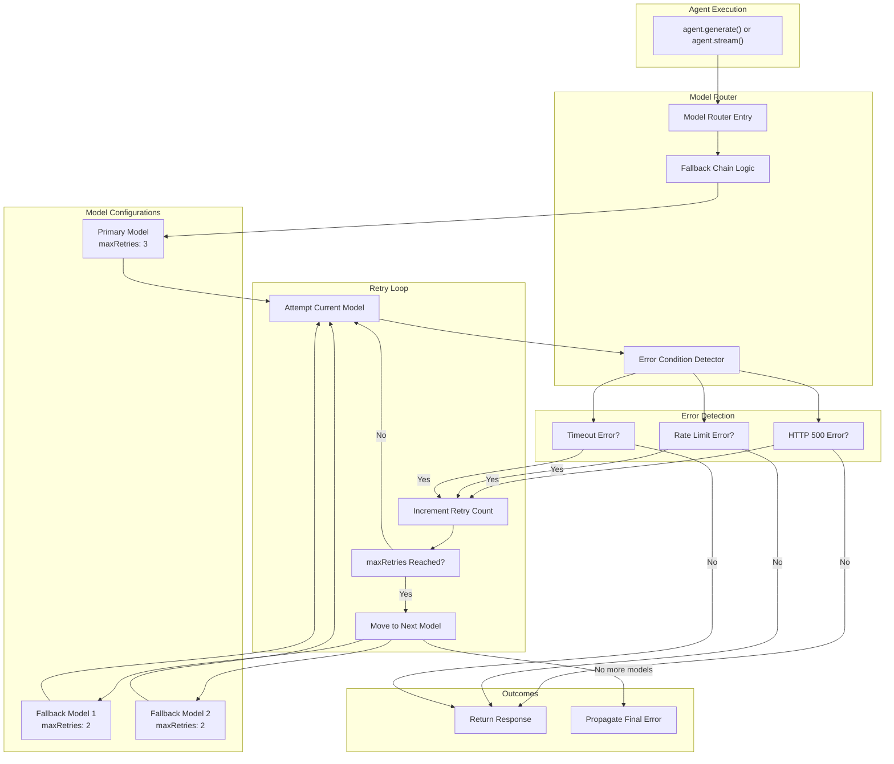
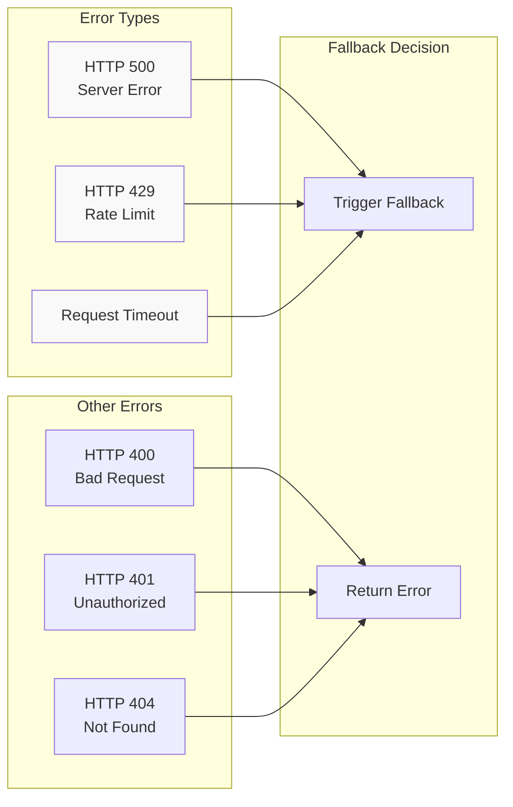
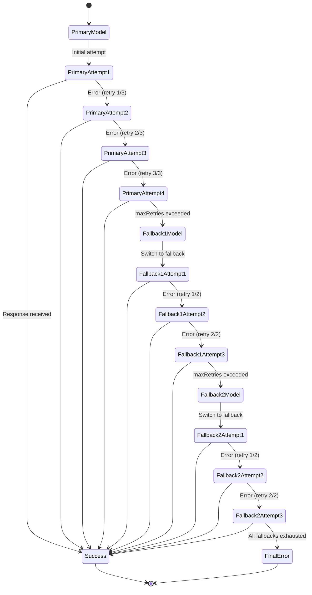
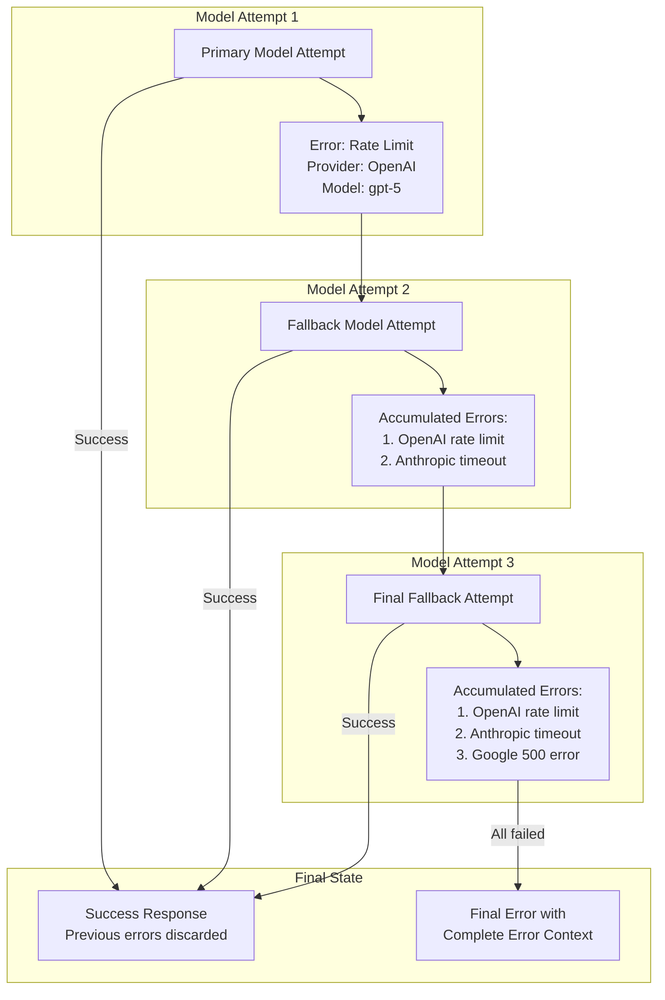
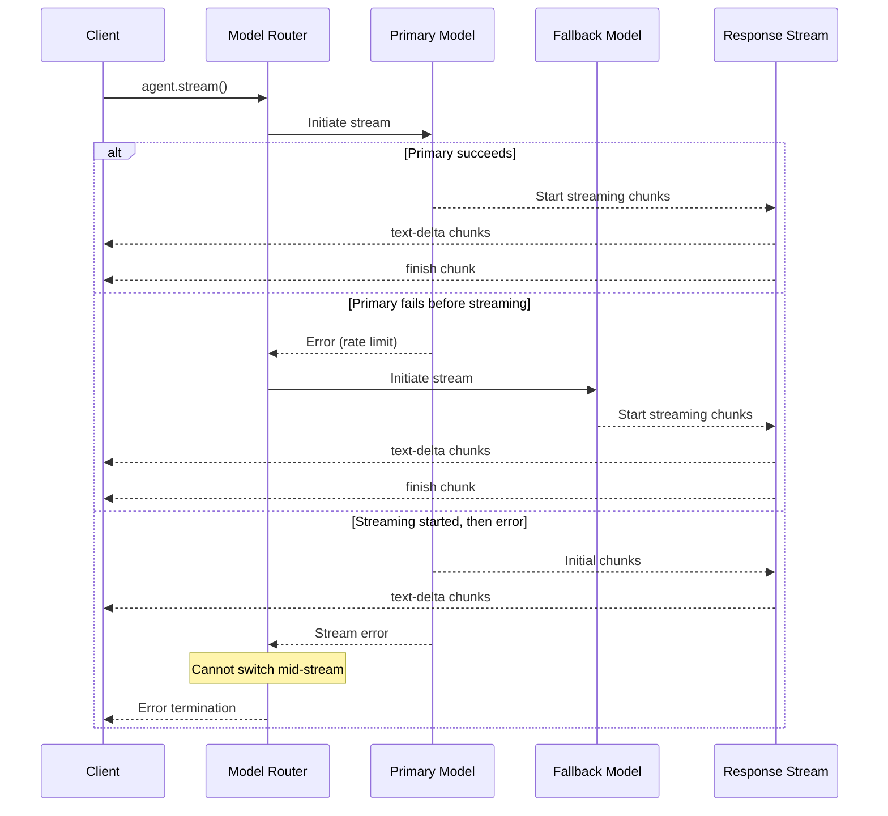

# Model Fallbacks and Error Handling

<details>
<summary>Relevant source files</summary>

The following files were used as context for generating this wiki page:

- [docs/src/content/en/models/gateways/index.mdx](docs/src/content/en/models/gateways/index.mdx)
- [docs/src/content/en/models/gateways/netlify.mdx](docs/src/content/en/models/gateways/netlify.mdx)
- [docs/src/content/en/models/gateways/openrouter.mdx](docs/src/content/en/models/gateways/openrouter.mdx)
- [docs/src/content/en/models/gateways/vercel.mdx](docs/src/content/en/models/gateways/vercel.mdx)
- [docs/src/content/en/models/index.mdx](docs/src/content/en/models/index.mdx)
- [docs/src/content/en/models/providers/\_meta.ts](docs/src/content/en/models/providers/_meta.ts)
- [docs/src/content/en/models/providers/alibaba-cn.mdx](docs/src/content/en/models/providers/alibaba-cn.mdx)
- [docs/src/content/en/models/providers/alibaba.mdx](docs/src/content/en/models/providers/alibaba.mdx)
- [docs/src/content/en/models/providers/anthropic.mdx](docs/src/content/en/models/providers/anthropic.mdx)
- [docs/src/content/en/models/providers/baseten.mdx](docs/src/content/en/models/providers/baseten.mdx)
- [docs/src/content/en/models/providers/cerebras.mdx](docs/src/content/en/models/providers/cerebras.mdx)
- [docs/src/content/en/models/providers/chutes.mdx](docs/src/content/en/models/providers/chutes.mdx)
- [docs/src/content/en/models/providers/cortecs.mdx](docs/src/content/en/models/providers/cortecs.mdx)
- [docs/src/content/en/models/providers/deepinfra.mdx](docs/src/content/en/models/providers/deepinfra.mdx)
- [docs/src/content/en/models/providers/github-models.mdx](docs/src/content/en/models/providers/github-models.mdx)
- [docs/src/content/en/models/providers/google.mdx](docs/src/content/en/models/providers/google.mdx)
- [docs/src/content/en/models/providers/groq.mdx](docs/src/content/en/models/providers/groq.mdx)
- [docs/src/content/en/models/providers/index.mdx](docs/src/content/en/models/providers/index.mdx)
- [docs/src/content/en/models/providers/modelscope.mdx](docs/src/content/en/models/providers/modelscope.mdx)
- [docs/src/content/en/models/providers/nano-gpt.mdx](docs/src/content/en/models/providers/nano-gpt.mdx)
- [docs/src/content/en/models/providers/nebius.mdx](docs/src/content/en/models/providers/nebius.mdx)
- [docs/src/content/en/models/providers/nvidia.mdx](docs/src/content/en/models/providers/nvidia.mdx)
- [docs/src/content/en/models/providers/openai.mdx](docs/src/content/en/models/providers/openai.mdx)
- [docs/src/content/en/models/providers/opencode.mdx](docs/src/content/en/models/providers/opencode.mdx)
- [docs/src/content/en/models/providers/perplexity.mdx](docs/src/content/en/models/providers/perplexity.mdx)
- [docs/src/content/en/models/providers/requesty.mdx](docs/src/content/en/models/providers/requesty.mdx)
- [docs/src/content/en/models/providers/scaleway.mdx](docs/src/content/en/models/providers/scaleway.mdx)
- [docs/src/content/en/models/providers/synthetic.mdx](docs/src/content/en/models/providers/synthetic.mdx)
- [docs/src/content/en/models/providers/togetherai.mdx](docs/src/content/en/models/providers/togetherai.mdx)
- [docs/src/content/en/models/providers/upstage.mdx](docs/src/content/en/models/providers/upstage.mdx)
- [docs/src/content/en/models/providers/venice.mdx](docs/src/content/en/models/providers/venice.mdx)
- [docs/src/content/en/models/providers/vultr.mdx](docs/src/content/en/models/providers/vultr.mdx)
- [docs/src/content/en/models/providers/wandb.mdx](docs/src/content/en/models/providers/wandb.mdx)
- [docs/src/content/en/models/providers/xai.mdx](docs/src/content/en/models/providers/xai.mdx)
- [docs/src/content/en/models/providers/zai-coding-plan.mdx](docs/src/content/en/models/providers/zai-coding-plan.mdx)
- [docs/src/content/en/models/providers/zai.mdx](docs/src/content/en/models/providers/zai.mdx)
- [docs/src/content/en/models/providers/zhipuai-coding-plan.mdx](docs/src/content/en/models/providers/zhipuai-coding-plan.mdx)
- [docs/src/content/en/models/providers/zhipuai.mdx](docs/src/content/en/models/providers/zhipuai.mdx)
- [docs/src/content/en/models/sidebars.js](docs/src/content/en/models/sidebars.js)
- [packages/core/src/llm/model/model.loop.ts](packages/core/src/llm/model/model.loop.ts)
- [packages/core/src/llm/model/model.loop.types.ts](packages/core/src/llm/model/model.loop.types.ts)
- [packages/core/src/llm/model/provider-registry.json](packages/core/src/llm/model/provider-registry.json)
- [packages/core/src/llm/model/provider-types.generated.d.ts](packages/core/src/llm/model/provider-types.generated.d.ts)
- [packages/core/src/loop/**snapshots**/loop.test.ts.snap](packages/core/src/loop/__snapshots__/loop.test.ts.snap)
- [packages/core/src/loop/index.ts](packages/core/src/loop/index.ts)
- [packages/core/src/loop/loop.test.ts](packages/core/src/loop/loop.test.ts)
- [packages/core/src/loop/loop.ts](packages/core/src/loop/loop.ts)
- [packages/core/src/loop/test-utils/fullStream.ts](packages/core/src/loop/test-utils/fullStream.ts)
- [packages/core/src/loop/test-utils/generateText.ts](packages/core/src/loop/test-utils/generateText.ts)
- [packages/core/src/loop/test-utils/options.ts](packages/core/src/loop/test-utils/options.ts)
- [packages/core/src/loop/test-utils/resultObject.ts](packages/core/src/loop/test-utils/resultObject.ts)
- [packages/core/src/loop/test-utils/streamObject.ts](packages/core/src/loop/test-utils/streamObject.ts)
- [packages/core/src/loop/test-utils/textStream.ts](packages/core/src/loop/test-utils/textStream.ts)
- [packages/core/src/loop/test-utils/tools.ts](packages/core/src/loop/test-utils/tools.ts)
- [packages/core/src/loop/test-utils/utils.ts](packages/core/src/loop/test-utils/utils.ts)
- [packages/core/src/loop/types.ts](packages/core/src/loop/types.ts)
- [packages/core/src/loop/workflows/agentic-execution/llm-execution-step.test.ts](packages/core/src/loop/workflows/agentic-execution/llm-execution-step.test.ts)
- [packages/core/src/loop/workflows/agentic-execution/llm-execution-step.ts](packages/core/src/loop/workflows/agentic-execution/llm-execution-step.ts)
- [packages/core/src/loop/workflows/agentic-execution/tool-call-step.test.ts](packages/core/src/loop/workflows/agentic-execution/tool-call-step.test.ts)
- [packages/core/src/loop/workflows/agentic-execution/tool-call-step.ts](packages/core/src/loop/workflows/agentic-execution/tool-call-step.ts)
- [packages/core/src/stream/aisdk/v5/compat/prepare-tools.test.ts](packages/core/src/stream/aisdk/v5/compat/prepare-tools.test.ts)
- [packages/core/src/stream/aisdk/v5/compat/prepare-tools.ts](packages/core/src/stream/aisdk/v5/compat/prepare-tools.ts)
- [packages/core/src/stream/aisdk/v5/output-helpers.ts](packages/core/src/stream/aisdk/v5/output-helpers.ts)
- [packages/core/src/stream/base/output.ts](packages/core/src/stream/base/output.ts)
- [packages/core/src/stream/types.ts](packages/core/src/stream/types.ts)
- [packages/core/src/tools/index.ts](packages/core/src/tools/index.ts)
- [packages/core/src/tools/provider-tool-utils.test.ts](packages/core/src/tools/provider-tool-utils.test.ts)
- [packages/core/src/tools/provider-tool-utils.ts](packages/core/src/tools/provider-tool-utils.ts)
- [packages/core/src/tools/toolchecks.test.ts](packages/core/src/tools/toolchecks.test.ts)
- [packages/core/src/tools/toolchecks.ts](packages/core/src/tools/toolchecks.ts)

</details>

This document covers the automatic failover and error handling mechanisms in Mastra's model provider system. For information about general model configuration patterns, see [Model Configuration Patterns](#5.2). For details on dynamic model selection, see [Dynamic Model Selection](#5.4).

## Purpose and Scope

Model fallbacks provide application-level automatic failover between language models and providers. When a primary model becomes unavailable due to outages, rate limits, or errors, Mastra automatically retries with configured backup models. This creates resilient AI applications without requiring explicit error handling code for every model call.

This system operates at the model router level, independent of API gateways, minimizing latency by avoiding additional network hops while providing the same reliability benefits.

**Sources:** [docs/src/content/en/models/index.mdx:271-302]()

## Fallback Chain Architecture



**Diagram: Fallback Chain Execution Flow**

The fallback chain operates as a sequential retry mechanism with per-model retry limits. When an error condition is detected, the system exhausts retries for the current model before moving to the next configured fallback.

**Sources:** [docs/src/content/en/models/index.mdx:271-302]()

## Configuration Syntax

### Array Format for Fallbacks

Fallbacks are configured by passing an array of model configurations to the `model` parameter. Each configuration in the array represents a model in the fallback chain, ordered from primary to final fallback.

```typescript
// Array of model configurations with fallbacks
const agent = new Agent({
  id: 'resilient-assistant',
  name: 'Resilient Assistant',
  instructions: 'You are a helpful assistant.',
  model: [
    {
      model: 'openai/gpt-5',
      maxRetries: 3,
    },
    {
      model: 'anthropic/claude-4-5-sonnet',
      maxRetries: 2,
    },
    {
      model: 'google/gemini-2.5-pro',
      maxRetries: 2,
    },
  ],
})
```

**Sources:** [docs/src/content/en/models/index.mdx:275-297]()

### Configuration Properties

| Property     | Type                     | Required | Description                                             |
| ------------ | ------------------------ | -------- | ------------------------------------------------------- |
| `model`      | `string`                 | Yes      | Model identifier in `provider/model-name` format        |
| `maxRetries` | `number`                 | Yes      | Number of retry attempts before moving to next fallback |
| `apiKey`     | `string`                 | No       | Custom API key for this specific model                  |
| `url`        | `string`                 | No       | Custom base URL for this model's provider               |
| `headers`    | `Record<string, string>` | No       | Custom HTTP headers for requests                        |

Each model in the fallback chain is configured independently, allowing different retry strategies and authentication for each provider.

**Sources:** [docs/src/content/en/models/index.mdx:275-297]()

## Error Conditions Triggering Fallback

### Automatic Failover Conditions



**Diagram: Error Conditions and Fallback Triggers**

### Error Condition Details

| Error Type   | HTTP Status | Trigger Fallback | Rationale                                         |
| ------------ | ----------- | ---------------- | ------------------------------------------------- |
| Server Error | 500-599     | Yes              | Temporary provider outage                         |
| Rate Limit   | 429         | Yes              | Quota exhausted, alternative provider may succeed |
| Timeout      | N/A         | Yes              | Network or processing timeout                     |
| Bad Request  | 400         | No               | Invalid request, will fail on all providers       |
| Unauthorized | 401         | No               | Authentication issue, requires API key fix        |
| Not Found    | 404         | No               | Model doesn't exist, won't exist on fallback      |

Client errors (4xx) do not trigger fallbacks because they indicate problems with the request itself that would persist across all providers. Only transient server-side issues trigger the fallback mechanism.

**Sources:** [docs/src/content/en/models/index.mdx:299-301]()

## Retry Logic and Exhaustion

### Per-Model Retry Behavior



**Diagram: Retry State Machine with Three-Model Fallback Chain**

The retry counter is model-specific. When `maxRetries` is exhausted for one model, the counter resets for the next model in the chain. This ensures each fallback gets a fair opportunity to succeed.

**Sources:** [docs/src/content/en/models/index.mdx:299-301]()

## Error Context Preservation

### Error Information Flow



**Diagram: Error Context Accumulation Through Fallback Chain**

Error context from each failed model is preserved and accumulated as the system moves through the fallback chain. If all models fail, the final error includes details from every attempt, providing complete debugging information.

When any model succeeds, previous errors are discarded, and only the successful response is returned to the user. This ensures users never see internal failover details during normal operation.

**Sources:** [docs/src/content/en/models/index.mdx:301-302]()

## Streaming Compatibility

### Stream Handling with Fallbacks

Fallbacks work seamlessly with both streaming and non-streaming responses. The fallback mechanism operates at the model invocation level, before any streaming begins.



**Diagram: Streaming Response Flow with Fallback**

**Key Behaviors:**

1. **Pre-Stream Fallback**: If an error occurs before streaming begins, the fallback mechanism works normally
2. **Mid-Stream Errors**: If streaming has started and then fails, the fallback chain cannot be used (connection already established)
3. **Transparent Switching**: Users receive the same stream format regardless of which model in the chain responds

The fallback decision happens during the initial connection phase. Once a model begins streaming response chunks, that model is committed for the entire response.

**Sources:** [docs/src/content/en/models/index.mdx:301-302]()

## Cross-Provider Fallback Strategies

### Geographic Diversity

```typescript
// Fallback across geographically diverse providers
const agent = new Agent({
  id: 'geo-diverse-agent',
  model: [
    {
      model: 'openai/gpt-5',
      maxRetries: 2,
    },
    {
      model: 'anthropic/claude-4-5-sonnet', // Different provider/infrastructure
      maxRetries: 2,
    },
    {
      model: 'google/gemini-2.5-pro', // Different provider/infrastructure
      maxRetries: 2,
    },
  ],
})
```

### Cost Optimization

```typescript
// Start with expensive high-capability model, fallback to cheaper alternatives
const agent = new Agent({
  id: 'cost-optimized-agent',
  model: [
    {
      model: 'anthropic/claude-opus-4-1', // Most capable, highest cost
      maxRetries: 1,
    },
    {
      model: 'anthropic/claude-sonnet-4-5', // Mid-tier capability/cost
      maxRetries: 2,
    },
    {
      model: 'openai/gpt-4o-mini', // Lower cost fallback
      maxRetries: 3,
    },
  ],
})
```

### Gateway Integration

```typescript
// Combine direct providers with gateway fallback
const agent = new Agent({
  id: 'gateway-fallback-agent',
  model: [
    {
      model: 'openai/gpt-5', // Direct OpenAI
      maxRetries: 2,
    },
    {
      model: 'anthropic/claude-4-5-sonnet', // Direct Anthropic
      maxRetries: 2,
    },
    {
      model: 'openrouter/anthropic/claude-haiku-4-5', // Gateway fallback
      maxRetries: 2,
    },
  ],
})
```

These strategies demonstrate common fallback patterns. Geographic diversity reduces the risk of regional outages. Cost optimization attempts expensive models first with quick failover. Gateway integration provides a final fallback that itself may have built-in redundancy.

**Sources:** [docs/src/content/en/models/index.mdx:271-302](), [docs/src/content/en/models/gateways/index.mdx:1-44]()

## Best Practices

### Retry Count Guidelines

| Model Position   | Recommended maxRetries | Rationale                        |
| ---------------- | ---------------------- | -------------------------------- |
| Primary          | 2-3                    | More retries for preferred model |
| Middle fallbacks | 2                      | Balanced retry approach          |
| Final fallback   | 2-3                    | Last chance before total failure |

Higher retry counts on the primary model give it more opportunities to succeed, while middle fallbacks use moderate retry counts to move quickly through the chain. The final fallback gets additional retries since it's the last option.

### When to Use Fallbacks

**Use fallbacks when:**

- Production uptime is critical
- Provider outages would impact users
- Rate limits are frequently encountered
- Multiple providers can fulfill the same task

**Avoid fallbacks when:**

- Models in chain have different capabilities (may produce inconsistent results)
- Cost of multiple attempts is prohibitive
- Request latency is more critical than reliability
- Only one provider meets requirements (security, compliance)

### Testing Fallback Chains

```typescript
// Test fallback behavior by forcing primary failure
const agent = new Agent({
  id: 'test-agent',
  model: [
    {
      model: 'openai/gpt-5',
      maxRetries: 1,
      apiKey: 'invalid-key', // Force authentication failure
    },
    {
      model: 'anthropic/claude-4-5-sonnet',
      maxRetries: 1,
    },
  ],
})

// In development, verify fallback triggers correctly
const response = await agent.generate('Test message')
console.log('Model used:', response.metadata?.model)
```

Testing should verify that fallbacks trigger on expected error conditions and that the final response quality is acceptable regardless of which model responds.

**Sources:** [docs/src/content/en/models/index.mdx:271-302]()

## Integration with Request Context

Fallback configuration can be combined with dynamic model selection using request context:

```typescript
const agent = new Agent({
  id: 'dynamic-fallback-agent',
  model: ({ requestContext }) => {
    const tier = requestContext.get('user-tier')

    if (tier === 'premium') {
      return [
        { model: 'anthropic/claude-opus-4-1', maxRetries: 3 },
        { model: 'openai/gpt-5', maxRetries: 2 },
      ]
    }

    return [
      { model: 'openai/gpt-4o-mini', maxRetries: 2 },
      { model: 'anthropic/claude-haiku-4-5', maxRetries: 2 },
    ]
  },
})
```

This pattern enables per-request fallback chains based on user tier, feature flags, or other runtime context. See [Dynamic Model Selection](#5.4) for more details on request context usage.

**Sources:** [docs/src/content/en/models/index.mdx:193-212]()

## Comparison with API Gateways

| Feature       | Mastra Fallbacks           | API Gateway Fallbacks  |
| ------------- | -------------------------- | ---------------------- |
| Latency       | Application-level (lowest) | Additional network hop |
| Configuration | Code-based                 | Gateway UI/API         |
| Customization | Full control per agent     | Gateway-wide rules     |
| Error context | Preserved in application   | May be abstracted      |
| Streaming     | Native support             | Gateway-dependent      |
| Cost          | No additional fees         | Gateway fees may apply |

Mastra's application-level fallbacks provide lower latency and more granular control compared to gateway-based solutions, at the cost of requiring configuration in code. Gateway fallbacks offer centralized management but introduce additional network latency.

Both approaches can be used together, with Mastra fallbacks as the first line of defense and a gateway fallback as the final option.

**Sources:** [docs/src/content/en/models/index.mdx:271-302](), [docs/src/content/en/models/gateways/index.mdx:1-44]()
