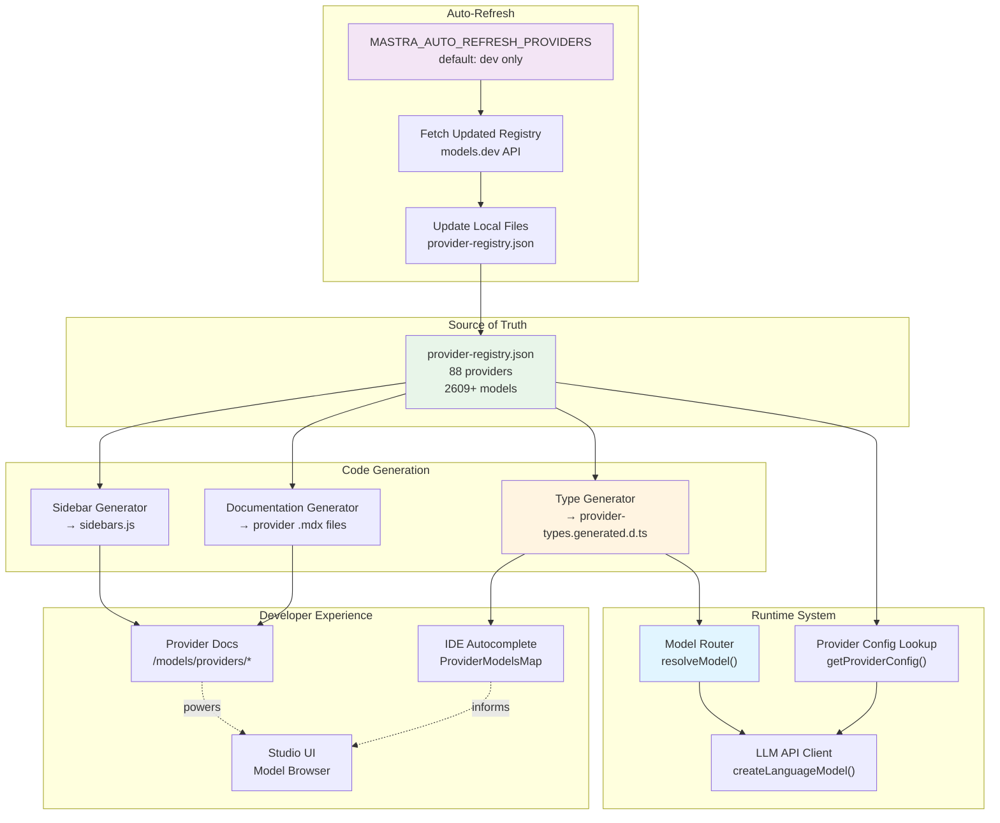
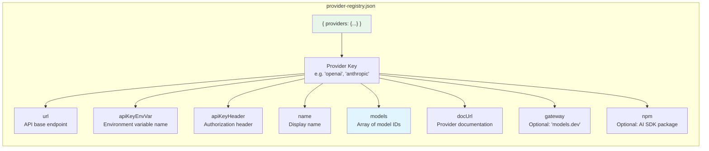
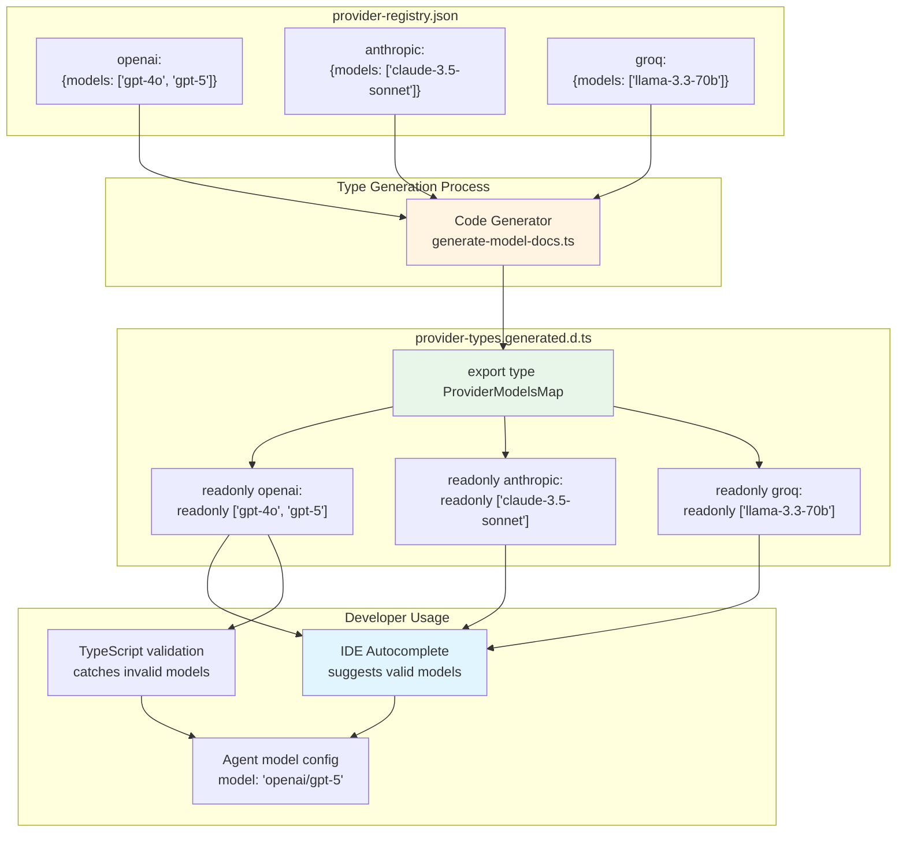
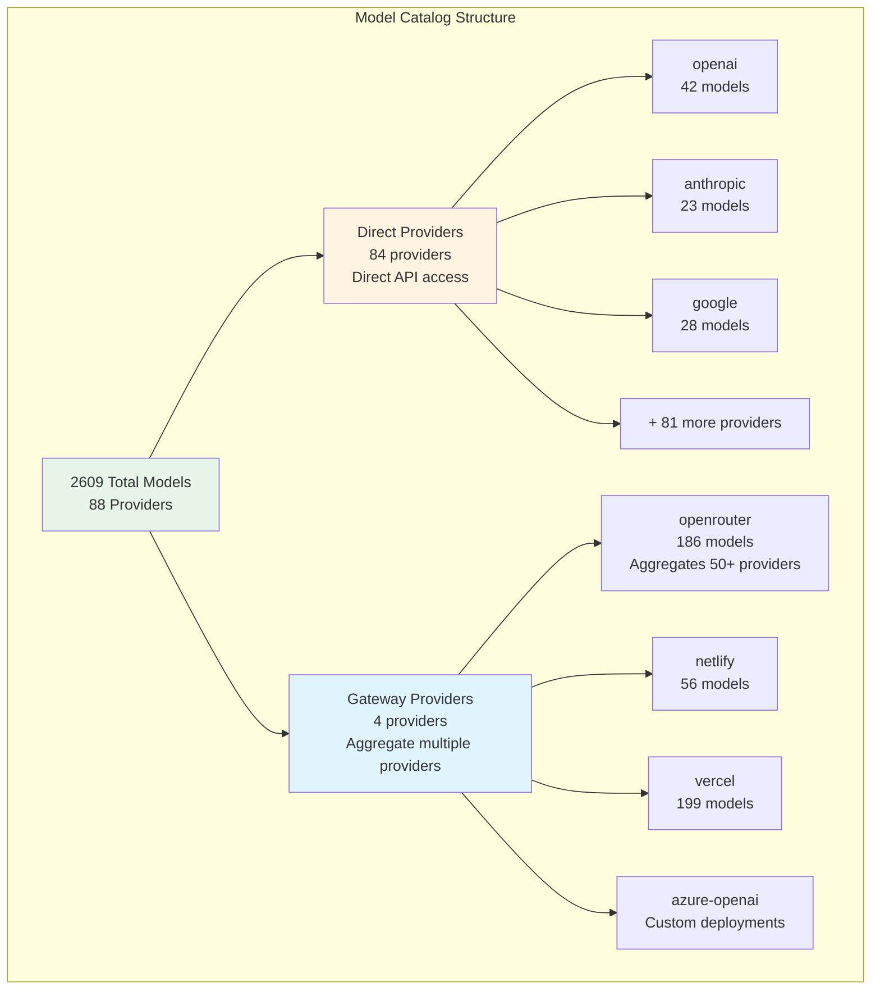
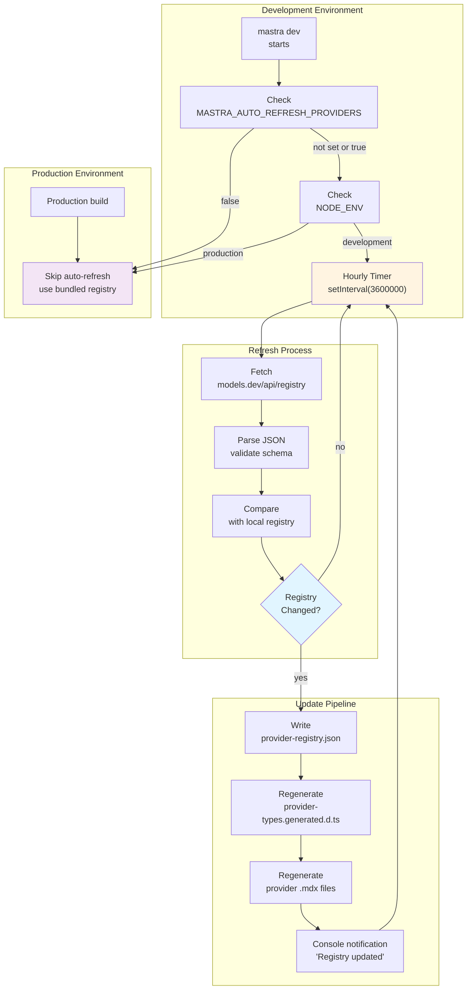
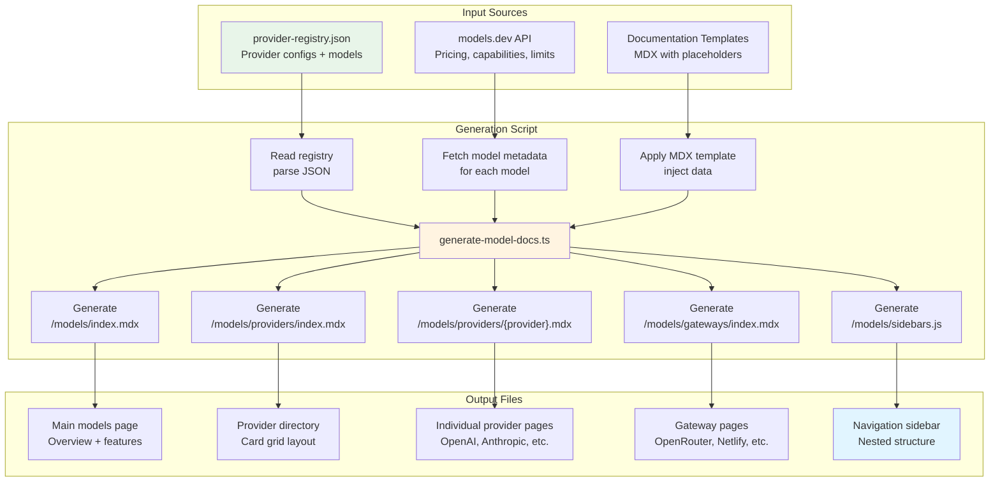
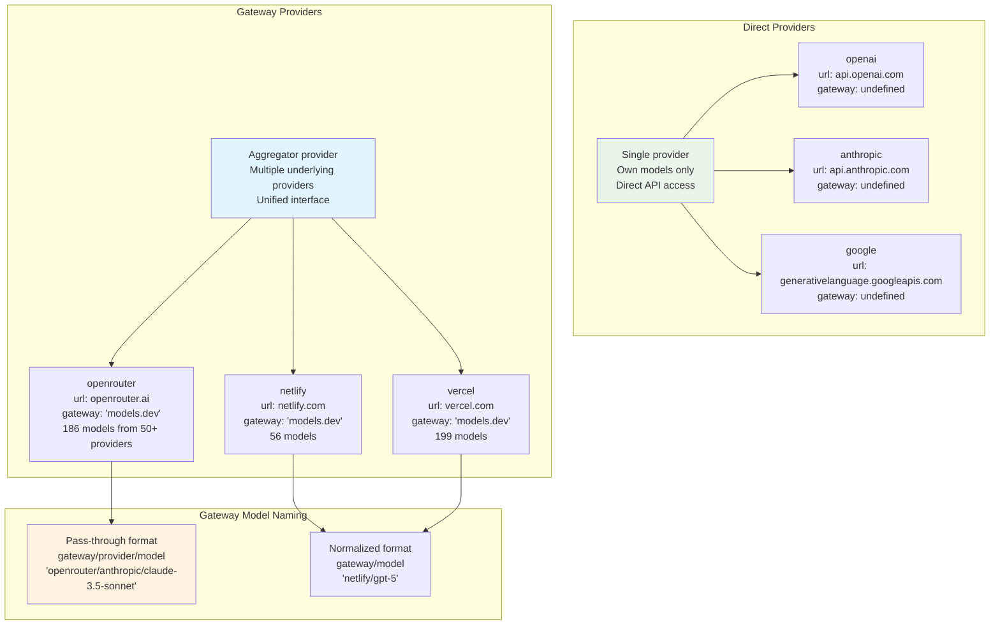
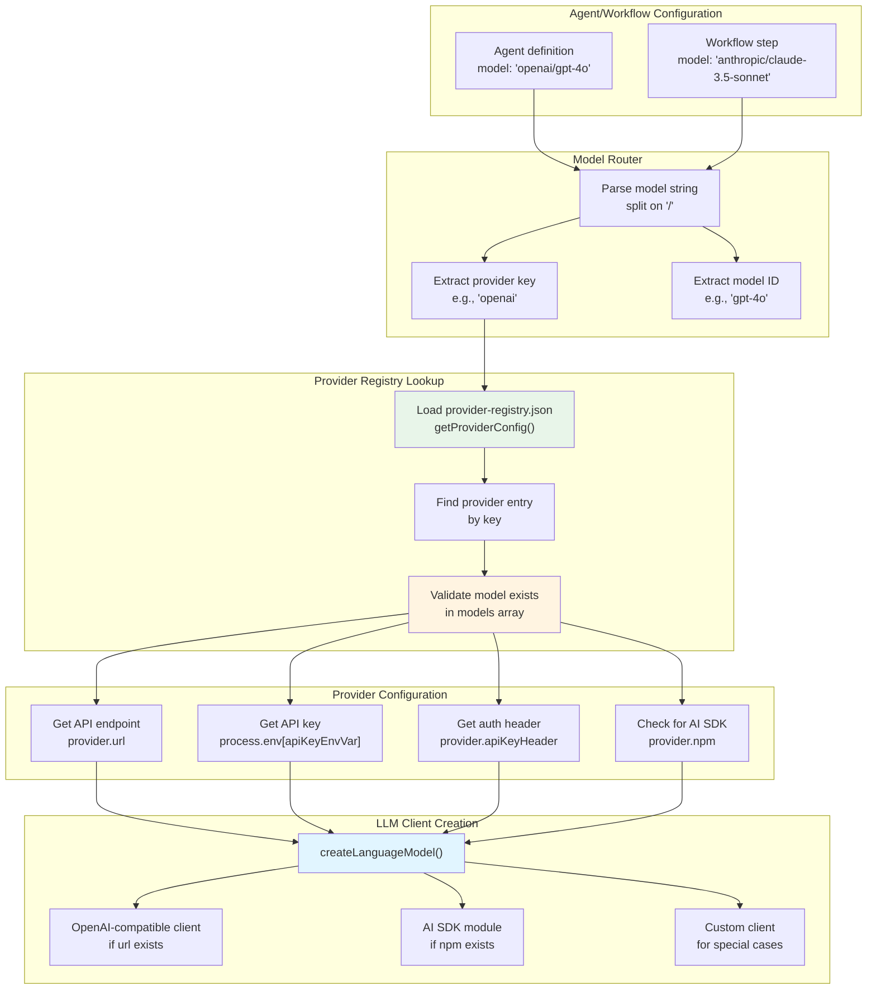

# Provider Registry and Model Catalog

<details>
<summary>Relevant source files</summary>

The following files were used as context for generating this wiki page:

- [docs/src/content/en/models/gateways/index.mdx](docs/src/content/en/models/gateways/index.mdx)
- [docs/src/content/en/models/gateways/netlify.mdx](docs/src/content/en/models/gateways/netlify.mdx)
- [docs/src/content/en/models/gateways/openrouter.mdx](docs/src/content/en/models/gateways/openrouter.mdx)
- [docs/src/content/en/models/gateways/vercel.mdx](docs/src/content/en/models/gateways/vercel.mdx)
- [docs/src/content/en/models/index.mdx](docs/src/content/en/models/index.mdx)
- [docs/src/content/en/models/providers/\_meta.ts](docs/src/content/en/models/providers/_meta.ts)
- [docs/src/content/en/models/providers/alibaba-cn.mdx](docs/src/content/en/models/providers/alibaba-cn.mdx)
- [docs/src/content/en/models/providers/alibaba.mdx](docs/src/content/en/models/providers/alibaba.mdx)
- [docs/src/content/en/models/providers/anthropic.mdx](docs/src/content/en/models/providers/anthropic.mdx)
- [docs/src/content/en/models/providers/baseten.mdx](docs/src/content/en/models/providers/baseten.mdx)
- [docs/src/content/en/models/providers/cerebras.mdx](docs/src/content/en/models/providers/cerebras.mdx)
- [docs/src/content/en/models/providers/chutes.mdx](docs/src/content/en/models/providers/chutes.mdx)
- [docs/src/content/en/models/providers/cortecs.mdx](docs/src/content/en/models/providers/cortecs.mdx)
- [docs/src/content/en/models/providers/deepinfra.mdx](docs/src/content/en/models/providers/deepinfra.mdx)
- [docs/src/content/en/models/providers/github-models.mdx](docs/src/content/en/models/providers/github-models.mdx)
- [docs/src/content/en/models/providers/google.mdx](docs/src/content/en/models/providers/google.mdx)
- [docs/src/content/en/models/providers/groq.mdx](docs/src/content/en/models/providers/groq.mdx)
- [docs/src/content/en/models/providers/index.mdx](docs/src/content/en/models/providers/index.mdx)
- [docs/src/content/en/models/providers/modelscope.mdx](docs/src/content/en/models/providers/modelscope.mdx)
- [docs/src/content/en/models/providers/nano-gpt.mdx](docs/src/content/en/models/providers/nano-gpt.mdx)
- [docs/src/content/en/models/providers/nebius.mdx](docs/src/content/en/models/providers/nebius.mdx)
- [docs/src/content/en/models/providers/nvidia.mdx](docs/src/content/en/models/providers/nvidia.mdx)
- [docs/src/content/en/models/providers/openai.mdx](docs/src/content/en/models/providers/openai.mdx)
- [docs/src/content/en/models/providers/opencode.mdx](docs/src/content/en/models/providers/opencode.mdx)
- [docs/src/content/en/models/providers/perplexity.mdx](docs/src/content/en/models/providers/perplexity.mdx)
- [docs/src/content/en/models/providers/requesty.mdx](docs/src/content/en/models/providers/requesty.mdx)
- [docs/src/content/en/models/providers/scaleway.mdx](docs/src/content/en/models/providers/scaleway.mdx)
- [docs/src/content/en/models/providers/synthetic.mdx](docs/src/content/en/models/providers/synthetic.mdx)
- [docs/src/content/en/models/providers/togetherai.mdx](docs/src/content/en/models/providers/togetherai.mdx)
- [docs/src/content/en/models/providers/upstage.mdx](docs/src/content/en/models/providers/upstage.mdx)
- [docs/src/content/en/models/providers/venice.mdx](docs/src/content/en/models/providers/venice.mdx)
- [docs/src/content/en/models/providers/vultr.mdx](docs/src/content/en/models/providers/vultr.mdx)
- [docs/src/content/en/models/providers/wandb.mdx](docs/src/content/en/models/providers/wandb.mdx)
- [docs/src/content/en/models/providers/xai.mdx](docs/src/content/en/models/providers/xai.mdx)
- [docs/src/content/en/models/providers/zai-coding-plan.mdx](docs/src/content/en/models/providers/zai-coding-plan.mdx)
- [docs/src/content/en/models/providers/zai.mdx](docs/src/content/en/models/providers/zai.mdx)
- [docs/src/content/en/models/providers/zhipuai-coding-plan.mdx](docs/src/content/en/models/providers/zhipuai-coding-plan.mdx)
- [docs/src/content/en/models/providers/zhipuai.mdx](docs/src/content/en/models/providers/zhipuai.mdx)
- [docs/src/content/en/models/sidebars.js](docs/src/content/en/models/sidebars.js)
- [packages/core/src/llm/model/provider-registry.json](packages/core/src/llm/model/provider-registry.json)
- [packages/core/src/llm/model/provider-types.generated.d.ts](packages/core/src/llm/model/provider-types.generated.d.ts)

</details>

This document describes the provider registry system that maintains Mastra's catalog of 88 LLM providers and 2609+ models. The registry provides a single source of truth for provider configurations, model availability, authentication requirements, and API endpoints. This system enables Mastra's unified model routing interface where any model can be accessed using the `"provider/model-name"` string format.

For information about using models in agents and workflows, see [Model Configuration Patterns](#5.2). For details on dynamic model selection and fallback chains, see [Dynamic Model Selection](#5.4) and [Model Fallbacks and Error Handling](#5.5).

## Provider Registry Architecture

The provider registry follows a code generation pipeline that transforms a central JSON configuration into TypeScript types and documentation.



**Diagram: Provider Registry System Architecture**

The registry serves multiple purposes: it provides type definitions for IDE autocomplete, powers the model router for runtime resolution, drives documentation generation, and supports auto-refresh to keep the catalog current.

Sources: [packages/core/src/llm/model/provider-registry.json:1-2609](), [packages/core/src/llm/model/provider-types.generated.d.ts:1-10](), [docs/src/content/en/models/index.mdx:1-160]()

## Provider Registry JSON Structure

The `provider-registry.json` file at [packages/core/src/llm/model/provider-registry.json]() defines each provider's configuration. The file structure follows this schema:



**Diagram: Provider Registry Entry Structure**

Sources: [packages/core/src/llm/model/provider-registry.json:1-100]()

### Field Descriptions

| Field          | Type     | Required | Purpose                                         | Example                                     |
| -------------- | -------- | -------- | ----------------------------------------------- | ------------------------------------------- |
| `url`          | string   | No\*     | API base endpoint (without `/chat/completions`) | `"https://api.openai.com/v1"`               |
| `apiKeyEnvVar` | string   | Yes      | Environment variable name for API key           | `"OPENAI_API_KEY"`                          |
| `apiKeyHeader` | string   | Yes      | Header name for authentication                  | `"Authorization"`                           |
| `name`         | string   | Yes      | Human-readable provider name                    | `"OpenAI"`                                  |
| `models`       | string[] | Yes      | Array of available model identifiers            | `["gpt-4o", "gpt-4o-mini"]`                 |
| `docUrl`       | string   | Yes      | Link to provider's official documentation       | `"https://platform.openai.com/docs/models"` |
| `gateway`      | string   | No       | Set to `"models.dev"` if aggregator gateway     | `"models.dev"`                              |
| `npm`          | string   | No       | AI SDK provider package name if available       | `"@ai-sdk/openai"`                          |

\* `url` is optional for providers that only support AI SDK modules (e.g., Amazon Bedrock, Azure)

### Example Provider Configurations

**Direct Provider (OpenAI):**

```json
"openai": {
  "url": "https://api.openai.com/v1",
  "apiKeyEnvVar": "OPENAI_API_KEY",
  "apiKeyHeader": "Authorization",
  "name": "OpenAI",
  "models": ["gpt-4o", "gpt-4o-mini", "gpt-5"],
  "docUrl": "https://platform.openai.com/docs/models"
}
```

**Gateway Provider (ZenMux):**

```json
"zenmux": {
  "url": "https://zenmux.ai/api/anthropic/v1",
  "apiKeyEnvVar": "ZENMUX_API_KEY",
  "apiKeyHeader": "Authorization",
  "name": "ZenMux",
  "models": ["anthropic/claude-3.5-sonnet", "openai/gpt-5"],
  "docUrl": "https://docs.zenmux.ai",
  "gateway": "models.dev",
  "npm": "@ai-sdk/anthropic"
}
```

**Provider with AI SDK Module (Deep Infra):**

```json
"deepinfra": {
  "apiKeyEnvVar": "DEEPINFRA_API_KEY",
  "name": "Deep Infra",
  "models": ["MiniMaxAI/MiniMax-M2", "Qwen/Qwen3-Coder-480B-A35B-Instruct"],
  "docUrl": "https://deepinfra.com/models",
  "gateway": "models.dev",
  "npm": "@ai-sdk/deepinfra"
}
```

Sources: [packages/core/src/llm/model/provider-registry.json:1-50](), [packages/core/src/llm/model/provider-registry.json:45-122](), [packages/core/src/llm/model/provider-registry.json:332-355]()

## Type Generation and ProviderModelsMap

The `provider-types.generated.d.ts` file is auto-generated from the registry to provide TypeScript type safety for model selection.



**Diagram: Type Generation Pipeline**

The generated `ProviderModelsMap` type provides several benefits:

1. **IDE Autocomplete**: When typing `model: "anthropic/`, the IDE suggests all available Anthropic models
2. **Compile-Time Safety**: Invalid model strings like `"openai/invalid-model"` produce TypeScript errors
3. **Documentation**: The type serves as machine-readable documentation of all available models
4. **Refactoring Support**: Model renames can be detected across the codebase

### Generated Type Structure

The `ProviderModelsMap` type is defined as a record of provider keys to readonly string tuples:

```typescript
export type ProviderModelsMap = {
  readonly openai: readonly [
    'codex-mini-latest',
    'gpt-3.5-turbo',
    'gpt-4',
    'gpt-4-turbo',
    'gpt-4.1',
    'gpt-5',
    // ... 42 total models
  ]
  readonly anthropic: readonly [
    'claude-3-5-haiku-20241022',
    'claude-3-5-sonnet-20240620',
    'claude-3-7-sonnet-20250219',
    // ... 23 total models
  ]
  // ... 88 total providers
}
```

The readonly modifiers ensure the type definitions cannot be accidentally mutated at runtime.

Sources: [packages/core/src/llm/model/provider-types.generated.d.ts:1-857](), [packages/core/src/llm/model/provider-types.generated.d.ts:10-25]()

## Model Catalog Organization

The 2609 models are organized hierarchically by provider, with consistent naming conventions.



**Diagram: Model Catalog Hierarchy**

### Model Naming Conventions

Models follow the format `"provider/model-name"`:

| Provider Type          | Format                      | Example                                    |
| ---------------------- | --------------------------- | ------------------------------------------ |
| Direct Provider        | `provider/model-id`         | `"openai/gpt-4o"`                          |
| Gateway (pass-through) | `gateway/provider/model-id` | `"openrouter/anthropic/claude-3.5-sonnet"` |
| Gateway (normalized)   | `gateway/model-id`          | `"netlify/anthropic/claude-haiku-4-5"`     |
| Local/Custom           | `custom/model-id`           | `"lmstudio/qwen3-32b"`                     |

### Provider Distribution

| Category              | Count | Examples                                                    |
| --------------------- | ----- | ----------------------------------------------------------- |
| Major Cloud Providers | 6     | OpenAI, Anthropic, Google, AWS Bedrock, Azure, Cohere       |
| Regional Providers    | 12    | Alibaba (China), Moonshot AI (China), Z.AI, Zhipu AI        |
| Gateway Aggregators   | 4     | OpenRouter, Netlify, Vercel, Azure OpenAI                   |
| Specialized Inference | 15    | Groq, Cerebras, Fireworks, Together AI, Deep Infra          |
| Edge/Serverless       | 8     | Cloudflare Workers AI, Netlify, Vercel, Scaleway            |
| Open Source Hosting   | 43    | Hugging Face, Replicate, Baseten, Modal, RunPod, and others |

Sources: [packages/core/src/llm/model/provider-registry.json:1-2609](), [docs/src/content/en/models/providers/index.mdx:10-436](), [docs/src/content/en/models/gateways/index.mdx:10-44]()

## Auto-Refresh System

The auto-refresh system keeps the local model catalog synchronized with the upstream registry on models.dev.



**Diagram: Auto-Refresh System Flow**

### Configuration

Auto-refresh behavior is controlled by the `MASTRA_AUTO_REFRESH_PROVIDERS` environment variable:

| Value       | Development | Production | Behavior         |
| ----------- | ----------- | ---------- | ---------------- |
| `undefined` | ✓ Enabled   | ✗ Disabled | Default behavior |
| `"true"`    | ✓ Enabled   | ✓ Enabled  | Always refresh   |
| `"false"`   | ✗ Disabled  | ✗ Disabled | Never refresh    |

### Refresh Timing

- **Frequency**: Checks every hour (3600000ms)
- **First Check**: 5 seconds after development server starts
- **Trigger**: Runs only when `mastra dev` is active
- **Network Failure**: Silent retry on next interval

### What Gets Updated

When the registry changes, the system updates:

1. `provider-registry.json` - Core registry data
2. `provider-types.generated.d.ts` - TypeScript type definitions
3. `docs/src/content/en/models/providers/*.mdx` - Provider documentation pages
4. `docs/src/content/en/models/sidebars.js` - Documentation navigation

The TypeScript compiler and documentation system automatically pick up changes, providing updated autocomplete and docs without restarting the dev server.

Sources: [docs/src/content/en/models/index.mdx:162-165]()

## Documentation Generation Pipeline

Provider documentation is automatically generated from the registry, ensuring consistency and reducing maintenance burden.



**Diagram: Documentation Generation Pipeline**

### Generated Documentation Structure

Each provider page includes:

1. **Provider Header**: Logo, name, model count
2. **Authentication Section**: Environment variable setup with code examples
3. **Usage Example**: Agent configuration with `model: "provider/model-name"`
4. **Models Table**: Interactive table with pricing, capabilities, context windows
5. **Advanced Configuration**: Custom headers, dynamic selection examples

### Template Variables

The documentation generator uses these template variables:

| Variable           | Source          | Example Value                               |
| ------------------ | --------------- | ------------------------------------------- |
| `{{providerName}}` | `name` field    | `"OpenAI"`                                  |
| `{{providerKey}}`  | Provider key    | `"openai"`                                  |
| `{{modelCount}}`   | `models.length` | `42`                                        |
| `{{apiKeyEnvVar}}` | `apiKeyEnvVar`  | `"OPENAI_API_KEY"`                          |
| `{{docUrl}}`       | `docUrl`        | `"https://platform.openai.com/docs/models"` |
| `{{logo}}`         | Computed        | `"https://models.dev/logos/openai.svg"`     |
| `{{models}}`       | `models` array  | JSON array of model objects                 |

### Sidebar Generation

The sidebar at [docs/src/content/en/models/sidebars.js:1-515]() is structured as:

```javascript
{
  modelsSidebar: [
    'index',
    'embeddings',
    {
      type: 'category',
      label: 'Gateways',
      items: [
        'gateways/index',
        'gateways/custom-gateways',
        'gateways/azure-openai',
        'gateways/netlify',
        'gateways/openrouter',
        'gateways/vercel',
      ],
    },
    {
      type: 'category',
      label: 'Providers',
      items: [
        'providers/index',
        'providers/openai',
        'providers/anthropic',
        // ... all 84 providers
      ],
    },
  ]
}
```

The generator sorts providers alphabetically and separates gateways from direct providers.

Sources: [docs/src/content/en/models/index.mdx:1-6](), [docs/src/content/en/models/providers/index.mdx:1-6](), [docs/src/content/en/models/sidebars.js:1-515]()

## Gateway vs Direct Provider Classification

The registry distinguishes between gateway providers (aggregators) and direct providers (single-model vendors).



**Diagram: Gateway vs Direct Provider Classification**

### Identification

A provider is classified as a gateway if:

1. The `gateway` field is set to `"models.dev"` in the registry
2. The provider's documentation explicitly describes aggregation features
3. The model list includes models from multiple underlying providers

### Gateway Characteristics

| Aspect                   | Gateway Providers                           | Direct Providers            |
| ------------------------ | ------------------------------------------- | --------------------------- |
| **Model Count**          | High (100-200+ models)                      | Low to medium (1-50 models) |
| **Underlying Providers** | Multiple (OpenAI, Anthropic, etc.)          | Single (own models)         |
| **API Key**              | Gateway-specific or pass-through            | Provider-specific only      |
| **Features**             | Caching, rate limiting, failover, analytics | Raw model access            |
| **Pricing**              | Gateway markup or pass-through              | Direct provider pricing     |
| **Model Naming**         | May include provider prefix                 | Simple model ID             |

### Gateway Benefits

Gateway providers offer several advantages:

1. **Unified Authentication**: Single API key for multiple providers
2. **Built-in Failover**: Automatic switching between providers during outages
3. **Caching**: Response caching to reduce costs and latency
4. **Rate Limiting**: Automatic throttling and retry logic
5. **Analytics**: Usage tracking and cost monitoring
6. **Model Discovery**: Easy access to latest models without updating code

### Gateway Examples

**OpenRouter** [packages/core/src/llm/model/provider-registry.json:1076-1286]():

- 186 models from 50+ providers
- Pass-through naming: `openrouter/anthropic/claude-3.5-sonnet`
- Supports both gateway API key and provider pass-through

**Netlify** [docs/src/content/en/models/gateways/netlify.mdx:1-110]():

- 56 models from OpenAI, Anthropic, Google
- Normalized naming: `netlify/openai/gpt-4o`
- Built-in caching with Netlify Edge

**Vercel** [docs/src/content/en/models/gateways/vercel.mdx:1-237]():

- 199 models from major providers
- Normalized naming: `vercel/openai/gpt-5`
- Integration with Vercel AI SDK

Sources: [packages/core/src/llm/model/provider-registry.json:1076-1286](), [docs/src/content/en/models/gateways/index.mdx:10-44](), [docs/src/content/en/models/index.mdx:22-26]()

## Provider Metadata Schema

Each provider entry in the registry contains structured metadata used for runtime model resolution and documentation generation.

### Required Fields

All providers must define:

- `apiKeyEnvVar`: Environment variable name (e.g., `"OPENAI_API_KEY"`)
- `apiKeyHeader`: HTTP header name (typically `"Authorization"`)
- `name`: Human-readable display name
- `models`: Non-empty array of model identifiers
- `docUrl`: Link to official provider documentation

### Optional Fields

Providers may optionally include:

- `url`: API base URL (required for OpenAI-compatible APIs, optional for AI SDK-only providers)
- `gateway`: Set to `"models.dev"` for aggregator providers
- `npm`: AI SDK provider package name (e.g., `"@ai-sdk/openai"`)

### Model Array Format

The `models` array contains string identifiers that vary by provider type:

**Direct Provider (simple IDs):**

```json
"models": ["gpt-4o", "gpt-4o-mini", "gpt-5"]
```

**Gateway Provider (includes upstream provider):**

```json
"models": [
  "anthropic/claude-3.5-sonnet",
  "openai/gpt-5",
  "google/gemini-2.5-pro"
]
```

**Regional Provider (vendor-specific formatting):**

```json
"models": [
  "Qwen/Qwen3-235B-A22B-Instruct-2507",
  "meta-llama/Llama-3.3-70B-Instruct"
]
```

### Environment Variable Naming Patterns

The registry uses consistent patterns for `apiKeyEnvVar`:

| Pattern                | Example                        | Providers                              |
| ---------------------- | ------------------------------ | -------------------------------------- |
| `{PROVIDER}_API_KEY`   | `OPENAI_API_KEY`               | OpenAI, Anthropic, Groq, Mistral (40+) |
| `{PROVIDER}_TOKEN`     | `NETLIFY_TOKEN`                | Netlify (1)                            |
| `{PROVIDER}_SITE_ID`   | `NETLIFY_SITE_ID`              | Netlify (additional) (1)               |
| `{PROVIDER}_API_TOKEN` | `BAILING_API_TOKEN`            | Some regional providers (3)            |
| Custom                 | `GOOGLE_GENERATIVE_AI_API_KEY` | Google (1)                             |

Sources: [packages/core/src/llm/model/provider-registry.json:1-100](), [packages/core/src/llm/model/provider-registry.json:150-230](), [packages/core/src/llm/model/provider-registry.json:969-1019]()

## Integration with Model Router

The provider registry serves as the data source for runtime model resolution in Mastra's model router system.



**Diagram: Model Router Integration with Provider Registry**

### Resolution Process

When an agent or workflow specifies a model string like `"openai/gpt-4o"`, the model router:

1. **Parses** the string into provider key (`openai`) and model ID (`gpt-4o`)
2. **Looks up** the provider configuration in `provider-registry.json`
3. **Validates** that `gpt-4o` exists in the provider's `models` array
4. **Retrieves** the API endpoint from the `url` field
5. **Reads** the API key from `process.env[apiKeyEnvVar]`
6. **Constructs** the authorization header using `apiKeyHeader`
7. **Creates** an LLM client (OpenAI-compatible or AI SDK module)

### Error Handling

The registry lookup provides clear error messages:

| Error Condition  | Error Message                                                | Example                       |
| ---------------- | ------------------------------------------------------------ | ----------------------------- |
| Unknown provider | `"Provider '{provider}' not found in registry"`              | `"openxai/gpt-4"`             |
| Unknown model    | `"Model '{model}' not available for provider '{provider}'"`  | `"openai/gpt-99"`             |
| Missing API key  | `"Missing API key: set {apiKeyEnvVar} environment variable"` | Missing `OPENAI_API_KEY`      |
| Invalid format   | `"Invalid model format: expected 'provider/model-name'"`     | `"gpt-4o"` (missing provider) |

### Provider Configuration Cache

The model router caches provider configurations in memory to avoid repeated JSON parsing:

```typescript
// Conceptual cache structure
const providerConfigCache = new Map<string, ProviderConfig>()

function getProviderConfig(providerId: string): ProviderConfig {
  if (providerConfigCache.has(providerId)) {
    return providerConfigCache.get(providerId)
  }
  const config = registry.providers[providerId]
  providerConfigCache.set(providerId, config)
  return config
}
```

This optimization reduces lookup overhead during high-frequency model routing operations.

Sources: [packages/core/src/llm/model/provider-registry.json:1-2609](), [docs/src/content/en/models/index.mdx:27-44]()

## Registry Maintenance and Updates

The provider registry requires ongoing maintenance to keep pace with the rapidly evolving LLM ecosystem.

### Update Cadence

| Update Type        | Frequency     | Trigger                      |
| ------------------ | ------------- | ---------------------------- |
| New provider       | As released   | Provider launches API        |
| New model          | Weekly        | Provider releases model      |
| Model retirement   | As deprecated | Provider sunset notice       |
| Price changes      | Monthly       | Provider updates pricing     |
| Capability updates | Quarterly     | New features (vision, audio) |

### Upstream Data Source

The registry is synchronized with the models.dev registry, which aggregates provider information from:

1. **Official Provider APIs**: Model list endpoints (OpenAI `/models`, Anthropic `/models`)
2. **Provider Documentation**: Manual parsing of documentation sites
3. **Community Reports**: User-submitted updates and corrections
4. **Automated Crawlers**: Daily checks for new models and changes

### Manual Override Requirements

Some providers require manual configuration that cannot be auto-detected:

- **Custom API Endpoints**: Providers with non-standard URL patterns
- **Authentication Schemes**: Non-standard header names or formats
- **Model Aliases**: Provider-specific naming conventions
- **Capability Flags**: Features not advertised in API metadata

### Testing and Validation

Before registry updates are released:

1. **Schema Validation**: Ensure all required fields are present
2. **URL Testing**: Verify API endpoints are reachable
3. **Model Availability**: Confirm models are publicly accessible
4. **Documentation Links**: Check that `docUrl` fields are valid
5. **Type Generation**: Ensure TypeScript types compile successfully

### Contributing Provider Updates

To add or update a provider in the registry:

1. Edit `packages/core/src/llm/model/provider-registry.json`
2. Add or modify the provider entry with required fields
3. Run type generation: `npm run generate-types`
4. Run documentation generation: `npm run generate-docs`
5. Test locally with `mastra dev`
6. Submit pull request with provider testing evidence

Sources: [docs/src/content/en/models/index.mdx:162-165](), [packages/core/src/llm/model/provider-registry.json:1-6]()
