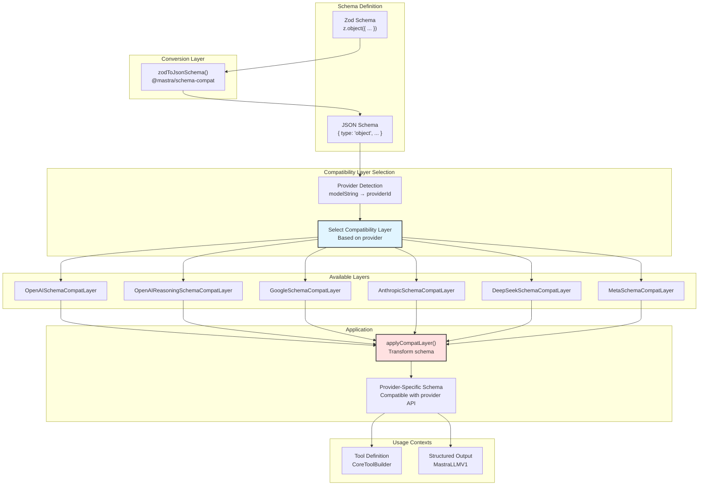
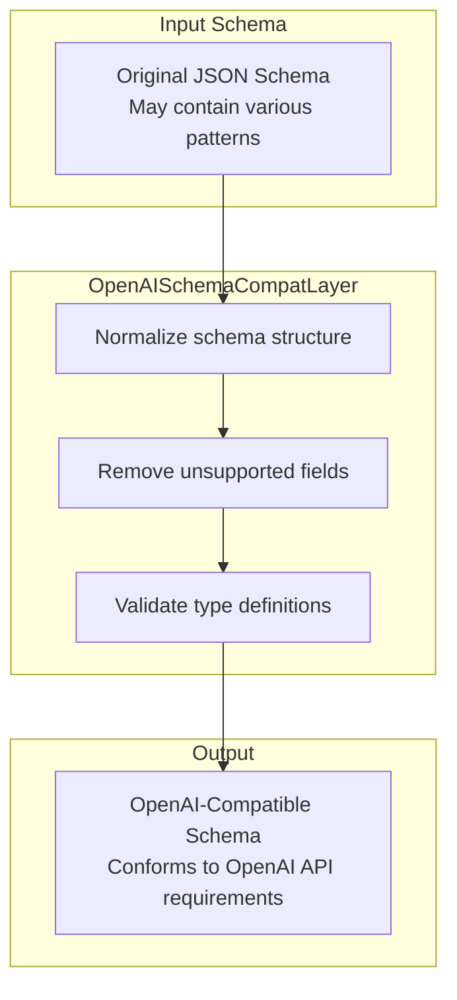
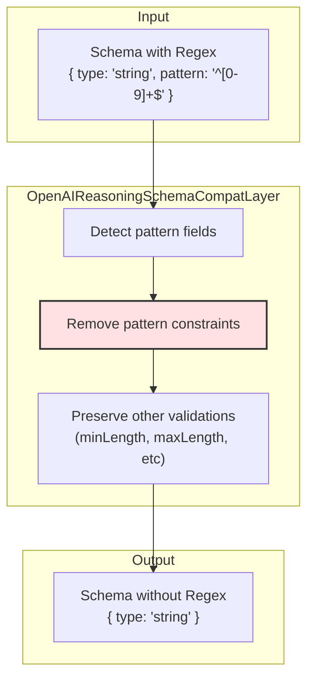
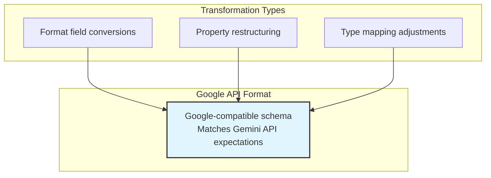
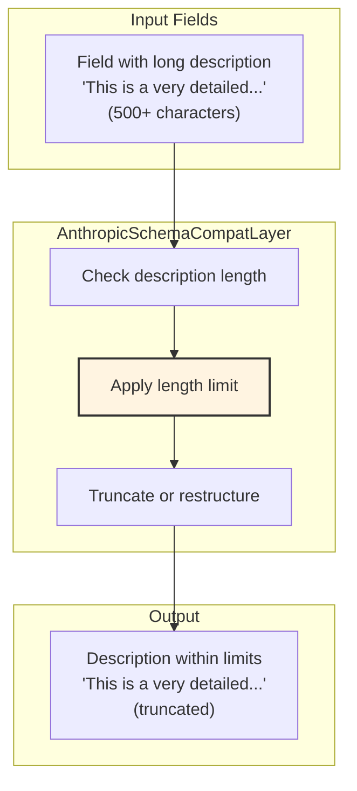
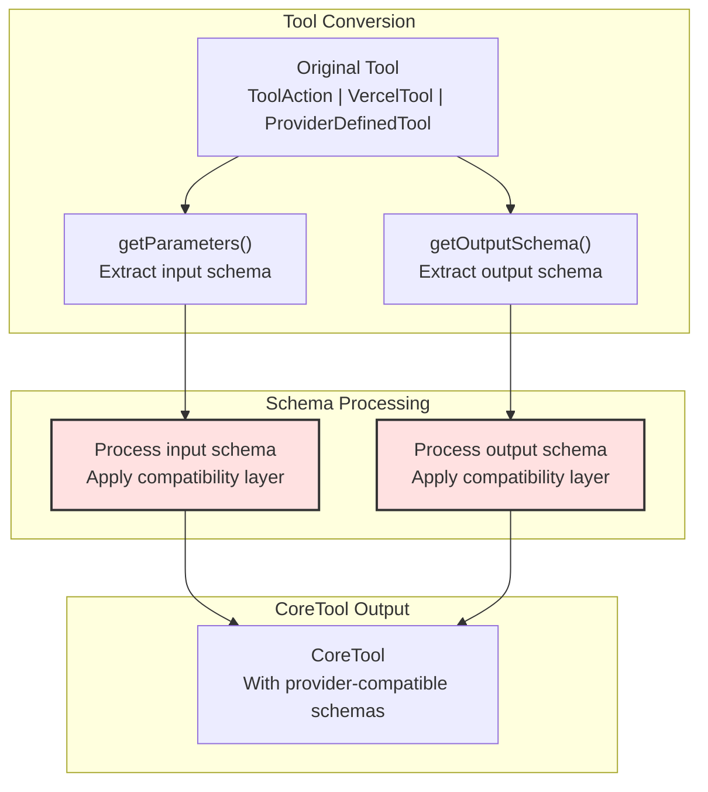
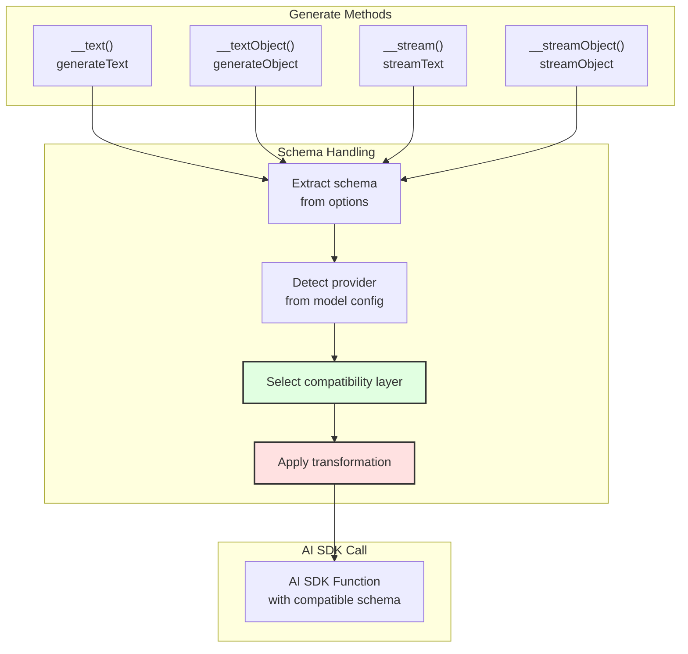

# Schema Compatibility Layers

<details>
<summary>Relevant source files</summary>

The following files were used as context for generating this wiki page:

- [docs/src/content/en/models/gateways/index.mdx](docs/src/content/en/models/gateways/index.mdx)
- [docs/src/content/en/models/gateways/netlify.mdx](docs/src/content/en/models/gateways/netlify.mdx)
- [docs/src/content/en/models/gateways/openrouter.mdx](docs/src/content/en/models/gateways/openrouter.mdx)
- [docs/src/content/en/models/gateways/vercel.mdx](docs/src/content/en/models/gateways/vercel.mdx)
- [docs/src/content/en/models/index.mdx](docs/src/content/en/models/index.mdx)
- [docs/src/content/en/models/providers/\_meta.ts](docs/src/content/en/models/providers/_meta.ts)
- [docs/src/content/en/models/providers/alibaba-cn.mdx](docs/src/content/en/models/providers/alibaba-cn.mdx)
- [docs/src/content/en/models/providers/alibaba.mdx](docs/src/content/en/models/providers/alibaba.mdx)
- [docs/src/content/en/models/providers/anthropic.mdx](docs/src/content/en/models/providers/anthropic.mdx)
- [docs/src/content/en/models/providers/baseten.mdx](docs/src/content/en/models/providers/baseten.mdx)
- [docs/src/content/en/models/providers/cerebras.mdx](docs/src/content/en/models/providers/cerebras.mdx)
- [docs/src/content/en/models/providers/chutes.mdx](docs/src/content/en/models/providers/chutes.mdx)
- [docs/src/content/en/models/providers/cortecs.mdx](docs/src/content/en/models/providers/cortecs.mdx)
- [docs/src/content/en/models/providers/deepinfra.mdx](docs/src/content/en/models/providers/deepinfra.mdx)
- [docs/src/content/en/models/providers/github-models.mdx](docs/src/content/en/models/providers/github-models.mdx)
- [docs/src/content/en/models/providers/google.mdx](docs/src/content/en/models/providers/google.mdx)
- [docs/src/content/en/models/providers/groq.mdx](docs/src/content/en/models/providers/groq.mdx)
- [docs/src/content/en/models/providers/index.mdx](docs/src/content/en/models/providers/index.mdx)
- [docs/src/content/en/models/providers/modelscope.mdx](docs/src/content/en/models/providers/modelscope.mdx)
- [docs/src/content/en/models/providers/nano-gpt.mdx](docs/src/content/en/models/providers/nano-gpt.mdx)
- [docs/src/content/en/models/providers/nebius.mdx](docs/src/content/en/models/providers/nebius.mdx)
- [docs/src/content/en/models/providers/nvidia.mdx](docs/src/content/en/models/providers/nvidia.mdx)
- [docs/src/content/en/models/providers/openai.mdx](docs/src/content/en/models/providers/openai.mdx)
- [docs/src/content/en/models/providers/opencode.mdx](docs/src/content/en/models/providers/opencode.mdx)
- [docs/src/content/en/models/providers/perplexity.mdx](docs/src/content/en/models/providers/perplexity.mdx)
- [docs/src/content/en/models/providers/requesty.mdx](docs/src/content/en/models/providers/requesty.mdx)
- [docs/src/content/en/models/providers/scaleway.mdx](docs/src/content/en/models/providers/scaleway.mdx)
- [docs/src/content/en/models/providers/synthetic.mdx](docs/src/content/en/models/providers/synthetic.mdx)
- [docs/src/content/en/models/providers/togetherai.mdx](docs/src/content/en/models/providers/togetherai.mdx)
- [docs/src/content/en/models/providers/upstage.mdx](docs/src/content/en/models/providers/upstage.mdx)
- [docs/src/content/en/models/providers/venice.mdx](docs/src/content/en/models/providers/venice.mdx)
- [docs/src/content/en/models/providers/vultr.mdx](docs/src/content/en/models/providers/vultr.mdx)
- [docs/src/content/en/models/providers/wandb.mdx](docs/src/content/en/models/providers/wandb.mdx)
- [docs/src/content/en/models/providers/xai.mdx](docs/src/content/en/models/providers/xai.mdx)
- [docs/src/content/en/models/providers/zai-coding-plan.mdx](docs/src/content/en/models/providers/zai-coding-plan.mdx)
- [docs/src/content/en/models/providers/zai.mdx](docs/src/content/en/models/providers/zai.mdx)
- [docs/src/content/en/models/providers/zhipuai-coding-plan.mdx](docs/src/content/en/models/providers/zhipuai-coding-plan.mdx)
- [docs/src/content/en/models/providers/zhipuai.mdx](docs/src/content/en/models/providers/zhipuai.mdx)
- [docs/src/content/en/models/sidebars.js](docs/src/content/en/models/sidebars.js)
- [packages/core/src/llm/model/provider-registry.json](packages/core/src/llm/model/provider-registry.json)
- [packages/core/src/llm/model/provider-types.generated.d.ts](packages/core/src/llm/model/provider-types.generated.d.ts)

</details>

Schema compatibility layers transform Zod and JSON schemas to accommodate provider-specific limitations and requirements. These layers ensure that tool definitions and structured output schemas work correctly across all 79+ providers, even when providers have constraints like regex pattern restrictions, field length limits, or format requirements.

For information about the broader model provider system, see [Model Provider System](#5). For details on dynamic model selection and fallbacks, see [Dynamic Model Selection](#5.4) and [Model Fallbacks and Error Handling](#5.5).

---

## Provider-Specific Schema Constraints

Different LLM providers impose specific limitations on the JSON schemas they accept. Schema compatibility layers automatically apply transformations to ensure schemas conform to these provider-specific requirements.

| Provider           | Compatibility Layer                | Primary Constraints                      |
| ------------------ | ---------------------------------- | ---------------------------------------- |
| OpenAI             | `OpenAISchemaCompatLayer`          | General schema normalization             |
| OpenAI (Reasoning) | `OpenAIReasoningSchemaCompatLayer` | No regex patterns in string schemas      |
| Google             | `GoogleSchemaCompatLayer`          | Provider-specific format transformations |
| Anthropic          | `AnthropicSchemaCompatLayer`       | Field description length limits          |
| DeepSeek           | `DeepSeekSchemaCompatLayer`        | DeepSeek-specific requirements           |
| Meta               | `MetaSchemaCompatLayer`            | Meta-specific format requirements        |

**Sources:** [packages/core/src/tools/tool-builder/builder.ts:1-11](), [packages/core/src/llm/model/model.ts:9-18]()

---

## Architecture Overview



**Schema Compatibility Layer Architecture**

The compatibility system operates in three phases: (1) schema conversion from Zod to JSON Schema format, (2) provider detection and compatibility layer selection based on the model string, and (3) transformation application to produce a provider-specific schema. The `@mastra/schema-compat` package provides all compatibility layers and the `applyCompatLayer()` function that orchestrates transformations.

**Sources:** [packages/core/src/tools/tool-builder/builder.ts:1-11](), [packages/core/src/llm/model/model.ts:9-18]()

---

## Schema Transformation Pipeline

```mermaid
graph LR
    subgraph "Input Schema"
        Input["Tool Input Schema<br/>or Structured Output Schema"]
    end

    subgraph "Tool Builder Layer"
        GetParams["CoreToolBuilder.getParameters()<br/>Extract schema"]
        CheckType["Check if Zod or JSON Schema"]
    end

    subgraph "Conversion"
        ConvertZod["convertZodSchemaToAISDKSchema()<br/>Zod → JSON Schema"]
        ZodToJson["zodToJsonSchema()<br/>Fallback converter"]
    end

    subgraph "Provider Detection"
        DetectProvider["Detect Provider<br/>from model string"]
        SelectLayer["Select Layer<br/>OpenAI/Google/Anthropic/etc"]
    end

    subgraph "Layer Application"
        ApplyLayer["applyCompatLayer(schema, layer)<br/>Transform schema fields"]
        ValidateOutput["Validate transformed schema"]
    end

    subgraph "Usage"
        AISDKCall["AI SDK Call<br/>generateText/streamObject"]
        ProviderAPI["Provider API<br/>/chat/completions"]
    end

    Input --> GetParams
    GetParams --> CheckType

    CheckType -->|"Zod Schema"| ConvertZod
    CheckType -->|"JSON Schema"| DetectProvider
    ConvertZod --> ZodToJson
    ZodToJson --> DetectProvider

    DetectProvider --> SelectLayer
    SelectLayer --> ApplyLayer
    ApplyLayer --> ValidateOutput

    ValidateOutput --> AISDKCall
    AISDKCall --> ProviderAPI

    style ApplyLayer fill:#fff4e1,stroke:#333,stroke-width:2px
    style SelectLayer fill:#e1ffe1,stroke:#333,stroke-width:2px
```



**Schema Transformation Flow**

Schemas flow through five stages: (1) extraction from tool or agent configuration, (2) type checking to determine if conversion is needed, (3) Zod-to-JSON conversion if applicable, (4) provider detection and layer selection, and (5) transformation application before the schema reaches the provider API. The `CoreToolBuilder` class handles this pipeline for tool definitions, while `MastraLLMV1` applies it for structured output schemas.

**Sources:** [packages/core/src/tools/tool-builder/builder.ts:83-109](), [packages/core/src/llm/model/model.ts:1-56]()

---

## OpenAI Compatibility Layers

### OpenAISchemaCompatLayer

The standard OpenAI compatibility layer performs general schema normalization to ensure compatibility with OpenAI's schema requirements.



**OpenAI Standard Compatibility Layer**

**Sources:** [packages/core/src/tools/tool-builder/builder.ts:4]()

### OpenAIReasoningSchemaCompatLayer

OpenAI's reasoning models (o1, o3 series) have stricter schema requirements than standard models. The `OpenAIReasoningSchemaCompatLayer` removes regex patterns from string schemas, as reasoning models do not support pattern validation.



**OpenAI Reasoning Model Schema Transformation**

The reasoning model compatibility layer specifically targets pattern fields in string schemas, removing them while preserving other validation constraints like length limits and format specifications.

**Sources:** [packages/core/src/tools/tool-builder/builder.ts:3](), [docs/src/content/en/models/index.mdx:161-162]()

---

## Provider-Specific Compatibility Layers

### GoogleSchemaCompatLayer

The Google compatibility layer transforms schemas to conform to Google's specific format requirements for the Gemini API.



**Google/Gemini Schema Compatibility**

**Sources:** [packages/core/src/tools/tool-builder/builder.ts:6](), [packages/core/src/llm/model/model.ts:12]()

### AnthropicSchemaCompatLayer

Anthropic's Claude models have length limitations on field descriptions. The `AnthropicSchemaCompatLayer` enforces these constraints by truncating or restructuring descriptions that exceed provider limits.



**Anthropic Length Limit Enforcement**

**Sources:** [packages/core/src/tools/tool-builder/builder.ts:7](), [docs/src/content/en/models/index.mdx:161-162]()

### DeepSeekSchemaCompatLayer

The DeepSeek compatibility layer applies transformations specific to DeepSeek's API requirements.

**Sources:** [packages/core/src/tools/tool-builder/builder.ts:8](), [packages/core/src/llm/model/model.ts:13]()

### MetaSchemaCompatLayer

The Meta compatibility layer ensures schemas conform to Meta's LLaMA model API specifications.

**Sources:** [packages/core/src/tools/tool-builder/builder.ts:9](), [packages/core/src/llm/model/model.ts:14]()

---

## Integration Points

### CoreToolBuilder Integration

The `CoreToolBuilder` class applies compatibility layers when converting tools for use by the LLM. This happens in the tool conversion pipeline.



**Tool Schema Compatibility Application**

The `CoreToolBuilder` constructor accepts a tool definition and stores it in `originalTool`. The `getParameters()` method at [packages/core/src/tools/tool-builder/builder.ts:83-109]() extracts the input schema (handling both functions and static schemas), and similar methods extract output and resume schemas. These schemas are then transformed through the compatibility layer before being passed to the AI SDK.

**Sources:** [packages/core/src/tools/tool-builder/builder.ts:44-80](), [packages/core/src/tools/tool-builder/builder.ts:83-152]()

### MastraLLMV1 Integration

The `MastraLLMV1` class applies compatibility layers when generating text or objects with structured output. This ensures that response schemas conform to provider requirements.



**Structured Output Schema Compatibility**

The `MastraLLMV1` class in [packages/core/src/llm/model/model.ts:50-56]() wraps AI SDK functions. When structured output options are provided, the class detects the provider from the model configuration and applies the appropriate compatibility layer before invoking the underlying AI SDK method.

**Sources:** [packages/core/src/llm/model/model.ts:50-56](), [packages/core/src/llm/model/model.ts:1-48]()

---

## Practical Examples

### Example 1: OpenAI Reasoning Model

When using OpenAI's o1 or o3 reasoning models, regex patterns are automatically removed:

```typescript
// Original tool definition
const validateEmailTool = createTool({
  id: 'validate-email',
  inputSchema: z.object({
    email: z.string().regex(/^[a-zA-Z0-9._%+-]+@[a-zA-Z0-9.-]+\.[a-zA-Z]{2,}$/),
  }),
  execute: async ({ email }) => ({ valid: true }),
})

// Internal transformation for openai/o1-preview
// OpenAIReasoningSchemaCompatLayer removes pattern field:
// Before: { type: 'string', pattern: '^[a-zA-Z0-9._%+-]+@...' }
// After:  { type: 'string' }
```

The `OpenAIReasoningSchemaCompatLayer` at [packages/core/src/tools/tool-builder/builder.ts:3]() strips regex patterns because reasoning models do not support them, preventing API errors while preserving other validations.

**Sources:** [packages/core/src/tools/tool-builder/builder.ts:1-11](), [docs/src/content/en/models/index.mdx:161-162]()

### Example 2: Anthropic Description Length

When using Claude models, long field descriptions are truncated:

```typescript
// Original structured output schema
const schema = z.object({
  analysis: z.string().describe(
    'A comprehensive analysis covering methodology, results, implications, ' +
      'future research directions, limitations, and recommendations spanning ' +
      'multiple paragraphs with extensive detail...' // 500+ chars
  ),
})

// Internal transformation for anthropic/claude-opus-4
// AnthropicSchemaCompatLayer truncates descriptions to provider limits
```

The `AnthropicSchemaCompatLayer` at [packages/core/src/tools/tool-builder/builder.ts:7]() enforces Claude's field description length constraints, preventing schema validation errors from the Anthropic API.

**Sources:** [packages/core/src/tools/tool-builder/builder.ts:7](), [docs/src/content/en/models/index.mdx:161-162]()

### Example 3: Automatic Layer Selection

The compatibility system automatically selects the appropriate layer based on the model string:

| Model String              | Selected Layer                     | Applied Transformations       |
| ------------------------- | ---------------------------------- | ----------------------------- |
| `openai/gpt-4o`           | `OpenAISchemaCompatLayer`          | Standard normalization        |
| `openai/o1-preview`       | `OpenAIReasoningSchemaCompatLayer` | Regex removal + normalization |
| `anthropic/claude-opus-4` | `AnthropicSchemaCompatLayer`       | Description length limits     |
| `google/gemini-2.5-flash` | `GoogleSchemaCompatLayer`          | Google format transformations |
| `deepseek/deepseek-chat`  | `DeepSeekSchemaCompatLayer`        | DeepSeek requirements         |

**Sources:** [packages/core/src/llm/model/model.ts:9-18]()

---

## Implementation Package

All compatibility layers are implemented in the `@mastra/schema-compat` package, which provides:

- **Compatibility Layer Classes**: Individual layer implementations for each provider
- **`applyCompatLayer()`**: Core transformation function that applies a layer to a schema
- **`convertZodSchemaToAISDKSchema()`**: Converts Zod schemas to AI SDK-compatible JSON schemas
- **`zodToJsonSchema()`**: Utility for Zod-to-JSON conversion
- **`jsonSchema()`**: Helper for working with JSON Schema objects

The package is imported throughout the codebase wherever schema transformations are needed, providing a centralized implementation that ensures consistent behavior across all integration points.

**Sources:** [packages/core/src/tools/tool-builder/builder.ts:1-11](), [packages/core/src/llm/model/model.ts:9-18]()

---

## Error Handling

Schema compatibility layers operate transparently. If a transformation cannot be applied (e.g., a schema contains constructs that cannot be made compatible), the system falls back to passing the original schema and relies on provider error messages for debugging. The `MastraLLMV1` class and `CoreToolBuilder` do not throw errors during compatibility layer application, ensuring that tool and agent execution is not interrupted by transformation failures.

**Sources:** [packages/core/src/tools/tool-builder/builder.ts:44-80](), [packages/core/src/llm/model/model.ts:50-56]()
