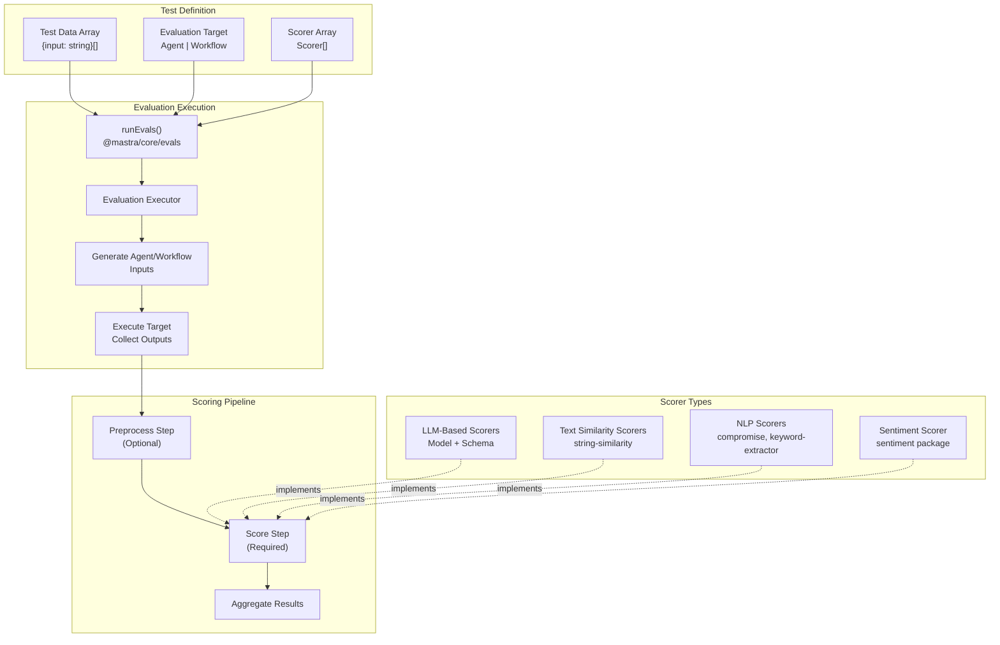
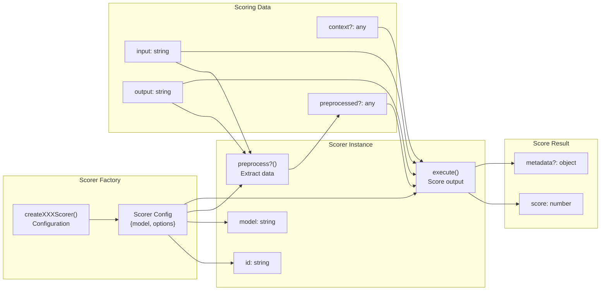
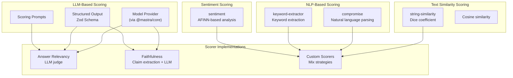
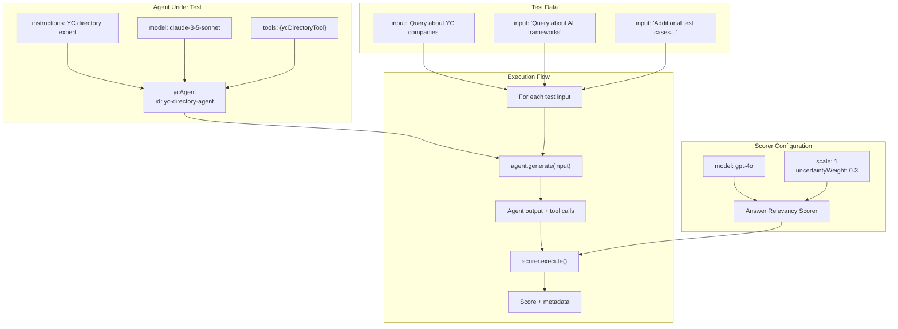
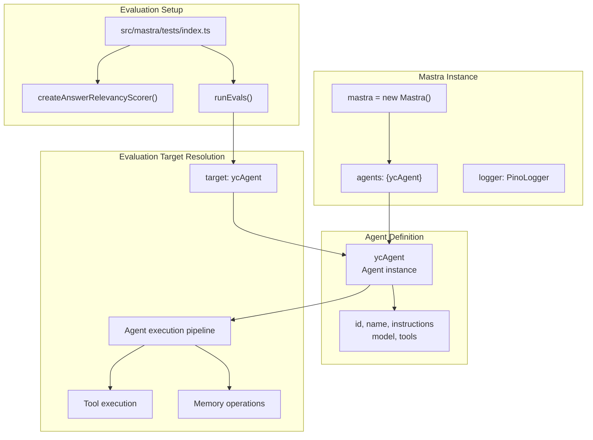
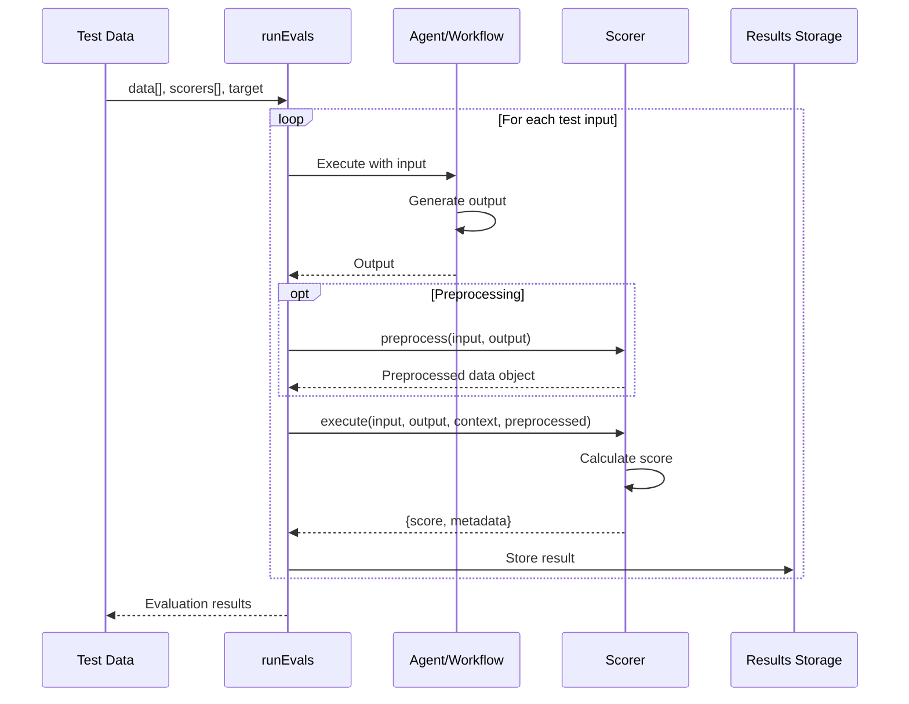

# Evaluation System and Scorers

<details>
<summary>Relevant source files</summary>

The following files were used as context for generating this wiki page:

- [packages/evals/CHANGELOG.md](packages/evals/CHANGELOG.md)
- [packages/evals/package.json](packages/evals/package.json)
- [packages/rag/CHANGELOG.md](packages/rag/CHANGELOG.md)
- [packages/rag/package.json](packages/rag/package.json)

</details>

## Purpose and Scope

The evaluation system provides a framework for measuring and validating the quality of agent and workflow outputs in Mastra. This document covers scorer creation, the evaluation execution pipeline, and integration patterns for quality assessment. For information about agent configuration and execution, see [Agent Configuration and Execution](#3.1). For workflow evaluation patterns, see [Workflow Definition and Step Composition](#4.1).

Sources: [packages/evals/package.json:1-94](), [examples/yc-directory/src/mastra/tests/index.ts:1-18]()

---

## Package Structure and Exports

The `@mastra/evals` package provides evaluation capabilities through three main export paths:

| Export Path                      | Purpose          | Key Exports                                                                  |
| -------------------------------- | ---------------- | ---------------------------------------------------------------------------- |
| `@mastra/evals`                  | Main entry point | Core evaluation types and interfaces                                         |
| `@mastra/evals/scorers/prebuilt` | Prebuilt scorers | `createAnswerRelevancyScorer`, `createFaithfulnessScorer`, LLM-based scorers |
| `@mastra/evals/scorers/utils`    | Scorer utilities | Helper functions for scorer implementation                                   |

The evaluation orchestration function `runEvals` is exported from `@mastra/core/evals`, not from the evals package itself, establishing a clear separation between scorer definitions and evaluation execution.

Sources: [packages/evals/package.json:21-52](), [examples/yc-directory/src/mastra/tests/index.ts:2]()

---

## Evaluation System Architecture



**Evaluation Workflow**

The evaluation system follows a three-phase pipeline:

1. **Execution Phase**: The `runEvals` function receives test data, scorers, and a target (agent or workflow), then executes the target for each test input to generate outputs
2. **Preprocessing Phase**: Scorers with a `preprocess` step extract structured data from outputs (e.g., extracting claims for faithfulness scoring)
3. **Scoring Phase**: Each scorer evaluates the output against its criteria and returns a numeric score

Sources: [examples/yc-directory/src/mastra/tests/index.ts:13-17](), [packages/evals/CHANGELOG.md:25-26](), [packages/evals/CHANGELOG.md:37-38]()

---

## Scorer Interface and Lifecycle



**Scorer Structure**

Scorers implement a two-step interface:

- **preprocess** (optional): Extracts structured data from raw outputs before scoring. Returns an object that matches a storage schema, avoiding array returns that cause validation errors
- **execute** (required): Computes a numeric score based on input, output, context, and preprocessed data

Sources: [packages/evals/CHANGELOG.md:25-26](), [examples/yc-directory/src/mastra/tests/index.ts:5-11]()

---

## Prebuilt Scorers

The `@mastra/evals/scorers/prebuilt` export provides LLM-based and heuristic scorers:

### Answer Relevancy Scorer

Evaluates whether an agent's output directly addresses the input question using an LLM judge.

```typescript
import { createAnswerRelevancyScorer } from '@mastra/evals/scorers/prebuilt'

const scorer = createAnswerRelevancyScorer({
  model: 'openai/gpt-4o',
  options: {
    scale: 1, // Score scale (0-1 by default)
    uncertaintyWeight: 0.3, // Penalty for uncertain answers
  },
})
```

Sources: [examples/yc-directory/src/mastra/tests/index.ts:5-11]()

### Faithfulness Scorer

Measures whether an agent's claims are supported by provided context/sources. Includes a preprocessing step that extracts claims from the output.

**Schema Compatibility Note**: The faithfulness scorer's preprocess step returns claims as an object (not a raw array) to satisfy storage schema validation. The preprocess function structure changed from returning `array` to returning `{claims: array}` to fix validation errors.

Sources: [packages/evals/CHANGELOG.md:25-26]()

### LLM-Based Scorers

All LLM-based scorers use structured output with Zod schemas. Due to provider-specific schema limitations (particularly with Anthropic), score validation uses `z.number().refine()` instead of `z.number().min(0).max(1)`, as the `min`/`max` constraints translate to JSON Schema `minimum`/`maximum` properties that some providers don't support.

Sources: [packages/evals/CHANGELOG.md:27-28]()

---

## Scorer Dependencies and Implementation Strategies



**Scorer Implementation Patterns**

The evals package provides four scoring strategies:

1. **LLM-Based**: Uses language models with structured output for complex quality judgments (answer relevancy, faithfulness)
2. **Text Similarity**: Uses the `string-similarity` package for comparing outputs to expected answers
3. **NLP Analysis**: Uses `compromise` for natural language parsing and `keyword-extractor` for topic extraction
4. **Sentiment Analysis**: Uses the `sentiment` package for AFINN-based sentiment scoring

Sources: [packages/evals/package.json:65-69]()

---

## Evaluation Execution with runEvals

The `runEvals` function from `@mastra/core/evals` orchestrates the evaluation process:

```typescript
import { runEvals } from '@mastra/core/evals'
import { ycAgent } from '../agents'
import { createAnswerRelevancyScorer } from '@mastra/evals/scorers/prebuilt'

const scorer = createAnswerRelevancyScorer({
  model: 'openai/gpt-4o',
  options: {
    scale: 1,
    uncertaintyWeight: 0.3,
  },
})

runEvals({
  data: [
    {
      input:
        'Can you tell me what recent YC companies are working on AI Frameworks?',
    },
  ],
  scorers: [scorer],
  target: ycAgent,
})
```

**Data Format**

Test data is an array of objects with an `input` field:

- `input`: The prompt or query to send to the target
- Additional fields can be included for context or reference data

**Target Types**

The `target` parameter accepts:

- `Agent`: Evaluates agent responses using the agent's `generate` method
- `Workflow`: Evaluates workflow outputs (execution details depend on workflow implementation)

Sources: [examples/yc-directory/src/mastra/tests/index.ts:1-18]()

---

## Agent Evaluation Pattern



**YC Directory Agent Evaluation Example**

The YC directory example demonstrates evaluation of an agent that answers questions about Y Combinator companies:

1. **Agent Definition**: The `ycAgent` has specific instructions to only provide information from the 2024 YC directory and include batch numbers
2. **Tool Integration**: The agent uses `ycDirectoryTool` to access company data
3. **Scorer Selection**: Answer relevancy scoring validates whether responses directly address user queries
4. **Test Cases**: Evaluation data includes questions about recent YC companies working on specific technologies

Sources: [examples/yc-directory/src/mastra/agents/index.ts:8-21](), [examples/yc-directory/src/mastra/tools/index.ts:6-22](), [examples/yc-directory/src/mastra/tests/index.ts:13-17]()

---

## Custom Scorer Implementation

Custom scorers can be created using scorer utilities from `@mastra/evals/scorers/utils`:

```typescript
import { /* scorer utilities */ } from '@mastra/evals/scorers/utils';

// Custom scorer structure
const customScorer = {
  id: 'my-custom-scorer',

  // Optional: Extract data for scoring
  preprocess: async ({ input, output }) => {
    // Return object (not array) for schema validation
    return {
      extractedData: /* process output */
    };
  },

  // Required: Compute score
  execute: async ({ input, output, context, preprocessed }) => {
    // Scoring logic
    const score = /* calculate score between 0 and 1 */;

    return {
      score,
      metadata: {
        /* additional scoring details */
      }
    };
  }
};
```

**Implementation Guidelines**

- Return preprocessed data as objects, not arrays, to satisfy storage schema validation
- Use `z.number().refine()` for score validation instead of `.min()/.max()` for broader provider compatibility
- Leverage the NPM packages included in evals dependencies: `string-similarity`, `compromise`, `keyword-extractor`, `sentiment`

Sources: [packages/evals/package.json:42-50](), [packages/evals/CHANGELOG.md:25-28]()

---

## Integration with Mastra Core



**Mastra Configuration for Evaluations**

The Mastra instance configures agents that can be evaluated:

1. **Agent Registration**: Agents are registered in the Mastra instance via the `agents` configuration
2. **Logger Integration**: The `PinoLogger` provides observability during evaluation runs
3. **Direct Agent Reference**: The `runEvals` target parameter directly references the agent instance, not through the Mastra registry

Sources: [examples/yc-directory/src/mastra/index.ts:6-12](), [examples/yc-directory/src/mastra/tests/index.ts:14]()

---

## Evaluation Workflow Pipeline



**Execution Sequence**

1. Test data provides input cases
2. Runner executes target for each input
3. Optional preprocessing extracts structured data
4. Scorer computes score using all available data
5. Results are aggregated and stored

Sources: [examples/yc-directory/src/mastra/tests/index.ts:13-17]()

---

## Best Practices and Considerations

### Schema Compatibility

When implementing LLM-based scorers with structured output:

- Use `z.number().refine(val => val >= 0 && val <= 1)` instead of `z.number().min(0).max(1)` for score validation
- This avoids JSON Schema `minimum`/`maximum` properties that some providers (e.g., Anthropic) don't support

Sources: [packages/evals/CHANGELOG.md:27-28]()

### Preprocess Return Types

Always return objects from preprocess steps, not raw arrays:

```typescript
// ❌ Incorrect - causes validation errors
preprocess: async ({ output }) => {
  return extractedClaims // array
}

// ✅ Correct - matches storage schema
preprocess: async ({ output }) => {
  return { claims: extractedClaims } // object
}
```

Sources: [packages/evals/CHANGELOG.md:25-26]()

### Scorer Dependencies

The evals package includes several NPM packages for scorer implementation:

- `string-similarity`: Text similarity scoring using Dice coefficient
- `compromise`: Natural language parsing and entity extraction
- `keyword-extractor`: Automatic keyword extraction from text
- `sentiment`: AFINN-based sentiment analysis

These can be imported in custom scorer implementations without additional installation.

Sources: [packages/evals/package.json:65-69]()

---

## Example: Complete Evaluation Setup

```typescript
// src/mastra/tests/index.ts
import { createAnswerRelevancyScorer } from '@mastra/evals/scorers/prebuilt'
import { runEvals } from '@mastra/core/evals'
import { ycAgent } from '../agents'

// Configure scorer
const scorer = createAnswerRelevancyScorer({
  model: 'openai/gpt-4o',
  options: {
    scale: 1,
    uncertaintyWeight: 0.3,
  },
})

// Run evaluation
runEvals({
  data: [
    {
      input:
        'Can you tell me what recent YC companies are working on AI Frameworks?',
    },
  ],
  scorers: [scorer],
  target: ycAgent,
})
```

This example evaluates the YC directory agent's ability to answer questions about Y Combinator companies, measuring answer relevancy using GPT-4 as a judge with uncertainty weighting.

Sources: [examples/yc-directory/src/mastra/tests/index.ts:1-18]()
