# Observability and Evaluation

<details>
<summary>Relevant source files</summary>

The following files were used as context for generating this wiki page:

- [.changeset/pre.json](.changeset/pre.json)
- [client-sdks/client-js/CHANGELOG.md](client-sdks/client-js/CHANGELOG.md)
- [client-sdks/client-js/package.json](client-sdks/client-js/package.json)
- [client-sdks/react/package.json](client-sdks/react/package.json)
- [deployers/cloudflare/CHANGELOG.md](deployers/cloudflare/CHANGELOG.md)
- [deployers/cloudflare/package.json](deployers/cloudflare/package.json)
- [deployers/netlify/CHANGELOG.md](deployers/netlify/CHANGELOG.md)
- [deployers/netlify/package.json](deployers/netlify/package.json)
- [deployers/vercel/CHANGELOG.md](deployers/vercel/CHANGELOG.md)
- [deployers/vercel/package.json](deployers/vercel/package.json)
- [examples/dane/CHANGELOG.md](examples/dane/CHANGELOG.md)
- [examples/dane/package.json](examples/dane/package.json)
- [package.json](package.json)
- [packages/cli/CHANGELOG.md](packages/cli/CHANGELOG.md)
- [packages/cli/package.json](packages/cli/package.json)
- [packages/core/CHANGELOG.md](packages/core/CHANGELOG.md)
- [packages/core/package.json](packages/core/package.json)
- [packages/create-mastra/CHANGELOG.md](packages/create-mastra/CHANGELOG.md)
- [packages/create-mastra/package.json](packages/create-mastra/package.json)
- [packages/deployer/CHANGELOG.md](packages/deployer/CHANGELOG.md)
- [packages/deployer/package.json](packages/deployer/package.json)
- [packages/evals/CHANGELOG.md](packages/evals/CHANGELOG.md)
- [packages/evals/package.json](packages/evals/package.json)
- [packages/mcp-docs-server/CHANGELOG.md](packages/mcp-docs-server/CHANGELOG.md)
- [packages/mcp-docs-server/package.json](packages/mcp-docs-server/package.json)
- [packages/mcp/CHANGELOG.md](packages/mcp/CHANGELOG.md)
- [packages/mcp/package.json](packages/mcp/package.json)
- [packages/playground-ui/CHANGELOG.md](packages/playground-ui/CHANGELOG.md)
- [packages/playground-ui/package.json](packages/playground-ui/package.json)
- [packages/playground/CHANGELOG.md](packages/playground/CHANGELOG.md)
- [packages/playground/package.json](packages/playground/package.json)
- [packages/rag/CHANGELOG.md](packages/rag/CHANGELOG.md)
- [packages/rag/package.json](packages/rag/package.json)
- [packages/server/CHANGELOG.md](packages/server/CHANGELOG.md)
- [packages/server/package.json](packages/server/package.json)
- [pnpm-lock.yaml](pnpm-lock.yaml)

</details>

This document describes Mastra's observability and evaluation systems. Observability provides trace-based monitoring of agent and workflow executions via OpenTelemetry integration, with support for multiple vendor backends and a query API. Evaluation provides tools for scoring execution quality using NLP-based and LLM-based metrics.

For information about configuring telemetry during development, see [CLI and Development Tools](#8). For information about the server API that exposes observability endpoints, see [Server and API Layer](#9). For information about client SDKs that consume observability data, see [Client SDK and UI Components](#10).

## Observability System Architecture

Mastra's observability system is built on OpenTelemetry and provides automatic tracing of agent and workflow executions. The system supports multiple observability vendor integrations and exposes a comprehensive query API for accessing telemetry data.

### OpenTelemetry Integration

The core observability infrastructure uses OpenTelemetry to generate traces and spans for all major operations. Trace and span identifiers are propagated through the execution stack and returned in user-facing results.

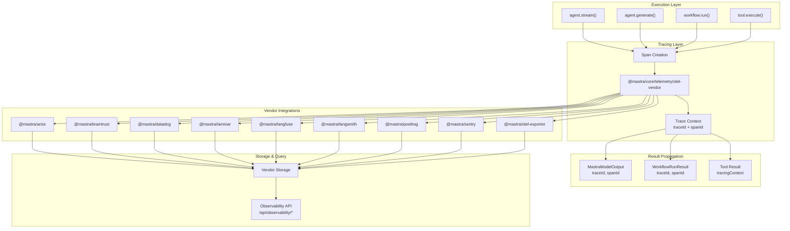

**Trace ID and Span ID Propagation**

Execution results include both `traceId` and `spanId` to enable precise querying of observability vendor APIs. The root span ID allows integrations to query vendors by run-level span rather than just trace-level data.

Sources: [packages/core/CHANGELOG.md:22-23](), [packages/core/package.json:114-123]()

### Observability Vendor Integrations

Mastra provides official integrations with multiple observability platforms. Each integration is a separate package that implements the OpenTelemetry exporter interface.

| Package                 | Purpose                              | Vendor     |
| ----------------------- | ------------------------------------ | ---------- |
| `@mastra/arize`         | Arize AI observability platform      | Arize      |
| `@mastra/braintrust`    | Braintrust evaluation and monitoring | Braintrust |
| `@mastra/datadog`       | Datadog APM integration              | Datadog    |
| `@mastra/laminar`       | Laminar LLM observability            | Laminar    |
| `@mastra/langfuse`      | Langfuse LLM engineering platform    | Langfuse   |
| `@mastra/langsmith`     | LangSmith tracing and evaluation     | LangSmith  |
| `@mastra/posthog`       | PostHog product analytics            | PostHog    |
| `@mastra/sentry`        | Sentry error tracking                | Sentry     |
| `@mastra/otel-exporter` | Custom OpenTelemetry exporter        | Custom     |
| `@mastra/otel-bridge`   | OpenTelemetry bridge utilities       | Bridge     |
| `@mastra/observability` | Core observability abstractions      | Core       |

Each vendor integration exports configuration and initialization functions that integrate with the OpenTelemetry stack. The `@mastra/observability` package provides shared abstractions used across all vendor integrations.

Sources: [.changeset/pre.json:29-38](), [pnpm-lock.yaml:1-50]()

### Telemetry Configuration

Telemetry can be configured at the CLI level during development. The CLI includes telemetry loading infrastructure that can be controlled via environment variables.

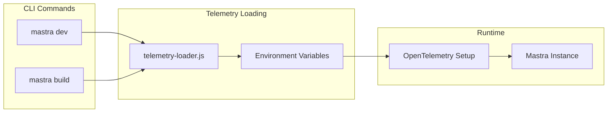

The CLI exports a `telemetry-loader` module that can be imported by build and dev commands to initialize tracing before the Mastra instance is created.

Sources: [packages/cli/package.json:15](), [packages/cli/CHANGELOG.md:1-20]()

## Observability API

The server exposes a comprehensive observability API that provides access to logs, scores, feedback, metrics, and discovery endpoints. These endpoints enable programmatic access to all telemetry data stored by observability vendors.

### API Endpoint Structure

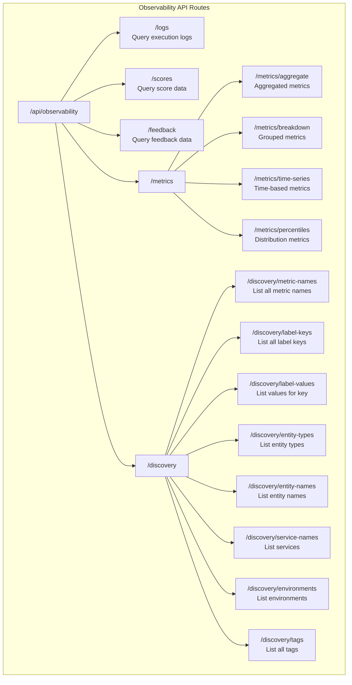

All observability endpoints are mounted under the `/api/observability` path by default (or the configured `apiPrefix`).

Sources: [packages/server/CHANGELOG.md:6-8](), [client-sdks/client-js/CHANGELOG.md:7]()

### Logs API

The logs API provides access to execution logs generated by agents, workflows, and tools. Logs include structured data about execution steps, errors, and state transitions.

**Log Query Parameters:**

- `traceId` - Filter by trace identifier
- `spanId` - Filter by span identifier
- `entityType` - Filter by entity type (agent, workflow, tool)
- `entityName` - Filter by entity name
- `serviceName` - Filter by service name
- `environment` - Filter by environment
- `startTime` - Filter by time range start
- `endTime` - Filter by time range end
- `tags` - Filter by tags

**Response Format:**

```typescript
{
  logs: Array<{
    timestamp: string
    traceId: string
    spanId: string
    message: string
    level: string
    entityType: string
    entityName: string
    metadata: Record<string, unknown>
  }>
  pagination: {
    total: number
    page: number
    pageSize: number
  }
}
```

Sources: [packages/server/CHANGELOG.md:6-8](), [client-sdks/client-js/CHANGELOG.md:7]()

### Scores and Feedback API

The scores and feedback APIs provide access to evaluation data generated by the evaluation system or submitted by users.

**Scores Endpoint:** `/api/observability/scores`

Scores represent quantitative evaluations of execution quality. They can be generated automatically by scorers or submitted manually.

**Score Schema:**

```typescript
{
  traceId: string;
  spanId?: string;
  name: string;
  value: number;
  metadata?: Record<string, unknown>;
  // timestamp omitted - server-generated
}
```

**Feedback Endpoint:** `/api/observability/feedback`

Feedback represents qualitative user input about execution quality.

**Feedback Schema:**

```typescript
{
  traceId: string;
  spanId?: string;
  rating?: number;
  comment?: string;
  metadata?: Record<string, unknown>;
  // timestamp omitted - server-generated
}
```

Both endpoints support POST for submission and GET for querying with filtering by trace/span IDs, time ranges, and metadata fields.

Sources: [packages/core/CHANGELOG.md:34-36](), [packages/server/CHANGELOG.md:6-8]()

### Metrics API

The metrics API provides aggregated views of telemetry data with support for multiple aggregation strategies.

**Aggregate Metrics:** `/api/observability/metrics/aggregate`

Returns aggregated metrics (sum, avg, min, max, count) across a set of traces/spans.

**Breakdown Metrics:** `/api/observability/metrics/breakdown`

Returns metrics grouped by label keys (e.g., by entity name, by model, by environment).

**Time Series Metrics:** `/api/observability/metrics/time-series`

Returns metrics bucketed by time intervals for trend analysis.

**Percentile Metrics:** `/api/observability/metrics/percentiles`

Returns distribution metrics (p50, p90, p95, p99) for latency and other continuous values.

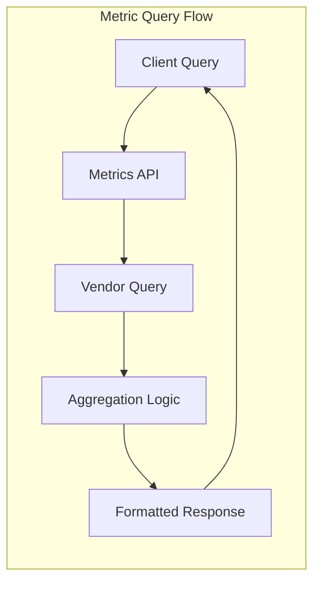

Sources: [packages/server/CHANGELOG.md:6-8](), [client-sdks/client-js/CHANGELOG.md:7]()

### Discovery API

The discovery API provides metadata about available metrics, labels, entities, and services. This enables dynamic UI construction and query building.

| Endpoint                   | Purpose                     | Returns                            |
| -------------------------- | --------------------------- | ---------------------------------- |
| `/discovery/metric-names`  | List all metric names       | Array of metric name strings       |
| `/discovery/label-keys`    | List all label keys         | Array of label key strings         |
| `/discovery/label-values`  | List values for a label key | Array of value strings for the key |
| `/discovery/entity-types`  | List all entity types       | Array of entity type strings       |
| `/discovery/entity-names`  | List entity names by type   | Array of entity name strings       |
| `/discovery/service-names` | List all service names      | Array of service name strings      |
| `/discovery/environments`  | List all environments       | Array of environment strings       |
| `/discovery/tags`          | List all tags               | Array of tag strings               |

Discovery endpoints are primarily used by the Studio UI to populate dropdowns and filters dynamically based on available data.

Sources: [packages/server/CHANGELOG.md:6-8](), [client-sdks/client-js/CHANGELOG.md:7]()

## Client SDK Integration

The JavaScript client SDK provides typed methods for accessing all observability endpoints. The `MastraClient` includes an `observability` resource with methods corresponding to each API endpoint.

```mermaid
graph TB
    subgraph "Client SDK"
        MastraClient["MastraClient"]
        ObservabilityResource["ObservabilityResource"]

        GetLogs["getLogs()"]
        GetScores["getScores()"]
        PostScore["postScore()"]
        GetFeedback["getFeedback()"]
        PostFeedback["postFeedback()"]

        GetMetricsAggregate["getMetricsAggregate()"]
        GetMetricsBreakdown["getMetricsBreakdown()"]
        GetMetricsTimeSeries["getMetricsTimeSeries()"]
        GetMetricsPercentiles["getMetricsPercentiles()"]

        GetMetricNames["getMetricNames()"]
        GetLabelKeys["getLabelKeys()"]
        GetLabelValues["getLabelValues()"]
        GetEntityTypes["getEntityTypes()"]
        GetEntityNames["getEntityNames()"]
        GetServiceNames["getServiceNames()"]
        GetEnvironments["getEnvironments()"]
        GetTags["getTags()"]
    end

    subgraph "HTTP Layer"
        BaseResource["BaseResource<br/>HTTP + retry + auth"]
        HTTPClient["HTTP Client"]
    end

    MastraClient --> ObservabilityResource

    ObservabilityResource --> GetLogs
    ObservabilityResource --> GetScores
    ObservabilityResource --> PostScore
    ObservabilityResource --> GetFeedback
    ObservabilityResource --> PostFeedback

    ObservabilityResource --> GetMetricsAggregate
    ObservabilityResource --> GetMetricsBreakdown
    ObservabilityResource --> GetMetricsTimeSeries
    ObservabilityResource --> GetMetricsPercentiles

    ObservabilityResource --> GetMetricNames
    ObservabilityResource --> GetLabelKeys
    ObservabilityResource --> GetLabelValues
    ObservabilityResource --> GetEntityTypes
    ObservabilityResource --> GetEntityNames
    ObservabilityResource --> GetServiceNames
    ObservabilityResource --> GetEnvironments
    ObservabilityResource --> GetTags

    ObservabilityResource --> BaseResource
    BaseResource --> HTTPClient
```

All observability methods inherit retry logic, authentication, and error handling from `BaseResource`.

Sources: [client-sdks/client-js/CHANGELOG.md:7](), [client-sdks/client-js/package.json:1-73]()

## Evaluation System

The evaluation system (`@mastra/evals`) provides tools for scoring the quality of agent and workflow executions. It includes prebuilt scorers for common metrics and utilities for building custom scorers.

### Architecture

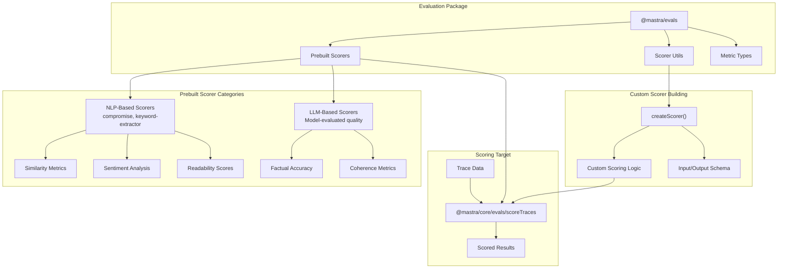

The evaluation system is designed to work with trace data generated by the observability system. Scorers can process trace/span data and generate quantitative or qualitative assessments.

Sources: [packages/evals/package.json:1-95](), [packages/core/package.json:144-153]()

### Prebuilt Scorers

The `@mastra/evals` package includes prebuilt scorers for common evaluation scenarios. These scorers are categorized into NLP-based (using libraries like `compromise` and `keyword-extractor`) and LLM-based (using language models to evaluate quality).

**NLP-Based Scorers:**

- **Similarity Metrics:** Measure semantic similarity between expected and actual outputs
- **Sentiment Analysis:** Analyze emotional tone of generated text
- **Readability Scores:** Calculate readability metrics (Flesch-Kincaid, etc.)
- **Keyword Extraction:** Identify and score presence of key terms

**LLM-Based Scorers:**

- **Factual Accuracy:** Use an LLM to verify factual correctness
- **Coherence:** Evaluate logical flow and consistency
- **Relevance:** Assess how well output matches input intent
- **Safety:** Check for harmful or inappropriate content

NLP-based scorers are deterministic and fast, while LLM-based scorers provide more nuanced evaluation at the cost of additional API calls and latency.

Sources: [packages/evals/package.json:1-95]()

### Custom Scorers

Custom scorers can be built using scorer utilities provided by `@mastra/evals`. The scorer builder pattern allows defining custom scoring logic with typed inputs and outputs.

```typescript
// Conceptual example - not actual code from repo
const customScorer = createScorer({
  name: 'custom-metric',
  description: 'Custom scoring logic',
  inputSchema: z.object({
    input: z.string(),
    output: z.string(),
    expected: z.string().optional(),
  }),
  outputSchema: z.object({
    score: z.number().min(0).max(1),
    reasoning: z.string().optional(),
  }),
  execute: async (input) => {
    // Custom scoring logic here
    return {
      score: 0.85,
      reasoning: 'Output matches expected criteria',
    }
  },
})
```

Custom scorers integrate seamlessly with the `scoreTraces` API and can be used alongside prebuilt scorers.

Sources: [packages/evals/package.json:1-95](), [packages/core/package.json:144-153]()

### Scoring Traces

The `@mastra/core/evals/scoreTraces` module provides the core API for applying scorers to trace data. This function retrieves trace data from the observability system, applies one or more scorers, and stores the results.

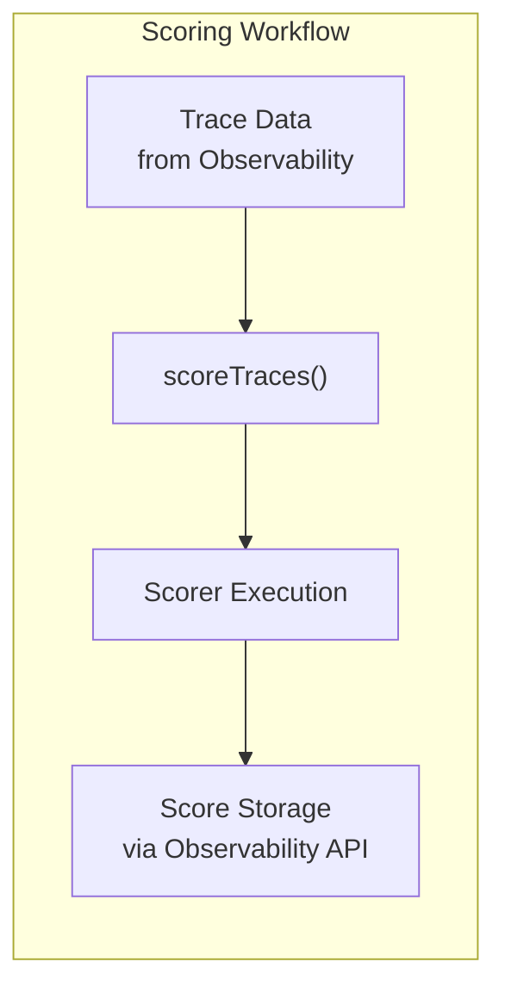

The scoring workflow:

1. Fetch trace/span data by trace ID
2. Extract relevant execution data (inputs, outputs, intermediate steps)
3. Apply each scorer to the extracted data
4. Store scores via the observability API
5. Optionally trigger alerts or downstream workflows based on scores

Sources: [packages/core/package.json:144-153]()

### Metric Types

The evaluation system defines several metric types for different scoring scenarios:

| Metric Type | Range       | Use Case                           |
| ----------- | ----------- | ---------------------------------- |
| Binary      | 0 or 1      | Pass/fail evaluations              |
| Normalized  | 0.0 to 1.0  | Percentage-based scores            |
| Unbounded   | Any number  | Raw metrics (latency, token count) |
| Categorical | Enum values | Classification results             |

Metric types determine how scores are aggregated, visualized, and compared across executions.

Sources: [packages/evals/package.json:1-95]()

## Integration Patterns

### Agent and Workflow Tracing

Agents and workflows automatically generate trace/span data during execution. The trace context is propagated through the entire execution stack, including tool calls and nested agent invocations.

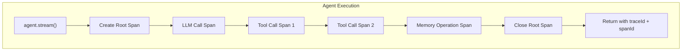

Each span includes:

- Span ID and trace ID
- Parent span ID (for nested calls)
- Start and end timestamps
- Span attributes (input/output data, metadata)
- Span status (success, error)

Sources: [packages/core/CHANGELOG.md:22-23]()

### Evaluation in Development

During development, evaluation can be integrated into the development loop to provide immediate feedback on execution quality.

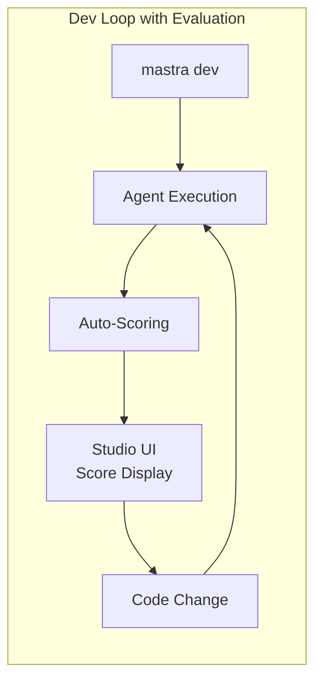

The Studio UI can display scores in real-time as executions complete, enabling rapid iteration on agent behavior.

Sources: [packages/cli/CHANGELOG.md:1-20](), [packages/playground-ui/CHANGELOG.md:1-50]()

### Evaluation in Production

In production, evaluation can be run asynchronously after execution to avoid impacting latency. Scores can trigger alerts or be aggregated for monitoring dashboards.

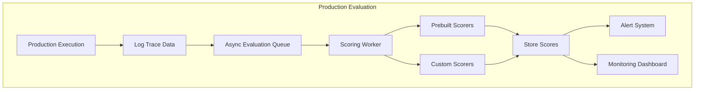

Asynchronous evaluation decouples scoring from the critical path, allowing expensive LLM-based scorers to run without impacting user-facing latency.

Sources: [packages/evals/package.json:1-95]()

### Studio UI Integration

The Studio UI (`@mastra/playground-ui`) integrates with the observability API to provide visual inspection of traces, logs, and scores. The UI uses the discovery API to dynamically populate filters and provide drill-down capabilities.

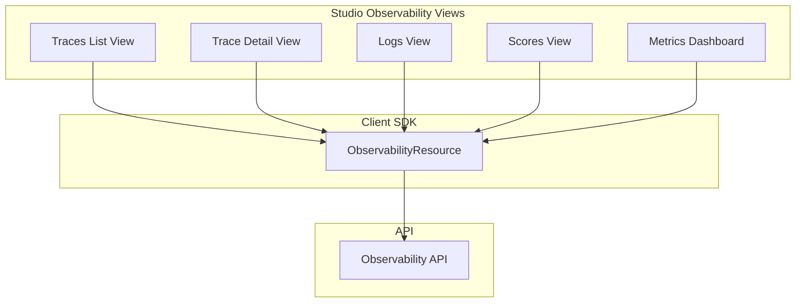

The Studio UI provides:

- Real-time trace visualization
- Log filtering and search
- Score display and filtering
- Metric charts and dashboards
- Discovery-based dynamic filtering

Sources: [packages/playground-ui/CHANGELOG.md:1-50](), [packages/playground-ui/package.json:1-192]()

## Configuration and Setup

### Enabling Observability

Observability is configured at the Mastra instance level. Vendor integrations are initialized and passed to the Mastra constructor.

```typescript
// Conceptual example - not actual code from repo
import { Mastra } from '@mastra/core'
import { LangfuseExporter } from '@mastra/langfuse'

const langfuse = new LangfuseExporter({
  publicKey: process.env.LANGFUSE_PUBLIC_KEY,
  secretKey: process.env.LANGFUSE_SECRET_KEY,
})

const mastra = new Mastra({
  // ... other config
  observability: {
    exporters: [langfuse],
  },
})
```

Multiple exporters can be configured simultaneously to send telemetry to multiple vendors.

Sources: [packages/core/package.json:1-334]()

### Configuring Evaluation

Evaluation is configured by registering scorers with the evaluation system. Scorers can be applied automatically to all executions or triggered selectively.

```typescript
// Conceptual example - not actual code from repo
import { scoreTraces } from '@mastra/core/evals/scoreTraces'
import { similarityScorer, coherenceScorer } from '@mastra/evals'

// Score a specific trace
const scores = await scoreTraces({
  traceId: 'trace-123',
  scorers: [similarityScorer, coherenceScorer],
})

// Scores are automatically stored via observability API
```

Sources: [packages/core/package.json:144-153](), [packages/evals/package.json:1-95]()

### Environment Variables

Observability and evaluation can be controlled via environment variables:

| Variable                       | Purpose                          | Default             |
| ------------------------------ | -------------------------------- | ------------------- |
| `OTEL_EXPORTER_OTLP_ENDPOINT`  | OpenTelemetry collector endpoint | None                |
| `OTEL_SERVICE_NAME`            | Service name in traces           | `mastra`            |
| `MASTRA_OBSERVABILITY_ENABLED` | Enable/disable observability     | `true`              |
| Vendor-specific keys           | API keys for vendor integrations | Required per vendor |

Sources: [packages/core/package.json:1-334]()

## Performance Considerations

### Trace Overhead

OpenTelemetry tracing adds minimal overhead to execution. Span creation and attribute setting are designed to be non-blocking and low-latency. However, exporting traces to vendors can add network latency.

**Best Practices:**

- Use batch exporting to reduce network calls
- Configure sampling for high-volume scenarios
- Monitor exporter queue depth to detect backpressure

### Evaluation Latency

LLM-based scorers can add significant latency (hundreds of milliseconds to seconds per score). For production use:

- Run evaluation asynchronously after execution completes
- Use NLP-based scorers for real-time feedback
- Cache scorer results for repeated evaluations of the same content

### Storage Costs

Observability data grows linearly with execution volume. Consider:

- Vendor pricing models (per-span vs per-GB)
- Retention policies (shorter for high-volume, low-value traces)
- Sampling strategies for high-throughput systems

Sources: [packages/evals/package.json:1-95]()

---

This document covers the observability and evaluation systems in Mastra. For information about how observability integrates with specific execution models, see [Agent System](#3) and [Workflow System](#4). For information about the client SDKs that consume observability data, see [Client SDK and UI Components](#10).
