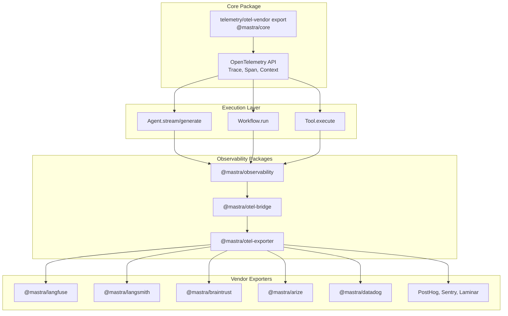
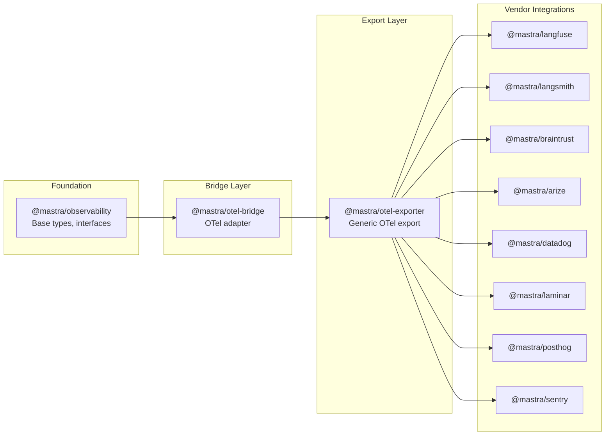
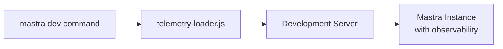
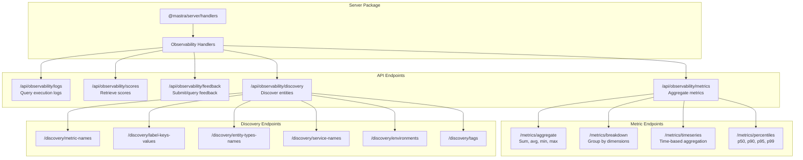
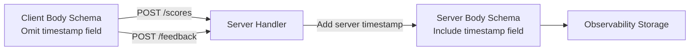
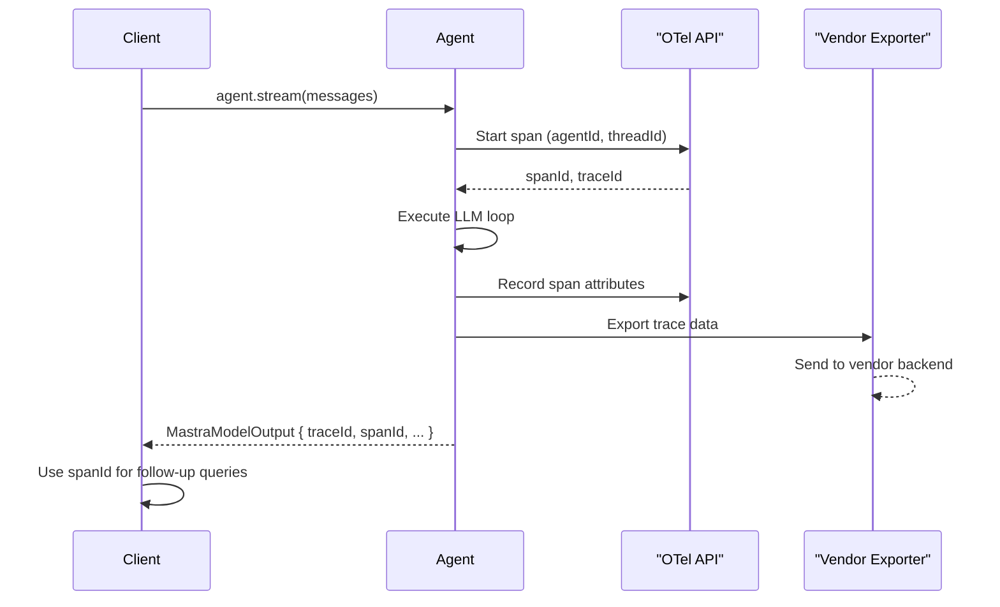
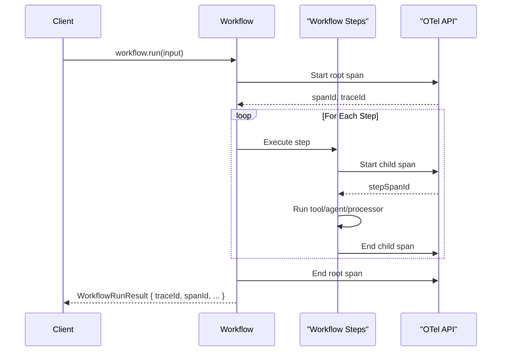

# Observability Integration and Exporters

Relevant source files

The following files were used as context for generating this wiki page:

- [.changeset/pre.json](.changeset/pre.json)
- [client-sdks/client-js/CHANGELOG.md](client-sdks/client-js/CHANGELOG.md)
- [client-sdks/client-js/package.json](client-sdks/client-js/package.json)
- [client-sdks/react/package.json](client-sdks/react/package.json)
- [deployers/cloudflare/CHANGELOG.md](deployers/cloudflare/CHANGELOG.md)
- [deployers/cloudflare/package.json](deployers/cloudflare/package.json)
- [deployers/netlify/CHANGELOG.md](deployers/netlify/CHANGELOG.md)
- [deployers/netlify/package.json](deployers/netlify/package.json)
- [deployers/vercel/CHANGELOG.md](deployers/vercel/CHANGELOG.md)
- [deployers/vercel/package.json](deployers/vercel/package.json)
- [examples/dane/CHANGELOG.md](examples/dane/CHANGELOG.md)
- [examples/dane/package.json](examples/dane/package.json)
- [package.json](package.json)
- [packages/cli/CHANGELOG.md](packages/cli/CHANGELOG.md)
- [packages/cli/package.json](packages/cli/package.json)
- [packages/core/CHANGELOG.md](packages/core/CHANGELOG.md)
- [packages/core/package.json](packages/core/package.json)
- [packages/create-mastra/CHANGELOG.md](packages/create-mastra/CHANGELOG.md)
- [packages/create-mastra/package.json](packages/create-mastra/package.json)
- [packages/deployer/CHANGELOG.md](packages/deployer/CHANGELOG.md)
- [packages/deployer/package.json](packages/deployer/package.json)
- [packages/mcp-docs-server/CHANGELOG.md](packages/mcp-docs-server/CHANGELOG.md)
- [packages/mcp-docs-server/package.json](packages/mcp-docs-server/package.json)
- [packages/mcp/CHANGELOG.md](packages/mcp/CHANGELOG.md)
- [packages/mcp/package.json](packages/mcp/package.json)
- [packages/playground-ui/CHANGELOG.md](packages/playground-ui/CHANGELOG.md)
- [packages/playground-ui/package.json](packages/playground-ui/package.json)
- [packages/playground/CHANGELOG.md](packages/playground/CHANGELOG.md)
- [packages/playground/package.json](packages/playground/package.json)
- [packages/server/CHANGELOG.md](packages/server/CHANGELOG.md)
- [packages/server/package.json](packages/server/package.json)
- [pnpm-lock.yaml](pnpm-lock.yaml)

This document covers the observability system in Mastra, including OpenTelemetry integration, vendor-specific exporters, trace/span ID propagation, and observability API endpoints. For general telemetry configuration (usage tracking, analytics opt-out), see [CLI Analytics and Telemetry](#8.8). For evaluation and scoring of agent/workflow outputs, see [Evaluation System and Scorers](#11.3).

## System Overview

Mastra provides built-in observability through OpenTelemetry tracing and vendor-specific exporters. The system captures execution traces for agents, workflows, and tools, propagating trace and span identifiers through the execution stack. Observability data can be exported to third-party platforms (Langfuse, Langsmith, Braintrust, Arize, Datadog, Laminar, PostHog, Sentry) or consumed via HTTP API endpoints for custom dashboards and analysis.

**Sources:** [pnpm-lock.yaml:28-39](), [packages/core/package.json:114-123](), [packages/core/CHANGELOG.md:21-23]()

## OpenTelemetry Foundation

### Core Integration

Mastra uses OpenTelemetry as the underlying tracing infrastructure. The core package exports a vendored OpenTelemetry API to avoid version conflicts with user applications.

**Sources:** [packages/core/package.json:114-123](), [pnpm-lock.yaml:28-39]()

### Trace and Span ID Propagation

Execution results include `traceId` and `spanId` fields to enable correlation with observability backends.

| Execution Context        | Return Object       | Trace ID Field | Span ID Field |
| ------------------------ | ------------------- | -------------- | ------------- |
| `agent.stream()`         | `MastraModelOutput` | `traceId`      | `spanId`      |
| `agent.generate()`       | `MastraModelOutput` | `traceId`      | `spanId`      |
| `workflow.run()`         | `WorkflowRunResult` | `traceId`      | `spanId`      |
| `workflow.streamVNext()` | Event objects       | `traceId`      | `spanId`      |

The `spanId` field was added to identify the root span of each run, enabling queries like "show me all events for this workflow execution" in observability platforms.

**Sources:** [packages/core/CHANGELOG.md:21-23]()

## Observability Package Ecosystem

### Package Roles

**Sources:** [pnpm-lock.yaml:28-39](), [.changeset/pre.json:29-39]()

### Vendor Exporter List

| Package                 | Purpose                     | Version Range |
| ----------------------- | --------------------------- | ------------- |
| `@mastra/langfuse`      | Langfuse LLM observability  | 1.0.7+        |
| `@mastra/langsmith`     | LangSmith tracing           | 1.1.5+        |
| `@mastra/braintrust`    | Braintrust AI observability | 1.0.8+        |
| `@mastra/arize`         | Arize Phoenix integration   | 1.0.8+        |
| `@mastra/datadog`       | Datadog APM integration     | 1.0.7+        |
| `@mastra/laminar`       | Laminar LLM analytics       | 1.0.7+        |
| `@mastra/posthog`       | PostHog product analytics   | 1.0.8+        |
| `@mastra/sentry`        | Sentry error tracking       | 1.0.7+        |
| `@mastra/otel-bridge`   | OpenTelemetry bridge        | 1.0.7+        |
| `@mastra/otel-exporter` | Generic OTel exporter       | 1.0.7+        |

**Sources:** [.changeset/pre.json:29-39]()

## Configuration and Setup

### Exporter Configuration Pattern

Each vendor exporter follows a similar configuration pattern:

1. Install the vendor package (e.g., `@mastra/langfuse`)
2. Import and configure in `mastra.config.ts`
3. Provide API keys via environment variables or constructor options
4. Register with the Mastra instance

Configuration typically happens at the Mastra instance level, with exporters automatically receiving trace data from all agents and workflows.

**Sources:** [packages/core/package.json:1-333]()

### CLI Development Telemetry Loader

The CLI includes a telemetry loader for development mode that can instrument the Mastra instance with observability hooks.

**Sources:** [packages/cli/package.json:15]()

## Observability API Endpoints

### Server-Side API

The Mastra server exposes HTTP endpoints for querying observability data. These endpoints enable custom dashboards and integrations without vendor lock-in.

**Sources:** [packages/server/CHANGELOG.md:7](), [client-sdks/client-js/CHANGELOG.md:7]()

### Client SDK Methods

The JavaScript client SDK provides typed methods for consuming observability APIs:

| Resource  | Method                                               | Purpose                    |
| --------- | ---------------------------------------------------- | -------------------------- |
| Logs      | `client.observability.getLogs(filter)`               | Query execution logs       |
| Scores    | `client.observability.getScores(filter)`             | Retrieve evaluation scores |
| Feedback  | `client.observability.submitFeedback(data)`          | Submit user feedback       |
| Feedback  | `client.observability.getFeedback(filter)`           | Query feedback entries     |
| Metrics   | `client.observability.getMetricsAggregate(params)`   | Aggregate metrics          |
| Metrics   | `client.observability.getMetricsBreakdown(params)`   | Group metrics by dimension |
| Metrics   | `client.observability.getMetricsTimeSeries(params)`  | Time-series metrics        |
| Metrics   | `client.observability.getMetricsPercentiles(params)` | Percentile metrics         |
| Discovery | `client.observability.getMetricNames()`              | List available metrics     |
| Discovery | `client.observability.getLabelKeysValues()`          | List labels and values     |
| Discovery | `client.observability.getEntityTypes()`              | List entity types          |
| Discovery | `client.observability.getServiceNames()`             | List services              |
| Discovery | `client.observability.getEnvironments()`             | List environments          |
| Discovery | `client.observability.getTags()`                     | List tags                  |

**Sources:** [client-sdks/client-js/CHANGELOG.md:7]()

## Scores and Feedback Schema

### Body Schema Design

The observability API uses separate schemas for client-side and server-side payloads:

- **Client Body Schema**: Excludes the `timestamp` field, allowing the server to set it server-side
- **Server Body Schema**: Includes all fields for internal processing

This pattern prevents clients from spoofing timestamps while still allowing server-side backfills.

**Sources:** [packages/server/CHANGELOG.md:7](), [packages/core/CHANGELOG.md:34]()

## Integration with Execution Flow

### Agent Execution Tracing

Agents automatically generate trace and span IDs during execution. These IDs are returned in the `MastraModelOutput` object and can be used to correlate logs, metrics, and vendor traces.

**Sources:** [packages/core/CHANGELOG.md:21-23]()

### Workflow Execution Tracing

Workflows follow a similar pattern, with each step potentially creating child spans:

**Sources:** [packages/core/CHANGELOG.md:21-23]()

### Cross-Cutting Instrumentation

Observability hooks are inserted at multiple levels:

| Layer             | Instrumentation Point | Data Captured                        |
| ----------------- | --------------------- | ------------------------------------ |
| LLM Execution     | Model call start/end  | Provider, model, tokens, latency     |
| Tool Execution    | Tool invoke start/end | Tool name, inputs, outputs, duration |
| Agent Loop        | Iteration start/end   | Iteration count, stop reason         |
| Memory Operations | Recall/save           | Message count, embeddings generated  |
| Workflow Steps    | Step start/end        | Step type, state transitions         |

**Sources:** High-level system architecture diagrams

## Test Utilities

The observability system includes test utilities for verifying instrumentation:

| Package                     | Purpose                                             |
| --------------------------- | --------------------------------------------------- |
| `@observability/test-utils` | Shared testing utilities for observability packages |

**Sources:** [pnpm-lock.yaml:28]()

---

This document provides a technical overview of Mastra's observability system. For configuring specific vendor exporters, consult the vendor package README files. For evaluation and scoring workflows, see [Evaluation System and Scorers](#11.3). For CLI telemetry and usage tracking, see [CLI Analytics and Telemetry](#8.8).
