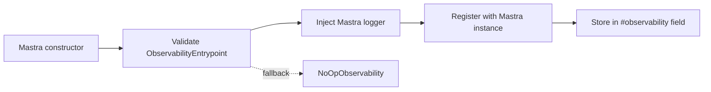
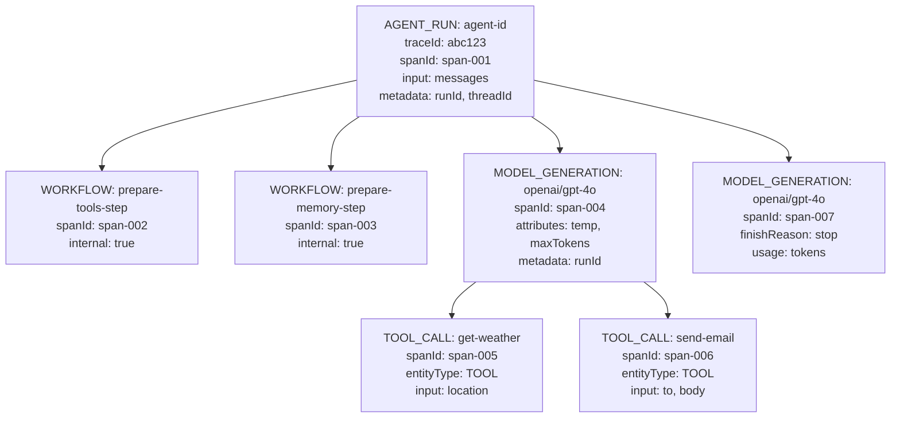
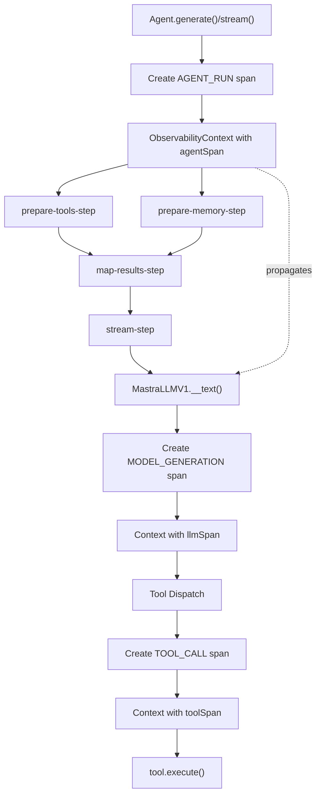
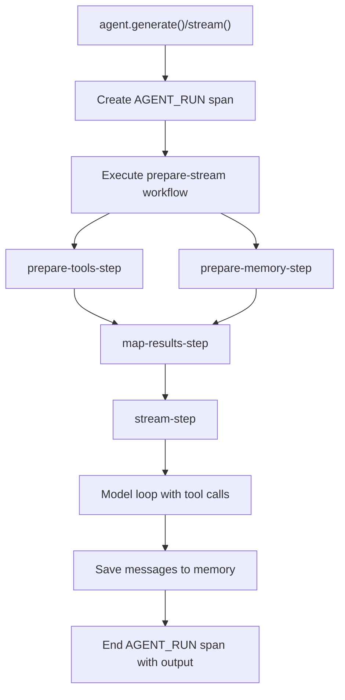
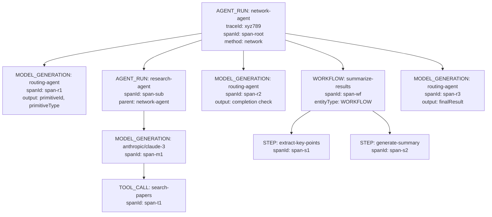
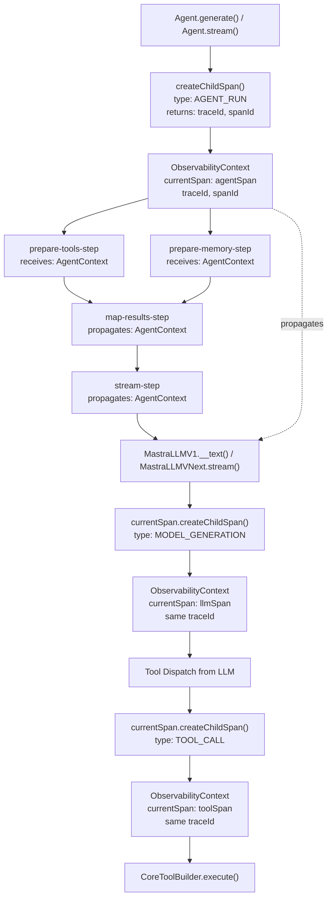

# Observability System and Tracing

<details>
<summary>Relevant source files</summary>

The following files were used as context for generating this wiki page:

- [.changeset/pre.json](.changeset/pre.json)
- [client-sdks/client-js/CHANGELOG.md](client-sdks/client-js/CHANGELOG.md)
- [client-sdks/client-js/package.json](client-sdks/client-js/package.json)
- [client-sdks/react/package.json](client-sdks/react/package.json)
- [deployers/cloudflare/CHANGELOG.md](deployers/cloudflare/CHANGELOG.md)
- [deployers/cloudflare/package.json](deployers/cloudflare/package.json)
- [deployers/netlify/CHANGELOG.md](deployers/netlify/CHANGELOG.md)
- [deployers/netlify/package.json](deployers/netlify/package.json)
- [deployers/vercel/CHANGELOG.md](deployers/vercel/CHANGELOG.md)
- [deployers/vercel/package.json](deployers/vercel/package.json)
- [examples/dane/CHANGELOG.md](examples/dane/CHANGELOG.md)
- [examples/dane/package.json](examples/dane/package.json)
- [package.json](package.json)
- [packages/cli/CHANGELOG.md](packages/cli/CHANGELOG.md)
- [packages/cli/package.json](packages/cli/package.json)
- [packages/core/CHANGELOG.md](packages/core/CHANGELOG.md)
- [packages/core/package.json](packages/core/package.json)
- [packages/create-mastra/CHANGELOG.md](packages/create-mastra/CHANGELOG.md)
- [packages/create-mastra/package.json](packages/create-mastra/package.json)
- [packages/deployer/CHANGELOG.md](packages/deployer/CHANGELOG.md)
- [packages/deployer/package.json](packages/deployer/package.json)
- [packages/mcp-docs-server/CHANGELOG.md](packages/mcp-docs-server/CHANGELOG.md)
- [packages/mcp-docs-server/package.json](packages/mcp-docs-server/package.json)
- [packages/mcp/CHANGELOG.md](packages/mcp/CHANGELOG.md)
- [packages/mcp/package.json](packages/mcp/package.json)
- [packages/playground-ui/CHANGELOG.md](packages/playground-ui/CHANGELOG.md)
- [packages/playground-ui/package.json](packages/playground-ui/package.json)
- [packages/playground/CHANGELOG.md](packages/playground/CHANGELOG.md)
- [packages/playground/package.json](packages/playground/package.json)
- [packages/server/CHANGELOG.md](packages/server/CHANGELOG.md)
- [packages/server/package.json](packages/server/package.json)
- [pnpm-lock.yaml](pnpm-lock.yaml)

</details>

The observability system provides distributed tracing and telemetry collection across agent executions, LLM calls, tool invocations, and workflow runs. Built on OpenTelemetry standards, it tracks execution hierarchies through span trees, captures usage metrics (tokens, latency, costs), and enables performance analysis and debugging.

The system consists of:

- **Trace and Span Collection**: Distributed tracing with parent-child span relationships
- **Observability API**: REST endpoints for querying traces, logs, scores, and metrics
- **Exporter Integration**: Pluggable backends for Langfuse, Langsmith, Braintrust, Arize, and others

For evaluation and scoring systems, see page 11.3. For observability integration with external vendor systems, see page 11.2.
</old_str>

<old_str>

### ObservabilityContext

`ObservabilityContext` is the container for tracing state that flows through the execution stack:

```typescript
interface ObservabilityContext {
  tracingContext: {
    currentSpan?: Span
    traceId?: string
    spanId?: string
  }
}
```

The context includes:

- `currentSpan`: Active span serving as parent for child operations
- `traceId`: Unique identifier for the entire trace (root to leaf)
- `spanId`: Unique identifier for the current span within the trace

This structure enables span hierarchy construction without manual parent tracking. The `traceId` and `spanId` are returned in agent and workflow execution results for correlation with observability backends.

[packages/core/src/agent/types.ts:28]()
</old_str>
<new_str>

## Configuration and Setup

Observability is configured through the `ObservabilityEntrypoint` interface in the Mastra constructor. The system defaults to `NoOpObservability` when not explicitly configured.

### Mastra Configuration

The `observability` property accepts an `ObservabilityEntrypoint` instance from the `@mastra/observability` package:

```typescript
import { Mastra } from '@mastra/core'
import { Observability, DefaultExporter } from '@mastra/observability'

const mastra = new Mastra({
  observability: new Observability({
    configs: {
      default: {
        serviceName: 'mastra-app',
        exporters: [new DefaultExporter()],
      },
    },
  }),
})
```

The observability instance is validated during initialization [packages/core/src/mastra/index.ts:578-594]() and stored as a private field. If validation fails or no observability is provided, the system falls back to `NoOpObservability`.

### Initialization Sequence



**Initialization Steps:**

1. **Validation**: Checks for `getDefaultInstance` method to ensure correct type
2. **Logger Setup**: Injects the Mastra logger into the observability system via `observability.setLogger()`
3. **Context Registration**: Links the observability system to the Mastra instance
4. **Storage**: Observability instance stored in private `#observability` field

[packages/core/src/mastra/index.ts:709-712]()

Sources: packages/core/src/mastra/index.ts:100-257, packages/core/src/mastra/index.ts:514-713

## Configuration and Setup

Observability is configured through the `ObservabilityEntrypoint` interface in the Mastra constructor. The system defaults to `NoOpObservability` when not explicitly configured.

### Mastra Configuration

The `observability` property accepts an `ObservabilityEntrypoint` instance from the `@mastra/observability` package:

```typescript
import { Mastra } from '@mastra/core'
import { Observability, DefaultExporter } from '@mastra/observability'

const mastra = new Mastra({
  observability: new Observability({
    configs: {
      default: {
        serviceName: 'mastra',
        exporters: [new DefaultExporter()],
      },
    },
  }),
})
```

The observability instance is validated during initialization [packages/core/src/mastra/index.ts:578-594]() and stored as a private field. If validation fails or no observability is provided, the system falls back to `NoOpObservability`.

### Initialization Sequence

1. **Validation**: Checks for `getDefaultInstance` method to ensure correct type
2. **Logger Setup**: Injects the Mastra logger into the observability system
3. **Context Registration**: Links the observability system to the Mastra instance

[packages/core/src/mastra/index.ts:709-712]()

Sources: packages/core/src/mastra/index.ts:100-257, packages/core/src/mastra/index.ts:514-713

## Core Concepts

## Span Hierarchy Patterns

### Typical Agent Execution Tree

**Agent Execution with Tool Calls**



All spans share the same `traceId` (abc123) but have unique `spanId` values. The root span's `spanId` is returned to clients in the agent execution result.

### Span Types

Spans are categorized by `SpanType` enum values that identify the operation being traced:

| SpanType           | Purpose                       | Created By                                        |
| ------------------ | ----------------------------- | ------------------------------------------------- |
| `AGENT_RUN`        | Root span for agent execution | Agent.generate(), Agent.stream(), Agent.network() |
| `MODEL_GENERATION` | LLM inference calls           | MastraLLMV1.\_\_text(), MastraLLMVNext.stream()   |
| `TOOL_CALL`        | Tool execution                | CoreToolBuilder.execute()                         |
| `WORKFLOW`         | Workflow execution            | Workflow steps                                    |
| `PROCESSOR`        | Processor execution           | ProcessorRunner                                   |

[packages/core/src/agent/agent.ts:166-177]()

### Entity Types

The `EntityType` enum categorizes traced entities for filtering and analysis:

- `AGENT`: Agent instances
- `TOOL`: Tool executions
- `WORKFLOW`: Workflow runs
- `STEP`: Workflow step executions

Entity information is attached to spans via `entityType`, `entityId`, and `entityName` attributes.

[packages/core/src/tools/tool-builder/builder.ts:282-289]()

### TracingPolicy

`TracingPolicy` controls span visibility and filtering:

```typescript
interface TracingPolicy {
  internal?: InternalSpans
  // Additional policy options
}
```

The `InternalSpans` enum marks spans as internal infrastructure, allowing exporters to filter operational noise:

- `InternalSpans.WORKFLOW`: Marks workflow-related spans as internal
- Additional flags can be combined for granular control

[packages/core/src/agent/workflows/prepare-stream/index.ts:526-530]()

Sources: packages/core/src/agent/types.ts, packages/core/src/tools/tool-builder/builder.ts:244-292, packages/core/src/agent/workflows/prepare-stream/index.ts

## Context Propagation

### Context Creation and Resolution

The system provides two functions for managing observability context lifecycle:

**createObservabilityContext()**: Creates a new context with a current span
**resolveObservabilityContext()**: Extracts context from parameters or creates an empty context

```typescript
// Creating context with a span
const context = createObservabilityContext({ currentSpan: span })

// Resolving from mixed parameters
const context = resolveObservabilityContext(params)
```

[packages/core/src/agent/workflows/prepare-stream/map-results-step.ts:7]()

### Execution Context Wrapping

The `executeWithContext` wrapper ensures span lifecycle management:

```typescript
const result = await executeWithContext({
  span: toolSpan,
  fn: async () => tool.execute(args, context),
})
```

This pattern:

1. Sets the span as active before execution
2. Captures errors and records them in the span
3. Ends the span with output and success status
4. Propagates the return value

[packages/core/src/tools/tool-builder/builder.ts:299-303]()

### Context Flow Through Execution Stack



Sources: packages/core/src/agent/workflows/prepare-stream/index.ts, packages/core/src/tools/tool-builder/builder.ts:274-429

## Span Creation and Management

### Creating Child Spans

Child spans are created by calling `createChildSpan()` on the current span:

```typescript
const childSpan = currentSpan?.createChildSpan({
  type: SpanType.TOOL_CALL,
  name: `tool: '${toolName}'`,
  input: args,
  entityType: EntityType.TOOL,
  entityId: toolId,
  entityName: toolName,
  attributes: {
    toolDescription: description,
    toolType: 'tool',
  },
  tracingPolicy: policy,
})
```

[packages/core/src/tools/tool-builder/builder.ts:280-291]()

### Span Attributes and Metadata

Spans capture two types of contextual data:

**Attributes**: Typed operational parameters

```typescript
attributes: {
  model: modelId,
  provider: providerName,
  parameters: {
    temperature,
    maxOutputTokens,
    topP,
  },
  streaming: false,
}
```

**Metadata**: Run identifiers and correlation data

```typescript
metadata: {
  runId,
  threadId,
  resourceId,
}
```

[packages/core/src/llm/model/model.ts:173-190]()

### Ending Spans

Spans are terminated with `span.end()` which captures output and status:

```typescript
// Success case
toolSpan?.end({
  output: result,
  attributes: { success: true },
})

// Error case
toolSpan?.end({
  output: error,
  attributes: { success: false },
})
```

[packages/core/src/tools/tool-builder/builder.ts:445-446]()

Sources: packages/core/src/tools/tool-builder/builder.ts:274-449, packages/core/src/llm/model/model.ts:119-233

## Integration Points

### Agent Execution Spans

Agent methods create root-level `AGENT_RUN` spans that encompass the entire execution:



The agent span captures:

- Agent ID, name, and description
- Execution method type (generate, stream, network)
- Model configuration
- Run, thread, and resource identifiers
- Final output and usage statistics

[packages/core/src/agent/agent.ts:1449-1474]()

### LLM Call Spans

LLM operations create `MODEL_GENERATION` child spans under agent or workflow spans:

```typescript
const llmSpan = currentSpan?.createChildSpan({
  name: `llm: '${model.modelId}'`,
  type: SpanType.MODEL_GENERATION,
  input: { messages, schema },
  attributes: {
    model: model.modelId,
    provider: model.provider,
    parameters: {
      temperature,
      maxOutputTokens,
      topP,
      frequencyPenalty,
      presencePenalty,
    },
    streaming: false,
  },
  metadata: { runId, threadId, resourceId },
  tracingPolicy: options.tracingPolicy,
})
```

[packages/core/src/llm/model/model.ts:166-191]()

Usage data is captured on span completion:

```typescript
llmSpan?.end({
  output: result,
  attributes: {
    success: true,
    finishReason: result.finishReason,
    usage: {
      inputTokens: usage.inputTokens,
      outputTokens: usage.outputTokens,
      totalTokens: usage.totalTokens,
    },
  },
})
```

### Tool Execution Spans

Tool invocations create `TOOL_CALL` spans as children of LLM or workflow spans:

```typescript
const toolSpan = tracingContext?.currentSpan?.createChildSpan({
  type: SpanType.TOOL_CALL,
  name: `tool: '${toolName}'`,
  input: args,
  entityType: EntityType.TOOL,
  entityId: toolName,
  entityName: toolName,
  attributes: {
    toolDescription: description,
    toolType: 'tool',
  },
  tracingPolicy: tracingPolicy,
})
```

[packages/core/src/tools/tool-builder/builder.ts:280-291]()

The context is passed through to nested operations:

```typescript
const wrappedMastra = wrapMastra(mastra, { currentSpan: toolSpan })
const result = await executeWithContext({
  span: toolSpan,
  fn: async () =>
    tool.execute(args, {
      ...context,
      ...createObservabilityContext({ currentSpan: toolSpan }),
    }),
})
```

[packages/core/src/tools/tool-builder/builder.ts:324-349]()

### Workflow Execution Spans

Workflow steps can be marked as internal using `TracingPolicy`:

```typescript
const workflow = createWorkflow({
  id: 'processor-workflow',
  type: 'processor',
  options: {
    tracingPolicy: {
      internal: InternalSpans.WORKFLOW,
    },
  },
})
```

This marks all spans created by the workflow as internal infrastructure, allowing exporters to filter them from production traces.

[packages/core/src/agent/workflows/prepare-stream/index.ts:520-530]()

Sources: packages/core/src/agent/agent.ts:1449-1502, packages/core/src/llm/model/model.ts:119-251, packages/core/src/tools/tool-builder/builder.ts:244-449

### Multi-Agent Network Tree

**Network Agent with Routing and Sub-Agents**



All spans share `traceId: xyz789`. The network agent's root span ID (span-root) is returned in the network execution result for correlation with observability backends.

Sources: packages/core/src/agent/agent.ts:1449-1502, packages/core/src/loop/network/index.ts:479-528

### Context Flow Through Execution Stack

**Observability Context Propagation in Agent Execution**



The same `traceId` propagates through all child spans, enabling trace tree reconstruction in observability backends. Each span gets a unique `spanId` for individual span identification.

## Observability API Endpoints

The Mastra server exposes REST API endpoints for querying observability data collected by the tracing system. These endpoints enable building custom dashboards, debugging tools, and analytics interfaces.

### Trace and Log Queries

**GET /api/observability/traces**

Query traces with filtering and pagination:

```typescript
interface TraceQueryParams {
  startTime?: string // ISO timestamp
  endTime?: string // ISO timestamp
  entityType?: string // 'AGENT' | 'TOOL' | 'WORKFLOW' | 'STEP'
  entityId?: string // Specific entity identifier
  serviceName?: string // Service name from config
  environment?: string // Environment label
  tags?: string[] // Custom tags
  limit?: number
  offset?: number
}
```

**GET /api/observability/logs**

Query execution logs with similar filtering capabilities.

### Metrics Endpoints

**GET /api/observability/metrics/aggregate**

Get aggregated metrics (count, sum, avg, min, max) for traces:

```typescript
interface MetricAggregateParams {
  metricName: string // e.g., 'latency', 'tokens', 'cost'
  aggregation: 'count' | 'sum' | 'avg' | 'min' | 'max'
  groupBy?: string[] // e.g., ['entityType', 'model']
  filters?: TraceQueryParams
}
```

**GET /api/observability/metrics/timeseries**

Get time-series data for metrics over a time range:

```typescript
interface MetricTimeSeriesParams {
  metricName: string
  aggregation: 'count' | 'sum' | 'avg'
  interval: '1m' | '5m' | '1h' | '1d' // Time bucket size
  filters?: TraceQueryParams
}
```

**GET /api/observability/metrics/breakdown**

Get metric breakdown by dimension (e.g., by model, by agent, by tool):

```typescript
interface MetricBreakdownParams {
  metricName: string
  dimension: string // Field to break down by
  topN?: number // Limit to top N values
  filters?: TraceQueryParams
}
```

**GET /api/observability/metrics/percentiles**

Get percentile distributions for latency and other metrics:

```typescript
interface PercentileParams {
  metricName: string
  percentiles: number[] // e.g., [50, 90, 95, 99]
  filters?: TraceQueryParams
}
```

### Scores and Feedback

**POST /api/observability/scores**

Submit evaluation scores for traces:

```typescript
interface ScoreSubmission {
  traceId: string
  spanId?: string
  scoreName: string
  value: number
  metadata?: Record<string, unknown>
  // timestamp set server-side
}
```

**POST /api/observability/feedback**

Submit user feedback for traces:

```typescript
interface FeedbackSubmission {
  traceId: string
  spanId?: string
  rating?: number
  comment?: string
  metadata?: Record<string, unknown>
  // timestamp set server-side
}
```

**GET /api/observability/scores**

Query scores with filtering by trace, score name, time range, etc.

**GET /api/observability/feedback**

Query feedback submissions.

### Discovery Endpoints

**GET /api/observability/discovery/metrics**

List all available metric names.

**GET /api/observability/discovery/labels**

Get all label keys and their values:

```typescript
interface LabelsResponse {
  [labelKey: string]: string[] // e.g., { "model": ["gpt-4o", "claude-3"], ... }
}
```

**GET /api/observability/discovery/entities**

List entity types and entity names:

```typescript
interface EntitiesResponse {
  [entityType: string]: string[] // e.g., { "AGENT": ["customer-support", "researcher"], ... }
}
```

**GET /api/observability/discovery/services**

List all service names seen in traces.

**GET /api/observability/discovery/environments**

List all environment labels.

**GET /api/observability/discovery/tags**

List all custom tags used in traces.

### Client SDK Usage

The JavaScript/TypeScript client SDK provides typed methods for all endpoints:

```typescript
import { MastraClient } from '@mastra/client-js'

const client = new MastraClient({ baseUrl: 'http://localhost:3000' })

// Query traces
const traces = await client.observability.queryTraces({
  startTime: '2024-01-01T00:00:00Z',
  endTime: '2024-01-02T00:00:00Z',
  entityType: 'AGENT',
})

// Get metrics
const avgLatency = await client.observability.getMetricAggregate({
  metricName: 'latency',
  aggregation: 'avg',
  groupBy: ['entityId', 'model'],
})

// Submit scores
await client.observability.submitScore({
  traceId: 'abc123',
  scoreName: 'response_quality',
  value: 0.85,
})

// Discover available metrics
const metricNames = await client.observability.discoverMetrics()
```

Sources: packages/server/CHANGELOG.md, client-sdks/client-js/CHANGELOG.md

## Tracing Policy Configuration

### Internal Span Marking

`TracingPolicy` provides granular control over span visibility:

```typescript
interface TracingPolicy {
  internal?: InternalSpans
}

enum InternalSpans {
  WORKFLOW = 'workflow',
  // Additional internal span categories
}
```

When a workflow is marked as internal, all spans it creates inherit this marking:

```typescript
const workflow = createWorkflow({
  id: 'input-processor',
  type: 'processor',
  options: {
    tracingPolicy: {
      internal: InternalSpans.WORKFLOW,
    },
  },
})
```

[packages/core/src/agent/workflows/prepare-stream/index.ts:520-530]()

### Agent-Level Policy

Agents can configure tracing policy in constructor options:

```typescript
const agent = new Agent({
  id: 'my-agent',
  instructions: 'You are helpful',
  model: 'openai/gpt-4o',
  options: {
    tracingPolicy: {
      internal: InternalSpans.WORKFLOW,
    },
  },
})
```

This policy propagates to all spans created during agent execution.

[packages/core/src/agent/types.ts:118-120]()

### Model-Specific Policy

Individual LLM wrappers respect tracing policy when creating spans:

```typescript
const llmSpan = currentSpan?.createChildSpan({
  type: SpanType.MODEL_GENERATION,
  name: `llm: '${modelId}'`,
  // ...
  tracingPolicy: this.#options?.tracingPolicy,
})
```

[packages/core/src/llm/model/model.ts:191]()

### Use Cases

**Internal Infrastructure Filtering**: Mark processor workflows, retry logic, and internal tool calls as internal to reduce trace noise in production.

**Development vs Production**: Use different policies per environment to capture detailed traces during development while filtering operational details in production.

**Performance Analysis**: Mark specific subsystems as internal to focus performance analysis on user-facing operations.

Sources: packages/core/src/agent/workflows/prepare-stream/index.ts:520-530, packages/core/src/agent/types.ts:118-120, packages/core/src/llm/model/model.ts:166-191

## Context Propagation Across Execution Contexts

### Tool Execution Context Variants

The observability context adapts to different execution scenarios:

**Agent Context**: When tools are called from agents, the context includes agent-specific properties:

```typescript
const toolContext = {
  ...baseContext,
  agent: {
    toolCallId,
    messages,
    suspend,
    resumeData,
    threadId,
    resourceId,
  },
}
```

[packages/core/src/tools/tool-builder/builder.ts:376-391]()

**Workflow Context**: When tools are called from workflows, the context includes workflow state management:

```typescript
const toolContext = {
  ...baseContext,
  workflow: {
    runId,
    workflowId,
    state,
    setState,
    suspend,
    resumeData,
  },
}
```

[packages/core/src/tools/tool-builder/builder.ts:393-406]()

**MCP Context**: Model Context Protocol executions include elicitation handlers:

```typescript
const toolContext = {
  ...baseContext,
  mcp: {
    extra: mcpHandlerExtra,
    elicitation: {
      sendRequest: (request) => Promise<ElicitResult>,
    },
  },
}
```

[packages/core/src/tools/tool-builder/builder.ts:407-414]()

All variants preserve the observability context in `baseContext`, ensuring spans remain connected regardless of execution source.

### Runtime vs Build-Time Context

Tools receive observability context from two sources with runtime taking precedence:

```typescript
// Prefer runtime context (VNext methods pass at execution time)
// Fall back to build-time context (Legacy methods set during tool registration)
const tracingContext = execOptions.tracingContext || options.tracingContext
```

[packages/core/src/tools/tool-builder/builder.ts:276-277]()

This dual-sourcing pattern:

1. Enables AI SDK v4 compatibility (which cannot pass custom options at execution time)
2. Supports AI SDK v5+ features (which pass tracingContext in execution options)
3. Maintains backward compatibility while supporting newer patterns

Sources: packages/core/src/tools/tool-builder/builder.ts:244-429
