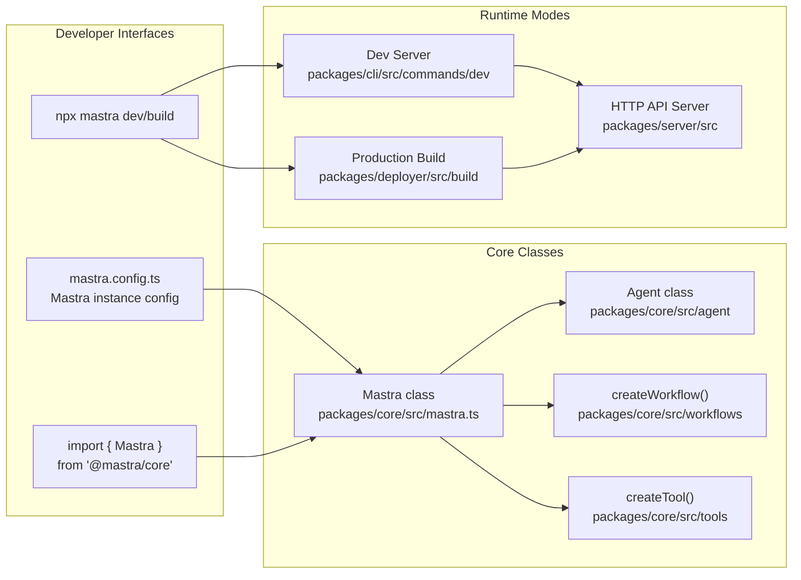
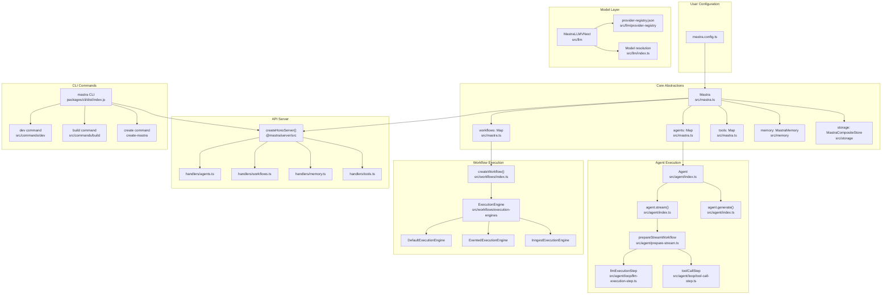
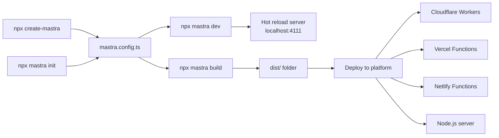
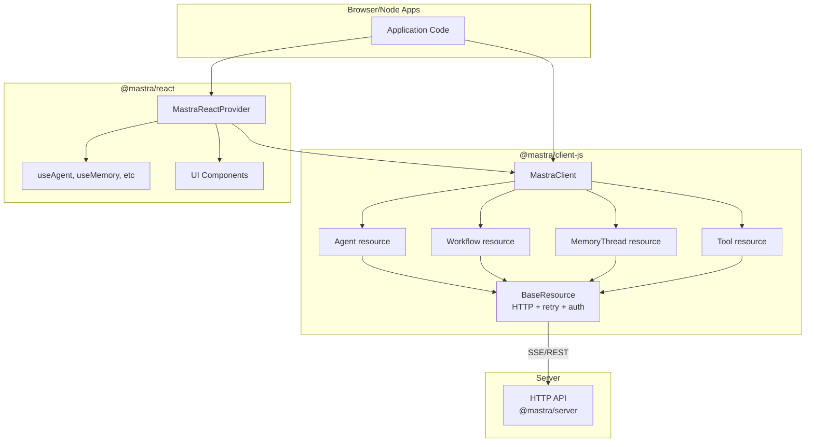

# Overview

Relevant source files

The following files were used as context for generating this wiki page:

- [.changeset/pre.json](.changeset/pre.json)
- [client-sdks/client-js/CHANGELOG.md](client-sdks/client-js/CHANGELOG.md)
- [client-sdks/client-js/package.json](client-sdks/client-js/package.json)
- [client-sdks/react/package.json](client-sdks/react/package.json)
- [deployers/cloudflare/CHANGELOG.md](deployers/cloudflare/CHANGELOG.md)
- [deployers/cloudflare/package.json](deployers/cloudflare/package.json)
- [deployers/netlify/CHANGELOG.md](deployers/netlify/CHANGELOG.md)
- [deployers/netlify/package.json](deployers/netlify/package.json)
- [deployers/vercel/CHANGELOG.md](deployers/vercel/CHANGELOG.md)
- [deployers/vercel/package.json](deployers/vercel/package.json)
- [examples/dane/CHANGELOG.md](examples/dane/CHANGELOG.md)
- [examples/dane/package.json](examples/dane/package.json)
- [package.json](package.json)
- [packages/cli/CHANGELOG.md](packages/cli/CHANGELOG.md)
- [packages/cli/package.json](packages/cli/package.json)
- [packages/core/CHANGELOG.md](packages/core/CHANGELOG.md)
- [packages/core/package.json](packages/core/package.json)
- [packages/core/src/index.ts](packages/core/src/index.ts)
- [packages/create-mastra/CHANGELOG.md](packages/create-mastra/CHANGELOG.md)
- [packages/create-mastra/package.json](packages/create-mastra/package.json)
- [packages/deployer/CHANGELOG.md](packages/deployer/CHANGELOG.md)
- [packages/deployer/package.json](packages/deployer/package.json)
- [packages/mcp-docs-server/CHANGELOG.md](packages/mcp-docs-server/CHANGELOG.md)
- [packages/mcp-docs-server/package.json](packages/mcp-docs-server/package.json)
- [packages/mcp/CHANGELOG.md](packages/mcp/CHANGELOG.md)
- [packages/mcp/package.json](packages/mcp/package.json)
- [packages/playground-ui/CHANGELOG.md](packages/playground-ui/CHANGELOG.md)
- [packages/playground-ui/package.json](packages/playground-ui/package.json)
- [packages/playground/CHANGELOG.md](packages/playground/CHANGELOG.md)
- [packages/playground/package.json](packages/playground/package.json)
- [packages/server/CHANGELOG.md](packages/server/CHANGELOG.md)
- [packages/server/package.json](packages/server/package.json)
- [pnpm-lock.yaml](pnpm-lock.yaml)

## Purpose and Scope

This document provides a high-level introduction to the Mastra framework, an AI application development platform for building agent-based systems, workflows, and tools. It covers the framework's architecture, package organization, and how the major systems interconnect.

For detailed information about specific subsystems, see:

- **Package organization and dependencies** → [1.1](#1.1)
- **System architecture and component relationships** → [1.2](#1.2)
- **Core configuration and initialization** → [2](#2)
- **Agent execution** → [3](#3)
- **Workflow orchestration** → [4](#4)
- **Model providers** → [5](#5)
- **Development and deployment** → [8](#8)

## What is Mastra?

Mastra is a TypeScript-based framework for building production AI applications. It provides:

- **Agent execution engine** with LLM integration, tool calling, and memory management
- **Workflow system** for multi-step processes with state management and suspend/resume capabilities
- **Model provider abstraction** supporting 94 providers and 3373+ models through a unified interface
- **Memory architecture** with working memory, observational memory, and semantic recall
- **Development tools** including CLI, hot-reload dev server, and deployment to multiple platforms
- **API server** with HTTP endpoints and client SDKs for browser and Node.js environments

**Sources:** [package.json:1-128](), [packages/core/package.json:1-333](), [packages/cli/package.json:1-110]()

## Monorepo Structure

The Mastra codebase is organized as a pnpm monorepo with the following top-level directories:

```mermaid
graph TB
    Root["mastra-turbo<br/>(monorepo root)"]

    Root --> Packages["packages/<br/>Core framework packages"]
    Root --> ClientSDKs["client-sdks/<br/>JS and React SDKs"]
    Root --> Deployers["deployers/<br/>Platform deployers"]
    Root --> Stores["stores/<br/>Storage adapters"]
    Root --> ServerAdapters["server-adapters/<br/>HTTP framework adapters"]
    Root --> Auth["auth/<br/>Authentication providers"]
    Root --> Observability["observability/<br/>Telemetry integrations"]
    Root --> Workspaces["workspaces/<br/>Filesystem abstraction"]
    Root --> Examples["examples/<br/>Sample applications"]

    Packages --> Core["@mastra/core<br/>Agent, Workflow, Memory"]
    Packages --> CLI["mastra<br/>CLI commands"]
    Packages --> Server["@mastra/server<br/>API routes & handlers"]
    Packages --> Deployer["@mastra/deployer<br/>Build & bundle system"]
    Packages --> MCP["@mastra/mcp<br/>MCP client & server"]
    Packages --> RAG["@mastra/rag<br/>Document processing"]
    Packages --> Evals["@mastra/evals<br/>Evaluation metrics"]
    Packages --> PlaygroundUI["@mastra/playground-ui<br/>Studio React components"]

    ClientSDKs --> ClientJS["@mastra/client-js<br/>HTTP client"]
    ClientSDKs --> React["@mastra/react<br/>React hooks & components"]

    Deployers --> Cloudflare["@mastra/deployer-cloudflare"]
    Deployers --> Vercel["@mastra/deployer-vercel"]
    Deployers --> Netlify["@mastra/deployer-netlify"]

    Stores --> PG["@mastra/pg<br/>PostgreSQL"]
    Stores --> LibSQL["@mastra/libsql<br/>LibSQL/SQLite"]
    Stores --> Upstash["@mastra/upstash<br/>Upstash Redis"]
```

**Sources:** [package.json:1-128](), [pnpm-lock.yaml:1-100]()

## Core Package Dependencies

The dependency graph shows how packages relate to each other:

| Package                 | Description                                     | Key Dependencies                                     |
| ----------------------- | ----------------------------------------------- | ---------------------------------------------------- |
| `@mastra/core`          | Framework core (Agent, Workflow, Tools, Memory) | `zod`, `@ai-sdk/provider-*`, `hono`                  |
| `mastra` (CLI)          | Development server, build commands              | `@mastra/core`, `@mastra/deployer`                   |
| `@mastra/server`        | HTTP API layer with handlers                    | `@mastra/core`, `hono`                               |
| `@mastra/deployer`      | Build system and platform abstraction           | `@mastra/server`, `rollup`, `esbuild`                |
| `@mastra/client-js`     | Client SDK for HTTP API                         | `@mastra/core` (types only)                          |
| `@mastra/react`         | React hooks and components                      | `@mastra/client-js`                                  |
| `@mastra/playground-ui` | Studio UI components                            | `@mastra/client-js`, `@mastra/react`, `@mastra/core` |
| `@mastra/mcp`           | Model Context Protocol client/server            | `@mastra/core`, `@modelcontextprotocol/sdk`          |
| `@mastra/rag`           | Document chunking and vector tools              | `@mastra/core`                                       |

**Sources:** [packages/core/package.json:222-333](), [packages/cli/package.json:52-93](), [packages/server/package.json:100-140](), [packages/deployer/package.json:96-165]()

## Framework Entry Points

**Sources:** [packages/core/src/index.ts:1-2](), [packages/cli/package.json:10-11](), [packages/server/package.json:1-140]()

## System Architecture Map

The following diagram maps user-facing concepts to their implementing code modules:

**Sources:** [packages/core/src/index.ts:1-2](), [packages/server/package.json:23-43](), [packages/cli/package.json:9-11]()

## Key Framework Concepts

### Mastra Instance

The `Mastra` class is the central orchestrator that wires together all subsystems. It is configured via a `Config` object (typically exported from `mastra.config.ts`) and provides:

- **Agent registration** via `agents` property
- **Workflow registration** via `workflows` property
- **Tool registration** via `tools` property
- **Memory system** via `memory` property
- **Storage layer** via `storage` property

**Sources:** [packages/core/src/index.ts:1-2]()

### Agent System

Agents combine an LLM, tools, and memory into an execution unit. Key classes:

- `Agent` - Main agent class with `stream()` and `generate()` methods
- `prepareStreamWorkflow` - Sets up the execution pipeline
- `llmExecutionStep` - Handles LLM calls and response streaming
- `toolCallStep` - Executes tool invocations (local or client-side)

Agents support:

- Streaming and non-streaming responses
- Tool approval and suspension
- Memory integration (working, observational, semantic)
- Input/output processors
- Structured output via schemas

**Sources:** Diagrams from context

### Workflow System

Workflows orchestrate multi-step processes with state management. Key components:

- `createWorkflow()` - Builder function for workflow definitions
- `createStep()` - Defines individual workflow steps
- `ExecutionEngine` - Abstract execution interface
- `DefaultExecutionEngine` - In-memory execution
- `EventedExecutionEngine` - Event-driven with PubSub
- `InngestExecutionEngine` - Durable execution with Inngest

Workflows support:

- Conditional branching
- Parallel execution
- Suspend/resume mechanisms
- Tool approval integration
- State persistence

**Sources:** Diagrams from context

### Memory Architecture

The memory system provides multi-layered context management:

- **Working Memory** - Structured mutable state (JSON schema or markdown template)
- **Observational Memory** - Three-tier compression (messages → observations → reflections)
- **Semantic Recall** - Vector-based retrieval of historical messages
- **Message History** - Recent conversation context

Memory integrates with agents via processors that automatically inject context into prompts.

**Sources:** Diagrams from context

### Model Provider System

The framework abstracts 94 LLM providers through a unified interface:

- `provider-registry.json` - Centralized provider and model catalog
- `MastraLLMVNext` - Unified LLM class supporting AI SDK v4/v5/v6
- String-based model IDs (e.g., `"openai/gpt-4o"`)
- Environment variable-based API key resolution
- Model fallback chains

**Sources:** Diagrams from context, [packages/core/package.json:1-333]()

### Tool System

Tools are executable functions with schema-defined inputs. The framework supports:

- **Mastra tools** - User-defined via `createTool()`
- **Provider tools** - Native LLM tools (e.g., `openai.tools.webSearch()`)
- **MCP tools** - Discovered from Model Context Protocol servers
- **Vercel AI SDK tools** - Compatibility layer

Tool execution context varies by invocation source (agent, workflow, or MCP).

**Sources:** Diagrams from context

## Development Workflow

**Sources:** [packages/cli/package.json:9-11](), [packages/create-mastra/package.json:8-10]()

## API Server Architecture

The HTTP server layer exposes agents, workflows, and tools via REST and SSE endpoints:

| Endpoint Pattern       | Handler Module              | Purpose                           |
| ---------------------- | --------------------------- | --------------------------------- |
| `/api/agents/*`        | `handlers/agents.ts`        | Agent list, generate, stream      |
| `/api/workflows/*`     | `handlers/workflows.ts`     | Workflow run, status, cancel      |
| `/api/memory/*`        | `handlers/memory.ts`        | Threads, messages, working memory |
| `/api/tools/*`         | `handlers/tools.ts`         | Tool execution                    |
| `/api/observability/*` | `handlers/observability.ts` | Traces, logs, metrics             |
| `/studio`              | `handlers/studio.ts`        | Studio UI assets                  |

The server uses the Hono framework and supports middleware for authentication, CORS, and request context.

**Sources:** [packages/server/package.json:23-43]()

## Client SDK Architecture

**Sources:** [client-sdks/client-js/package.json:1-72](), [client-sdks/react/package.json:1-62]()

## Storage and Persistence

The framework provides a storage abstraction layer with adapters for multiple backends:

- **PostgreSQL** - `@mastra/pg`
- **LibSQL** - `@mastra/libsql` (SQLite-compatible, edge-friendly)
- **Upstash Redis** - `@mastra/upstash`
- **MongoDB** - `@mastra/mongodb`
- **Cloudflare D1** - `@mastra/cloudflare-d1`
- Additional vector stores (Pinecone, Qdrant, Chroma, etc.)

Storage is used for:

- Thread and message persistence
- Working memory state
- Observational memory records
- Vector embeddings for semantic search
- Workflow state snapshots

**Sources:** [pnpm-lock.yaml:1-100]() (importers section shows all storage packages)

## Build and Deployment

The deployment pipeline consists of:

1. **Static Analysis** - Detects dependencies and workspace packages
2. **Bundling** - Rollup-based bundling with platform-specific optimizations
3. **Validation** - VM execution test to catch missing modules
4. **Platform Packaging** - Generates platform-specific artifacts

Supported platforms:

- **Cloudflare Workers** - `@mastra/deployer-cloudflare`
- **Vercel Functions** - `@mastra/deployer-vercel`
- **Netlify Functions** - `@mastra/deployer-netlify`
- **Node.js** - Direct execution via `@mastra/deployer`

Each deployer extends the base `Bundler` class and implements platform-specific packaging.

**Sources:** [packages/deployer/package.json:1-165](), [deployers/cloudflare/package.json:1-90](), [deployers/vercel/package.json:1-67](), [deployers/netlify/package.json:1-67]()

## Observability and Evaluation

The framework includes built-in observability and evaluation capabilities:

- **OpenTelemetry** - Distributed tracing via `@opentelemetry/api`
- **Observability Integrations** - Exporters for Langfuse, Langsmith, Braintrust, Arize, etc.
- **Evaluation System** - `@mastra/evals` with prebuilt and custom scorers
- **API Endpoints** - `/api/observability/*` for traces, logs, metrics, feedback

**Sources:** [pnpm-lock.yaml:1-100]() (observability section)

## Next Steps

For deeper exploration of specific subsystems:

- **Monorepo structure** → [1.1](#1.1)
- **System architecture details** → [1.2](#1.2)
- **Core configuration** → [2](#2)
- **Agent system** → [3](#3)
- **Workflow system** → [4](#4)
- **Model providers** → [5](#5)
- **Tool system** → [6](#6)
- **Memory and storage** → [7](#7)
- **CLI and development** → [8](#8)
- **Server and API** → [9](#9)
- **Client SDKs** → [10](#10)
- **Observability** → [11](#11)
