# Monorepo Structure and Package Organization

<details>
<summary>Relevant source files</summary>

The following files were used as context for generating this wiki page:

- [.changeset/pre.json](.changeset/pre.json)
- [client-sdks/client-js/CHANGELOG.md](client-sdks/client-js/CHANGELOG.md)
- [client-sdks/client-js/package.json](client-sdks/client-js/package.json)
- [client-sdks/react/package.json](client-sdks/react/package.json)
- [deployers/cloudflare/CHANGELOG.md](deployers/cloudflare/CHANGELOG.md)
- [deployers/cloudflare/package.json](deployers/cloudflare/package.json)
- [deployers/netlify/CHANGELOG.md](deployers/netlify/CHANGELOG.md)
- [deployers/netlify/package.json](deployers/netlify/package.json)
- [deployers/vercel/CHANGELOG.md](deployers/vercel/CHANGELOG.md)
- [deployers/vercel/package.json](deployers/vercel/package.json)
- [examples/dane/CHANGELOG.md](examples/dane/CHANGELOG.md)
- [examples/dane/package.json](examples/dane/package.json)
- [package.json](package.json)
- [packages/cli/CHANGELOG.md](packages/cli/CHANGELOG.md)
- [packages/cli/package.json](packages/cli/package.json)
- [packages/core/CHANGELOG.md](packages/core/CHANGELOG.md)
- [packages/core/package.json](packages/core/package.json)
- [packages/create-mastra/CHANGELOG.md](packages/create-mastra/CHANGELOG.md)
- [packages/create-mastra/package.json](packages/create-mastra/package.json)
- [packages/deployer/CHANGELOG.md](packages/deployer/CHANGELOG.md)
- [packages/deployer/package.json](packages/deployer/package.json)
- [packages/mcp-docs-server/CHANGELOG.md](packages/mcp-docs-server/CHANGELOG.md)
- [packages/mcp-docs-server/package.json](packages/mcp-docs-server/package.json)
- [packages/mcp/CHANGELOG.md](packages/mcp/CHANGELOG.md)
- [packages/mcp/package.json](packages/mcp/package.json)
- [packages/playground-ui/CHANGELOG.md](packages/playground-ui/CHANGELOG.md)
- [packages/playground-ui/package.json](packages/playground-ui/package.json)
- [packages/playground/CHANGELOG.md](packages/playground/CHANGELOG.md)
- [packages/playground/package.json](packages/playground/package.json)
- [packages/server/CHANGELOG.md](packages/server/CHANGELOG.md)
- [packages/server/package.json](packages/server/package.json)
- [pnpm-lock.yaml](pnpm-lock.yaml)

</details>

This document describes the organization of the Mastra monorepo, including its package hierarchy, dependencies, build system, and development workflows. The monorepo uses pnpm workspaces and Turborepo to manage over 100 packages across multiple categories.

For information about the overall system architecture and how components interact, see [System Architecture Overview](#1.2).

## Workspace Configuration

The Mastra monorepo is organized using **pnpm workspaces** with Turborepo for build orchestration. The workspace structure is defined at the root level and manages dependencies across all packages.

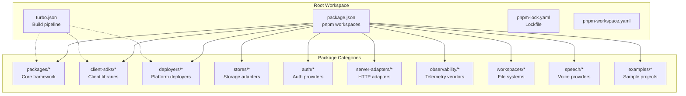

**Sources:** [package.json:1-128](), [pnpm-lock.yaml:1-50]()

### Build System Organization

The root `package.json` defines granular build scripts that correspond to workspace categories:

| Script Pattern          | Target              | Example Packages                                         |
| ----------------------- | ------------------- | -------------------------------------------------------- |
| `build:packages`        | `./packages/*`      | `@mastra/core`, `@mastra/server`, `@mastra/cli`          |
| `build:clients`         | `./client-sdks/*`   | `@mastra/client-js`, `@mastra/react`                     |
| `build:deployers`       | `./deployers/*`     | `@mastra/deployer-cloudflare`, `@mastra/deployer-vercel` |
| `build:combined-stores` | `./stores/*`        | `@mastra/pg`, `@mastra/libsql`, `@mastra/mongodb`        |
| `build:auth`            | `./auth/*`          | `@mastra/auth-clerk`, `@mastra/auth-workos`              |
| `build:observability`   | `./observability/*` | `@mastra/langfuse`, `@mastra/langsmith`                  |
| `build:speech`          | `./speech/*`        | `@mastra/voice-openai`, `@mastra/voice-deepgram`         |

**Sources:** [package.json:32-54]()

## Core Packages (`packages/`)

The `packages/` directory contains the foundational components of the Mastra framework. These packages form the execution engine, developer tooling, and runtime infrastructure.

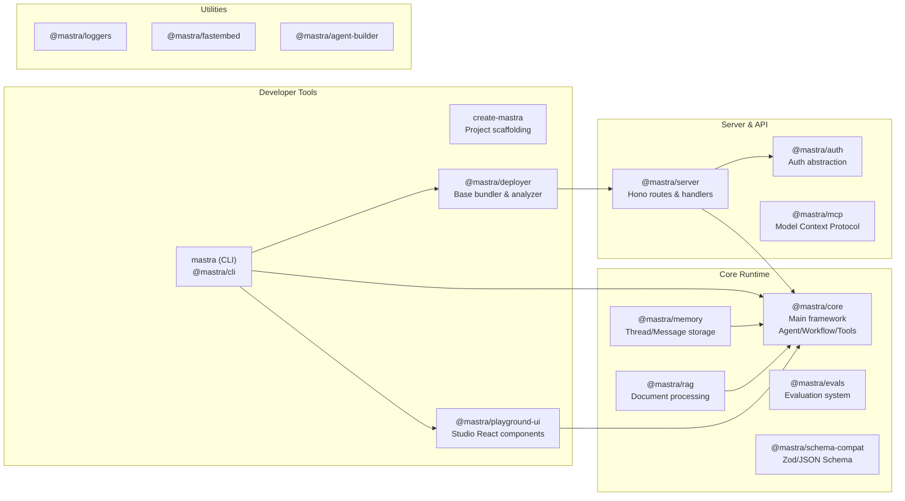

**Sources:** [packages/core/package.json:1-333](), [packages/cli/package.json:1-110](), [packages/server/package.json:1-140](), [packages/deployer/package.json:1-165](), [packages/playground-ui/package.json:1-191]()

### `@mastra/core` Package Structure

The core package exports multiple entry points for different subsystems:

```mermaid
graph TB
    CorePkg["@mastra/core"]

    CorePkg --> MainExport[".<br/>Main exports"]
    CorePkg --> ToolsExport["./tools/is-vercel-tool<br/>Tool utilities"]
    CorePkg --> WorkflowConst["./workflows/_constants<br/>Workflow constants"]
    CorePkg --> NetworkVNext["./network/vNext<br/>Agent networks"]
    CorePkg --> WorkflowEvented["./workflows/evented<br/>Event-driven workflows"]
    CorePkg --> VectorFilter["./vector/filter<br/>Vector filtering"]
    CorePkg --> Utils["./utils<br/>Shared utilities"]
    CorePkg --> Base["./base<br/>Base classes"]
    CorePkg --> OTel["./telemetry/otel-vendor<br/>OpenTelemetry"]
    CorePkg --> LLMMock["./test-utils/llm-mock<br/>Test mocking"]
    CorePkg --> Processors["./processors<br/>Agent processors"]
    CorePkg --> ScoreTraces["./evals/scoreTraces<br/>Trace scoring"]
    CorePkg --> Features["./features<br/>Feature flags"]
    CorePkg --> MessageList["./agent/message-list<br/>Message handling"]
    CorePkg --> LoopServer["./loop/server<br/>Server-side loop"]
    CorePkg --> StorageConstants["./storage/constants<br/>Storage keys"]
```

**Sources:** [packages/core/package.json:13-204]()

### `@mastra/cli` Commands

The CLI package (`mastra`) provides the primary developer interface:

| Command  | Implementation            | Purpose                        |
| -------- | ------------------------- | ------------------------------ |
| `create` | `create-mastra` package   | Scaffold new projects          |
| `init`   | CLI init command          | Add Mastra to existing project |
| `dev`    | DevBundler + file watcher | Hot-reload development server  |
| `build`  | Static analyzer + Rollup  | Production bundle              |
| `deploy` | Platform deployers        | Deploy to cloud platforms      |
| `studio` | Playground UI server      | Launch Studio UI standalone    |

**Sources:** [packages/cli/package.json:9-11](), [packages/create-mastra/package.json:8-9]()

## Client SDKs (`client-sdks/`)

Client SDK packages provide typed interfaces for consuming Mastra APIs from frontend and backend applications.

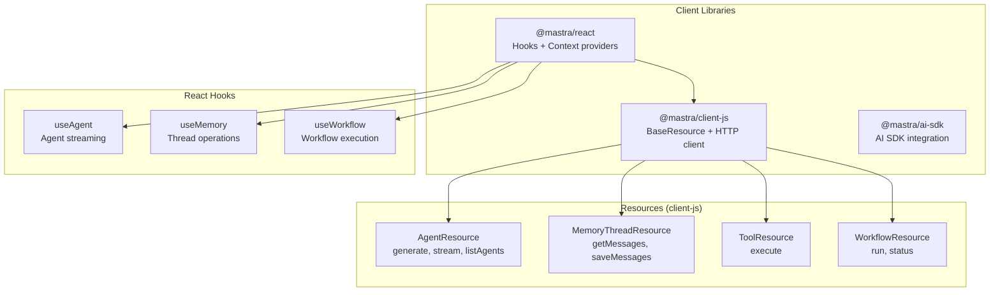

**Sources:** [client-sdks/client-js/package.json:1-72](), [client-sdks/react/package.json:1-72]()

### Client Package Dependencies

The client SDK dependency chain ensures consistent typing and behavior:

```
@mastra/react
  └─> @mastra/client-js
       ├─> @mastra/core (workspace:*)
       ├─> @mastra/schema-compat (workspace:*)
       └─> @ai-sdk/ui-utils (^1.2.11)
```

**Sources:** [client-sdks/client-js/package.json:44-49](), [client-sdks/react/package.json:44-56]()

## Platform Deployers (`deployers/`)

Deployer packages extend the base `@mastra/deployer` bundler to produce platform-specific build artifacts.

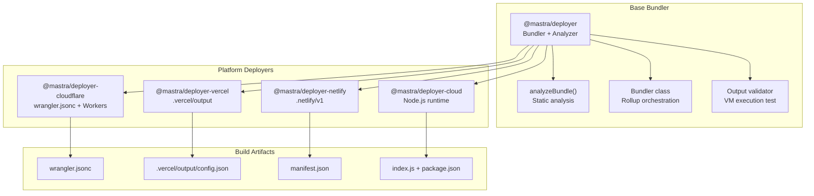

**Sources:** [packages/deployer/package.json:1-165](), [deployers/cloudflare/package.json:1-90](), [deployers/vercel/package.json:1-67](), [deployers/netlify/package.json:1-67]()

### Deployer Package Exports

The base deployer package provides multiple entry points for different stages of the build pipeline:

| Export Path  | Purpose                    | Used By            |
| ------------ | -------------------------- | ------------------ |
| `.`          | Main deployer classes      | Platform deployers |
| `./server`   | Server creation utilities  | CLI dev command    |
| `./services` | Service orchestration      | Cloud deployer     |
| `./build`    | Build orchestration        | CLI build command  |
| `./bundler`  | Bundler base class         | Platform deployers |
| `./analyze`  | Static dependency analysis | All deployers      |
| `./loader`   | Output validation          | All deployers      |

**Sources:** [packages/deployer/package.json:12-83]()

## Storage Adapters (`stores/`)

Storage adapter packages implement the `MastraCompositeStore` and `MastraVector` interfaces for different databases and vector stores.

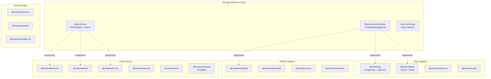

**Sources:** [pnpm-lock.yaml:77-98](), [.changeset/pre.json:77-98]()

### Storage Adapter Categories

All storage adapters implement one or both of these interfaces:

1. **`MastraCompositeStore`**: Full memory persistence (threads, messages, working memory, observational memory)
   - Examples: `@mastra/pg`, `@mastra/libsql`, `@mastra/mongodb`
2. **`MastraVector`**: Vector storage and semantic search
   - Examples: `@mastra/pinecone`, `@mastra/qdrant`, `@mastra/chroma`

Some adapters (like `@mastra/pg` with pgvector) implement both interfaces.

**Sources:** Based on architectural patterns from high-level diagrams

## Authentication Providers (`auth/`)

Auth provider packages integrate external authentication services with the Mastra auth system.

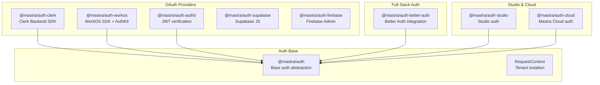

**Sources:** [auth/clerk/package.json:1-236](), [auth/workos/package.json:1-432](), [auth/better-auth/package.json:1-196](), [auth/auth0/package.json:1-156]()

### Auth Provider Integration Pattern

All auth providers follow a common pattern:

```
@mastra/auth-{provider}
  ├─> @mastra/auth (workspace:*) - Base auth abstraction
  ├─> @mastra/core (workspace:*) - RequestContext types
  └─> {provider-sdk} - Third-party SDK
```

The auth middleware sets `RequestContext` with reserved keys (`MASTRA_RESOURCE_ID_KEY`, `MASTRA_THREAD_ID_KEY`) that handlers trust for authorization.

**Sources:** [auth/clerk/package.json:199-215](), [auth/workos/package.json:387-408]()

## Server Adapters (`server-adapters/`)

Server adapter packages wrap Hono routes for different HTTP frameworks.

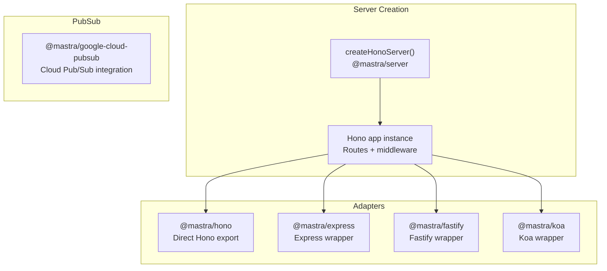

**Sources:** Based on package organization patterns from [pnpm-lock.yaml]()

### Server Adapter Pattern

Each adapter package provides a thin wrapper around the Hono app created by `@mastra/server`:

1. **`@mastra/hono`**: Direct export of the Hono instance
2. **`@mastra/express`**: Wraps Hono with Express adapter
3. **`@mastra/fastify`**: Wraps Hono with Fastify adapter
4. **`@mastra/koa`**: Wraps Hono with Koa adapter

This allows developers to integrate Mastra APIs into existing HTTP server infrastructure.

## Observability Integrations (`observability/`)

Observability packages integrate Mastra's telemetry system with external observability vendors.

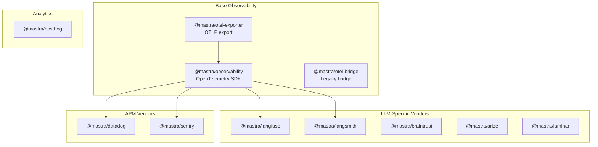

**Sources:** [pnpm-lock.yaml:28-38](), [.changeset/pre.json:28-38]()

### Observability Package Pattern

Each vendor integration package follows this pattern:

```
@mastra/{vendor}
  ├─> @mastra/observability (workspace:*) - Base telemetry
  ├─> @opentelemetry/api (peer) - OTel primitives
  └─> {vendor-sdk} - Vendor-specific client
```

The observability system emits OpenTelemetry spans that integrations export to their respective platforms.

## Workspace Providers (`workspaces/`)

Workspace packages provide filesystem abstractions for agent file operations.

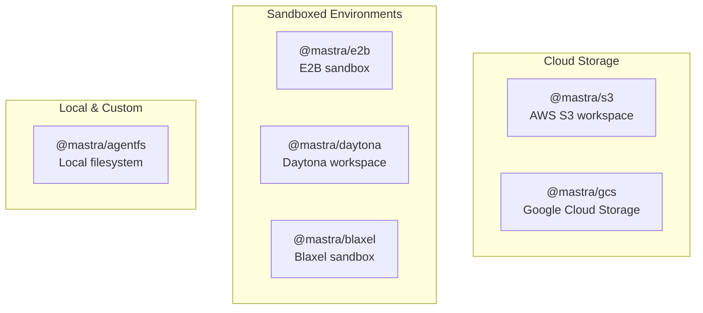

**Sources:** [pnpm-lock.yaml:116-121](), [.changeset/pre.json:116-121]()

### Workspace Interface Pattern

All workspace providers implement a common filesystem interface that agents use to read/write files during execution. This enables seamless switching between local development (AgentFS) and cloud/sandbox environments (S3, E2B, etc.).

## Speech Providers (`speech/`)

Speech packages integrate voice input/output providers for conversational agents.

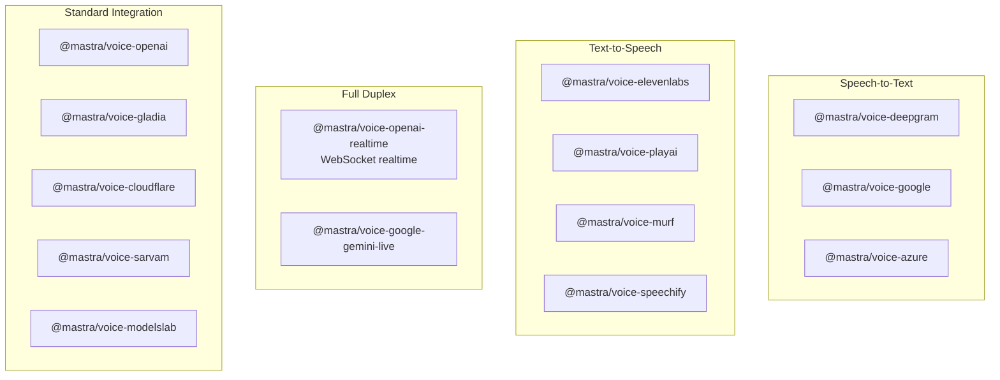

**Sources:** [pnpm-lock.yaml:99-112](), [.changeset/pre.json:99-112]()

## Internal Packages (`packages/_*`)

Internal packages provide shared development utilities and vendored dependencies.

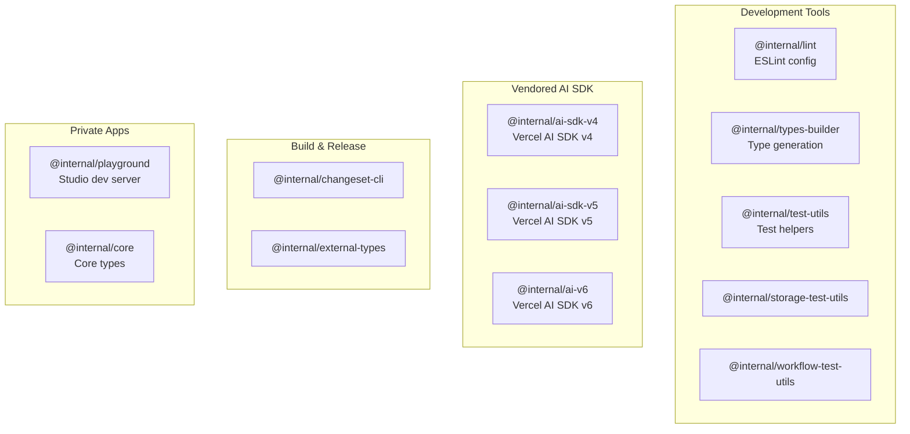

**Sources:** [pnpm-lock.yaml:42-49](), [.changeset/pre.json:42-49]()

### Vendored AI SDK Versions

Mastra vendors multiple versions of the Vercel AI SDK to maintain compatibility across provider implementations:

- **`@internal/ai-sdk-v4`**: Legacy v4 support (AI SDK v1.x)
- **`@internal/ai-sdk-v5`**: Current v5 support (AI SDK v2.x)
- **`@internal/ai-v6`**: Next-generation v6 support (AI SDK v3.x)

This allows `@mastra/core` to bridge all three versions simultaneously.

**Sources:** [packages/core/package.json:276-278]()

## Dependency Graph by Category

The following diagram shows the high-level dependency relationships between package categories:

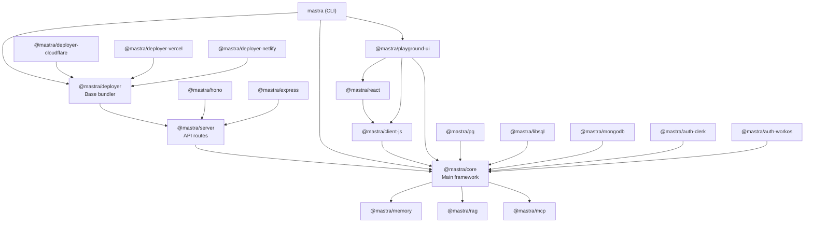

**Sources:** [packages/core/package.json:252-254](), [packages/server/package.json:100-103](), [packages/deployer/package.json:149-152](), [packages/cli/package.json:94-97]()

## Build Pipeline and Scripts

The monorepo uses Turborepo to orchestrate builds across packages with proper dependency ordering.

### Build Script Hierarchy

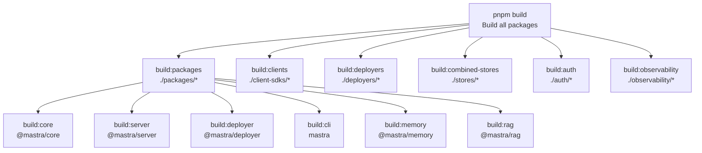

**Sources:** [package.json:32-54]()

### Turbo Pipeline Configuration

The `turbo.json` configuration defines task dependencies and caching strategies. Key tasks include:

| Task        | Depends On              | Outputs            |
| ----------- | ----------------------- | ------------------ |
| `build`     | `^build` (dependencies) | `dist/**`          |
| `test`      | `build`                 | Test coverage      |
| `lint`      | -                       | Lint results       |
| `typecheck` | -                       | Type check results |

The `^build` dependency ensures that when building a package, all its workspace dependencies are built first.

## Version Management with Changesets

The monorepo uses Changesets for version management and changelog generation.

```mermaid
graph LR
    subgraph "Changeset Workflow"
        AddChangeset["pnpm changeset<br/>Add changeset"]
        VersionBump["pnpm version<br/>Bump versions"]
        Publish["pnpm publish<br/>Release packages"]
    end

    subgraph "Changeset Files"
        ChangesetMD[".changeset/*.md<br/>Change descriptions"]
        PreJSON[".changeset/pre.json<br/>Pre-release mode"]
    end

    subgraph "Generated Artifacts"
        PackageJSON["package.json<br/>Updated version"]
        Changelog["CHANGELOG.md<br/>Generated changelog"]
    end

    AddChangeset --> ChangesetMD
    ChangesetMD --> VersionBump
    VersionBump --> PackageJSON
    VersionBump --> Changelog
    PackageJSON --> Publish

    PreJSON -.-> VersionBump
```

**Sources:** [.changeset/pre.json:1-127](), [package.json:29-30]()

### Pre-release Mode

The repository is currently in pre-release mode (`"mode": "pre"`, `"tag": "alpha"`), meaning all published versions include the `-alpha.X` suffix. This is tracked in `.changeset/pre.json`.

**Sources:** [.changeset/pre.json:2-3]()

### Initial Versions

The `initialVersions` object in `.changeset/pre.json` records the baseline version for each package when pre-release mode was activated. This ensures changesets correctly calculate version bumps from the last stable release.

**Sources:** [.changeset/pre.json:4-122]()

## Package Naming Conventions

Mastra follows consistent naming patterns across package categories:

| Pattern                       | Category           | Examples                                 |
| ----------------------------- | ------------------ | ---------------------------------------- |
| `@mastra/{name}`              | Core packages      | `@mastra/core`, `@mastra/server`         |
| `@mastra/deployer-{platform}` | Platform deployers | `@mastra/deployer-cloudflare`            |
| `@mastra/auth-{provider}`     | Auth providers     | `@mastra/auth-clerk`                     |
| `@mastra/voice-{provider}`    | Speech providers   | `@mastra/voice-openai`                   |
| `@mastra/{database}`          | Storage adapters   | `@mastra/pg`, `@mastra/libsql`           |
| `@internal/{util}`            | Internal packages  | `@internal/lint`, `@internal/test-utils` |
| `mastra`                      | CLI package        | Primary CLI command                      |
| `create-mastra`               | Scaffolding        | Project creation                         |

**Sources:** Based on package naming patterns from [pnpm-lock.yaml]() and [.changeset/pre.json]()

## Development Workflow

### Local Development

1. **Install dependencies**: `pnpm install` (uses lockfile for consistency)
2. **Build all packages**: `pnpm build`
3. **Run tests**: `pnpm test` or category-specific `pnpm test:core`, `pnpm test:cli`, etc.
4. **Lint code**: `pnpm lint` or `pnpm format` to auto-fix
5. **Type check**: `pnpm typecheck` (runs across all packages)

**Sources:** [package.json:28-96]()

### Adding a New Package

To add a new package to the monorepo:

1. Create directory in appropriate category (e.g., `stores/my-store`)
2. Add `package.json` with `@mastra/my-store` name
3. Use `workspace:*` for internal dependencies
4. Add build script to root `package.json` if needed
5. Run `pnpm install` to update lockfile

### Testing Infrastructure

Test utilities are organized by domain:

- **`@internal/test-utils`**: General test helpers
- **`@internal/storage-test-utils`**: Storage adapter test suites
- **`@internal/workflow-test-utils`**: Workflow engine tests
- **`@internal/server-adapter-test-utils`**: Server adapter tests
- **`@observability/test-utils`**: Observability integration tests

**Sources:** [pnpm-lock.yaml:28-38](), [package.json:56-82]()

## Monorepo Statistics

Based on the lockfile and changeset configuration:

- **Total packages**: ~120+ (including internal and examples)
- **Published packages**: ~85+ (from `.changeset/pre.json`)
- **Package categories**: 10 (core, clients, deployers, stores, auth, server-adapters, observability, workspaces, speech, examples)
- **Storage adapters**: ~20+
- **Auth providers**: 8
- **Speech providers**: 13
- **Observability integrations**: 9

**Sources:** [.changeset/pre.json:4-122](), [pnpm-lock.yaml:1-50]()
