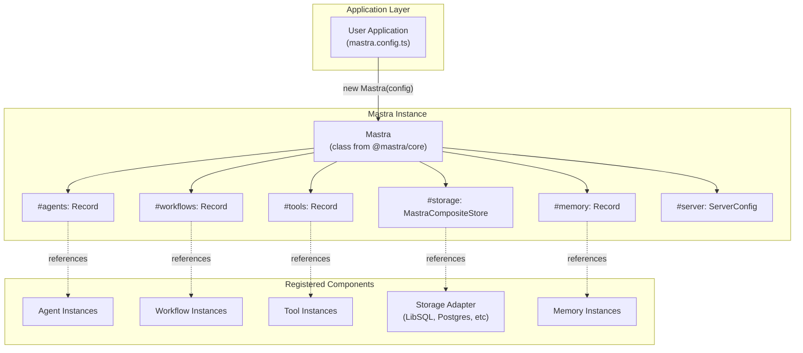
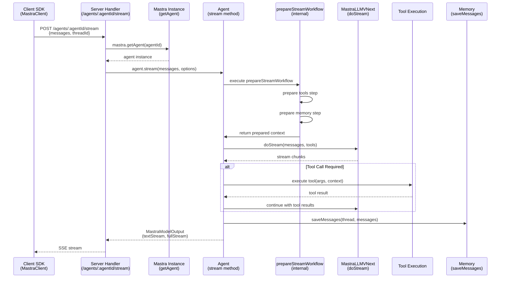
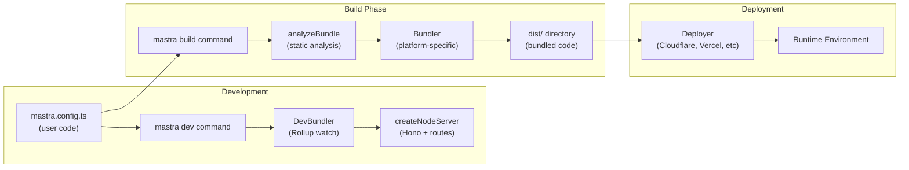
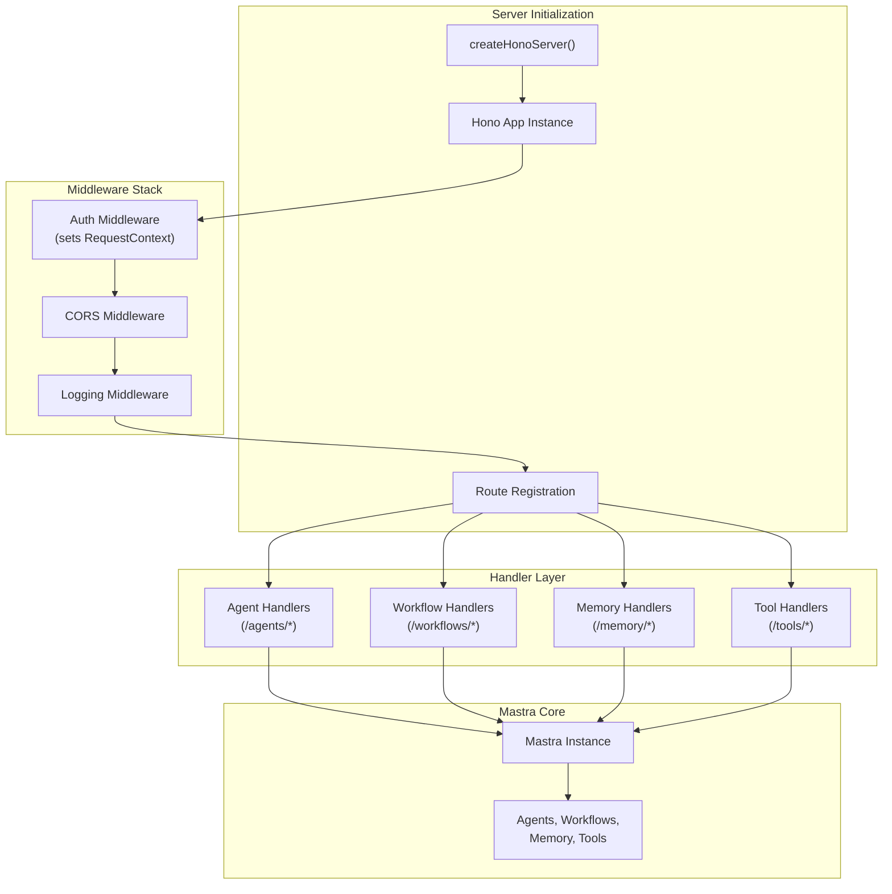
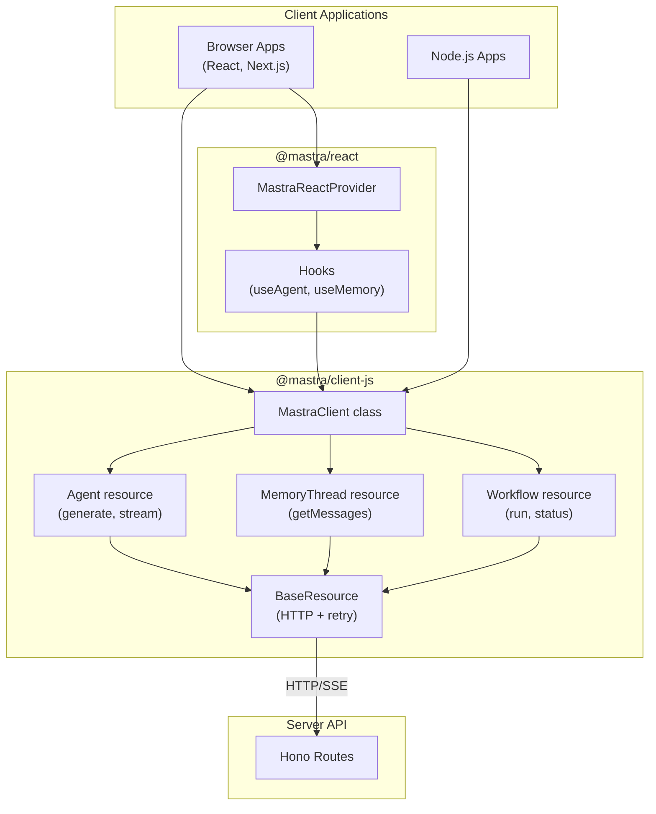
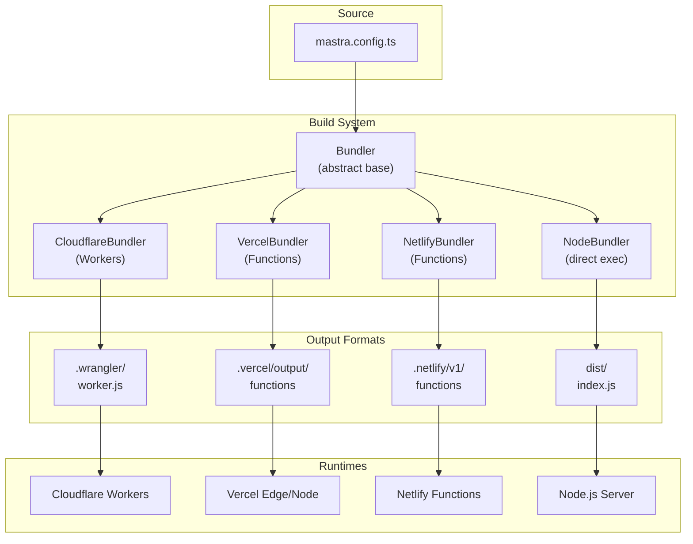

# System Architecture Overview

<details>
<summary>Relevant source files</summary>

The following files were used as context for generating this wiki page:

- [.changeset/pre.json](.changeset/pre.json)
- [client-sdks/client-js/CHANGELOG.md](client-sdks/client-js/CHANGELOG.md)
- [client-sdks/client-js/package.json](client-sdks/client-js/package.json)
- [client-sdks/react/package.json](client-sdks/react/package.json)
- [deployers/cloudflare/CHANGELOG.md](deployers/cloudflare/CHANGELOG.md)
- [deployers/cloudflare/package.json](deployers/cloudflare/package.json)
- [deployers/netlify/CHANGELOG.md](deployers/netlify/CHANGELOG.md)
- [deployers/netlify/package.json](deployers/netlify/package.json)
- [deployers/vercel/CHANGELOG.md](deployers/vercel/CHANGELOG.md)
- [deployers/vercel/package.json](deployers/vercel/package.json)
- [examples/bird-checker-with-express/src/index.ts](examples/bird-checker-with-express/src/index.ts)
- [examples/bird-checker-with-nextjs-and-eval/src/lib/mastra/actions.ts](examples/bird-checker-with-nextjs-and-eval/src/lib/mastra/actions.ts)
- [examples/dane/CHANGELOG.md](examples/dane/CHANGELOG.md)
- [examples/dane/package.json](examples/dane/package.json)
- [package.json](package.json)
- [packages/cli/CHANGELOG.md](packages/cli/CHANGELOG.md)
- [packages/cli/package.json](packages/cli/package.json)
- [packages/core/CHANGELOG.md](packages/core/CHANGELOG.md)
- [packages/core/package.json](packages/core/package.json)
- [packages/core/src/action/index.ts](packages/core/src/action/index.ts)
- [packages/core/src/agent/**tests**/utils.test.ts](packages/core/src/agent/__tests__/utils.test.ts)
- [packages/core/src/agent/agent-legacy.ts](packages/core/src/agent/agent-legacy.ts)
- [packages/core/src/agent/agent.test.ts](packages/core/src/agent/agent.test.ts)
- [packages/core/src/agent/agent.ts](packages/core/src/agent/agent.ts)
- [packages/core/src/agent/agent.types.ts](packages/core/src/agent/agent.types.ts)
- [packages/core/src/agent/index.ts](packages/core/src/agent/index.ts)
- [packages/core/src/agent/trip-wire.ts](packages/core/src/agent/trip-wire.ts)
- [packages/core/src/agent/types.ts](packages/core/src/agent/types.ts)
- [packages/core/src/agent/utils.ts](packages/core/src/agent/utils.ts)
- [packages/core/src/agent/workflows/prepare-stream/index.ts](packages/core/src/agent/workflows/prepare-stream/index.ts)
- [packages/core/src/agent/workflows/prepare-stream/map-results-step.ts](packages/core/src/agent/workflows/prepare-stream/map-results-step.ts)
- [packages/core/src/agent/workflows/prepare-stream/prepare-memory-step.ts](packages/core/src/agent/workflows/prepare-stream/prepare-memory-step.ts)
- [packages/core/src/agent/workflows/prepare-stream/prepare-tools-step.ts](packages/core/src/agent/workflows/prepare-stream/prepare-tools-step.ts)
- [packages/core/src/agent/workflows/prepare-stream/stream-step.ts](packages/core/src/agent/workflows/prepare-stream/stream-step.ts)
- [packages/core/src/llm/index.ts](packages/core/src/llm/index.ts)
- [packages/core/src/llm/model/model.test.ts](packages/core/src/llm/model/model.test.ts)
- [packages/core/src/llm/model/model.ts](packages/core/src/llm/model/model.ts)
- [packages/core/src/mastra/index.ts](packages/core/src/mastra/index.ts)
- [packages/core/src/observability/types/tracing.ts](packages/core/src/observability/types/tracing.ts)
- [packages/core/src/stream/aisdk/v5/execute.ts](packages/core/src/stream/aisdk/v5/execute.ts)
- [packages/core/src/tools/tool-builder/builder.test.ts](packages/core/src/tools/tool-builder/builder.test.ts)
- [packages/core/src/tools/tool-builder/builder.ts](packages/core/src/tools/tool-builder/builder.ts)
- [packages/core/src/tools/tool.ts](packages/core/src/tools/tool.ts)
- [packages/core/src/tools/types.ts](packages/core/src/tools/types.ts)
- [packages/create-mastra/CHANGELOG.md](packages/create-mastra/CHANGELOG.md)
- [packages/create-mastra/package.json](packages/create-mastra/package.json)
- [packages/deployer/CHANGELOG.md](packages/deployer/CHANGELOG.md)
- [packages/deployer/package.json](packages/deployer/package.json)
- [packages/mcp-docs-server/CHANGELOG.md](packages/mcp-docs-server/CHANGELOG.md)
- [packages/mcp-docs-server/package.json](packages/mcp-docs-server/package.json)
- [packages/mcp/CHANGELOG.md](packages/mcp/CHANGELOG.md)
- [packages/mcp/package.json](packages/mcp/package.json)
- [packages/playground-ui/CHANGELOG.md](packages/playground-ui/CHANGELOG.md)
- [packages/playground-ui/package.json](packages/playground-ui/package.json)
- [packages/playground/CHANGELOG.md](packages/playground/CHANGELOG.md)
- [packages/playground/package.json](packages/playground/package.json)
- [packages/server/CHANGELOG.md](packages/server/CHANGELOG.md)
- [packages/server/package.json](packages/server/package.json)
- [pnpm-lock.yaml](pnpm-lock.yaml)

</details>

## Purpose and Scope

This document provides a high-level overview of Mastra's system architecture, describing how the major components—Agent, Workflow, Memory, Tools, Storage, Server, and CLI—fit together to form a cohesive AI application framework. This page focuses on architectural patterns and component relationships rather than implementation details.

For detailed information on specific subsystems:

- For monorepo structure and package dependencies, see [Monorepo Structure and Package Organization](#1.1)
- For Mastra class configuration and initialization, see [Mastra Core and Configuration](#2)
- For agent execution internals, see [Agent System](#3)
- For workflow execution mechanics, see [Workflow System](#4)

## Central Orchestration: The Mastra Instance

At the heart of Mastra's architecture is the `Mastra` class, which acts as a central registry and orchestrator for all framework components. Applications instantiate a single `Mastra` object that registers agents, workflows, tools, storage providers, and other services.



**Sources:** [packages/core/src/mastra/index.ts:294-528]()

The `Mastra` constructor accepts a `Config` object that specifies all components. Once initialized, the instance provides methods like `getAgent()`, `getWorkflow()`, `getTool()` to retrieve registered components. This registry pattern ensures components can reference each other through the central Mastra instance rather than requiring direct coupling.

**Sources:** [packages/core/src/mastra/index.ts:71-259]()

## Major System Components

### Agent System

The `Agent` class encapsulates autonomous AI execution with LLM integration, tool calling, and memory. Each agent instance is identified by an `id` and registered with the Mastra instance.

| Property | Type                | Purpose                                  |
| -------- | ------------------- | ---------------------------------------- |
| `id`     | `string`            | Unique identifier for the agent          |
| `name`   | `string`            | Human-readable name                      |
| `model`  | `MastraModelConfig` | LLM configuration (provider/model)       |
| `tools`  | `ToolsInput`        | Tools the agent can use                  |
| `memory` | `MastraMemory`      | Memory instance for conversation history |

Agents expose two primary execution methods:

- `agent.generate()` - Single-turn completion (returns `MastraModelOutput`)
- `agent.stream()` - Streaming responses with tool execution loop

**Sources:** [packages/core/src/agent/agent.ts:147-322](), [packages/core/src/agent/types.ts:1-300]()

### Workflow System

Workflows provide deterministic, step-based execution for multi-stage processes. The `createWorkflow()` function constructs workflows from composed steps.

```typescript
const workflow = createWorkflow({
  id: 'example-workflow',
  steps: [
    createStep({
      id: 'step1',
      execute: async (context) => {
        /* ... */
      },
    }),
  ],
})
```

Workflows support:

- Sequential and parallel execution
- Agent integration via `createAgentStep()`
- Suspend/resume for human-in-the-loop
- State persistence via `MastraCompositeStore`

**Sources:** [packages/core/package.json:54-62]()

### Memory System

Memory provides conversation history, semantic recall, working memory, and observational memory. The `MastraMemory` interface abstracts storage operations:

- **Thread Management** - Conversations organized by `threadId`
- **Message Storage** - User/assistant messages with metadata
- **Semantic Recall** - Vector-based retrieval of relevant history
- **Working Memory** - Structured agent state (JSON or markdown)
- **Observational Memory** - Three-tier long-term context (messages → observations → reflections)

**Sources:** [packages/core/src/mastra/index.ts:114]()

### Storage Layer

The `MastraCompositeStore` interface provides unified access to persistence across multiple concerns:

| Storage Domain | Interface            | Purpose                       |
| -------------- | -------------------- | ----------------------------- |
| Memory         | `MemoryStorage`      | Threads, messages, vectors    |
| Workflows      | `WorkflowRuns`       | Run metadata, state snapshots |
| Agents         | Agent config storage | Stored agent definitions      |
| Syncs          | Sync record storage  | Integration sync state        |

Storage adapters implement this interface for different backends (LibSQL, Postgres, Upstash, etc.).

**Sources:** [packages/core/src/mastra/index.ts:127]()

### Tool System

Tools are callable functions that agents and workflows can execute. The `createTool()` function defines tools with schemas:

```typescript
const tool = createTool({
  id: 'get-weather',
  inputSchema: z.object({ city: z.string() }),
  execute: async (input, context) => {
    /* ... */
  },
})
```

Tools receive different execution contexts based on where they run:

- `context.agent` - When called by agent (includes `toolCallId`, `messages`, `suspend`)
- `context.workflow` - When called by workflow (includes `runId`, `state`, `setState`)
- `context.mcp` - When called via MCP server

**Sources:** [packages/core/src/mastra/index.ts:217-218]()

### Model Router

The model router resolves model identifiers (e.g., `"openai/gpt-5"`) to configured LLM providers. The `MastraLanguageModel` abstraction supports both AI SDK v1/v2/v3/v4/v5/v6 language models.

Provider configuration is stored in `provider-registry.json` with 94 providers and 3373+ models. Custom gateways can be registered via `config.gateways`.

**Sources:** [packages/core/src/mastra/index.ts:241]()

## Component Interaction Patterns

### Request Flow: Agent Execution

The following diagram illustrates the flow of an agent request through the system, from HTTP endpoint to LLM execution and response streaming:



**Sources:** [packages/core/src/agent/agent.ts:900-1100](), [packages/server/package.json:24-32]()

### Configuration to Runtime: CLI Pipeline

The development and deployment pipeline transforms user configuration into running applications:



**Sources:** [packages/cli/package.json:9-10](), [packages/deployer/package.json:42-82]()

Key phases:

1. **Development** - `mastra dev` watches files, bundles on change, serves with hot reload
2. **Build** - `mastra build` analyzes dependencies, bundles for production
3. **Deploy** - Platform deployers package and publish to target environments

**Sources:** [packages/cli/package.json:1-109]()

## Server Architecture

The Mastra server exposes HTTP APIs for agent execution, workflow management, and memory operations. The server is built on Hono and uses a handler-based architecture:



**Sources:** [packages/server/package.json:1-140]()

### API Endpoints

The server exposes RESTful and SSE endpoints organized by domain:

| Domain    | Route Pattern                          | Purpose                   |
| --------- | -------------------------------------- | ------------------------- |
| Agents    | `/agents/:agentId/generate`            | Single-turn completion    |
| Agents    | `/agents/:agentId/stream`              | Streaming execution (SSE) |
| Workflows | `/workflows/:workflowId/run`           | Execute workflow          |
| Workflows | `/workflows/:workflowId/status/:runId` | Get run status            |
| Memory    | `/memory/threads`                      | List/create threads       |
| Memory    | `/memory/threads/:threadId/messages`   | Get/save messages         |
| Tools     | `/tools/:toolId/execute`               | Execute tool              |

**Sources:** [packages/server/package.json:24-43]()

## Client SDKs

Client applications interact with the Mastra server via typed SDKs:



**Sources:** [client-sdks/client-js/package.json:1-72](), [client-sdks/react/package.json:1-89]()

The `MastraClient` provides resource-based access:

- `client.agents.stream()` - Stream agent responses
- `client.memory.threads().getMessages()` - Retrieve messages
- `client.workflows.run()` - Execute workflow

React applications use `MastraReactProvider` to wrap the app and access hooks like `useAgent()`.

**Sources:** [client-sdks/client-js/package.json:44-50]()

## Observability and Telemetry

Mastra integrates OpenTelemetry for distributed tracing across all system components. The observability system tracks:

- Agent execution (spans for LLM calls, tool executions)
- Workflow runs (step-level tracing)
- Memory operations (storage reads/writes)
- Tool invocations (execution time, results)

The `ObservabilityContext` flows through all execution paths, creating parent-child span relationships. Exporters send telemetry to observability platforms (Langfuse, Braintrust, Datadog, etc.).

**Sources:** [packages/core/src/mastra/index.ts:172-173]()

## Deployment Patterns

Mastra supports multiple deployment targets through platform-specific bundlers:



**Sources:** [deployers/cloudflare/package.json:1-90](), [deployers/vercel/package.json:1-71](), [deployers/netlify/package.json:1-74](), [packages/deployer/package.json:96-122]()

Each deployer extends the base `Bundler` class and implements platform-specific packaging logic. The `mastra build` command detects the configured deployer and generates the appropriate output format.

**Sources:** [packages/deployer/package.json:52-72]()

## Summary

Mastra's architecture centers on the `Mastra` class as a registry and orchestrator for all framework components. Agents provide autonomous AI execution, workflows enable deterministic multi-step processes, and memory systems manage conversation history and long-term context. The CLI handles development and deployment, while the server exposes HTTP APIs consumed by client SDKs. This modular design allows each system to be used independently or composed together for complex AI applications.
