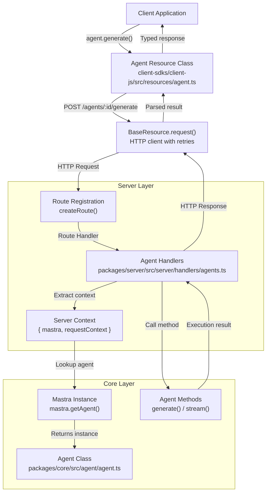
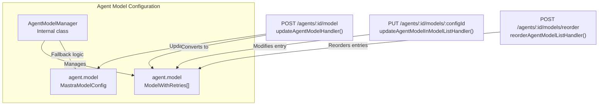
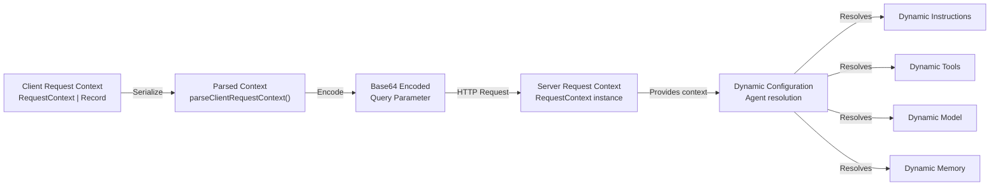

# Agent API Endpoints

<details>
<summary>Relevant source files</summary>

The following files were used as context for generating this wiki page:

- [client-sdks/client-js/src/client.ts](client-sdks/client-js/src/client.ts)
- [client-sdks/client-js/src/resources/agent.test.ts](client-sdks/client-js/src/resources/agent.test.ts)
- [client-sdks/client-js/src/resources/agent.ts](client-sdks/client-js/src/resources/agent.ts)
- [client-sdks/client-js/src/resources/agent.vnext.test.ts](client-sdks/client-js/src/resources/agent.vnext.test.ts)
- [client-sdks/client-js/src/resources/index.ts](client-sdks/client-js/src/resources/index.ts)
- [client-sdks/client-js/src/types.ts](client-sdks/client-js/src/types.ts)
- [deployers/cloudflare/src/index.ts](deployers/cloudflare/src/index.ts)
- [deployers/netlify/src/index.ts](deployers/netlify/src/index.ts)
- [deployers/vercel/src/index.ts](deployers/vercel/src/index.ts)
- [docs/src/content/en/docs/deployment/studio.mdx](docs/src/content/en/docs/deployment/studio.mdx)
- [e2e-tests/create-mastra/create-mastra.test.ts](e2e-tests/create-mastra/create-mastra.test.ts)
- [e2e-tests/monorepo/monorepo.test.ts](e2e-tests/monorepo/monorepo.test.ts)
- [e2e-tests/monorepo/template/apps/custom/src/mastra/index.ts](e2e-tests/monorepo/template/apps/custom/src/mastra/index.ts)
- [packages/cli/src/commands/build/BuildBundler.ts](packages/cli/src/commands/build/BuildBundler.ts)
- [packages/cli/src/commands/build/build.ts](packages/cli/src/commands/build/build.ts)
- [packages/cli/src/commands/dev/DevBundler.ts](packages/cli/src/commands/dev/DevBundler.ts)
- [packages/cli/src/commands/dev/dev.ts](packages/cli/src/commands/dev/dev.ts)
- [packages/cli/src/commands/studio/studio.test.ts](packages/cli/src/commands/studio/studio.test.ts)
- [packages/cli/src/commands/studio/studio.ts](packages/cli/src/commands/studio/studio.ts)
- [packages/core/src/agent/**tests**/dynamic-model-fallback.test.ts](packages/core/src/agent/__tests__/dynamic-model-fallback.test.ts)
- [packages/core/src/bundler/index.ts](packages/core/src/bundler/index.ts)
- [packages/core/src/memory/mock.ts](packages/core/src/memory/mock.ts)
- [packages/core/src/storage/mock.test.ts](packages/core/src/storage/mock.test.ts)
- [packages/core/src/stream/aisdk/v5/transform.test.ts](packages/core/src/stream/aisdk/v5/transform.test.ts)
- [packages/core/src/stream/aisdk/v5/transform.ts](packages/core/src/stream/aisdk/v5/transform.ts)
- [packages/deployer/src/build/analyze.ts](packages/deployer/src/build/analyze.ts)
- [packages/deployer/src/build/analyze/**snapshots**/analyzeEntry.test.ts.snap](packages/deployer/src/build/analyze/__snapshots__/analyzeEntry.test.ts.snap)
- [packages/deployer/src/build/analyze/analyzeEntry.test.ts](packages/deployer/src/build/analyze/analyzeEntry.test.ts)
- [packages/deployer/src/build/analyze/analyzeEntry.ts](packages/deployer/src/build/analyze/analyzeEntry.ts)
- [packages/deployer/src/build/analyze/bundleExternals.test.ts](packages/deployer/src/build/analyze/bundleExternals.test.ts)
- [packages/deployer/src/build/analyze/bundleExternals.ts](packages/deployer/src/build/analyze/bundleExternals.ts)
- [packages/deployer/src/build/bundler.ts](packages/deployer/src/build/bundler.ts)
- [packages/deployer/src/build/utils.test.ts](packages/deployer/src/build/utils.test.ts)
- [packages/deployer/src/build/utils.ts](packages/deployer/src/build/utils.ts)
- [packages/deployer/src/build/watcher.test.ts](packages/deployer/src/build/watcher.test.ts)
- [packages/deployer/src/build/watcher.ts](packages/deployer/src/build/watcher.ts)
- [packages/deployer/src/bundler/index.ts](packages/deployer/src/bundler/index.ts)
- [packages/deployer/src/server/**tests**/option-studio-base.test.ts](packages/deployer/src/server/__tests__/option-studio-base.test.ts)
- [packages/deployer/src/server/index.ts](packages/deployer/src/server/index.ts)
- [packages/playground/e2e/tests/auth/infrastructure.spec.ts](packages/playground/e2e/tests/auth/infrastructure.spec.ts)
- [packages/playground/e2e/tests/auth/viewer-role.spec.ts](packages/playground/e2e/tests/auth/viewer-role.spec.ts)
- [packages/playground/index.html](packages/playground/index.html)
- [packages/playground/src/App.tsx](packages/playground/src/App.tsx)
- [packages/playground/src/components/ui/app-sidebar.tsx](packages/playground/src/components/ui/app-sidebar.tsx)
- [packages/server/src/server/handlers.ts](packages/server/src/server/handlers.ts)
- [packages/server/src/server/handlers/agent.test.ts](packages/server/src/server/handlers/agent.test.ts)
- [packages/server/src/server/handlers/agents.ts](packages/server/src/server/handlers/agents.ts)
- [packages/server/src/server/handlers/memory.test.ts](packages/server/src/server/handlers/memory.test.ts)
- [packages/server/src/server/handlers/memory.ts](packages/server/src/server/handlers/memory.ts)
- [packages/server/src/server/handlers/utils.test.ts](packages/server/src/server/handlers/utils.test.ts)
- [packages/server/src/server/handlers/utils.ts](packages/server/src/server/handlers/utils.ts)
- [packages/server/src/server/handlers/vector.test.ts](packages/server/src/server/handlers/vector.test.ts)
- [packages/server/src/server/schemas/memory.test.ts](packages/server/src/server/schemas/memory.test.ts)
- [packages/server/src/server/schemas/memory.ts](packages/server/src/server/schemas/memory.ts)

</details>

This document describes the HTTP API endpoints exposed by `@mastra/server` for interacting with agents. These endpoints enable client applications to list agents, generate responses, stream outputs, manage model configurations, and control agent behavior through a REST API.

For information about the Agent system architecture and execution pipeline, see [Agent System](#3). For client SDK usage patterns, see [Agent Client Operations](#10.2). For server initialization and configuration, see [Server Architecture and Setup](#9.1).

---

## Overview

The agent API provides HTTP endpoints for all core agent operations. The server handlers in [packages/server/src/server/handlers/agents.ts]() expose these endpoints, which are consumed by the client SDK in [client-sdks/client-js/src/resources/agent.ts]().

### Endpoint Categories

**Agent Discovery**

- `GET /agents` - List all registered agents
- `GET /agents/:agentId` - Get agent details
- `GET /agents/providers` - List available model providers

**Generation Endpoints**

- `POST /agents/:agentId/generate` - Synchronous generation (vNext)
- `POST /agents/:agentId/generate-legacy` - Synchronous generation (legacy)
- `POST /agents/:agentId/stream` - Streaming generation (vNext)
- `POST /agents/:agentId/stream-legacy` - Streaming generation (legacy)

**Model Management**

- `POST /agents/:agentId/model` - Update agent model
- `PUT /agents/:agentId/models/:modelConfigId` - Update model in model list
- `POST /agents/:agentId/models/reorder` - Reorder model fallback list

**Agent Operations**

- `POST /agents/:agentId/instructions/enhance` - Enhance agent instructions
- `POST /agents/:agentId/clone` - Clone agent to stored agent
- `POST /agents/:agentId/tools/:toolCallId/approve` - Approve tool execution
- `POST /agents/:agentId/tools/:toolCallId/decline` - Decline tool execution

**Voice Endpoints** (see [Agent Voice](#10.2) for details)

- `POST /agents/:agentId/voice/speak` - Text-to-speech
- `POST /agents/:agentId/voice/listen` - Speech-to-text
- `GET /agents/:agentId/voice/speakers` - List available speakers
- `GET /agents/:agentId/voice/listener` - Get listener config

Sources: [packages/server/src/server/handlers/agents.ts:1-700](), [client-sdks/client-js/src/resources/agent.ts:1-800]()

---

## Request Flow Architecture



Sources: [packages/server/src/server/handlers/agents.ts:1-100](), [client-sdks/client-js/src/resources/agent.ts:180-370](), [packages/server/src/server/server-adapter/routes/route-builder.ts]()

---

## Agent Discovery Endpoints

### List Agents

**Endpoint:** `GET /agents`

Returns all registered agents with their configurations. Supports optional request context for dynamic agent resolution and partial serialization to reduce response size.

**Query Parameters:**

- `requestContext` (base64-encoded JSON, optional) - Request context for dynamic configuration
- `partial` (boolean, optional) - Return partial agent data without schemas

**Request:**

```typescript
// Client SDK usage
const agents = await client.listAgents(requestContext, partial)
```

**Response:**

```typescript
Record<string, GetAgentResponse> where GetAgentResponse = {
  id: string;
  name: string;
  description?: string;
  instructions: AgentInstructions;
  tools: Record<string, GetToolResponse>;
  workflows: Record<string, GetWorkflowResponse>;
  agents: Record<string, { id: string; name: string }>;
  skills?: SkillMetadata[];
  workspaceTools?: string[];
  workspaceId?: string;
  provider: string;
  modelId: string;
  modelVersion: string;
  modelList?: Array<{
    id: string;
    enabled: boolean;
    maxRetries: number;
    model: { modelId: string; provider: string; modelVersion: string };
  }>;
  inputProcessors?: Array<{ id: string; name: string }>;
  outputProcessors?: Array<{ id: string; name: string }>;
  defaultOptions: WithoutMethods<AgentExecutionOptions>;
  requestContextSchema?: string; // Serialized JSON schema
  source?: 'code' | 'stored';
  activeVersionId?: string; // For stored agents
}
```

**Handler Implementation:**

- Route: `LIST_AGENTS_ROUTE` in [packages/server/src/server/handlers/agents.ts:700-750]()
- Iterates over `mastra.listAgents()`
- Calls `formatAgentList()` for serialization [packages/server/src/server/handlers/agents.ts:390-500]()
- Handles both code agents and stored agents
- Resolves dynamic configurations using provided request context

Sources: [packages/server/src/server/handlers/agents.ts:700-800](), [client-sdks/client-js/src/types.ts:90-126](), [client-sdks/client-js/src/client.ts:81-99]()

---

### Get Agent Details

**Endpoint:** `GET /agents/:agentId`

Retrieves detailed information about a specific agent.

**Path Parameters:**

- `agentId` (string, required) - Agent identifier

**Query Parameters:**

- `requestContext` (base64-encoded JSON, optional) - Request context

**Request:**

```typescript
// Client SDK usage
const agent = client.getAgent('weatherAgent')
const details = await agent.details(requestContext)
```

**Response:** Same structure as `GetAgentResponse` above

**Handler Implementation:**

- Route: `GET_AGENT_BY_ID_ROUTE` in [packages/server/src/server/handlers/agents.ts:800-850]()
- Validates agent exists via `mastra.getAgent(agentId)`
- Returns serialized agent configuration
- Throws `HTTPException` with 404 if agent not found

Sources: [packages/server/src/server/handlers/agents.ts:800-850](), [client-sdks/client-js/src/resources/agent.ts:192-199]()

---

### List Model Providers

**Endpoint:** `GET /agents/providers`

Returns available model providers and their connection status.

**Response:**

```typescript
{
  providers: Array<{
    id: string
    name: string
    connected: boolean
  }>
}
```

**Provider Connection Logic:**
The `isProviderConnected()` function checks environment variables:

- Strips provider suffix (e.g., "openai.chat" → "openai")
- Handles custom gateway providers (e.g., "acme/acme-openai")
- Verifies all required API key environment variables are set
- Implementation: [packages/server/src/server/handlers/agents.ts:68-95]()

Sources: [packages/server/src/server/handlers/agents.ts:68-95](), [client-sdks/client-js/src/client.ts:101-103]()

---

## Generation Endpoints

### Generate (vNext)

**Endpoint:** `POST /agents/:agentId/generate`

Synchronous generation using the modern agent API. Supports structured output, client tools, and memory configuration.

**Request Body:**

```typescript
{
  messages: MessageListInput;
  memory?: {
    thread: string | { id: string; ... };
    resource: string;
  };
  structuredOutput?: {
    schema: ZodSchema | JSONSchema7; // Serialized as JSON
    instructions?: string;
    model?: MastraModelConfig;
    errorStrategy?: 'strict' | 'warn' | 'fallback';
    fallbackValue?: OUTPUT;
  };
  clientTools?: ToolsInput;
  requestContext?: RequestContext | Record<string, any>;
  maxSteps?: number;
  toolChoice?: 'auto' | 'none' | 'required' | { type: 'tool'; toolName: string };
  modelSettings?: { temperature?: number; maxTokens?: number; ... };
  tracingOptions?: TracingOptions;
  // ... other AgentExecutionOptions
}
```

**Response:**

```typescript
{
  text: string;
  object?: OUTPUT; // If structuredOutput provided
  finishReason: 'stop' | 'length' | 'tool-calls' | 'content-filter' | 'error';
  usage: { inputTokens: number; outputTokens: number; totalTokens: number };
  steps: Array<StepResult>;
  toolCalls: Array<ToolCallPayload>;
  toolResults: Array<ToolResultPayload>;
  messages: CoreMessage[];
  response: { headers: Record<string, string>; ... };
}
```

**Client-Side Tool Execution:**
If `finishReason === 'tool-calls'` and client tools are provided, the client SDK automatically:

1. Finds matching tool in `clientTools`
2. Executes tool with provided arguments
3. Recursively calls `generate()` with tool result messages
4. Returns final response after tool execution completes

Implementation: [client-sdks/client-js/src/resources/agent.ts:316-369]()

**Handler Implementation:**

- Route: `GENERATE_AGENT_ROUTE` in [packages/server/src/server/handlers/agents.ts:1100-1200]()
- Validates request body with `agentExecutionBodySchema`
- Resolves effective thread ID and resource ID
- Validates thread ownership if thread ID provided
- Calls `agent.generate(messages, options)`
- Returns `FullOutput<OUTPUT>` result

Sources: [packages/server/src/server/handlers/agents.ts:1100-1200](), [client-sdks/client-js/src/resources/agent.ts:316-369](), [client-sdks/client-js/src/types.ts:148-160]()

---

### Generate Legacy

**Endpoint:** `POST /agents/:agentId/generate-legacy`

Synchronous generation using the legacy AI SDK v4 API. Supports `output` and `experimental_output` schemas.

**Request Body:**

```typescript
{
  messages: string | string[] | CoreMessage[] | AiMessageType[] | UIMessageWithMetadata[];
  output?: ZodSchema | JSONSchema7; // For structured output (no tools)
  experimental_output?: ZodSchema | JSONSchema7; // For structured output with tools
  clientTools?: ToolsInput;
  requestContext?: RequestContext | Record<string, any>;
  maxSteps?: number;
  toolChoice?: 'auto' | 'none' | 'required' | { type: 'tool'; toolName: string };
  // ... other AgentGenerateOptions
}
```

**Response:**

```typescript
{
  text: string;
  object?: OUTPUT; // If output or experimental_output provided
  finishReason: 'stop' | 'length' | 'tool-calls' | 'content-filter' | 'error';
  usage: { promptTokens: number; completionTokens: number; totalTokens: number };
  steps: Array<{ text: string; toolCalls: any[]; toolResults: any[]; }>;
  toolCalls: Array<{ toolName: string; args: any; toolCallId: string }>;
  messages: CoreMessage[];
  response: { headers: Record<string, string>; ... };
}
```

**Handler Implementation:**

- Route: `GENERATE_LEGACY_AGENT_ROUTE` in [packages/server/src/server/handlers/agents.ts:1000-1100]()
- Validates request body with `agentExecutionLegacyBodySchema`
- Calls `agent.generateLegacy(messages, options)`
- Returns `GenerateReturn<any, OUTPUT, EXPERIMENTAL_OUTPUT>` result

Sources: [packages/server/src/server/handlers/agents.ts:1000-1100](), [client-sdks/client-js/src/resources/agent.ts:229-314](), [client-sdks/client-js/src/types.ts:128-136]()

---

### Stream (vNext)

**Endpoint:** `POST /agents/:agentId/stream`

Streaming generation using Server-Sent Events (SSE). Enables real-time response streaming with support for text deltas, tool calls, and structured output.

**Request Body:** Same as Generate (vNext)

**Response:** Server-Sent Events stream with the following event types:

| Event Type     | Payload                                                | Description                    |
| -------------- | ------------------------------------------------------ | ------------------------------ |
| `step-start`   | `{ messageId: string }`                                | New generation step begins     |
| `text-delta`   | `{ text: string }`                                     | Incremental text chunk         |
| `text-end`     | `{ text: string }`                                     | Complete text for current part |
| `tool-call`    | `{ toolCallId: string; toolName: string; args: any }`  | Tool invocation                |
| `tool-result`  | `{ toolCallId: string; result: any }`                  | Tool execution result          |
| `object-delta` | `{ object: Partial<OUTPUT> }`                          | Partial structured output      |
| `object-end`   | `{ object: OUTPUT }`                                   | Complete structured output     |
| `step-finish`  | `{ stepResult: { isContinued: boolean } }`             | Step completes                 |
| `finish`       | `{ stepResult: { reason: string }; usage: UsageInfo }` | Generation complete            |
| `error`        | `{ error: string }`                                    | Error occurred                 |

**SSE Format:**

```
data: {"type":"step-start","payload":{"messageId":"msg-123"}}

data: {"type":"text-delta","payload":{"text":"Hello"}}

data: {"type":"finish","payload":{"stepResult":{"reason":"stop"},"usage":{"totalTokens":42}}}

data: [DONE]
```

**Client Processing:**
The client SDK provides `processDataStream()` for consuming the stream:

```typescript
const resp = await agent.stream('What is the weather?')
await resp.processDataStream({
  onChunk: async (chunk) => {
    console.log('Received:', chunk.type, chunk.payload)
  },
  onFinish: async (result) => {
    console.log('Complete:', result.text)
  },
})
```

**Handler Implementation:**

- Route: `STREAM_GENERATE_ROUTE` in [packages/server/src/server/handlers/agents.ts:1300-1400]()
- Calls `agent.stream(messages, options)`
- Converts `MastraModelOutput` stream to SSE format using `processMastraStream()`
- Sets `Content-Type: text/event-stream` header
- Implementation: [client-sdks/client-js/src/utils/process-mastra-stream.ts:1-200]()

Sources: [packages/server/src/server/handlers/agents.ts:1300-1400](), [client-sdks/client-js/src/resources/agent.ts:516-730](), [client-sdks/client-js/src/utils/process-mastra-stream.ts:1-200]()

---

### Stream Legacy

**Endpoint:** `POST /agents/:agentId/stream-legacy`

Streaming generation using the legacy AI SDK v4 API with SSE.

**Request Body:** Same as Generate Legacy

**Response:** SSE stream with events compatible with AI SDK v4 format

**Handler Implementation:**

- Route: `STREAM_GENERATE_LEGACY_ROUTE` in [packages/server/src/server/handlers/agents.ts:1200-1300]()
- Calls `agent.streamLegacy(messages, options)`
- Converts legacy stream format to SSE

Sources: [packages/server/src/server/handlers/agents.ts:1200-1300](), [client-sdks/client-js/src/resources/agent.ts:732-850]()

---

## Model Management Endpoints



Sources: [packages/server/src/server/handlers/agents.ts:1500-1700]()

---

### Update Agent Model

**Endpoint:** `POST /agents/:agentId/model`

Updates the agent's model configuration. If the agent has a model list, this replaces the entire list with a single model. If the agent has a single model, this updates it.

**Path Parameters:**

- `agentId` (string, required) - Agent identifier

**Request Body:**

```typescript
{
  modelId: string // e.g., "gpt-4o", "claude-3-5-sonnet-20241022"
  provider: 'openai' | 'anthropic' | 'groq' | 'xai' | 'google'
}
```

**Response:**

```typescript
{
  success: boolean;
  modelList?: Array<{
    id: string;
    enabled: boolean;
    maxRetries: number;
    model: { modelId: string; provider: string; modelVersion: string };
  }>;
}
```

**Behavior:**

- For single model agents: Updates `agent.model` directly
- For model list agents: Converts to single-entry model list
- Preserves `maxRetries` from previous configuration
- Returns updated model list structure

**Handler Implementation:**

- Route: `UPDATE_AGENT_MODEL_ROUTE` in [packages/server/src/server/handlers/agents.ts:1500-1600]()
- Validates request body with `updateAgentModelBodySchema`
- Calls `agent.__updateModel(modelConfig)` internal method
- Returns success status and new model list (if applicable)

Sources: [packages/server/src/server/handlers/agents.ts:1500-1600](), [client-sdks/client-js/src/resources/agent.ts:852-860](), [packages/server/src/server/schemas/agents.ts:200-220]()

---

### Update Model in Model List

**Endpoint:** `PUT /agents/:agentId/models/:modelConfigId`

Updates a specific model configuration within an agent's model list. Only works for agents with model lists (fallback configurations).

**Path Parameters:**

- `agentId` (string, required) - Agent identifier
- `modelConfigId` (string, required) - Model configuration ID

**Request Body:**

```typescript
{
  model?: {
    modelId: string;
    provider: 'openai' | 'anthropic' | 'groq' | 'xai' | 'google';
  };
  maxRetries?: number;
  enabled?: boolean;
}
```

**Response:**

```typescript
{
  success: boolean
  modelList: Array<{
    id: string
    enabled: boolean
    maxRetries: number
    model: { modelId: string; provider: string; modelVersion: string }
  }>
}
```

**Handler Implementation:**

- Route: `UPDATE_AGENT_MODEL_IN_MODEL_LIST_ROUTE` in [packages/server/src/server/handlers/agents.ts:1600-1700]()
- Validates agent has model list (throws 400 if single model)
- Finds model config by ID
- Updates specified fields (model, maxRetries, enabled)
- Returns updated model list

Sources: [packages/server/src/server/handlers/agents.ts:1600-1700](), [client-sdks/client-js/src/resources/agent.ts:862-875]()

---

### Reorder Model List

**Endpoint:** `POST /agents/:agentId/models/reorder`

Reorders the model fallback list. The order determines fallback priority when models fail.

**Path Parameters:**

- `agentId` (string, required) - Agent identifier

**Request Body:**

```typescript
{
  reorderedModelIds: string[]; // Array of model config IDs in desired order
}
```

**Response:**

```typescript
{
  success: boolean
  modelList: Array<{
    id: string
    enabled: boolean
    maxRetries: number
    model: { modelId: string; provider: string; modelVersion: string }
  }>
}
```

**Validation:**

- All model config IDs must exist in current list
- No duplicate IDs allowed
- Order of `reorderedModelIds` becomes new order

**Handler Implementation:**

- Route: `REORDER_AGENT_MODEL_LIST_ROUTE` in [packages/server/src/server/handlers/agents.ts:1700-1800]()
- Validates all IDs exist and match current list
- Reorders model list according to provided array
- Returns updated model list

Sources: [packages/server/src/server/handlers/agents.ts:1700-1800](), [client-sdks/client-js/src/resources/agent.ts:877-882]()

---

## Agent Operations

### Enhance Instructions

**Endpoint:** `POST /agents/:agentId/instructions/enhance`

Uses an LLM to improve agent instructions based on user feedback.

**Path Parameters:**

- `agentId` (string, required) - Agent identifier

**Request Body:**

```typescript
{
  instructions: string // Current instructions
  comment: string // Feedback/improvement request
}
```

**Response:**

```typescript
{
  explanation: string // Why changes were made
  new_prompt: string // Enhanced instructions
}
```

**Handler Implementation:**

- Route: `ENHANCE_INSTRUCTIONS_ROUTE` in [packages/server/src/server/handlers/agents.ts:1900-2000]()
- Uses internal LLM to enhance instructions
- Returns explanation and improved prompt
- Does not persist changes to agent (client must call update)

Sources: [packages/server/src/server/handlers/agents.ts:1900-2000](), [client-sdks/client-js/src/resources/agent.ts:201-206]()

---

### Clone Agent

**Endpoint:** `POST /agents/:agentId/clone`

Creates a new stored agent by cloning an existing agent's configuration.

**Path Parameters:**

- `agentId` (string, required) - Source agent identifier

**Request Body:**

```typescript
{
  newId?: string; // ID for cloned agent (auto-generated if not provided)
  newName?: string; // Name for cloned agent
  metadata?: Record<string, any>; // Additional metadata
  authorId?: string; // Creator ID
  requestContext?: RequestContext | Record<string, any>;
}
```

**Response:**

```typescript
StoredAgentResponse // See Stored Agents documentation
```

**Handler Implementation:**

- Calls `agent.clone(params)`
- Creates new stored agent record with cloned configuration
- Returns created agent details

Sources: [client-sdks/client-js/src/resources/agent.ts:208-222](), [client-sdks/client-js/src/types.ts:761-780]()

---

## Tool Approval Endpoints

These endpoints support human-in-the-loop tool execution by allowing tools to be suspended pending approval.

### Approve Tool Call

**Endpoint:** `POST /agents/:agentId/tools/:toolCallId/approve`

Approves a suspended tool execution and resumes agent processing.

**Path Parameters:**

- `agentId` (string, required) - Agent identifier
- `toolCallId` (string, required) - Tool call identifier

**Request Body:**

```typescript
{
  runId?: string; // Execution run ID
  threadId?: string; // Thread ID
  resourceId?: string; // Resource ID
  requestContext?: RequestContext | Record<string, any>;
}
```

**Response:**

```typescript
{
  status: 'approved'
  toolCallId: string
}
```

**Handler Implementation:**

- Route: `APPROVE_TOOL_CALL_ROUTE` in [packages/server/src/server/handlers/agents.ts:1800-1850]()
- Retrieves suspended tool execution from cache
- Marks as approved
- Agent will resume execution on next poll

Sources: [packages/server/src/server/handlers/agents.ts:1800-1850](), [client-sdks/client-js/src/resources/agent.ts:884-894]()

---

### Decline Tool Call

**Endpoint:** `POST /agents/:agentId/tools/:toolCallId/decline`

Declines a suspended tool execution with optional reason.

**Path Parameters:**

- `agentId` (string, required) - Agent identifier
- `toolCallId` (string, required) - Tool call identifier

**Request Body:**

```typescript
{
  runId?: string;
  threadId?: string;
  resourceId?: string;
  reason?: string; // Reason for decline
  requestContext?: RequestContext | Record<string, any>;
}
```

**Response:**

```typescript
{
  status: 'declined';
  toolCallId: string;
  reason?: string;
}
```

**Handler Implementation:**

- Route: `DECLINE_TOOL_CALL_ROUTE` in [packages/server/src/server/handlers/agents.ts:1850-1900]()
- Retrieves suspended tool execution from cache
- Marks as declined with reason
- Agent will handle decline on next poll

Sources: [packages/server/src/server/handlers/agents.ts:1850-1900](), [client-sdks/client-js/src/resources/agent.ts:896-907]()

---

## Request Context Handling

All agent endpoints support `requestContext` for dynamic configuration resolution. The request context enables per-request customization of agent behavior.

### Request Context Flow



**Client Encoding:**

```typescript
// In client SDK
parseClientRequestContext(requestContext)
// Converts RequestContext to plain object or returns Record as-is

base64RequestContext(parsedContext)
// Base64 encodes for query parameter transmission
```

**Server Decoding:**

```typescript
// In server handler
const requestContext = new RequestContext(req.query.requestContext)
// Decodes and creates RequestContext instance for agent methods
```

**Usage in Handlers:**

- Thread ID resolution: `getEffectiveThreadId(body.memory, body.requestContext)`
- Resource ID resolution: `getEffectiveResourceId(body.memory, body.requestContext)`
- Thread ownership validation: `validateThreadOwnership(threadId, agent, requestContext)`
- Dynamic agent configuration: Passed to all agent methods

Sources: [client-sdks/client-js/src/utils/index.ts:1-50](), [packages/server/src/server/handlers/utils.ts:1-200](), [packages/core/src/request-context/index.ts:1-100]()

---

## Error Handling

### HTTP Exceptions

Handlers throw `HTTPException` for various error conditions:

| Status Code | Scenario                           | Example                              |
| ----------- | ---------------------------------- | ------------------------------------ |
| 400         | Invalid request body               | Missing required fields              |
| 404         | Agent not found                    | `mastra.getAgent()` throws           |
| 403         | Thread ownership validation failed | Thread belongs to different resource |
| 500         | Internal server error              | Agent execution failure              |

**HTTPException Structure:**

```typescript
throw new HTTPException({
  status: 404,
  message: 'Agent not found',
  details: { agentId },
})
```

**Client Error Handling:**

```typescript
try {
  const result = await agent.generate('Hello')
} catch (error) {
  // Error contains status, message, and details
  console.error(error.message, error.status)
}
```

Sources: [packages/server/src/server/http-exception.ts:1-50](), [packages/server/src/server/handlers/error.ts:1-100]()

---

## Serialization Details

### Agent Serialization

The `formatAgentList()` function serializes agents for API responses:

**Tool Serialization:**

- Converts Zod schemas to JSON Schema via `zodToJsonSchema()`
- Serializes with SuperJSON for complex types
- Implementation: [packages/server/src/server/handlers/agents.ts:168-247]()

**Processor Serialization:**

- Extracts processor ID and name
- Returns `{ id: string; name: string }`
- Implementation: [packages/server/src/server/handlers/agents.ts:249-260]()

**Skill Serialization:**

- Calls `workspace.skills.list()` if workspace configured
- Returns `{ name: string; description: string; license?: string }`
- Implementation: [packages/server/src/server/handlers/agents.ts:266-285]()

**Workspace Tools:**

- Determines available tools based on workspace configuration
- Checks filesystem (read-only vs read-write)
- Checks sandbox and search capabilities
- Implementation: [packages/server/src/server/handlers/agents.ts:292-359]()

**Model Information:**

- For single model: Extracts provider, modelId, modelVersion
- For model list: Serializes entire array with fallback configs
- Implementation: [packages/server/src/server/handlers/agents.ts:400-500]()

Sources: [packages/server/src/server/handlers/agents.ts:168-500]()

---

## Testing Endpoints

The test suite demonstrates endpoint usage patterns:

### List Agents Test

```typescript
// From: packages/server/src/server/handlers/agent.test.ts:95-168
const result = await LIST_AGENTS_ROUTE.handler({
  ...createTestServerContext({ mastra: mockMastra }),
  requestContext,
})
// Validates serialized agent structure
```

### Generate Test

```typescript
// Client SDK test: client-sdks/client-js/src/resources/agent.vnext.test.ts:41-68
const resp = await agent.stream('hi')
await resp.processDataStream({
  onChunk: async (chunk) => {
    // Process SSE chunks
  },
})
```

### Tool Approval Test Pattern

```typescript
// Suspend tool, get approval, continue execution
const result = await agent.stream('Use tool X', {
  requireToolApproval: true,
})
// Tool suspends, returns tool call ID
await client.approveTool(agentId, toolCallId)
// Agent resumes execution
```

Sources: [packages/server/src/server/handlers/agent.test.ts:1-300](), [client-sdks/client-js/src/resources/agent.vnext.test.ts:1-300]()
